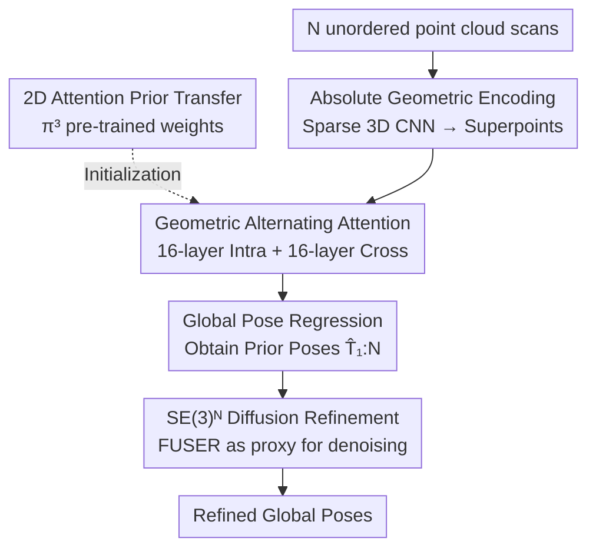

# FUSER: Feed-Forward Multiview 3D Registration Transformer and SE(3)$^N$ Diffusion Refinement

**Conference**: CVPR 2026  
**arXiv**: [2512.09373](https://arxiv.org/abs/2512.09373)  
**Code**: https://github.com/Jiang-HB/FUSER (Available)  
**Area**: 3D Vision / Point Cloud Registration  
**Keywords**: Multiview Registration, Feed-forward Transformer, Pose Synchronization, SE(3) Diffusion, 2D Prior Transfer

## TL;DR
FUSER transforms "multiview point cloud registration" from the traditional two-stage "pairwise matching + pose graph synchronization" pipeline into a single feed-forward inference. All scans are processed together in a compact latent space for joint reasoning, directly regressing global poses for each scan, followed by refinement using FUSER-DF, a diffusion model in the joint SE(3)$^N$ space. It significantly outperforms existing methods on ScanNet/3DMatch/ArkitScenes and reduces per-sequence processing time from hundreds of seconds to mere seconds.

## Background & Motivation

**Background**: Multiview point cloud registration aligns a set of unordered, partially overlapping scans into a common coordinate system by estimating a global rigid pose $\mathbf{T}_i=(\mathbf{R}_i,\mathbf{t}_i)\in SE(3)$ for each scan. The dominant approach is a **pairwise-then-global** two-stage pipeline: first performing pairwise registration for all scans to construct a pose graph with relative poses $\mathbf{T}_{i\leftarrow j}=\mathbf{T}_i^{-1}\mathbf{T}_j$ as edges, followed by transformation synchronization to solve for absolute global poses. Heavy research effort has focused on improving pairwise accuracy, under the implicit assumption that "more accurate pairwise matching naturally leads to more consistent multiview results."

**Limitations of Prior Work**: The authors identify four fundamental flaws in the two-stage pipeline: (i) **Lack of Global Context**: Every pairwise registration is performed independently without considering geometric constraints from other scans, leading to ambiguous relative poses in low-overlap or symmetric scenes; (ii) **Outlier Sensitivity**: A small number of incorrect relative poses can contaminate the synchronization process, with errors propagating through the pose graph; (iii) **High Compute Cost**: $N$ scans require $O(N^2)$ pairwise registrations, each repeating feature extraction and outlier removal, taking hundreds or thousands of seconds; (iv) **Heavy Inductive Bias**: It requires numerous manual designs such as graph sparsification, robust losses, and synchronization scheduling, limiting flexibility and obstructing global optimality.

**Key Challenge**: Forcing a holistic geometric problem (global consistency) into isolated pairwise sub-problems and then stitching them together loses global constraints and bakes error accumulation and computational waste into the paradigm itself.

**Goal**: To move beyond the two-stage paradigm by enabling the model to "see all scans" at once and directly output global poses for each scan.

**Key Insight**: Since 2D multiview reconstruction foundation models (like VGGT or $\pi^3$) have learned joint reasoning across views, can this paradigm of "joint attention on all scans" be transferred to 3D point clouds by migrating learned 2D attention priors?

**Core Idea**: Use a feed-forward Transformer for joint geometric reasoning on all scans in a compact latent space to directly regress global poses (FUSER), followed by a diffusion model in SE(3)$^N$ space (FUSER-DF) as a refinement step using FUSER’s estimates as a prior.

## Method

### Overall Architecture
The input to FUSER is a set of unordered, partially overlapping scans $\mathcal{S}=\{\mathbf{S}_i\}_{i=1}^N$, and the output is the global pose $\hat{\mathbf{T}}_i$ for each scan, without any pairwise registration. The workflow consists of: first, using an **absolute coordinate-aware sparse 3D CNN** to compress each scan into a small set of superpoint features, preserving absolute translation cues; next, a **Geometric Alternating Attention** module performs message passing between superpoints across all scans, alternating between "intra-scan" and "cross-scan" domains. This module is initialized using **2D Attention Prior Transfer** from pre-trained $\pi^3$ weights. Finally, a global pose head pools superpoint features into scan-level descriptors to regress translation and rotation. After FUSER provides initial poses, **SE(3)$^N$ Diffusion Refinement (FUSER-DF)** treats these as a prior to perform denoising-based small-step corrections on the joint pose manifold.

### Key Designs

**1. Absolute Geometric Encoding: Sparse 3D CNN preserving absolute translation cues**

Mainstream descriptors in the two-stage paradigm (e.g., GeoTransformer, RoITr) favor translation-invariant features, relying on relative coordinate normalization (e.g., KPConv) for stable pairwise matching. However, because FUSER regresses **absolute poses, especially translation**, this "location-independent" encoding becomes detrimental. Erasing global position cues makes translation regression naturally ill-posed. Instead, the authors use a MinkowskiEngine-based **absolute coordinate-aware sparse 3D CNN** for hierarchical voxelization and sparse convolution, yielding superpoints $\mathbf{S}'_i\in\mathbb{R}^{M_i'\times3}$ ($M_i'\ll M_i$) and features $\mathbf{F}_i$. To make joint attention on all scans computationally feasible, a deep five-layer sparse convolution hierarchy is used to keep the superpoint count low. Experiments show that even at this low resolution, superpoint features retain sufficient geometric information for accurate pose regression.

**2. Geometric Alternating Attention: Cross-scan reasoning with permutation invariance**

The Transformer consists of $L=32$ layers, alternating between 16 **intra-scan** blocks (capturing local geometry) and 16 **cross-scan** blocks (building global relationships between scans). Two specific issues are addressed: First, unlike VGGT which uses learnable reference tokens that make results sensitive to scan input order, FUSER removes these tokens to enforce permutation equivariance: $\operatorname{AA}(P_\pi(\mathcal{S}'),P_\pi(\mathcal{F}))=P_\pi(\operatorname{AA}(\mathcal{S}',\mathcal{F}))$. Second, instead of 2D RoPE, a sinusoidal position encoding is applied to the superpoint coordinates to inject absolute position cues into every attention layer. The authors found that 3D relative RoPE actually decreased performance because relative positions across different coordinate systems in cross-scan attention can be misleading.

**3. 2D-to-3D Attention Prior Transfer: Initializing 3D layers with 2D foundation model weights**

A key discovery is that transferring cross-view reasoning capabilities from 2D multiview reconstruction models is highly effective. The authors **directly initialize** FUSER’s alternating attention layers using pre-trained weights from $\pi^3$ (a VGGT variant). Since the architectures are naturally compatible (aside from position and feature encoding), the transfer is nearly cost-free. This transfer across the 2D-3D modal gap improves performance, which the authors attribute to **transferable attention priors** such as view grouping and alignment consistency being surprisingly effective for unstructured 3D point clouds. Removing this prior leads to a significant performance drop (see Table 4).

**4. FUSER-DF: SE(3)$^N$ Diffusion Refinement with FUSER as a proxy denoiser**

To further refine poses, multiview refinement is modeled as denoising diffusion on the **joint SE(3)$^N$ manifold**. Three modifications were made to standard pairwise SE(3) diffusion: (i) **Multiview expansion**: Instead of diffusing a single relative motion on $SE(3)$, the entire set of poses is diffused on $SE(3)^N$ to maintain cross-scan dependencies; (ii) **Prior-based refinement**: The reverse chain is initialized at the FUSER pose estimate $\hat{\mathbf{T}}_{1:N}$ rather than an uninformative identity transform $\mathbb{H}$; (iii) **Multiview proxy**: The denoiser traditionally uses a pairwise proxy; here, FUSER itself acts as the proxy $f_\theta^{mv}(\mathcal{S}_t)\triangleq\operatorname{FUSER}(\mathcal{S}_t)$. At each timestep, it re-estimates poses for noisy scans to provide residual transforms $\mathbf{T}_i^{t\to0}$. The forward diffusion interpolates from the ground truth pose toward the prior pose and adds noise. A **prior-conditioned variational lower bound** is used for training, where the "denoising matching term" is equivalent to predicting residual poses—the standard multiview registration objective.

### Loss & Training
FUSER employs **reference-free relative pose supervision**. Directly supervising absolute poses in the world frame is ill-posed as the world frame is inconsistent across sequences. Thus, for any $i\neq j$, the predicted relative pose $\hat{\mathbf{T}}_{i\leftarrow j}=\hat{\mathbf{T}}_i^{-1}\hat{\mathbf{T}}_j$ is supervised against the ground truth using three terms: geodesic rotation loss $\mathcal{L}_\mathbf{r}$, robust Huber translation loss $\mathcal{L}_\mathbf{t}$, and a point-wise loss $\mathcal{L}_\mathbf{p}$ for geometric consistency. The total loss is averaged over all $i\neq j$ with weights $\gamma_t, \gamma_p$ set to 0.1. Rotation is output via a 9D proxy and projected to $SO(3)$ via SVD. FUSER-DF is trained with $T=200$ steps and performs 10-step inference with perturbation weight $\gamma=0.1$. The model has ~0.6B parameters and was trained for 2 epochs on 8×L20 GPUs using four indoor datasets.

## Key Experimental Results

### Main Results
On three indoor datasets, FUSER/FUSER-DF requires 0 pairwise registrations (`#Pair`), whereas baselines require tens of thousands.

| Dataset | Metric | Best Baseline | FUSER | FUSER-DF |
|---------|--------|---------------|-------|----------|
| ScanNet (30 scans) | Mean/Median Trans Error (m) | MDGD 0.37/0.31 | 0.15/0.07 | **0.15/0.06** |
| ScanNet (30 scans) | Mean/Median Rot Error (°) | MDGD 17.4/19.0 | **6.7/2.1** | 7.1/2.0 |
| ScanNet (30 scans) | Rot@3° (%) | MDGD 56.1 | 69.4 | **72.0** |
| 3DMatch (60 scans) | RR (%) ↑ | Full+PARENet 61.9 | 90.3 | **92.0** |
| ArkitScenes (200 scans) | RR (%) ↑ | SGHR+GeoTrans 26.7 | 92.1 | **95.0** |

On ScanNet, compared to the strongest two-stage method MDGD, mean translation dropped from $0.37\to0.15$ m and mean rotation from $17.4°\to6.7°$. On 3DMatch and ArkitScenes, the RR (Registration Recall) jumped from the 20-60 range to 90+, representing a massive gap.

### Inference Time (Single Sequence, sec)

| Setting | GeoTrans (Full) | PARENet (Full) | FUSER | FUSER-DF |
|---------|-----------------|----------------|-------|----------|
| 3DMatch (60 scans) | 495.4 | 384.0 | **0.31** | 2.91 |
| ArkitScenes (200 scans) | 2454.6 | 1831.3 | **0.61** | 6.50 |

FUSER reduces processing time to sub-second levels, while two-stage methods take hundreds or thousands of seconds due to repeated pairwise matching. Memory usage for a 200-scan sequence is also efficient: FUSER 2.83G, FUSER-DF 5.09G.

### Ablation Study (ScanNet)

| Configuration | Rot@3° (%) | Mean Rot Error (°) | Mean Trans Error (m) |
|---------------|-----------|--------------------|----------------------|
| Full FUSER (4 datasets) | 69.4 | 6.7 | 0.15 |
| FUSER w/o 2D Prior (ScanN only) | 12.9 | 34.8 | 0.74 |
| FUSER (ScanN only) | 36.6 | 22.6 | 0.45 |

### Key Findings
- **2D attention prior is the main performance driver**: Removing $\pi^3$ initialization caused Rot@3° to plummet from 36.6 to 12.9, highlighting the value of cross-modal transfer.
- **Strong data scaling effect**: Scaling training from 1 to 4 datasets improved mean rotation from $22.6°$ to $6.7°$, demonstrating the potential for 3D foundation models.
- **FUSER-DF is not strictly better everywhere**: While it improves the strict Rot@3° threshold and median error (leading to smoother reconstructions), mean errors on ScanNet slightly increased ($6.7°\to7.1°$), suggesting it mainly tightens high-accuracy cases rather than solving difficult outliers.

## Highlights & Insights
- **Paradigm Shift**: Replacing the "pairwise + synchronization" pipeline with a single joint feed-forward inference eliminates error accumulation and $O(N^2)$ complexity, improving efficiency by orders of magnitude.
- **Zero-cost 2D-to-3D Transfer**: The ability to migrate weights from 2D multiview foundation models without architectural changes is a powerful trick for any 3D task requiring cross-view joint reasoning.
- **Absolute vs. Relative Encoding**: The study reveals that for direct absolute pose regression, standard translation-invariant encodings are detrimental, and absolute coordinate-aware encodings are essential.
- **Proxy Reuse**: Using the feed-forward model itself as the diffusion proxy for FUSER-DF is an elegant example of structural reuse.

## Limitations & Future Work
- **Model Weight and Data Requirements**: At 0.6B parameters and requiring 8×L20 GPUs with four large datasets, its reproducibility in low-compute/low-data scenarios is limited.
- **Mean Metrics**: FUSER-DF does not consistently outperform FUSER in mean error metrics, suggesting the diffusion refinement's robustness to hard cases can be improved.
- **Generalization**: Experiments were localized to indoor RGB-D reconstruction; effectiveness on outdoor large-scale LiDAR or dynamic scenes remains unverified.
- **Superpoint Resolution**: Relying on very low-resolution superpoints to save computation might lose details in fine-grained alignment or thin structure scenarios.

## Related Work & Insights
- **vs Synchronization Methods**: Existing methods focus on improving the pose graph (rejecting outliers, robust averaging). FUSER bypasses the pose graph entirely, providing a faster and more accurate alternative.
- **vs Pairwise SE(3) Diffusion**: Prior work diffused single relative motions from identity; FUSER-DF diffuses the joint $SE(3)^N$ manifold starting from a FUSER prior.
- **vs VGGT / $\pi^3$**: FUSER adapts their alternating attention paradigm for 3D point clouds by ensuring permutation equivariance and replacing 2D RoPE with 3D sinusoidal encodings.

## Rating
- Novelty: ⭐⭐⭐⭐⭐ First feed-forward multiview registration Transformer; groundbreaking use of $SE(3)^N$ diffusion and 2D-3D transfer.
- Experimental Thoroughness: ⭐⭐⭐⭐⭐ Strong baseline comparisons across three datasets, including time/memory and scaling analysis.
- Writing Quality: ⭐⭐⭐⭐ Clear motivation; however, the diffusion section is math-heavy and potentially difficult for non-experts.
- Value: ⭐⭐⭐⭐⭐ Significant accuracy gains and a massive reduction in runtime make this highly practical for 3D reconstruction and robotics.

<!-- RELATED:START -->

## Related Papers

- [\[CVPR 2026\] MVInverse: Feed-forward Multiview Inverse Rendering in Seconds](mvinverse_feed-forward_multiview_inverse_rendering_in_seconds.md)
- [\[CVPR 2026\] Z-Order Transformer for Feed-Forward Gaussian Splatting](z-order_transformer_for_feed-forward_gaussian_splatting.md)
- [\[CVPR 2026\] Feed-forward Gaussian Registration for Head Avatar Creation and Editing](feed-forward_gaussian_registration_for_head_avatar_creation_and_editing.md)
- [\[CVPR 2026\] Particulate: Feed-Forward 3D Object Articulation](particulate_feed-forward_3d_object_articulation.md)
- [\[CVPR 2026\] MoRe: Motion-aware Feed-forward 4D Reconstruction Transformer](more_motion-aware_feed-forward_4d_reconstruction_transformer.md)

<!-- RELATED:END -->
