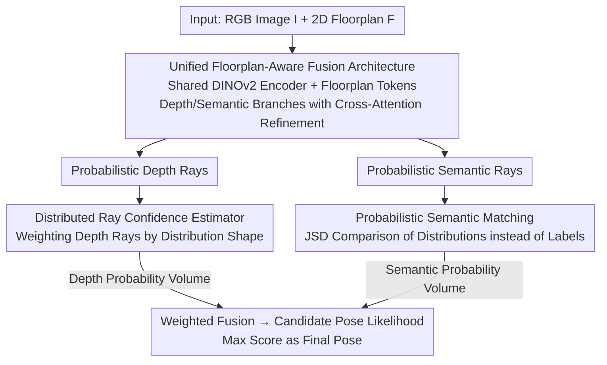

# Fusion of Depth and Semantics for Probabilistic Floorplan Localization

**Conference**: CVPR 2026  
**Paper**: [CVF Open Access](https://openaccess.thecvf.com/content/CVPR2026/html/Ye_Fusion_of_Depth_and_Semantics_for_Probabilistic_Floorplan_Localization_CVPR_2026_paper.html)  
**Code**: Not disclosed  
**Area**: 3D Vision  
**Keywords**: Floorplan Localization, Indoor Localization, Ray Matching, Depth-Semantic Fusion, Probabilistic Matching

## TL;DR
This paper reformulates the ray-matching task of "estimating camera pose on a 2D floorplan from a single RGB image" into a **probabilistic framework**: it couples depth and semantic ray predictions on shared representations, weights each depth ray using distribution-based confidence, and performs soft semantic matching via JSD. This approach simultaneously suppresses environmental, geometric, and semantic ambiguities in indoor scenes, significantly pushing the 1m·30° recall rate on Structured3D and ZInD (e.g., S3D-full 57.5% $\rightarrow$ 71.4%).

## Background & Motivation
**Background**: Indoor visual localization relying on 3D reconstruction or large image databases involves high mapping and maintenance costs. Floorplan localization offers an alternative — floorplans are lightweight, long-term stable, and appearance-insensitive, making them attractive for robotics and AR. Recent SOTA models this as **ray matching**: representing the image as a set of equiangular rays emitted from the camera, labeling each ray with depth or semantic tags, and aligning them with rays rendered from the floorplan to identify the highest-scoring candidate pose.

**Limitations of Prior Work**: Ray-matching methods fall into two categories, each with drawbacks. One relies solely on depth (F3Loc/UnLoc), providing strong metric information but struggling with geometric repetition in rooms with similar layouts. The other uses discrete semantic labels (e.g., SemRayLoc assigning hard "door/window" labels to rays) to improve discriminability, but hard labels combined with majority-voting downsampling **cannot represent the intrinsic ambiguity of semantics**. Crucially, both treat depth and semantic networks as separate entities trained independently, performing only a late-stage weighted fusion and losing the mutual constraints between geometry and semantics.

**Key Challenge**: The authors attribute the root cause to **perceptual ambiguity** in image-to-floorplan matching — an information asymmetry between rich but noisy image observations and sparse but structured floorplans, occurring across three axes: ① **Environmental Ambiguity**: Non-structural elements (furniture/dynamic occlusions) in RGB cause depth and semantics to anchor to different scene noises, failing to converge on a consistent interpretation; ② **Geometric Ambiguity**: Even with accurate depth estimation, a single ray may have multiple plausible depth candidates, requiring the selection of the one corresponding to the floorplan structure; ③ **Semantic Ambiguity**: Indoor semantics are often non-mutually exclusive (e.g., a glass door resembles both a door and a window), making hard labels brittle.

**Goal**: To handle these three types of ambiguities simultaneously within a unified framework rather than patching each individually.

**Core Idea**: Model depth and semantics jointly on the **same set of rays and a shared representation**, allowing feature-level mutual refinement. Keep predictions for each ray as **probability distributions** — using the distribution shape to estimate "how much to trust this depth ray" (confidence) and using JSD between distributions for semantic matching. This ensures ambiguity is preserved and utilized rather than being collapsed by hard labels.

## Method

### Overall Architecture
The input consists of a monocular RGB image $I$ and a 2D floorplan $F$ of the building; the output is the camera pose $p=(x,y,\theta)$ in the floorplan coordinate system. Following F3Loc, the state space is discretized into candidate poses. For each candidate, the observation likelihood $P(I\mid p,F)$ is constructed by comparing image observations with rays rendered from the floorplan.

The method consists of two stages. **Stage 1** — Unified Floorplan-Aware Fusion Architecture: A shared encoder plus coupled depth/semantic branches output floorplan-aligned probabilistic rays (each ray provides a depth distribution over discrete distance bins, a semantic category distribution, and a room type prediction). **Stage 2** — Converting ray-wise distributions to pose-wise observation likelihoods: Depth distributions are processed by a distribution-based ray confidence estimator to re-weight ray contributions; semantic distributions are matched with floorplan semantics using JSD to obtain a semantic probability volume. The two are weighted and summed, with the highest-scoring pose chosen as the result.

### Key Designs

**1. Unified Floorplan-Aware Fusion Architecture: Mutual Refinement of Geometry and Semantics**

This addresses "environmental ambiguity" and the issue of late-stage fusion in prior split-network methods. The insight is that geometry and semantics on the same ray are tightly coupled — whether a ray passes through a door constrains its feasible depth profile, while depth gradients provide strong evidence for semantic boundaries like "door frames."

Mechanism: A DINOv2 image encoder $\phi_{img}$ extracts dense feature maps $Z\in\mathbb{R}^{H\times W\times C}$ and a global descriptor $z_{cls}$ (for room classification). The floorplan and its mask are encoded by $\phi_{fp}$ into a global layout token $t_F\in\mathbb{R}^{C}$ to inject priors like scene scale and structural templates. **Vertical pooling** is applied to $Z$ to get $Z'$ with width $W_0$, where each ray $w$ corresponds to a sequence $S_w=[Z'_{1,w};\cdots;Z'_{H,w}]$. The floorplan token is appended to get $\hat S_w=[S_w;t_F]$. The depth and semantic branches maintain **learnable queries** $\{q^d_w\}, \{q^s_w\}$ to read initial representations through multi-head attention:

$$h^{d,0}_w=M(q^d_w,\hat S_w,\hat S_w),\qquad h^{s,0}_w=M(q^s_w,\hat S_w,\hat S_w).$$

This replaces fixed vertical mean pooling with modal-specific learnable readouts. Feature groups are سپس iteratively refined via **cross-attention blocks**. At layer $l$:

$$\hat H^{d,l}=CA(H^{d,l-1},H^{s,l-1}),\quad \hat H^{s,l}=CA(H^{s,l-1},H^{d,l-1}),$$

followed by residual feed-forward layers. This allows geometric ambiguity to be resolved by semantic context, and semantic predictions to be regularized by geometric structure.

**2. Distributed Ray Confidence Estimator: Judging Reliability via Depth Distribution Shape**

This handles "geometric ambiguity." Prior methods supervised predicted depth with floorplan GT, forcing the predictor to simultaneously estimate depth from image evidence and decide which depth to use for localization in cluttered scenes. The insight: **ambiguity is encoded in the distribution shape** (e.g., bimodal/multimodal distributions).

The "estimation" and "reliability assessment" are decoupled. The depth branch predicts depth distributions, while a lightweight confidence module down-weights unreliable rays. Given depth logits $x_i\in\mathbb{R}^{D}$ for ray $i$, the distribution is $\pi_i = \text{softmax}(x_i)$. Ray tokens, distributions, and the distribution entropy $H_i$ (an uncertainty scalar) are projected and concatenated to produce a scalar confidence $c_i=\sigma(f_c([f_{ray};f_{dist};H_i]))\in[0,1]$. During inference, for a candidate pose $p$ with rendered depth $d^{fp}_i(p)$, the geometry term is:

$$D_d(p)=\frac{1}{W_0}\sum_{i=1}^{W_0} c_i\,\lvert \hat d_i-d^{fp}_i(p)\rvert,$$

The confidence effectively penalizes bimodal distributions typical of geometric ambiguity.

**3. Probabilistic Semantic Matching (JSD): Preserving Semantic Ambiguity**

This addresses "semantic ambiguity." Typical SOTA models use hard labels and penalize mismatches based on label inequality, which fails to capture semantic overlap (e.g., glass doors) and loses information during downsampling. 

Ours compares **distributions instead of labels**. The semantic head outputs a probability vector for each ray. For candidate pose $p$ with target distribution $P_i$, semantic dissimilarity is measured via JSD:

$$D_s(p)=\sum_{i=1}^{W_0}\mathrm{JSD}(R_i\,\|\,P_i),$$

JSD is symmetric and bounded. It compares the **shapes** of $R_i$ and $P_i$; for "fuzzy but compatible" predictions, it assigns a finite reasonable penalty rather than a maximum penalty. Furthermore, because $R_i$ exists on a probability simplex, it can be **linearly interpolated** during downsampling (e.g., aggregating 40 rays into 9) without losing fine-grained structural information, unlike majority-voting with hard labels.

### Loss & Training
Ground truth floorplan depth is used for supervision but split: expected depth uses L1 loss, and confidence uses $L_{conf}=\frac{1}{W_0}\sum_i\big(\lvert \hat d_i-d^{gt}_i\rvert\cdot c_i+\lambda(1-c_i)^2\big)$. This forces the model to down-weight rays with large errors.

## Key Experimental Results

### Main Results
Evaluation on Structured3D (Synthetic: full/empty) and ZInD (Real). Metric: Recall (%) at 0.1m / 0.5m / 1m / 1m·30°.

| Dataset | Metric (1m·30°) | Ours | SemRayLoc (SOTA) | F3Loc | Note |
|--------|------|------|------|------|------|
| S3D (full) | Recall% | **71.4** | 57.5 | 21.3 | Gain: 13.9% |
| S3D (full) | 0.1m | **12.0** | 5.7 | 1.5 | Doubled precision |
| S3D (empty) | Recall% | **75.1** | 67.2 | 42.8 | |
| ZInD (Real) | Recall% | **50.2** | 31.9 | 11.5 | Generalization |

Robustness: Moving from empty to full (adding clutter), F3Loc drops 21.5%, SemRayLoc drops 9.7%, whereas Ours only drops 3.7%.

### Ablation Study
S3D (full), 1m·30° Recall (%). FPA=Floorplan-Aware, confidence=Distributed Confidence, JSD=Probabilistic Semantic Matching, refine=Refinement; UFA=Unified Fusion Architecture.

| Framework | FPA | confidence | JSD | refine | 1m·30° |
|------|-----|-----|-----|-----|------|
| SemRayLoc | ✗ | ✗ | ✗ | ✓ | 57.5 |
| UFA | ✗ | ✗ | ✗ | ✓ | 67.7 |
| UFA | ✓ | ✓ | ✓ | ✓ | **71.4** |

### Key Findings
- **Unified Fusion Architecture provides the largest gain**: UFA improves recall by 10.2% over the split networks of SemRayLoc, proving the necessity of joint depth-semantic reinforcement.
- **Floorplan-Awareness (FPA) shows minimal gain (+1.3%)**: Attributed to the lack of geometric diversity in S3D (mostly rectangular rooms).
- **Interpretability of Confidence Estimator**: High-entropy rays (multimodal due to occlusion) are correctly assigned low confidence.
- **JSD is more beneficial without refinement**: When compressing rays (e.g., from 40 to 9), JSD's linear interpolation preserves uncertainty better than hard-label majority voting.

## Highlights & Insights
- **Ambiguity as Information**: Rather than treating ambiguity as noise to be eliminated, the framework preserves it (probabilistic rays) and utilizes it (confidence weighting and JSD). This principle is transferable to other structural matching tasks (e.g., HD map matching).
- **Learnable Queries as Modal Readouts**: Using queries to extract modal-specific information from shared feature maps is an efficient way to distribute single representations across multiple tasks.
- **JSD vs. CE Diagnosis**: The authors identify specific failure points of Cross-Entropy (explosive cost at low target probabilities and temperature sensitivity) and use JSD as a bounded, symmetric alternative.

## Limitations & Future Work
- **Branch-level supervision and fixed weights**: Fusion weights are currently manually set; future work could explore end-to-end training for pose supervision to learn weights.
- **Limited FPA gains**: Gains from floorplan priors were not fully verified due to the structural simplicity of current datasets.
- **Discretization dependence**: Sensitivity to parameters like candidate pose granularity and depth bin count was not fully explored.

## Related Work & Insights
- **vs. SemRayLoc**: SemRayLoc uses hard labels and majority voting; this paper uses probability distributions, JSD matching, and coupled representations. 
- **vs. F3Loc / UnLoc**: While UnLoc uses Laplace distributions for depth, this paper argues for discrete distributions to capture multi-modal geometric ambiguity.
- **vs. LASER / LaLaLoc**: These focus on global embedding matching; this paper performs fine-grained ray-level matching suitable for monocular perspectives.

## Rating
- Novelty: ⭐⭐⭐⭐ Recasting ambiguity as a "probabilistic preservation" framework is a solid targeted design.
- Experimental Thoroughness: ⭐⭐⭐⭐ Complete evaluation across synthetic/real datasets and components, though lacks sensitivity analysis on discretization.
- Writing Quality: ⭐⭐⭐⭐⭐ Clear decomposition of the three ambiguities; the JSD vs. CE diagnosis is particularly insightful.
- Value: ⭐⭐⭐⭐ Robust performance in cluttered scenes; the "preserve rather than collapse ambiguity" approach has broad applicability.

<!-- RELATED:START -->

## Related Papers

- [\[ICLR 2026\] UnLoc: Leveraging Depth Uncertainties for Floorplan Localization](../../ICLR2026/3d_vision/unloc_leveraging_depth_uncertainties_for_floorplan_localization.md)
- [\[CVPR 2026\] C-GenReg: Training-Free 3D Point Cloud Registration by Multi-View-Consistent Geometry-to-Image Generation with Probabilistic Modalities Fusion](c-genreg_training-free_3d_point_cloud_registration_by_multi-view-consistent_geom.md)
- [\[CVPR 2026\] LoST: Level of Semantics Tokenization for 3D Shapes](lost_level_of_semantics_tokenization_for_3d_shapes.md)
- [\[CVPR 2026\] Towards Visual Query Localization in the 3D World](towards_visual_query_localization_in_the_3d_world.md)
- [\[CVPR 2026\] UniPixie: Unified and Probabilistic 3D Physics Learning via Flow Matching](unipixie_unified_and_probabilistic_3d_physics_learning_via_flow_matching.md)

<!-- RELATED:END -->
