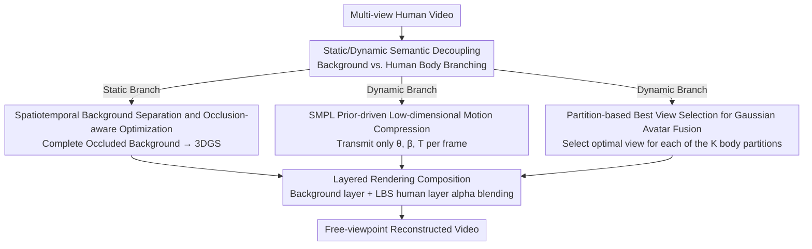

# GauMVC: Generative Decoupled Gaussian Representation for Human-centric Multi-view Video Compression

**Conference**: CVPR 2026  
**Paper**: [CVF Open Access](https://openaccess.thecvf.com/content/CVPR2026/html/Yan_GauMVC_Generative_Decoupled_Gaussian_Representation_for_Human-centric_Multi-view_Video_Compression_CVPR_2026_paper.html)  
**Code**: To be confirmed  
**Area**: 3D Vision / Multi-view Video Compression  
**Keywords**: Multi-view Video Compression, 3D Gaussian Splatting, SMPL Human Prior, Semantic Decoupling, Generative Compression

## TL;DR
GauMVC explicitly decouples "human-centric multi-view video" into two parts: a static background and a dynamic human body. The background is represented by a one-time 3D Gaussian field, while the human body is driven as a personalized Gaussian avatar using only a few key views and frame-wise SMPL pose parameters. This shifts compression from "removing pixel redundancy" to "transmitting semantic parameters and generating frames," enabling high-fidelity free-viewpoint video synthesis even at extremely low bitrates.

## Background & Motivation
**Background**: Human-centric multi-view video (MVV) serves as the foundation for immersive media (teleconferencing, virtual classrooms, free-viewpoint tourism). To enhance immersiveness, more camera viewpoints must be added, but the data volume scales almost linearly with the number of views, causing an explosion in storage and transmission costs. Traditional codecs (MV-HEVC, 3D-HEVC, MIV) compress via inter-view and inter-frame prediction, but the bitrate still rises approximately linearly with the viewpoint count. Recent neural scene representations (NeRF, 3DGS, and their dynamic extension 4DGS) reconstruct the entire video into a unified time-varying 3D representation to remove redundancy, representing a more promising direction.

**Limitations of Prior Work**: Even state-of-the-art methods that model static backgrounds and dynamic foregrounds separately still encode motion fields (deformation fields) or frame-by-frame residuals for the "dynamic part." The issue is that human motion **is not arbitrary**; it is strongly constrained by skeletal kinematics and human anatomy, essentially residing in a low-dimensional space determined by pose and shape. Using a generic point-wise deformation field to model such motion completely wastes this low-dimensional structural prior.

**Key Challenge**: The authors point out incisively that "the key challenge is not whether to separate, but how to compress the dynamic part after separation." Existing methods treat human motion as generic deformation/optical flow to encode high-dimensional motion signals, which mismatches the low-dimensional semantic nature of human motion, resulting in massive redundancy and poor rate-distortion performance.

**Goal**: Reframe human-centric MVV compression as a unified problem of "static scene compression + dynamic human synthesis," replacing high-dimensional motion signal encoding with low-dimensional parameter synthesis.

**Key Insight**: Since human motion can be compactly expressed by parametric models like SMPL, rather than transmitting motion fields, only "semantic parameters" should be transmitted, allowing the decoder to generate the frames.

**Core Idea**: The encoder transmits only three elements: a background Gaussian field, a few key views of the human body, and frame-wise SMPL parameters. The decoder drives the SMPL avatar and fuses it with the background accordingly, shifting the compression paradigm from "low-level redundancy removal" to "semantic-aware generative modeling."

## Method

### Overall Architecture
The input to GauMVC is a synchronously captured multi-view human video, and the output is the reconstructed video at any target viewpoint. Structurally, the entire scene is **semantically decoupled** into two complementary branches and compressed separately:

- **Static Branch**: Reconstructs the complete background (excluding human occlusion) from multi-view sequences, builds a temporally consistent 3D Gaussian background field, and compresses it into a compact bitstream. This is encoded only once.
- **Dynamic Branch**: Encodes frame-wise pose/shape (motion) using SMPL parameters and represents human appearance using a few "key views," from which the decoder generates a personalized Gaussian avatar. The key views and shape parameters are also transmitted only once, and only the SMPL pose sequence scales with the number of frames.

The decoder performs **layered rendering composition**: the static background layer is rendered directly, while the dynamic human layer is rendered into a foreground and an alpha mask after applying Linear Blend Skinning (LBS) deformation to the canonical avatar using decoded SMPL parameters. Finally, alpha blending is executed as $I_v^t = F_v^t \cdot \alpha_v^t + B_v^t \cdot (1-\alpha_v^t)$. Since the background and key views are temporally invariant and only the SMPL stream grows over time, the **total bitrate scales sub-linearly with the number of frames**, while the rendered pixels scale linearly with the number of frames and views. This is the fundamental reason for its increasing bitrate advantage in long sequences and dense capture scenarios.

### Key Designs

**1. Static/Dynamic Semantically Decoupled Compression Paradigm: Shifting from "Signal Transmission" to "Semantic Transmission and Generation"**

This represents a paradigm shift across the entire work. It addresses the limitation of modeling the entire multi-view video as a single representation (or only performing coarse foreground/background separation and encoding deformation fields), which generates massive redundancy mismatched with the low-dimensional nature of human motion. GauMVC explicitly decomposes the scene into two semantic components, "static background + dynamic human," and **transmits only three things** from the encoder—background Gaussian field, key views, and SMPL parameters—completely bypassing low-level motion residuals. This offers two direct benefits: first, a drastic reduction in bitrate (high-dimensional motion fields are replaced by low-dimensional parameter synthesis); second, it brings semantic interpretability—motion is encoded by its "causes" (pose/shape) rather than raw trajectories, naturally supporting content editing (background replacement, identity swapping, motion retargeting). The essential distinction from prior "separation + motion field encoding" methods is that the older methods still compress high-dimensional signals after separation, while GauMVC compresses low-dimensional semantics and lets the decoder **generate** the content.

**2. Spatiotemporal Background Separation and Occlusion-aware Optimization: Clearing Out Human Occlusion Before Constructing Gaussians**

The limitation is highly specific: moving humans constantly occlude the background, making it impossible to acquire a clean background from a single frame; thus, visible regions must be fused across frames. The static branch implements a four-stage pipeline. **(a) Spatiotemporal Static Region Extraction**: Keyframes are uniformly sampled for each viewpoint $v$, and a binary mask $M_v^t(p)$ (1 = visible background, 0 = human) is obtained using pre-trained human segmentation. It is slightly dilated to prevent boundary leakage. All visible background pixels are then temporally averaged to obtain the fused background $B_v(p)=\frac{\sum_t M_v^t(p) I_v^t(p)}{\sum_t M_v^t(p)+\epsilon}$. Meanwhile, a visibility mask $O_v(p)=1-\prod_t (1-M_v^t(p))$ is computed, marking permanently occluded pixels (never revealed in any frame) as 0. **(b) Occlusion-aware Initialization**: SfM is run only on static regions to yield a sparse point cloud, which is converted to 3D Gaussians $\mathcal{G}=\{g_i\}$ (each containing position, covariance, opacity, and spherical harmonic coefficients). These are projected and filtered via $O_v$, preserving only Gaussians whose 2D projections fall within permanently visible static areas across all viewpoints, i.e., $\mathcal{G}_{\text{clean}} \leftarrow \{g_i \mid O_v(\pi(g_i))=1,\ \forall v\}$, thereby eliminating ghosting artifacts caused by dynamic content. **(c) Mask-guided Optimization**: Supervising with full frames would overfit transient foregrounds into the background. Thus, loss is computed only on reliable background pixels: $\mathcal{L}_v = \sum_{p:O_v(p)=1}[(1-\lambda)\mathcal{L}_1(p) + \lambda \mathcal{L}_{\text{SSIM}}(p)]$ ($\lambda=0.8$), ensuring gradients originate strictly from static content. **(d) Gaussian Compression**: Ineffective Gaussians with $\alpha<\epsilon$ are pruned, followed by non-uniform scalar quantization based on visual sensitivity (high precision for position/rotation, aggressive quantization for high-order SH coefficients), and finally Huffman entropy coding. This entire pipeline guarantees that the background is both complete and clean, and compressed very compactly.

**3. SMPL Prior-driven Low-dimensional Motion Compression: Transmitting Tens of Parameters Per Frame instead of an Entire Motion Field**

This design directly addresses the key challenge of how to compress the dynamic part. Modeling human motion with frame-by-frame/primitive-wise deformation fields is redundant and prone to temporal inconsistency or anatomically implausible results. In contrast, SMPL compresses shape and joint poses into a highly low-dimensional parameter space. Each frame is described by $(\theta_t, \beta, T_t)$, where $\theta_t \in \mathbb{R}^{72}$ represents joint rotations, $\beta \in \mathbb{R}^{10}$ is the temporally invariant shape, and $T_t \in SE(3)$ is the global root translation. This yields two major advantages: first, **eliminating cross-view redundancy**—the same set of parameters can drive rendering for all viewpoints, avoiding the need to store copies for each view; second, **enforcing anatomical plausibility**—the skinning and pose priors prevent deformed or distorted human bodies. Consequently, compression degenerates into "encoding one shape vector $\beta$ + two low-dimensional sequences $(\theta_t, T_t)$," bypassing high-dimensional motion fields entirely. Parameters are initialized from the viewpoint with the least occlusion and then jointly optimized across viewpoints. After quantization, the temporal smoothness of motion creates strong statistical redundancy for integer streams, which is further compressed via Huffman coding.

**4. Partition-based Best View Selection for Gaussian Avatar Fusion: Stitching Artifact-Free Personalized Appearances Across Multi-view Images**

SMPL delivers motion but cannot capture personalized appearance. Transmitting the full multi-view video consumes too much bandwidth, while single-view avatar generators produce severe artifacts in unobserved regions (such as the back or sides) due to view extrapolation errors. The authors solve this with **partition-based best view fusion**: the human surface $S$ aligned to the initial frame is partitioned into $K$ regions $\{P_r\}$ (experimentally $K=5$). For each surface point $p$ and viewpoint $v$, depth features $z_{p,v}$ are extracted, and a visibility confidence score is defined as $c_{p,v}=\|z_{p,v}\|_2$. For each region, the optimal viewpoint that maximizes the aggregated confidence is selected: $v_r^* = \arg\max_v \sum_{p\in P_r} c_{p,v}$. This sparse set of key views is compressed and transmitted using VTM (since multiple regions often share the same optimal view, only 3–5 frames are sent in practice). At the decoder, each key view is fed into a generator to produce a full-body Gaussian field $\mathcal{G}_{v_r^*}$, but **only the Gaussians corresponding to that view's designated partition** are retained, i.e., $\mathcal{G}_r=\{g \in \mathcal{G}_{v_r^*} \mid p_g \in P_r\}$. Region boundaries are smoothly blended using distance-weighted mixing of attributes (color, scale, etc.) to form the final avatar $\mathcal{G}^*_{\text{fused}}$, which is then bound to the SMPL skeleton and animated via LBS. In short, instead of relying on any single perspective to cover the whole body, it uses whichever viewpoint sees each body partition most clearly.

### Loss & Training
Background optimization employs a mask-guided hybrid L1 + SSIM loss (see Design 2, $\lambda=0.8$, computed only on visible background pixels), optimized using Adam for 7000 steps. The pipeline is two-stage: "optimize static background once + drive dynamic parts with lightweight SMPL estimation", avoiding the expensive temporal optimization of high-dimensional time-varying fields seen in methods like 4DGS, leading to significantly higher training efficiency. Key engineering hyperparameters: one keyframe is sampled every $k=10$ frames; YOLOv8 generates human masks which are dilated by 50 pixels; during compression, Gaussians with $\alpha_i<0.005$ are pruned, and position/scale/rotation/opacity/SH coefficients are quantized to 8/6/4/4/4 bits respectively before Huffman coding; the SMPL surface is divided into $K=5$ partitions.

## Key Experimental Results

### Main Results
Datasets: Real-world AvatarRex (~2000 frames/sequence, surrounding multi-camera), ENeRF-Outdoor (~600 frames, semi-surrounding forward-facing), and synthetic Owlii-in-Scene (dynamic human meshes placed in 3D indoor scenes, rendered by 54 virtual cameras with complete GT). Baselines: traditional MV-HEVC, and 4DGS-based methods HUST-4DGS, ADC-GS, SpaceGaussians, and E-D3DGS. For fairness, all methods are aligned to an extremely low bitrate (CRF 40 for MV-HEVC).

Rate-distortion comparison on Actor05 from ENeRF-Outdoor (↑ is better, ↓ is better; Ours achieves near-comprehensive optimality on perceptual metrics, while PSNR/SSIM are slightly lower than E-D3DGS which uses a much higher bitrate):

| Method | SSIM↑ | PSNR(dB)↑ | VIFp↑ | DSS↑ | LPIPS↓ | DISTS↓ | PieAPP↓ |
|------|-------|-----------|-------|------|--------|--------|---------|
| MV-HEVC | 0.9064 | 26.52 | 0.2810 | 0.6257 | 0.1332 | 1.2499 | 0.0082 |
| HUST-4DGS | 0.8916 | 24.83 | 0.1885 | 0.4927 | 0.1465 | 1.5699 | 0.0255 |
| ADC-GS | 0.9332 | 26.85 | 0.2406 | 0.5781 | 0.1545 | 1.7236 | 0.0247 |
| SpaceGaussians | 0.9040 | 23.29 | 0.1993 | 0.4729 | 0.1337 | 1.5120 | 0.2805 |
| E-D3DGS | 0.9380 | 27.03 | 0.2541 | 0.6275 | 0.1299 | 1.3845 | 0.2849 |
| **Ours** | **0.9341** | **25.39** | **0.3099** | **0.6413** | **0.0862** | **0.8428** | **0.0042** |

⚠️ The BPP (bitrate) column was not clearly aligned due to OCR in the original paper. The main text states that Ours achieves the lowest bitrate among all methods, **less than 1/3 of the second best**; refer to the original paper for precise figures. The authors emphasize that "traditional pixel-level metrics can be misleading for generative compression"—although E-D3DGS has slightly higher PSNR/SSIM, its facial details are visibly blurry, so this paper primarily highlights perceptual metrics as the primary indicators.

Face fidelity comparison (AvatarRex, evaluated using DeepFace for Face Distance and Expression Similarity):

| Method | BPP↓ | Face Distance↓ | Expression Similarity↑ |
|------|------|----------------|------------------------|
| MV-HEVC | 0.0062 | 0.2666 | 0.6974 |
| HUST-4DGS | 0.0061 | 0.8799 | 0.6155 |
| E-D3DGS | 0.1956 | 0.8781 | 0.4240 |
| **Ours** | **0.0012** | **0.2205** | **0.9448** |

Ours leads across all three metrics: bitrate (0.0012, lowest), face distance (0.2205, lowest), and expression similarity (0.9448, highest), demonstrating that it preserves identity and expression cues remarkably well even at extremely low bitrates.

### Ablation Study
Static branch (ENeRF-Outdoor, qualitative, corresponding to Figure 5):

| Configuration | Phenomenon |
|------|------|
| Full Model | Background is clean and sharp, matching GT closely with no artifacts |
| w/o Interval Sampling | Background is blurry, losing high frequencies (e.g., ground textures); fails to learn a consistent static representation |
| w/o Mask Optimization | Dynamic elements are baked into the background, causing large dark spots |
| w/o Mask Dilation | Insufficient coverage of motion boundaries, leaving residual ghosting and blurry contours |
| Sampling Interval T=100 (Too large) | Hard to decouple static from dynamic; large blurry shadows remain after the subject moves away |

Dynamic branch (AvatarRex, corresponding to Figure 6): Using only a single fixed view (e.g., front) forces the generator to hallucinate unseen regions, leading to severe texture distortion on the back/sides. Conversely, partition-based best view fusion maintains appearance consistency across all viewpoints.

### Key Findings
- Mask optimization and mask dilation are crucial for static background quality: removing the former bakes dynamic content directly into the background (dark spots), while removing the latter leaves boundary ghosting; too large a sampling interval impairs static-dynamic decoupling.
- Partition-based best view fusion resolves the "extrapolation hallucination" problem of single-view avatars, acting as the core driver of fidelity in the dynamic branch.
- The bitrate **monotonically decreases** as sequences become longer and views become denser: background and key views are one-time costs, and only the SMPL stream grows with the frame count (sub-linearly), whereas the pixel budget scales linearly with both frames and views. For short, sparse captures (e.g., 10 views/300 frames), Ours actually yields a higher bpp than MV-HEVC (since the one-time static overhead cannot be amortized), but for long, dense captures (e.g., 50 views/800 frames), Ours achieved a far lower bpp than baselines. 4DGS-based methods suffer from unbounded GPU memory and limited scalability due to frame-by-frame modeling.

## Highlights & Insights
- **Precise localization of the paradigm shift**: "The key challenge is not whether to separate, but how to compress the dynamic part after separation"—this statement breaks through the blind spot of previous "separation + motion field encoding" methods. Replacing high-dimensional motion signals with low-dimensional parameter synthesis is the most refreshing "Aha!" moment of this paper.
- The fact that the **bitrate monotonically decreases relative to sequence length** is a counter-intuitive yet elegant property: because the dominant overhead (background + key views) is settled upfront, longer videos and denser views make it more efficient, rendering it naturally suited for long-term, dense-capture immersive streaming.
- **Transferable design**: The concept of partition-based best view fusion (selecting the optimal viewpoint for each body region and stitching them) can be transferred to any task where "single-view generation is prone to hallucinations in unobserved regions," such as single-image reconstruction or novel view synthesis. The layered design of the semantically decoupled bitstream also immediately unlocks bitstream-level editing capabilities (background replacement, identity swapping, motion retargeting).
- Defining the visibility confidence simply as the L2 norm of depth features, $c_{p,v}=\|z_{p,v}\|_2$, utilizes a single scalar to determine "which viewpoint provides the most reliable observation of this body partition," which is exceptionally lightweight and elegant.

## Limitations & Future Work
- The authors acknowledge that the current design primarily targets **single-actor scenes with clean human-background separation**. When human-object interactions or multi-person scenarios are involved, the separation assumption becomes unreliable. Future work proposes introducing instance-level segmentation or an additional "object layer" (compressed using specialized priors for static appearance + rigid motion).
- Although SMPL is an efficient motion prior, it struggling to capture highly non-rigid effects (e.g., loose clothing deformation); more expressive deformation models are required to capture these details without sacrificing bitrate.
- Self-discovered limitations: The method depends heavily on a sequence of pre-trained components (YOLOv8 for human segmentation, SfM, single-view Gaussian avatar generator, SMPL estimation). A failure in any phase propagates to the final quality; additionally, the BPP column of the main results in the public version is not cleanly labeled, requiring cautious cross-referencing with the original text regarding cross-method bitrate alignment details (CRF 40 vs. 4DGS counterparts).

## Related Work & Insights
- **vs. Traditional codecs (MV-HEVC / MIV)**: Traditional codecs compress using inter-view/inter-frame predictions, so the bitrate scales approximately linearly with the view count. This work uses a unified 3D representation + semantic parameters, yielding sub-linear bitrate scaling with the sequence length, showing clear advantages in extremely low-bitrate domains, though suffering from a one-time static overhead disadvantage in short, sparse scenarios.
- **vs. 4DGS-based methods (HUST-4DGS / E-D3DGS / ADC-GS / SpaceGaussians)**: They encode dynamic content as generic deformation fields or frame-by-frame Gaussians, ignoring the low-dimensional skeletal structure of human motion, which leads to high redundancy and unbounded memory for long sequences. Conversely, Ours utilizes SMPL priors to compress motion into tens of parameters, aligning with the intrinsic structure of human motion, demonstrating superior rate-distortion and scalability under long, dense captures.
- **vs. Single-view Gaussian avatar generators**: Single-view generation hallucinates severe artifacts in unobserved regions. This work deploys partition-based best view fusion, ensuring each body partition is modeled by its "clearest" perspective, stitching together artifact-free avatars.

## Rating
- Novelty: ⭐⭐⭐⭐⭐ Reframing human-centric MVV compression as "static compression + dynamic parametric synthesis" represents a clean and decisive paradigm shift.
- Experimental Thoroughness: ⭐⭐⭐⭐ Covers multiple real/synthetic datasets, comprehensive perceptual metrics, and bitrate-length/view analysis, though most ablations are qualitative and the main table's BPP columns are not clearly marked.
- Writing Quality: ⭐⭐⭐⭐ Motivational delivery is sharp, and the pipeline is highly coherent; some tables/captions in the public version are slightly ambiguous.
- Value: ⭐⭐⭐⭐⭐ Provides a highly practical, low-bitrate, and editable pathway for long-term, dense-capture immersive human video streaming.

<!-- RELATED:START -->

## Related Papers

- [\[CVPR 2026\] Revisiting Token Compression for Accelerating ViT-based Sparse Multi-View 3D Object Detectors](revisiting_token_compression_for_accelerating_vit-based_sparse_multi-view_3d_obj.md)
- [\[CVPR 2026\] Illumination-Consistent Human-Scene Reconstruction from Monocular Video](illumination-consistent_human-scene_reconstruction_from_monocular_video.md)
- [\[CVPR 2026\] PhysHO: Physics-Based Dynamic 3D Gaussian Human and Object from Monocular Video](physho_physics-based_dynamic_3d_gaussian_human_and_object_from_monocular_video.md)
- [\[CVPR 2026\] VDFE: Difference-Aware 3D Scene Editing with Non-Intrusive Video Diffusion Priors for Multi-View Consistency and Efficiency](vdfe_difference-aware_3d_scene_editing_with_non-intrusive_video_diffusion_priors.md)
- [\[CVPR 2026\] Multi-view Consistent 3D Gaussian Head Avatars 'without' Multi-view Generation](multi-view_consistent_3d_gaussian_head_avatars_without_multi-view_generation.md)

<!-- RELATED:END -->
