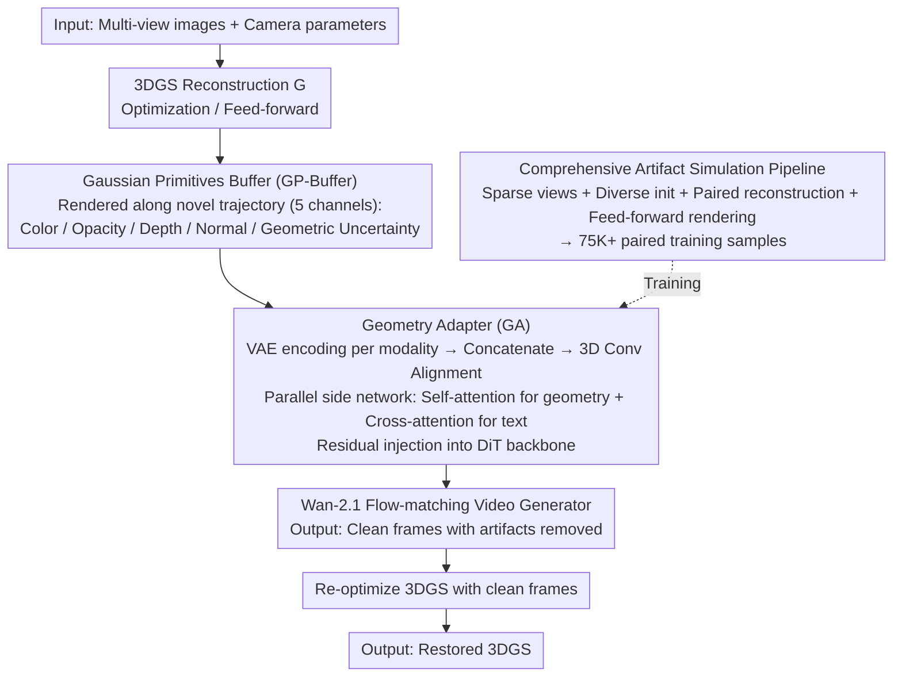

# GaussFusion: Improving 3D Reconstruction in the Wild with A Geometry-Informed Video Generator

**Conference**: CVPR 2026  
**arXiv**: [2603.25053](https://arxiv.org/abs/2603.25053)  
**Code**: None  
**Area**: 3D Vision / Novel View Synthesis  
**Keywords**: 3D Gaussian Splatting, Video Generative Models, Geometric Priors, Artifact Removal, Real-time Inference

## TL;DR
This paper proposes GaussFusion, a geometry-informed video-to-video generative model. By rendering a Gaussian Primitives Buffer (GP-Buffer) containing depth, normals, opacity, and covariance to condition a video generator, it effectively removes floaters, flickering, and blur in 3DGS reconstructions. It is compatible with both optimization-based and feed-forward reconstruction paradigms, with a distilled version achieving real-time inference at 16 FPS.

## Background & Motivation
1. **Background**: 3D Gaussian Splatting (3DGS) has become a mainstream representation for 3D reconstruction, branching into per-scene optimization and feed-forward prediction.
2. **Limitations of Prior Work**: Both paradigms suffer from severe artifacts—floaters, flickering, blur, and geometric errors—under sparse views or insufficient coverage. Existing restoration methods (e.g., Difix3D, GenFusion, ExploreGS) condition only on RGB renderings, failing to handle large-scale floaters or missing regions, and typically only target one specific reconstruction paradigm.
3. **Key Challenge**: Existing methods utilize only the color information of Gaussian primitives, ignoring rich geometric cues such as depth, opacity, normals, and covariance. Furthermore, training data lacks diverse artifact simulations, leading to overfitting to specific reconstruction pipelines.
4. **Goal**: How to train a single model capable of processing artifacts from both optimization-based and feed-forward 3DGS?
5. **Key Insight**: (1) Encode all 3DGS primitive attributes into pixel-aligned video representations (GP-Buffer), providing richer geometric cues than pure RGB; (2) Design a comprehensive artifact simulation pipeline to cover various degradation modes.
6. **Core Idea**: Condition a video generative model using the GP-Buffer containing complete geometric information of Gaussian primitives, combined with a cross-paradigm artifact simulation strategy to achieve universal 3DGS restoration.

## Method

### Overall Architecture
GaussFusion aims to address the two facets of the same problem across different technical routes: whether optimization-based or feed-forward 3DGS, sparse views lead to floaters, flickering, and blur. While existing restoration models focus only on RGB renderings or serve only one paradigm, GaussFusion assigns "restoration" to a video generator guided by geometry. It first renders the 3DGS reconstruction $\mathcal{G}$ into a set of geometry-informed buffers (GP-Buffer) along a novel viewpoint trajectory. These encoded buffers are then injected into a flow-matching video generator based on Wan-2.1, allowing the generator to output clean video frames under geometric guidance. These clean frames are subsequently used to re-optimize the original 3DGS. The input consists of multi-view images and camera parameters, while the output is a restored 3DGS representation; all cross-paradigm differences are handled upstream during training data generation.

### Key Designs

**1. Gaussian Primitives Buffer (GP-Buffer): Mapping geometry to pixels for "X-ray" artifact visibility**

The difficulty of using only RGB to condition generators is that the model cannot distinguish between "correct rendering" and "large-scale missing geometry"—color correctness does not imply geometric correctness. The GP-Buffer addresses this by rendering the full attributes of each Gaussian primitive into pixel-aligned channels: Color $\mathbf{C}$, Opacity $A$, Depth $D$, Normal $\mathbf{N}$, and Geometric Uncertainty $\mathbf{U}$. Normals are not predicted separately but derived via finite differences from camera-space positions: $\mathbf{N}(\mathbf{u}) = \text{normalize}(\partial_u \mathbf{P}_{\text{cam}} \times \partial_v \mathbf{P}_{\text{cam}})$. Geometric uncertainty is rendered as the unique elements of the inverse covariance matrix via alpha-blending. Textureless regions often use fewer, larger Gaussians (low values), while high-frequency regions show high values, making this channel a natural map of "local structural regularity." These geometric channels provide the model with perspective power: ablation studies show that adding each modality improves metrics, and the often-overlooked covariance uncertainty channel yields the largest FID improvement (8.61→6.72) as it directly marks low-quality regions.

**2. Geometry Adapter (GA): Hierarchical injection via parallel side networks**

With the GP-Buffer, the next challenge is modality injection. Unlike GenFusion or ExploreGS, which add conditional latents directly to noise latents, GaussFusion encodes the five modalities into video latents via VAEs, aligns them using 3D convolutions, and passes them to GA blocks. GA is a parallel side network attached to the DiT backbone, using self-attention for geometric features and cross-attention for text descriptions. The resulting geometry-aware features $\mathbf{x}_g$ are added residually to the backbone latents:

$$\mathbf{x} \leftarrow \mathbf{x} + \mathbf{x}_g$$

During training, the base model is frozen, and only the GA layers are updated. This hierarchical injection is more precise than direct addition, raising PSNR from 20.90 to 22.55 (an improvement of ~1.6 dB).

**3. Comprehensive Artifact Simulation Pipeline: Injecting cross-paradigm artifacts into training**

The cross-paradigm capability stems from data, not just architecture. Traditional methods rely on uniform downsampling and under-fitting, failing to capture all 3DGS flaws. This pipeline mixes four degradation sources: 5% random frame retention for sparse views (more realistic than uniform sampling); diverse initialization (SfM, random points, and MapAnything point maps); paired reconstruction (restoring "bad" sparse-view models with "good" full-view supervision); and direct rendering from feed-forward DepthSplat models to capture specific geometric inconsistencies and transparency artifacts. This results in 75K+ paired video samples covering a wide degradation spectrum.

### Loss & Training
Training utilizes a flow-matching objective: $\mathcal{L} = \mathbb{E}[\|u_\theta(x_t, c, t) - v_t\|^2]$. To enable real-time generation, two-stage fine-tuning is used: first, Distribution Matching Distillation (DMD) distills the multi-step generator into a 4-step model; then, the GA layers are fine-tuned to restore geometric alignment. The base model is Wan-2.1-1.3B, with GA adding 0.6B parameters, trained for 100K steps on 8×H200 GPUs.

## Key Experimental Results

### Main Results (DL3DV Dataset, Optimization-based 3DGS Restoration)

| Method | PSNR ↑ | SSIM ↑ | LPIPS ↓ | FID ↓ | Inference Speed |
|------|--------|--------|---------|-------|---------|
| Splatfacto (baseline) | 17.42 | 0.605 | 0.412 | 6.49 | 118.3 FPS |
| GenFusion | 18.36 | 0.690 | 0.391 | 9.98 | 1.1 FPS |
| Difix3D+ | 20.10 | 0.765 | 0.302 | 4.22 | 12.8 FPS |
| ExploreGS | 20.69 | 0.760 | 0.345 | 6.27 | 1.2 FPS |
| **Ours (Full)** | **22.55** | **0.832** | **0.278** | **3.93** | 4.3 FPS |
| **Ours (Few-step)** | **22.49** | **0.842** | **0.288** | 7.38 | **15.1 FPS** |

### Ablation Study (GP-Buffer Modality Ablation, DL3DV)

| RGB | Depth | Normal | Alpha | Cov. | PSNR ↑ | LPIPS ↓ | FID ↓ |
|-----|-------|--------|-------|------|--------|---------|-------|
| ✓ | | | | | 19.15 | 0.385 | 15.45 |
| ✓ | ✓ | | | | 19.29 | 0.361 | 10.54 |
| ✓ | ✓ | ✓ | | | 19.74 | 0.355 | 10.29 |
| ✓ | ✓ | ✓ | ✓ | | 19.96 | 0.344 | 8.61 |
| ✓ | ✓ | ✓ | ✓ | ✓ | **20.75** | **0.329** | **6.72** |

### Key Findings
- Every geometric modality in the GP-Buffer contributes independently. The Covariance Uncertainty channel (Cov.), though often ignored, provides the most significant FID improvement (8.61 → 6.72).
- Joint training (mixing multiple datasets and degradation types) outperforms single-dataset training, proving the importance of cross-paradigm artifact simulation.
- GaussFusion also improves DepthSplat (feed-forward) performance (PSNR 21.77 → 22.80), whereas Difix3D+ and ExploreGS actually degrade feed-forward PSNR.
- The distilled 4-step model maintains PSNR/SSIM/LPIPS but slightly increases FID (3.93 → 7.38), achieving real-time inference at 16 FPS.
- Geometry Adapter outperforms direct latent addition by 1.6 dB in PSNR.

## Highlights & Insights
- **Incisive GP-Buffer Design**: By rendering the full attributes of Gaussian primitives, the model gains "X-ray" vision. The covariance uncertainty channel is particularly insightful for identifying low-quality regions covered by few large Gaussians.
- **Paradigm-Agnostic Restoration**: Through comprehensive artifact simulation, a single model handles both optimization-based and feed-forward 3DGS flaws, a capability missing in previous works.
- **Practical Distillation**: 16 FPS real-time inference allows GaussFusion to perform "on-the-fly" frame restoration during rendering.

## Limitations & Future Work
- As a video generative model, even after distillation, it adds 0.6B parameters, imposing high memory and compute requirements.
- Generated frames may lose high-frequency details during extreme viewpoint changes (evidenced by increased FID after distillation).
- The current workflow requires re-optimizing the 3DGS with clean frames; it is not yet fully end-to-end.
- VAE encoders in GP-Buffer were designed for RGB; although reconstruction error for other modalities is <1%, specialized multi-modal encoders may be superior.

## Related Work & Insights
- **vs. Difix3D+**: Image-based diffusion lacks multi-view consistency and fails to remove large floaters. GaussFusion ensures temporal consistency via a video generator.
- **vs. MVSplat360**: Tailored for the MVSplat feed-forward model; cannot generalize to optimization-based 3DGS. GaussFusion achieves universality through mixed training.
- **vs. ExploreGS / GenFusion**: Limited restoration capability due to RGB-only conditioning and less diverse training data. GP-Buffer and comprehensive simulation address these gaps.
- The core takeaway: In 3D reconstruction restoration, **leveraging the geometric information of the reconstruction itself** is far more effective than relying solely on external generative priors.

## Rating
- Novelty: ⭐⭐⭐⭐ The GP-Buffer design and paradigm-agnostic training are significant innovations.
- Experimental Thoroughness: ⭐⭐⭐⭐⭐ Comprehensive evaluation across datasets, paradigms, and speeds.
- Writing Quality: ⭐⭐⭐⭐ Logical structure with clearly articulated motivations.
- Value: ⭐⭐⭐⭐⭐ High deployment value due to real-time inference and cross-paradigm generalization.

<!-- RELATED:START -->

## Related Papers

- [\[CVPR 2026\] ORBIT: Benchmarking SfM in the Wild with 360° Video](orbit_benchmarking_sfm_in_the_wild_with_360deg_video.md)
- [\[ICLR 2026\] Text-to-3D by Stitching a Multi-view Reconstruction Network to a Video Generator](../../ICLR2026/3d_vision/text-to-3d_by_stitching_a_multi-view_reconstruction_network_to_a_video_generator.md)
- [\[CVPR 2026\] Selfi: Self-improving Reconstruction Engine via 3D Geometric Feature Alignment](selfi_self-improving_reconstruction_engine_via_3d_geometric_feature_alignment.md)
- [\[CVPR 2026\] Faster-GS: Analyzing and Improving Gaussian Splatting Optimization](faster-gs_analyzing_and_improving_gaussian_splatting_optimization.md)
- [\[CVPR 2026\] Illumination-Consistent Human-Scene Reconstruction from Monocular Video](illumination-consistent_human-scene_reconstruction_from_monocular_video.md)

<!-- RELATED:END -->
