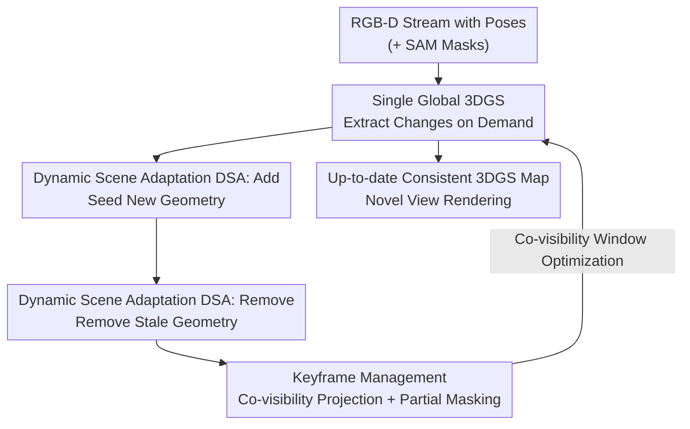

# Gaussian Mapping for Evolving Scenes

**Conference**: CVPR 2026  
**Paper**: [CVF Open Access](https://openaccess.thecvf.com/content/CVPR2026/html/Yugay_Gaussian_Mapping_for_Evolving_Scenes_CVPR_2026_paper.html)  
**Code**: https://vladimiryugay.github.io/game (Project page, open source)  
**Area**: 3D Vision  
**Keywords**: 3D Gaussian Splatting, dense mapping, long-term dynamic scenes, online reconstruction, novel view synthesis  

## TL;DR
GaME is the first dense mapping system supporting novel view synthesis (NVS) for "long-term dynamic scenes" (structural changes occurring *outside* the camera's field of view). By dynamically adapting to scene changes (via Add/Remove operators) to continuously incorporate incremental updates into a single global 3DGS, and leveraging keyframe partial masking to discard stale observations, it improves PSNR by approximately 29.7% and reduces depth L1 error to about 1/3 on both synthetic and real-world data.

## Background & Motivation

**Background**: 3D Gaussian Splatting (3DGS) has become the dominant representation for dense mapping and novel view synthesis (NVS), widely used in AR/VR, robotics, and autonomous driving. A class of online RGB-D mapping methods (e.g., SplaTAM, MonoGS) use 3DGS as the scene representation & achieve high-quality rendering in *static* scenes.

**Limitations of Prior Work**: Real-world environments are almost always dynamic, and dynamics can be categorized into two types: short-term dynamics (objects moving *inside* the camera's field of view, where existing methods like Wild-GS and DG-SLAM use segmentation models to suppress transient objects) and long-term dynamics (structural changes occurring in the scene during capture but *outside* the camera's field of view, such as chairs being moved, paintings taken off walls, or tableware being replaced). Long-term dynamics are rarely addressed: 3DGS mapping methods assume static environments by default, requiring joint optimization over multiple frames to be well-posed. Once the map becomes stale and stale observations continue to be fed into the optimization, the reconstruction is corrupted, resulting in ghosting artifacts and incorrect geometry.

**Key Challenge**: Long-term dynamic mapping is simultaneously bottlenecked by two problems—stale maps (old maps that do not reflect the latest changes) and stale observations (old keyframes that still constrain geometry that no longer exists). Existing long-term dynamic mapping methods (e.g., Panoptic Multi-TSDF, Khronos) adopt object-level submaps or object graphs to detect changes, but their map representations *cannot perform photo-realistic rendering*, making them inapplicable to AR/VR or digital map applications that require photorealistic rendering.

**Goal**: To allow online mapping systems to capture out-of-view scene evolution *at any time* and maintain rendering quality, while preserving the photorealistic rendering capabilities of 3DGS.

**Key Insight**: Instead of explicitly modeling each object (decomposing objects into independent entities in 3DGS is computationally expensive, and the splatting mechanism inherently couples all Gaussians, making them difficult to optimize individually), the authors maintain *a single global 3DGS* and extract changed regions from the conflict between rendering and observation only "when needed."

**Core Idea**: The long-term dynamic mapping problem is decoupled into two atomic operations—the "Add" and "Remove" of geometry for the global 3DGS, paired with a keyframe management scheme that selectively masks out stale regions rather than discarding entire frames, thereby solving the problems of "stale maps" and "stale observations" in a divide-and-conquer manner.

## Method

### Overall Architecture
GaME takes a stream of RGB-D images with camera poses as input and actively maintains a single global 3DGS map $\{G_i\}_{i=1}^N$ that is always consistent with the latest observations and can render novel views. The system runs in an online loop: whenever the translation or rotation of a frame exceeds a threshold, it is selected as a keyframe, triggering **Dynamic Scene Adaptation (DSA)**—first, newly appeared geometry is seeded into the map using "Add"; then, stale geometry is deleted using "Remove". After additions and removals, **Keyframe Management (KM)** masks out the corresponding regions of old keyframes that observed the "changed geometry" (instead of discarding the entire frame). Finally, the mapping module optimizes the 3DGS parameters (color loss + depth loss) within a co-visibility window using the processed keyframes. This pipeline enables the global map to be continuously updated as the scene evolves.

### Key Designs

**1. Single Global 3DGS Representation + On-Demand Change Extraction: Extracting changes as "conflicts" without explicit object construction**

Prior works in long-term dynamic mapping (such as Panoptic Multi-TSDF or the object graph by Fu et al.) follow object-level approaches—decomposing the scene into trackable entities and detecting changes based on object configuration. The authors argue that this approach is infeasible for 3DGS: 3DGS relies on alpha-blending to couple all Gaussians together during rendering (see equation $\alpha_j = o_j e^{-\sigma_j},\ \sigma_j = \tfrac12 \Delta_j^\top \Sigma_j^{-1}\Delta_j$), making individual optimization of Gaussians for a specific object both inaccurate and computationally expensive. Therefore, GaME maintains only *a single global Gaussian set*, bypassing object-level complexity, and instead extracts changed geometry from the discrepancies between the "rendered representation" and "current observations" "on demand" (triggered by DSA at each keyframe). This is the key design philosophy: changes are not explicitly tracked but are implicitly detected via rendering-observation conflicts. The online optimization objective is the joint L1 loss of color and depth (with SSIM integrated into the color term): $L = L_\text{color}(\hat I, I) + L_\text{depth}(\hat D, D)$, supplemented by isotopic regularization to prevent Gaussians from degrading into needle shapes.

**2. Dynamic Scene Adaptation (DSA): Adding and removing global geometry with symmetric Add and Remove operators**

This is the core design for solving "stale maps." DSA handles three types of out-of-view changes—added, moved, and removed geometry. Since object relocation does not affect NVS, the problem is simplified into two atomic operations:

*Add* first detects regions where "geometry should exist but does not": in the reconstructed Gaussians, pixels whose observed depth is closer than the rendered depth and have sufficiently high opacity are identified as newly added geometry: $\mathcal{G}_\text{add}=\{G_i \mid \alpha(p)\ge\epsilon_\text{opacity} \wedge \hat D(p) > D(p)+\epsilon_\text{depth}\}$. Concurrently, for "newly explored regions" $\mathcal{R}_\text{new}$ (defined as the union of low opacity, significantly exceeded rendered depth, or high color error), the RGB-D frames are back-projected into 3D to seed new Gaussians, followed by several steps of optimization targeted at the current keyframe.

*Remove* is the mirror of Add: Gaussians with high opacity but whose color and geometry **conflict** with the new observations are identified as stale ($\mathcal{G}_\text{remove}$). There are two key differences. First, the sign of the depth criterion is **reversed** (the observation ray penetrates through the model geometry, indicating that space is now empty; this also avoids falsely deleting regions that are "merely occluded"). Second, an additional **color conflict term** is introduced, allowing the detection of changes with almost no geometric alteration, such as "taking a painting off a wall" (which most long-term mapping methods using only 3D information cannot achieve). However, the current frame often only sees a portion of the object to be removed, and directly deleting only the visible part destroys scene consistency. DSA renders $\mathcal{G}_\text{remove}$ to each co-visible keyframe to find conflict regions $\mathcal{R}_\text{remove}^\text{KF}$, and then uses dense SAM masks on those keyframes to identify segments intersecting with the conflict areas. It then leverages FlashSplat to **optimally** assign masks to Gaussians, thereby fully removing the entire object even if only a fraction of it is currently observed. Note that the SAM masks here require no semantic labels; their sole purpose is to outline the complete boundary of the objects to be removed. Finally, $\mathcal{G}_\text{remove}\cup\bigcup_\text{KF} G_\text{remove}^\text{KF}$ is deleted from the global model and integrated via minor optimization iterations.

**3. Keyframe Management with Partial Masking: Masking out only stale regions without discarding entire frames**

This is the core design for solving "stale observations." Since full-frame joint optimization is computationally prohibitive, only a small window of keyframes $W_k$ (added when translation/rotation exceeds a threshold) is maintained. The problem is that after scene changes occur, the parts of old keyframes observing "changed geometry" will pull the 3DGS optimization in the wrong direction. A naive solution is to discard these "conflicting keyframes" entirely—but ablation shows this is disastrous (depth L1 surges to 764 cm) because usually only a small portion of a frame changes, while the remaining background still provides valuable multi-view constraints. Discarding the entire frame deprives large parts of the scene of constraints. Therefore, GaME **only masks out the stale regions within a frame**: before seeding $\mathcal{R}_\text{new}$ or removing $\mathcal{G}_\text{remove}$, they are rendered onto the co-visible keyframes to evaluate conflicts using photometric and geometric losses. High-error regions indicate "places where the map has changed but the frame does not reflect it." To suppress rendering noise, the conflict regions are refined to be object-aligned (using intersecting SAM masks for Remove, and morphological closing operations of reprojected depth conflicts for Add). Any SAM mask heavily covered by the error region is ignored during optimization, while the rest of the frame is optimized as usual using masked losses. Furthermore, co-visibility is determined by "whether 3D points are occluded upon reprojection," rather than the conventional "rendered Gaussian count"—the latter would mistakenly estimate co-visibility in multi-room environments because alpha-blending makes Gaussians in adjacent rooms appear visible.

### Loss & Training
The joint loss is $L = L_\text{color}(\hat I, I) + L_\text{depth}(\hat D, D)$. The color term is $L_\text{color}=(1-\lambda)\tfrac1K\sum_p|\hat I(p)-I(p)| + \lambda(1-\mathrm{SSIM}(\hat I,I))$, and the depth term is $L_\text{depth}=\tfrac1K\sum_p|\hat D(p)-D(p)|$, where $K$ is the number of rendered pixels, and $\lambda$ balances L1 and SSIM losses, alongside isotropic regularization. During the keyframe management stage, a **masked version** of these losses (ignoring stale regions) is applied.

## Key Experimental Results

### Main Results
Datasets: Flat (synthetic, containing significant long-term changes), Aria (real-world, recording two rooms with two sessions of long-term changes each), and TUM-RGBD (three static scenes to verify no degradation). The evaluation protocol concatenates multiple sessions of RGB-D recordings for each scene into a single continuous sequence to simulate real-world evolution, reserving every 10th frame for novel view testing. Metrics include PSNR/SSIM/LPIPS and depth L1 (cm), reported as "input views / novel views".

Rendering performance on the Flat dataset:

| Method | PSNR↑ | SSIM↑ | LPIPS↓ | Depth L1 [cm]↓ |
|------|-------|-------|--------|--------------|
| SplaTAM | 15.88 / 12.69 | 0.48 / 0.30 | 0.55 / 0.70 | 21.16 / 59.91 |
| MonoGS | 21.24 / 21.33 | 0.77 / 0.77 | 0.40 / 0.40 | 30.95 / 29.91 |
| DG-SLAM | 13.72 / 13.70 | 0.59 / 0.60 | 0.74 / 0.74 | 73.76 / 73.90 |
| **GaME (Ours)** | **24.55 / 24.26** | **0.93 / 0.93** | **0.14 / 0.14** | **6.9 / 7.9** |

On Aria real-world data, GaME achieves an average PSNR of 31.39/31.23 and a depth L1 of only 1.22/1.24 cm, representing almost an order-of-magnitude improvement over the strongest baseline MonoGS (24.20/24.11, ~5 cm). The paper reports an overall PSNR improvement of ~29.7% and a ~3× improvement in depth error compared to the most competitive baseline.

### Ablation Study

Ablation of DSA operators (Flat):

| Configuration | PSNR↑ | Depth L1 [cm]↓ | Description |
|------|-------|--------------|------|
| No DSA | 21.25 / 21.08 | 29.20 / 27.20 | No scene adaptation performed |
| Add | 23.34 / 23.07 | 11.00 / 11.20 | Only adding geometry |
| Remove | 24.13 / 23.89 | 9.50 / 8.20 | Only removing geometry |
| **Add+Remove (Ours)** | **24.55 / 24.26** | **6.9 / 7.9** | Complete DSA |

Ablation of keyframe management (Flat):

| Configuration | PSNR↑ | Depth L1 [cm]↓ | Description |
|------|-------|--------------|------|
| No KF Filtering | 23.57 / 23.31 | 6.70 / 7.20 | No filtering; background is clear, but changed regions have ghosting artifacts |
| Full KF Filtering | 13.72 / 13.34 | 764.40 / 763.30 | Entire frame discarded; scene is severely under-constrained (collapses) |
| **Partial Filtering (Ours)** | **24.55 / 24.26** | **6.9 / 7.9** | Only masking out stale regions |

### Key Findings
- DSA is the main contributor to rendering quality: removing DSA degrades depth L1 from ~7 cm to ~28 cm; both Add and Remove are individually effective, but combining them yields the best depth results (Remove is more critical than Add; removing incorrect geometry yields greater improvements in depth).
- The "partial masking" in keyframe management is the turning point: discarding entire frames (Full Filtering) causes the depth L1 to spike to 764 cm (complete collapse), demonstrating that multi-view constraints from the background must be preserved; not filtering does not collapse the system but leaves ghosting artifacts in changed areas. "Preserving the background while masking conflicts" is the optimal strategy.
- Robustness: replacing ground truth poses with noisy poses estimated by an off-the-shelf SLAM system (Aria room0) leads to almost no performance degradation (PSNR 31.54 $\rightarrow$ 31.45); performance on the TUM-RGBD static scenes is on par with the SOTA, showing that mechanisms designed for dynamic scenes do not sacrifice static reconstruction capabilities.

## Highlights & Insights
- **Formulating "scene changes" implicitly as rendering-observation conflicts** rather than explicitly modeling or tracking objects—this elegantly bypasses the fundamental difficulty of optimizing individual objects arising from the alpha-blending coupling in 3DGS.
- **Symmetric Add/Remove design + inverted sign for depth criteria**: utilizing the same set of opacity, depth, and color thresholds, the system distinguishes "geometry to be added" from "geometry to be removed" merely by reversing the sign, while naturally preventing false deletions caused by "occlusion $\neq$ disappearance".
- **Leveraging SAM masks + FlashSplat for "complete object removal"**: even if the current frame only captures a portion of an object, intersecting SAM masks on co-visible keyframes allow clean removal of the entire object. This "partial observation $\rightarrow$ complete removal" trick can be transferred to any task requiring object-level editing in 3DGS.
- The "partial masking instead of full-frame discarding" strategy might seem like an engineering detail, but the ablation study reveals it is the line between success and complete collapse (764 cm vs 7 cm), reminding us that the value of background constraints in long-term dynamic mapping has been heavily underestimated.

## Limitations & Future Work
- The method relies on RGB-D (depth sensors) and known/estimable camera poses, making it inapplicable to pure monocular RGB scenarios; Wild-GS could not be compared fairly on Flat/Aria due to its reliance on off-the-shelf depth estimators and pose inconsistencies, showing that this setting has strict requirements on input quality.
- DSA and Remove highly depend on the quality of SAM masks and several thresholds ($\epsilon_\text{opacity},\epsilon_\text{depth},\epsilon_\text{color},\tau$, etc.); the transferability of these thresholds under different sensor noise levels is not fully discussed.
- It only processes **rigid** geometric additions and removals, without modeling non-rigid/deformable objects or short-term dynamics within the field of view; evaluation scenes are primarily indoor rooms, leaving large-scale outdoor long-term dynamics unverified.
- Change detection is "triggered"—updates only occur when the camera re-observes a certain region, meaning stale information in regions unvisited for a long time cannot be actively cleaned up.

## Related Work & Insights
- **vs. Panoptic Multi-TSDF / Khronos (Object-level long-term dynamic mapping)**: These methods reason about changes at the submap/object-graph level, which enables change detection but lacks realistic rendering capabilities. GaME utilizes a single 3DGS to achieve photo-realistic NVS, at the cost of not explicitly maintaining object-level semantics.
- **vs. DG-SLAM / Wild-GS (Short-term dynamic 3DGS)**: These approaches utilize segmentation to suppress transient objects *within* the field of view, but stale observations will pollute the representation when long-term out-of-view evolution occurs (resulting in depth L1 errors up to 60+ cm for DG-SLAM in experiments). GaME specializes in out-of-view long-term dynamics, making the two paradigms complementary.
- **vs. SplaTAM / MonoGS (Static online 3DGS mapping)**: These also use 3DGS as the representation but assume a static scene. GaME integrates DSA + keyframe partial masking on top of them, relaxing the "static assumption" into "continuous evolution."

## Rating
- Novelty: ⭐⭐⭐⭐⭐ The first NVS-capable dense mapping targeting out-of-view long-term dynamics. The formulation of change detection as rendering-observation conflicts is highly refreshing.
- Experimental Thoroughness: ⭐⭐⭐⭐ Comprehensive evaluation on synthetic, real-world, and static data, with complete ablations for DSA, KM, and noisy poses. However, the scenes are mostly indoors, and the sensitivity analysis of thresholds is insufficient.
- Writing Quality: ⭐⭐⭐⭐ Clear decomposition of the problems (stale map vs. stale observations) with good alignment between equations and illustrations.
- Value: ⭐⭐⭐⭐⭐ An online-updatable and renderable map is highly demanded in AR/VR and robotics, making this highly valuable and open-source.

<!-- RELATED:START -->

## Related Papers

- [\[CVPR 2026\] OnlinePG: Online Open-Vocabulary Panoptic Mapping with 3D Gaussian Splatting](onlinepg_online_open-vocabulary_panoptic_mapping_with_3d_gaussian_splatting.md)
- [\[CVPR 2026\] Uncertainty-driven 3D Gaussian Splatting Active Mapping via Anisotropic Visibility Field](uncertainty-driven_3d_gaussian_splatting_active_mapping_via_anisotropic_visibili.md)
- [\[CVPR 2026\] GaussianFluent: Gaussian Simulation for Dynamic Scenes with Mixed Materials](gaussianfluent_gaussian_simulation_for_dynamic_scenes_with_mixed_materials.md)
- [\[CVPR 2026\] FreeScale: Scaling 3D Scenes via Certainty-Aware Free-View Generation](freescale_scaling_3d_scenes.md)
- [\[CVPR 2026\] MAGICIAN: Efficient Long-Term Planning with Imagined Gaussians for Active Mapping](magician_efficient_long-term_planning_with_imagined_gaussians_for_active_mapping.md)

<!-- RELATED:END -->
