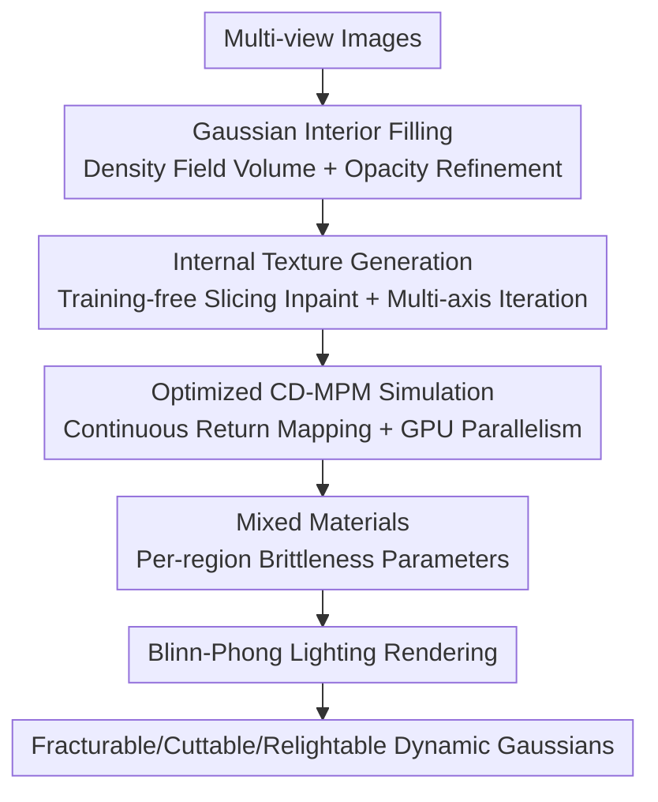

# GaussianFluent: Gaussian Simulation for Dynamic Scenes with Mixed Materials

**Conference**: CVPR 2026  
**Paper**: [CVF Open Access](https://openaccess.thecvf.com/content/CVPR2026/html/Huang_GaussianFluent_Gaussian_Simulation_for_Dynamic_Scenes_with_Mixed_Materials_CVPR_2026_paper.html)  
**Code**: None (Project Page only <https://hb-pencil-zero.github.io/GaussianFluent/>)  
**Area**: 3D Vision  
**Keywords**: 3D Gaussian Splatting, Physical Simulation, Brittle Fracture, CD-MPM, Internal Texture Generation  

## TL;DR
GaussianFluent supplements surface-only 3DGS by filling interiors with realistic textured Gaussians using generative models. It integrates a stabilized, parallelized Continuous Damage Material Point Method (CD-MPM) into the simulation, enabling 3DGS to realistically simulate brittle fracture, cutting, and bullet penetration in mixed materials at real-time speeds with exposed internal structures.

## Background & Motivation
**Background**: 3DGS has become a mainstream 3D representation due to its high-fidelity and real-time rendering. Coupling physical simulation with Gaussians (represented by PhysGaussian) has enabled elastic deformation by assigning mass, velocity, and stress to each Gaussian, evolved via the Material Point Method (MPM) on a background Eulerian grid.

**Limitations of Prior Work**: Existing GS simulations primarily handle "soft, deformable" materials. **Brittle fracture**, which changes topology and exposes new surfaces, is largely unsupported due to two obstacles: ① Gaussians are a surface representation, leaving object interiors hollow and untextured—when a watermelon breaks, it should reveal red flesh, but reconstructed models are empty; ② Existing GS simulations lack fracture models, and established brittle fracture methods specialized for point clouds (e.g., CD-MPM-TOG) are incompatible with GS—their return mapping is **discontinuous** at yield surface boundaries. Additionally, these methods often run only on CPUs with low parallelism, leading to numerical divergence on GPUs due to the non-determinism of CUDA atomic operations.

**Key Challenge**: Realistic fracture rendering requires filling both the "representation gap" (what the interior looks like) and the "simulation gap" (how it breaks physically). Lacking either results in untextured cross-sections or unphysical fracturing behavior.

**Goal**: Within the 3DGS framework, achieve end-to-end: (a) interior volume filling with consistent textures, (b) real-time GPU-based brittle fracture simulation, and (c) support for mixed-material objects (e.g., varying brittleness for rind, flesh, and seeds).

**Key Insight**: Instead of training specialized models for internal textures (which is costly and lacks generalization), this work utilizes a **training-free** approach by slicing and filling using off-the-shelf generative models (SD-XL, MVInpainter). For simulation, the discontinuous return mapping of CD-MPM is made **continuous** via a dynamic projection point, enabling GPU parallelization and seamless integration into GS simulation with negligible overhead.

## Method

### Overall Architecture
The input to GaussianFluent is multi-view images, and the output is a Gaussian object with a realistically textured interior that can be shattered, cut, or pierced in a physics engine with real-time relighting. The pipeline consists of two stages: **Interior Supplementation** (Section 3.1, filling Gaussians + texture generation) followed by **Simulation** (Section 3.2, mixed-material CD-MPM), concluded by a Blinn-Phong lighting system for dynamic shadows and highlights.

The interior supplementation involves "volume filling" and "texturing": first, internal Gaussians are seeded within the closed volume defined by surface Gaussians, followed by an opacity-based cleanup. Then, consistent textures are applied layer-by-layer across multiple axes using slicing and image inpainting. The simulation assigns physical properties to all Gaussians, evolving deformation gradients via the modified CD-MPM, with brittleness parameters assigned per-region for mixed materials.

### Key Designs

**1. Gaussian Interior Filling: Enclosed Volume with Opacity Optimization**

To address the "hollow interior" problem, the authors first add a scale regularization term to the standard rendering loss to keep Gaussians small and fitted to the surface, ensuring clear internal/external boundaries:

$$L_{total} = L_{MSE} + L_{SSIM} + \omega \sum_{i=1}^{N} \|s_i\|_2^2$$

where $s_i$ is the scale of the $i$-th Gaussian. The scene is discretized into an $n^3$ grid, and a density field $d(x)=\sum_{p\in P}\alpha_p\exp\!\big(-\tfrac12(x-x_p)^T A_p^{-1}(x-x_p)\big)$ is calculated. Grids where $d(x)\ge\vartheta_d$ define the object boundary, and internal Gaussians are initialized within this volume.

To remove Gaussians that spill outside the actual boundary, the authors perform a **single-pass "opacity-only" optimization**. By fixing all other attributes and fitting the internal Gaussians to the original views, Gaussians outside the surface are forced to zero opacity and subsequently pruned, resulting in a clean, solid volume.

**2. Training-free Two-stage Internal Texture Generation: Multi-axis Iterative Consistency**

To generate internal textures without specific training data, the method reuses existing generators in two stages. **Coarse Initialization**: The object is sliced along the X-axis. Initial appearances $C_{initial}$ and masks are rendered; MVInpainter (guided by SD-XL prompts) fills the masked regions to create $C_{inpaint}$. Internal Gaussians derive their colors $c_i$ via bilinear interpolation. **Multi-axis Iterative Refinement**: Slices are taken along X, Y, and Z axes. Orthogonal views and masks are fed to SD-XL using **low-intensity inpainting** to inject detail without destroying global structure. The 2D results serve as optimization targets to update Gaussian spherical harmonics (SH). The tri-axis slicing naturally couples at intersection lines, forcing the optimization toward 3D consistency.

**3. Optimized CD-MPM for GS: Solving GPU Divergence via Continuous Return Mapping**

The original CD-MPM algorithm is incompatible with GPUs because its return mapping is discontinuous at the yield surface boundary, causing numerical divergence. Each Gaussian is assigned physical attributes, and the deformation gradient $F_p(t)$ evolves the Gaussian's covariance and SH. Fracture occurs when elastic energy is exhausted, defined by the Non-Associated Cam-Clay yield surface:

$$y(p,q;p_0,\xi,M) = q^2(1+2\xi) + M^2(p+\xi p_0)(p-p_0)$$

The core fix is the **Continuous Return Mapping**: when a trial state $(p_{tr},q_{tr})$ lies outside the yield surface ($y>0$), it must be projected back. The authors replace the fixed center $(p_c, 0)$ with a **dynamic projection point** $(p_c^*, 0)$ that adapts smoothly:

$$p_c^* = p_c + \lambda_k(p_{tr})(p_{tr}-p_c),\quad \lambda_k(p_{tr})=\Big|\tfrac{p_{tr}-p_c}{p_0-p_c}\Big|^{k}$$

With $k=2$, the jump at $p=p_0$ is eliminated, allowing for stable GPU execution while maintaining physical plausibility.

**4. Mixed Material Simulation: Per-region Brittleness**

Unlike PhysGaussian's single-material assumption, this work assigns different brittleness parameters $\xi$ to different object parts (e.g., rind vs. flesh). Regions are defined using color-based heuristics or off-the-shelf segmentation. This allows mixed-material effects, such as watermelon seeds remaining distinct from the pulp during a crash—a feat impossible with single-material setups. Setting $\xi=0$ allows particles to separate fully, providing a simplified liquid-like effect for splashes.

## Key Experimental Results

### Main Results

Internal Texture Quality (CLIP Score and User Preference):

| Method | CLIP Score ↑ | User study ↑ |
|------|------|------|
| PhysGaussian (Color Copy) | 22.3 | 3.57% |
| 2D Inpainting | 30.1 | 25.00% |
| **Ours** | **35.4** | **71.43%** |

Dynamic Scene Simulation Quality:

| Method | CLIP Score ↑ | User study ↑ |
|------|------|------|
| PhysGaussian (Elastic only) | 12.2 | 3.84% |
| OmniPhysGS | 13.1 | 7.69% |
| **Ours** | **22.7** | **88.46%** |

### Efficiency Analysis
Simulation time per frame and peak VRAM across grid resolutions:

| Method | 100³ Time(s)/VRAM(GB) | 200³ Time/VRAM | 300³ Time/VRAM |
|------|------|------|------|
| CD-MPM (CPU) | 616 / — | 1539 / — | 3408 / — |
| PhysGaussian | 0.75 / 7.6 | 2.12 / 10.8 | 4.78 / 16.2 |
| **Ours** | **0.78 / 8.2** | **2.08 / 10.7** | **5.05 / 17.7** |

The continuous return mapping allows the algorithm to run on GPUs, reducing per-frame time from nearly an hour on CPU to seconds.

### Key Findings
- **Continuity is critical**: The dynamic projection point is the key to porting brittle fracture to GPU. Without it, numerical instability renders the simulation unusable.
- **Mixed Materials improve realism**: Per-region $\xi$ parameters prevent unnatural fracture patterns and artifacts seen in single-material models.
- **Tri-axis coupling ensures consistency**: Low-intensity iterative inpainting across three axes produces sharper, more consistent 3D textures than vanilla SDS.

## Highlights & Insights
- **Geometric Stabilization**: The use of a simple mathematical formula to fix numerical instability represents a high-impact engineering insight that could apply to other projection-based optimization algorithms.
- **Opacity as a Pruning Tool**: Using a single-attribute (opacity) optimization to clean up volume filling is a clever, effortless solution to boundary spills.
- **Energy-based Fracture**: Modeling fracture as the exhaustion of elastic energy rather than a strict deformation threshold produces more natural transitions.
- **Generative Reuse**: Leveraging off-the-shelf models for internal texturing avoids the high cost of fine-tuning diffusion models while ensuring generalization.

## Limitations & Future Work
- **Fluid approximation**: Simulating splashes by setting $\xi=0$ is a coarse approximation and lacks the realism of dedicated fluid solvers.
- **Over-filling of hollow structures**: The volume construction assumes solid interiors; hollow objects like pipes may be filled by mistake. 
- **Parameter Sensitivity**: Brittleness parameters and regional segmentation often require manual tuning or external tools.
- **Generative Bias**: Texture quality is bounded by the capabilities of SD-XL/MVInpainter, potentially producing implausible textures for rare objects.

## Related Work & Insights
- **vs. PhysGaussian**: While both use MPM on Gaussians, PhysGaussian is limited to elastic deformation and single materials. This work adds internal textures, brittle fracture, and mixed-material support.
- **vs. CD-MPM-TOG**: This work ports the CPU-only point cloud fracture method to GS and GPU by stabilizing the return mapping.
- **vs. FruitNinja**: FruitNinja requires fine-tuning diffusion models for specific categories; this work is training-free and more general.

## Rating
- Novelty: ⭐⭐⭐⭐⭐ (Simultaneously solves internal representation and brittle simulation gaps; dynamic projection point is a clean innovation)
- Experimental Thoroughness: ⭐⭐⭐⭐ (Solid qualitative and efficiency results; quantitative metrics like CLIP could be supplemented with more physical metrics)
- Writing Quality: ⭐⭐⭐⭐ (Clear problem breakdown; some OCR errors in formulas in the open-access version)
- Value: ⭐⭐⭐⭐⭐ (Enables realistic destruction in GS for VR and robotics applications)

## Related Papers

- [\[CVPR 2026\] Space-Time Forecasting of Dynamic Scenes with Motion-aware Gaussian Grouping](space-time_forecasting_of_dynamic_scenes_with_motion-aware_gaussian_grouping.md)
- [\[CVPR 2026\] FastEventDGS: Deformable Gaussian Splatting for Fast Dynamic Scenes from a Single Event Camera](fasteventdgs_deformable_gaussian_splatting_for_fast_dynamic_scenes_from_a_single.md)
- [\[CVPR 2026\] MoRGS: Efficient Per-Gaussian Motion Reasoning for Streamable Dynamic 3D Scenes](morgs_efficient_per-gaussian_motion_reasoning_for_streamable_dynamic_3d_scenes.md)
- [\[CVPR 2026\] Let it Snow! Animating 3D Gaussian Scenes with Dynamic Weather Effects via Physics-Guided Score Distillation](let_it_snow_animating_3d_gaussian_scenes_with_dynamic_weather_effects_via_physic.md)
- [\[CVPR 2026\] 240FPS Stereo Vision from Monocular Mixed Spikes](240fps_stereo_vision_from_monocular_mixed_spikes.md)

<!-- RELATED:END -->

<!-- RELATED:START -->

## Related Papers

- [\[CVPR 2026\] FluidGaussian: Propagating Simulation-Based Uncertainty Toward Functionally-Intelligent 3D Reconstruction](fluidgaussian_propagating_simulation-based_uncertainty_toward_functionally-intel.md)
- [\[CVPR 2026\] FastEventDGS: Deformable Gaussian Splatting for Fast Dynamic Scenes from a Single Event Camera](fasteventdgs_deformable_gaussian_splatting_for_fast_dynamic_scenes_from_a_single.md)
- [\[CVPR 2026\] Dynamic-Static Decomposition for Novel View Synthesis of Dynamic Scenes with Spiking Neurons](dynamic-static_decomposition_for_novel_view_synthesis_of_dynamic_scenes_with_spi.md)
- [\[CVPR 2026\] Efficiently Reconstructing Dynamic Scenes One D4RT at a Time](efficiently_reconstructing_dynamic_scenes_one_d4rt_at_a_time.md)
- [\[CVPR 2026\] 240FPS Stereo Vision from Monocular Mixed Spikes](240fps_stereo_vision_from_monocular_mixed_spikes.md)

<!-- RELATED:END -->
