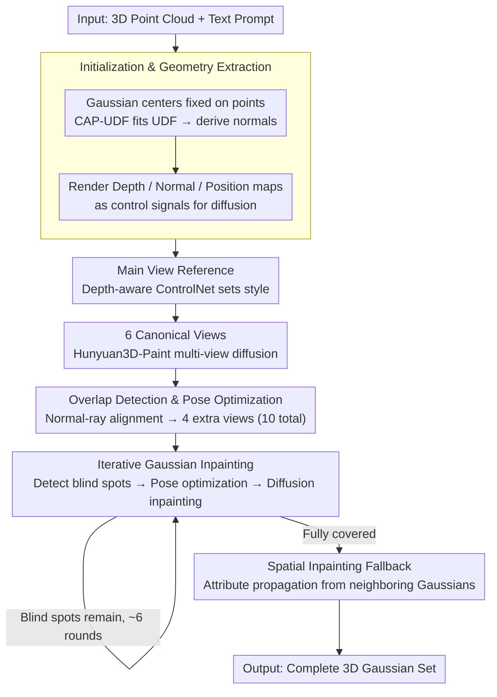

# GaussianGrow: Geometry-aware Gaussian Growing from 3D Point Clouds with Text Guidance

**Conference**: CVPR 2026  
**arXiv**: [2604.05721](https://arxiv.org/abs/2604.05721)  
**Code**: [https://weiqi-zhang.github.io/GaussianGrow](https://weiqi-zhang.github.io/GaussianGrow)  
**Area**: 3D Vision / 3D Generation  
**Keywords**: 3D Gaussian Splatting, Point Clouds, Text Guidance, Multi-view Diffusion, Appearance Generation

## TL;DR
This paper proposes GaussianGrow, which "grows" 3D Gaussians from easily accessible 3D point clouds instead of predicting both geometry and appearance from scratch. It leverages multi-view diffusion models to generate consistent appearance supervision and introduces an overlap region detection and iterative completion mechanism to resolve viewpoint fusion artifacts and occluded areas, significantly outperforming SOTA on synthetic and real-scan point clouds.

## Background & Motivation
1. **Background**: 3D Gaussian Splatting (3DGS) has become a dominant representation for high-fidelity 3D modeling, yet generating high-quality 3D Gaussians remains challenging. Existing generation methods (e.g., GVGEN, DiffSplat) attempt to learn geometry and appearance simultaneously; however, inaccurate geometry predictions lead to a severe decline in overall generation quality.
2. **Limitations of Prior Work**: Some methods attempt to infer Gaussian primitives by predicting point maps as geometric references, but unreliable estimated geometry results in poor generation quality. Another category generates appearance by texturing 3D meshes, which requires extensive manual modeling, and reliance on UV unwrapping introduces texture overlapping and distortion.
3. **Key Challenge**: The joint learning of geometry and appearance makes models highly sensitive to geometric prediction errors, while obtaining reliable geometric priors is often costly (mesh modeling requires significant manual effort).
4. **Goal**: How can easily accessible geometric priors (3D point clouds) be leveraged to significantly improve the quality of 3D Gaussian generation?
5. **Key Insight**: With the proliferation of LiDAR and depth cameras, acquiring clean point cloud data has become highly convenient. Point clouds can serve as reliable geometric priors, simplifying the task from "joint geometry and appearance learning" to "growing appearance on a given geometry."
6. **Core Idea**: Fix the centers of Gaussian primitives at point cloud positions and utilize multi-view diffusion models to generate appearance supervision for "growing" the color and opacity attributes of the Gaussians.

## Method

### Overall Architecture
The pipeline consists of two stages. **Stage 1**: A depth-aware ControlNet generates a main-view reference image, followed by a geometry-aware multi-view diffusion model (Hunyuan3D-Paint) generating 10 views (6 canonical views + 4 additional views optimized for overlapping regions) as appearance supervision to optimize Gaussian attributes. **Stage 2**: Unseen regions are iteratively detected, and camera poses are optimized to observe the largest unseen area. A 2D diffusion model inpaints the rendered views to serve as supervision for continuing Gaussian growth until all regions are covered. Input: 3D point cloud + text prompt. Output: Complete set of 3D Gaussians.

### Key Designs

**1. Initialization and Geometry Extraction: Using point clouds as error-free geometric priors**

Since geometry is provided by the point cloud, the model does not need to predict it—this is where GaussianGrow avoids the quality degradation caused by geometry prediction failure. Each Gaussian center is directly fixed to the corresponding point cloud position, ensuring geometric accuracy is inherited from the input. To provide conditional signals for subsequent view generation, the authors use CAP-UDF to optimize an Unsigned Distance Field (UDF) from the point cloud, from which normals are derived as $n_i = \nabla f_u(p_i) / \|\nabla f_u(p_i)\|$. Gaussians are represented as 2D circular disks oriented along the normals, with rotation matrices determined directly by these normals. Finally, three types of geometric maps are rendered from the UDF—depth maps (via ray marching), normal maps (via gradient inference), and position maps (pixel to XYZ)—to guide the diffusion model. UDF is chosen over SDF because it does not require watertight surfaces and can describe complex structures like open topologies and thin shells, making it more robust for real-scan point clouds.

**2. Overlap Region Detection and Pose Optimization: Resolving inconsistencies where views conflict**

When 6 preset canonical views cover an object, large overlaps between adjacent views are inevitable. Multi-view diffusion models often produce inconsistent outputs in these overlapping zones, leading to seam artifacts. GaussianGrow uses ray tracing to determine the set of Gaussians visible from each viewpoint; the intersection of sets from adjacent viewpoints defines the overlap region $R_{i,j}$. An independent camera pose is then optimized for each overlap region to align the camera ray with the Gaussian normals within that region:

$$\mathcal{L}_{\text{align}} = \sum_{g \in R_{i,j}} \left(1 - \left|\frac{\mathbf{d}_{i,j} \cdot \mathbf{n}_g}{\|\mathbf{d}_{i,j}\| \|\mathbf{n}_g\|}\right|\right)$$

The camera position is constrained to a unit sphere. Direct alignment minimizes projection distortion, ensuring more coherent appearance generation. Thus, the 4 additional views are specifically used to "reconcile" the problematic seams between canonical views. To maintain efficiency, the visibility detection is implemented with CUDA kernels, reducing computation time from minutes to seconds.

**3. Iterative Gaussian Inpainting: Self-adaptive discovery and completion of occluded areas**

Even with 10 views, concave parts, interior walls, and self-occluded regions may remain uncovered. Instead of adding more fixed viewpoints, GaussianGrow adaptively identifies blind spots. In each round, it solves for a camera pose that minimizes the number of "unoptimized Gaussians occluded by optimized ones":

$$\mathcal{L}_{\text{occ}} = \sum_{i,j} \sigma\!\left(\tau(\rho_i+\rho_j)^2 - \|q_i-q_j\|^2\right)\, \sigma\!\left(\tau(z_i-z_j)\right)$$

where $q$ is the 2D projected center, $\rho$ is the projected radius, and $z$ is the depth. Two sigmoid functions determine "projection overlap" and "occlusion order," respectively. After finding the viewpoint that maximizes blind spot visibility, the current view is rendered (showing holes for blind spots), and a depth-aware inpainting diffusion model fills these holes. The inpainted results supervise the growth of the corresponding Gaussians. This process usually covers all blind spots within 6 iterations. A final Spatial Inpainting step serves as a fallback, propagating attributes from optimized Gaussians to any remaining isolated, unobserved Gaussians.

### Loss & Training
Gaussian optimization follows a view-specific strategy—only front-facing Gaussians visible in the current view are optimized to prevent interference with back-facing ones. Optimization proceeds in sequence: 6 canonical views first, followed by the 4 additional overlap views. Hunyuan3D-Paint serves as the multi-view diffusion model, and the main view is generated using Stable Diffusion with Depth-aware ControlNet.

## Key Experimental Results

### Main Results (Objaverse Dataset, text-guided appearance generation)

| Method | FID ↓ | KID ↓ | CLIP ↑ | User Study (Overall) ↑ |
|------|-------|-------|--------|----------------------|
| TexTure | 42.63 | 7.84 | 26.84 | 1.49 |
| Text2Tex | 41.62 | 6.45 | 26.73 | 2.37 |
| SyncMVD | 40.85 | 5.77 | 27.24 | 4.13 |
| GAP | 40.39 | 5.28 | 27.26 | 3.37 |
| **GaussianGrow (Ours)** | **36.07** | **3.04** | **27.30** | **4.67** |

### Ablation Study

| Configuration | FID ↓ | KID ↓ | CLIP ↑ |
|------|-------|-------|--------|
| **Full Model** | **36.07** | **3.04** | **27.30** |
| W/o Overlap Processing | 40.48 | 4.81 | 26.73 |
| W/o Inpaint | 40.46 | 4.68 | 26.71 |

| Number of Views K | FID ↓ | KID ↓ | CLIP ↑ |
|---------|-------|-------|--------|
| K=6 (Canonical only) | 40.48 | 4.81 | 26.73 |
| **K=10** | **36.07** | **3.04** | **27.30** |
| K=12 | 36.57 | 2.88 | 26.48 |

### Key Findings
- **Overlap processing and inpainting are equally crucial**: Removing either module causes the FID to rise from 36 to over 40.
- **K=10 is the optimal viewpoint count**: 4 additional views focusing on overlap regions are sufficient; increasing to K=12 yields diminishing returns and slightly worse CLIP scores.
- **Point clouds outperform reconstructed meshes**: Baseline method performance drops significantly (FID increases by 15-25 points) when using reconstructed meshes (BPA/CAP-UDF), proving that the point cloud → mesh → UV unwrapping pipeline introduces significant geometric distortion. GaussianGrow successfully bypasses these intermediate steps.
- On the T3Bench text-to-3D benchmark, the GaussianGrow + Uni3D retrieval scheme outperforms methods like DiffSplat, GVGEN, and LGM across all metrics.
- The method works robustly on real-scan point clouds (DeepFashion3D), demonstrating resilience to noise and density variations.

## Highlights & Insights
- **Paradigm shift to "Gaussian growing from point clouds"**: Simplifying 3D generation from "simultaneous geometry/appearance learning" to "learning appearance on existing geometry" is a simple yet highly effective insight. Point clouds are more reliable as priors than predicted point maps, and their acquisition cost (via LiDAR or cross-modal retrieval) is decreasing.
- **Sophisticated overlap handling**: Optimizing camera poses via normal-ray alignment to address overlap regions is an effective engineering design. The CUDA parallel implementation emphasizes practical efficiency.
- **Adaptive inpainting strategy**: Instead of using predefined viewpoints, the model identifies areas that need inpainting—this "on-demand generation" is more elegant than brute-force dense view sampling.

## Limitations & Future Work
- Dependency on the quality of the external multi-view diffusion model (Hunyuan3D-Paint)—if the diffusion model performs poorly on certain categories, GaussianGrow cannot rectify it.
- Iterative inpainting requires multiple rendering and diffusion inference passes, resulting in higher computational overhead than end-to-end methods.
- The main view generation (ControlNet + SD) is a single-pass sample; if this reference is suboptimal, it affects the consistency of all subsequent views.
- Current evaluation is primarily at the object level; applicability to scene-level point clouds remains to be verified.

## Related Work & Insights
- **vs DiffSplat**: DiffSplat generates Gaussians directly from image diffusion, involving joint learning. GaussianGrow decouples geometry and appearance to avoid the risk of geometry failure.
- **vs DreamGaussian**: DreamGaussian uses SDS optimization, which often yields over-saturated results. GaussianGrow uses explicit multi-view diffusion supervision for more natural appearances.
- **vs Mesh-texturing methods (TexTure, Text2Tex, etc.)**: GaussianGrow bypasses the UV unwrapping bottleneck, a significant advantage particularly when meshes reconstructed from point clouds are imperfect.

## Rating
- Novelty: ⭐⭐⭐⭐ The "growing Gaussians from point clouds" approach is innovative; the overlap and iterative inpainting designs are solid.
- Experimental Thoroughness: ⭐⭐⭐⭐⭐ Comprehensive evaluation across synthetic (Objaverse), real-scan (DeepFashion3D), and text-to-3D (T3Bench) datasets.
- Writing Quality: ⭐⭐⭐⭐ Clear methodological descriptions with well-integrated formulas and figures.
- Value: ⭐⭐⭐⭐ Provides a new paradigm for 3D generation, though independence is limited by external diffusion models.

<!-- RELATED:START -->

## Related Papers

- [\[CVPR 2026\] Geometry-Aware Cross-Modal Graph Alignment for Referring Segmentation in 3D Gaussian Splatting](geometry-aware_cross-modal_graph_alignment_for_referring_segmentation_in_3d_gaus.md)
- [\[ICCV 2025\] Egocentric Action-aware Inertial Localization in Point Clouds with Vision-Language Guidance](../../ICCV2025/3d_vision/egocentric_action-aware_inertial_localization_in_point_clouds_with_vision-langua.md)
- [\[CVPR 2026\] Cross-Instance Gaussian Splatting Registration via Geometry-Aware Feature-Guided Alignment](cross-instance_gaussian_splatting_registration_via_geometry-aware_feature-guided.md)
- [\[CVPR 2026\] Towards Foundation Models for 3D Scene Understanding: Instance-Aware Self-Supervised Learning for Point Clouds](towards_foundation_models_for_3d_scene_understanding_instance-aware_self-supervi.md)
- [\[CVPR 2026\] HeroGS: Hierarchical Guidance for Robust 3D Gaussian Splatting under Sparse Views](herogs_hierarchical_guidance_for_robust_3d_gaussian_splatting_under_sparse_views.md)

<!-- RELATED:END -->
