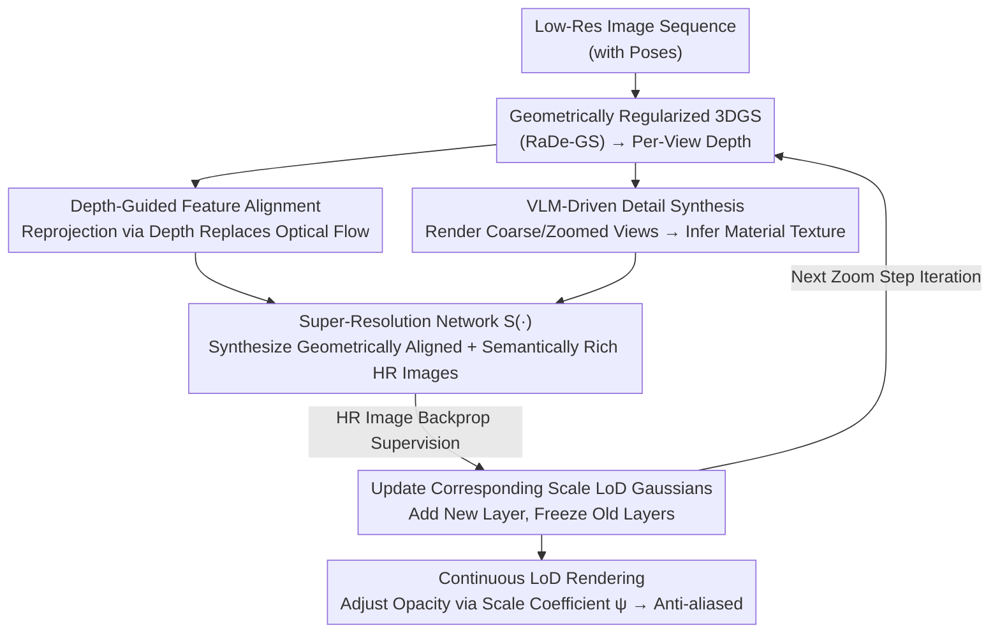

# GaussianZoom: Progressive Zoom-in Generative 3D Gaussian Splatting with Geometric and Semantic Guidance

**Conference**: CVPR 2026  
**Paper**: [CVF Open Access](https://openaccess.thecvf.com/content/CVPR2026/html/Shi_GaussianZoom_Progressive_Zoom-in_Generative_3D_Gaussian_Splatting_with_Geometric_and_CVPR_2026_paper.html)  
**Code**: Project Page https://zju3dv.github.io/GaussianZoom/ (code not explicitly open-sourced)  
**Area**: 3D Vision  
**Keywords**: 3D Gaussian Splatting, Super-resolution, Extreme Zoom-in, VLM Semantic Guidance, Level-of-Detail  

## TL;DR
GaussianZoom reformulates modern extreme 3D scene zoom-in from low-resolution inputs as a progressive generation task. It iteratively optimizes 3DGS using depth-guided multi-view consistent super-resolution combined with semantic detail synthesis inferred by VLMs. Additionally, it utilizes an extensible continuous Level-of-Detail hierarchy to enable anti-aliased, smooth rendering between 1× and 64×, achieving superior perceptual quality and cross-view consistency on Mip-NeRF360 and Tanks&Temples.

## Background & Motivation

**Background**: 3D Gaussian Splatting (3DGS) has enabled high-quality scene reconstruction under real-time rendering. However, its upper limit of detail is strictly bounded by the resolution of the input images. When the capture distance is far or the camera hardware is poor, resulting in low-resolution (LR) inputs, the reconstructed scene suffers from blurry textures and lost fine structures.

**Limitations of Prior Work**: Traditional 3D super-resolution approaches follow a "2D super-resolution first, 3D reconstruction second" paradigm. However, this path has two fatal flaws: ① Single-image super-resolution (e.g., SRGS using SwinIR) sharpens each frame independently, **lacking cross-view geometric constraints**. Consequently, each frame becomes clear on its own but fails to align with others, resulting in flickering ghosting artifacts during reconstruction; ② Flow-based video super-resolution (e.g., SuperGaussian, Sequence Matters) relies on optical flow to align adjacent frames, but **optical flow collapses under occlusions, textureless regions, and large disparities**, leading to incorrect detail generation if the alignment is wrong. More importantly, all of these methods **can only enhance content that is already visible in the LR input, and cannot generate plausible new details out of thin air**—whereas at 16× or 64× zoom, users expect high-frequency semantic textures that simply do not exist in the input.

**Key Challenge**: Scaling up a 3D scene is essentially a continuous process that shifts "from reconstruction to generation," which single-shot upsampling cannot achieve. It must be anchored geometrically (maintaining precise 3D structure and cross-view alignment) while being enriched with semantically plausible appearance driven by high-level scene understanding. These two goals cannot be satisfied simultaneously in existing "one-time super-resolution" frameworks.

**Goal**: To decompose extreme zoom-in into three sub-problems: (a) how to align features with cross-view geometric consistency, (b) how to generate plausible new semantic details that do not exist in the LR, and (c) how to achieve anti-aliased smooth rendering across a massive zoom range (1× to 64×).

**Core Idea**: A **progressive iterative generation framework** is proposed. At each step, a geometrically guided feature alignment (replacing unreliable optical flow) is performed using the reconstructed 3DGS depth. A VLM is then used to infer what material textures should be visible, guiding the super-resolution network to generate new details. The generated high-resolution (HR) images are subsequently used to supervise the next step of 3DGS optimization. Meanwhile, Level-of-Detail (LoD) is upgraded from a "computation-saving discrete switch" to a "continuous generative scaffold that grows with the zoom process."

## Method

### Overall Architecture

The input is a sequence of low-resolution images with known poses, and the output is a 3D Gaussian representation that maintains multi-view consistency and rich details across a wide zoom range. The entire system is a **progressive zoom-in loop**: first, a geometrically regularized coarse 3DGS is optimized from the LR images (using RaDe-GS geometric regulation) to obtain reliable per-view depths. Then, at each zoom step, a unified multi-view consistent super-resolution module integrates "depth-guided feature warping" and "VLM-driven semantic detail synthesis" to synthesize HR views that are both geometrically aligned and semantically rich. These HR images serve as supervision to update the Gaussians at the corresponding scale. Concurrently, an extensible continuous LoD hierarchy organizes the multi-scale Gaussians and dynamically adjusts their opacities according to scale, achieving anti-aliased smooth rendering across zoom levels. An additional layer of LoD (filled with high-frequency details from semantic generation) is added with each forward zoom step while older layers are frozen to preserve the coarse appearance and global structure.

### Key Designs

**1. Depth-Guided Feature Alignment: Replacing Unreliable Optical Flow with Reconstructed Geometry for Cross-View Correspondence**

Video super-resolution (VSR) frameworks rely on optical flow (e.g., estimated by SpyNet) to align adjacent frames. However, optical flow only matches appearance and fails under occlusions, textureless regions, and large disparities, leading to misaligned features and conflicting generated content across views. This work replaces optical flow with geometrically aware depth warping. First, a geometrically consistent low-resolution Gaussian model $G$ is optimized from the LR images, providing reliable per-view depth maps $D_i$ as explicit geometric priors. Given the intrinsics $K_i, K_j$ and extrinsics $P_i, P_j$ of two frames, the geometric correspondence of a pixel $\mathbf{p}=(u,v,1)$ in view $j$ projected to view $i$ as $\mathbf{p}'$ is given by the reprojection:

$$\mathbf{p}'^{\top}\mathbf{D}'_i = \mathbf{K}_i\,\mathbf{P}_i\mathbf{P}_j^{-1}\mathbf{K}_j^{-1}\mathbf{p}\,\mathbf{D}_j$$

where $\mathbf{D}'_i$ is the depth reprojected into the camera coordinate system of $i$. This defines a dense geometric warp $W_{j\to i}$ applied to the feature maps to obtain the aligned feature $\tilde{\mathbf{F}}_i = W_{j\to i}(\mathbf{F}_j)$. Because the alignment is anchored on reconstructed geometry rather than appearance similarity, it naturally handles occlusions and disparities, bringing stable and consistent cross-view feature propagation. In ablation studies, it reduces the FVD from 168 to 108 (on Mip-NeRF360), serving as the primary source of multi-view consistency.

**2. VLM-Driven Semantic Detail Synthesis: Prompting the Model to "Imagine What to See When Zoomed In" to Generate Plausible High-Frequency Details Absent in LR**

While depth warping addresses "alignment," it is still constrained by what is visible in the LR input—it cannot conjure up details that simply do not exist. This work introduces Vision-Language Models (VLMs) into the super-resolution pipeline as semantic priors. At each zoom step, the model renders a coarse-scale view containing global semantics and a zoomed-in view highlighting areas lacking high-frequency details. This pair of renderings is fed into a VLM (Qwen-VL2.5-3B-Instruct fine-tuned with Chain-of-Zoom) to infer a text prompt $c$ describing fine-scale attributes like materials and textures (e.g., "wooden vase, distressed tabletop..."). This text prompt $c$, together with the depth-aligned features $\tilde{\mathbf{F}}_i$ and original features $\mathbf{F}_i$, provides dual semantic and geometric conditioning for the super-resolution network:

$$I_i^{\mathrm{sr}} = \mathcal{S}\!\left(\mathbf{F}_i,\ \tilde{\mathbf{F}}_i,\ c\right)$$

The synthesized HR image $I_i^{\mathrm{sr}}$ not only sharpens visible structures but also injects semantic details that are consistent with both the global context and the local zoomed content, which is then used as supervision to update the Gaussians of the corresponding zoom layer. Ablation studies show that without VLM guidance, the truck surface degenerates into a uniform glossy plane, losing the original rust textures present in the input—demonstrating that without semantic conditioning, the model merely enhances local contrast without capturing material semantics.

**3. Extensible Continuous Level-of-Detail: Upgrading LoD from a Computation-Saving Discrete Switch to a Continuous Generative Scaffold that Grows with Zooming**

Traditional LoD (octree/hierarchical Gaussians) serves rendering efficiency for static reconstruction, performing **hard switching** between predefined levels based on camera distance, which causes sudden pop-ins and aliasing during scale transitions. In contrast, this method dynamically adjusts the opacity of each Gaussian according to its **scale projection coefficient** without explicit level switching. The scale projection coefficient is defined as

$$\psi = \frac{d}{f}$$

where $d$ is the distance from the camera center to the primitive center, and $f$ is the focal length. $\psi$ reflects the screen space footprint of the primitive's world scale; a smaller $\psi$ indicates a larger screen footprint, meaning the primitive should be represented with finer, higher-resolution components. During rendering, the current $\psi'$ under the rendering camera is compared with the $\psi$ stored during primitive creation: if $\psi'/\psi$ exceeds the zoom factor $s$, the primitive is under-resolved and transitions toward finer levels; if $\psi'/\psi$ falls below $1/s$, it is sufficient to cover the footprint, increasing its contribution while suppressing finer components. To ensure smooth transitions, a log-decay function modulates the opacity:

$$w(\psi'/\psi) = \max\big(0,\ 1-|\log_s(\psi'/\psi)|\big)$$

This yields continuous weights that naturally saturate between adjacent LoD layers, preventing visibility popping. With each forward zoom step, a new layer of primitives is introduced to reconstruct appearance details, while older layers are frozen to preserve coarse appearance and global structure, forming a generative hierarchy that adaptively grows during the zoom-in process. Ablation results show that without LoD, joint optimization of super-resolved images at different scales under a shared representation leads to cross-scale conflicts and aliasing due to slight inconsistencies across scales; LoD assigns different scales to independent Gaussian layers, with each specializing in a single resolution, thereby mitigating inter-layer interference.

### Loss & Training

Super-resolution inevitably introduces deviations between the synthesized HR content and the structures visible in the LR input. Such inconsistencies accumulate across zoom levels, biasing the reconstruction. To address this, a **subsampled dual-scale supervision** is introduced: the rendered HR image $R_i^{\mathrm{hr}}$ is bicubically downsampled to $R_i^{\mathrm{lr}}$ and aligned with the corresponding LR input $I_i^{\mathrm{lr}}$, forcing the "HR rendering when projected back to the LR domain to remain consistent with the coarse-scale appearance." The total loss is formulated as:

$$\mathcal{L} = \lambda_{\text{hr}}\mathcal{L}_{\text{rgb}}(I_i^{\text{hr}}, R_i^{\text{hr}}) + \lambda_{\text{lr}}\mathcal{L}_{\text{rgb}}(I_i^{lr}, R_i^{\text{lr}}) + \lambda_{\text{geo}}\mathcal{L}_{\text{geo}}$$

where $\mathcal{L}_{\text{rgb}}$ is the L1+D-SSIM reconstruction loss of 3DGS, and $\mathcal{L}_{\text{geo}}$ is the geometric regularization loss of RaDe-GS. Hyperparameters are set to $\lambda_{\text{hr}}=0.6$, $\lambda_{\text{lr}}=0.4$, and $\lambda_{\text{geo}}=0.05$, with a zoom factor of $s=4$ per step. The base 3DGS is optimized using RaDe-GS geometric regularization for 30K steps. The VSR backbone employs DLoRAL (with its original optical flow warping replaced by depth alignment), trained entirely on a single RTX 4090.

## Key Experimental Results

### Main Results

4× super-resolution baseline (using 1/8→1/2 for Mip-NeRF360, 1/4→1 for Tanks&Temples), full-reference metrics:

| Dataset | Metric | Ours | Prev. SOTA (Sequence Matters) | SRGS | 3DGS |
|--------|------|------|------|------|------|
| Mip-NeRF360 | PSNR↑ | **27.16** | 26.95 | 26.69 | 20.64 |
| Mip-NeRF360 | SSIM↑ | **0.781** | 0.771 | 0.761 | 0.634 |
| Mip-NeRF360 | LPIPS↓ | **0.261** | 0.276 | 0.301 | 0.385 |
| Mip-NeRF360 | FID↓ | **19.38** | 26.64 | 33.97 | 60.48 |
| Tanks&Temples | PSNR↑ | **23.40** | 23.39 | 23.29 | 19.63 |
| Tanks&Temples | LPIPS↓ | **0.265** | 0.270 | 0.276 | 0.337 |
| Tanks&Temples | FID↓ | **14.91** | 15.92 | 19.10 | 23.82 |

While the improvements in PSNR/SSIM are moderate (only a +0.01 PSNR gain on Tanks&Temples), **FID is substantially ahead** (e.g., Mip-NeRF360 19.38 vs 26.64). This precisely reflects the stability and consistency of high-frequency details brought by depth alignment, rather than simple pixel-level fidelity.

Extreme zoom-in (16×/32×/64×, without GT, evaluated using no-reference perceptual metrics):

| Metric | Zoom | Ours | SRGS | Sequence Matters |
|------|------|------|------|------|
| CLIPIQA↑ | 64× | **0.436** | 0.346 | 0.302 |
| MUSIQ↑ | 64× | **42.21** | 17.27 | 15.44 |
| NIQE↓ | 64× | **5.53** | 15.54 | 15.25 |

The advantage becomes more pronounced at larger zoom levels: at 64×, the MUSIQ score of the proposed method is over 2.5 times that of competing methods. While baselines become blurry, lose textures, and suffer from collapsing fine semantic structures as they zoom in, the proposed method maintains sharp and semantically consistent details.

### Ablation Study

Evaluated using Fréchet Video Distance (FVD, measuring temporal/cross-view consistency of super-resolved images):

| Configuration | Mip-NeRF360 FVD↓ | Tanks&Temples FVD↓ | Explanation |
|------|------|------|------|
| SuperGaussian | 574.92 | 1941.06 | Optical flow VSR baseline |
| Sequence Matters | 165.74 | 190.97 | Strong optical flow baseline |
| Ours w/o depth warping | 168.36 | 180.45 | Without depth alignment |
| **Ours (full)** | **107.99** | **79.98** | Full model |

* **Depth alignment contributes the most**: Removing it causes the FVD to surge from 79.98 to 180.45 (on Tanks&Temples), indicating a significant degradation in cross-view consistency and proving that geometric alignment is indeed superior to optical flow correspondence.
* **VLM Guidance** (Qualitative in Fig. 6): Without prompts, the truck surface becomes a uniform glossy plane, losing the original rust textures present in the input—meaning the model only enhances contrast without grasping material semantics.
* **Continuous LoD** (Qualitative in Fig. 7): Without it, joint optimization across scales under a shared representation leads to aliasing and cross-scale conflicts. LoD assigns different scales to independent Gaussian layers, with each specializing in a single resolution, thereby smoothing transitions during zooming.

### Key Findings
* The three modules serve distinct and complementary purposes: depth warping ensures "alignment," VLM "generates new details," and LoD manages "cross-scale smoothness." Removing any of them leads to performance drops in the respective dimension.
* The improvements in distribution/perceptual metrics like FID and FVD are far more significant than those in PSNR and SSIM. This indicates that the value of the proposed method lies in the **quality and consistency of generative high-frequency details**, rather than the pixel-level regression accuracy of traditional super-resolution.

## Highlights & Insights
* **Reformulating zoom-in as a continuous "reconstruction → generation" process**: The paper cleverly breaks through the ceiling of traditional 3D super-resolution, which "can only enhance already observed content." It argues that extreme zooming is essentially a progressive generation task rather than a single-shot upsampling, which serves as the foundational root of the entire work.
* **Using 3DGS depth instead of optical flow for warping**: This is a highly reusable trick. For any 3D generation or editing task relying on cross-frame/cross-view alignment, fragile optical flow can be replaced by depth reprojection from reconstructed geometry, particularly under occlusions and large disparities.
* **Transforming LoD from an efficiency utility into a generative scaffold**: The scale projection coefficient $\psi=d/f$ combined with log-decay opacity $w=\max(0,1-|\log_s(\psi'/\psi)|)$ converts discrete level transitions into continuous, tolerable visibility modulations. This continuous formulation can be transferred to any Gaussian representation requiring multi-scale, anti-aliased rendering.
* **Subsampled dual-scale supervision** acts as a simple and effective regularizer against drift: Forcing the HR rendering to align with the LR input when downsampled cheaply constraints the generated details from drifting away from the original evidence. This pipeline can be directly ported to other coupled "super-resolution + reconstruction" workflows.

## Limitations & Future Work
* **The authors acknowledge**: At extremely high zoom levels (e.g., ×1024), current VLMs struggle to infer coherent structures, resulting in semantically weak textures. Future work aims to achieve more creative zoom-ins, enabling seamless transitions from cosmic scales to microscopic molecular scenes.
* **Dependence on external pre-trained models**: The method is heavily coupled with RaDe-GS for geometric regularization, DLoRAL as the VSR backbone, and Qwen-VL fine-tuned via Chain-of-Zoom. Any degradation in the quality of the geometric priors or VLM will affect the entire pipeline, and the overall system is computationally heavy.
* **Ground truth is unavailable to verify the "authenticity" of generated details**: Under extreme zoom-in, evaluation relies entirely on no-reference perceptual metrics (CLIPIQA/MUSIQ/NIQE). The synthesized high-frequency details may be visually plausible but might not align with actual physical structures, requiring caution if precise geometry is needed for downstream applications.
* **Progressive iteration + adding new LoD layers at each step** potentially introduces cumulative storage and optimization overhead, a scaling cost that is not fully explored for large scenes or multi-target zooms in the paper.

## Related Work & Insights
* **vs SRGS / GaussianSR (Single-Image 3D Super-Resolution)**: They sharpen each frame independently, relying on diffusion priors or SwinIR to boost resolution. However, they lack explicit geometric alignment, leading to cross-view inconsistencies. The proposed method utilizes depth warping to anchor geometry directly, yielding vastly superior FID/FVD.
* **vs SuperGaussian / Sequence Matters (Optical-Flow-Based Video 3D Super-Resolution)**: They use optical flow or PSRT for cross-frame propagation, which fails under occlusions and disparities. The proposed method leverages reconstructed depth reprojection for alignment, which is inherently robust to occlusions and is the primary driver of consistency improvements shown in ablation studies.
* **vs Generative Powers of Ten / Chain-of-Zoom (2D Text-Guided Zoom-in)**: CoZ similarly uses VLM-inferred fine-scale prompts for progressive zooming, but is restricted to 2D single views, making cross-view consistency difficult to control. This work lifts VLM semantic guidance to 3D and provides multi-scale geometric contexts, achieving both geometric and semantic consistency.
* **vs Traditional LoD-GS (Octree/Hierarchical Gaussians)**: They select subsets of primitives based on camera distance purely for rendering efficiency, utilizing hard level-switching. In contrast, the continuous LoD in this work emphasizes scale-aware consistency, progressively introducing finer primitives during zooming and continuously modulating opacity, serving as a generative scaffold rather than a pure rendering optimization.

## Rating
* Novelty: ⭐⭐⭐⭐⭐ Reformulating extreme zoom-in as progressive generation, with clever designs across three components: depth-guided warping, VLM semantic guidance, and continuous LoD.
* Experimental Thoroughness: ⭐⭐⭐⭐ Evaluation across two datasets, under both 4× and extreme zoom settings, with relatively complete FVD and qualitative ablations. However, it lacks open-source code and an analysis of scaling costs for larger scenes.
* Writing Quality: ⭐⭐⭐⭐ Clear motivation, well-supported by illustrations, though formulas extracted from the CVF paper contain minor formatting noise that does not impede comprehension.
* Value: ⭐⭐⭐⭐ Establishes a strong baseline for "generative zoom-in 3D reconstruction." The depth warping and continuous LoD techniques are highly reusable.

<!-- RELATED:START -->

## Related Papers

- [\[CVPR 2026\] ProgressiveAvatars: Progressive Animatable 3D Gaussian Avatars](progressiveavatars_progressive_animatable_3d_gaussian_avatars.md)
- [\[CVPR 2026\] AnchorSplat: Feed-Forward 3D Gaussian Splatting with 3D Geometric Priors](anchorsplat_feed-forward_3d_gaussian_splatting_with_3d_geometric_priors.md)
- [\[CVPR 2026\] HeroGS: Hierarchical Guidance for Robust 3D Gaussian Splatting under Sparse Views](herogs_hierarchical_guidance_for_robust_3d_gaussian_splatting_under_sparse_views.md)
- [\[CVPR 2026\] PointGS: Semantic-Consistent Unsupervised 3D Point Cloud Segmentation with 3D Gaussian Splatting](pointgs_semantic-consistent_unsupervised_3d_point_cloud_segmentation_with_3d_gau.md)
- [\[CVPR 2026\] Geometric-Photometric Event-based 3D Gaussian Ray Tracing](geometric-photometric_event-based_3d_gaussian_ray_tracing.md)

<!-- RELATED:END -->
