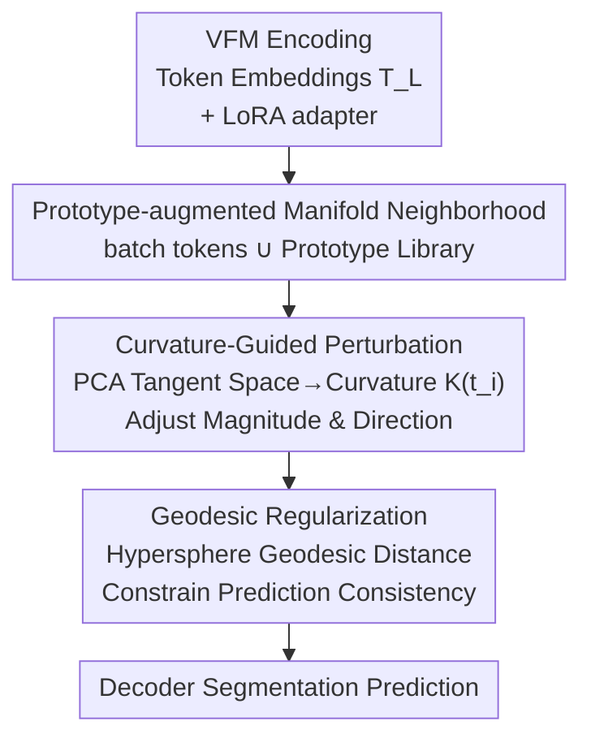

# GeCo: Geometry-Consistent Regularization for Domain Generalized Semantic Segmentation

**Conference**: CVPR 2026  
**Paper**: [CVF Open Access](https://openaccess.thecvf.com/content/CVPR2026/html/Zang_GeCo_Geometry-Consistent_Regularization_for_Domain_Generalized_Semantic_Segmentation_CVPR_2026_paper.html)  
**Code**: https://github.com/DZhaoXd/GeCo  
**Area**: 3D Vision / Domain Generalized Segmentation  
**Keywords**: Domain Generalized Semantic Segmentation, Visual Foundation Models, Parameter-Efficient Fine-Tuning, Curvature-Guided Perturbation, Geodesic Regularization  

## TL;DR
Addressing the issue where adapting Visual Foundation Models (VFMs) via PEFT for Domain Generalized Semantic Segmentation (DGSS) leads to overfitting on the source domain and destruction of pre-trained geometric structures, GeCo proposes **Curvature-Guided Perturbation** (adjusting perturbation intensity/direction based on local manifold complexity per token) and **Geodesic Regularization** (constraining prediction consistency on the hypersphere of the probability simplex). It achieves SOTA on closed-set and open-set DGSS with only 4.7M trainable parameters.

## Background & Motivation
**Background**: Domain Generalized Semantic Segmentation (DGSS) involves training on a source domain to generalize to unseen target domains. Recent mainstream approaches utilize Visual Foundation Models (VFMs) like DINOv2, EVA02, or CLIP as backbones, inserting lightweight adapters via Parameter-Efficient Fine-Tuning (PEFT, e.g., LoRA, Rein, FADA) for segmentation tasks.

**Limitations of Prior Work**: The authors identify a counter-intuitive phenomenon: PEFT adaptation causes representation "degradation" in VFMs. Adapters tend to overfit source domain statistics and observed class boundaries, manifesting as two entangled dimensions: **domain bias** (performance drops under appearance changes like day to night or clear to snow) and **semantic rigidity** (imposing overconfident boundaries on known classes, forcing unknown objects into known classes in open-set scenarios). In other words, the rich representations learned by VFMs during pre-training are "squashed" into a narrow source domain subspace during downstream adaptation.

**Key Challenge**: A natural mitigation is **perturbation regularization**—injecting noise into the adapter's output representations to expand the explored feature region and reduce overconfident boundaries. However, visualization (Fig. 2) reveals that VFM tokens inherently possess **class-consistent and spatially coherent** geometric organizations (tokens of the same class cluster together; adjacent tokens are similar). **Random Gaussian noise breaks this geometric structure indiscriminately**, leading to semantic drift and unstable boundaries, which ultimately harms generalization.

**Goal**: To design perturbations that simultaneously "expand representation diversity" and "respect pre-trained geometry"—neither under-perturbing (insufficient exploration, underfitting) nor perturbing blindly (destroying manifold structure).

**Key Insight**: By viewing the token embedding space as a non-Euclidean manifold, **local curvature can quantify "where to perturb more and where to perturb less."** Moreover, **geodesic distance** (rather than Euclidean or KL) is used at the prediction end to constrain consistency before and after perturbation, allowing the fine-tuning process to "extrapolate downstream tasks along the manifold geometry" rather than crudely restructuring the representation space.

## Method

### Overall Architecture
GeCO is a "structure-respecting" VFM fine-tuning framework applied to LoRA adapters. Given an input image, the VFM encoder decomposes it into patches, passing through $L$ transformer layers (each with MHSA + MLP; adapters are inserted at `attn.qkv / attn.proj / mlp.fc1 / mlp.fc2`), resulting in token embeddings $T_L=\{t_1,\dots,t_N\}$. Instead of directly predicting from the adapter output, GeCo performs two operations in the token space before feeding them to the decoder:

1.  **Local Manifold Construction + Curvature Calculation**: Current batch tokens are combined with a **prototype library** to form a local neighborhood. PCA is used to estimate the tangent space of each token, and the deviation from the tangent plane is calculated as a **curvature proxy** $K(t_i)$.
2.  **Curvature-Guided Perturbation**: High curvature (semantic boundaries, complex regions) $\rightarrow$ small perturbation, restricted within the tangent plane (preserving detail). Low curvature (flat, homogeneous regions) $\rightarrow$ large perturbation, allowed to explore along the normal direction (promoting exploration).
3.  **Geodesic Regularization**: Predictions $p_i, p_i'$ of tokens before and after perturbation are mapped to a hypersphere. **Geodesic distance** constraints their consistency to avoid semantic drift caused by perturbation.

The three steps form a pipeline: Prototype-augmented neighborhood $\rightarrow$ Curvature $\rightarrow$ Geometry-aligned perturbation $\rightarrow$ Geodesic consistency.

### Key Designs

**1. Prototype-augmented Manifold Neighborhood: Sufficient Context for Curvature Estimation**

To adjust perturbation by local geometric complexity, reliable estimation of the local manifold structure is required. However, **token samples in a single batch are too sparse to provide rich local geometry**. GeCo introduces a **prototype library** $B=\{\mu_1^c,\dots,\mu_{M_c}^c\}$, where each prototype $\mu_i^c\in\mathbb{R}^d$ represents a semantic variant of class $c$. The extended manifold is defined as $M_{proto}=T_L\cup B$. For a token $t_i$ in the current batch, its neighborhood is retrieved from both batch tokens and prototypes based on a distance threshold $\eta$: $N_{proto}(t_i)=\{t_j\in T_L:\|t_i-t_j\|_2\le\eta\}\cup\{\mu_k^c\in B:\|t_i-\mu_k^c\|_2\le\eta\}$. This neighborhood reflects both **local** (same-batch neighbors) and **global** (cross-sample class semantics) relationships.

**2. Curvature-Guided Perturbation: Deciding "How Much" and "Where" to Perturb**

This is the core of GeCo, directly addressing the conflict between exploration and structure preservation. It involves calculating curvature and then using it to modulate both the **magnitude** and **direction** of perturbation.

**How Curvature is Calculated**: PCA is performed on the neighborhood $N_{proto}(t_i)$. A difference vector matrix $X_i$ is constructed, and the covariance $\Sigma_i=\frac{1}{|N_{proto}(t_i)|}X_i^\top X_i$ is computed. The top $k$ eigenvectors $\{e_1,\dots,e_k\}$ span the **tangent space** $T_{t_i}(M_{proto})$. Curvature is defined as the normalized mean squared distance of neighboring points from the tangent plane:

$$K(t_i)=\frac{1}{|N_{proto}(t_i)|}\sum_{t_j\in N_{proto}(t_i)}\frac{\|t_j-\mathrm{Proj}_{T_{t_i}}(t_j)\|_2^2}{\|t_j-t_i\|_2^2+\delta}$$

where the projection $\mathrm{Proj}_{T_{t_i}}(t_j)=t_i+\sum_{r=1}^k\langle t_j-t_i,e_r\rangle e_r$. Dividing by $\|t_j-t_i\|^2$ ensures the proxy is **dimensionless and scale-invariant**.

**Magnitude**: Inversely proportional to curvature, $\epsilon_i=\dfrac{\alpha}{1+K(t_i)}$. High curvature (boundaries) receives small perturbations; low curvature (flat areas) receives large perturbations.

**Direction**: High-curvature regions restrict perturbations **within the tangent plane** ($v_h\in T_{t_i}(M_{proto})$) to maintain semantic consistency. Low-curvature regions allow **moving out of the tangent plane** by incorporating a normal component for orthogonal exploration $v_l=v_o+\beta n_i$. The perturbed token is $t_i'=t_i+\epsilon_i v\odot\Delta t_i$.

**3. Geodesic Regularization: Consistency on the "Surface" of the Probability Simplex**

Standard Euclidean or KL distances assume the prediction space is flat. GeCo uses a **hypersphere proxy space** to approximate the prediction manifold. Projections are mapped to a hypersphere via a square-root mapping. Let $p_i=\mathrm{softmax}(z_i)$ and $p_i'=\mathrm{softmax}(z_i')$ be predictions before and after perturbation. The geodesic distance is defined as:

$$d_{geo}(p_i,p_i')=\arccos\left(\sum_{c=1}^C\sqrt{p_i^{(c)}p_i'^{(c)}}\right)$$

The regularization loss is $L_{geo}=\mathbb{E}_{t_i}[d_{geo}^2(p_i,p_i')]$. The gradient of $L_{geo}$ includes a **global angular term** $\frac{\theta}{\sin\theta}$ that amplifies updates for predictions with large drift, and a **class-local modulation term** that calibrates based on confidence shifts.

### Loss & Training
LoRA adapters are inserted into ViT blocks. The training objective is the sum of the standard segmentation loss and the geodesic regularization loss $L_{geo}$. The method introduces minimal trainable parameters (4.7M) and does not require explicit OOD modeling; open-set experiments simply add an RPL objective and COCO masks as auxiliary data.

## Key Experimental Results

### Main Results
Closed-set DGSS (GTA5 $\rightarrow$ Cityscapes + BDD + Mapillary, Mean mIoU):

| Backbone | Method | Trainable Params | Citys. | BDD | Map. | Avg. |
|----------|------|-----------|--------|-----|------|------|
| DINOv2-L | Rein | 2.99M | 66.4 | 60.4 | 66.1 | 64.3 |
| DINOv2-L | FADA | 11.65M | 68.2 | 61.9 | 68.1 | 66.1 |
| DINOv2-L | FisherTune | 15.21M | 68.2 | 63.3 | 68.0 | 66.5 |
| DINOv2-L | **Ours** | **4.70M** | **68.5** | **64.6** | **69.9** | **67.7** |
| EVA02-L | tqdm | 304.20M | 68.9 | 59.2 | 70.1 | 66.1 |
| EVA02-L | **Ours** | **4.70M** | 67.8 | **62.8** | 68.4 | **66.3** |

For open-set DGSS (Cityscapes $\rightarrow$ MUAD), GeCo+RPL improves over Rein+RPL by **6.8% AP** and reduces **FPR95 by 5.6%**, demonstrating superior feature separability.

### Ablation Study
Component analysis (Average mIoU; CGP=Curvature-Guided Perturbation, GBR=Geodesic Regularization, RP=Random Perturbation):

| Configuration | EVA02-L Avg. | DINOv2-L Avg. | Description |
|------|-------------|---------------|------|
| Full Fine-tuning | 61.0 | 61.8 | Baseline |
| RP + MSE | 64.0 | 62.8 | Random perturbation + Euclidean consistency |
| CGP + MSE | 65.3 | 65.7 | Replaced with CGP |
| **Ours (CGP+GBR)** | **66.3** | **67.7** | Full model |

### Key Findings
- **RP+MSE offers limited gains**, confirming that random noise destroys pre-trained geometry.
- **CGP is the primary driver of performance**, allowing for exploration without restructuring the manifold.
- **GBR provides further stabilization**, using curvature-aware gradients to pull inconsistent predictions back along the geodesic.
- **Greater gains on more difficult domains**, such as ACDC (Night/Rain) and MUAD (OOD), where visual cues are degraded.

## Highlights & Insights
- **Shifting Perturbation from Euclidean to Manifold Geometry**: The core insight is that VFM generalization lies in the geometric organization of tokens. Using tangent space deviation as a lightweight curvature proxy effectively bridges this theory to practice.
- **Curvature-Inversed Modulation**: The high-curvature for preservation and low-curvature for exploration rule elegantly manages the "exploration vs. structure preservation" trade-off.
- **Geodesic Gradient Analysis**: The decomposition into a global angular term and local modulation term explains why GBR outperforms Euclidean penalties, as it distinguishes manifold curvature from confidence structure.

## Limitations & Future Work
- **Prototype Library**: The maintenance, initialization, and sensitivity of the prototype library require further detail.
- **Hyperparameter Complexity**: Multiple parameters ($\alpha, \beta, \eta, k$) may increase tuning costs.
- **Computation Overhead**: PCA-based curvature estimation depends on token density and neighborhood size, which might be costly for high-resolution images.
- **Task Generality**: Currently validated on segmentation; its performance on detection or depth estimation is yet to be explored.

## Related Work & Insights
- **vs. Random Perturbation**: RP ignores pre-trained topology, while GeCo aligns updates with the local manifold.
- **vs. VFM Adapters (Rein/FADA)**: GeCo is **complementary**; it does not change the adapter structure but acts as a regularizer on their output.
- **vs. Euclidean/KL Consistency**: GeCo demonstrates that the probability simplex is a curved manifold, requiring geodesic metrics for faithful geometric preservation.

## Rating
- Novelty: ⭐⭐⭐⭐⭐ 
- Experimental Thoroughness: ⭐⭐⭐⭐⭐ 
- Writing Quality: ⭐⭐⭐⭐ 
- Value: ⭐⭐⭐⭐⭐

<!-- RELATED:START -->

## Related Papers

- [\[AAAI 2026\] Do We Need Perfect Data? Leveraging Noise for Domain Generalized Segmentation](../../AAAI2026/segmentation/do_we_need_perfect_data_leveraging_noise_for_domain_generalized_segmentation.md)
- [\[CVPR 2026\] PEARL: Geometry Aligns Semantics for Training-Free Open-Vocabulary Semantic Segmentation](pearl_geometry_aligns_semantics_for_training-free_open-vocabulary_semantic_segme.md)
- [\[AAAI 2026\] Causal-Tune: Mining Causal Factors from Vision Foundation Models for Domain Generalized Semantic Segmentation](../../AAAI2026/segmentation/causal-tune_mining_causal_factors_from_vision_foundation_mod.md)
- [\[CVPR 2026\] Phrase-Instance Alignment for Generalized Referring Segmentation](phrase-instance_alignment_for_generalized_referring_segmentation.md)
- [\[CVPR 2026\] Selective, Regularized, and Calibrated: Harnessing Vision Foundation Models for Cross-Domain Few-Shot Semantic Segmentation](selective_regularized_and_calibrated_harnessing_vision_foundation_models_for_cro.md)

<!-- RELATED:END -->
