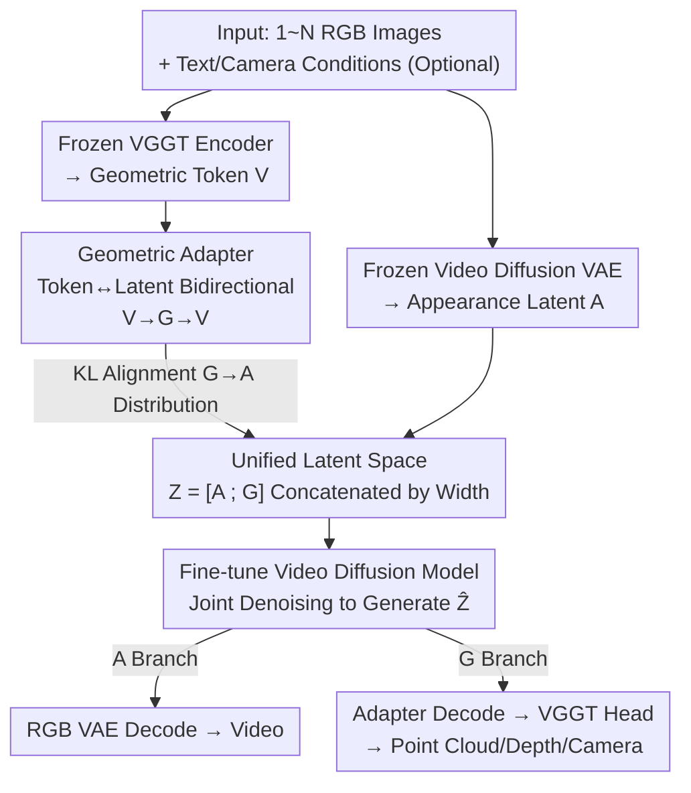

# Gen3R: 3D Scene Generation Meets Feed-Forward Reconstruction

**Conference**: CVPR 2026  
**Paper**: [CVF Open Access](https://openaccess.thecvf.com/content/CVPR2026/html/Huang_Gen3R_3D_Scene_Generation_Meets_Feed-Forward_Reconstruction_CVPR_2026_paper.html)（Project Page <https://xdimlab.github.io/Gen3R/>）  
**Code**: None  
**Area**: 3D Vision / 3D Scene Generation / Video Diffusion  
**Keywords**: 3D Scene Generation, Feed-Forward Reconstruction, VGGT, Video Diffusion, Joint Geometry-Appearance Latent Space  

## TL;DR
Gen3R transforms the feed-forward reconstruction model VGGT into a "geometric VAE" to align its output geometric latents with the appearance latents of a pre-trained video diffusion model into a unified latent space. It then fine-tunes the video diffusion model to jointly generate RGB videos and globally consistent point clouds/depths/cameras, achieving state-of-the-art (SOTA) performance in both single-view and dual-view conditional 3D scene generation, while reciprocally enhancing the robustness of reconstruction.

## Background & Motivation
**Background**: The mainstream of 3D scene generation consists of two paradigms. One relies on 2D generation priors: optimizing NeRF/3DGS against a 2D diffusion distribution via SDS, or synthesizing multi-view images with 2D diffusion followed by reconstruction/step-by-step expansion. The other is feed-forward: compressing 3D scenes into a compact latent space using a VAE, and running latent diffusion directly within the latent space for feed-forward generation (which mostly generates Gaussians + differentiable rendering, trained under 2D supervision).

**Limitations of Prior Work**: The first paradigm lacks explicit 3D reasoning, resulting in geometric inconsistency, poor multi-view fidelity, and high optimization costs. The second paradigm requires training a "geometry-centric" VAE, but scene-level 3D ground truth is extremely scarce, forcing reliance on 2D signal supervision, which limits both geometric and generation quality. Even works compressing the 3D output of reconstruction models like Dust3R/VGGT to construct a VAE merely treat them as a "black box for point cloud generation."

**Key Challenge**: On one hand, generation models struggle to ensure 3D consistency due to the lack of 3D ground truth. On the other hand, feed-forward reconstruction models like VGGT **already encode rich multi-view geometry** (depth, camera poses, global structures) in a spatially compact token space. Existing methods compress the "final output" of reconstruction models while overlooking that their "intermediate token latent manifolds" are the true goldmine of geometric priors.

**Goal**: Can the intrinsic latent manifold learned by reconstruction models be directly reused as the geometric prior foundation for 3D scene generation, instead of painstakingly training a geometric VAE from scratch? Additionally, it should support flexible conditions (single/multi-view, with or without camera cues) and facilitate reconstruction tasks.

**Key Insight**: View VGGT as an **asymmetric geometric VAE**. Its encoder is already available (images $\to$ geometric tokens). One only needs to append an adapter to project these tokens into low-dimensional latent variables suitable for diffusion models, and project them back to the native DPT head for decoding. The major difficulty lies in the fact that the distribution of these geometric latents differs significantly from the appearance latents of video diffusion models, causing divergence during direct joint training.

**Core Idea**: Compress VGGT tokens into geometric latents using an adapter, and align their distribution to the appearance latent distribution of a pre-trained video diffusion model via KL loss. This yields a "decoupled yet aligned" unified latent space. The video diffusion model is then fine-tuned to **jointly generate appearance and geometry** in this space, directly fusing the geometric priors of reconstruction models with the RGB priors of video diffusion.

## Method

### Overall Architecture
Gen3R aims to tackle the task of "generating visually appealing (RGB video) and geometrically consistent (global point cloud/depth/camera) 3D scenes given one or two images." It is structured into two stages: first, **offline training a geometric adapter** to convert the frozen VGGT into a module that yields "geometric latents $G$ suitable for diffusion," while aligning the distribution of $G$ with the appearance latents $A$ of the video diffusion VAE. Second, **fine-tuning the video diffusion model** to jointly denoise and generate both modalities within the unified concatenated latent space $Z=[A;G]$. During inference, the unified latents are sampled from noise and decoded separately into video and geometry using the RGB VAE decoder and the adapter-to-VGGT head. The entire pipeline requires no explicit 3D ground truth supervision, relying solely on the self-reconstruction of reconstruction tokens and distribution alignment.

### Key Designs

**1. Token-to-Latent Geometric Adapter: Recasting VGGT as an Asymmetric Geometric VAE**

The limitation is that VGGT's geometric tokens $V\in\mathbb{R}^{N\times L\times h_v\times w_v\times C}$ ($C=2048$, using $L=4$ intermediate tokens from layers 4/11/17/23) have a high dimensionality and spat-temporal resolution that mismatches the video diffusion latent space ($c=16$), making them unsuitable for direct diffusion. Instead of redesigning a geometric VAE, Gen3R utilizes the off-the-shelf VGGT as an encoder and introduces a pair of lightweight adapters $(E_{adp}, D_{adp})$: the encoder $E_{adp}: V\to G\in\mathbb{R}^{n\times h\times w\times c}$ compresses the high-dimensional tokens to match the spatial resolution and dimensions of the video diffusion latents; the decoder $D_{adp}: G\to \hat V$ projects them back to the token space, which are then passed to VGGT’s native DPT head to decode point clouds $\hat P$, depth $\hat D$, and camera poses $\hat T$.

This embodies the concept of an "asymmetric VAE": the encoder is a frozen foundation model (VGGT), and only the adapter bottleneck layer is trainable. The training uses a reconstruction loss, which regularizes both the token consistency and the decoded multi-modal geometric consistency:

$$L_{rec}=\mathbb{E}\|\hat V-V\|^2+\mathbb{E}\|\hat T-T\|_1+\mathbb{E}\|\hat D-D\|^2+\mathbb{E}\|\hat P-P\|^2.$$

The advantage is that geometric priors (various 3D properties, high-level scene understanding) are inherited at nearly zero cost, bypassing the challenge of needing 3D ground truth.

**2. KL Distribution Alignment: Allowing Geometric Latents to Grow "Decoupled yet Aligned" into the Appearance Latent Space**

Simply compressing the tokens is insufficient. Authors observed that when using only $L_{rec}$, the adapter compresses the geometric tokens but **fails to constrain the structure of the mapped latent space**. The distribution of geometric latents $G$ deviates significantly from the appearance latents $A$, leading to divergence and poor generation quality when directly integrated into diffusion training. While conventional LDMs regularize the latent space using VAE/VQ-VAE priors, this approach directly aligns the geometric latent distribution $q_G$ with the pre-trained RGB latent distribution $q_A$ via a KL loss:

$$L_{KL}=D_{KL}(q_G\,\|\,q_A).$$

The total loss for the adapter is $L=\lambda_1 L_{rec}+\lambda_2 L_{KL}$. This step is critical as it ensures the **compatibility** of the two latent spaces, enabling a single diffusion model to model both appearance and geometry distributions. Crucially, the representation is "decoupled yet aligned": $A$ and $G$ remain independent modalities (each processed by their respective decoders), but their distribution characteristics are aligned to share the same denoising process. Ablation studies show that omitting $L_{KL}$ results in severe degradation across all metrics (see table below), underscoring the importance of this design.

**3. Geometry-Aware Joint Generation in Unified Latent Space: Width Concatenation + Multi-Conditional Control**

With the aligned latent space, appearance latents $A=E_W(I)$ and geometric latents $G$ are **concatenated along the width dimension** to form $Z=[A;G]\in\mathbb{R}^{n\times h\times 2w\times c}$. The pre-trained video diffusion model $G_\theta$ is then fine-tuned to perform joint denoising on this unified representation. Concatenating along the width rather than adding new channels or branches **avoids introducing extra trainable parameters and preserves the pre-trained generation capabilities** of the model. The denoising process accepts multiple conditions: text $y$, conditional image sequence $I_{cond}$ (zero-padded for missing frames), corresponding binary mask $M$, and optional per-view cameras $T_{cond}$:

$$G_\theta:(Z_t; t, y, I_{cond}, M, T_{cond})\to \hat Z_{t-1}.$$

A key detail is that **geometric latents are not fed as input conditions**, allowing the model to perform various tasks directly from the input images; during training, three conditional configurations ("first frame / first-and-last frames / full sequence") are randomly sampled with a 1/3 probability, adjusting masks accordingly. Camera conditions are dropped with 50% probability, and text is dropped with 20% (for CFG). This configuration enables a single model to handle single-view generation, dual-view generation, and feed-forward reconstruction, with or without camera inputs. Once generated, the video is decoded using the RGB VAE decoder $D_W$, while the geometry is decoded using the adapter-to-VGGT head and unprojected into final geometry using the generated camera parameters.

### Loss & Training
Two-stage training: ① The adapter is trained using $L=\lambda_1 L_{rec}+\lambda_2 L_{KL}$ (first 15k steps at 25 frames, $560\times560$, followed by 6k fine-tuning steps at 49 frames on 24 H20 GPUs with a total batch size of 192, randomly initialized). ② The diffusion end fine-tunes an image-camera conditional Wan2.1 model for 8k steps at 49 continuous frames, $560\times560$, with a batch size of 4. The dataset is a mixture of over 300,000 multi-view scenes from RealEstate10K, DL3DV-10K, ACID, TartanAir, KITTI-360, Waymo, Co3Dv2, MVImgNet, Virtual KITTI 2, and WildRGB-D. Texts are generated by multimodal LLMs. **No explicit 3D GT representations are used throughout the entire process.**

## Key Experimental Results

### Main Results: Appearance + Geometry Generation
Appearance generation (RealEstate10K / DL3DV-10K, 1-view & 2-view). The table below extracts key metrics under the 1-view setting. Gen3R achieves leading performance in PSNR, SSIM, LPIPS, and VBench imaging quality:

| Setting | Method | RE10K PSNR↑ | RE10K LPIPS↓ | DL3DV PSNR↑ | DL3DV LPIPS↓ |
|------|------|------|------|------|------|
| 1-view | Gen3C | 20.26 | 0.2302 | 16.21 | 0.4575 |
| 1-view | WVD | 17.62 | 0.3300 | 14.25 | 0.5063 |
| 1-view | **Ours** | **20.51** | **0.2281** | **16.38** | **0.4234** |
| 2-view | LVSM | 29.58 | 0.1060 | 18.80 | 0.3575 |
| 2-view | **Ours** | 27.05 | **0.1352** | 18.59 | **0.3416** |

> Note: Under the 2-view setting, the non-generative method LVSM achieves a higher PSNR (as it is fundamentally inter-view interpolation). However, it degrades significantly in 1-view settings and tends to blur in overexposed scenes. As a generative method, Gen3R is more stable in terms of LPIPS, cross-dataset generalization, and occlusion filling.

Geometry generation (point cloud, CD selection - lower is better). Gen3R consistently outperforms explicit 3D generation baselines Aether and WVD on Co3Dv2 / WildRGB-D / TartanAir:

| Setting | Method | Co3Dv2 CD↓ | WildRGB-D CD↓ | TartanAir CD↓ |
|------|------|------|------|------|
| 1-view | Aether | 1.9498 | 0.3066 | 3.8457 |
| 1-view | WVD | 1.6137 | 0.2635 | 3.7302 |
| 1-view | **Ours** | **1.1047** | **0.1992** | **2.7809** |
| 2-view | **Ours** | **0.9767** | **0.1426** | **1.9734** |

While VGGT serves as a pure reconstruction baseline with higher accuracy, it suffers from poor completeness (as it does not generate geometry for novel views), leading to a worse CD (Chamfer Distance) than Gen3R.

### Reconstruction Enhancement (Generative Priors Feeding Back to Reconstruction)
In the feed-forward reconstruction task, Ours (VAE only) encodes and decodes VGGT token, maintaining a level comparable to VGGT. Meanwhile, the complete Ours (generative version) **improves reconstruction quality** because joint modeling of appearance and geometry allows the two modalities to mutually calibrate, eliminating VGGT’s floater noises:

| Method | Co3Dv2 CD↓ | WildRGB-D CD↓ | TartanAir CD↓ |
|------|------|------|------|
| VGGT | 0.9632 | 0.1165 | 1.5957 |
| WVD (VAE only) | 1.2080 | 0.1526 | 2.7867 |
| Ours (VAE only) | 0.9986 | 0.1165 | 1.6518 |
| **Ours (Generative)** | **0.9625** | 0.1260 | **1.5101** |

### Ablation Study
Two core ablations: **2-Stage** (generating RGB first and then reconstruct geometry separately via VGGT) and **w/o $L_{KL}$** (removing the distribution alignment loss).

| Configuration | RE10K PSNR↑(1v) | RE10K CD↓→Co3Dv2(1v) | Description |
|------|------|------|------|
| 2-Stage | 17.38 | 1.6223 | 2D generation and 3D reconstruction cascaded, introducing error accumulation |
| w/o $L_{KL}$ | 16.31 | 1.9620 | Geometric and appearance latent distributions deviate; fails to converge, severe quality drop |
| **Full** | **20.51** | **1.1047** | Complete model |

Camera controllability (AUC@30) highlights the significance of $L_{KL}$: w/o $L_{KL}$ drops to 0.4100 on RealEstate10K 1-view compared to 0.7443 for Full model, whereas 2-Stage (0.6832) is also significantly lower than Full.

### Key Findings
- **$L_{KL}$ distribution alignment is crucial**: Removing it not only degrades generation quality but also nearly halves camera controllability (0.74 $\to$ 0.41), proving that embedding geometric latents into the appearance latent distribution is a prerequisite for joint generation, rather than an optional regularization.
- **Joint generation outperforms two-stage pipelines**: Simply cascading generation and reconstruction in a 2-Stage approach accumulates errors. Joint denoising allows mutual constraints between appearance and geometry, leading to improvements in appearance, geometry, and camera pose accuracy.
- **Generative priors can feed back to reconstruction**: The reconstruction Chamfer Distance (CD) of the full generative model slightly outperforms the pure VGGT, demonstrating that the coupling is not a one-way benefit from reconstruction to generation, but a bidirectional improvement.

## Highlights & Insights
- **A perspective shift of "reconstruction models as geometric VAEs"**: Instead of compressing the final output (point clouds) of VGGT, Gen3R directly reuses its intermediate token latent manifold as a geometric prior, bypassing the deadlock of training a geometric VAE from scratch without 3D ground truth. This is the most insightful contribution.
- **Decoupled yet aligned + width concatenation**: Aligning heterogeneous latent variables via KL loss and concatenating them along the width dimension into a single diffusion model introduces no extra parameters and preserves pre-trained generation capabilities—a highly reproducible trick for multi-modal joint generation.
- **Three tasks, one model**: By randomly sampling conditional configurations during training (first frame / first-and-last frames / full sequence + random camera dropout), single-view generation, dual-view generation, and feed-forward reconstruction are unified under a single set of weights.
- **Transferability**: This paradigm—adapting intermediate representations of foundation models into the diffusion latent space combined with KL alignment—can be generalized to other modalities with strong prior foundation models but lacking generative capabilities (e.g., segmentation, normals, material).

## Limitations & Future Work
- Strongly dependent on two large foundation models, VGGT and Wan2.1; the upper limit of geometry is bounded by VGGT (the accuracy is still slightly inferior to pure VGGT, though CD is better due to completeness).
- High training costs (24 $\times$ H20, 300k+ scenes), and geometric details or performance under extreme occlusion and large-view extrapolation have not been fully stress-tested.
- Source code is not open-source (only project page available), requiring manual implementation of the adapter and concatenated fine-tuning for replication. The WVD baseline is reproduced by the authors, so caution is advised regarding implementation details in comparisons.
- Future directions: Explore lighter token selection strategies for geometry and incorporate more 3D properties (semantics, materials) beyond camera and depth into the unified latent space.

## Related Work & Insights
- **vs Aether / WVD (Explicit 3D Generation)**: These methods jointly generate RGB + geometry but follow the path of "compressing reconstruction outputs." Gen3R aligns reconstruction and generation in the latent space, achieving superior geometric CD and camera controllability, proving that "aligning the latent manifold" is superior to "compressing the output."
- **vs Geometry Forcing (GF)**: GF aligns intermediate diffusion features to reconstruction models during diffusion training. Gen3R reverses this by aligning the two latent spaces **before** diffusion training, yielding superior effectiveness and stability in practice.
- **vs VGGT (Pure Feed-Forward Reconstruction)**: VGGT only reconstructs from input views and does not generate geometry for novel views (poor completeness). Gen3R generates novel-view geometry while feeding back to eliminate VGGT's floater artifacts.
- **vs SDS / Multi-view Synthesis-based 3D Scene Generation**: Avoids the high cost of per-scene optimization and geometric inconsistencies by outputting RGB + global point clouds in a single feed-forward pass.

## Rating
- **Novelty**: ⭐⭐⭐⭐⭐ The perspective of "intermediate tokens of reconstruction models as geometric VAEs" paired with KL-aligned dual latent spaces is novel and bridges reconstruction and generation.
- **Experimental Thoroughness**: ⭐⭐⭐⭐⭐ Evaluated across 5 datasets with 4 types of metrics (appearance/geometry/reconstruction/camera) and dual ablations (2-Stage and w/o $L_{KL}$), providing a rigorous verification.
- **Writing Quality**: ⭐⭐⭐⭐ Clear methodological exposition and logical progression; some details (such as the adapter structure and camera tokens) are relegated to the supplementary material.
- **Value**: ⭐⭐⭐⭐⭐ Provides a highly reusable paradigm for the "no 3D ground truth" bottleneck in 3D scene generation, with practical significance in letting generation feed back to reconstruction.

<!-- RELATED:START -->

## Related Papers

- [\[CVPR 2026\] Pano3DComposer: Feed-Forward Compositional 3D Scene Generation from Single Panoramic Image](pano3dcomposer_feed-forward_compositional_3d_scene_generation_from_single_panora.md)
- [\[CVPR 2026\] UniSH: Unifying Scene and Human Reconstruction in a Feed-Forward Pass](unish_unifying_scene_and_human_reconstruction_in_a_feed-forward_pass.md)
- [\[CVPR 2026\] PanoVGGT: Feed-Forward 3D Reconstruction from Panoramic Imagery](panovggt_feed-forward_3d_reconstruction_from_panoramic_imagery.md)
- [\[CVPR 2026\] TokenSplat: Token-aligned 3D Gaussian Splatting for Feed-forward Pose-free Reconstruction](tokensplat_token-aligned_3d_gaussian_splatting_for_feed-forward_pose-free_recons.md)
- [\[CVPR 2026\] ForeHOI: Feed-forward 3D Object Reconstruction from Daily Hand-Object Interaction Videos](forehoi_feed-forward_3d_object_reconstruction_from_daily_hand-object_interaction.md)

<!-- RELATED:END -->
