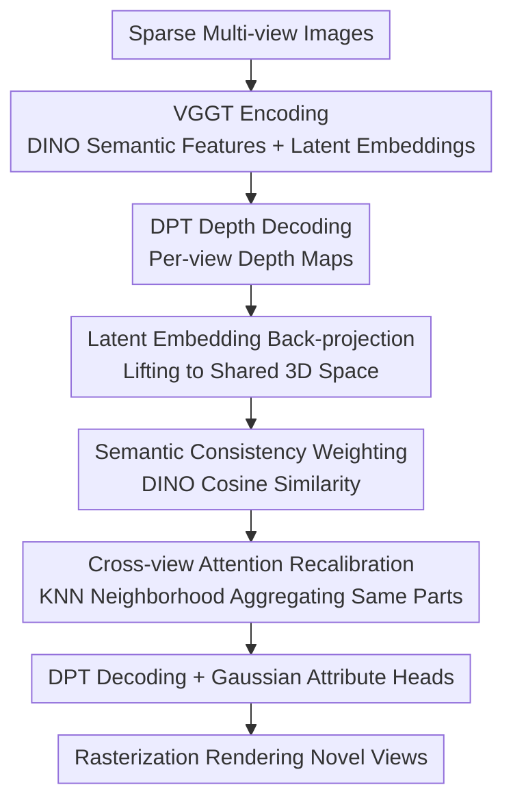

# Generalizable Human Gaussian Splatting via Multi-view Semantic Consistency

**Conference**: CVPR2026  
**arXiv**: [2604.25466](https://arxiv.org/abs/2604.25466)  
**Code**: https://github.com/DCVL-3D/GHGS-MVSC_release (Available)  
**Area**: 3D Vision / Human Rendering / Gaussian Splatting  
**Keywords**: Generalizable Human Gaussian Splatting, Sparse Views, Semantic Consistency, Cross-view Attention, VGGT

## TL;DR
To address the "inaccurate Gaussian localization" problem in generalizable human Gaussian splatting under sparse views, this paper back-projects latent embeddings from each view into a shared 3D space. It then utilizes DINO semantic features to determine which points belong to the same body part and performs cross-view attention recalibration. This leads to more accurate 3D Gaussian placement in highly textured and occluded areas, achieving SOTA results on ZJU-Mocap, HuMMan, and THuman2.0.

## Background & Motivation
**Background**: 3D Gaussian Splatting (3DGS) has become a mainstream approach for human rendering through explicit Gaussian primitives and differentiable rasterization. To overcome the limitations of "per-subject optimization and reliance on dense views," recent work has shifted toward **generalizable** feed-forward schemes—predicting 3D Gaussian parameters for unseen subjects in a single forward pass given sparse view inputs.

**Limitations of Prior Work**: Existing generalizable schemes fall into two main categories, each with weaknesses. One category uses SMPL UV maps/meshes to initialize and refine Gaussian positions (GHG, RoGSplat). However, SMPL is a "skinned" model that misplaces Gaussians on non-rigid surfaces like hair and loose clothing; furthermore, rendering quality relies heavily on SMPL parameter accuracy, which becomes unreliable during large movements or self-occlusions. The other category uses explicit geometric constraints (plane-sweep cost volume, epipolar geometry) to estimate depth and then back-projects point clouds for Gaussian localization (GPS-Gaussian, EVA-Gaussian). While positions are more flexible, **insufficient overlap between sparse views** leads to matching errors and inaccurate depth estimation.

**Key Challenge**: Complex human joints combined with low multi-view overlap cause feature representations to be **misaligned** in the 2D image domain. Spatial ambiguity in high-texture areas (garment folds, faces) and occluded regions makes it difficult for models to distinguish "which two pixels belong to the same body part," resulting in Gaussian localization drift.

**Goal**: To precisely locate 3D Gaussians by aligning multi-view features to the **same body parts** without relying on perfect SMPL models or demanding explicit geometric constraints.

**Key Insight**: The authors observe that spatially adjacent feature points do not necessarily belong to the same part (depth errors can mix in neighbors), but **points with similar semantic features (DINO) are highly likely to be the same part**. Consequently, "geometric adjacency" and "semantic consistency" are combined to filter points for aggregation.

**Core Idea**: Back-project latent embeddings from each view into a shared 3D space, perform cross-view attention recalibration on **semantically consistent** points within spatial neighborhoods to impart "part-aware" information to the embeddings, and then regress Gaussian attributes.

## Method

### Overall Architecture
The input consists of sparse multi-view images of the same person (3/4/5 views), and the output is a set of 3D Gaussians for rendering novel views. The pipeline is a feed-forward flow: "encoding → 3D lifting → semantic consistency recalibration → Gaussian decoding → rasterization." A pre-trained **VGGT** encoder extracts both DINO semantic features and multi-view latent embeddings. A DPT-style decoder predicts per-view depth maps, which are used to back-project semantic features and latent embeddings into a shared 3D space. In this space, KNN identifies spatial neighbors, and cross-view attention weighted by semantic consistency recalibrates "same-part" embeddings. The recalibrated embeddings are projected back to 2D and processed through a DPT decoder and multiple attribute heads to predict Gaussian position offsets, rotation, scale, and opacity (colors are inherited from input RGB). Finally, rays are rasterized into images.

### Key Designs

**1. Back-projecting Latent Embeddings into Shared 3D Space: Lifting 2D Spatial Relations to 3D for Alignment**

The limitation is that spatial relationships across views cannot be established in the 2D image domain, as pixel positions of the same part across different views have no direct correspondence. Instead of only back-projecting "point cloud coordinates," this paper back-projects the **high-dimensional latent embeddings themselves** along with semantic features into 3D points using predicted depth and calibrated camera parameters: $F\in\mathbb{R}^{N_P\times C}$ (semantic features) and $E\in\mathbb{R}^{N_P\times C}$ (latent embeddings), where $N_P$ is the number of points and $C$ is the channel count. This converts 2D grids into spatially aligned 3D points, providing multi-view features with explicit spatial locations in a single coordinate system.

Mechanism: Lifting embeddings to 3D makes "spatial adjacency" meaningful, allowing for subsequent judgment of whether neighbors belong to the same part. This step also provides cross-view geometric constraints for the depth decoder; ablation shows it contributes most to depth estimation (removing it drops 4-view PSNR from 30.93 to 30.19).

**2. Weighting Cross-view Attention via Semantic Consistency: Using DINO Features to Distinguish "Spatially Near but Different Part" Points**

Relying solely on spatial adjacency can fail—points from different body parts might be clustered together due to depth errors, and blind aggregation could blur boundaries. The paper uses **DINO semantic features** (obtained for free from VGGT intermediate layers) to calculate semantic consistency $s_{j,k}$, which is the cosine similarity between the semantic features of two points:

$$s_{j,k}=\frac{F_j\cdot F_k}{\lVert F_j\rVert\,\lVert F_k\rVert}$$

This term is multiplied into the attention score to amplify "same-part" points and suppress "different-part" points. This prevents the model from confusing boundaries in high-texture (garments, face) and occluded regions. Setting $s_{j,k}$ to 1 reduced 4-view PSNR from 30.93 to 30.58 and worsened LPIPS. Note: Semantic consistency is computed only after 3D back-projection.

**3. KNN + Cross-view Attention Recalibration: Aggregating Same-part Embeddings into "Part-aware" Representations**

Even after lifting to 3D, depth errors cause slight misalignments. For each query point $j$, the model first uses KNN in 3D space to find a spatial neighborhood $\mathcal{N}(j)$ (where points likely belong to the same part with high semantic consistency). Cross-view attention is then applied over this set. The attention weight links the first and second designs:

$$\alpha_{j,k}=\mathrm{Softmax}\!\left(\frac{(W_{query}E_j)(W_{key}E_k)^\top}{\sqrt d}\cdot s_{j,k}\right)$$

The recalibrated result is $\tilde{E}_j=\sum_{k\in\mathcal{N}(j)}\alpha_{j,k}\,W_{value}E_k$. The aggregated embedding carries part-aware information and is projected back to 2D for Gaussian attribute regression. This is effective because Gaussian localization accuracy depends on the embedding "knowing" which part it belongs to; recalibration explicitly injects cross-view same-part information to resolve spatial ambiguity.

### Loss & Training
The model is trained end-to-end with total loss $\mathcal{L}_{total}=\mathcal{L}_{render}+\lambda_{geom}\mathcal{L}_{geom}$, where $\lambda_{geom}=1$. Rendering loss is a combination of L1 and SSIM: $\mathcal{L}_{render}=\lambda_{L_1}\lVert\hat I-I_{gt}\rVert_1+\lambda_{SSIM}(1-\mathrm{SSIM}(\hat I,I_{gt}))$, with $\lambda_{L_1}=0.8$ and $\lambda_{SSIM}=0.2$. Geometric loss $\mathcal{L}_{geom}$ is the Chamfer distance between back-projected points $\mathcal{P}_{all}$ and SMPL vertices $\mathcal{V}_{smpl}$, serving as a **weak geometric prior** to constrain the point cloud to the human shape. Final Gaussian localization is driven primarily by the rendering target and semantic consistency. Optimizer: AdamW, LR: $1\times10^{-4}$, batch size: 1, 200k iterations, inputs resized to $518\times518$, on a single RTX 3090.

## Key Experimental Results

### Main Results
Comparison with SMPL-based methods GHG and RoGSplat on ZJU-Mocap and HuMMan (4-view setup):

| Dataset | Metric | Ours | RoGSplat | GHG |
|--------|------|------|----------|-----|
| ZJU-Mocap | PSNR↑ | **30.58** | 30.12 | 27.94 |
| ZJU-Mocap | SSIM↑ | **0.9621** | 0.9613 | 0.9421 |
| ZJU-Mocap | LPIPS↓ | 0.0463 | **0.0459** | 0.0540 |
| HuMMan | PSNR↑ | **25.06** | 24.94 | 22.40 |
| HuMMan | SSIM↑ | **0.9392** | 0.9390 | 0.8915 |
| HuMMan | LPIPS↓ | 0.0690 | **0.0683** | 0.0945 |

On ZJU-Mocap, PSNR is 0.46 dB higher than RoGSplat. LPIPS is slightly behind, but PSNR/SSIM consistently lead, indicating sharper reconstruction and better structural preservation.

Comparison with Gaussian-based methods on THuman2.0 (3/5-view):

| View Count | Metric | Ours | RoGSplat | EVA-Gaussian | GPS-Gaussian |
|--------|------|------|----------|--------------|--------------|
| 3-view | PSNR↑ | **27.81** | 26.32 | - | - |
| 4-view | PSNR↑ | **30.93** | 28.94 | 26.31 | - |
| 5-view | PSNR↑ | **31.54** | 30.98 | 27.54 | 26.54 |
| 5-view | LPIPS↓ | **0.0269** | 0.0341 | 0.0297 | 0.0610 |

Comparison with NeRF-based methods (THuman2.0, 4-view): Ours (PSNR 30.93 / SSIM 0.9710 / LPIPS 0.0334) outperforms TransHuman (27.36 / 0.9487 / 0.0505), NHP (25.74), GP-NeRF (23.28), and SHERF (19.25). Ours avoids per-scene optimization and is significantly faster.

### Ablation Study
THuman2.0, 4-view setup, removing core components:

| 3D Back-proj | Semantic Consist. | PSNR↑ | SSIM↑ | LPIPS↓ |
|-----------|-----------|-------|-------|--------|
| ✗ | ✓ | 30.19 | 0.9676 | 0.0381 |
| ✓ | ✗ | 30.58 | 0.9695 | 0.0351 |
| ✓ | ✓ | **30.93** | **0.9710** | **0.0334** |

### Key Findings
- **3D Back-projection is the primary contributor**: Removing it (2D only) drops PSNR by 0.74 (30.93→30.19) because multi-view correspondences cannot be established in 2D, leading to depth errors and floater artifacts near occlusions.
- **Semantic Consistency Weighting is critical**: Setting $s_{j,k}$ to 1 drops PSNR by 0.35 (30.93→30.58), as the model confuses "spatially close but different part" points, resulting in blurred boundaries.
- **Robustness to Sparse Views**: PSNR remains high at 27.81 even with only 3 views, proving robustness to sparse setups.

## Highlights & Insights
- **Dual clues (Geometry + Semantic)**: Relying only on spatial adjacency is prone to depth error contamination. Adding DINO similarity as an attention weight acts as a semantic validation—this idea of using semantics as a geometric matching prior is transferable to many multi-view aggregation tasks.
- **Back-projecting "Features" instead of "Points"**: While older methods only back-project coordinates, this paper lifts high-dimensional latent embeddings to 3D, allowing cross-view attention to operate on features in a unified coordinate system. This is a clean paradigm for "feature-level 3D alignment."
- **Leveraging VGGT's DINO Features for free**: Semantic consistency features are extracted from intermediate layers of the VGGT encoder without requiring an additional semantic branch or extra training cost.
- **SMPL Independence**: By not anchoring to a SMPL template and using semantic consistency for alignment, the method is more effective for non-rigid areas like hair and clothing compared to traditional SMPL-based "skinning" approaches.

## Limitations & Future Work
- **Training still relies on SMPL vertices**: $\mathcal{L}_{geom}$ uses Chamfer distance to SMPL vertices as a soft constraint during training; the feasibility of training without any SMPL annotations remains unverified.
- **Dependency on Pre-trained VGGT**: The method's performance ceiling is determined by the VGGT encoder; failures in VGGT depth/correspondence estimation under extreme views will propagate.
- **LPIPS sometimes lags**: On ZJU-Mocap/HuMMan, LPIPS is slightly worse than RoGSplat, suggesting room for improvement in perceptual texture realism.
- **Scaling of KNN + Cross-view Attention**: The computational/memory cost of KNN search and attention as the number of points $N_P$ or views increases is not explicitly detailed.

## Related Work & Insights
- **vs RoGSplat / GHG (SMPL-anchored)**: These methods use SMPL UV/mesh to initialize Gaussians. They are limited by the skinning model's expression, leading to distortion in hair/clothing. Ours achieves higher PSNR by using semantic consistency to align features in 3D space.
- **vs GPS-Gaussian / EVA-Gaussian (Explicit Geometry)**: These use cost volumes/epipolar geometry for depth estimation, but fail when sparse view overlap is low. Ours remedies unreliable geometric matching with DINO semantic consistency.
- **vs NeRF-based (NHP / TransHuman)**: NeRF methods rely on volume rendering, which is slow and limited in quality. Ours is significantly faster while achieving higher quality (THuman2.0 PSNR 30.93 vs 27.36).

## Rating
- Novelty: ⭐⭐⭐⭐ The combination of semantic consistency weighted cross-view attention and feature back-projection is clear, though it builds on VGGT/DINO.
- Experimental Thoroughness: ⭐⭐⭐⭐ Results on three datasets across 3/5 views with comprehensive baselines; lacks quantitative analysis of speed/memory and LPIPS gap.
- Writing Quality: ⭐⭐⭐⭐ Logical flow from motivation to experiments is smooth; formulas and figures are clear.
- Value: ⭐⭐⭐⭐ Provides a practical paradigm for "semantically aligned features" in sparse-view human rendering; open-source code enhances utility.

<!-- RELATED:START -->

## Related Papers

- [\[CVPR 2026\] Any Resolution Any Geometry: From Multi-View To Multi-Patch](any_resolution_any_geometry_from_multi-view_to_multi-patch.md)
- [\[CVPR 2026\] Intrinsic Geometry-Appearance Consistency Optimization for Sparse-View Gaussian Splatting](intrinsic_geometry-appearance_consistency_optimization_for_sparse-view_gaussian_.md)
- [\[CVPR 2026\] Learning Spatial-Temporal Consistency for 3D Semantic Scene Completion](learning_spatial-temporal_consistency_for_3d_semantic_scene_completion.md)
- [\[CVPR 2026\] Improving Human Image Animation via Semantic Representation Alignment](improving_human_image_animation_via_semantic_representation_alignment.md)
- [\[CVPR 2026\] EcoSplat: Efficiency-controllable Feed-forward 3D Gaussian Splatting from Multi-view Images](ecosplat_efficiency-controllable_feed-forward_3d_gaussian_splatting_from_multi-v.md)

<!-- RELATED:END -->
