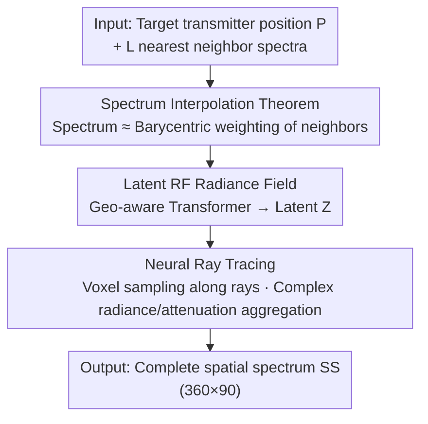

# Generalizable Radio-Frequency Radiance Fields for Spatial Spectrum Synthesis

**Conference**: CVPR 2026  
**Paper**: [CVF Open Access](https://openaccess.thecvf.com/content/CVPR2026/html/Yang_Generalizable_Radio-Frequency_Radiance_Fields_for_Spatial_Spectrum_Synthesis_CVPR_2026_paper.html)  
**Code**: None (Not provided in the paper)  
**Area**: RF Sensing / Neural Radiance Fields / Cross-scene Generalization  
**Keywords**: Radio-Frequency Radiance Fields, Spatial Spectrum Synthesis, Spectrum Interpolation Theorem, Geometry-aware Transformer, Neural Ray Tracing

## TL;DR
GRaF transfers the NeRF concept to the RF domain. By introducing a theorem stating that "the spatial spectrum of a target transmitter can be approximated by interpolating the spectra of neighboring transmitters," it transforms the "per-scene retraining" NeRF into a generalizable latent RF radiance field. Leveraging a geometry-aware Transformer to encode neighbor spectra and complex-valued neural ray tracing to reconstruct the spatial spectrum, GRaF outperforms NeRF2 in both single-scene and unseen-scene settings.

## Background & Motivation
**Background**: Wireless networks (WiFi, 6G) serve as both communication backbones and sensing platforms, both of which rely on extensive "spatial spectrum" data—the distribution of signal power measured by a receiver over 3D directions (azimuth $\alpha$, elevation $\beta$) relative to a transmitter. Sampling such data requires dense physical site surveys, which are time-consuming and labor-intensive. Consequently, some researchers use propagation modeling to "synthesize" data: estimating the received spectrum after reflection, diffraction, and scattering for given transceiver positions.

**Limitations of Prior Work**: While Maxwell’s equations can be solved accurately in free space, direct solutions in complex real-world environments are infeasible. Ray-tracing simulations depend on precise CAD models and are computationally expensive, often proving inaccurate or impractical. Recently, NeRF2 and NeWRF migrated neural radiance fields from the optical domain to the RF domain, achieving SOTA results. However, like the original NeRF, they **overfit to the training scene**, requiring costly retraining from scratch for every new environment.

**Key Challenge**: The wavelength of RF signals is on the centimeter scale, and interactions with obstacles (absorption, reflection, diffraction, scattering) are significantly more complex than those of visible light. This complexity has made "learning a separate radiance field for each scene" the standard for RF NeRFs, hindering generalization.

**Goal**: To learn a **scene-agnostic** model capable of synthesizing high-quality spatial spectra within a single scene and generalizing directly to unseen scene layouts or even unseen room types.

**Key Insight**: The authors prove an RF domain interpolation theorem—the spatial spectrum at a given transmitter position can be approximated by several geographically adjacent transmitters (with the error converging at the square of the neighborhood radius). This shifts the paradigm from "learning a radiance field per scene" to "learning how to interpolate from neighboring spectra," which is inherently cross-scene.

**Core Idea**: Replace the "scene coordinates $\rightarrow$ MLP $\rightarrow$ ray tracing" pipeline with "neighboring spectra $\rightarrow$ latent RF radiance field $\rightarrow$ neural ray tracing," encoding the generalizable interpolation capability into a latent variable $Z$.

## Method

### Overall Architecture
Given several training scenes, each containing pairs of (spatial spectrum $\mathbf{SS}_i\in\mathbb{R}^{360\times90}$, transmitter position $\mathbf{P}_i\in\mathbb{R}^3$), the objective is to learn a model $\mathcal{F}_\Theta$. For any target position $\mathbf{P}_{\text{target}}$ in a scene, the model selects its $L$ nearest neighbor transmitters $\mathcal{N}_L$ to synthesize the target spatial spectrum.

GRaF consists of two main components: (i) **Latent RF Radiance Field**—a geometry-aware Transformer encodes neighbor spectra and geometric relationships into a latent variable $Z$, which summarizes the propagation characteristics of the scene (path loss, shadowing, multipath); (ii) **Neural Ray Tracing**—conditioned on $Z$, rays are emitted from the receiver in all directions, voxels along the rays are sampled to predict complex-valued radiance and attenuation, and these are aggregated per ray to compute the squared magnitude for power. The full spatial spectrum is formed by traversing all directions. The model is trained end-to-end using an L2 reconstruction loss.

### Key Designs

**1. RF Spatial Spectrum Interpolation Theorem: Shifting from "Per-scene Learning" to "Learning Interpolation"**

This is the theoretical foundation of the paper, addressing the requirement of NeRF for per-scene retraining. Theorem 1 asserts that the spatial spectrum at position $\mathbf{P}$ can be approximated by $L$ nearest neighbors: $\mathbf{SS}(\mathbf{P})\approx\sum_{i=1}^{L} w_i\,\mathbf{SS}_i$, where the barycentric weights $\{w_i\}$ are determined by the local geometry of the transmitters; the interpolation error satisfies $\epsilon\le K\delta^2$, where $\delta=\max_i\|\mathbf{P}-\mathbf{P}_i\|$ is the neighborhood radius and $K$ characterizes the environment curvature. This implies that the act of interpolation does not depend on specific scene geometry; the model learns "how to weigh neighbors" rather than "what this room looks like," enabling generalization. All subsequent designs in GRaF essentially "non-linearize" and "geometerize" this linear interpolation.

**2. Latent RF Radiance Field: Encoding neighbor spectra into scene-agnostic $Z$ via Geo-aware Transformer**

Simple linear interpolation (corresponding to a KNN baseline) cannot capture the complex spatial relationships between neighbor spectra. This work upgrades interpolation weights to a latent variable $Z=\mathcal{T}_\Psi(\mathcal{N}_L,\mathbf{P})$, which is "refined from interpolation weights but non-linearly transformed to characterize propagation behaviors beyond linear combinations." Specifically, each neighbor's spectrum $\mathbf{SS}_i$ (treated as an image) is processed by a ResNet-18 to extract high-level patterns like directional power distribution and signal strength. Simultaneously, relative positions $(\mathbf{P}_i-\mathbf{P})$ are processed using positional encoding to preserve geometric relationships. Spectral features and geometric embeddings are fed into a geometry-aware Transformer with **cross-attention**. The attention mechanism dynamically weights the "most influential neighbors," learning the weights from Theorem 1 while incorporating non-linear effects such as interference, diffraction, and multipath scattering. The Transformer output is mapped to a final $Z\in\mathbb{R}^d$ via MLPs. Since $Z$ encodes "propagation laws" rather than "specific coordinate values," it is reusable across scenes.

The total likelihood is modeled as a marginalization over $Z$: $p(\mathbf{SS}\mid\mathcal{N}_L,\mathbf{P})=\int p(\mathbf{SS}\mid\mathbf{Z},\mathbf{P})\,p(\mathbf{Z}\mid\mathcal{N}_L)\,d\mathbf{Z}$, further decomposed along each ray.

**3. Complex-valued Neural Ray Tracing: Respecting RF Amplitude and Phase in Aggregation**

Optical NeRF voxels represent opacity and color, but RF signals are complex-valued (possessing phase). Conditioned on $Z$, $S$ points $\{\mathbf{x}_s\}$ are uniformly sampled along a ray in direction $(\alpha,\beta)$. The voxel feature for each point is:

$$\mathbf{v}_s=\mathrm{MLP}\big(\mathbf{Z},\,\mathrm{PosEnc}(\mathbf{x}_s,(\alpha,\beta),\mathbf{P})\big).$$

Crucially, two MLPs map $\mathbf{v}_s$ to a **complex radiance signal** $s=I_s+jQ_s$ and **complex attenuation** $a=A_s+jB_s$—where attenuation encodes both magnitude reduction and phase shift. Aggregation along the ray explicitly includes free-space path loss $\frac{\lambda}{4\pi d_s}$ and the phase shift caused by propagation delay $e^{-j\frac{2\pi f d_s}{c}}$:

$$y_r=\sum_{s=1}^{S}\Big(\prod_{j=1}^{s-1} a(\mathbf{x}_j,\alpha,\beta)\Big)\,s(\mathbf{x}_s,\alpha,\beta)\cdot\frac{\lambda}{4\pi d_s}e^{-j\frac{2\pi f d_s}{c}},$$

where $\prod a$ represents the cumulative attenuation of preceding voxels on the current voxel. Finally, the spectral value for the direction is the power of the received signal: $\hat{\mathbf{SS}}_\Theta(r)=|y_r|^2$. Compared to NeRF2, which uses only two real scalars (source intensity and attenuation), this complex vector voxel representation captures richer propagation physics.

### Loss & Training
Since $Z$ is produced **deterministically** by the latent RF radiance field, optimization of the likelihood simplifies to supervised reconstruction. The final objective is ray-wise L2 spectrum reconstruction:

$$\Theta^*=\arg\min_\Theta\sum_{r=1}^{Q}\big\|\mathbf{SS}(r)-\hat{\mathbf{SS}}_\Theta(r)\big\|^2,$$

where $Q=N_a\times N_e=360\times90$ is the total number of rays covering the upper hemisphere at 1-degree resolution.

## Key Experimental Results

Datasets: RFID (proposed by NeRF2, 915 MHz, 4×4 array, 6123 transmitter positions) + MATLAB simulations of Meeting Room and Office layouts (V1–V3 versions per layout based on furniture placement; 3107 to 8481 transmitters). Metrics: MSE↓, LPIPS↓, PSNR↑, SSIM↑. Baselines: KNN (equal-weighted average), KNN-DL (learned per-pixel weight), NeRF2 (≈NeWRF).

### Main Results (Single Scene + Cross-scene Generalization)

| Setup | Model | MSE↓ | LPIPS↓ | PSNR↑ | SSIM↑ |
|-------|-------|------|--------|-------|-------|
| Single Scene | KNN | 0.089 | 0.357 | 15.16 | 0.543 |
| Single Scene | KNN-DL | 0.048 | 0.198 | 20.81 | 0.675 |
| Single Scene | NeRF2 | 0.052 | 0.274 | 19.93 | 0.704 |
| Single Scene | **GRaF** | **0.038** | **0.136** | **21.94** | **0.766** |
| Unseen Scene | NeRF2 | 0.065 | 0.337 | 17.36 | 0.691 |
| Unseen Scene | **GRaF** | **0.039** | **0.215** | **20.96** | **0.705** |
| Unseen Layout | NeRF2 | 0.092 | 0.477 | 12.76 | 0.481 |
| Unseen Layout | **GRaF** | **0.042** | **0.268** | **17.81** | **0.629** |

In the single-scene setting, GRaF improves over NeRF2 by 26.9% in MSE, 50.4% in LPIPS, 10.2% in PSNR, and 8.8% in SSIM. The generalization capability is demonstrated in the "Unseen Layout" setting (trained on Meeting Room $\rightarrow$ tested on Office), where NeRF2's PSNR drops from 19.93 to 12.76 (a 35.9% decrease), while GRaF only drops from 21.94 to 17.81, confirming the advantage of learning interpolation over per-scene overfitting.

### Ablation Study (Unseen Scene Setting)

| Configuration | LPIPS↓ | PSNR↑ | Description |
|---------------|--------|-------|-------------|
| Full GRaF | 0.215 | 20.96 | Full pipeline |
| w/o Cross-Attention | 0.239 | 19.37 | Replaced with simple dot-product attention (-1.59 dB) |
| w/o Neural Ray Tracing | 0.379 | 16.79 | Replaced with NeRF2-style two-scalar voxels (-4.17 dB) |

### Key Findings
- **Complex Neural Ray Tracing is Critical**: Removing it drops PSNR from 20.96 to 16.79 (a 4.17 dB loss), performing worse than NeRF2. This indicates that encoding neighbor spectra is insufficient without a complex-valued voxel representation that accurately models propagation physics.
- **Cross-Attention provides improvement**: Replacing it with standard dot-product attention leads to a 1.59 dB drop. The authors suggest that the generalization capability stems primarily from the mechanism of modeling neighbor interactions, with cross-attention being an effective implementation.
- **Frequency Adaptation**: When trained and tested at 928 MHz / 2.412 GHz / 5.805 GHz individually, PSNR remains between 24–26 dB. However, training on 2.412 GHz and testing on other frequencies with a fixed voxel size (0.124 m) causes significant degradation due to changing propagation characteristics and spatial resolution mismatches.
- **Downstream Benefits**: Synthetic spectra can be used for Angle of Arrival (AoA) estimation. The authors validated the feasibility of training/testing AoA using synthetic spectra via AANN.

## Highlights & Insights
- **Shifting the problem via theorem**: Instead of using high-capacity networks to "force" generalization, the authors prove that spectra can be interpolated from neighbors, focusing the generalization task on "learning interpolation weights." This ensures a high degree of theoretical consistency.
- **Complex voxels as the key to RF NeRF**: Upgrading voxels from real scalars to complex radiance and attenuation, while explicitly incorporating path loss and phase shifts, injects necessary physical priors. This modification contributed most to the performance gains in the ablation study.
- **Reusable tricks**: Treating the spatial spectrum as an image and using ResNet-18 along with computer vision metrics (LPIPS/SSIM/PSNR) for feature extraction and evaluation is an effective way to leverage CV tools for RF sensing.

## Limitations & Future Work
- Synthesis quality in cross-layout scenarios is significantly lower than in single scenes due to distribution shifts in layout and material properties.
- The model relies on the availability of neighboring transmitter spectra. The theorem's error bound $\epsilon\le K\delta^2$ implies that error grows rapidly in sparse environments, such as outdoor scenes with fewer reflections.
- Fixed voxel size is a bottleneck for cross-frequency migration; an adaptive resolution design (scaling voxels with $\lambda$) is an obvious direction for improvement.
- ⚠️ The paper does not provide a code link. Implementation of the geometry-aware Transformer and complex ray tracing aggregation is required for replication.

## Related Work & Insights
- **vs NeRF2 / NeWRF**: These are SOTA RF NeRFs but require per-scene retraining. NeWRF also requires DoA measurements, which are difficult to obtain in practice. GRaF requires no scene-specific training, no DoA, and no prior scene models.
- **vs KNN / KNN-DL**: KNN is a naive implementation of Theorem 1. KNN-DL learns weights but ignores geometry. GRaF upgrades these to a "geometry-aware + non-linear" interpolation system.
- **vs WiNeRT / RFScape**: These require scene geometry in CAD or SDF formats; GRaF operates without scene model priors.
- **vs Generalizable Optical NeRFs (MVSNeRF, GSNeRF)**: While the motivation is similar (inferring from sparse inputs), the different wavelengths and propagation mechanisms of RF signals prevent direct application. GRaF extends the "generalizable NeRF" lineage to RF spatial spectrum synthesis.

## Rating
- Novelty: ⭐⭐⭐⭐⭐ First systematic migration of "Generalizable NeRF" to RF spatial spectrum synthesis with theoretical support.
- Experimental Thoroughness: ⭐⭐⭐⭐ Comprehensive coverage of diverse settings, though real data is limited to the RFID dataset and code is missing.
- Writing Quality: ⭐⭐⭐⭐ Clear mapping between theory and architecture, though key derivations are relegated to the supplemental material.
- Value: ⭐⭐⭐⭐ Provides a practical paradigm for data synthesis in wireless sensing/communication without retraining.

<!-- RELATED:START -->

## Related Papers

- [\[CVPR 2026\] Evidential Neural Radiance Fields](evidential_neural_radiance_fields.md)
- [\[CVPR 2026\] MU-GeNeRF: Multi-view Uncertainty-guided Generalizable Neural Radiance Fields for Distractor-aware Scene](mu-generf_multi-view_uncertainty-guided_generalizable_neural_radiance_fields_for.md)
- [\[CVPR 2026\] Fresco: Frequency-Spatial Consistent Optimization for Fine-Grained Head Avatar Modeling](fresco_frequency-spatial_consistent_optimization_for_fine-grained_head_avatar_mo.md)
- [\[CVPR 2026\] I-Scene: 3D Instance Models are Implicit Generalizable Spatial Learners](i-scene_3d_instance_models_are_implicit_generalizable_spatial_learners.md)
- [\[ECCV 2024\] G2fR: Frequency Regularization in Grid-Based Feature Encoding Neural Radiance Fields](../../ECCV2024/3d_vision/g2fr_frequency_regularization_in_grid-based_feature_encoding_neural_radiance_fie.md)

<!-- RELATED:END -->
