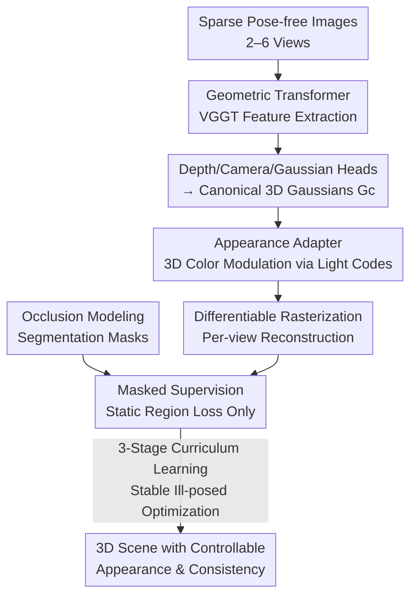

# Generalizable Sparse-View 3D Reconstruction from Unconstrained Images

**Conference**: CVPR 2026  
**Paper**: [CVF Open Access](https://openaccess.thecvf.com/content/CVPR2026/html/Gupta_Generalizable_Sparse-View_3D_Reconstruction_from_Unconstrained_Images_CVPR_2026_paper.html)  
**Code**: https://genwildsplat.github.io/ (Project Page)  
**Area**: 3D Vision  
**Keywords**: Sparse-view reconstruction, Feedforward 3D Gaussians, Appearance disentanglement, Occlusion handling, Curriculum learning  

## TL;DR
GenWildSplat transforms "in-the-wild internet photo reconstruction" from per-scene optimization into a single feedforward pass: given 2–6 pose-free, variably-lit sparse images with transient occlusions (pedestrians, vehicles), it predicts 3D Gaussians with controllable appearance in under 3 seconds. By employing an appearance adapter for color modulation in 3D space, segmentation masks to filter transients, and a three-stage curriculum learning strategy for stability, it achieves PSNR scores on MegaScenes that surpass optimization-based methods requiring hours of computation.

## Background & Motivation
**Background**: For novel view synthesis (NVS) from unconstrained internet photos, the mainstream approach follows a per-scene optimization route using NeRF or 3D Gaussian Splatting (3DGS). These methods typically assign learnable appearance embeddings to each scene to absorb lighting variations and use uncertainty maps or 2D masks to handle transient occlusions like pedestrians and vehicles.

**Limitations of Prior Work**: Existing methods suffer from two major flaws. First, they are **slow and depend on dense views**: SOTA methods like WildGaussians and NexusSplats require 2.4–8 hours of per-scene training. When views are sparse (< 20 or even 2–6), they fail because COLMAP cannot reliably estimate poses, leading to geometric spikes and blurring. Second, the **appearance is not generalizable**: a new embedding must be optimized for every new lighting condition at test time, preventing feedforward inference and causing color bleeding or geometric distortion under extreme out-of-distribution lighting.

**Key Challenge**: In-the-wild reconstruction fundamentally requires disentangling **static scene geometry** from **dynamic lighting** and **transient occlusions**. However, current methods tie these three elements together in a joint per-scene optimization, which neither learns transferable priors nor remains stable under the highly ill-posed setting of sparse views. While feedforward models (e.g., AnySplat) are fast, they assume static lighting and fail when encountering varying illumination or dynamic objects.

**Goal**: To develop a **feedforward, optimization-free** framework that takes sparse pose-free in-the-wild images and simultaneously outputs geometry, controllable appearance, and clean static structures, while generalizing to unseen scenes.

**Key Insight**: The authors observe that large-scale training on a mix of synthetic and real data allows models to learn robust cross-lighting associations. Furthermore, pre-trained geometric transformers like VGGT provide strong geometric priors that can bypass COLMAP. Consequently, appearance and occlusion modeling can be "grafted" into the feedforward paradigm, allowing them to be predicted in a single forward pass.

**Core Idea**: A geometric transformer first encodes sparse images into **light-invariant "canonical" 3D Gaussians**. An **appearance adapter** then adjusts colors in 3D based on target lighting codes. **External segmentation masks** are used to shield transient regions during supervision, and a **three-stage curriculum learning** strategy ensures convergence in this ill-posed joint learning task. To the authors' knowledge, this is the first work to integrate appearance and occlusion modeling into the feedforward 3D reconstruction paradigm.

## Method

### Overall Architecture
GenWildSplat is built upon the AnySplat feedforward framework. The pipeline follows a single forward pass: "Geometry Encoding → Canonical Gaussians → Appearance Modulation → Masked Supervision." The input is a set of $V$ (where $V=2-6$) sparse images $\{I_i\}_{i=1}^{V}$ with unknown poses, varying appearances, and transient objects. A VGGT transformer backbone $\phi_\theta$ extracts multi-view features $\bm{F}=\phi_\theta(\mathcal{I})$. Three dedicated prediction heads then decode per-view depth maps $\bm{D}=h_D(\bm{F})$, camera intrinsics and extrinsics $(\bm{K},\bm{E})=h_C(\bm{F})$, and light-invariant Gaussian attributes $(\bm{s},\bm{r},\bm{\sigma},\bm{c})=h_{\mathrm{gauss}}(\bm{F})$. Back-projecting these per-pixel Gaussians into 3D yields the **canonical 3D Gaussians** $\mathcal{G}_c$, which capture the unified scene geometry stripped of lighting effects. Each Gaussian contains a position $\bm{\mu}\in\mathbb{R}^3$, opacity, rotation, scale, and a 75-dimensional canonical Spherical Harmonic (SH) color coefficient $\bm{c}\in\mathbb{R}^{75}$.

To handle multi-view inconsistency (where each input image has different lighting), a **lighting encoder** $\mathcal{E}_{Light}$ extracts a compact light code $\bm{L}_i$ for each input image. An MLP $F_{light}$ then modulates the canonical colors into view-specific colors, resulting in **appearance-transformed Gaussians** $\mathcal{G}_{l_i}$. Each set is independently rasterized to reconstruct the corresponding input image, achieving **self-supervision without test-time optimization**. Simultaneously, a pre-trained segmentation network provides binary masks for transient objects to focus supervision on static content.

### Key Designs

**1. Canonical Space Geometry Encoding: Decoupling Geometry from Lighting**

The fundamental difficulty in in-the-wild reconstruction is the entanglement of geometry, lighting, and occlusions. This work first addresses the "geometry" layer by reusing a feedforward backbone to map sparse pose-free images directly to a set of **appearance-agnostic** canonical 3D Gaussians $\mathcal{G}_c$. The predicted SH colors $\bm{c}\in\mathbb{R}^{75}$ represent a "baseline appearance" not tied to any specific lighting. This approach bypasses COLMAP, which fails in sparse-view settings, by having the transformer backbone directly regress camera parameters and per-pixel depth before back-projecting them. Fixing the "geometry + baseline color" in a canonical space allows appearance to be modulated and occlusions to be shielded independently.

**2. Appearance Adapter: Feedforward Lighting Prediction without Test-time Optimization**

Methods like WildGaussians and NexusSplats use randomly initialized appearance embeddings that are **jointly optimized** with geometry, requiring re-optimization for every new view or lighting condition. GenWildSplat reverses this: all scene parameters (including appearance) are predicted in a single forward pass. Specifically, a 2D CNN lighting encoder extracts a light code $\bm{L}_i=\mathcal{E}_{Light}(I^{(i)})$ for the $i$-th input image. An MLP $F_{light}$ then modulates the canonical Gaussian colors $\mathcal{G}_c$ into the specific lighting:

$$\mathcal{G}_{l_i}=F_{light}(\mathcal{G}_c,\bm{L}_i),\quad i=1,\dots,V$$

The transformed Gaussians $\mathcal{G}_{l_i}$ are rasterized to reconstruct input $i$. Since color adjustment occurs on a shared 3D structure, multi-view consistency is naturally maintained. Because light codes are encoded (not optimized), the model supports **cross-scene lighting transfer**—rendering Scene B using the light code from Scene A—a feat impossible for per-scene optimization methods.

**3. External Segmentation Masking: Using Prior Masks instead of Self-estimated Visibility**

Transient objects like pedestrians and vehicles create floaters and unstable gradients if treated as static geometry. Previous works used **internally predicted** visibility maps or uncertainty to down-weight difficult regions, but this often leads to "collapse" during unsupervised training, where hard-to-reconstruct **static structures** (like trees) are also suppressed. This work instead uses a **pre-trained semantic segmentation network** (YOLOv8-Seg) to detect common transient classes (person, car, bus, truck), generating a binary mask $S\in\{0,1\}^{H\times W}$ where $S(p)=1$ indicates a transient. The visibility weight is set to $M=1-S$, and losses are computed on masked images $I_{\text{m}}=I\odot M$ and $\hat{I}_{\text{m}}=\hat{I}\odot M$:

$$\mathcal{L}=\text{MSE}(I_{\text{m}},\hat{I}_{\text{m}})+\lambda\cdot\text{Percep}(I_{\text{m}},\hat{I}_{\text{m}})$$

Using an external prior prevents the model from "cheating" by collapsing its own visibility to ignore transient content, thereby stabilizing gradients and preserving static structures.

**4. Three-Stage Curriculum Learning: Decomposing Ill-posed Joint Optimization**

End-to-end training on large-scale data with appearance changes and transients is inherently unstable; in sparse-view settings, colors can easily collapse. This task is decomposed into three progressive stages to ensure stable convergence: **Stage 1 (Lighting)** involves training on a single synthetic scene with lighting variations but no transients, allowing the model to learn to decouple lighting from geometry. **Stage 2 (Multi-scene Generalization)** introduces more synthetic scenes to improve geometric and appearance priors. **Stage 3 (Occlusion Handling)** adds synthetic transients with ground-truth masks, training the model to predict occlusions while simultaneously handling geometry and appearance. Despite being trained on synthetic lighting and occlusions, the model generalizes effectively to real-world sparse-view scenes.

### Loss & Training
The training objective is the masked reconstruction loss (MSE + Perceptual loss, $\lambda=0.05$). The network predicts geometry and Gaussian parameters, the lighting encoder extracts codes, and the appearance adapter modulates colors before rasterization for comparison with the ground truth. The model is initialized with AnySplat pre-trained weights and trained for 40K iterations (Stage 1: 10K, Stage 2: 10K, Stage 3: 20K), taking approximately 2 days on a single RTX A6000. Notably, it does **not** rely on paired multi-view, multi-lighting data (which does not exist), but instead uses self-supervised reconstruction on unordered image sets.

## Key Experimental Results

### Main Results
In the sparse-view setting of MegaScenes (challenging lighting, occlusions, and < 20 registered views), GenWildSplat requires only **3 seconds** for inference compared to hours for optimization-based competitors, while achieving objectively better results:

| Dataset / Setting | Method | Inference Time | PSNR↑ | SSIM↑ | LPIPS↓ |
|--------|------|------|------|------|------|
| MegaScenes (3-View) | GS-W | 5 hrs | 11.60 | 0.285 | 0.623 |
| MegaScenes (3-View) | WildGaussians | 8 hrs | 12.73 | 0.316 | 0.599 |
| MegaScenes (3-View) | NexusSplats | 2.4 hrs | 13.17 | 0.335 | 0.552 |
| MegaScenes (3-View) | **Ours** | **3 secs** | **14.43** | **0.402** | **0.496** |
| MegaScenes (6-View) | NexusSplats | 2.4 hrs | 13.92 | 0.397 | 0.518 |
| MegaScenes (6-View) | **Ours** | **3 secs** | **15.84** | **0.440** | **0.407** |

Compared to feedforward baselines modified for appearance handling, GenWildSplat is the only one maintaining view consistency, leading by nearly 2.3 dB in the 6-view setting:

| Method | View Consistent | PSNR↑ | SSIM↑ | LPIPS↓ |
|------|------|------|------|------|
| Vanilla AnySplat | ✗ | 12.65 | 0.311 | 0.412 |
| 2D Baseline + AnySplat | ✗ | 12.90 | 0.281 | 0.486 |
| DiffusionRenderer + AnySplat | ✗ | 13.59 | 0.309 | 0.444 |
| **Ours** | ✓ | **15.84** | **0.440** | **0.407** |

### Ablation Study
Removing components sequentially on MegaScenes (6-view setting):

| Configuration | PSNR↑ | SSIM↑ | LPIPS↓ | Note |
|------|------|------|------|------|
| Full model | 15.84 | 0.440 | 0.407 | Full model |
| w/o Appearance adapter | 13.76 | 0.391 | 0.405 | Appearance fixed; -2.08 PSNR |
| w/o Occlusion handling | 15.14 | 0.405 | 0.513 | Transients baked into scene; LPIPS suffers |
| w/o Curriculum learning | 11.72 | 0.318 | 0.438 | Color collapse; -4.12 PSNR |

### Key Findings
- **Curriculum learning is the most critical factor**: Removing it causes PSNR to plummet by 4.12, confirming that simultaneous learning of geometry, lighting, and occlusions in sparse views leads to collapse.
- **The appearance adapter drives the performance gain over optimization**: Removing it results in a >2 dB drop; it enables the feedforward transfer of learned priors, allowing it to beat hours of optimization in seconds.
- **Occlusion handling primarily impacts perceptual quality**: Removing it drops PSNR by only 0.7, but LPIPS degrades significantly from 0.407 to 0.513 as transients are baked into the static structure.
- **Cross-scene lighting transfer** is a unique capability: Because appearance is decoupled, Scene A's lighting code can be used to render Scene B, which is impossible for per-scene optimization methods.

## Highlights & Insights
- **Disentangling appearance as a forward function rather than an optimization variable**: This is the root cause of its speed and cross-scene transfer capability. By adjusting color in 3D rather than via 2D post-processing, view consistency is guaranteed.
- **External segmentation priors over self-estimated visibility**: While counter-intuitive, self-estimated visibility often kills static structures during unsupervised training. Using an immutable external prior (YOLOv8) stabilizes gradients effectively.
- **Curriculum learning as a recipe for ill-posed problems**: The strategy of "single-scene lighting → multi-scene generalization → occlusion addition" is vital for preventing collapse in multi-variable joint learning.

## Limitations & Future Work
- **Geometric holes in unobserved areas**: Sparse viewpoints naturally leave unobserved regions, leading to incomplete geometry.
- **View extrapolation artifacts**: Performance degrades when test viewpoints are far from the training distribution, causing double-geometry artifacts.
- **Reliance on segmentation quality**: If the mask fails to capture a transient or causes depth discontinuities, it negatively impacts reconstruction.
- **Lack of physical relighting**: The model modulates color tones but does not model cast shadows or physically accurate relighting.
- **Evaluation scale**: The study relied on a relatively small number of scenes for evaluation, and occlusions were limited to common COCO classes; rare transients could still cause failures.

## Related Work & Insights
- **vs. WildGaussians / NexusSplats**: These use randomly initialized embeddings and require hours of training per scene. GenWildSplat converts appearance into an output of a forward function, enabling 3-second inference with better PSNR.
- **vs. AnySplat**: AnySplat assumes static lighting. GenWildSplat builds upon it with modular appearance/occlusion components, suggesting these modules can be integrated into other feedforward frameworks like MVSplat.
- **vs. 2D Post-processing (DiffusionRenderer)**: 2D methods lack multi-view consistency. GenWildSplat's success demonstrates that appearance modulation should happen in 3D representation rather than 2D pixels.

## Rating
- Novelty: ⭐⭐⭐⭐⭐ 
- Experimental Thoroughness: ⭐⭐⭐⭐ 
- Writing Quality: ⭐⭐⭐⭐ 
- Value: ⭐⭐⭐⭐⭐ 

<!-- RELATED:START -->

- **AnySplat**: [2404.14392](https://arxiv.org/abs/2404.14392) (Geometric foundation)
- **WildGaussians**: [2403.11184](https://arxiv.org/abs/2403.11184) (Optimization-based SOTA)
- **NexusSplats**: [2411.05581](https://arxiv.org/abs/2411.05581) (Per-scene wild reconstruction)

<!-- RELATED:END -->

## Related Papers

- [\[CVPR 2026\] FSFSplatter: Geometrically Accurate Reconstruction with Free Sparse-view Images within 2 minutes](fsfsplatter_geometrically_accurate_reconstruction_with_free_sparse-view_images_w.md)
- [\[CVPR 2026\] Uni3R: Unified 3D Reconstruction and Semantic Understanding via Generalizable Gaussian Splatting from Unposed Multi-View Images](uni3r_unified_3d_reconstruction_and_semantic_understanding_via_generalizable_gau.md)
- [\[AAAI 2026\] MeshSplat: Generalizable Sparse-View Surface Reconstruction via Gaussian Splatting](../../AAAI2026/3d_vision/meshsplat_generalizable_sparse-view_surface_reconstruction_via_gaussian_splattin.md)
- [\[CVPR 2026\] BRepGaussian: CAD Reconstruction from Multi-View Images with Gaussian Splatting](brepgaussian_cad_reconstruction_from_multi-view_images_with_gaussian_splatting.md)
- [\[CVPR 2026\] FF3R: Feedforward Feature 3D Reconstruction from Unconstrained Views](ff3r_feedforward_feature_3d_reconstruction_from_unconstrained_views.md)

<!-- RELATED:END -->
