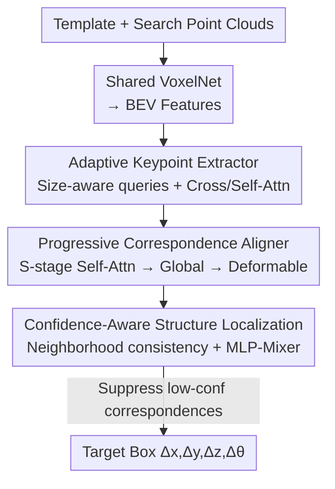

# Generalizable Structure-Aware Keypoint Correspondence for Category-Unified 3D Single Object Tracking

**Conference**: CVPR 2026  
**Paper**: [CVF OpenAccess](https://openaccess.thecvf.com/content/CVPR2026/html/Xiao_Generalizable_Structure-Aware_Keypoint_Correspondence_for_Category-Unified_3D_Single_Object_Tracking_CVPR_2026_paper.html)  
**Code**: None  
**Area**: 3D Vision  
**Keywords**: 3D SOT, Point Cloud Tracking, Category-Unified, Keypoint Correspondence, Structure-Aware  

## TL;DR
UniKPT proposes replacing point-to-point dense matching with a set of **adaptive sparse keypoints**. Through three modules—Adaptive Keypoint Extraction, Progressive Correspondence Alignment, and Confidence-Aware Structure Localization—it unifies the tracking of diverse categories such as pedestrians, trucks, and buses within a single model. On nuScenes, it outperforms category-specific SOTA methods by 4.37%/5.16% in Success/Precision.

## Background & Motivation

**Background**: 3D Single Object Tracking (3D SOT) aims to continuously localize a target in LiDAR point cloud sequences given its 3D box in the first frame, serving as a fundamental capability for autonomous driving and robotics. The dominant approach follows the Siamese paradigm: a shared backbone extracts point features for the template and search region → **point-to-point dense interaction** → target box regression.

**Limitations of Prior Work**: Nearly all existing methods follow a **category-specific** paradigm, training individual models for each category (Car, Pedestrian, Truck, Bicycle, etc.). This is problematic for deployment, as maintaining multiple models in multi-class scenarios offers poor scalability and generalization. Directly extending existing frameworks to a "one-model-fits-all" setting has proven ineffective in practice.

**Key Challenge**: The root cause of failure lies in two inherent flaws of current pipelines. First, point clouds are sparse, noisy, and frequently occluded; **precise point-to-point correspondences often do not exist** between the template and search area. Dense interaction mechanisms struggle to learn reliable geometric correspondences without category priors. Second, current localization strategies either regress boxes from **single-point features** (lacking surrounding context) or from **globally pooled representations** (flattening spatial topology), both of which lose fine-grained structural relationships. The vast scale and structural differences between categories (e.g., Pedestrian vs. Truck) amplify these flaws in a unified setting.

**Goal**: The authors decompose the task of building a robust category-unified 3D tracker into three sub-problems: (1) How to extract features adaptable to different scales? (2) How to establish robust geometric correspondences without category priors and only box-level annotations? (3) How to embed structure-awareness into localization?

**Key Insight**: Rather than forcing point-to-point matching on noisy, sparse data, it is more effective to extract **a few representative keypoints** on the template, allow them to perceive their local context, and then find their correspondences in the search area. Sparse keypoints are naturally more robust to occlusion and noise than dense pairs, and the relative geometric relationships between keypoints represent "universal structural properties" shared across object classes.

**Core Idea**: Replace point-to-point dense matching with **sparse, scale-adaptive keypoint-to-keypoint correspondences** and explicitly model the relative structural relationships between keypoints for localization, enabling cross-category generalization within a single model.

## Method

### Overall Architecture

The input to UniKPT consists of the template point cloud $P_{t-1}\in\mathbb{R}^{N_{t-1}\times3}$ and search region point cloud $P_t\in\mathbb{R}^{N_t\times3}$. The output is the target's pose change $[\Delta x,\Delta y,\Delta z,\Delta\theta]$ in the current frame. The pipeline first encodes both point clouds into Bird's-Eye View (BEV) features $F_{t-1},F_t\in\mathbb{R}^{HW\times C}$ using a shared voxelized backbone (VoxelNet), followed by three sequential modules:

- **Adaptive Keypoint Extractor (AKE)**: Extracts a sparse yet representative set of scale-adaptive keypoint features from the template;
- **Progressive Correspondence Aligner (PCA)**: Progressively aligns these template keypoints with corresponding points in the search area to establish robust cross-frame geometric correspondences;
- **Confidence-Aware Structure Localization (CASL)**: Evaluates the reliability of each correspondence, suppresses unreliable ones, and allows reliable keypoint pairs to exchange structural information to regress the final target box.

### Key Designs

**1. Adaptive Keypoint Extractor (AKE): Extracting scale-adaptive keypoints via size-aware queries**

To address massive category-scale differences, AKE samples an $n_x\times n_y\times n_z$ grid within the template box $B_{t-1}$. Grid centers serve as initial keypoint coordinates $R_{t-1}\in\mathbb{R}^{N_q\times3}$ ($N_q=n_x n_y n_z$), with learnable queries $Q^0\in\mathbb{R}^{N_q\times C}$. This "initialization by box size" ensures keypoints cover the object's geometry regardless of its dimensions. Through $L$ Transformer layers, position-aware queries $\widetilde{Q}^l=Q^{l-1}+\text{MLP}(R_{t-1})$ use self-attention to model internal geometry and cross-attention to aggregate context from $F_{t-1}$. This results in discriminative, structure-adaptive template keypoint features $F_{t-1}^{kpt}$ without needing category-specific priors.

**2. Progressive Correspondence Aligner (PCA): Multi-stage global-to-local alignment**

Established correspondences are refined over $S$ stages to combat sparsity and noise. In each stage, the query $Q_t^s$ is updated through self-attention (structural dependence), **global cross-attention** (to prevent missing potential target regions across the entire $F_t$), and **deformable cross-attention** (sampling local features around current coordinates $R_t^{s-1}$ for precision):

$$Q_t^s=\hat{Q}_t^s+\text{DefAttn}(\hat{Q}_t^s,R_t^{s-1},F_t)$$

Coordinate offsets are predicted at each stage: $R_t^s=R_t^{s-1}+\text{MLP}_{offset}(Q_t^s)$, using previous results as priors for the next stage. Visualizations show keypoints moving from scattered initializations to precisely covering the target.

**3. Keypoint Supervision via Box GT: Generating keypoint-level signals**

Since 3D datasets only provide box-level labels (relative translation $t_{gt}$ and rotation $\Delta\theta$), pseudo-ground truth for keypoints is generated by transforming template coordinates into the search frame: $R_t^{gt}=\mathbf{T}_\theta R_{t-1}+\mathbf{t}_{gt}$. The model is supervised using $\ell_1$ loss: $\mathcal{L}_{coord}=\frac{1}{S}\sum_{s=1}^S\|R_t^s-R_t^{gt}\|_1$. This effectively converts box-level annotations into dense keypoint supervision.

**4. Confidence-Aware Structure Localization (CASL): Filtering via neighborhood consistency**

To handle occlusions, CASL estimates **confidence scores** based on whether the relative geometric relationship in the template's neighborhood is preserved in the search area. Feature differences $\Delta F$ are processed via 1D convolutions to produce relationship features $G$, yielding confidence scores $s = \sigma(\text{MLP}_{confidence}([G_{t-1}, G_t])) \in [0, 1]^{N_q}$. Keypoint features are weighted by $s$ and fed into an **MLP-Mixer** for cross-correspondence structural reasoning, followed by box regression using residual log-likelihood loss $\mathcal{L}_{loc}$.

### Loss & Training
The total loss is a weighted sum: $\mathcal{L}=\lambda_1\mathcal{L}_{coord}+\lambda_2\mathcal{L}_{loc}$. The model is trained for 30 epochs on nuScenes and 150 on KITTI using AdamW (initial lr $1\times10^{-4}$). Default settings use $S=3$ stages and $N_q=27$ keypoints.

## Key Experimental Results

### Main Results

UniKPT, as a **unified model**, sets new SOTA records on nuScenes, even outperforming category-specific methods:

| Dataset | Paradigm | Method | Mean Success | Mean Precision |
|---------|----------|--------|--------------|----------------|
| nuScenes| Category-Specific | P2P (IJCV'25) | 59.84 | 72.13 |
| nuScenes| Category-Unified | TrackAny3D (ICCV'25) | 54.57 | 66.25 |
| nuScenes| Category-Unified | **UniKPT (Ours)** | **64.21** | **77.29** |

Ours exceeds the unified baseline TrackAny3D by 9.64/11.04 and the strongest category-specific method P2P by 4.37/5.16. On KITTI, it outperforms MoCUT on the long-tail Van category (68.7/81.4 vs 64.5/78.8).

### Ablation Study

Ablation results on nuScenes (Mean Success/Precision):

| Configuration | Success | Precision | Note |
|---------------|---------|-----------|------|
| (1) w/o $\mathcal{L}_{coord}$ | 60.63 | 73.30 | Largest performance drop |
| (3) w/o Deformable Attn | 62.58 | 75.41 | Used dense cross-attn instead |
| (4) w/o Confidence Est. | 63.34 | 76.31 | Unreliable pairs not suppressed |
| (5) MLP-Mixer → MLP | 62.51 | 75.63 | No cross-correspondence interaction |
| (7) **Ours (Full)** | **64.21** | **77.29** | — |

Efficiency analysis (Tab.6) shows the keypoint design is more accurate than the point-to-point baseline (64.2 vs 59.3) while halving FLOPs (0.55G vs 1.11G) and increasing FPS (37 vs 32).

### Key Findings
- **Coordinate supervision is critical**: Removing $\mathcal{L}_{coord}$ caused the largest drop (3.58 pts), highlighting the importance of rigid-body pseudo-labels for stable correspondence.
- **Sparse > Dense**: Keypoint-to-keypoint matching is more accurate, computationally cheaper, and faster than point-to-point matching.
- **Progressive refinement saturation**: Optimal performance is reached at $S=3$; further stages introduce redundant noise.
- **Structural consistency**: Visualizations confirm high-confidence keypoints concentrate on discriminative geometric boundaries.

## Highlights & Insights
- **Paradigm Shift**: Replacing dense matching with sparse structure-aware keypoints simultaneously solves scalability, robustness, and efficiency.
- **Weak-to-Dense Supervision**: Leveraging constant object size to transform box labels into keypoint GT is a highly transferable trick for tracking/registration tasks.
- **Neighborhood Consistency for Confidence**: Estimating reliability based on relative neighborhood geometry rather than absolute feature similarity is more robust against outliers.
- **Global + Deformable Strategy**: Combining global aggregation for recall with local deformable sampling for precision is an effective way to handle small targets in large search regions.

## Limitations & Future Work
- UniKPT does not yet surpass specific SOTA on KITTI Car (69.7 vs MBPTrack 73.4), suggesting the unified paradigm benefits more from large-scale, diverse datasets.
- Fixed keypoint counts ($3^3$) may be suboptimal for extreme shapes; adaptive budgeting could be explored.
- Performance on highly non-rigid/occluded categories like Pedestrians remains limited compared to rigid vehicles.
- No code release yet; reproduction depends on supplemental configuration details.

## Related Work & Insights
- **vs. Category-Specific (P2B/P2P)**: While P2P is strong on single categories, UniKPT eliminates the need for multiple models and achieves better overall performance in unified settings.
- **vs. Previous Unified (MoCUT/TrackAny3D)**: Unlike previous attempts that still relied on dense interaction, UniKPT shifts to the keypoint granularity, leading to a significant +9.64 gain over TrackAny3D.
- **Insight**: Sparse keypoints are ideal for unified tracking because different categories share "internal relative geometry" as a universal property.

## Rating
- Novelty: ⭐⭐⭐⭐⭐ 
- Experimental Thoroughness: ⭐⭐⭐⭐☆ 
- Writing Quality: ⭐⭐⭐⭐⭐ 
- Value: ⭐⭐⭐⭐⭐ 

<!-- RELATED:START -->

## Related Papers

- [\[CVPR 2026\] MimiCAT: Mimic with Correspondence-Aware Cascade-Transformer for Category-Free 3D Pose Transfer](mimicat_mimic_with_correspondence-aware_cascade-transformer_for_category-free_3d.md)
- [\[CVPR 2026\] H²A²: Homogeneity-Aware and Heterogeneity-Aware Feature Perception for Unified Indoor 3D Object Detection](h2a2_homogeneity-aware_and_heterogeneity-aware_feature_perception_for_unified_in.md)
- [\[CVPR 2026\] CARI4D: Category Agnostic 4D Reconstruction of Human-Object Interaction](cari4d_category_agnostic_4d_reconstruction_of_human_object_interaction.md)
- [\[CVPR 2026\] Aligning Text, Images and 3D Structure Token-by-Token](aligning_text_images_and_3d_structure_token-by-token.md)
- [\[CVPR 2026\] EV-CGNet: Co-visible Focused 3D-guided 2D Event Keypoint Detection Network](ev-cgnet_co-visible_focused_3d-guided_2d_event_keypoint_detection_network.md)

<!-- RELATED:END -->
## Related Papers

- [\[CVPR 2026\] MimiCAT: Mimic with Correspondence-Aware Cascade-Transformer for Category-Free 3D Pose Transfer](mimicat_mimic_with_correspondence-aware_cascade-transformer_for_category-free_3d.md)
- [\[CVPR 2026\] UniCorrn: Unified Correspondence Transformer Across 2D and 3D](unicorrn_unified_correspondence_transformer_across_2d_and_3d.md)
- [\[CVPR 2026\] H²A²: Homogeneity-Aware and Heterogeneity-Aware Feature Perception for Unified Indoor 3D Object Detection](h2a2_homogeneity-aware_and_heterogeneity-aware_feature_perception_for_unified_in.md)
- [\[CVPR 2026\] From Pairs to Sequences: Track-Aware Policy Gradients for Keypoint Detection](from_pairs_to_sequences_track-aware_policy_gradients_for_keypoint_detection.md)
- [\[ICCV 2025\] GSOT3D: Towards Generic 3D Single Object Tracking in the Wild](../../ICCV2025/3d_vision/gsot3d_towards_generic_3d_single_object_tracking_in_the_wild.md)

<!-- RELATED:END -->
