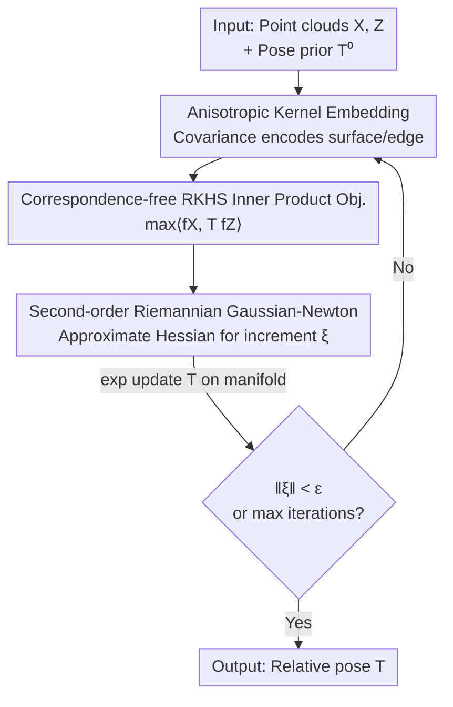

# Generalized-CVO: Fast and Correspondence-Free Local Point Cloud Registration with Second Order Riemannian Optimization

**Conference**: CVPR 2026  
**Paper**: [CVF Open Access](https://openaccess.thecvf.com/content/CVPR2026/html/Zhang_Generalized-CVO_Fast_and_Correspondence-Free_Local_Point_Cloud_Registration_with_Second_CVPR_2026_paper.html)  
**Code**: None (Project page: https://sites.google.com/tri.global/gcvo)  
**Area**: 3D Vision  
**Keywords**: Point cloud registration, correspondence-free registration, RKHS kernel embedding, anisotropic kernels, Riemannian optimization  

## TL;DR
G-CVO represents point clouds as continuous functions in RKHS, encodes local surface geometry using anisotropic kernels, and solves registration via second-order Gaussian-Newton with approximate Riemannian Hessian on the SE(3) manifold. This achieves correspondence-free registration robust to feature-sparse scenes, running approximately 10x faster than similar first-order RKHS methods.

## Background & Motivation
**Background**: Frame-to-frame point cloud registration (tracking) is a core component of LiDAR/Visual Odometry—given a pose prior, it iteratively aligns a new frame $Z$ to a target frame $X$. The mainstream approach is the two-step alternating optimization of the ICP family (ICP, GICP, Fast-VGICP, NDT): first finding nearest neighbors to establish point correspondences, then minimizing residuals to solve for relative pose under correspondence constraints.

**Limitations of Prior Work**: The entire logic of the ICP family relies on the assumption that "point correspondences can be reliably established." In **feature-sparse** environments like rural areas, off-road tracks, or racing circuits, geometric features are scarce and point clouds are degraded. Nearest neighbor matching frequently fails, causing registration to collapse (Table 1 shows ICP/NDT translation errors of tens or hundreds of meters on highway sequence 01). Correspondence-free RKHS methods (CVO family) treat point clouds as continuous functions and use function inner products for registration, bypassing explicit matching and proving more robust to noise and outliers. However, they face two issues: (1) Use of **isotropic kernels**, which fail to exploit the "surface scan" local geometric structure; (2) Total reliance on **first-order** Riemannian gradient ascent, which is too slow (requiring 1200+ iterations) for latency-sensitive high-performance driving.

**Key Challenge**: To achieve robustness (correspondence-free, RKHS), one typically sacrifices the "point-to-plane/point-to-edge" geometric priors and mature second-order solvers developed for ICP over decades. Conversely, methods that are fast and accurate (second-order, using geometric structure) are tied to point correspondences. No previous work has combined the strengths of both routes.

**Goal**: Within the correspondence-free RKHS framework, (1) embed local surface geometry into the kernel function, and (2) derive a usable second-order Riemannian solver to make correspondence-free registration robust, fast, and accurate.

**Key Insight**: The authors observe that point cloud scanning is essentially **surface sampling**—the local neighborhood covariance of a point encodes whether it lies on a plane, edge, or corner. By directly incorporating this anisotropic local covariance into the RKHS kernel, the registration "tightens along the surface normal and relaxes along the tangent," effectively replicating ICP's point-to-plane/point-to-edge priors without explicit feature extraction.

**Core Idea**: Utilize anisotropic kernel embedding (surface-aware) instead of isotropic kernels to inject geometry, and replace first-order gradient ascent with an approximate Riemannian Gaussian-Newton solver for acceleration—collectively termed Generalized CVO (G-CVO).

## Method

### Overall Architecture
G-CVO models registration as an **iterative maximization** problem on the SE(3) manifold. It represents two point cloud frames as functions $f_X, f_Z$ in RKHS. The goal is to maximize their inner product $\langle f_X, T f_Z\rangle$ (equivalent to minimizing distance in function space) rather than searching for point-to-point nearest neighbors. The pipeline starts from a pose prior $T^{(0)}$. In each iteration, it transforms $Z$ to $T^{-1}Z$ using the current estimate, calculates anisotropic covariances $\Sigma_{ij}$ based on local neighborhoods, computes the objective value, Riemannian gradient, and approximate GN Hessian, and finally performs an $\exp$ update on the manifold until the pose increment converges. The entire process involves no KD-tree matching or explicit correspondences.

### Key Designs

**1. Anisotropic Kernel Embedding: Enabling the RKHS Kernel to "See" Surfaces and Edges**

Isotropic kernels in CVO treat each point as an isotropic "sphere," ignoring the fact that point clouds are surface scans. Consequently, registration treats all directions equally, limiting precision. G-CVO generalizes the kernel to an anisotropic exponential kernel:

$$k(x,z) = \sigma^2 \exp\!\Big(-\tfrac{1}{2}\big\langle (x-z),\ \Sigma(x,z)^{-1}(x-z)\big\rangle\Big),$$

where $\Sigma$ is derived from the empirical covariance of the local neighborhood. For a point $x$ in the target frame, $n$ nearest neighbors $N_{\bar X}(x)$ are retrieved (via KD-tree ball query) to compute:

$$\Sigma(x;\bar X) = \frac{1}{n-1}\sum_{y\in N_{\bar X}(x)} (y-x)(y-x)^\top,\qquad \Sigma(x,z)=\Sigma(x;\bar X)+R^\top\Sigma(z;\bar Z)R,$$

where $R$ is the rotation between frames. This covariance naturally encodes local geometry: points on a plane have one small eigenvalue (the normal), while points on an edge have two. The authors classify points into "surface/edge" categories based on this (Fig. 2). The Mahalanobis-style kernel thus fits tightly along normals and relaxes along tangents, replicating point-to-plane/edge residual effects **without feature extraction**, which is why it is more accurate in feature-sparse scenes.

**2. Feature Mode Regularization for Anisotropic Degradation: Preventing Normal Suppression**

⚠️ This is a necessary patch for Design 1 (Remark 1 in the paper). Directly using empirical covariance makes the loss sparse and noisy: the kernel would **attenuate components aligned with high-variance normals**, weakening the most useful registration constraints and causing degradation. G-CVO applies an upper bound to the primary feature modes of $\Sigma(x,z)$, constraining the "normal-to-tangent" weight ratio to ensure all geometric directions contribute numerically stable components to the loss. In other words, Design 1 provides geometric sensitivity, while this step suppresses its side effects (normal degradation) to stably improve accuracy.

**3. Approximate Riemannian Gaussian-Newton Solver: Compressing Thousands of Iterations into Dozens**

Previous correspondence-free RKHS methods relied on first-order gradient ascent, using a single step size for all dimensions without curvature information, resulting in extremely slow convergence (>1200 iterations on KITTI). Observing that the objective $f(T)=\langle f_X,Tf_Z\rangle=\sum_{ij}\langle\ell_X,\ell_Z\rangle\,k(x_i,T^{-1}z_j)$ is locally quadratic on $G=SE(3)$, the authors derive a closed-form Riemannian gradient (Lemma 1) and an approximate Riemannian Hessian to perform Gauss-Newton updates:

$$T^{(k+1)} = T^{(k)}\exp\!\Big(-\big[(\mathrm{Hess}_{GN}f)^{-1}\,\mathrm{grad}f^{\vee}\big]^{\wedge}\Big).$$

Key engineering trade-offs involve **two approximations** (Remark 2): covariances $\Sigma_{ij}$ are updated once per iteration and treated as constant within the step; and only the dominant trailing term in the Hessian's directional derivative (Eq. 19c) is retained (inspired by inexact GN). Ablations on KITTI show that using the exact Hessian (G-CVO-E) yields only marginal convergence improvements at a significant per-iteration cost, making the total time worse—thus, the approximate G-CVO-2 is the superior "accuracy/speed" trade-off. Additionally, two details keep the manifold optimization numerically clean: using a left-invariant metric to left-translate the tangent space to the identity $g\cong\mathbb R^6$, and transforming $Z$ by $(T^{(k)})^{-1}$ each round so every step starts from the identity (Remark 4), avoiding the need to transport gradients between different tangent spaces.

### Loss & Training
G-CVO is an optimization method with no learned parameters. The first-order version (G-CVO-1) uses a 4th-order polynomial expansion (Eq. 15) for line-search to determine the step size $\mu$ (taking the smallest positive real root); the second-order version (G-CVO-2) uses the GN update described above. Both versions share the iterative shell of Algorithm 1, with an iteration limit of 200 (aligned with typical LiDAR odometry settings), implemented in CUDA for GPU execution.

## Key Experimental Results

### Main Results
On KITTI (feature-rich urban driving, 11 sequences, voxel 0.25m downsampling), frame-to-frame tracking was evaluated using Official KITTI Relative Translation Error (RTE) and Relative Rotation Error (RRE). The table shows means across sequences:

| Dataset | Metric | G-CVO-2 (Ours) | G-CVO-1 (Ours) | Fast-VGICP | CVO (1st-order) | GICP | ICP | NDT |
|--------|------|------|------|------|------|------|------|------|
| KITTI Mean | RTE↓ | **1.389** | 1.393 | 1.833 | 1.974 | 37.51 | 8.906 | 71.39 |
| KITTI Mean | RRE↓ | **0.0069** | 0.0078 | 0.0060 | 0.0116 | 0.0200 | 0.0305 | 0.2024 |

G-CVO achieves the lowest translation error and rotation error comparable to Fast-VGICP; its advantage over baselines is particularly pronounced in highway sequences 01/04 where correspondences are hard to find (e.g., Sequence 01: G-CVO-2 RTE 2.08, Fast-VGICP 8.50, CVO 4.37).

On self-collected **feature-sparse racing** data (128-beam LiDAR, Skid Pad / Race Track / Dirt Track, voxel 2m downsampling, convergence required <100ms):

| Dataset | Metric | G-CVO-2 (Ours) | G-CVO-1 | Fast-VGICP | GICP | ICP | CVO (2nd-order) |
|--------|------|------|------|------|------|------|------|
| Racing Mean | RTE↓ | **4.319** | 19.88 | 11.53 | 16.05 | 34.59 | 9.897 |
| Racing Mean | RRE↓ | **0.0139** | 0.0552 | 0.0359 | 0.1605 | 0.0996 | 0.0315 |

G-CVO-2 achieves the lowest translation/rotation drift in the most difficult feature-sparse scenarios, reducing drift by >55% compared to the second-best baseline in both metrics. A control experiment replacing standard CVO with the same second-order solver (CVO 2nd-order) still showed significant inferiority to G-CVO, indicating that gains primarily stem from the **surface-aware anisotropic kernel** rather than just second-order optimization. On indoor ETH3D RGB-D (5 sequences, ~3000 points), G-CVO-2 was best in APE (mean 0.191) and second-best in RPE.

### Ablation Study

| Configuration | Key Observation | Explanation |
|------|---------|------|
| G-CVO-2 (Approx. Hessian) | Converges in ~30 iterations on KITTI seq03 | Full second-order version |
| G-CVO-1 (1st-order gradient) | Requires >1200 iterations for same accuracy | Removed second-order curvature info |
| G-CVO-E (Exact Hessian) | Iteration counts similar to G-CVO-2, but per-round cost is higher | Total computation time is worse |
| Isotropic Kernel (CVO 2nd-order) | Drift significantly higher than G-CVO in Table 2 | Removed anisotropic surface prior |

### Key Findings
- **Second-order solving is the key to speed**: G-CVO-2 converges in ~30 iterations compared to 1200+ for the first-order version; end-to-end it is ~10x faster than 1st-order RKHS methods, achieving <100ms for ~10⁴ points and 10Hz tracking for 4k points.
- **Approximate Hessian is the superior trade-off**: Compared to the exact Hessian (G-CVO-E), the approximate version saves ~50% computation while converging to the same solution—the marginal gains of the exact Hessian do not justify its per-round overhead.
- **Kernel anisotropy contribution is independent of optimization**: Equipping CVO with a second-order solver still yields results inferior to G-CVO, proving the surface-aware kernel itself provides accuracy gains.
- **Complexity cost**: Per-round complexity is $O(N_X N_Z)$, higher than KD-tree ICP's $O(N_X\log N_Z)$; total time is recovered via GPU acceleration and second-order convergence.
- **Object-level registration** (ModelNet40): In clean settings, G-CVO-2 rotation error is 0.267°, better than the learning-based GeoTransformer's 0.650°. However, under 30% overlap cropping, it drops to 32.8° (lacking learned invariant features). Using G-CVO to refine GeoTransformer's initial estimates consistently improves results (30% crop: GeoTransformer 0.934° → 0.355° after refinement), making it suitable as a local refinement layer for global registration.

## Highlights & Insights
- **"Smuggling" geometric priors via kernel functions**: By directly embedding local neighborhood covariance into the RKHS kernel, the authors achieve ICP-like point-to-plane/edge effects without feature extraction. This is the first time a correspondence-free method has systematically benefited from surface structure, offering a transferable idea for injecting structural priors into any kernel method.
- **Practical engineering judgment on Second-order + Approx. Hessian**: Deriving the closed-form Riemannian Hessian to obtain convergence speed, then decisively retaining only dominant terms for efficiency, and proving "exact is actually slower" via KITTI ablations, is an excellent example of aligning theory with latency constraints.
- **Starting from the identity each round** (Remark 4): Resetting the problem with $(T^{(k)})^{-1}$ to avoid transporting gradients between tangent spaces is a clean and efficient trick in manifold optimization.
- **Usable as a refinement layer**: It naturally refines the output of learning-based global registration like GeoTransformer, defining its role clearly as local refinement rather than global solving.

## Limitations & Future Work
- **GPU Dependency**: Dense pairwise kernel and Jacobian evaluations are expensive; the authors admit that fast evaluation depends heavily on GPUs. The $O(N_X N_Z)$ complexity is inferior to KD-tree methods at large point counts, and voxel hashing like VGICP was not used for acceleration.
- **Assumption of Sufficient Overlap**: The solver is designed for odometry and assumes sufficient overlap between frames. Accuracy degrades significantly under large motion or low overlap (e.g., 30% crop in ModelNet40) due to the lack of learned invariant features.
- ⚠️ **Incomplete Odometry**: Experiments only evaluate frame-to-frame tracking; there is no local mapping or loop closure to form a complete VO/LiDAR odometry system—this is listed as future work.
- **Future Directions**: Embedding G-CVO into a full odometry pipeline; making the objective function a differentiable layer for end-to-end learning of point-level features within the kernel.

## Related Work & Insights
- **vs. CVO / SemanticCVO**: Both are correspondence-free RKHS registration maximizing function inner products. However, CVO uses isotropic kernels + 1st-order solving; G-CVO uses anisotropic surface-aware kernels + 2nd-order approximate GN, being more accurate and ~10x faster (degenerates to CVO as $\Sigma\to I$).
- **vs. ICP / GICP / NDT**: These rely on nearest neighbor correspondences + SVD/manifold solving; matching collapses when features are sparse. G-CVO is correspondence-free and less sensitive to outliers, reducing drift by >55% in racing scenarios, though it has higher per-round complexity and requires a GPU.
- **vs. GeoTransformer (Learning-based Global Registration)**: GeoTransformer excels at large initial errors and low overlap using learned invariant features. G-CVO is a local refinement method that outperforms it in clean object registration and consistently improves its outputs, making the methods complementary.

## Rating
- Novelty: ⭐⭐⭐⭐ Systematic combination of anisotropic surface geometry in RKHS kernels with second-order Riemannian GN is a solid innovation in correspondence-free registration.
- Experimental Thoroughness: ⭐⭐⭐⭐ Covers KITTI, racing, ETH3D, and ModelNet40 with convergence and computation ablations, though lacks a full odometry system.
- Writing Quality: ⭐⭐⭐⭐ Rigorous derivations with Remarks explaining engineering trade-offs; formulas are dense but the logic is coherent.
- Value: ⭐⭐⭐⭐ Significant practical gains for feature-sparse LiDAR tracking and useful as a refinement layer for learning-based global registration.

<!-- RELATED:START -->

## Related Papers

- [\[CVPR 2026\] SuP: Sub-cloud Driven Point Cloud Registration](sup_sub-cloud_driven_point_cloud_registration.md)
- [\[CVPR 2026\] Registration-Free Learnable Multi-View Capture of Faces in Dense Semantic Correspondence](registration-free_learnable_multi-view_capture_of_faces_in_dense_semantic_corres.md)
- [\[CVPR 2026\] C-GenReg: Training-Free 3D Point Cloud Registration by Multi-View-Consistent Geometry-to-Image Generation with Probabilistic Modalities Fusion](c-genreg_training-free_3d_point_cloud_registration_by_multi-view-consistent_geom.md)
- [\[CVPR 2026\] MHopReg: Efficient Hierarchical Multi-Hop Graph Search for Point Cloud Registration](mhopreg_efficient_hierarchical_multi-hop_graph_search_for_point_cloud_registrati.md)
- [\[CVPR 2026\] 4D Local Modeling Toward Dynamic Global Perception for Ambiguity-free Rotation-Invariant Point Cloud Analysis](4d_local_modeling_toward_dynamic_global_perception_for_ambiguity-free_rotation-i.md)

<!-- RELATED:END -->
