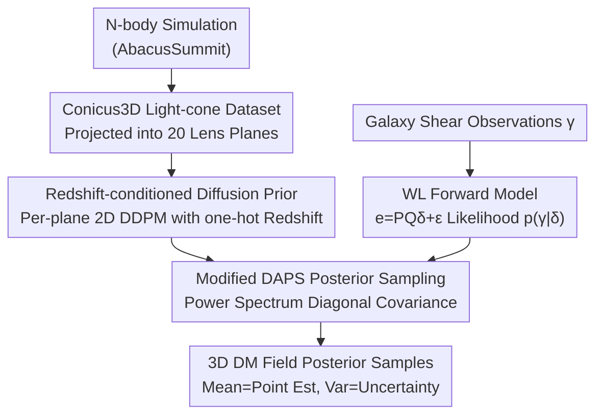

# Generative Diffusion Priors for 3D Mapping of the Dark Universe

**Conference**: CVPR 2026  
**arXiv**: [2606.00803](https://arxiv.org/abs/2606.00803)  
**Code**: Data and code promised to be public (repository address not yet provided)  
**Area**: 3D Vision / Diffusion Models / Scientific Inverse Problems  
**Keywords**: Dark matter mass mapping, Weak gravitational lensing, Diffusion priors, Posterior sampling, Cosmology

## TL;DR
This paper transforms the highly ill-posed cosmological inverse problem of "reconstructing the 3D dark matter distribution from weak gravitational lensing observations" into a diffusion model posterior sampling task. It utilizes N-body simulations to construct the Conicus3D light-cone dataset and trains a redshift-conditioned 2D diffusion prior. By coupling this data-driven prior with a differentiable weak lensing forward model using a modified DAPS algorithm, the approach significantly improves 3D/2D reconstruction correlations and power spectrum fidelity compared to Wiener filtering and Neural Ensemble baselines on simulated JWST COSMOS-Web surveys.

## Background & Motivation
**Background**: Dark matter does not emit light and can only be inferred indirectly through its weak gravitational lensing (WL) effect on background galaxy light. Inverting the tiny, coherent "shear" ($\gamma$) of galaxy shapes into a mass distribution along the line-of-sight defines the "mass mapping" inverse problem. 2D projected mass mapping (reconstructing the integrated convergence $\kappa$) is relatively well-posed, with existing solutions including Kaiser-Squires analytic inversion, Wiener filtering, sparse regularization, U-Net, and diffusion models.

**Limitations of Prior Work**: The true challenge lies in **three-dimensional** reconstruction. Observations provide only a **single line-of-sight** perspective, galaxy distances are crudely estimated via photometric redshifts (high noise), and "shape noise" from intrinsic galaxy orientations is two orders of magnitude larger than the shear signal. The combination of these factors makes 3D inversion extremely ill-posed. Existing astrophysical methods (Gaussian priors, sparsity constraints, singular vector truncation, wavelet multi-resolution) rely on hand-crafted smoothing priors, resulting in over-smoothed maps that lose non-Gaussian, filamentous structures of the cosmic web. While machine learning neural-field/ensemble methods provide approximate uncertainty, they **do not correspond to strict Bayesian posteriors**.

**Key Challenge**: The inverse problem requires strong priors to constrain ill-posed solutions, but hand-crafted analytic priors fail to capture the nonlinear, non-Gaussian statistics of structure formation. Conversely, high-resolution cosmological simulations—sources that approximate ground-truth statistics—have not previously been organized into learnable generative priors for inversion frameworks.

**Goal**: (1) Provide a dataset for learning real 3D dark matter statistics; (2) Design a reconstruction framework that strictly combines "simulation-learned priors" with "known physical forward models" to enable posterior sampling.

**Key Insight**: New-generation N-body simulations (AbacusSummit) can evolve structure formation with high fidelity. By organizing simulation outputs into light-cone data to train diffusion models as priors and leveraging recent plug-and-play diffusion inverse solvers, it is possible to sample the posterior while ensuring physical consistency.

**Core Idea**: Replace hand-crafted smoothing priors with "simulation-driven redshift-conditioned diffusion priors + differentiable weak lensing forward models," treating 3D mass mapping as diffusion posterior sampling to recover small-scale filamentous structures and provide calibrated uncertainty.

## Method

### Overall Architecture
The methodology consists of "offline prior construction" and "online inverse problem solving." Offline: Dark matter light-cones are extracted from AbacusSummit N-body simulations and projected into a stack of lens planes equidistant in comoving distance, forming the Conicus3D dataset. This is used to train a **redshift-conditioned 2D diffusion model** as the prior $p(\delta)$. Online: Given galaxy shear observations from a survey, a differentiable weak lensing forward model provides the likelihood $p(\gamma|\delta)$. A modified DAPS (Decoupled Annealing Posterior Sampling) algorithm couples the prior and likelihood to sample physically consistent 3D dark matter overdensity fields $\delta$ from the posterior $p(\delta|\gamma)\propto p(\gamma|\delta)p(\delta)$, where the mean serves as the point estimate and the variance as the uncertainty.

### Key Designs

**1. Conicus3D: Organizing N-body Simulations as a Learnable 3D Light-cone Prior Source**

Ill-posed inverse problems lack priors capturing real non-Gaussian structures. Previous work used either analytic smoothing priors or lacked accessible 3D training resources. This paper projects particles from AbacusSummit simulations (over 300 billion particles) onto the observer's light-cone geometry. Overdensities $\delta=(\rho-\bar\rho)/\bar\rho$ are calculated for redshift shells extending to $z\approx 2$, binned into 20 lens planes at **equidistant comoving distances**, and cropped to the JWST COSMOS survey footprint. The dataset includes 20,000 fiducial cosmology light-cones, 800 OOD (modified parameters) light-cones, and simulated shape catalogs. This provides material for diffusion models to learn nonlinear statistics while the unified light-cone geometry allows extension to other line-of-sight observations like FRB or CMB.

**2. Redshift-conditioned Light-cone Diffusion Prior: Synthesizing 3D Volumes with 2D Denoisers**

Learning 3D volumetric distributions directly is computationally expensive. This paper leverages a physical approximation: since lens planes span vast distances, distributions at different redshifts are approximately independent. The light-cone prior is factorized as $p(\delta)=\prod_{z=1}^{M}p(\delta^{(z)})$ for $M$ fixed redshifts. Thus, a **conditional 2D diffusion model** is trained to estimate the marginal prior $p(\delta^{(z)}|z)$ using a standard DDPM U-Net on $128\times128$ lens plane images, with redshift encoded as a one-hot vector. During 3D generation, multiple planes are denoised simultaneously starting from Gaussian noise with corresponding redshift encodings, resulting in a redshift-coherent volumetric field. This reduces 3D generation to batched 2D denoising, saving computation while serving as a strict score estimator $\nabla_\delta\log p(\delta)$.

**3. Modified DAPS: Injecting Cosmological Prior Structure via Power Spectrum Diagonalization**

With prior scores and physical likelihoods, the paper uses DAPS as a framework, which samples the noise posterior $p(\delta_t|\gamma)$ through an annealing sequence from $t=T$ to $0$. Each step alternates between (1) sampling $\delta_{0|\gamma}\sim p(\delta_0|\delta_{t+\Delta t},\gamma)$ and (2) sampling $\delta_t\sim\mathcal{N}(\delta_{0|\gamma},\sigma_{t_2}^2\mathbf{I})$. The original DAPS approximates $p(\delta_0|\delta_t)$ in step (1) using a **pixel-space diagonal covariance**, ignoring spatial correlations. This paper modifies the covariance to be diagonal in **Fourier space** based on the matter power spectrum $P_k$, exploiting cosmological translational invariance and isotropy:

$$\mathbf{\Sigma}_t^{-1}=F^{-1}\operatorname{diag}\!\left(\sigma_t^{-2}+P_k^{-1}\right)F$$

where $P_k$ is estimated empirically from training data. This injects the prior structure that the cosmic matter field is a near-stationary random field with scale-dependent power, preventing the reconstruction from being over-smoothed by pixel-wise diagonal assumptions while retaining small-scale power.

### Loss & Training
The diffusion prior is trained using standard conditional DDPM score matching/denoising objectives on $128\times128$ lens planes conditioned on one-hot redshifts. No paired "observation-ground truth" supervision is required; it purely learns the prior $p(\delta^{(z)}|z)$. The inverse problem involves no further training; it uses the modified DAPS at inference to couple the prior score with a Gaussian likelihood from the forward model $e_{\text{obs}}=\mathbf{P}\mathbf{Q}\delta+\varepsilon,\ \varepsilon\sim\mathcal{N}(0,\sigma_{\text{shape}})$. Here, $\mathbf{Q}$ projects overdensities into convergence $\kappa$ via line-of-sight integration, and $\mathbf{P}$ convolves $\kappa$ into shear $\gamma$ using the complex kernel $\mathcal{D}(\boldsymbol\theta)=-1/(\boldsymbol\theta^*)^2$.

## Key Experimental Results

### Main Results
The evaluation simulates a JWST COSMOS-Web survey: area 0.54 deg², source density ~261 arcmin⁻², shape noise $\sigma_e\approx 0.25$, and photometric redshift dispersion $\sigma_z=0.11(1+z)$. Baselines include analytic Wiener filter reconstruction and a Neural Ensemble estimator. For 3D evaluation, the truth and reconstruction are Gaussian-blurred along the radial $z$ direction with a $\sigma=4$ lens plane kernel to calculate correlation ($\rho_{\text{blur}}^{3D}$).

| Volume | Method | $\rho_{\text{blur}}^{3D}\uparrow$ | $\rho^{3D}\uparrow$ | $\rho^{2D}\uparrow$ |
|------|------|------|------|------|
| 1 | **Ours** | **0.83** | **0.23** | **0.87** |
| 1 | Neural Ensemble [49] | 0.79 | 0.21 | 0.86 |
| 1 | Wiener [42] | 0.71 | 0.21 | 0.77 |
| 2 | **Ours** | **0.83** | **0.27** | **0.88** |
| 2 | Neural Ensemble [49] | 0.80 | 0.21 | 0.87 |
| 2 | Wiener [42] | 0.72 | 0.23 | 0.83 |
| 3 | **Ours** | **0.92** | **0.18** | **0.98** |
| 3 | Neural Ensemble [49] | 0.86 | 0.09 | 0.96 |
| 3 | Wiener [42] | 0.84 | 0.13 | 0.92 |

Across three volumes, the proposed method **consistently outperforms** baselines in both 2D and 3D (blurred and full resolution) correlation coefficients. The most significant gains are in $\rho_{\text{blur}}^{3D}$ and full-resolution $\rho^{3D}$ (e.g., Volume 3: 0.18 vs 0.09/0.13, nearly double the Neural Ensemble).

### Ablation Study
The paper analyzes the framework through **power spectrum fidelity**, **cosmological mismatch generalization**, and **uncertainty calibration**:

| Analysis Dimension | Key Observations | Explanation |
|------|---------|------|
| Angular Power Spectrum $C_\ell^\kappa$ | Samples retain correct power at high $\ell$ (small scales); Neural Ensemble over-smooths when noise power exceeds signal. | Design 2/3 preserves small-scale structures in single samples. |
| Radial Power Spectrum | Samples show near-flat radial spectrum (de-correlation between planes); Neural Ensemble shows spurious LoS correlations. | Validates the "plane independence" factorization. |
| Cosmological Mismatch (OOD) | Prior is fiducial, but posterior spectrum still matches OOD truth (higher power) due to likelihood guidance. | Design 3 likelihood term corrects for prior mismatch. |
| Uncertainty Calibration | Voxel-wise "Sample Std vs. True MAE" correlation $r=0.92$. | Validates the Bayesian posterior sampling approach. |

### Key Findings
- **Small-scale power is the differentiator**: Unlike smoothing regularizers that flatten high-frequency structures, diffusion posteriors match the ground truth angular power spectrum across all scales, which is critical for downstream non-linear statistics (peak counts, voids, etc.).
- **Likelihood guidance handles prior mismatch**: In OOD scenarios (e.g., massless neutrinos), the stronger lensing signal allows the likelihood to override the mismatched prior, keeping the posterior samples consistent with the truth.
- **Posterior sampling vs. Pseudo-uncertainty**: While ensemble methods offer similar calibration correlations, only the diffusion approach provides a well-defined Bayesian posterior, ensuring that posterior predictive intervals for non-linear statistics are correctly calibrated.

## Highlights & Insights
- **Dimensionality reduction of 3D generation**: By treating redshifts as independent planes, the model reduces 3D synthesis to batched 2D denoising, optimizing both compute and prior strictness.
- **Encoding cosmology into sampling covariance**: Diagonalizing covariance in Fourier space using the power spectrum is an ingenious way to inject "near-stationary random field" physics into a plug-and-play solver. This trick is applicable to adaptive optics, geophysics, and CMB mapping.
- **Posterior vs. Ensemble**: The paper clearly distinguishes between an ensemble's "pseudo-uncertainty" and a true Bayesian posterior, highlighting the necessity of the latter for unbiased sample-level statistics in cosmological parameter inference.

## Limitations & Future Work
- **Sensitivity to simulator choice**: The impact of different simulation codes or physics assumptions on the learned prior requires further analysis.
- **Low absolute 3D correlation**: The $\rho^{3D}$ values (0.18–0.27) reflect the inherent ill-posedness of radial reconstruction from a single viewpoint; precise slice-by-slice 3D positioning remains challenging.
- **Approximation of plane independence**: While simplifying, treating planes as independent ignores real correlations of structures along the line-of-sight (e.g., galaxy clusters), which might matter at higher resolutions.
- **Simulation-only verification**: Results are limited to simulated JWST data; domain gaps (selection effects, PSF, intrinsic alignment) in real data remain to be tested.

## Related Work & Insights
- **Comparison with Wiener Filtering [42]**: Wiener filtering uses analytic Gaussian priors, resulting in over-smoothed maps; this work uses data-driven priors to recover filaments and match the full power spectrum.
- **Comparison with Neural Ensemble [49]**: Neural Ensemble produces over-smoothed results and spurious line-of-sight correlations; the diffusion approach yields unbiased sample-level statistics.
- **Comparison with DPS [11]**: Unlike standard guidance methods that "nudge" samples, this work uses a DAPS-based approach with physical covariance modifications for better posterior consistency in cosmic fields.
- **Insight**: Incorporating domain physics (power spectra, stationarity) into the covariance or factorization of diffusion solvers provides a robust paradigm for scientific inverse problems involving near-stationary random fields and high noise.

## Rating
- **Novelty**: ⭐⭐⭐⭐⭐ First light-cone dataset for 3D WL mapping combined with Fourier-power-spectrum-injected DAPS.
- **Experimental Thoroughness**: ⭐⭐⭐⭐ Comprehensive analysis of OOD and calibration, though lacks testing on real data.
- **Writing Quality**: ⭐⭐⭐⭐⭐ Clear derivation of physics models and forward operators.
- **Value**: ⭐⭐⭐⭐⭐ Provides a re-usable paradigm for astronomers and 3D vision researchers tackling projective inverse problems.

<!-- RELATED:START -->

## Related Papers

- [\[CVPR 2026\] Scene Reconstruction as Mapping Priors for 3D Detection](scene_reconstruction_as_mapping_priors_for_3d_detection.md)
- [\[CVPR 2026\] HAD: Hallucination-Aware Diffusion Priors for 3D Reconstruction](had_hallucination-aware_diffusion_priors_for_3d_reconstruction.md)
- [\[CVPR 2026\] Unsupervised Monocular 3D Keypoint Discovery from Multi-View Diffusion Priors](unsupervised_monocular_3d_keypoint_discovery_from_multi-view_diffusion_priors.md)
- [\[CVPR 2026\] Paparazzo: Active Mapping of Moving 3D Objects](paparazzo_active_mapping_of_moving_3d_objects.md)
- [\[CVPR 2026\] Gaussian Mapping for Evolving Scenes](gaussian_mapping_for_evolving_scenes.md)

<!-- RELATED:END -->
