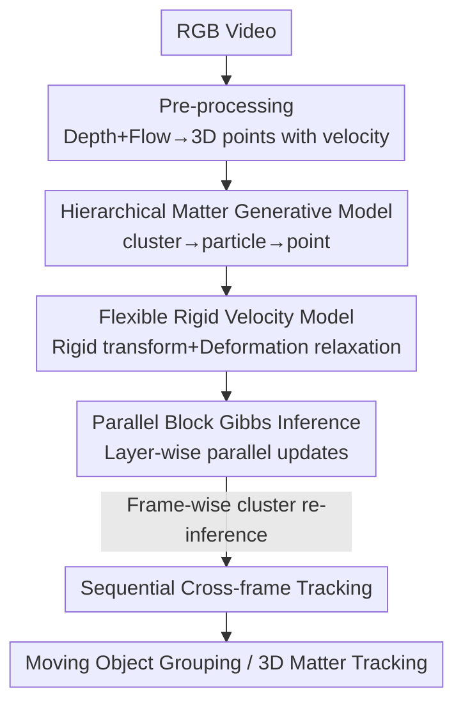

# GenMatter: Perceiving Physical Objects with Generative Matter Models

**Conference**: CVPR 2026  
**arXiv**: [2604.22160](https://arxiv.org/abs/2604.22160)  
**Code**: Project page esli999.github.io/genmatter (Repository not explicitly open-sourced)  
**Area**: 3D Vision / Motion Segmentation / Generative Perception  
**Keywords**: Generative Matter Models, Hierarchical Bayesian, Block Gibbs Sampling, Spelke Objects, Motion Grouping

## TL;DR
GenMatter reformulates the task of "segmenting independently moving objects from motion" as online probabilistic inference under a two-level hierarchical generative model (cluster → particle → 3D point). By inverting this model using parallel block Gibbs sampling, the authors reproduce human perception across random dot kinematograms (RDK), camouflaged rotating objects, and natural RGB videos—scenarios where current CV systems often fail individually—using a single engine that requires no task-specific training and matches supervised trackers.

## Background & Motivation
**Background**: Discovering object structures from motion currently relies on learning-based feedforward networks, such as optical flow segmentation (FlowSAM), point tracking + SAM2 grouping (SegAnyMo), or large-scale supervised promptable segmentation (SAM2). Each performs well within its specialized domain.

**Limitations of Prior Work**: No existing CV system possesses the "generality" of human vision. Humans robustly segment moving objects under three distinct stimuli: ① Random Dot Kinematograms (RDK) with sparse motion and no shape cues; ② Camouflaged rotating objects where texture matches the background; and ③ Natural scenes. Learning-based methods fail when shifting domains—FlowSAM shows near-zero correlation on RDK, while SegAnyMo fails to detect objects in camouflaged stimuli.

**Key Challenge**: Existing methods either impose rigid manual regularization (e.g., fixed-radius as-rigid-as-possible constraints) or avoid explicit "object-level grouping" altogether, making them unable to handle entities with significant deformation. Treating motion grouping as pure feedforward regression also sacrifices the "graded uncertainty" characteristic of human perception in ambiguous scenarios.

**Goal**: To build a unified framework capable of working across all three input types, replicating human perception (including graded uncertainty), and matching supervised trackers on natural videos.

**Key Insight**: Borrow the "analysis-by-synthesis" principle from human vision—perception equals Bayesian inference within a structured generative model. The authors hypothesize that independently moving "matter blocks" should be explicitly modeled as a hierarchical prior rather than approximated by manual regularization.

**Core Idea**: Use a hierarchical generative model to group low-level motion cues and high-level appearance features first into particles (small Gaussians representing local matter) and then into clusters (coherent, independently moving physical entities). Perceptual grouping is transformed into online probabilistic inference of this generative model.

## Method

### Overall Architecture
The input to GenMatter is an RGB video, pre-processed into "3D point clouds with velocity labels" (each pixel is lifted to 3D via monocular depth and optical flow). The model represents the scene in two levels: **cluster (coherent rigid body groups) → particle (local matter Gaussians) → data point (position-velocity observations)**. The generative direction proceeds from cluster to particle to 3D point; the inference direction is reversed, inferring particle and cluster parameters conditioned on observed 3D points. Finally, each particle is colored according to its cluster assignment, revealing which matter belongs to which moving entity. The pipeline consists of "Pre-processing features → Hierarchical generative model → Block Gibbs inference → Sequential cross-frame tracking."

### Key Designs

**1. Hierarchical Matter Generative Model: Modeling "Objects" as GMMs of cluster→particle→point**

The limitation of prior work is the avoidance of explicit object-level grouping, which prevents the representation of deforming entities. GenMatter defines the scene procedurally in two layers (Algorithm 1): each cluster $k$ is described by a spatial Gaussian $(\bm{\mu}_k^{\mathcal{H}},\bm{\Sigma}_k^{\mathcal{H}})$ and a rigid transformation $(\mathbf{R}_k,\mathbf{t}_k)$. Each particle $\ell$ is first assigned to a cluster via $z_\ell^{\mathcal{H}}\sim\text{Cat}(\bm{\pi}^{\mathcal{H}})$, then its mean is sampled from that cluster's spatial Gaussian $\bm{\mu}_\ell^{\mathcal{B}}\sim\mathcal{N}(\bm{\mu}_k^{\mathcal{H}},\bm{\Sigma}_k^{\mathcal{H}})$, with an intrinsic covariance $\bm{\Sigma}_\ell^{\mathcal{B}}$ representing the extent of that matter block. Observed points $\mathbf{x}_n$ (position-velocity pairs) are sampled from the particle Gaussians. To incorporate image appearance, data points are extended to $\tilde{\mathbf{x}}_n=[\mathbf{x}_n;\mathbf{f}_n]$ with block-diagonal covariance (independence between spatial and feature dimensions). This hierarchy—where clusters manage global rigidity, particles manage local regions, and points manage observations—allows objects to maintain global consistency while accommodating local deformations.

**2. Flexible Rigid Velocity Model: Accommodating Rigidity and Deformation via "Rigid-induced Velocity + Multi-level Noise Relaxation"**

Modeling matter strictly as a rigid body fails under deformation; having no constraints results in chaotic point motion. GenMatter defines the expected velocity of each particle as induced by the parent cluster's rigid transformation: $\bar{\mathbf{v}}_\ell=\mathbf{t}_k+(\mathbf{R}_k-\mathbf{I})(\bm{\mu}_\ell^{\mathcal{B}}-\bm{\mu}_k^{\mathcal{H}})$, where $(\mathbf{R}_k-\mathbf{I})$ is a first-order approximation of rotation around the cluster center. Noise relaxation is added at each level: particle velocity $\mathbf{v}_\ell\sim\mathcal{N}(\bar{\mathbf{v}}_\ell,\sigma_V^2\mathbf{I})$ allows deviation from pure rigidity, and point velocity $\mathbf{v}_n\sim\mathcal{N}(\mathbf{v}_\ell,\bm{\Sigma}_\ell^{\mathcal{V}})$ allows deviation from particle motion. The authors derive a connection to classic ARAP (As-Rigid-As-Possible) regularization via small-variance asymptotics ($\epsilon/\eta\to0$): in the limit, it collapses to a K-means-like objective $\mathcal{L}=\sum_n\|\mathbf{x}_n+\mathbf{v}_n-\mathbf{x}_n'\|_2^2$ (where $\mathbf{x}_n'$ is the predicted position after rigid transformation), solved by alternating between centroid calculation and Procrustes alignment. The key difference is that while ARAP enforces local rigidity via distance penalties with a fixed radius $r$, GenMatter couples rigidity into the probabilistic inference of cluster assignments, naturally revealing which particles belong to which moving entity.

**3. Parallel Block Gibbs Sampling Inference: Parallel Updates via Hierarchical Conditional Independence**

Optimizing over all discrete assignments is intractable, so the authors use block Gibbs sampling to invert the generative model. The core is the hierarchical conditional independence: given other layers, variables within the same layer (points / particles / clusters) can be updated in parallel. Assignment updates follow categorical Gibbs conditions—points are assigned to particles based on spatial and velocity likelihoods: $p(z_n^{\mathcal{B}}=\ell\mid\cdot)\propto\pi_\ell^{\mathcal{B}}\cdot\mathcal{N}(\mathbf{x}_n\mid\bm{\mu}_\ell^{\mathcal{B}},\bm{\Sigma}_\ell^{\mathcal{B}})\cdot\mathcal{N}(\mathbf{v}_n\mid\mathbf{v}_\ell,\bm{\Sigma}_\ell^{\mathcal{V}})$, and particles are assigned to clusters based on rigid motion fitting. Parameter updates use conjugates where possible (Normal-Inverse-Wishart for covariance, Normal-Normal for mean, Dirichlet-Categorical for mixing weights). Rigid transformations are inferred by parallel enumeration of discretized SE(3) candidates scored by likelihood. The system is implemented using the GenJAX probabilistic programming framework, running on a single NVIDIA L4 (24GB). The core engine requires no task-specific training and consists of only a few KB of source code.

**4. Sequential Cross-frame Tracking: Re-inferring Cluster Assignments to Avoid "Rigid Body Over-articulation"**

To extend the model to video, the most direct approach is propagating cluster assignments. However, the authors found that propagation often causes clusters to incorrectly bridge articulated parts. GenMatter's mechanism is: at frame $t$, particle means are projected forward using previous velocities $\tilde{\bm{\mu}}_\ell^{\mathcal{B},t}=\bm{\mu}_\ell^{\mathcal{B},t-1}+\mathbf{v}_\ell^{t-1}$. Since observations are unordered point clouds, points are first assigned to particles by spatial proximity. After updating particle means, a bottom-up (point → particle → cluster) Gibbs scan is performed. **Crucially, cluster assignments and transformations are re-inferred every frame rather than propagated**, inspired by filtering ideas in particle MCMC. This strategy allows the model to track deforming or articulated objects while maintaining a tractable posterior.

## Key Experimental Results

Evaluation is conducted across three settings: 2D Random Dot Kinematograms (RDK), Camouflaged 3D Gestalt stimuli, and natural RGB videos. All confidence intervals are 95% bootstrap (50,000 resamples).

### Main Results

Camouflaged 3D Gestalt stimuli (140 videos, 20 geometries × 7 background-matching textures):

| Method | Accuracy | Jaccard |
|------|------|---------|
| SegAnyMo | 0.33 [0.28, 0.37] | 0.26 [0.22, 0.31] |
| FlowSAM | 0.87 [0.85, 0.88] | 0.67 [0.63, 0.70] |
| **Ours** | **0.94 [0.93, 0.94]** | **0.72 [0.70, 0.74]** |

Ours outperforms FlowSAM on 111/140 segments and SegAnyMo on 133/140 segments (paired $t$-test, $p<1\times10^{-6}$) and leads consistently across all textures.

Natural RGB videos (TAP-Vid-DAVIS, compared with supervised tracker CoTracker3, metric is matter-weighted Jaccard $J_m$):

| Metric | CoTracker3 | Ours | Ours (Ablation) |
|------|------|------|------|
| $J_m$ (SAM Init) | 0.78 [0.69, 0.87] | **0.79 [0.73, 0.84]** | 0.69 [0.61, 0.77] |
| $J_m$ (GT Init) | 0.78 [0.69, 0.87] | 0.77 [0.73, 0.84] | 0.68 [0.58, 0.73] |

Without **task-specific pre-training**, Ours achieves 0.79, matching the supervised CoTracker3's 0.78.

Alignment with Human Judgments on RDK: Ours correlates with human binary same-object judgments at $r^2=0.86$ ($t(25)=12.4$, $p<0.001$).

### Ablation Study

| Configuration | Key Metric | Description |
|------|---------|------|
| Full (Hierarchical) | RDK $r^2=0.86$ | Full two-level cluster+particle model |
| w/o cluster (fixed particles, K=5) | RDK $r^2=0.35$ | Only particle inference, cluster layer removed |
| w/o cluster (adaptive particles, K=500) | RDK $r^2=0.41$ | Same as above, with online covariance updates |
| FlowSAM (Baseline) | RDK $r^2=0.04$ | Learning-based motion segmentation, near-zero correlation |
| w/o cluster (DAVIS) | $J_m$ 0.79→0.69 | Removing hierarchy also causes significant drop in natural video |
| w/o depth (Gestalt) | Accuracy 0.94→0.89 | Still slightly outperforms FlowSAM (0.87) with flow only |
| w/o depth (DAVIS, SAM Init) | $J_m=0.69$ | Depth provides contributions beyond motion |

### Key Findings
- **The cluster layer is vital**: Removing the cluster layer causes $r^2$ on RDK to plummet from 0.86 to 0.35/0.41, and $J_m$ on DAVIS to drop from 0.79 to 0.69. The hierarchical structure is key to replicating human perception and robust tracking.
- **Optical flow drives camouflaged stimuli**: Removing depth on Gestalt only drops accuracy from 0.94 to 0.89, still higher than FlowSAM (0.87), suggesting that monocular depth is often unreliable on camouflaged textures, whereas optical flow remains a strong cue.
- **Hierarchy enables computational scalability**: Subsampling data points at the bottom layer directly reduces latent variables. Subsampling from 1/8 to 1/128 shows no statistically significant drop in performance ($J_m=0.76–0.79$) while providing up to a 12× speedup (9.8 FPS at 1/128 vs 0.80 FPS at full resolution). This speed-accuracy trade-off is not easily achieved in end-to-end learning architectures.
- **GT initialization is slightly worse**: Initializing with ground truth masks drops $J_m$ on DAVIS from 0.79 (SAM initialization) to 0.77. Hard geometric constraints from GT at frame 0 do not always align with noisy flow/depth. SAM2's multi-segment proposals are better suited for modeling object versus non-object regions.

## Highlights & Insights
- **Reformulating "Perceptual Grouping" as Online Probabilistic Inference**: The core engine matches data-driven learning across abstract point stimuli and natural videos without task-specific training. This serves as a powerful counter-example to the notion that massive supervision is mandatory for generality.
- **Bridging to ARAP via Small-Variance Asymptotics**: By showing how the model collapses to a K-means + Procrustes objective as $\epsilon/\eta\to0$, the authors provide a familiar entry point for optimization-oriented researchers. It clarifies that GenMatter's gains come from "jointly inferring grouping + rigid motion" rather than fixed-radius penalties.
- **Reproducing Human "Graded Uncertainty"**: The model is not only accurate in clear scenes but also makes human-like errors in ambiguous RDKs (e.g., slow sliding), achieving 88% alignment vs human 84% on same-object judgments. This establishes it as a computational model of human perception rather than just an engineering tool.
- **Transferable Insight**: The strategy of "re-inferring cluster assignments each frame rather than propagating discrete structures" can be applied to any structured tracking task involving articulation or deformation over time, preventing permanent errors from historical mis-groupings.

## Limitations & Future Work
- **Lack of Explicit Dynamics**: The current model represents matter but does not model physical dynamics. It cannot perform forward prediction, leading to performance degradation under full occlusion (missing a mechanism to re-initialize hidden matter).
- **Fixed Particle Count $L$**: This limits adaptation to scale changes or objects entering/leaving the scene; Bayesian non-parametrics with dynamic particle allocation could mitigate this.
- **Proxy Evaluation**: RDK and Gestalt results rely on binary responses, collapsing the posterior into discrete judgments. 3D tracking is evaluated via 2D masks due to a lack of 3D ground truth for deforming objects.
- **Reliance on Pre-trained Feature Extractors**: While the inference engine is training-free, the frontends (RAFT / VideoDepthAnything / DINO / SAM2) are pre-trained. The system is not "from scratch."

## Related Work & Insights
- **vs. ARAP-regularized Tracking (e.g., [62])**: ARAP enforces local rigidity via pair-wise distance change penalties within a fixed radius $r$, avoiding explicit grouping. Ours couples rigidity into hierarchical Bayesian inference of cluster assignments, naturally providing object-level grouping and handling discontinuous motions.
- **vs. FlowSAM / SegAnyMo (Learning-based Motion Segmentation)**: These feedforward methods are domain-specific. Ours uses a single structured prior to achieve generality across three domains, surpassing both on camouflaged stimuli.
- **vs. CoTracker3 (Supervised Point Tracking)**: CoTracker3 tracks single pixels and requires simulation supervision. Our particle representation uses Gaussian regions with spatial extent and matches performance ($J_m$ 0.79 vs. 0.78) without task-specific training.
- **vs. Classic Analysis-by-Synthesis**: Traditional models often imposed restrictive assumptions on texture or geometry due to computational complexity. GenMatter provides a tractable probabilistic model that reaches human-level robustness to noise and ambiguity.

## Rating
- Novelty: ⭐⭐⭐⭐⭐ Formulating cross-domain motion perception as hierarchical generative modeling + online inference, while bridging to ARAP via small-variance asymptotics, is a fresh and self-consistent perspective.
- Experimental Thoroughness: ⭐⭐⭐⭐⭐ Covers three settings, human comparisons, supervised baselines, hierarchy/depth ablations, and speed-accuracy trade-offs with solid statistical testing.
- Writing Quality: ⭐⭐⭐⭐ The generative model and inference derivations are clear, and diagrams are well-placed. However, the high density of probabilistic notation may be challenging for non-Bayesian readers.
- Value: ⭐⭐⭐⭐⭐ Using a training-free, few-KB engine to match supervised methods and reproduce human perception is a landmark contribution in the "structured priors vs. large-scale learning" debate.

<!-- RELATED:START -->

## Related Papers

- [\[CVPR 2026\] BrickNet: Graph-Backed Generative Brick Assembly](bricknet_graph-backed_generative_brick_assembly.md)
- [\[CVPR 2026\] Generative Diffusion Priors for 3D Mapping of the Dark Universe](generative_diffusion_priors_for_3d_mapping_of_the_dark_universe.md)
- [\[CVPR 2026\] AssemblyBench: Physics-Aware Assembly of Complex Industrial Objects](assemblybench_physics-aware_assembly_of_complex_industrial_objects.md)
- [\[CVPR 2026\] Artiverse: A Diverse and Physically Grounded Dataset for Articulated Objects](artiverse_a_diverse_and_physically_grounded_dataset_for_articulated_objects.md)
- [\[CVPR 2026\] JRM: Joint Reconstruction Model for Multiple Objects without Alignment](jrm_joint_reconstruction_model_for_multiple_objects_without_alignment.md)

<!-- RELATED:END -->
