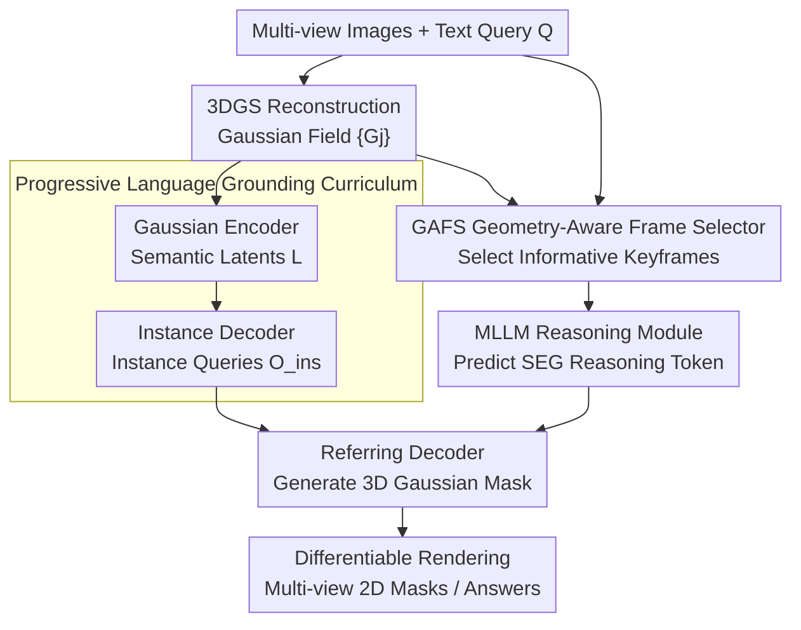

# GenSplat: Bridging the Generalization Gap in 3DGS Language Comprehension

**Conference**: CVPR 2026  
**Paper**: [CVF Open Access](https://openaccess.thecvf.com/content/CVPR2026/html/Liu_GenSplat_Bridging_the_Generalization_Gap_in_3DGS_Language_Comprehension_CVPR_2026_paper.html)  
**Code**: https://github.com/fawnliu/GenSplat (Open source committed by authors, not yet released at the time of submission)  
**Area**: 3D Vision  
**Keywords**: 3D Gaussian Splatting, Language Comprehension, Referring Segmentation, MLLM Reasoning, Cross-scene Generalization  

## TL;DR
GenSplat decomposes language comprehension in 3DGS scenes into a progressive curriculum of "semantics → instance → free-form text". By utilizing a `<SEG>` token inferred from an MLLM to query 3D Gaussian features in conjunction with a geometry-aware keyframe selector, the model achieves SOTA performance across scenes and tasks (referring segmentation / VQA / open-vocabulary) without requiring per-scene optimization during inference.

## Background & Motivation
**Background**: 3D Gaussian Splatting (3DGS) enables high-quality geometric reconstruction and rendering, but "language-driven high-level semantic understanding" remains a challenge. The dominant approach embeds CLIP semantic features into each Gaussian primitive (e.g., LangSplat series) and uses text embeddings to query Gaussians for open-vocabulary segmentation.

**Limitations of Prior Work**: This approach suffers from two mutually exclusive failure modes. One category (CLIP-embedded, SceneSplat) either requires **per-scene optimization** or is **restricted to a predefined vocabulary**—the cost of cross-scene generalization is the inability to handle free-form text queries or tasks beyond segmentation like VQA and captioning. The other category (ReferSplat, ReasonGrounder) can process free-form text but relies on **per-scene overfitting** for weak vision-language alignment, failing completely on unseen scenes.

**Key Challenge**: The authors diagnose the root cause of "overfitting either the vocabulary or the scene" as the model's lack of **hierarchical learning between low-level geometry and multi-level language**. Models are often tasked with directly mapping complex free-form text to Gaussian primitives without first learning fundamental concept grounding (e.g., "whole scene description → category → instance"). Without this foundation, the model resorts to rote memorization.

**Goal**: To achieve language comprehension and spatial reasoning in 3DGS that is robust to free-form text and generalizable across scenes, without per-scene optimization during inference.

**Key Insight**: 3D language understanding is **explicitly modeled as a progressive "primitive → concept" alignment process**. Gaussian primitives are first aligned to semantic-level representations, then aggregated into instance-level concepts, and finally aligned with free-form text. The free-form text step is handled by an MLLM, which utilizes its semantic/spatial priors to generate a reasoning token that conditions 3D localization.

## Method

### Overall Architecture
The input to GenSplat consists of a set of multi-view RGB images $I=\{I_i\}_{i=1}^N$ and a text query $Q$ (for referring segmentation or VQA). The output is a 3D Gaussian mask identifying the target object (differentiably rendered into multi-view consistent 2D masks) or a textual answer. The pipeline integrates three core components: **Gaussian Encoder**, **Instance Decoder**, and **MLLM-guided Referring Decoder**.

The workflow is as follows: Multi-view images are first reconstructed into a Gaussian field $G=\{G_j\}_{j=1}^M$. The Gaussian encoder encodes each primitive into semantic latent variables $L=\{l_j\}$. The instance decoder further aggregates these features into instance-level queries $O_{ins}\in\mathbb{R}^{N_q\times C}$. Simultaneously, the **GAFS (Geometry-Aware Frame Selector)** adaptively selects the most informative keyframes based on the text $Q$. These frames and $Q$ are fed into the MLLM, which reasons and encodes semantic/spatial cues into a `<SEG>` reasoning token $t_{seg}$ (or generates answer tokens for VQA). Finally, the referring decoder takes the instance queries $O_{ins}$, the projected $\hat t_{seg}$, and the semantic features to predict the Gaussian mask of the referred target. The training of these three components is organized via a "Progressive Language Grounding Curriculum" in three stages: semantics → instance → free-form text.

### Key Designs

**1. Progressive Language Grounding Curriculum: Learning Basic Concepts Before Complex Sentences**

To address the root cause of overfitting, GenSplat decomposes training into three progressive stages. **(I) Semantic-level Alignment**: A standard SparseConvUNet is used as the Gaussian encoder $E_g$ to encode each Gaussian $G_j$ into semantic features $l_j=E_g(G_j)$. These are differentiably rendered into 2D feature maps $F_i$ and supervised using LangSplat-style 2D language features (extracted via SAM+CLIP, $\hat F_i$) with an $L_1$ loss: $L_1=\frac1N\sum_i\lVert F_i-\hat F_i\rVert_1$. Features are also aggregated via cluster-mean pooling based on geometric position and semantics into $\hat L=\{\hat l_k\}_{k=1}^m$ to stabilize learning. **(II) Instance-level Alignment**: The instance decoder uses learnable object queries $O_q$ (initialized with pooled semantics $\hat L$ to inject semantic priors) and performs cross/self-attention with $\hat L$. After $n$ layers, instance-level embeddings $O_{ins}$ are obtained. A mask head and classification head are added, supervised by 2D GT masks using $L_{ins}=L_{ce}+L_{mask}$ (BCE+dice+classification). **(III) Free-form Text Alignment**: The MLLM is introduced to produce a `<SEG>` token that aligns with instance features, completing the mapping from complex language to instances within the referring decoder. This stepwise grounding across semantics, instances, and text prevents overfitting to fixed vocabularies or single scenes.

**2. MLLM-guided Reasoning Module: Injecting 2D Semantic Priors into 3D Localization via a `<SEG>` Token**

To address the domain gap between 3D representations and the MLLM's native 2D visual space, the authors use **2D views as the visual interface for the MLLM** instead of feeding 3D features directly. Given a query, the MLLM outputs a specialized segmentation token `<SEG>`, whose last-layer hidden state $t_{seg}$ is linearly projected to $\hat t_{seg}\in\mathbb{R}^{1\times C}$. This token encodes the semantic identity and spatial priors of the target. The referring decoder reuses the instance decoder architecture but processes three inputs: instance queries $O_{ins}$, projected $\hat t_{seg}$, and semantic features $\hat L$. $O_{ins}$ and $\hat t_{seg}$ are concatenated as queries to interact with $\hat L$ via cross-attention, using the updated $\hat t_{seg}$ to predict the referred instance mask. The MLLM is co-trained with the referring decoder using LoRA, with a loss $L_{align}=L_{text}+\lambda_m L_{mask}$ ($\lambda_m=0.1$).

**3. GAFS Geometry-Aware Frame Selector: Providing the MLLM with High-Value, Non-Redundant Frames**

Feeding all views of a scene to an MLLM is computationally prohibitive, while pure 2D views lack the geometric structure necessary for spatial reasoning (e.g., "next to" or orientations). GAFS addresses "which frames to feed" by processing text $Q$, multi-view images $\{I_i\}$, and 3D Gaussian semantic features $L$. Each image is encoded via a VLM visual encoder to get $V_i$, then projected to visual embeddings $v_i$. The text $Q$ is similarly processed into query vector $\hat q$. For each view, its **visible 3D Gaussian semantic features $L_i$** (including CLIP-aligned embeddings and precise 3D positions) are extracted as geometric context and fused into visual embeddings $\hat v_i$ via cross-attention. Relevance scores $s_i$ are computed as the cosine similarity between $\hat v_i$ and $\hat q$, supervised by BCE:
$$L_{bce}=-\frac1N\sum_{i=1}^N\big[\hat s_i\log s_i+(1-\hat s_i)\log(1-s_i)\big].$$
During inference, after ranking by scores, **redundancy suppression** is applied to avoid visual overlap: starting from the highest-scoring view, views are selected only if their distance (weighted difference in translation and orientation) $D_{ij}=\lambda_t\lVert t_i-t_j\rVert_2+\lambda_r\cdot\mathrm{ang}(R_i,R_j)$ from already selected views exceeds a threshold $\tau_d$ ($\lambda_t=\lambda_r=1.0$, $\tau_d=0.5$). Finally, $N^*=32$ frames are selected.

### Loss & Training
The three stages utilize $L_1$ (semantic rendering alignment), $L_{ins}=L_{ce}+L_{mask}$ (instance-level), and $L_{align}=L_{text}+\lambda_m L_{mask}$ (free-form text level, $\lambda_m=0.1$), respectively. GAFS is trained separately using $L_{bce}$. The Gaussian encoder is pre-trained on ScanNet for 100 epochs, then trained with the instance decoder on ScanNet200 for 512 epochs. The MLLM backbone is LLaVA-Video, joint instruction-tuned using LoRA on datasets including ScanRefer, Nr3D, Sr3D, Multi3DRefer, ScanQA, SQA3D, and Scan2Cap. For SQA3D, where frame-level labels were missing, the authors used GPT-5 for automated labeling. Training was conducted on 8×H100 GPUs.

## Key Experimental Results

### Main Results

3D Referring Segmentation (ScanRefer / Multi3DRefer validation sets), GenSplat uses GS+I modality, compared against 2D MLLMs, expert models, and 3D MLLMs:

| Method | Modality | ScanRefer mIoU↑ | ScanRefer A@0.25↑ | ScanRefer A@0.5↑ | Multi3DRefer mIoU↑ |
|------|------|------|------|------|------|
| LISA-7B (2D MLLM) | I | 21.2 | 35.8 | 8.0 | - |
| LiftGS (Expert · GS) | GS | - | 49.7 | 36.4 | - |
| 3D-LLaVA (3D MLLM) | PC | 43.3 | - | - | 42.7 |
| 3D-LLaVA* (Adapted to GS) | GS | 29.8 | 44.2 | 22.7 | - |
| **GenSplat** | GS+I | **43.6** | **61.3** | **42.4** | **46.2** |

On 5 scenes selected by ReferSplat, comparison with per-scene optimization methods (mIoU): Grounded-SAM 12.4 / LangSplat 11.2 / ReferSplat 16.5 / **GenSplat 28.2**—performance nearly doubles without per-scene optimization.

3D Question Answering (ScanQA validation / SQA3D testing):

| Method | ScanQA C↑ | ScanQA M↑ | ScanQA R↑ | SQA3D EM↑ | SQA3D EM-R↑ |
|------|------|------|------|------|------|
| SplatTalk (I) | 77.5 | 15.6 | 38.5 | 47.6 | 49.4 |
| 3D-LLaVA (PC) | 92.6 | 18.4 | 43.1 | 54.5 | 56.6 |
| **GenSplat (GS+I)** | **95.1** | **18.9** | **44.9** | **56.0** | **58.9** |

### Ablation Study
Ablation of components (mIoU / C / EM-R, etc., selected from Table 4):

| Configuration | ScanRefer mIoU↑ | Multi3DRefer mIoU↑ | ScanQA C↑ | SQA3D EM-R↑ | Description |
|------|------|------|------|------|------|
| (I) Baseline | 26.6 | 33.8 | 71.7 | 48.6 | No MLLM reasoning or referring decoder |
| (II) + Semantic Pre-training | 29.4 | 35.6 | 73.9 | 48.9 | Curriculum Stage 1 |
| (III) + Instance Pre-training | 33.1 | 38.2 | 75.6 | 49.6 | Curriculum Stage 2 |
| (IV) MLLM directly consumes 3D | 33.9 | 40.3 | 93.2 | 53.9 | Validating 3D↔2D domain gap |
| (V) Uniform sampling | 32.3 | 27.3 | 94.9 | 55.2 | Replacing GAFS |
| (VI) BLIP retrieval | 36.7 | 36.1 | 96.7 | 56.4 | Replacing GAFS |
| (VII) GAFS 2D views only | 41.4 | 42.9 | 96.9 | 57.2 | Removing geometric features |
| (VIII) GenSplat | **43.6** | **46.2** | **98.3** | **58.9** | Full model |

### Key Findings
- **Progressive curriculum is the foundation**: (I)→(II)→(III) shows monotonic improvement across all tasks (ScanRefer mIoU 26.6→29.4→33.1), indicating that semantic-to-instance grounding is indispensable.
- **MLLM reasoning is the turning point**: (III)→(VIII) shows ScanQA CIDEr jumping from 75.6 to 98.3, confirming that MLLM-guided reasoning is "transformative" for scene understanding.
- **2D views bridge the domain gap**: (IV) feeding 3D features directly is significantly worse than (VII) using 2D views, confirming the domain gap between 3D representations and MLLM 2D space.
- **Frame selection is critical and geometry-synergistic**: (VII) significantly outperforms (V)/(VI), showing GAFS selects more relevant and diverse frames. (VIII) further improves over (VII), proving that fusing 2D appearance with 3D structure for frame selection enhances MLLM spatial reasoning. On Multi3DRefer, uniform sampling (V) reaches only 27.3 vs GAFS's 46.2.

## Highlights & Insights
- **Elegant unified diagnosis of "overfitting"**: Attributes "restricted vocabulary" and "restricted scene" failures to the same cause—lack of hierarchical learning—and solves it with a curriculum.
- **`<SEG>` token as "glue"**: Instead of forcing the MLLM to process 3D features, it outputs a token to condition the 3D decoder, bypassing the 3D↔2D domain gap. This "token-bridging" can be transferred to other "strong 2D base + weak 3D representation" alignment scenarios.
- **Injecting geometry into frame selection**: GAFS considers visible Gaussian 3D positions/semantics and applies pose-based redundancy suppression—a case study in "selecting right inputs rather than stacking models."
- **Zero per-scene optimization**: Aside from the 3DGS reconstruction itself, no per-scene training is required at test time, a key metric for "generalizability."

## Limitations & Future Work
- **Semantic Ambiguity**: The authors admit that scenes with many semantically similar objects (e.g., identical chairs) lead to ambiguous localization (Fig. 5). Incorporating fine-grained geometric priors is suggested.
- **Resource Intensive**: Requires 8×H100, 512 epochs, and multi-dataset joint tuning, posing high entry barriers. Dependency on 3DGS reconstruction quality remains.
- **GAFS GT dependency**: Training GAFS relies on GT view selection labels; for SQA3D, these were generated by GPT-5, and the impact of this noise was not isolated.
- **Potential Improvements**: Replacing the hard threshold $\tau_d$ in redundancy suppression with learnable/adaptive constraints, or introducing multiple tokens for multi-target scenarios (like Multi3DRefer), could improve stability.

## Related Work & Insights
- **vs LangSplat / SceneSplat**: These learn semantic attributes and rely on CLIP queries, requiring per-scene optimization or fixed vocabularies. GenSplat enables free-form text and cross-scene generalization while supporting VQA.
- **vs ReferSplat / ReasonGrounder**: These handle free-form text but suffer from per-scene overfitting. GenSplat achieves 28.2 mIoU on ReferSplat scenes (vs 16.5) without per-scene optimization.
- **vs 3D-LLaVA / Reason3D**: These point-cloud based MLLMs process 3D features directly and suffer from domain gaps. GenSplat's use of informative 2D views + geometric frame selection + token conditioning provides a more coherent pipeline, outperforming 3D-LLaVA by +8.2 mIoU on Multi3DRefer.

## Rating
- Novelty: ⭐⭐⭐⭐⭐ First generalizable 3DGS language comprehension framework; the curriculum + `<SEG>` token + GAFS trio is self-consistent and well-targeted.
- Experimental Thoroughness: ⭐⭐⭐⭐⭐ Crosses three task types and multiple benchmarks with 8 ablation groups, meticulously deconstructing domain gaps and frame selection strategies.
- Writing Quality: ⭐⭐⭐⭐ Clear motivation/diagnosis; some notations (e.g., $N^*$) require supplementary material for details.
- Value: ⭐⭐⭐⭐⭐ SOTA performance without per-scene optimization has direct value for 3DGS language interaction and embodied/AR applications.

<!-- RELATED:START -->

## Related Papers

- [\[CVPR 2026\] GAP: Action-Geometry Prediction with 3D Geometric Prior for Bimanual Manipulation](action-geometry_prediction_with_3d_geometric_prior_for_bimanual_manipulation.md)
- [\[CVPR 2026\] DiffusionHarmonizer: Bridging Neural Reconstruction and Photorealistic Simulation with Online Diffusion Enhancer](diffusionharmonizer_bridging_neural_reconstruction_and_photorealistic_simulation.md)
- [\[CVPR 2026\] Hg-I2P: Bridging Modalities for Generalizable Image-to-Point-Cloud Registration via Heterogeneous Graphs](hg-i2p_bridging_modalities_for_generalizable_image-to-point-cloud_registration_v.md)
- [\[CVPR 2026\] EmbodiedSplat: Online Feed-Forward Semantic 3DGS for Open-Vocabulary 3D Scene Understanding](embodiedsplat_online_feed-forward_semantic_3dgs_for_open-vocabulary_3d_scene_und.md)
- [\[CVPR 2026\] CaT-GS: Efficient 3DGS Rendering for Large-Scale Scenes with Inter-frame Caching and Tile Scheduling](cat-gs_efficient_3dgs_rendering_for_large-scale_scenes_with_inter-frame_caching_.md)

<!-- RELATED:END -->
