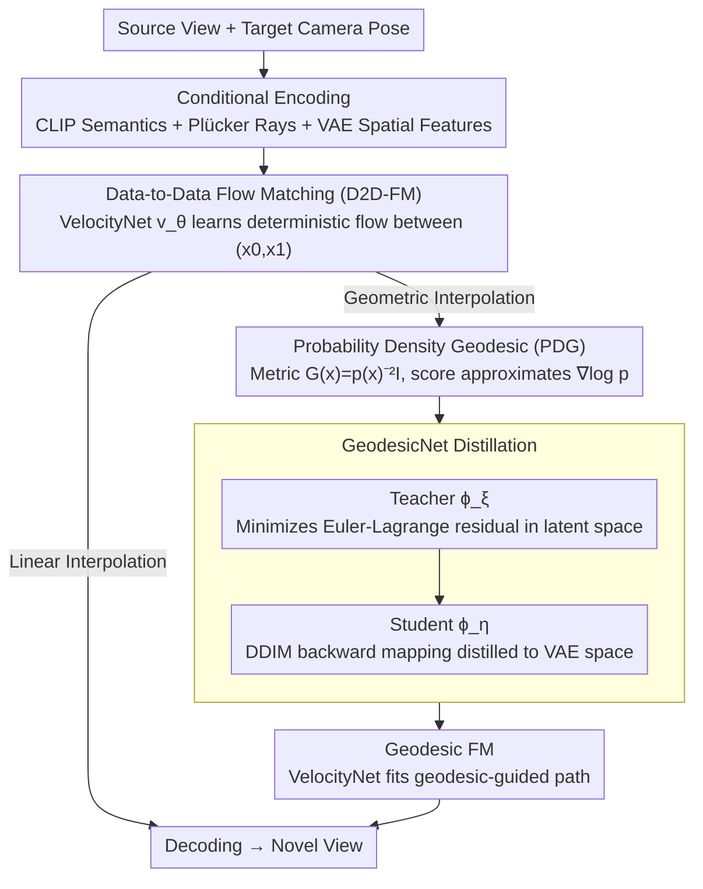

# GeodesicNVS: Probability Density Geodesic Flow Matching for Novel View Synthesis

**Conference**: CVPR 2026  
**arXiv**: [2603.01010](https://arxiv.org/abs/2603.01010)  
**Code**: None  
**Area**: 3D Vision  
**Keywords**: Novel View Synthesis, Flow Matching, Geodesic, Probability Density Manifold, Data-to-Data Mapping

## TL;DR

Ours proposes a Probability Density Geodesic Flow Matching (PDG-FM) framework, replacing the stochastic noise-to-data diffusion process with data-to-data deterministic flow matching. By utilizing probability density-based geodesic optimization, the interpolation paths are forced to traverse high-density regions of the data manifold, achieving more geometrically consistent novel view synthesis.

## Background & Motivation

Novel View Synthesis (NVS) aims to generate unseen views of a scene from limited observations. Although diffusion models offer high generation quality, they rely on **stochastic noise-to-data transitions**, which obscure deterministic structures and lead to inconsistent cross-view predictions. Flow Matching provides a deterministic alternative, yet existing Conditional Flow Matching (CFM) methods mostly use **simple linear interpolation** to connect source and target data. This fails to faithfully capture the non-linear geometry of the data manifold in latent space, potentially leading to sub-optimal view transitions.

**Core Problem**: How to explicitly introduce data-dependent geometric regularization during the generation process so that the intermediate interpolations of flow matching follow the data manifold, thereby enhancing view consistency?

## Method

### Overall Architecture

GeodesicNVS addresses the issues of stochastic "noise-to-data" transitions and cross-view inconsistency in diffusion-based NVS, as well as the inability of linear interpolation in CFM to capture non-linear manifold geometry. The PDG-FM framework is constructed in three steps corresponding to three key designs: first, **Data-to-Data Flow Matching (D2D-FM)** learns a deterministic flow between encoding pairs $(x_0, x_1)$ of different views of the same scene, discarding the noise prior; second, **Probability Density Geodesic (PDG)** defines a metric inversely proportional to data density, characterizing "good paths" as geodesics traveling through high-density regions; finally, **GeodesicNet Distillation** uses a teacher-student setup to learn this geodesic offline and feeds it back into D2D-FM as geometric interpolation, ensuring intermediate frames represent real view transformations rather than simple blending.

### Key Designs

**1. Data-to-Data Flow Matching: Replacing noise-to-data diffusion with data-to-data deterministic flow**

The stochastic noise transitions in diffusion obscure deterministic structures. D2D-FM establishes a deterministic flow directly between encoding pairs $(x_0, x_1)$ of different views. The velocity network $v_\theta(x_t, t, q, c)$ is based on U-Net, taking the intermediate state $x_t$ and time $t$ as input. Conditions include Plücker ray embeddings (target camera pose), CLIP-encoded semantic features (via cross-attention), and VAE-encoded spatial features (concatenated with $x_t$). It is supervised using linear interpolation $x_t = (1-t)x_0 + tx_1 + \sigma_{\min}\epsilon$ and target velocity $u_t = x_1 - x_0$. The advantage of this deterministic flow is particularly evident in few-step inference, where diffusion FID deteriorates sharply within 10 steps.

**2. Probability Density Geodesic (PDG): Forcing interpolation paths through high-density regions**

Linear interpolation travels straight through low-density "holes" in the manifold, producing unrealistic intermediate states. PDG defines a local metric tensor $G(x) = p(x)^{-2}I$ inversely proportional to data density, where the path length is $S[\gamma] = \int_0^1 \|\dot{\gamma}\|_{G(\gamma)} dt$. Since low-density regions have a larger metric and higher "cost," the optimal path naturally swerves toward high-density areas. This geodesic satisfies the Euler-Lagrange equation $\ddot{\gamma} + \|\dot{\gamma}\|^2 (I - \hat{\dot{\gamma}}\hat{\dot{\gamma}}^\top)\nabla\log p(\gamma) = 0$, where the density gradient $\nabla\log p$ is approximated using the score function of a pre-trained diffusion model, estimated via classifier-free guidance at DDIM timestep $\tau=0.6$.

**3. GeodesicNet Distillation: Decoupling score-dependent optimization from efficient path generation**

Solving Euler-Lagrange equations during inference is computationally expensive. GeodesicNet offloads geometric optimization using a teacher-student setup: the teacher network $\phi_\xi$ minimizes the Euler-Lagrange residual in the diffusion latent space to find the geodesic, and the student network $\phi_\eta$ distills it into the VAE space via DDIM backward mapping. The geodesic interpolation is parameterized as $x_t = (1-t)x_0 + tx_1 + \phi_\eta(x_0, x_1, t)$, where $\phi_\eta$ satisfies boundary constraints $\phi_\eta(x_0,x_1,0) = \phi_\eta(x_0,x_1,1) = 0$ to keep endpoints fixed. This two-stage design separates metric calculation from flow model training/deployment, gaining geodesic benefits without slowing down inference.

### Loss & Training

Three-stage training:

1.  **D2D-FM Training**: $\mathcal{L}_{\text{CFM}}(\theta) = \mathbb{E}[\|v_\theta(x_t,t,q,c) - (x_1-x_0)\|^2]$, with source view augmentation via cosine scheduling.
2.  **GeodesicNet Distillation**: Teacher minimizes functional derivative $\ell^\tau(\xi) = \mathbb{E}_t[\text{StopGrad}(g_t) \cdot z_t]$; Student minimizes MSE $\ell^0(\eta) = \mathbb{E}_t[\|x_t - \text{DDIM-B}(z_t,c,\tau)\|^2]$.
3.  **Geodesic FM Training**: Fine-tuning from the pre-trained velocity network, where the target velocity includes the time derivative of $\phi_\eta$ as $v_{\text{target}} = x_1 - x_0 + \nabla_t\phi_\eta(x_0,x_1,t)$.

- Optimizer: AdamW, batch size 256, learning rate $1 \times 10^{-5}$, resolution 256×256.
- Training Data: Objaverse (772k+ 3D objects, 12 rendered views per object).

## Key Experimental Results

### Main Results

| Dataset | Metric | Ours (D2D-FM) | Naive FM | Free3D | Zero-1-to-3 |
| :--- | :--- | :--- | :--- | :--- | :--- |
| Objaverse | FID↓ | **5.43** | 5.51 | 5.54 | 6.00 |
| Objaverse | PSNR↑ | **20.84** | 20.82 | 20.32 | 19.59 |
| Objaverse | SSIM↑ | **0.8634** | 0.8622 | 0.8537 | 0.8446 |
| GSO30 | FID↓ | **15.05** | 15.28 | 12.06 | 12.58 |
| Objaverse (10 NFE) | FID↓ | **5.82** | 5.78 | 22.45 | - |

Geodesic FM vs Linear FM:

| Dataset | Metric | Geodesic FM | Linear FM |
| :--- | :--- | :--- | :--- |
| Objaverse | FID↓ | **10.40** | 11.81 |
| Objaverse | SSIM↑ | **0.8768** | 0.8736 |
| Objaverse | LPIPS↓ | **0.0804** | 0.0809 |

### Ablation Study

| Configuration | PPL↓ | AOFM↑ | Description |
| :--- | :--- | :--- | :--- |
| Linear Interpolation | **0.213** | 1.04 | Simple blending, minimal geometric motion |
| DDIM Initialization | 0.571 | 6.48 | Motion present but unoptimized |
| Geodesic Interpolation | 0.502 | **13.70** | Strongest geometric consistency along manifold |

### Key Findings

- D2D-FM consistently outperforms Noise-to-Data FM in fidelity and perceptual quality, particularly regarding FID and LPIPS.
- The advantage of D2D-FM is more pronounced in few-step inference (10 NFE): while the diffusion model (Free3D) FID deteriorates from 5.5 to 22.5, D2D-FM only shifts from 5.4 to 5.8.
- Average Optical Flow Magnitude (AOFM) for geodesic interpolation is 13x higher than linear interpolation, indicating it generates real view transformations rather than simple blending.
- Geodesic paths exhibit lower Euler-Lagrange residuals, confirming they follow meaningful manifold structures.

## Highlights & Insights

- **Theoretical Elegance**: Introduces probability density geodesics into Conditional Flow Matching, providing a rigorous mathematical framework for geometric regularization of generative models.
- **Decoupled Two-Stage Design**: GeodesicNet distillation separates score-dependent Riemannian metric computation from flow model training/deployment, ensuring computational efficiency.
- **Data-to-Data Paradigm**: Eliminates noise priors by establishing deterministic flows directly between structured data pairs, offering significant advantages in few-step inference.
- **AOFM as a New Metric**: While low PPL might correspond to simple blending, AOFM better reflects the quality of actual view transitions.

## Limitations & Future Work

- Experiments are limited to single-object NVS (Objaverse/GSO) and have not been validated on scene-level multi-view data.
- GeodesicNet distillation requires the score function of a pre-trained diffusion model, increasing training complexity and dependencies.
- Generation resolution is limited to 256×256, lagging behind current high-resolution generation demands.
- Evaluation focuses primarily on perceptual metrics, lacking direct measures of 3D consistency (e.g., multi-view reconstruction quality).
- Geodesic optimization in high-dimensional latent space may encounter local optima issues.

## Related Work & Insights

- **Riemannian Flow Matching** (RFM) performs flow matching on fixed geometries; PDG-FM further introduces data-dependent metrics.
- **Zero-1-to-3** series represents diffusion-based NVS; this work demonstrates the advantages of Flow Matching using a similar architecture.
- **Metric Flow Matching** (MFM) uses Riemannian metrics directly during training; the two-stage approach in this paper is more efficient.
- **Insight**: The concept of probability density geodesics can be extended to tasks requiring spatio-temporal consistency, such as video generation and 4D scene modeling; using the score function as a proxy for manifold metrics is a valuable general-purpose idea.

## Rating

- Novelty: ⭐⭐⭐⭐ The combination of probability density geodesics and Flow Matching is novel with solid theoretical contributions.
- Experimental Thoroughness: ⭐⭐⭐ Evaluation is limited to single-object NVS, lacking scene-level and high-resolution experiments.
- Writing Quality: ⭐⭐⭐⭐ Rigorous mathematical derivation, clear framework, and intuitive illustrations.
- Value: ⭐⭐⭐⭐ Opens new directions for geometric regularization in Flow Matching, inspiring the generative models community.

<!-- RELATED:START -->

## Related Papers

- [\[CVPR 2026\] Optical Flow Matching: Reframing Optical Flow as Continuous Transport Dynamics](optical_flow_matching_reframing_optical_flow_as_continuous_transport_dynamics.md)
- [\[CVPR 2026\] From None to All: Self-Supervised 3D Reconstruction via Novel View Synthesis](from_none_to_all_self-supervised_3d_reconstruction_via_novel_view_synthesis.md)
- [\[CVPR 2026\] SmokeSVD: Smoke Reconstruction from A Single View via Progressive Novel View Synthesis and Refinement with Diffusion Models](smokesvd_smoke_reconstruction_from_a_single_view_via_progressive_novel_view_synt.md)
- [\[CVPR 2026\] RF4D: Neural Radar Fields for Novel View Synthesis in Outdoor Dynamic Scenes](rf4dneural_radar_fields_for_novel_view_synthesis_in_outdoor_dynamic_scenes.md)
- [\[CVPR 2026\] Charge: A Comprehensive Novel View Synthesis Benchmark and Dataset to Bind Them All](charge_a_comprehensive_novel_view_synthesis_benchmark_and_dataset_to_bind_them_a.md)

<!-- RELATED:END -->
