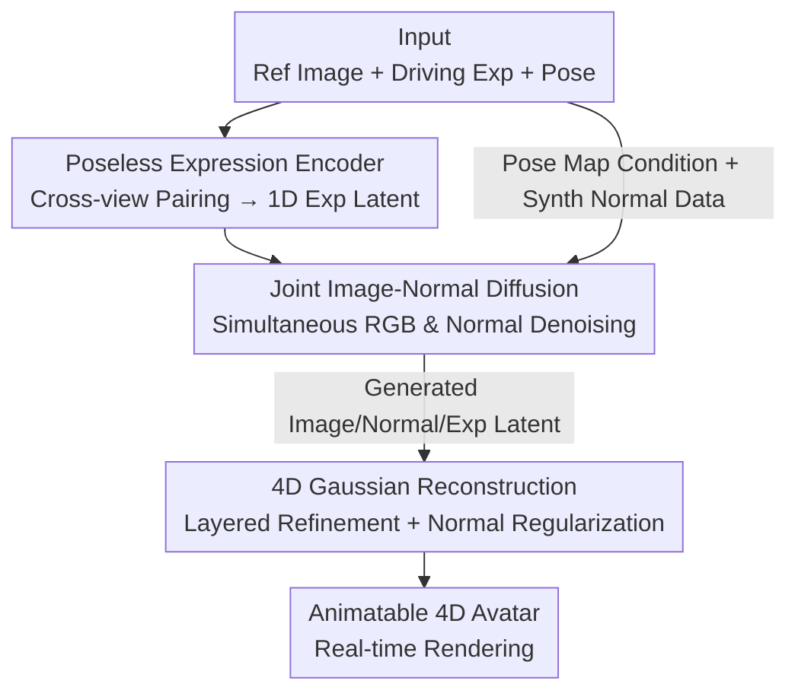

# GeoDiff4D: Geometry-Aware Diffusion for 4D Head Avatar Reconstruction

**Conference**: CVPR 2026  
**Paper**: [CVF Open Access](https://openaccess.thecvf.com/content/CVPR2026/html/Xu_GeoDiff4D_Geometry-Aware_Diffusion_for_4D_Head_Avatar_Reconstruction_CVPR_2026_paper.html)  
**Code**: Project Page https://lyxcc127.github.io/geodiff4d/ (No official repository found)  
**Area**: 3D Vision / Diffusion Models  
**Keywords**: 4D Head Avatar Reconstruction, Geometry-Aware Diffusion, Surface Normals, 3D Gaussian Splatting, Single-image Driven

## TL;DR
Starting from a single portrait, GeoDiff4D enables a diffusion model to jointly generate portrait frames and corresponding surface normals. These "Images + Normals + Expression Latents" are then fed into a 3D Gaussian reconstruction to distill the implicit 3D geometric priors from the diffusion model into an animatable 4D avatar. This approach significantly outperforms existing methods in identity preservation, expression recovery, and cross-view consistency.

## Background & Motivation
**Background**: Reconstructing animatable and expressive 4D head avatars from a single portrait is a core problem in the digital human field. Recent mainstream approaches leverage diffusion models for either direct 2D portrait animation (good for identity and expression transfer) or by feeding diffusion-generated portraits into an optimized 3D Gaussian Splatting (3DGS) avatar.

**Limitations of Prior Work**: Pure 2D methods lack 3D consistency, with quality collapsing upon viewpoint changes. Methods introducing explicit 3D representations often sacrifice identity preservation and subtle expressions. Two-stage approaches combining diffusion and 3DGS also face three persistent issues: (1) expression control relies on landmarks/implicit motion/3DMM parameters, making it difficult to balance 3D consistency and expressiveness; (2) diffusion models only learn 2D priors like pixel-level correspondences without capturing underlying 3D geometry; (3) the reconstruction stage only uses diffusion-generated RGB images for supervision, resulting in a weak link between stages that fails to fully distill knowledge from the diffusion model.

**Key Challenge**: Diffusion models excel at generating realistic appearances (strong 2D priors), but RGB pixels contain almost no reliable 3D geometric signals. Conversely, high-quality 4D reconstruction relies heavily on these geometric constraints. Relying solely on RGB information for transfer between the two stages leads to a loss of geometric information in transition.

**Goal**: To make the diffusion model "geometry-aware" and transfer this geometric prior entirely to the downstream 3DGS reconstruction. Specifically: expression representations must be both expressive and cross-view consistent; diffusion generation should include geometric cues; and reconstruction supervision should utilize geometric signals.

**Key Insight**: Surface normals naturally encode 3D geometry (wrinkles, hair flow) not found in RGB. If the diffusion model is tasked to jointly generate normals along with RGB, it is forced to model their joint distribution, becoming geometry-aware. These generated normals can then serve as strong supervision for the reconstruction stage, bridging the geometric gap between the two phases.

**Core Idea**: Use "joint image-normal diffusion + poseless expression encoding + normal-supervised 3DGS" to distill geometric priors from diffusion into a 4D avatar, rather than just transferring 2D appearance.

## Method

### Overall Architecture
GeoDiff4D takes a reference image, a driving expression, and target head poses as input to output a real-time renderable and controllable 4D avatar. The pipeline consists of three components: first, a **poseless expression encoder** compresses the driving frames into 1D expression latents that are decoupled from head pose and cross-view consistent. Second, a **joint image-normal diffusion** model, conditioned on reference identity features and expression latents, simultaneously denoises a sequence of portrait frames and their corresponding surface normals. Finally, the generated images, normals, and expression latents are fed into **4D Gaussian Reconstruction**. Here, 3D Gaussians rigged to a FLAME mesh are optimized under dual RGB and normal supervision. The crucial link is that normals make the diffusion geometry-aware while providing geometric supervision back to the reconstruction.

### Key Designs

**1. Poseless Expression Encoder: Decoupling expression from pose and identity with cross-view consistency**

**Design Motivation**: To address the difficulty of balancing 3D consistency and expressiveness. Following X-NeMo's implicit expression representation, an encoder $E_{mot}$ compresses a single frame into a low-dimensional latent variable $f_{mot}$, discarding spatial appearance to encourage decoupling from identity. Unlike previous methods that pack pose and expression into one latent, head pose is handled via explicit pose maps (see Design 2), leaving the latent to focus solely on expression.

True "cross-view consistency" is achieved via **cross-view pair training**: for the same identity and timestamp, frames are sampled from different views to form a pair (identical expression, different poses). This forces the encoder to strip pose and identity leakage, retaining only expression features to learn a view-invariant representation. The encoder is trained end-to-end with the diffusion model, supervised only by the denoising loss. Further spatial and pixel-level augmentations on cropped driving faces reduce sensitivity to spatial layouts. Ablations show that removing cross-view pairing leads to the largest performance drop, identifying it as the key source of consistency.

**2. Geometry-Aware Joint Image-Normal Diffusion: Learning geometry during appearance generation**

**Design Motivation**: To address the lack of 3D geometric awareness in 2D diffusion priors. Building on the X-NeMo UNet framework, the denoising target is expanded from RGB to a joint generation of RGB + surface normals, modeling:

$$P(I_{rgb}, I_{norm} \mid I_{ref}, M_{ref}, I_{exp}, M_{drv})$$

The reference image $I_{ref}$ is processed by a reference network to extract identity features $F_{ref}$, while the driving frame yields $F_{exp}$ via the expression encoder. Diffusion simultaneously denoises latent variables $Z_{rgb}$ and $Z_{norm}$. In implementation, target video and normal video latents (shaped $[B \times D \times C \times T \times H \times W]$) are concatenated along the domain dimension $D$. Both domains receive **identical noise** at each step, distinguished by a class label. To ensure interaction, standard 2D self-attention is replaced with **3D Domain-Spatial attention**: convolutions treat the domain dimension as part of the batch $[(B \times D) \, C \times T \times H \times W]$ to maintain independence, while attention is performed on the concatenated domains $[B \times C \times T \times H \times (2W)]$ to allow controlled cross-domain exchange.

To support explicit pose, **pose maps** $M_{tar}$ (normal maps representing only pose) are introduced by rasterizing FLAME mesh normals while setting expression parameters to zero. Finally, to mitigate the issues of low-quality pseudo-normals in real data, the SynthHuman dataset is used. Weighted random sampling ensures multi-view data is sampled ~10x more frequently than synthetic data to balance diversity and reliability.

**3. 4D Gaussian Reconstruction: Layered refinement and normal regularization for geometric transfer**

**Design Motivation**: To ensure geometric information from diffusion is actually applied during reconstruction. Based on GaussianAvatars, 3D Gaussians are bound to FLAME mesh triangles. First, multi-view portraits from diffusion are treated as monocular inputs to estimate initial FLAME parameters via Pixel3DMM. Since monocular tracking is imprecise, **hierarchical refinement** is used: learnable residuals correct tracking errors; a U-Net predicts per-vertex deformations on a remeshed head; and light-weight MLPs predict Gaussian attribute residuals to capture expression-dependent dynamics.

**Normal regularization** uses generated normals as geometric supervision. Following GaussianShader, the shortest axis of each Gaussian primitive is taken as its normal $\hat n$. L1 supervision is applied to the rendered normals in foreground regions:

$$L_n = \lambda_n L_1(\hat n,\ \alpha n)$$

where $\hat n$ and $n$ are predicted and pseudo-ground truth normals, and $\alpha$ is a foreground mask. This step ensures that the geometric priors learned by the diffusion model translate into smoother, more accurate geometry in the final rendering.

### Loss & Training
The diffusion model is trained on a combination of multi-view and synthetic datasets at $512 \times 512$ resolution. Training occurs in two stages: Stage 1 excludes temporal modules (batch size 32); Stage 2 introduces 16-frame sequences for temporal learning (batch size 8). Both use AdamW with a learning rate of $1\mathrm{e}{-5}$ for 80K and 20K steps, respectively, taking roughly 3–4 days on 4x A800 GPUs. The expression encoder is supervised end-to-end by the diffusion loss. The reconstruction stage follows GaussianAvatars training with $L_n$ as additional supervision. Inference involves generating ~200 frames across ~12 views (1 hour on H100) and 100K reconstruction steps (3 hours on RTX 3090).

## Key Experimental Results

### Main Results
Evaluated on NeRSemblev2 for self-reenactment (10 unseen subjects) and a mix of NeRSemblev2 and in-the-wild data for cross-reenactment. **VGM** refers to direct results from the video generation model, while **GeoDiff4D** refers to the reconstructed 4D avatar.

| Method | Self PSNR↑ | Self SSIM↑ | Self LPIPS↓ | Self CSIM↑ | Self JOD↑ | Cross CSIM↑ | Cross JOD↑ |
|------|-----------|-----------|------------|-----------|----------|-------------|-----------|
| GAGAvatar | 17.550 | 0.789 | 0.229 | 0.714 | 6.244 | 0.588 | 5.081 |
| Portrait4D-v2 | 13.689 | 0.701 | 0.310 | 0.702 | 4.933 | 0.608 | 4.656 |
| LAM | 16.354 | 0.759 | 0.251 | 0.608 | 5.772 | 0.516 | 5.079 |
| CAP4D | 19.295 | 0.811 | 0.195 | 0.719 | 6.561 | 0.655 | 5.064 |
| **Our VGM** | **21.586** | **0.831** | **0.174** | **0.754** | **7.127** | **0.671** | 5.066 |
| GeoDiff4D | 19.951 | 0.822 | 0.195 | 0.721 | 6.720 | 0.656 | **5.178** |

VGM achieves SOTA across most quality metrics. GeoDiff4D (the reconstructed avatar) ranks second in most metrics and outperforms all baselines, achieving the highest Cross JOD. Visual quality is significantly better than baselines in extreme poses and exaggerated expressions.

### Ablation Study
Decomposition of components on the NeRSemblev2 self-reenactment set (Upper: VGM; Lower: Reconstruction):

| Module | Configuration | PSNR↑ | CSIM↑ | JOD↑ | AKD↓ | AED↓ |
|------|------|-------|-------|------|------|------|
| VGM | w/o Joint Repr. | 20.809 | 0.757 | 6.960 | 4.216 | 2.489 |
| VGM | w/o Domain Attn. | 20.984 | 0.743 | 7.029 | 4.195 | 2.556 |
| VGM | w/o Cross-view Pairing | 19.895 | 0.734 | 6.859 | 5.367 | 3.113 |
| VGM | w/o Synth Data | 20.892 | 0.743 | 6.978 | 4.339 | 2.527 |
| VGM | **Full** | **21.586** | 0.754 | **7.127** | **4.016** | **2.340** |
| Recon | w/o Hier. Refinement | 19.816 | 0.736 | 6.758 | 4.227 | 2.603 |
| Recon | w/o Normal Reg. | 19.950 | 0.734 | 6.774 | 4.291 | 2.713 |
| Recon | w/ DAViD Normals | 19.947 | 0.736 | 6.782 | 4.247 | 2.553 |
| Recon | **Full** | 19.953 | 0.737 | 6.780 | 4.248 | 2.563 |

### Key Findings
- **Cross-view pairing is the most critical component in VGM**: Its removal causes the most significant performance drop, proving that multi-view geometric constraints are vital for identity and expression accuracy.
- **Joint representation and domain attention support geometric awareness**: Removing either leads to consistency drops. Synthetic data primarily aids identity diversity and generalization.
- **Quantitative differences in reconstruction ablations are small** (PSNR 19.8–20.0), but qualitative results show fewer artifacts and better stability in the full model. Diffusion-generated normals provide finer facial details compared to monocular estimators like DAViD.

## Highlights & Insights
- **"Joint Normal Generation" embeds geometric priors into diffusion**: This self-supervised approach forces 2D diffusion to model 3D geometry distributions, a concept transferable to other "generation + reconstruction" tasks.
- **Normals serve as both output and supervision**: Generating normals makes the diffusion model geometry-aware, while using them as 3DGS supervision ensures smooth, aligned information flow between stages.
- **Domain-Spatial attention's "Conv for independence, Attn for exchange"**: Concatenating domains for attention while keeping them independent during convolution is a practical trick for controlling information leakage in multi-modal diffusion.
- **Pose maps = Expression-zeroed normal maps**: Using pose-only normal maps as explicit pose conditions decouples pose and reuses the normal representation, making the design self-consistent.

## Limitations & Future Work
- The reliance on monocular 3DMM tracking for pose estimation remains an ill-posed problem. Although VGM supports tongue movement, the final avatar cannot accurately reconstruct the tongue due to FLAME limitations. High sampling latency (e.g., 1 hour for video synthesis) limits real-time deployment.
- Note: While "real-time rendering" is claimed, this refers to the 3DGS rendering stage; the generation stage is significantly slower.
- Quantitative gains from normal regularization are modest, suggesting a need for metrics that better reflect geometric quality.
- The pipeline's complexity (multiple stages and encoders) suggests that end-to-end simplification is a potential future direction.

## Related Work & Insights
- **vs Portrait4D-v2 / X-NeMo (2D Portrait Animation)**: While these preserve identity and transfer expressions well, they lack 3D consistency. Ours utilizes joint normal diffusion + 3DGS to ensure stability across views and extreme poses.
- **vs GAGAvatar / LAM (Generalizable 3D Frameworks)**: These rely on 3DMM parameters, ensuring geometric consistency but limiting subtle expressions. Ours uses implicit expression latents and cross-view pairing to balance expressiveness and consistency.
- **vs CAP4D (Diffusion + 3DGS Two-stage)**: Like CAP4D, we use diffusion to generate portraits for Gaussian optimization, but CAP4D lacks geometric supervision. Ours distills geometric priors through joint normal generation and supervision, achieving superior visual quality.

## Rating
- Novelty: ⭐⭐⭐⭐⭐ First video diffusion to jointly generate portrait frames and surface normals, injecting geometric priors into the diffusion-to-reconstruction pipeline.
- Experimental Thoroughness: ⭐⭐⭐⭐ Extensive reenactment tests and ablations, though reconstruction-side quantitative differences are small.
- Writing Quality: ⭐⭐⭐⭐ Clear structure and logical progression; minor ambiguity in some notation (normal regularization).
- Value: ⭐⭐⭐⭐⭐ High potential for digital humans and virtual meetings, leading in identity preservation, expression, and cross-view stability.

<!-- RELATED:START -->

## Related Papers

- [\[CVPR 2026\] EmoDiffTalk: Emotion-aware Diffusion for Editable 3D Gaussian Talking Head](emodifftalk_emotion-aware_diffusion_for_editable_3d_gaussian_talking_head.md)
- [\[CVPR 2026\] OMG-Avatar: One-shot Multi-LOD Gaussian Head Avatar](omg-avatar_one-shot_multi-lod_gaussian_head_avatar.md)
- [\[CVPR 2026\] UIKA: Fast Universal Head Avatar from Pose-Free Images](uika_fast_universal_head_avatar_from_pose-free_images.md)
- [\[CVPR 2026\] Feed-forward Gaussian Registration for Head Avatar Creation and Editing](feed-forward_gaussian_registration_for_head_avatar_creation_and_editing.md)
- [\[CVPR 2026\] MotionCrafter: Dense Geometry and Motion Reconstruction with a 4D VAE](motioncrafter_dense_geometry_and_motion_reconstruction_with_a_4d_vae.md)

<!-- RELATED:END -->
