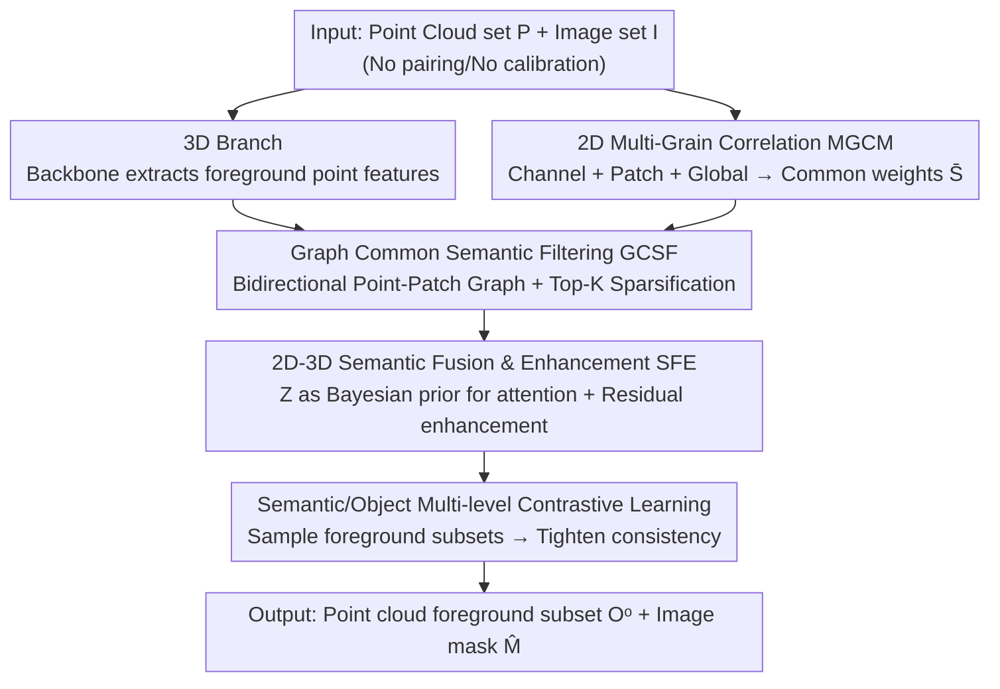

# GeoFree-CoSeg: Unsupervised Point Cloud-Image Cross-Modal Co-Segmentation Without Geometric Alignment

**Conference**: CVPR 2026  
**Paper**: [CVF Open Access](https://openaccess.thecvf.com/content/CVPR2026/html/Duan_GeoFree-CoSeg_Unsupervised_Point_Cloud-Image_Cross-Modal_Co-Segmentation_Without_Geometric_Alignment_CVPR_2026_paper.html)  
**Code**: Not disclosed  
**Area**: 3D Vision  
**Keywords**: Cross-modal co-segmentation, point cloud-image, unsupervised, semantic consistency, graph sparsification  

## TL;DR
GeoFree-CoSeg proposes a new task: "Unsupervised Point Cloud-Image Cross-Modal Co-Segmentation." Using a coarse-to-fine dual-branch framework, the method extracts coarse-grained common semantics from each modality, purifies them via cross-modal semantic graphs into Top-K point-patch correspondences, and finally achieves mutual enhancement. Without **any geometric alignment or segmentation annotations**, it significantly improves unsupervised SOTA performance on two standard point cloud benchmarks and two new image datasets (e.g., 3D mean IoU on S3DIS is 6 points higher than LogoSP).

## Background & Motivation
**Background**: Co-segmentation aims to identify and segment recurring "common objects" (such as "chairs" appearing across multiple scenes) within a set of point clouds or images without knowing category names. It is a class-agnostic setting useful for object retrieval, novel category discovery, and 3D missing part detection. Existing works are almost entirely **unimodal**: they operate either solely in 3D point clouds (Yang [45]) or in 2D images.

**Limitations of Prior Work**: Unimodal semantic cues are often too weak. Point clouds have irregular structures and are extremely expensive to annotate; identifying common objects in 3D alone is difficult and often relies on ground-truth masks for stability. Conversely, 2D images lack geometric information. Another line of research—unsupervised 3D semantic segmentation (e.g., GrowSP [51], LogoSP [52])—leverages 2D images to enhance 3D analysis, but **relies on geometric alignment**. This requires camera parameters to strictly calibrate 2D pixels with 3D points, which is both costly and limits available 2D datasets to those already paired and calibrated with point clouds.

**Key Challenge**: To use 2D to assist 3D, traditional approaches are bound to "pixel-point geometric correspondence." However, in many real-world scenarios, two modalities may share **semantics** (both contain chairs) but not **geometry** (they are not of the same chair captured at the same time by the same camera). Locking cross-modal information flow to geometric alignment prevents the utilization of massive amounts of "semantically related but geometrically independent" images.

**Goal**: Define and solve a novel task—given a set of point clouds $P=\{P_i\}$ and a set of images $I=\{I_i\}$ (containing common objects of the same unknown categories but with **no pairing or calibration relationship**), simultaneously estimate a foreground subset $O_i^o \subset P_i$ for each point cloud and a mask $\hat{M}_i$ for each image, without annotations or geometric alignment throughout the process.

**Key Insight**: The authors argue that cross-modal commonality should be established at the **semantic level** rather than the **feature alignment level**. As long as both modalities represent "chairs," they can complement each other without point-by-point correspondence.

**Core Idea**: Replace "geometric alignment" with "semantic consistency" and establish cross-modal correspondence in a **coarse-to-fine** manner. First, extract coarse semantics independently; then, use a sparsified point-patch association graph to select the most relevant correspondences as a prior; finally, perform bidirectional fusion for mutual enhancement.

## Method

### Overall Architecture
GeoFree-CoSeg is a framework comprising parallel 3D and 2D branches with cross-modal coupling. The 3D branch feeds each point cloud into a backbone with mutual correlation to obtain foreground/background point features $F^{3D}_f, F^{3D}_b$ (modeling co-segmentation as a "foreground point sampling" problem). The 2D branch uses a DINO-pretrained ViT to extract patch features $F^{2D}$. After projecting these features into a **shared semantic space**, the pipeline follows three stages:

1.  **Coarse Semantics**: The 2D Multi-Grain Correlation Module (MGCM) extracts 2D common semantic weights $\bar{S}_i$ across channel, patch, and global granularities, simultaneously producing image masks $\hat{M}_i$. The 3D branch provides coarse foreground features.
2.  **Purification**: The Graph-based Common Semantic Filtering (GCSF) constructs a bidirectional point-patch association graph from the coarse features of both sides. KNN sparsification is applied to retain only the Top-K most relevant correspondences, yielding fine-grained association matrices $Z^{P\to I}, Z^{I\to P}$.
3.  **Fusion & Enhancement**: The 2D-3D Semantic Fusion and Enhancement (SFE) uses $Z$ as a Bayesian prior to correct attention scores. After bidirectional fusion, residual blocks provide mutual enhancement. Foreground/background subsets are then sampled, and two cross-modal contrastive losses are applied to tighten "semantic-level" and "object-level" consistency.

The correspondence is determined by "semantic similarity + graph prior," using **no camera parameters or point-pixel geometric correspondence**, which is the origin of the name "GeoFree."

### Key Designs

**1. 2D Multi-Grain Correlation Modeling (MGCM): Addressing semantic ambiguity in single images by identifying common object patches across three granularities.**

To address the high semantic ambiguity in unimodal image co-segmentation, MGCM goes beyond patch-level correlation by using a **channel-patch-global** progression. First, channel interaction is performed via FFN to aggregate information across channels: $F^{2D}_{i,c}=F^{2D}_i+\mathrm{FFN}_1(N(F^{2D}_i))$. Next, self-attention calculates cross-image patch-to-patch correlations $S=\frac{1}{\sqrt d}\phi_q(F^{2D}_c)\otimes\phi_k(F^{2D}_c)^\top$ to identify recurring patches. Finally, the DINO CLS token $Z$ is introduced as a **global semantic anchor** to inject coarse global correlation: $\hat{S}=S+\lambda\cdot\frac{1}{\sqrt d}Z\phi_k(F^{2D}_c)^\top$ (where $\lambda=0.2$). Taking the row mean of $\hat{S}$ followed by a Sigmoid yields the mask $\hat{M}_i$, while Softmax normalization produces common semantic weights $\bar{S}_i$ to guide the cross-modal stage. Ablations show the triple-grain approach outperforms patch-only correlation by 5% P / 14% J (Table 7).

**2. Graph-based Common Semantic Filtering (GCSF): Using Top-K sparsification to remove background noise from coarse semantics and retain only the strongest cross-modal correspondences.**

After obtaining coarse 3D point features and 2D patch features, both are projected into a shared semantic space to obtain $\hat{F}^{3D}_{f,i}$ and $\hat{F}^{2D}_i$. Patch embeddings are concatenated with their semantic weights $\bar{S}_i$ and refined via $1\times1$ convolution: $\tilde{F}^{2D}_i=\mathrm{Conv}(\mathrm{CAT}[\hat{F}^{2D}_i,\bar{S}_i])$. Point-patch similarities $S^{P\to I}=\|\hat{F}^{3D}_{f,i}\|\otimes\|\tilde{F}^{2D}_i\|^\top$ (after L2 normalization) and $S^{I\to P}$ form bidirectional graphs $G^{P\to I}, G^{I\to P}$. The key step is **KNN sparsification**: for each point, only its Top-K most relevant patches are retained: $c^{P\to I}_m=\arg\mathrm{topk}(S^{P\to I}_m)$. To avoid losing weak but useful semantics, discarded edges are replaced with a small constant to form a "soft mask" before Softmax: $Z^{P\to I}=\mathrm{Softmax}(M^{P\to I}\odot S^{P\to I})$. $K=20$ is found to be optimal; complex scenes (S3DIS) are more sensitive to $K$ than object-centric data (ScanObjectNN). This sparsification enables the "geometry-free" approach to succeed by relying on similarity-based selection rather than calibration.

**3. 2D-3D Semantic Fusion and Enhancement (SFE): Treating fine-grained correspondences as Bayesian priors to allow modalities to "borrow semantics" from each other.**

SFE integrates then enhances. During fusion, point embeddings $\hat{F}^{3D}_{f,i}$ serve as queries and patch embeddings as keys/values for multi-head attention $A^{P\to I}=\frac{1}{\sqrt d}\hat{F}^{3D}_{f,i}\otimes(\hat{F}^{2D}_i)^\top$, measuring the likelihood of each point-patch correspondence. The authors apply the **Bayesian principle** (Posterior ∝ Likelihood × Prior), using the GCSF-derived $Z^{P\to I}$ as a prior to correct the likelihood:

$$\tilde{A}^{P\to I}_{i,j}=\mathrm{Softmax}\big(A^{P\to I}_{i,j}+\alpha Z^{P\to I}_{i,j}\big)=\frac{\exp(A^{P\to I}_{i,j})\exp(\alpha Z^{P\to I}_{i,j})}{\sum_k \exp(A^{P\to I}_{i,k})\exp(\alpha Z^{P\to I}_{i,k})}$$

The result $\tilde{A}^{P\to I}_{i,j}$ is a posterior where semantic similarity is weighted by common semantic priors. Fused features are obtained through residual connections: $F^{P\to I}=\mathrm{FFN}_2(\phi_p(\hat{A}^{P\to I})+\hat{F}^{3D}_{f,i})$. In the enhancement stage, to preserve unimodal characteristics, fused features are added back via residuals: $\tilde{F}^{3D}_{f,i}=\mathrm{MLP}_1(F^{3D}_{f,i}+\lambda_P F^{P\to I})$ and $\tilde{F}^{2D}_{c,i}=\mathrm{MLP}_2(F^{2D}_i+\lambda_I F^{I\to P})$ ($\lambda_P=\lambda_I=0.5$). This allows 3D to borrow strong 2D semantics and 2D to borrow 3D structural cues.

**4. Semantic and Object-Level Dual Contrastive Learning: Using two NT-Xent losses to enforce modal alignment.**

The fused point features $\tilde{F}^{3D}_{f,i}$ sample a simplified foreground subset $\hat{O}^o_i$, encoded into $\hat{X}^o_i$ by a feature extractor. Background $\hat{X}^b_i$ and the projected features $X^o_i, X^b_i$ (mapped back to the original point cloud) are also obtained. **Semantic-level consistency** uses NT-Xent to pull $\hat{X}^o_i$ closer to the 2D global semantic prototype $\bar{F}^{2D}_{i,s}$ while pushing away the background $\hat{X}^b_i$. **Object-level consistency** pulls $X^o_i$ toward the 2D object prototype $\bar{F}^{2D}_{i,o}$ (derived via GAP on $\hat{F}^{2D}_i$) and away from $X^b_i$. The loss follows $L_{sem}=\frac{1}{N}\sum_i -\log\frac{\exp(\hat{s}^+_i/\tau)}{\exp(\hat{s}^+_i/\tau)+\sum_k\exp(\hat{s}^-_i/\tau)}$. These two levels are complementary, managing general concepts and specific objects respectively.

### Loss & Training
Total loss: $L=L_{sem}+L_{obj}+L_p+L_s$, where $L_p$ is the unsupervised point cloud co-segmentation loss from Yang [45] and $L_s$ is the image loss from SCoSPARC [4]. A three-stage training strategy is used: first, pre-train the 2D branch (Adam, lr $=10^{-4}$); then, train the 3D branch (lr $=10^{-3}$) and fine-tune the 2D branch with a minimal lr $=10^{-6}$. Backbones include PointNet (from SampleNet) and a frozen DGCNN feature extractor. 2D uses ViT-B/DINO with patch size 8.

## Key Experimental Results

### Main Results
The 3D branch is evaluated on S3DIS and ScanObjectNN (XYZ only) using mIoU. The 2D branch is evaluated on two new datasets (S3DIS-Coseg, ScanObjectNN-Coseg) using Precision (P) and Jaccard (J). As this is the first cross-modal co-segmentation task, the authors compare against SOTA unimodal methods.

| Dataset (Branch) | Metric | Ours | Prev. SOTA | Gain |
| :--- | :--- | :--- | :--- | :--- |
| S3DIS (3D, Mean of 5) | mIoU | 0.54 | 0.48 (LogoSP) | +6 pts |
| S3DIS (3D) | mIoU | 0.54 | 0.46 (Yang) | +8 pts (bookcase +15, door +12) |
| ScanObjectNN (3D, Mean of 15) | mIoU | 0.63 | 0.60 (LogoSP) | +3 pts |
| S3DIS-Coseg (2D) | P / J | 0.83 / 0.59 | 0.74 / 0.38 (SCoSPARC) | +9 P / +21 J |
| ScanObjectNN-Coseg (2D) | P / J | 0.78 / 0.53 | 0.75 / 0.48 (SCoSPARC) | +3 P / +5 J |

Notably, LogoSP also utilizes 2D features from DINOv2 but requires geometric alignment. GeoFree-CoSeg achieves higher performance without alignment, validating the "semantic consistency" approach.

### Ablation Study

**Module Ablation (S3DIS / S3DIS-Coseg, Table 6)**

| Configuration | mIoU | P | J | Note |
| :--- | :--- | :--- | :--- | :--- |
| Baseline (2D+3D basic) | 0.46 | 0.76 | 0.39 | Lower bound |
| + MGCM | 0.48 | 0.80 | 0.53 | 2D Multi-grain correlation |
| + MGCM + GCSF | 0.51 | 0.82 | 0.57 | Graph sparsification |
| Full (+ SFE) | 0.54 | 0.83 | 0.59 | +8 3D mIoU, +20 2D J over baseline |

**Loss Ablation (Table 3)**

| Configuration | mIoU | P | J |
| :--- | :--- | :--- | :--- |
| $L_{sem}$ only | 0.49 | 0.80 | 0.54 |
| $L_{obj}$ only | 0.51 | 0.81 | 0.57 |
| $L_{sem}+L_{obj}$ | 0.54 | 0.83 | 0.59 |

### Key Findings
- **Coarse-to-fine progression is valid**: Performance improves incrementally from MGCM to GCSF to SFE. Qualitative results (Fig. 5) show segmentation boundaries becoming significantly cleaner.
- **KNN sparsification $K$ is sensitive**: Too small $K$ restricts interaction, while too large $K$ introduces noise. $K=20$ is optimal, with complex scenes being more sensitive.
- **Significant 2D improvement in Jaccard**: Jaccard indices on S3DIS-Coseg increased by 21 points, proving 3D structural semantics significantly improve 2D segment quality.
- **Dual-level contrastive learning is essential**: Both semantic and object-level losses are necessary for optimal performance.

## Highlights & Insights
- **Replacing alignment with consistency is the key breakthrough**: Decoupling cross-modal flow from geometric point-pixel mapping allows any semantically related 2D images to assist 3D tasks. This has broad potential for 3D detection and retrieval in data-scarce scenarios.
- **Elegant Bayesian Prior Injection**: Treating the association graph as a prior and attention as likelihood ($Posterior \propto Likelihood \times Prior$) is a mathematically sound and interpretable way to regularize attention with structural priors.
- **Soft Masking for Robustness**: Using a small constant for removed edges instead of zeroing them out avoids "killing" useful weak semantic signals, aiding recall.
- **Dataset Contribution**: The creation of S3DIS-Coseg and ScanObjectNN-Coseg provides necessary benchmarks for future cross-modal co-segmentation research.

## Limitations & Future Work
- **Reliance on XYZ and Indoor Data**: Experiments were limited to indoor scenes using only spatial coordinates. Performance on outdoor/large-scale scenes or point clouds with color/normals is unverified.
- **Lack of External Baselines**: As the first of its kind, comparisons were made against modified versions of other tasks, rather than direct competitors.
- **Backbone Dependency**: Semantic extraction relies heavily on DINO and frozen DGCNN architectures; performance might degrade if target domain distributions shift significantly from the pre-training data.
- **Manual $K$ Selection**: $K$ may need scene-specific tuning. Future work could investigate adaptive $K$ selection or open-vocabulary extensions.

## Related Work & Insights
- **vs. Yang [45] (Point Cloud Co-Seg)**: Yang is unimodal and limited by point cloud sparsity. This work adopts its sampling framework but adds 2D semantics, leading to a +8 mIoU gain on S3DIS.
- **vs. LogoSP [52] / GrowSP [51] (Unsupervised 3D Semantic Seg)**: These rely on **geometric alignment**, restricting data usage. Ours achieves higher mIoU (+6 on S3DIS) without alignment.
- **vs. SCoSPARC [4] (Image Co-Seg)**: Pure 2D methods lack 3D structural cues. By using 3D common semantics to enhance images, this work improves 2D Jaccard by 21 points.
- **vs. 2DPASS / VeXKD (2D-3D Distillation)**: These require calibrated pairs; this is the first framework to enable cross-modal transfer sharing only semantics.

## Rating
- Novelty: ⭐⭐⭐⭐⭐ First to define and solve "geometry-free cross-modal co-segmentation."
- Experimental Thoroughness: ⭐⭐⭐⭐ Solid multi-dataset and multi-dimensional ablation, though limited to indoor XYZ data.
- Writing Quality: ⭐⭐⭐⭐ Clear coarse-to-fine logic; Bayesian explanation is strong.
- Value: ⭐⭐⭐⭐ Unlocks the paradigm of "any 2D image assisting 3D."

<!-- RELATED:START -->

## Related Papers

- [\[CVPR 2026\] Geometry-Aware Cross-Modal Graph Alignment for Referring Segmentation in 3D Gaussian Splatting](geometry-aware_cross-modal_graph_alignment_for_referring_segmentation_in_3d_gaus.md)
- [\[CVPR 2026\] CMHANet: A Cross-Modal Hybrid Attention Network for Point Cloud Registration](cmhanet_a_cross-modal_hybrid_attention_network_for_point_cloud_registration.md)
- [\[CVPR 2026\] Geometric-Aware Hypergraph Reasoning for Novel Class Discovery in Point Cloud Segmentation](geometric-aware_hypergraph_reasoning_for_novel_class_discovery_in_point_cloud_se.md)
- [\[CVPR 2026\] JRM: Joint Reconstruction Model for Multiple Objects without Alignment](jrm_joint_reconstruction_model_for_multiple_objects_without_alignment.md)
- [\[CVPR 2026\] Bidirectional Cross-Modal Prompting for Event-Frame Asymmetric Stereo](bidirectional_cross-modal_prompting_for_event-frame_asymmetric_stereo.md)

<!-- RELATED:END -->
