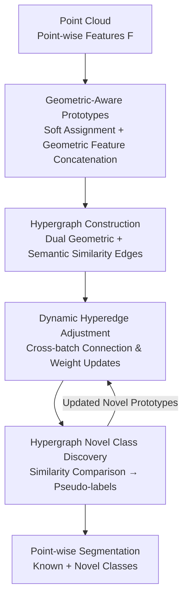

# Geometric-Aware Hypergraph Reasoning for Novel Class Discovery in Point Cloud Segmentation

**Conference**: CVPR 2026  
**Paper**: [CVF Open Access](https://openaccess.thecvf.com/content/CVPR2026/html/Zhang_Geometric-Aware_Hypergraph_Reasoning_for_Novel_Class_Discovery_in_Point_Cloud_CVPR_2026_paper.html)  
**Code**: https://github.com/2490o/HyperNCD  
**Area**: 3D Vision  
**Keywords**: Point cloud segmentation, Novel Class Discovery, Hypergraph reasoning, Geometric-aware prototypes, Open-world  

## TL;DR
High-order relationships where "a novel class simultaneously associates with multiple known class prototypes" are modeled using hypergraphs. By augmenting each prototype with geometric structural features, the model collaboratively infers semantics for unseen point cloud classes (e.g., bed) based on known classes (e.g., chair/sofa/table), leading to a significant lead in novel class mIoU on SemanticKITTI and SemanticPOSS.

## Background & Motivation
**Background**: Point cloud semantic segmentation is highly valuable in autonomous driving and robotics. However, most methods assume all classes are known during training, failing in open-world scenarios when unlabeled novel classes appear. The task of Novel Class Discovery in Point Cloud Segmentation (NCD), proposed by Riz et al., aims to address this by automatically segmenting unlabeled novel classes using geometric and semantic knowledge from known classes.

**Limitations of Prior Work**: Existing methods (NOPS based on online clustering + uncertainty estimation; DASL based on regional consistency + semi-relaxed optimal transport) rely on **binary relations** for category association and label assignment—either point-to-point, point-to-region, or pairwise class-to-class similarity. This implies a novel class can only link to the "one or two most similar" known classes, failing to utilize information from multiple known classes simultaneously.

**Key Challenge**: The semantics of novel classes are often "combinations" of multiple known classes (e.g., a "bed" lies between a "chair," "sofa," and "table"). Binary relations naturally cannot express such "one-to-many" high-order associations. Furthermore, existing methods focus excessively on semantic features, largely ignoring the essential 3D geometric structure of point clouds (curvature, planarity, linearity), resulting in inaccurate segmentation of novel class boundaries and small objects.

**Goal**: (1) Use a structure that connects multiple known class prototypes simultaneously to model high-order novel-to-known associations; (2) Inject geometric spatial structures into prototypes to compensate for the deficiencies of pure semantic features.

**Key Insight**: A hyperedge in a hypergraph can connect multiple nodes simultaneously, unlike ordinary graphs that only connect two points. This precisely matches the requirement of "a novel class prototype associating with multiple known class prototypes."

**Core Idea**: Utilize **geometric-aware prototypes** as hypergraph nodes and connect them into hyperedges using **dual geometric + semantic similarity**. This allows multiple known class prototypes to collaboratively infer novel classes within a hyperedge, with dynamic adjustments to hyperedges during training to handle novel class emergence and category imbalance.

## Method

### Overall Architecture
The proposed method is named Geometric-Aware Hypergraph Reasoning (HyperNCD). The input is a point cloud frame, and the output is point-wise segmentation containing both known and novel classes. The pipeline consists of: backbone network for point-wise feature extraction $\rightarrow$ soft assignment to cluster points into geometric-aware prototypes (one prototype per class as a hypergraph node) $\rightarrow$ hyperedge construction using dual similarity to form the prototype hypergraph for the batch $\rightarrow$ dynamic adjustment of hyperedge weights and connections across batches $\rightarrow$ similarity comparison of novel prototypes on the hypergraph to generate pseudo-labels for class discovery. The geometric information in prototypes, high-order associations in hyperedges, and the dynamic mechanism are the three core contributions.

### Key Designs

**1. Geometric-Aware Prototypes: Augmenting Prototypes with 3D Structural Information**

Addressing the pain point that "existing methods capture semantics but lose geometry," the authors ensure each prototype carries both semantic and geometric features. Given the backbone feature map $F \in \mathbb{R}^{N \times P \times C}$ (N: batch, P: points, C: channels), it is reshaped to $F_{flat} \in \mathbb{R}^{N \cdot P \times C}$. A 1D convolution maps it to $K$ clusters (where K is the number of classes) to obtain $\sigma = \text{Conv1d}(F_{flat})$. A softmax along the K dimension yields the soft assignment matrix $S_p = \text{softmax}(\sigma)$, where $s_{i,k}$ is the weight of the $i$-th point assigned to the $k$-th prototype.

Each point's feature is a concatenation of semantic and geometric parts: $F_i = [f_{sem}(x_i); f_{geo}(x_i)]$. The geometric feature $f_{geo}(x_i)$ is calculated by: first using KNN ($K=15$) to obtain the local neighborhood $N(x_i)$, then calculating eigenvalues of the Euclidean distance covariance matrix of neighborhood points to extract Linearity, Planarity, and Scattering clues that characterize **local curvature**. Semantic features $f_{sem}(x_i)$ are aggregated via multi-layer 3D convolutions over the neighborhood. Prototype updates use soft-weighted residuals: $R_k = \sum_{i=1}^{N \cdot P} s_{i,k} \cdot (F^i_r - P_k)$, followed by L2 normalization $P'_k = R_k / \lVert R_k \rVert_2$, allowing prototypes to converge dynamically to the spatial and semantic centers. Ablation shows this alone improves the novel mIoU (Ground class) from 35.9 to 54.5.

**2. Dual Similarity Hyperedge Construction: Linking Novel Prototypes to Multiple Known Prototypes**

The fundamental issue with binary relations is that a prototype can only link to its single closest neighbor, failing to capture the "compositional" nature of novel classes. The authors solve this with hyperedges, where one hyperedge can enclose multiple prototype nodes. Similarity between two prototypes is a weighted combination of geometric and semantic parts: $S_b(P_i, P_j) = \alpha \cdot S_g(P_i, P_j) + \beta \cdot S_s(P_i, P_j)$, where $\beta = 1 - \alpha$.

Geometric similarity is determined by calculating the average local distance between neighborhood point sets: $D_g(P_i, P_j) = \frac{1}{|N_i| \cdot |N_j|} \sum_{x_p \in N_i} \sum_{x_q \in N_j} \lVert x_p - x_q \rVert_2$, normalized by a Gaussian kernel $S_g(P_i, P_j) = \exp(-D_g(P_i, P_j) / \tau)$ (temperature $\tau = 0.1$). Semantic similarity uses cosine similarity $S_s(P_i, P_j) = \frac{P_i \cdot P_j}{\lVert P_i \rVert_2 \lVert P_j \rVert_2}$. For each prototype $P_i$, the $M$ most similar prototypes are selected to form a hyperedge $e_i = \{P_i, P_{j_1}, \dots, P_{j_M}\}$. $M=8$ was found to be optimal; larger values introduce semantic redundancy. This allows multiple base class prototypes within a hyperedge to collaboratively transmit information to novel class prototypes.

**3. Dynamic Hyperedge Adjustment Mechanism: Handling Emergence and Imbalance**

Fixed hyperedges are problematic in open worlds as novel classes appear gradually and prototype distributions shift. The authors calculate a dynamic weight for each hyperedge $w(e_i) = \frac{1}{M} \sum_{P_j \in N_i} [\alpha S_g(P_i, P_j) + (1-\alpha) S_s(P_i, P_j)]$. After each batch, similarities are recalculated and the hyperedge set $E^{(b+1)} = \{e_i^{(b+1)} \mid i = 1, \dots, K\}$ is reconstructed. $\alpha$ starts at 0.5 and is dynamically adjusted. This loop keeps the hypergraph adaptive to new category structures and mitigates class imbalance across batches.

**4. Hypergraph-driven Novel Class Discovery: Pseudo-labeling via Similarity Thresholds**

Novel class discovery is implemented through pseudo-label generation. For a new prototype $P_i$ encountered in batch $b$, its similarity $S_b(P_i, P_j)$ to all current prototypes is calculated: if it exceeds a threshold with a known prototype, it is assigned that class's pseudo-label $\hat{y}_i^{(b)} = \arg\max_{P_j \in V} S_b(P_i, P_j)$; otherwise, it is identified as a novel class and assigned a new label. Prototypes are updated using $P_j^{(b+1)} = P_j^{(b)} + \gamma \cdot (x_u - P_j^{(b)})$. Label smoothing ($\epsilon = 0.15$) is added for robustness.

### A Complete Example
Take the novel class **bed**: after the backbone extracts features, points in the "bed" region are clustered into a geometric-aware prototype carrying both geometric clues (planarity/scattering of the bed surface) and semantic features. When constructing hyperedges, the system calculates dual similarity and finds that "chair," "sofa," and "table" prototypes are similar (sharing horizontal planes and "furniture" semantics). They are grouped into the same hyperedge. Even without training on "bed," the model infers its semantic structure via information from the other three classes. As training progresses, the dynamic mechanism refreshes this hyperedge, stabilizing the "bed" prototype and generating accurate segmentation.

## Key Experimental Results

### Main Results
Evaluated on SemanticKITTI (19 classes) and SemanticPOSS (13 classes) following NOPS/DASL splits. Scores include mIoU for all classes (All) and novel classes (Novel).

| Dataset / Split | Metric | NOPS | DASL | Ours |
|--------------|------|------|------|------|
| POSS Split 2 | Novel mIoU | 9.0 | 12.6 | **22.3** |
| POSS Split 2 | All mIoU | 36.0 | 44.3 | **47.0** |
| POSS Split 3 | Novel mIoU | 10.9 | 17.7 | **37.8** |
| POSS Split 3 | All mIoU | 36.3 | 44.7 | **46.8** |
| KITTI Split 1 | All mIoU | 40.7 | 44.5 | **46.3** |
| KITTI Split 3 | All mIoU | 41.2 | 45.8 | **45.9** |

Novel mIoU on POSS Split 3 jumped from 17.7 (DASL) to 37.8. Overall mIoU across four KITTI splits is the highest, with some approaching the full-supervision upper bound (Full 49.8).

### Ablation Study
Performed on SemanticPOSS Split 0 (GAP = Geometric-Aware Prototype, HSC = Hypergraph Structure Construction, DHAM = Dynamic Hyperedge Adjustment).

| Config | Ground (Novel) | Avg mIoU | Note |
|------|------|------|------|
| Baseline (MinkUNet-34C) | 35.9 | 23.2 | Backbone only |
| + GAP | 54.5 | 27.4 | Geometric prototypes jump novel mIoU |
| + HSC | 68.4 | 32.8 | Hypergraph models high-order interaction |
| + GAP + HSC | 72.4 | 34.2 | Geometric prototypes replace standard ones |
| Full (+ DHAM) | 80.9 | **36.5** | Dynamic edges mitigate imbalance |

### Key Findings
- **Geometric information provides the most direct contribution**: Adding GAP alone raised the "Ground" class from 35.9 to 54.5, proving geometric structure is undervalued in existing methods.
- **Hypergraph is the main driver**: HSC pushed the Avg from 27.4 to 32.8, confirming high-order associations serve novel class reasoning better than binary ones.
- **Optimal hyperedge connections $M$**: Both datasets peak at $M=8$. $M=10$ decreases performance due to semantic redundancy.
- **Label smoothing benefits dense class data**: Larger $\epsilon$ values on SemanticKITTI suppressed overfitting and improved reasoning.
- **Better small object segmentation**: Visualizations show the method maintains more complete shapes for small targets like vehicles.

## Highlights & Insights
- **First-time introduction of hypergraphs to NCD**: The "hyperedge connecting multiple known prototypes" approach directly addresses the limitations of binary relations.
- **Lightweight and reusable geometric features**: The use of Linearity/Planarity/Scattering via neighborhood eigenvalues can be migrated to any point cloud prototype learning task.
- **Dual similarity + Gaussian kernel**: A clean approach using Gaussian kernels for geometry and cosine similarity for semantics, with a learnable $\alpha$ to balance them.
- **vs. Open-vocabulary methods**: The authors argue NCD is better suited for 3D than open-vocabulary methods, as the latter rely on LLM priors that degrade in text-sparse 3D scenes. NCD relies on self-organized reasoning from known classes.

## Limitations & Future Work
- **Performance drop in specific classes**: In KITTI, "person" and "truck" scores are slightly lower than DASL. Small/sparse classes like "trashcan" or "trunk" show high volatility.
- **Dependency on knowing the total class count**: Setting $K$ to the total number of classes assumes prior knowledge of the number of categories, which may not hold in fully open scenarios.
- **Implementation details in supplementary materials**: Loss functions and threshold values were placed in the supplement, making full reproduction from the main text difficult.
- **Potential improvements**: Replacing hard thresholds with learnable open-set discriminators or re-weighting hyperedges for extremely few-shot classes could improve stability for small categories.

## Related Work & Insights
- **vs. NOPS [18]**: NOPS pioneered point cloud NCD but relied on binary relations, missing high-order interactions. This work significantly leads in novel mIoU by utilizing hypergraphs.
- **vs. DASL [31]**: DASL used optimal transport to mitigate imbalance, but information association remained point-to-region. HyperNCD propagates both geometric and semantic information across multiple classes.
- **vs. 2D NCD methods**: 2D methods focus on clustering and binary similarity. This method introduces 3D-specific geometric descriptors and high-order relations.

## Rating
- Novelty: ⭐⭐⭐⭐⭐ First introduction of high-order hypergraph reasoning to point cloud NCD.
- Experimental Thoroughness: ⭐⭐⭐⭐ Extensive evaluation across two datasets and four splits, though some details are relegated to supplementary materials.
- Writing Quality: ⭐⭐⭐⭐ Clear logic from motivation to experimentation, though some minor notation inconsistencies exist between text and algorithms.
- Value: ⭐⭐⭐⭐ Strong practical orientation for open-world segmentation; geometric prototypes and hyperedge designs are highly reusable.

<!-- RELATED:START -->

## Related Papers

- [\[ECCV 2024\] Dual-level Adaptive Self-Labeling for Novel Class Discovery in Point Cloud Segmentation](../../ECCV2024/3d_vision/dual-level_adaptive_self-labeling_for_novel_class_discovery_in_point_cloud_segme.md)
- [\[NeurIPS 2025\] Novel Class Discovery for Point Cloud Segmentation via Joint Learning of Causal Representation and Reasoning](../../NeurIPS2025/3d_vision/novel_class_discovery_for_point_cloud_segmentation_via_joint_learning_of_causal_.md)
- [\[CVPR 2026\] Hyper-PCN: Hypergraph-Based Point Cloud Completion via High-Order Correlation Modeling](hyper-pcn_hypergraph-based_point_cloud_completion_via_high-order_correlation_mod.md)
- [\[CVPR 2026\] GeoFree-CoSeg: Unsupervised Point Cloud-Image Cross-Modal Co-Segmentation Without Geometric Alignment](geofree-coseg_unsupervised_point_cloud-image_cross-modal_co-segmentation_without.md)
- [\[CVPR 2026\] QD-PCQA: Quality-Aware Domain Adaptation for Point Cloud Quality Assessment](qd-pcqa_quality-aware_domain_adaptation_for_point_cloud_quality_assessment.md)

<!-- RELATED:END -->
