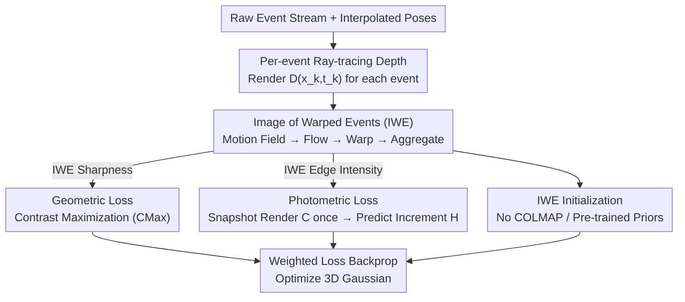

# Geometric-Photometric Event-based 3D Gaussian Ray Tracing

**Conference**: CVPR 2026  
**Paper**: [CVF Open Access](https://openaccess.thecvf.com/content/CVPR2026/html/Kohyama_Geometric-Photometric_Event-based_3D_Gaussian_Ray_Tracing_CVPR_2026_paper.html)  
**Code**: https://github.com/e3ai/gpert  
**Area**: 3D Vision  
**Keywords**: Event Camera, 3D Gaussian Splatting, Ray Tracing, Contrast Maximization, Novel View Synthesis  

## TL;DR
GPERT decouples pure event-driven 3DGS rendering into two complementary branches: per-event ray-tracing depth rendering (temporally dense, spatially sparse) for geometric loss, and a single snapshot radiance map rendering (spatially dense, temporally sparse) for photometric loss. By bridging these branches via the "Image of Warped Events" (IWE), it resolves the conflict between precision and time windows inherent in the "render-twice-and-subtract" paradigm, achieving SOTA performance on real event datasets with the fastest training speed and no reliance on pre-trained models or COLMAP initialization.

## Background & Motivation
**Background**: Event cameras record log-brightness changes asynchronously at $\mu \text{s}$ temporal resolution, which is naturally suited for recovering motion and structure. 3D Gaussian Splatting (3DGS) is the current SOTA representation for photometric 3D reconstruction and Novel View Synthesis (NVS). "Pure event 3DGS," which combines both, is highly anticipated as event streams lack motion blur and offer high dynamic range, bypassing the limitations of frame-based cameras.

**Limitations of Prior Work**: The mainstream approach for event-based NeRF/GS is "render-twice-and-subtract," where two dense intensity maps $C(t_1)$ and $C(t_2)$ are rendered at the start and end of an event slice. The difference $\Delta C = C(t_2) - C(t_1)$ is then used to fit the per-pixel accumulated event edge map. This paradigm has two fatal flaws: first, it requires two full-pixel dense renderings per sample, slowing down training; second, it falls into a "precision vs. time window" dilemma. If the time window is too short, subtle brightness changes from only a few events are missed; if it is too long, the predicted edge map becomes blurred by motion, losing the fine-grained temporal information events should carry.

**Key Challenge**: Event streams measure "sparse brightness differences at quasi-continuous times and views," whereas 3DGS renders "absolute intensity maps at specific views and times." These two quantities are physically almost opposite. Forcing a "two-frame subtraction" to approximate events essentially crams temporally dense events into temporally sparse dense renderings, inevitably sacrificing temporal resolution. Furthermore, most event 3DGS methods rely on pre-trained video reconstruction models (e.g., E2VID) or depth models for initialization and regularization, limiting flexibility.

**Goal**: To enable "render-once" dense intensity maps per sample while preserving the high temporal resolution of events, and to completely eliminate reliance on pre-trained priors and COLMAP initialization.

**Key Insight**: The authors realized that 3DGS rendering involves two quantities with distinct properties: "continuous-time, spatially sparse depth" and "instantaneous, spatially dense intensity." There is no need to use the same dense rendering for both. Decoupling them allows for both high temporal resolution and efficiency.

**Core Idea**: Rendering is split into two branches—per-event depth (structure) rendering via ray tracing and a single snapshot dense intensity (appearance) rendering. These are bridged by the Image of Warped Events (IWE) to construct geometric and photometric losses respectively.

## Method

### Overall Architecture
The input to GPERT is the raw event stream $\mathcal{E}=\{(\mathbf{x},t,p)\}$ and known camera poses. The output is a set of optimized 3D Gaussians. The key to optimization is decoupling rendering into two branches: the upper branch performs "per-event, temporally dense, spatially sparse" depth rendering for the geometric loss; the lower branch performs "single snapshot, spatially dense, temporally sparse" intensity rendering for the photometric loss. Both branches are connected via the same IWE, which reflects both motion-aligned edges (for geometric loss) and edge intensity (for photometric loss).

For an event slice $\mathcal{E}=\{e_k\}_{k=1}^{N_e}$ (using the midpoint $t_{\mathrm{mid}}$ as reference): per-event depth $D(\mathbf{x}_k,t_k)$ is first rendered via ray tracing with interpolated poses. This is converted into per-event optical flow via the motion field equation to warp events to $t_{\mathrm{mid}}$ and aggregate them into an IWE. The sharpness of the IWE reflects motion estimation accuracy, forming the geometric loss. Simultaneously, a dense intensity map $C$ is rendered once at $t_{\mathrm{mid}}$, and the instantaneous brightness increment prediction $\hat{H}$ is calculated based on the event generation model to be compared with the IWE via L2 + SSIM for the photometric loss.

### Key Designs

**1. Per-event Ray-tracing Depth: Assigning Depth to Each Event Individually**

To address the high cost and loss of temporal resolution in "render-twice-and-subtract," the authors adopt ray-tracing GS (e.g., 3DGRT). Rendering is shifted from "image rasterization" to "per-event ray tracing." Since events are sparse in pixel space and quasi-continuous in time, they should be rendered sparsely. For each event $e_k=(\mathbf{x}_k,t_k,p_k)$, the depth $D(\mathbf{x}_k,t_k)$—a function of both space and time—is rendered via GPU-accelerated ray tracing using the interpolated pose $(R(t_k),T(t_k))$. Depth follows the 3DGS opacity-weighted expectation: $D(\mathbf{x})=\frac{\sum_i Z_i w_i(\mathbf{x})\prod_{j<i}(1-w_j)}{\sum_i w_i(\mathbf{x})\prod_{j<i}(1-w_j)+\epsilon}$, where $Z_i$ is the mean depth of the $i$-th Gaussian. The authors emphasize that sparse depth/flow is truly calculated per event, not masked from dense results.

**2. Geometric Loss: Unsupervised Structure via Contrast Maximization**

With per-event depth, the system applies the Contrast Maximization (CMax) framework. Under the brightness constancy assumption, events are generated by moving edges. If motion is known, events can be "motion-compensated" to a reference time. Per-event depth is converted to optical flow via the motion field equation: $\mathbf{v}(\mathbf{x},t)=\frac{1}{D(\mathbf{x},t)}A(\mathbf{x})\mathbf{V}+B(\mathbf{x})\boldsymbol{\omega}$. Events are warped to $\mathbf{x}'_k=\mathbf{x}_k+(t_k-t_{\mathrm{ref}})\,\mathbf{v}(\mathbf{x}_k,t_k)$ to form the IWE. Since correct motion results in sharp IWE edges, the geometric loss is the inverse of IWE sharpness: $\mathcal{L}_c\doteq G(\mathbf{0};-)/G(\mathbf{v}(D);t_{\mathrm{ref}})$, where $G$ is the L1 norm of the IWE gradient. This forces the 3DGS to estimate correct depth without any depth ground truth or pre-trained models.

**3. Photometric Loss: Single Rendering and Instantaneous Increment Prediction**

The IWE encodes both motion-aligned edges and edge intensity (intensity gradient along the flow). GPERT predicts the edge intensity at the reference time: $\hat{H}(\mathbf{x};t_{\mathrm{ref}})\doteq\frac{\partial\log C}{\partial t}\Delta t\approx-\nabla\log(C)\cdot\mathbf{v}\,\Delta t$, where $C$ is the dense intensity map rendered once. The polarized IWE is compared with this prediction using L2 + SSIM: $\mathcal{L}_p\doteq\frac{1}{|\Omega|}\|\mathrm{IWE}-\hat{H}\|^2$ and $\mathcal{L}_s\doteq\mathrm{SSIM}(\mathrm{IWE},\hat{H})$. The authors argue that warping avoids the blurred edges, polarity neutralization, and dual-rendering requirements of traditional pixel-wise accumulation.

**4. IWE Initialization: Replacing COLMAP with Sharp Edges**

Instead of using COLMAP or E2VID-reconstructed intensity maps for initialization, GPERT uses the unpolarized $\mathrm{IWE}(\mathbf{x};t_{\mathrm{mid}})$ and rendered map $C(\mathbf{x})$. Because the IWE responds to edges and is sharpened by warping, it narrows the possible positions of initial Gaussian centers, placing them naturally on scene structures. This makes the method entirely independent of pre-trained models or COLMAP.

### Loss & Training
The reference time is the midpoint $t_{\mathrm{ref}}\doteq t_{\mathrm{mid}}$. Hyperparameters: contrast threshold $C_{th}=0.25$, loss weights $\lambda_c=0.125, \lambda_p=500, \lambda_s=1$. Event count $N_e=125\mathrm{k}$ for Synthetic and $500\mathrm{k}$ for TUM-VIE. 10k initialization steps, 40k total training steps.

## Key Experimental Results

### Main Results
On real-world datasets EDS (640×480) and TUM-VIE (1280×720):

| Dataset | Metric | Ours | EventSplat (CVPR'25) | IncEventGS (CVPR'25) | Robust E-NeRF (ICCV'23) |
|--------|------|------|------|------|------|
| EDS | PSNR↑ | **19.47** | 18.86 | 15.21 | 16.25 |
| EDS | SSIM↑ | **0.816** | 0.792 | 0.691 | 0.739 |
| EDS | LPIPS↓ | **0.357** | 0.362 | 0.561 | 0.543 |
| TUM-VIE | PSNR↑ | **13.09** | – | 10.09 | 11.79 |
| TUM-VIE | SSIM↑ | **0.716** | – | 0.533 | 0.573 |
| TUM-VIE | LPIPS↓ | **0.411** | – | 0.685 | 0.588 |

GPERT achieves SOTA on all average metrics for real data without pre-training or COLMAP. On synthetic color datasets, performance is competitive but slightly lower than EventSplat (e.g., PSNR 23.11 vs 28.14), which the authors attribute to the difficulty of warping Bayer patterns.

### Ablation Study
Ablation of contrast loss and initialization (PSNR↑):

| Configuration | Synthetic | EDS | TUM-VIE |
|------|------|------|---------|
| Full Model | 23.11 | 19.47 | 13.09 |
| w/o Contrast Loss | 9.60 | 15.52 | 13.45 |
| w/o Initialization | 20.82 | 17.34 | 11.36 |

### Key Findings
- **Geometric Loss Contribution**: Removing the contrast loss causes PSNR to crash from 23.11 to 9.60 on synthetic data, proving that per-event ray-tracing depth + CMax is the backbone of reconstruction quality.
- **Robustness to $N_e$**: While traditional "render-twice" methods suffer as the event count $N_e$ increases (due to blurring), "render-once" remains robust due to deblurring via warping.
- **Efficiency**: Training takes 30–45 mins (EDS/Synthetic) or 80–130 mins (TUM-VIE), significantly faster than Robust E-NeRF or EventSplat.
- **Flickering Robustness**: GPERT converges even under the flickering lights in the EDS dataset, although extreme flickering can still destabilize depth estimation.

## Highlights & Insights
- **Decoupling is the core insight**: Separating "continuous-time sparse depth" from "instantaneous dense intensity" breaks the precision-window deadlock.
- **One IWE for Two Tasks**: Using a single IWE for both geometric and photometric tasks enables the "render-once" efficiency.
- **Unsupervised Geometry**: Bridging CMax with differentiable depth rendering allows geometry to be learned without ground truth or pre-trained priors.
- **Zero-Prior Initialization**: Using IWE for initialization removes dependencies on external tools like COLMAP.

## Limitations & Future Work
- **Brightness Constancy**: Vulnerable to extreme flickering which violates the core assumption.
- **Static Scene Assumption**: Does not handle dynamic objects; event-based 4D GS is a future direction.
- **Bayer Pattern Weakness**: Warping-based methods struggle with Bayer color patterns, limiting performance on simulated color datasets.

## Related Work & Insights
- **vs. EventSplat**: EventSplat uses dual dense renderings and requires pre-trained priors; GPERT renders once and is fully unsupervised.
- **vs. IncEventGS**: IncEventGS is incremental and relies on pre-trained depth; GPERT uses ray tracing + CMax for self-supervised structure.
- **vs. Robust E-NeRF**: Like GPERT, it uses per-event losses, but as a NeRF-based method, it is slower and sensitive to noise compared to GPERT's 3DGS-based approach.

## Rating
- Novelty: ⭐⭐⭐⭐⭐ (Elegant decoupling of rendering)
- Experimental Thoroughness: ⭐⭐⭐⭐ (Extensive real/synthetic tests, though Bayer results are weaker)
- Writing Quality: ⭐⭐⭐⭐⭐ (Clear logic and derivation)
- Value: ⭐⭐⭐⭐⭐ (Fast, prior-free, and breaks the precision-window deadlock)

<!-- RELATED:START -->

## Related Papers

- [\[CVPR 2026\] Stochastic Ray Tracing for the Reconstruction of 3D Gaussian Splatting](stochastic_ray_tracing_for_the_reconstruction_of_3d_gaussian_splatting.md)
- [\[CVPR 2026\] eRetinexGS: Retinex Modeling for Low-Light Scene Enhancement via Event Streams and 3D Gaussian Splatting](eretinexgs_retinex_modeling_for_low-light_scene_enhancement_via_event_streams_an.md)
- [\[CVPR 2026\] Lens Component Deletion based on Differentiable Ray Tracing](lens_component_deletion_based_on_differentiable_ray_tracing.md)
- [\[CVPR 2026\] AnchorSplat: Feed-Forward 3D Gaussian Splatting with 3D Geometric Priors](anchorsplat_feed-forward_3d_gaussian_splatting_with_3d_geometric_priors.md)
- [\[CVPR 2026\] E2EGS: Event-to-Edge Gaussian Splatting for Pose-Free 3D Reconstruction](e2egs_event-to-edge_gaussian_splatting_for_pose-free_3d_reconstruction.md)

<!-- RELATED:END -->
