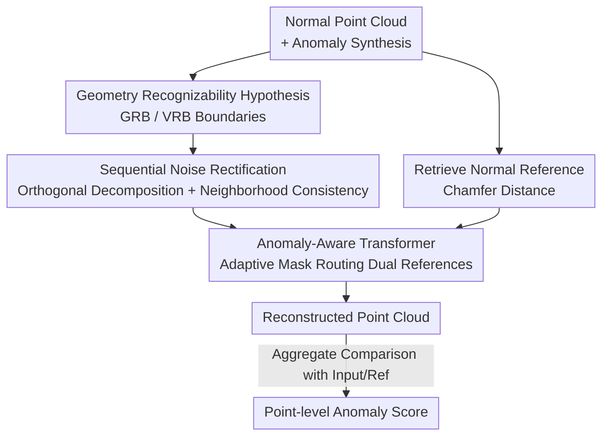

# Geometry-Aligned and Anomaly-Aware Reconstruction for 3D Anomaly Detection

**Conference**: CVPR 2026  
**Paper**: [CVF Open Access](https://openaccess.thecvf.com/content/CVPR2026/html/Wu_Geometry-Aligned_and_Anomaly-Aware_Reconstruction_for_3D_Anomaly_Detection_CVPR_2026_paper.html)  
**Code**: None  
**Area**: 3D Vision  
**Keywords**: 3D Anomaly Detection, Point Cloud Reconstruction, Diffusion Model, Geometry-Aligned Noise, Anomaly-Aware Attention

## TL;DR
AARD addresses two systematic weaknesses in diffusion-based point cloud anomaly detection: geometric destruction by random noise and blurred details from unified references. It proposes "Geometry Rectification" to align noise with vertex normals and an "Anomaly-Aware Transformer" to route normal references to anomalous regions and input references to normal regions, setting new SOTA results on Real3D-AD (O-AUROC 0.82) and Anomaly-ShapeNet (O-AUROC 0.93).

## Background & Motivation

**Background**: Point cloud anomaly detection (identifying defects like protrusions, depressions, cracks, and holes on workpiece surfaces) currently follows the "reconstruction-based" paradigm. A diffusion model, trained only on normal samples (paired with synthetic anomalies), reconstructs the input point cloud. Anomalies are localized by comparing the geometric differences between the reconstruction and the input. Methods like R3D-AD and MC3AD fall into this category.

**Limitations of Prior Work**: The authors identify two overlooked systematic issues in diffusion reconstruction. First is **Geometry Violation**: standard isotropic Gaussian noise added during diffusion deviates from local surface normals, causing denoising trajectories of neighboring vertices to "clash"—for instance, two adjacent points on a rim might be pushed in opposite directions, resulting in blurred reconstructed contours. Second is **Undistinguished Guidance**: existing methods apply the same coarse input shape embedding to both normal and anomalous regions. Consequently, normal regions lack fine structural guidance while anomalous regions lack the correct reconstruction direction, leading to loss of detail and incomplete defect repair.

**Key Challenge**: There is an inherent conflict between the "randomness" of the diffusion process and the "high geometric fidelity" required for anomaly detection. Noise must be random enough to learn denoising capabilities, but purely random noise disregards the normal/topological structure of the object. Furthermore, a single reference cannot simultaneously satisfy the opposing needs of "preserving details in normal areas" and "correcting defects in anomalous areas."

**Goal**: Without sacrificing the diffusion framework, the objectives are to: (1) make the noise process "geometry-aligned" to straighten denoising trajectories; (2) make reconstruction guidance "region-distinguishable" so that normal and anomalous areas receive appropriate references.

**Key Insight**: The authors propose a **Geometry Recognizability Hypothesis**—the state of a point cloud in diffusion can transition continuously from a "completely unrecognizable pure noise state" to a "completely recognizable geometric state," with two quantifiable boundaries in between. By constraining noise magnitude and direction along this spectrum, geometric structures can be preserved while maintaining denoising flexibility.

**Core Idea**: Noise is矫正ed by "orthogonal decomposition followed by normal alignment + neighborhood averaging for consistency," while an Anomaly-Aware Transformer routes "normal references" to anomalous regions and "input references" to normal regions. This enables simultaneous geometric fidelity and anomaly correction within a single diffusion framework.

## Method

### Overall Architecture
AARD is a diffusion reconstruction framework where the pipeline focuses on two stages: the **Noising Side** employs "Sequential Noise Rectification" to straighten clashing denoising flows, and the **Denoising Side** uses an "Anomaly-Aware Transformer" to deliver different references to specific regions. During training, anomalies are synthesized on normal point clouds to create defective inputs, and the most similar normal reference is retrieved via Chamfer Distance. Noise is injected after geometry and vertex rectification. The Anomaly-Aware Transformer then merges features from the "input reference" and "normal reference," guided by an adaptive anomaly mask, to predict noise and complete the reconstruction. During testing, the reconstructed point cloud is compared with both the test input and the normal reference to aggregate point-level anomaly scores.

### Key Designs

**1. Geometry Recognizability Hypothesis: Quantifiable Metrics for "How Much and How to Add Noise"**

To address "geometry violation," the authors establish the **Geometry Recognizability Hypothesis**. A vertex state is defined as $(p_s, p_r)$, where $p_s\in\mathbb{R}^3$ is spatial position and $p_r\in\mathbb{R}^3$ is surface normal orientation. The unrecognizable noise state is $p_r^{low}=g_d,\ p_s^{low}=p_s + g_s\cdot p_r^{low}$ (where $g_s,g_d$ are magnitude and directional noise), and the recognizable state is $p_s^{high}=p_s,\ p_r^{high}=p_r$. Between these, the authors define two boundaries: the **Geometry Recognizability Boundary (GRB)** provides the minimum structural information needed to preserve global contours/topology, while the **Vertex Recognizability Boundary (VRB)** maintains local neighborhood relationships while allowing reconstruction flexibility.

The GRB is implemented as a "3D spatial discretization" problem: space is divided into a $g\times g\times g$ uniform grid. If $g=2$, it is too coarse; if $g=4$, the object is decomposed into recognizable sub-parts while preserving global composition. By constraining the isotopic noise radius of each vertex not to exceed adjacent grid cells, a normalized upper bound $\sigma_{max}=(1-(-1))/g=0.5$ is derived. This $\sigma_{max}<0.5$ serves as a hard constraint for subsequent noise rectification. The value of this hypothesis lies in converting "diffusion noise restraint" from empirical tuning to a quantifiable geometric goal.

**2. Sequential Noise Rectification: Aligning Noise to Normals and Unifying Neighborhoods**

This is the core of geometry alignment, executed in two serial steps to convert "clashing denoising trajectories" into "structure-aligned linear flows."

Step 1: **Orthogonal Geometry Rectification**. Each sampled Gaussian noise $g$ is orthogonally decomposed along the vertex normal $n$ into normal and tangential components:

$$g_r = \frac{g\cdot n}{n\cdot n}\, n,\qquad g_t = g - g_r,$$

where the normal component $g_r$ maintains geometric fidelity, and the tangential component $g_t$ is the "bad component" causing intersecting trajectories and must be suppressed. Under GRB constraints, the normal component is reinforced and the tangential component is suppressed to obtain the rectified state:

$$p_r' = n\cdot\big(\alpha p_d + (1-\alpha)(\beta g_r + (1-\beta)g_t)\big),\qquad p_s' = \alpha p_s + (1-\alpha)p_r',$$

where $\alpha\sim U(0,0.5)$ is random scaling, and $\beta=\sqrt{\sigma_{max}^2-\alpha^2}$ is derived from GRB to maintain geometric consistency.

Step 2: **Vertex-Graph Noise Rectification**. Geometry rectification ensures alignment with global structure, but independent sampling can still lead to inconsistency between adjacent vertices. Vertices are clustered into groups of $k=16$, and the average noise direction $p_r^{avg}=\frac{1}{k}\sum_{i=1}^k p_r^i$ within the cluster is calculated and fused with the single-point direction:

$$p_r'' = \beta\, p_r + (1-\beta)\big(\gamma\, p_r^{avg} + (1-\gamma)\, p_r'\big),$$

with $\gamma=0.5$ balancing "group consistency" and "individual flexibility." Together, these steps realize a denoising trajectory that is "globally aligned with normals and locally non-conflicting." Compared to standard isotropic Gaussian noise, this "tamed" noise results in sharper reconstructed contours.

**3. Anomaly-Aware Transformer: Routing Normal References to Anomalies and Input References to Normal Areas**

To address "undistinguished guidance," the authors design a triple-path (noisy / input ref / normal ref) encoder-decoder Transformer centered on **Anomaly-aWare attention (AW)**. The normal reference is retrieved from the training set via minimum Chamfer Distance. To align poses, each candidate is rotated along x/y/z axes in $10^\circ$ steps within $[-90^\circ,+90^\circ]$, selecting the best from 5,832 candidates.

Given noisy queries $Q$ and keys $K_n, K_i$ from normal and input references, two attention maps are computed: $S_n=\mathrm{Softmax}(QK_n^\top),\ S_i=\mathrm{Softmax}(QK_i^\top)$. Since they share queries and only swap keys, their difference naturally highlights anomalous regions. An adaptive anomaly mask is formed by combining geometric deviation and attention discrepancy:

$$M = \delta(\lVert P_i - P_n\rVert_2) + \delta(\lVert S_i - S_n\rVert_2),$$

where $\delta(\cdot)$ is min-max scaling to $[0,1]$. A soft refinement is applied $\hat S_n,\hat S_i = \mathrm{Softmax}(\mathrm{MLP}([S_n\Vert S_i]))\odot[M\Vert 1{-}M]$, followed by fusing the reference values:

$$F = \mathrm{Softmax}\!\Big(\tfrac{\tilde S_n}{\sqrt d}\Big)V_n + \mathrm{Softmax}\!\Big(\tfrac{\tilde S_i}{\sqrt d}\Big)V_i.$$

The mask $M$ assigns higher weight to the "normal reference" in anomalous regions (correcting defects) and higher weight to the "input reference" in normal regions (preserving details), satisfying contradictory requirements in a single attention pass.

### Loss & Training
During training, synthesized anomalies $P_i = P_n + d$ are used. Injected noise is rectified $\epsilon'=r(\epsilon)$, and the total anomaly noise is $\mu=\epsilon'+d$. The reconstruction target is to predict this anomaly noise:

$$L_{rec}=\mathbb{E}\big[\lVert \mu_t - \mu_\theta(z_t, t, \tau_{\theta_0}(P_n), \tau_{\theta_1}(P_i))\rVert^2\big],$$

where $z_t$ is the noisy point cloud at time $t$, and $\tau_\theta(\cdot)$ represents the encoded reference features. During detection, the reconstructed $P_r$ is compared with test cloud $P$ and normal reference $P_n$, then average-pooled to get point-level scores:

$$S_p = \mathrm{AvgPool}\big(\mathrm{Norm}(\lVert P_r-P\rVert_2 + \lVert P_r-P_n\rVert_2)\big).$$

Implementation details: 16,384 input points, k-NN with $k=[16,16]$, 16 Transformer blocks in the encoder, 6 in the decoder, hidden dimension 1024, Adam optimizer (lr $1\times10^{-5}$), batch size 32, 2×RTX 3090.

## Key Experimental Results

### Main Results
Evaluation on two industrial benchmarks: Real3D-AD (12 categories, real object scans) and Anomaly-ShapeNet (40 categories, synthetic). Metrics: Object-level O-AUROC and Point-level P-AUROC.

| Dataset | Metric | AARD (Ours) | Prev. SOTA | Note |
|--------|------|-----------|----------|------|
| Real3D-AD | O-AUROC (avg) | **0.820** | 0.802 (PASDF, ICCV25) | Mean Rank 1.79, 1st in most categories |
| Real3D-AD | P-AUROC (avg) | **0.860** | 0.837 (MC4AD) | Mean Rank 1.83 |
| Anomaly-ShapeNet | O-AUROC (avg) | **0.931** | 0.912 (MC4AD) | 15 total classes, incl. Simple3D 0.860 |

On Real3D-AD, despite strong individual performances by competitors (e.g., PASDF scoring 1.000 on Seahorse), AARD achieves the highest average performance with a stable mean rank of 1.79.

### Ablation Study
Ablation on Anomaly-ShapeNet: Geometry Noise Rectification (GNR), Vertex Noise Rectification (VNR), Normal Reference (NR), Input Reference (IR), and Anomaly Mask (AM). Metrics: Reconstruction F-Score and Detection O-AUROC.

| Config | GNR | VNR | NR | IR | AM | F-Score | O-AUROC |
|------|-----|-----|----|----|----|---------|---------|
| a Baseline (Transformer+Linear Diffusion) | × | × | × | × | × | 0.719 | 0.772 |
| b +GNR | ✓ | × | × | × | × | 0.815 | 0.802 |
| c +VNR | × | ✓ | × | × | × | 0.791 | 0.796 |
| d +GNR+VNR | ✓ | ✓ | × | × | × | 0.832 | 0.825 |
| e +NR+AM | ✓ | ✓ | ✓ | × | ✓ | 0.926 | 0.915 |
| f +IR+AM | ✓ | ✓ | × | ✓ | ✓ | 0.947 | 0.893 |
| g Full | ✓ | ✓ | ✓ | ✓ | ✓ | **0.953** | **0.931** |

Hyperparameter sensitivity (O-AUROC): optimal at grid size $g=4$ (0.931); optimal cluster size $k=16$ (0.931); optimal fusion weight $\gamma=0.5$ (0.931).

### Key Findings
- **Two-step noise rectification is effective and complementary**: Adding GNR/VNR independently improves O-AUROC by ~3% / 2.4%, and combined to 0.825. They primarily ensure "looking like the target," raising F-Score from 0.719 to 0.832.
- **Anomaly-aware references drive detection accuracy**: On top of rectification, AM+NR adds ~9% and AM+IR adds ~6.8%. NR favors detection (O-AUROC 0.915) while IR favors reconstruction fidelity (F-Score 0.947).
- **Geometric boundaries have a "sweet spot"**: $g=4$ (yielding $\sigma_{max}=0.5$) is fine enough to resolve sub-structures yet coarse enough to tolerate noise; performance drops on either side, validating the geometric meaning of the GRB hypothesis.

## Highlights & Insights
- **Reforming diffusion as "directional noise addition"**: By decomposing $g = g_r + g_t$ and reinforcing the geometry-preserving component while suppressing the trajectory-tangling component, the method directly addresses the root cause of blurred reconstructions. This orthogonal decomposition is a simple but powerful idea applicable to other geometry-sensitive point cloud tasks.
- **Attention discrepancy as an anomaly localizer**: Using $\lVert S_i-S_n\rVert_2$ (discrepancy between identical queries and different keys) highlights anomalous regions without extra labels, providing a lightweight, self-supervised localization signal.
- **Dual-reference routing for contradictory needs**: Allowing anomalous regions to "eat" the normal reference while normal regions "eat" the input reference prevents the "one-size-fits-all" limitation of single references. This pattern is highly relevant for image inpainting and completion tasks.

## Limitations & Future Work
- Normal reference retrieval requires calculating Chamfer Distance for 5,832 rotation candidates, which is computationally expensive. For objects with large intra-class deformation, the "most similar normal sample" might not represent the correct structure of the specific instance.
- Training relies on anomaly synthesis $P_i=P_n+d$. The coverage of synthetic perturbations $d$ determines generalization. Small training sets (4 normal samples per class) may limit the representativeness of the reference library.
- The GRB/VRB derivations in the Geometry Recognizability Hypothesis are somewhat heuristic (e.g., $g=4$ from grid intuition). There are also minor notation inconsistencies in the original formulas.
- Future work: Replacing brute-force rotation matching with learnable or feature-space retrieval; explicitly modeling VRB into the loss function rather than just using GRB as a hard constraint.

## Related Work & Insights
- **vs R3D-AD (ECCV24)**: R3D-AD uses synthetic anomalies for diffusion training with shape embeddings but relies on unified references and random noise. AARD improves upon this by aligning noise to geometry and routing references by region. Qualitative comparisons show R3D-AD has blurred contours and more false positives.
- **vs MC3AD / MC4AD**: These methods extend reconstruction to the feature level and use geometric normal changes for early detection. AARD also values normals but focuses on "rectifying noise direction during the noising stage" rather than just using normals as a detection guide.
- **vs Memory-bank methods (Reg3D-AD / Shape-guided)**: These rely on retrieving normal samples from a memory bank to compare features. AARD also retrieves references but injects them into the Transformer as "error-correction references" for diffusion reconstruction rather than performing simple nearest-neighbor comparisons.

## Rating
- Novelty: ⭐⭐⭐⭐ Introducing "geometry-aligned noise" and "region-based reference routing" to 3D diffusion AD is a clear and effective contribution.
- Experimental Thoroughness: ⭐⭐⭐⭐ SOTA on two major benchmarks with detailed ablations, though lacks efficiency analysis and is superseded in specific sub-categories.
- Writing Quality: ⭐⭐⭐ Clear logic, but contains several notation and spelling errors in formulas, and the theory is somewhat heuristic.
- Value: ⭐⭐⭐⭐ Directly addresses industrial demand for point cloud defect detection with transferable design principles.

<!-- RELATED:START -->

## Related Papers

- [\[CVPR 2026\] Wavelet-Driven 3D Anomaly Detection under Pose-Agnostic and Sparse-View](wavelet-driven_3d_anomaly_detection_under_pose-agnostic_and_sparse-view.md)
- [\[CVPR 2026\] Hierarchical Point-Patch Fusion with Adaptive Patch Codebook for 3D Shape Anomaly Detection](hierarchical_point-patch_fusion_with_adaptive_patch_codebook_for_3d_shape_anomal.md)
- [\[ICCV 2025\] G2SF: Geometry-Guided Score Fusion for Multimodal Industrial Anomaly Detection](../../ICCV2025/3d_vision/g2sf_geometry-guided_score_fusion_for_multimodal_industrial_anomaly_detection.md)
- [\[ICCV 2025\] SiM3D: Single-Instance Multiview Multimodal and Multisetup 3D Anomaly Detection Benchmark](../../ICCV2025/3d_vision/sim3d_single-instance_multiview_multimodal_and_multisetup_3d_anomaly_detection_b.md)
- [\[CVPR 2026\] Towards Intrinsic-Aware Monocular 3D Object Detection](towards_intrinsic-aware_monocular_3d_object_detection.md)

<!-- RELATED:END -->
