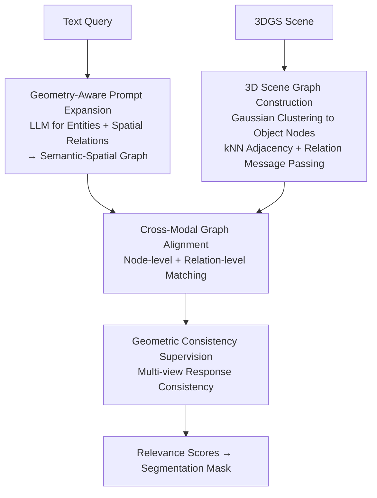

# Geometry-Aware Cross-Modal Graph Alignment for Referring Segmentation in 3D Gaussian Splatting

**Conference**: CVPR 2026  
**Paper**: [CVF Open Access](https://openaccess.thecvf.com/content/CVPR2026/html/Tao_Geometry-Aware_Cross-Modal_Graph_Alignment_for_Referring_Segmentation_in_3D_Gaussian_CVPR_2026_paper.html)  
**Code**: None  
**Area**: 3D Vision  
**Keywords**: Referring Segmentation, 3D Gaussian Splatting, Cross-Modal Alignment, Graph Matching, Spatial Reasoning

## TL;DR
GeoCGA reformulates the task of "identifying and segmenting target objects in 3DGS scenes using natural language" as a **geometry-aware cross-modal graph alignment** problem. It expands text into a semantic-spatial graph representing spatial relationships while abstracting Gaussian point clouds into an object-level geometric graph. By aligning these graphs at both node and edge levels and applying multi-view consistency constraints, it achieves relative mIoU improvements of 20.8% / 5.7% / 1.0% on Ref-LERF / LERF-OVS / 3D-OVS respectively, while significantly reducing parameters and FLOPs.

## Background & Motivation
**Background**: Referring 3D Segmentation aims to localize and segment target objects in a 3D scene based on a natural language query (e.g., "the one on the stool, near the apple"). Due to their differentiability, real-time rendering, and unified geometry-appearance representation, 3D Gaussian Splatting (3DGS) has become the dominant representation for this task. The representative method, ReferSplat, was the first R3DGS framework to align language features with Gaussian representations using confidence-weighted pseudo-masks for supervision.

**Limitations of Prior Work**: Existing methods exhibit **weak spatial reasoning capabilities**. Empirical analysis (Section 4 of the paper) shows that ReferSplat can localize objects given simple prompts like "glass cup," but fails when spatial relationships dominate, such as "the tall glass cup next to the yellow bowl," often pointing to adjacent objects. Even when localization is correct, masks are often coarse and suffer from cross-view drift.

**Key Challenge**: The authors attribute this to two primary factors. First, **language encoders (BERT/CLIP text towers) lack explicit positional encoding**, causing spatial prepositions like "left/above/near" to degrade into weak word co-occurrence similarities that fail to capture structured geometric relations. Second, **cross-modal attention is self-reinforcing**—if the model initially associates words with "visually similar but spatially incorrect" regions, this bias is amplified during Gaussian field training. These factors imply that existing frameworks **entangle** geometry and semantics without an explicit mechanism for **decoupling and realignment**.

**Goal**: Inject explicit geometric structures into both the language and 3D sides, align them at the **relationship level** (rather than just node feature similarity), and stabilize spatial correspondence across views.

**Core Idea**: Redefine referring segmentation as "cross-modal alignment of two relationship graphs"—constructing a semantic-spatial graph on the text side and an object-level geometric graph on the scene side, performing node alignment, relationship alignment, and multi-view geometric consistency simultaneously.

## Method

### Overall Architecture
The input to GeoCGA is a text query and a reconstructed 3DGS scene $\mathcal{G}=\{g_i\}_{i=1}^N$ (where each Gaussian has mean $\mu_i$, covariance $\Sigma_i$, opacity $\sigma_i$, and color $c_i$). The output is a relevance score $r_i$ for each Gaussian, used to select the subset belonging to the target object for rendering into a segmentation mask. The pipeline consists of four steps: **GAPE** expands the raw text into "entity + spatial relationship" triplets to build a semantic-spatial graph $\mathcal{G}_{text}$; encoding in parallel, **3DSGC** clusters scattered Gaussian primitives into object-level nodes and builds a scene graph $\mathcal{G}_{sg}$ based on geometric adjacency; **CMGA** then performs simultaneous node and relationship alignment in a shared latent space to precisely match language entities with Gaussian objects; finally, **GCS** uses multi-view consistency constraints to ensure the response of the same Gaussian remains consistent across different camera views, preventing grounding drift.

The total loss combines alignment and geometric regularization:

$$\mathcal{L}_{total} = \mathcal{L}_{align} + \lambda_{geo}\,\mathcal{L}_{geo}$$

Where $\mathcal{L}_{align}$ supervises node-level and relation-level language-geometry matching, $\mathcal{L}_{geo}$ enforces multi-view response consistency, and $\lambda_{geo}$ controls the strength of the geometric regularization.

### Key Designs

**1. Geometry-Aware Prompt Expansion (GAPE): Providing Spatial Structure to Language Encoders**

To address the lack of spatial priors in BERT/CLIP text towers, GAPE adds an explicit spatial reasoning layer on the language side. Given a query $S=\{w_t\}_{t=1}^T$, token-level contextual embeddings $f_w$ are extracted. A lightweight LLM (LLaMA-3.1-8B) is then used for **structure-aware prompt expansion**, parsing the sentence into a set of entities $E$ and spatial relationships $R$ to generate expanded descriptions:

$$S' = \{(e_i, r_{ij}, e_j) \mid e_i, e_j \in E,\; r_{ij} \in R\}$$

Each relationship $r_{ij}$ expresses a geometric dependency (e.g., "left of", "above", "near"). The expanded text is re-encoded to obtain enhanced embeddings $f'_w$, forming the semantic-spatial graph $\mathcal{G}_{text}=(V_t,E_t)$ where nodes are entity embeddings and edges are weighted by learned relationship vectors $r_{ij}$. This graph **explicitly stores** global spatial dependencies for direct alignment with 3D structures.

**2. 3D Scene Graph Construction (3DSGC): Lifting Fragmented Primitives to Object-Level Representations**

3DGS uses low-level primitives that lack explicit structural relationships, creating a granularity mismatch with language descriptions. 3DSGC utilizes object-level representations from Dr. Splat to build a scene graph $\mathcal{G}_{sg}=(V,E)$. Node descriptors aggregate position and appearance $f^{(0)}_i=[\mu_i, c_i]$, while edges are established for geometric k-nearest neighbors $\mathcal{N}(i)$ with attributes based on relative distance and direction $e_{ij}=[\lVert\mu_i-\mu_j\rVert_2,\ \mathrm{dir}(\mu_i,\mu_j)]$. Relation message passing refines node embeddings:

$$f'_i = \phi\Big(f^{(0)}_i,\ \{\psi(f^{(0)}_j, e_{ij}) \mid v_j \in \mathcal{N}(i)\}\Big)$$

The refined embeddings encode higher-order spatial configurations and geometric contexts, explicitly capturing scene topology.

**3. Cross-Modal Graph Alignment (CMGA): Enforcing "Language Relations = 3D Geometric Layout"**

Since the feature spaces and topologies of the two graphs differ, matching occurs at both node and relationship levels. **Node-level**: A cross-modal similarity matrix $A_{t,g}$ is calculated:

$$A_{t,g} = \frac{\exp(f'_t \cdot f'_g / \tau)}{\sum_{g'} \exp(f'_t \cdot f'_{g'} / \tau)}$$

**Relation-level**: Structural dependencies in language (e.g., "behind") must be preserved in the geometric domain. A relationship consistency score $S_{ij,pq}=\mathrm{sim}(r_{ij}, \phi(e_{pq}))$ is defined between text entity pairs $(t_i,t_j)$ and Gaussian pairs $(g_p,g_q)$, where $\phi(\cdot)$ projects geometric edges into the language relation latent space. The combined alignment goal is:

$$\mathcal{L}_{align} = -\sum_{(t,g)} \log A_{t,g} - \lambda_{rel}\sum_{(i,j,p,q)} S_{ij,pq}$$

This ensures local semantic alignment and global structural consistency.

**4. Geometric Consistency Supervision (GCS): Stabilizing Grounding via Multi-view Constraints**

To solve cross-camera drift, GCS replaces single-view pseudo-masks with multi-view consistency. For a set of training views $\{V_s\}_{s=1}^S$, the rendered relevance map $M_s(v)$ for the same 3D Gaussian $g_i$ must be consistent across views:

$$\mathcal{L}_{geo} = \frac{1}{N}\sum_{i=1}^N \sum_{(s_1,s_2)} \big\lVert R_{s_1}(g_i) - R_{s_2}(g_i) \big\rVert_2^2$$

This regularizes the model toward a globally self-consistent 3D interpretation.

### Loss & Training
The total loss is $\mathcal{L}_{total}=\mathcal{L}_{align}+\lambda_{geo}\mathcal{L}_{geo}$, with $\lambda_{geo}=0.2$, $\lambda_{rel}=1.0$, and $\tau=0.07$. Text expansion uses LLaMA-3.1-8B offline. Training lasts 4 epochs per scene using AdamW (lr $1\times10^{-4}$) on a single RTX 5090.

## Key Experimental Results

### Main Results
GeoCGA achieves SOTA across three benchmarks, with the largest gains in spatially complex scenes (‡ denotes author's reproduction average).

| Dataset | Metric | GeoCGA | Runner-up (ReferSplat‡) | Gain |
| :--- | :--- | :--- | :--- | :--- |
| Ref-LERF (Average) | mIoU | **30.2** | 25.0 | +20.8% |
| LERF-OVS (Average) | mIoU | **55.6** | 52.6 | +5.7% |
| 3D-OVS (Average) | mIoU | **93.7** | 92.9 (LangSplat 93.4) | +1.0% |

Efficiency comparison:

| Method | Params (M) | FLOPs (G) | Ref-LERF Gain |
| :--- | :--- | :--- | :--- |
| ReferSplat | 304.18 | 41.82 | 0.0 |
| GeoCGA | **128.48** (−57.8%) | **25.28** (−39.6%) | +20.8% |

### Ablation Study
Ablation of Semantic and Geometric graphs (mIoU on Ramen / Kitchen):

| Configuration | Semantic Graph | Geometric Graph | Ramen | Kitchen |
| :--- | :--- | :--- | :--- | :--- |
| Baseline 0 | ✗ | ✗ | 28.3 | 20.1 |
| Baseline 1 | ✔ | ✗ | 29.5 (+1.2) | 23.8 (+2.7) |
| Baseline 2 | ✗ | ✔ | 30.4 (+2.1) | 26.5 (+6.4) |
| Full (Ours) | ✔ | ✔ | **32.1 (+3.8)** | **30.3 (+10.2)** |

### Key Findings
- **Geometric graphs are more impactful than semantic graphs alone**: Baseline 2 (+6.4 on Kitchen) outweighs Baseline 1 (+2.7), indicating that explicit 3D topology is the primary driver of spatial reasoning.
- **Three core designs (Edge-aware MP, Consistency Loss, Explicit Matching) are synergistic**: Each contributes positively to final performance.
- **The learned relationship graph is self-correcting**: Post-training, spurious edges are suppressed (e.g., spoon-cup reduced from 1.0 to 0.48) while meaningful relations are enhanced.

## Highlights & Insights
- **Offloading the lack of spatial priors in language to offline LLMs**: Converting parsed triplets back into a graph avoids architectural changes to the encoder while keeping heavy computation outside the training/inference loop.
- **Dual-layer "Node + Relation" matching**: Explicitly constraining "language relations = geometric layout" is a transferable insight for any grounding task requiring relationship reasoning.
- **Multi-view consistency as regularization**: Reconciles the 3D nature of the task by penalizing view-dependent correlations that plague pseudo-mask-based methods.

## Limitations & Future Work
- Dependency on pre-trained models (Dr. Splat) for object-level representations; errors in initial segmentation propagate downstream.
- Difficulty modeling long-range relationships and fine-grained object boundaries in highly cluttered scenes.
- Future work involves end-to-end differentiable object discovery to reduce reliance on pre-trained features and scaling graph matching to larger environments.

## Related Work & Insights
- **vs. ReferSplat**: GeoCGA addresses its weak spatial reasoning and cross-view drift by replacing single-view pseudo-masks with explicit relationship alignment and multi-view consistency.
- **vs. LangSplat / LERF**: While these excel at category-level understanding, they lack relationship-level spatial reasoning. GeoCGA fills this gap via explicit geometric structure.

## Rating
- **Novelty**: ⭐⭐⭐⭐ Reformulating referring segmentation as geometry-aware graph alignment with dual-layer matching is a clear and effective perspective.
- **Experimental Thoroughness**: ⭐⭐⭐⭐ Strong results across three benchmarks with efficiency and ablation studies; qualitative analysis is compelling.
- **Writing Quality**: ⭐⭐⭐⭐ Logical flow from motivation to method; clear framework and formulaic consistency.
- **Value**: ⭐⭐⭐⭐ Significant gains in complex spatial scenarios with reduced computational overhead.

<!-- RELATED:START -->

## Related Papers

- [\[CVPR 2026\] Cross-Instance Gaussian Splatting Registration via Geometry-Aware Feature-Guided Alignment](cross-instance_gaussian_splatting_registration_via_geometry-aware_feature-guided.md)
- [\[ICML 2025\] ReferSplat: Referring Segmentation in 3D Gaussian Splatting](../../ICML2025/3d_vision/refersplat_referring_segmentation_in_3d_gaussian_splatting.md)
- [\[CVPR 2026\] ST4R-Splat: Spatio-Temporal Referring Segmentation in 4D Gaussian Splatting](st4r-splat_spatio-temporal_referring_segmentation_in_4d_gaussian_splatting.md)
- [\[CVPR 2026\] GeoFree-CoSeg: Unsupervised Point Cloud-Image Cross-Modal Co-Segmentation Without Geometric Alignment](geofree-coseg_unsupervised_point_cloud-image_cross-modal_co-segmentation_without.md)
- [\[CVPR 2026\] AffordGrasp: Cross-Modal Diffusion for Affordance-Aware Grasp Synthesis](affordgrasp_cross-modal_diffusion_for_affordance-aware_grasp_synthesis.md)

<!-- RELATED:END -->
