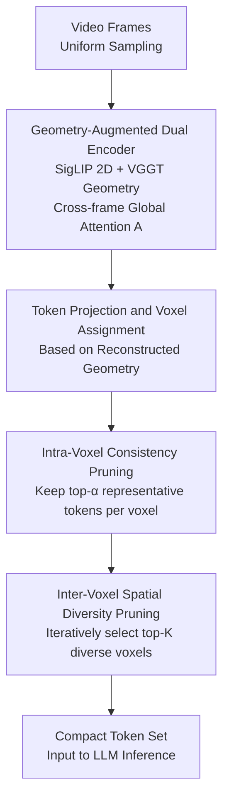

# Geometry-Guided 3D Visual Token Pruning for Video-Language Models

**Conference**: CVPR 2026  
**arXiv**: [2604.18260](https://arxiv.org/abs/2604.18260)  
**Code**: https://github.com/homothetic/Geo3DPruner (To be released)  
**Area**: 3D Vision / Multimodal VLM / LLM Efficiency  
**Keywords**: 3D scene understanding, visual token pruning, geometry-guided, multi-view consistency, VideoLM

## TL;DR
When treating a 3D scene as a "multi-view spatial video" for input into a VideoLM, thousands of redundant visual tokens are generated. This paper proposes Geo3DPruner, which utilizes the cross-frame global attention of the VGGT geometry encoder to perform a two-stage pruning process: intra-voxel (to remove multi-view redundancy) and inter-voxel (to preserve spatial diversity). The method prunes 90% of tokens while retaining approximately 92% of the original performance, significantly outperforming general pruning methods like FastV and VisPruner.

## Background & Motivation

**Background**: Enabling Multimodal Large Language Models (MLLMs) to understand 3D scenes is a key step toward spatial intelligence. However, native 3D data such as point clouds or meshes are scarce. Recent works (e.g., Video-3D LLM, VG LLM) adopt a "3D spatial video" representation—capturing scenes as a sequence of image frames with camera poses and depth. This allows direct reuse of 2D visual knowledge from VideoLMs pre-trained on massive image-text datasets for 3D reasoning.

**Limitations of Prior Work**: This video-based representation leads to a token explosion. For instance, 16 frames generate 3,136 visual tokens, and 32 frames double that to 6,272. Increasing the frame count or resolution to cover full scenes causes inference overhead to skyrocket. Existing training-free pruning methods are either text-guided (e.g., FastV, based on cross-attention between tokens and query text) or vision-guided (e.g., VisPruner, based on [CLS] or self-attention visual saliency), but they operate only within a single frame or adjacent temporal frames.

**Key Challenge**: 3D spatial video is essentially a multi-view projection of the same 3D scene. The same object (e.g., a wooden table, a swivel chair) appears repeatedly across arbitrary frames. Pruning methods constrained by temporal locality fail to recognize this "any-to-any frame" view consistency and cannot eliminate such global redundancy. Furthermore, by focusing only on visual saliency or text relevance, they neglect the spatial diversity of retained tokens. In dense 3D scenes, pruning tends to concentrate tokens on a single salient object, losing other regions, which is fatal for object-centric tasks like 3D dense captioning and 3D grounding.

**Goal**: To develop a training-free pruner for 3D scene understanding in VideoLMs that eliminates multi-view redundancy across frames while preserving the spatial integrity of the entire scene.

**Key Insight**: Since the root cause is the lack of global 3D geometric modeling, a 3D geometry encoder (VGGT) is introduced. The geometric correspondences naturally captured by its cross-frame global attention guide the pruning: multi-view features at the same spatial position can be aggregated, while voxels at different spatial positions should be spread out to ensure coverage.

**Core Idea**: Use the cross-frame global attention of a 3D geometry encoder to align visual features with voxels, followed by a two-stage pruning process: "intra-voxel view redundancy removal + inter-voxel spatial diversity preservation."

## Method

### Overall Architecture

Geo3DPruner is built upon Video-3D LLM (based on LLaVA-Video 7B, using SigLIP as the 2D encoder and Qwen2-7B as the LLM), but replaces its handcrafted 3D positional embeddings with geometric features extracted by VGGT (following the approach of VG LLM). The input consists of uniformly sampled video frames, and the output is a reduced set of visual tokens for the LLM. Two parallel encoding paths and two-stage pruning are employed: the 2D encoder extracts image features $\mathbf{E}_s$, while the 3D geometry encoder (VGGT) extracts geometric features $\mathbf{G}_s$ and models long-range cross-frame dependencies via global attention. These are combined into geometry-augmented features $\mathbf{F}_s = \mathbf{E}_s + \mathbf{G}_s$. Based on the reconstructed 3D geometry, each token is projected and assigned to a voxel. Subsequently, Intra-Voxel Consistency Pruning (VCP) selects representative tokens per voxel, and Inter-Voxel Spatial Diversity Pruning (SDP) selects a diverse subset of voxels. This preserves 3D structural integrity under a strict token budget. The process is training-free and plug-and-play during inference, with VGGT parameters frozen.

### Key Designs

**1. Geometry-Augmented Dual Encoder and Cross-frame Global Attention: Empowering Pruning with a "Global 3D Perspective"**

General pruning methods fail to remove multi-view redundancy because they lack cross-frame geometric correspondence. This method adds a parallel 3D geometry encoder branch (VGGT-1B, frozen) alongside the 2D branch (SigLIP). During the forward pass, it uses global attention layers to model long-range dependencies between all frame patches, jointly predicting camera parameters $\mathbf{C}_s \in \mathbb{R}^9$ (deriving extrinsic $\mathbf{R}_s, \mathbf{T}_s$ and intrinsic $\mathbf{Y}_s$) and depth maps $\mathbf{D}_s$. It generates a global attention map $\mathbf{A} \in \mathbb{R}^{N \times N}$, where $N = S \times H_p \times W_p$ is the total number of patches across all frames. Geometric features are fused as $\mathbf{F}_s = \mathbf{E}_s + \mathbf{G}_s$. This attention map $\mathbf{A}$ serves as the sole "judge" for the two-stage pruning, as it naturally encodes which patches across frames correspond to the same geometric structure. An ablation study shows that replacing $\mathbf{A}$ with simple cosine similarity (Sim.) drops average performance from 94.0% to 89.9%, demonstrating that adaptive attention is superior for capturing geometric consistency.

**2. Intra-Voxel Consistency Pruning (VCP): Retaining the Most Representative Observations for Each Spatial Position**

The first stage addresses the redundancy caused by the same 3D position appearing in multiple frames. Using the camera parameters from VGGT, each pixel token $(u_s, v_s)$ is projected into world coordinates via inverse camera projection and assigned to a voxel based on a preset size $\delta=0.1\text{m}$. For a voxel $k$ with token indices $\mathcal{T}_k$ ($|\mathcal{T}_k|=N_k$), a sub-matrix $\mathbf{A}_k = \mathbf{A}[\mathcal{T}_k, \mathcal{T}_k]$ is extracted from the global attention map. The contribution score for token $i$ is defined as the average attention it receives:

$$a_i = \frac{1}{N_k} \sum_{j \in \mathcal{T}_k} \mathbf{A}_k[j, i]$$

$a_i$ measures how "necessary" token $i$ is compared to other multi-view features in the same voxel. VCP retains only the top-$\alpha$ ($\alpha=50\%$) tokens by contribution score. This compresses redundant observations of the same 3D location into the most informative representatives. Using VCP alone achieves 89.4% performance, as it ensures spatial coverage but leaves intra-voxel features too sparse.

**3. Inter-Voxel Spatial Diversity Pruning (SDP): Iteratively Selecting Voxels to Cover the Entire Scene**

The second stage addresses the problem where salient objects dominate selection in dense 3D scenes, causing "intra-object bias." Simply pruning voxels based on global importance results in tokens being clustered on a single salient object while other regions are discarded. SDP models voxel-level pruning as a subset selection problem. Given voxels $k$ and $l$, the cross-voxel attention sub-matrix is $\mathbf{A}_{k \to l} = \mathbf{A}[\mathcal{T}_k, \mathcal{T}_l]$. Summing over rows and averaging over columns gives $a_{k \to l} = \frac{1}{|\mathcal{T}_k|} \sum_j \sum_i \mathbf{A}_{k \to l}(j,i)$. The global attention received by voxel $l$ is $a_l = \sum_k a_{k \to l}$. Instead of a simple top-K selection, a heuristic iteration is used: in each round, the top-$K$ ($K=8$) most salient voxels from the candidates $\mathcal{V} \setminus \mathcal{W}$ are added to the selected set $\mathcal{W}$. **The attention is then recalculated only among unselected voxels** until the budget is met. This recalculation step is crucial—it removes the "self-reinforcing attention" of already selected objects, forcing the next round to consider different instances and thereby spreading tokens across various objects and regions.

### Loss & Training
The method is training-free. VGGT remains frozen, and the training settings for Video-3D LLM (optimizer, learning rate, schedule) follow its official open-source configuration. Pruning is only applied during inference. Frames are resized and center-cropped to $384 \times 384$. Voxel size $\delta = 0.1\text{m}$, VCP retention ratio $\alpha = 50\%$, and SDP selects $K=8$ voxels per round.

## Key Experimental Results

Datasets are derived from ScanNet (1,513 indoor scenes), covering three task types: 3D Visual Grounding (ScanRefer, Multi3DRefer), 3D Dense Captioning (Scan2Cap), and 3D Question Answering (ScanQA, SQA3D). "Avg." represents the mean percentage of retained performance across nine metrics.

### Main Results (16 frames, 3,136 tokens, increasing pruning ratio)

| Pruning Setup | Method | ScanRefer Acc@0.5 | Scan2Cap CIDEr@0.5 | SQA3D EM | Avg. |
|---------|------|------|------|------|------|
| Unpruned (3136) | Video-3D LLM† | 52.3 | 85.3 | 59.3 | 100% |
| Keep 1280 (↓60%) | FastV | 49.6 | 73.1 | 57.6 | 94.5% |
| Keep 1280 (↓60%) | VisPruner | 49.7 | 73.9 | 58.9 | 95.7% |
| Keep 1280 (↓60%) | **Geo3DPruner** | **52.0** | **85.1** | **59.3** | **98.9%** |
| Keep 640 (↓80%) | VisPruner | 48.3 | 66.6 | 56.7 | 91.6% |
| Keep 640 (↓80%) | **Geo3DPruner** | **51.1** | **82.9** | **58.1** | **96.1%** |
| Keep 320 (↓90%) | FastV | 45.8 | 53.0 | 53.5 | 81.0% |
| Keep 320 (↓90%) | VisPruner | 46.8 | 57.3 | 54.6 | 84.9% |
| Keep 320 (↓90%) | **Geo3DPruner** | **49.4** | **80.3** | **55.7** | **92.1%** |

At 32 frames (6,272 tokens), the trend is consistent: with 640 tokens remaining (↓90%), Geo3DPruner retains 92.0% performance, while FastV/VisPruner retain only 82.4%/84.8%. The gap is particularly significant in object-centric tasks like Scan2Cap.

### Ablation Study (16 frames, 90% pruning ratio)

| Configuration | ScanRefer | Scan2Cap | SQA3D | Avg. | Mechanism |
|------|------|------|------|------|------|
| VCP only | 52.5 | 76.7 | 52.7 | 89.4% | Broad coverage but sparse intra-voxel features |
| SDP only | 53.3 | 77.7 | 54.6 | 91.3% | Excessive voxel removal without intra-redundancy check |
| VCP + SDP | 55.2 | 80.3 | 55.7 | 94.0% | Complementary and optimal |
| SDP -> Random Voxel Selection | 53.0 | 61.4 | 55.4 | 85.2% | Naive subset selection |
| SDP -> Uniform Sampling | 53.2 | 62.0 | 55.0 | 85.4% | Naive subset selection |
| Similarity via Cosine | 52.9 | 76.4 | 53.3 | 89.9% | Replacing global attention |

### Key Findings
- **Two-stage Complementarity**: VCP (89.4%) ensures positional coverage, while SDP (91.3%) prevents excessive voxel loss. Combining them (94.0%) proves that removing intra-voxel redundancy before ensuring inter-voxel diversity is the correct sequence.
- **Importance of Recalculating Attention**: Replacing SDP with random or uniform selection drops performance to ~85%, indicating that gains come from diversity-aware iterative selection rather than voxel granularity itself.
- **Attention > Similarity**: Using the VGGT global attention map outperforms geometric feature cosine similarity by 4.1% (94.0% vs 89.9%), highlighting the adaptive nature of attention in emphasizing geometric consistency.
- **Light Pruning vs. Baseline**: With a 20% pruning ratio at 32 frames, the performance slightly exceeds the unpruned baseline, suggesting that removing redundant/noisy tokens results in a more compact and effective representation.

## Highlights & Insights
- **Redefining Pruning as 3D Geometric Subset Selection**: Moves beyond 2D saliency-based pruning by anchoring tokens to voxels and optimizing for both view redundancy and spatial coverage.
- **Repurposed Geometry Encoder Attention**: Leverages the intermediate attention map from VGGT as a "free judge." Since the attention is already computed for geometric reconstruction, pruning adds zero computational overhead for attention modeling.
- **Inhibition of Intra-object Bias**: The iterative recalculation of attention serves as a greedy decorrelation mechanism, preventing tokens from clustering on a single salient object.
- **Zero Training Cost**: Requires no modification to the base model or the VGGT encoder, ensuring low deployment cost.

## Limitations & Future Work
- **Dependency on Geometry Quality**: The method relies heavily on VGGT's reconstructed parameters. Performance may degrade in scenes with poor geometry estimation (e.g., low texture, large outdoor areas, dynamic objects).
- **VGGT-1B Overhead**: While LLM input tokens are reduced, the system must still run a 1B-parameter geometry encoder. The end-to-end net acceleration ratio (including the VGGT branch) was not reported.
- **Empirical Hyperparameters**: Voxel size $\delta$, $\alpha$, and $K$ are fixed. Sensitivity analysis for these parameters across different scene scales is lacking.

## Related Work & Insights
- **Comparison with FastV**: FastV prunes based on token attention to the query text after layer 2. Geo3DPruner utilizes cross-frame geometric attention to handle multi-view redundancy, outperforming FastV by ~11% at 90% pruning.
- **Comparison with VisPruner**: VisPruner uses visual saliency and token similarity but lacks global 3D modeling, leading to token clustering in object-centric tasks. SDP in this work explicitly preserves spatial diversity.
- **Integration with VG LLM**: While VG LLM uses geometric features for positional encoding, this work is among the first to use the geometry encoder's attention map for pruning.

## Rating
- Novelty: ⭐⭐⭐⭐ Innovative use of cross-frame geometric attention for VideoLM pruning with a clear two-stage decomposition.
- Experimental Thoroughness: ⭐⭐⭐⭐ Comprehensive coverage of benchmarks and frame counts; however, lacks end-to-end latency analysis including VGGT overhead.
- Writing Quality: ⭐⭐⭐⭐ Logical flow from motivation to method; clear explanation of the two-stage strategy.
- Value: ⭐⭐⭐⭐ Training-free and plug-and-play, providing a practical paradigm for 3D VideoLM efficiency.

<!-- RELATED:START -->

## Related Papers

- [\[CVPR 2026\] MonoVLM: Monocular 3D Visual Grounding with Vision Language Models](monovlm_monocular_3d_visual_grounding_with_vision_language_models.md)
- [\[CVPR 2026\] Fast SceneScript: Fast and Accurate Language-Based 3D Scene Understanding via Multi-Token Prediction](fast_scenescript_fast_and_accurate_language-based_3d_scene_understanding_via_mul.md)
- [\[CVPR 2026\] Aligning Text, Images and 3D Structure Token-by-Token](aligning_text_images_and_3d_structure_token-by-token.md)
- [\[CVPR 2026\] Emergent Extreme-View Geometry in 3D Foundation Models](emergent_extreme-view_geometry_in_3d_foundation_models.md)
- [\[CVPR 2026\] DVGT: Driving Visual Geometry Transformer](dvgt_driving_visual_geometry_transformer.md)

<!-- RELATED:END -->
