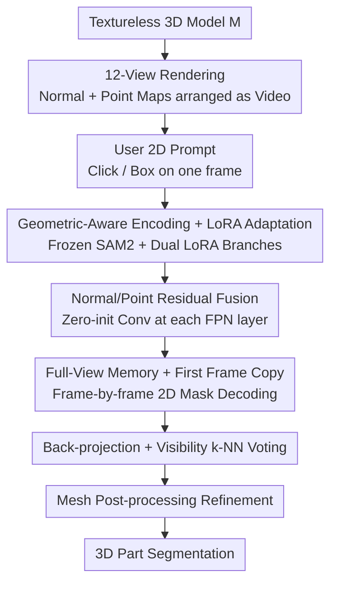

# GeoSAM2: Unleashing the Power of SAM2 for 3D Part Segmentation

**Conference**: CVPR 2026  
**Paper**: [CVF Open Access](https://openaccess.thecvf.com/content/CVPR2026/html/Deng_GeoSAM2_Unleashing_the_Power_of_SAM2_for_3D_Part_Segmentation_CVPR_2026_paper.html)  
**Code**: To be confirmed  
**Area**: 3D Vision  
**Keywords**: 3D Part Segmentation, SAM2, Multi-view Segmentation, LoRA, Interactive Prompt  

## TL;DR
GeoSAM2 reformulates part segmentation of textureless 3D models as a "multi-view 2D mask prediction" task: it renders normal and point maps from 12 viewpoints, allows users to provide 2D prompts (clicks/boxes) in any view, predicts masks frame-by-frame using a shared SAM2 backbone with LoRA and geometric residual fusion, and finally back-projects these masks into 3D using visibility-aware voting to achieve class-agnostic SOTA on PartObjaverse-Tiny and PartNetE at a speed of approximately 30 seconds per object.

## Background & Motivation
**Background**: 3D part segmentation is a fundamental component for robot manipulation, 3D generation, and interactive editing. Since fine-grained 3D part annotations are extremely expensive and scarce, the mainstream approach has shifted towards zero-shot or weakly supervised methods. The core idea is to leverage powerful 2D vision foundation models (SAM, DINOv2, GLIP, etc.) to process multi-view renderings and "lift" the results back to 3D.

**Limitations of Prior Work**: The authors categorize existing methods into two types, both with significant drawbacks. One category consists of "global scale/clustering" based methods (SAMPart3D, PartField): SAMPart3D uses a continuous scale knob to control granularity, but this knob is highly unintuitive—adjusting the scale often leads to unpredictable segments without semantic basis, and it requires per-shape MLP fitting taking several minutes per object. PartField, while fast in its feed-forward pass, can only adjust granularity crudely via a fixed number of clusters and assumes every region of an object should be labeled. The other category involves lifting 2D mask proposals (SAMesh): it aggregates multi-view masks from SAM2 onto a mesh using community detection or iterative optimization, which also takes minutes for post-processing and lacks any mechanism for querying a "specific part."

**Key Challenge**: Existing pipelines are either "fast but uncontrollable" (PartField) or "expressive but slow" (SAMPart3D, SAMesh). More fundamentally, no method truly aligns **2D interactions** with **3D part results**—the control signals from users are global and coarse, failing to express the precise intent of "I want this specific part."

**Key Insight**: The authors note that SAM2 is inherently designed for "promptable video segmentation"—it naturally supports point/box prompts and possesses cross-frame memory for temporal consistency. By arranging multi-view renderings into a "video" sequence, 3D part segmentation can directly adopt the interactive and trackable paradigm of SAM2, turning explicit, spatially locatable, and interpretable 2D prompts into aligned 3D labels.

**Core Idea**: Reformulate part segmentation of textureless 3D models as "multi-view 2D mask prediction + back-projection aggregation," utilizing a geometrically modified shared SAM2 backbone to process 12-view normal/point map videos, where 2D prompts directly drive 3D part selection.

## Method

### Overall Architecture
Given a textureless 3D model $M$, GeoSAM2 first renders $N=12$ normal maps $\{I_i\}$ and corresponding point maps $\{\Pi_i\}$ from predefined camera poses $\{P_i\}_{i=1}^{N}$, arranged counter-clockwise by azimuth into a 12-frame "video." The user provides a 2D prompt (click or box) on any frame, which serves as the starting frame of the video. The normal and point maps of each frame are encoded by a **frozen SAM2 image encoder (fine-tuned with LoRA)**. **Normal/point map residual fusion** is performed at each layer of the FPN, and the mask decoder then solves for the 2D mask of that view. To ensure cross-view consistency, embeddings from all views are retained in a **full-view memory bank** (bootstrapped by copying the first frame). Finally, the frame-by-frame 2D masks are back-projected to the 3D point cloud using camera poses, and a **visibility-aware k-NN voting** is applied to assign consistent labels. For mesh-based models, post-processing refinement involving small connected component removal and label smoothing is performed.

### Key Designs

**1. Geometric-aware encoding + LoRA adaptation: Enabling RGB-pretrained SAM2 to understand textureless geometry**

SAM2 is trained in the RGB domain and relies heavily on appearance and texture cues, which are absent in textureless renderings like normal maps. Furthermore, the large view jumps and complex occlusions between sparse multi-views make establishing cross-view correspondences more difficult than in dense video frames. The authors inject geometric structure directly: alongside the normal map, each view is paired with a point map $\Pi_i$—projecting the depth map back to world coordinates via camera parameters, where each pixel $(u,v)$ obtains a 3D coordinate $x_i(u,v)=D_i(u,v)\cdot K^{-1}[u,v,1]^T R_i^{-1}-R_i^{-1}t_i$. This point map encodes view-consistent spatial structure, aiding in disambiguation and cross-view correspondence reasoning. To avoid the high cost and potential destruction of pre-trained priors associated with full fine-tuning, the authors use LoRA to update only a low-rank subspace: for any linear layer weights $W_0\in\mathbb{R}^{m\times n}$, trainable matrices $A\in\mathbb{R}^{m\times r}$ and $B\in\mathbb{R}^{r\times n}$ are introduced such that the adapted weights are $W=W_0+AB$ ($r\ll\min(m,n)$). During the forward pass, $Wf=W_0f+A(Bf)$, while $W_0$ remains frozen. Crucially, **independent LoRA branches** are created for the normal and point maps, and injecting LoRA into each transformer block is sufficient to guide SAM2 to the geometric modality.

**2. Normal/Point residual fusion: Preserving RGB statistics while progressively absorbing geometric cues**

Normal map features are closer to RGB textures and better match the pre-trained statistics of the SAM2 backbone; point map features provide strong geometric cues but can introduce distribution shifts if fused directly. The authors propose a "conservative initialization, progressive adaptation" residual fusion: at each resolution layer of the FPN, the aligned normal features $G_i\in\mathbb{R}^{H\times W\times C}$ and point map features $P_i$ are concatenated along the channel dimension as $X_i=[G_i\,\|\,P_i]\in\mathbb{R}^{H\times W\times 2C}$. These are passed through a **zero-initialized** $3\times3$ convolution to obtain $Y_i=\mathrm{Conv}_{3\times3}(X_i;W{=}0)$, which is then residually added back to the normal features $\hat{G}_i=G_i+Y_i$.

$$\hat{G}_i = G_i + \mathrm{Conv}_{3\times3}\big([\,G_i\,\|\,P_i\,];\,W{=}0\big)$$

Since the initial convolutional weights are zero, $Y_i\equiv0$ at the start of training, and the network relies entirely on normal features, preventing sudden changes in feature distribution. Gradients then gradually shape the contribution of the point map branch. This fusion is applied independently at each FPN layer. Ablations show that replacing this with a naive convolution (i.e., w/o feature fusion) significantly degrades detail quality.

**3. Full-view memory + First-frame copy: Adapting video FIFO memory for multi-view guided memory**

SAM2 originally uses a fixed-size FIFO memory bank to retain recent frames, assuming adjacent frames are redundant and transition smoothly. The multi-view setting is the opposite: each view carries unique and complementary geometric information, and discarding early views causes irreversible information loss. The authors restructure the memory mechanism to **retain embeddings for all views**: 12 views are uniformly distributed in azimuth across three elevations ($25^\circ$, $0^\circ$, $-25^\circ$), ensuring complete geometric coverage. The model can reference all previous views to reason about occlusions and part boundaries. Additionally, the authors observed an interesting phenomenon: the segmentation quality of the first sequence frame is poor because the memory bank is initially empty and relies solely on sparse prompts; however, quality improves significantly once the memory is filled. This suggests the memory bank acts as an implicit guidance mechanism in addition to ensuring temporal consistency. Accordingly, a minimalist **bootstrap** is proposed: the first frame is copied before formal processing, immediately providing the model with a meaningful memory prior, which markedly improves starting frame quality and makes subsequent view masks sharper and more coherent.

**4. Mesh post-processing refinement: Cleanly mapping multi-view masks to each face**

An initial 3D mask is obtained after back-projecting frame-by-frame 2D masks into 3D. For mesh models, mesh connectivity can be further utilized for refinement. Borrowing from SAMesh, the post-processing involves two steps: (1) Removing small connected components with an area smaller than $A_{\text{mesh}}=PA_{\text{mesh}}\cdot N_{\text{faces}}$ (e.g., $PA_{\text{mesh}}=0.01$); (2) Smoothing mesh labels—iteratively smoothing face labels based on connectivity (this step is time-consuming and optional), and then using K-Nearest Neighbor voting for remaining unlabeled faces to ensure every face has a label. Since 3D labels are strictly aligned with 2D masks, this post-processing does not force every face to carry a label, thus maintaining accuracy on partially annotated datasets like PartNetE.

### Loss & Training
Most SAM2 parameters are frozen, with training focused on two rank=4 LoRA modules (added to all Q/K/V attention layers) and the feature fusion blocks (3 layers of $3\times3$ convolutions). To ensure SAM2's predicted masks fit the scale of the dataset masks, an IoU prediction head is also trained. The SAM2 base+ version is fine-tuned for 50 epochs on a self-annotated dataset of approximately 4700 objects using 8 A800 GPUs, a batch size of 8, and a learning rate of 5e-5. The loss follows the original SAM2 loss; for training stability, the feature fusion convolutional layers are zero-initialized.

## Key Experimental Results

### Main Results
Class-agnostic part segmentation measured by mean IoU (%). GeoSAM2 significantly leads across two benchmarks and is much faster than slow optimization-based methods.

| Dataset | Metric | GeoSAM2 | Prev. SOTA | Gain |
|--------|------|---------|----------|------|
| PartObjaverse-Tiny | Avg. mIoU | 84.06 | 79.18 (PartField) | +4.88 |
| PartNetE | Avg. mIoU | 74.42 | 59.10 (PartField) | +15.32 |

Runtime Comparison (PartNetE):

| Method | Avg. mIoU | Runtime |
|------|-----------|----------|
| Find3D | 21.69 | ~10s |
| SAMesh | 26.66 | ~7min |
| SAMPart3D | 56.17 | ~15min |
| PartField | 59.10 | ~10s |
| GeoSAM2 (Ours) | **74.42** | ~30s |

### Ablation Study
Incremental addition of components (mean IoU, %):

| Configuration | PartObjaverse-Tiny | PartNetE | Description |
|------|--------------------|----------|------|
| Vanilla SAM2 | 62.59 | 66.55 | Running SAM2 directly on normal maps; poor tracking |
| w/o point map | 75.56 | 71.26 | LoRA fine-tuning on normals only; bridges RGB-geometry gap |
| w/o feature fusion | 81.39 | 72.25 | Point map added via kernel=1 naive injection; lacks detail |
| Full (Ours) | **84.06** | **74.42** | Complete residual fusion |

### Key Findings
- **The step-by-step improvement from Vanilla SAM2 to Full shows that three elements are indispensable**: LoRA fine-tuning (+13 on PartObjaverse-Tiny) bridges the domain gap between RGB and normal distributions; point maps resolve spatial ambiguity and aid tracking; residual fusion enhances detail quality.
- **Mesh connectivity priors are a double-edged sword**: SAMesh and PartField suffer a 20%–30% mIoU collapse from PartObjaverse-Tiny to PartNetE, exposing their heavy reliance on mesh connectivity; GeoSAM2 drops slightly when deprived of mesh priors but still leads all baselines by a large margin.
- **Value of first-frame copy**: When the memory bank is empty, the first frame quality is poor. Providing a memory prior via copying the first frame results in sharper masks for both the starting and subsequent frames (verified qualitatively in Figure 6 of the paper).
- **Generalizable to generative models**: The authors extended the method to 3D models generated by TripoSR, etc., for hierarchical segmentation; even with blurred geometric boundaries, it maintains clear part awareness. It can also be combined with 3D part completion models like HoloPart to achieve zero-shot 3D amodal part segmentation.

## Highlights & Insights
- **The paradigm shift of "treating multi-view as video" is clever**: It does not involve training another 3D network but rather reuses the existing promptable and memory tracking capabilities of SAM2, aligning "explicit, spatially locatable, and interpretable" 2D interactions 1:1 with 3D labels—compared to global coarse controls like scale knobs, users can accurately specify "I want this part."
- **Zero-initialized residual fusion is a reusable trick**: When introducing a new modality (point map) into a pre-trained backbone, using zero-initialized convolutions allows the new branch to transition from "no effect" to progressively meaningful, avoiding distribution shifts that destroy pre-trained statistics—this can be transferred to any scenario involving adding new input modalities to frozen foundation models.
- **"Memory as guidance" observation**: Realizing that SAM2's memory bank acts as an implicit guide beyond temporal consistency and exploiting it with the low-cost "first-frame copy" is a classic example of "observing a phenomenon and extracting maximum benefit with minimal means."

## Limitations & Future Work
- **Reliance on rendering view coverage**: While fixed 12 views (3 elevations × azimuths) suffice for most objects, whether they provide complete coverage for deep internal cavities or strong self-occlusions is not fully discussed ⚠️ Refer to the original text.
- **Prompts still require human input**: Although 2D prompts are more intuitive than scale knobs, fine-grained segmentation still requires users to select parts across views; the evaluation used GT masks from the front view as prompts to simulate "precise user input," and real-world interaction costs/robustness require further validation.
- **Performance drop without mesh connectivity priors**: While still SOTA on the point-cloud-only PartNetE, there is a decrease compared to the mesh-structured PartObjaverse-Tiny, indicating some reliance of post-processing on mesh structures.
- **Future directions**: Automatic prompt generation (using another model to propose candidate parts for SAM2), adaptive view selection, and extending point map fusion from the FPN residuals to the decoder side are natural progressions.

## Related Work & Insights
- **vs SAMPart3D**: It distills multi-view DINOv2 features into a 3D encoder via 3D pre-training but still requires per-shape fine-tuning (minutes) and can only control granularity globally via a scale knob; GeoSAM2 avoids per-shape optimization, uses precise 2D local control, and has inference times of ~30s.
- **vs PartField**: It predicts feature fields on point clouds via triplanes followed by clustering; while feed-forward is fast, it only allows crude adjustments via a fixed number of clusters and assumes all regions are labeled; GeoSAM2 is similarly fast but provides pixel-level precise control and does not force labels on every face.
- **vs SAMesh**: Both lift SAM2 multi-view masks to 3D, but SAMesh relies on community detection/iterative optimization (minutes), lacks part-specific queries, and tends toward over-segmentation; GeoSAM2 uses memory tracking and back-projection voting, making it interactive, faster, and more controllable.
- **vs Find3D**: This is a feed-forward alignment method with text input, which shows significantly lower accuracy in open-world semantic settings (Avg. 21.28); GeoSAM2 follows a class-agnostic interactive route and is much more accurate.

## Rating
- Novelty: ⭐⭐⭐⭐⭐ Reformulates 3D part segmentation as promptable multi-view SAM2 video segmentation; clean paradigm that aligns 2D interactions with 3D results.
- Experimental Thoroughness: ⭐⭐⭐⭐ Two benchmarks + speed comparison + step-by-step ablation + generative model generalization, though evaluation of prompt robustness/interaction cost is idealized.
- Writing Quality: ⭐⭐⭐⭐ Clear chain of motivation and methodology; formulas are well-placed; some notations and post-processing details require supplemental material.
- Value: ⭐⭐⭐⭐⭐ Fast, controllable, and accurate; can be directly combined with generation/completion models; high practical value for 3D editing and generation pipelines.

<!-- RELATED:START -->

## Related Papers

- [\[CVPR 2026\] Unleashing the Power of Chain-of-Prediction for Monocular 3D Object Detection](unleashing_the_power_of_chain-of-prediction_for_monocular_3d_object_detection.md)
- [\[CVPR 2026\] MSGNav: Unleashing the Power of Multi-modal 3D Scene Graph for Zero-Shot Embodied Navigation](msgnav_unleashing_the_power_of_multi-modal_3d_scene_graph_for_zero-shot_embodied.md)
- [\[AAAI 2026\] 3DTeethSAM: Taming SAM2 for 3D Teeth Segmentation](../../AAAI2026/3d_vision/3dteethsam_taming_sam2_for_3d_teeth_segmentation.md)
- [\[CVPR 2026\] S2AM3D: Scale-controllable Part Segmentation of 3D Point Clouds](s2am3d_scale-controllable_part_segmentation_of_3d_point_cloud.md)
- [\[CVPR 2026\] Part$^{2}$GS: Part-aware Modeling of Articulated Objects using 3D Gaussian Splatting](part2gs_part-aware_modeling_of_articulated_objects_using_3d_gaussian_splatting.md)

<!-- RELATED:END -->
