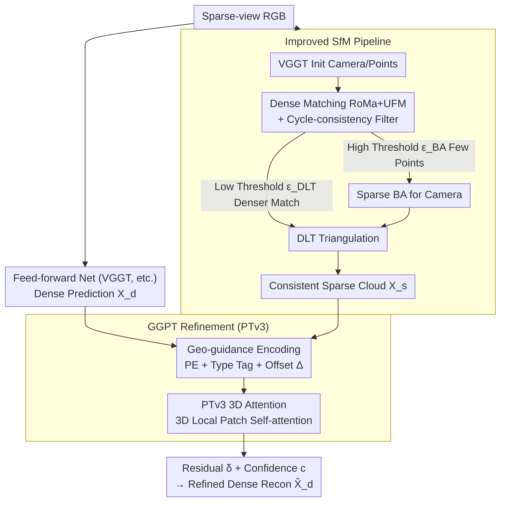

# GGPT: Geometry-Grounded Point Transformer

**Conference**: CVPR 2026  
**arXiv**: [2603.11174](https://arxiv.org/abs/2603.11174)  
**Code**: [Available](https://chenyutongthu.github.io/research/ggpt)  
**Area**: 3D Vision / 3D Reconstruction  
**Keywords**: sparse-view 3D reconstruction, Point Transformer, SfM, feed-forward, multi-view geometry  

## TL;DR

Proposes the GGPT framework: obtains geometrically consistent sparse point clouds via an improved lightweight SfM pipeline (dense matching + sparse BA + DLT triangulation), then utilizes 3D Point Transformer V3 to directly fuse sparse geometric guidance with feed-forward dense predictions in 3D space for residual refinement. Trained solely on ScanNet++, it significantly improves various feed-forward 3D reconstruction models across architectures and datasets.

## Background & Motivation

**Background**: Feed-forward 3D reconstruction networks (DUSt3R → MASt3R → VGGT) can predict dense point maps and camera parameters in a single pass with high speed and good visual quality. however, the lack of explicit multi-view constraints leads to geometric inconsistency, particularly in out-of-distribution scenes (medical/surgical/human body).

**Limitations of Prior Work**: (1) SfM is geometrically consistent but fragile under wide-baseline/sparse-view conditions and only restores sparse points; (2) Previous methods for fusing geometric guidance depend on pseudo-GT SfM points or dense video sequences, which are unavailable in real sparse scenarios; (3) Existing refinement methods operate in 2D image space (depth completion/image Transformers) and cannot achieve true cross-view consistency.

**Key Challenge**: Feed-forward predictions are dense but inconsistent, while SfM is consistent but sparse—existing methods either rely on unrealistic GT guidance or fail to guarantee 3D consistency via 2D space refinement.

**Goal**: To organically combine the geometric accuracy of SfM with the dense completeness of feed-forward networks in 3D space, achieving sparse-view 3D reconstruction refinement that generalizes across architectures without fine-tuning.

**Key Insight**: A two-stage approach—first obtaining ground-truth sparse geometry from input RGB via an improved SfM, then performing attention and residual correction directly in point cloud space using a 3D Point Transformer.

**Core Idea**: Performing geometric fusion refinement in 3D space rather than 2D image space is the key to cross-domain generalization.

## Method

### Overall Architecture

GGPT aims to bridge the contradiction between feed-forward networks (dense but inconsistent) and traditional SfM (consistent but sparse and fragile). It proposes a two-stage pipeline. The first stage is an improved lightweight SfM: it initializes cameras and points using a feed-forward model, obtains global correspondences via a dense matcher (RoMa + UFM) with cycle-consistency filtering, and then performs sparse BA (only 2048 points/view) for camera estimation and DLT triangulation for a geometrically consistent sparse point cloud $\mathbf{X}_s$. The second stage is GGPT: it encodes the offsets between feed-forward dense predictions $\mathbf{X}_d$ and corresponding sparse guidance points, then processes $\mathbf{X}_d$ and $\mathbf{X}_s$ jointly in a global 3D coordinate system using Point Transformer V3 (53M parameters) to predict residual displacement $\boldsymbol{\delta}$ and confidence $c$, outputting the refined dense reconstruction $\hat{\mathbf{X}}_d$.

### Key Designs

**1. Improved SfM Pipeline: Obtaining Geometrically Consistent Sparse Point Clouds from Sparse RGB**

Traditional SfM is fragile under sparse views, while prior fusion methods rely on pseudo-GT or dense sequences. GGPT uses a feed-forward model (VGGT) for initialization, dense feature matching (RoMa+UFM) to obtain a correspondence tensor $\mathbf{T} \in \mathbb{R}^{N \times N \times W \times H \times 2}$, and cycle-consistency filtering. It separates non-linear optimization and linear triangulation using two confidence thresholds $\epsilon_{BA} > \epsilon_{DLT}$. Sparse BA uses very few high-confidence points to estimate cameras accurately, while DLT triangulation uses a denser subset for efficient linear reconstruction of 3D points.

**2. Geometry-Grounded Encoding: Feeding "Prediction vs. Geometric Prior Difference" to the Network**

Inputting sparse point clouds alone is insufficient; the network must know where to refine. The embedding for a dense point $\mathbf{x}_d$ consists of four parts: its own positional encoding $\text{PE}(\mathbf{x}_d)$, a type tag $\mathbf{e}_{type(d)}$, the positional encoding of the corresponding sparse guidance point $\text{PE}(\mathbf{x}_{d \to s})$, and the offset $\Delta_{d \to s} = \mathbf{x}_{d \to s} - \mathbf{x}_s$. The offset $\Delta_{d \to s}$ explicitly encodes how much correction is needed, which is the most critical component for refinement.

**3. Direct 3D Attention PTv3: Natural Cross-view Consistency via 3D Neighbors**

Previous refinement methods in 2D space are view-dependent. GGPT uses Point Transformer V3 (8 layers, 53M parameters) to perform patch-wise self-attention on 3D neighbors. Receptive fields are defined by spatial proximity rather than pixel coordinates, naturally ensuring multi-view consistency. To handle large scenes, it partitions the scene into overlapping cubic blocks (radius = 0.2 × scene radius), processing up to 400,000 points per block independently and averaging outcomes in overlap regions.

### Loss & Training

- **Confidence-weighted Regression**: $\mathcal{L}_{conf} = \sum c \|\hat{\mathbf{x}} - \mathbf{x}_{GT}\| - \alpha \log c$. This heteroscedastic form allows the model to automatically reduce weights in uncertain regions.
- **Identity Consistency**: $\mathcal{L}_{id} = \sum \|\hat{\mathbf{x}} - \mathbf{x}_{d \to s}\|$, encouraging dense points with correspondences to align with geometric guidance.
- Total loss $\mathcal{L} = \mathcal{L}_{conf} + \lambda_{id} \mathcal{L}_{id}$, where $\lambda_{id}=1, \alpha=0.2$.
- Training: 20k sequences from ScanNet++, one day on 8×GH200 GPUs.

## Key Experimental Results

### Main Results (AUC@5/10 cm ↑, 8 Views)

| Method | ScanNet++ | ETH3D | T&T |
|---|---|---|---|
| VGGT | 19/32 | 23/36 | 25/39 |
| VGGT + Ours | **45/60** | **47/61** | **42/57** |
| Pi3 | 56/71 | 25/41 | 26/42 |
| Pi3 + Ours | **56/72** | **36/53** | **32/50** |
| MapAnything | 38/57 | 7/15 | 9/20 |
| MapAnything + Ours | **48/64** | **33/45** | **40/55** |

### Ablation Study

| Ablation Item | ScanNet++ 4v | ETH3D 4v | Remarks |
|---|---|---|---|
| Full GGPT | 38/53 | 41/55 | Baseline |
| W/O $\mathbf{X}_s$ guidance | Learnable but OOD collapse | Significant drop | Guidance is indispensable |
| W/O Offset Encoding $\Delta_{d \to s}$ | Significant drop | Significant drop | Most critical component |
| 2D Transformer instead of PTv3 | Small gap in-domain | Large gap OOD | 3D attention generalization advantage |
| Patch r=0.1 vs 0.2 vs 0.5 | r=0.2 optimal | — | Small patches enhance generalization |

### Key Findings

- **Strong Out-of-Distribution Generalization**: Trained only on ScanNet++, it improves 5 models across 5 datasets without any fine-tuning.
- **Largest Gain for VGGT**: AUC@5 increased from 19 to 45 (+137%) on ScanNet++ and from 23 to 47 (+104%) on ETH3D.
- **Impressive OOD Data Performance**: On 4D-DRESS, VGGT AUC@1/5cm improved from 10/45 to 66/77 with Ours; on MV-dVRK, it improved from 8/33 to 45/61.
- **3D vs 2D Refinement**: PTv3 significantly outperforms 2D Transformer solutions on cross-domain data, representing a fundamental improvement.
- **SfM Ablation**: Dense matchers are much better than sparse matchers (MASt3R); DLT is hundreds of times faster than RANSAC triangulation with comparable accuracy; 512 points are sufficient for sparse BA.

## Highlights & Insights

- Performing geometric fusion in 3D space rather than 2D image space provides a fundamental advantage for cross-domain generalization.
- The design philosophy of "training a single configuration to improve multiple feed-forward methods without fine-tuning" is highly valuable.
- The separation strategy of sparse BA + DLT is elegant and efficient: non-linear optimization is reserved for high-confidence sparse points, while triangulation uses linear methods.
- The design of geometry-grounded encoding is clever: $\Delta_{d \to s}$ directly encodes the "correction amount," providing the network with a direct supervisory signal.

## Limitations & Future Work

- **SfM Error Propagation**: SfM and GGPT execute sequentially; if SfM fails (e.g., in textureless scenes), refinement cannot recover the geometry.
- **Patch Artifacts**: Block-wise processing may cause boundary discontinuities; while averaging overlap regions helps, it does not fully eliminate them.
- **Indoor Training Focus**: The model has not been validated on large-scale outdoor scenes or scenarios with more than 16 views.
- **Computational Overhead**: Requires additional execution of dense matchers and BA, increasing total inference time.

## Related Work & Insights

- **vs. DUSt3R/VGGT**: Feed-forward predictions are fast but inconsistent; GGPT serves as a universal post-processing module to provide geometric consistency.
- **vs. COLMAP**: Traditional incremental SfM is fragile under sparse views; the global SfM + dense matching used here is more robust and efficient.
- **vs. 2D Depth Completion**: Image space refinement has inherent view-dependent limitations; 3D space attention fundamentally solves cross-view consistency.
- **Insight**: The paradigm of 3D space processing > 2D image processing is worth validating in more tasks, such as multi-view fusion for semantic segmentation or object detection.

## Rating

⭐⭐⭐⭐⭐ (5/5)

**Reasoning**: The method is elegantly designed with a strong motivation (3D vs. 2D refinement). The experiments are exceptionally comprehensive (5 feed-forward methods across 5 datasets, including OOD medical/human data). Its generalization capability is impressive (universal improvement with a single configuration), and the ablation studies are thorough with clear conclusions. The designs of the improved SfM pipeline and the 3D Point Transformer are both independently valuable. This is high-quality work in the field of sparse-view 3D reconstruction.

<!-- RELATED:START -->

## Related Papers

- [\[CVPR 2026\] OmniVGGT: Omni-Modality Driven Visual Geometry Grounded Transformer](omnivggt_omni-modality_driven_visual_geometry_grounded_transformer.md)
- [\[CVPR 2026\] MVGGT: Multimodal Visual Geometry Grounded Transformer for Multiview 3D Referring Expression Segmentation](mvggt_multimodal_visual_geometry_grounded_transformer_for_multiview_3d_referring.md)
- [\[ICLR 2026\] Quantized Visual Geometry Grounded Transformer](../../ICLR2026/3d_vision/quantized_visual_geometry_grounded_transformer.md)
- [\[CVPR 2026\] DVGT: Driving Visual Geometry Transformer](dvgt_driving_visual_geometry_transformer.md)
- [\[CVPR 2025\] VGGT: Visual Geometry Grounded Transformer](../../CVPR2025/3d_vision/vggt_visual_geometry_grounded_transformer.md)

<!-- RELATED:END -->
