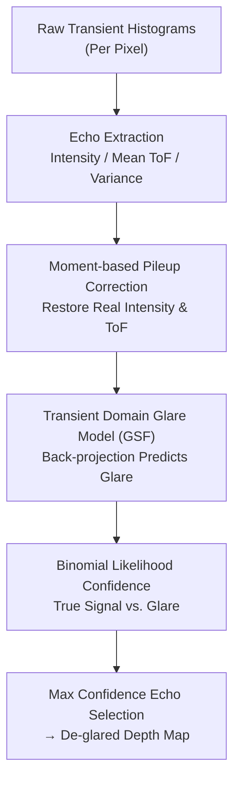

# Ghosts in the Point Clouds: De-glaring LiDAR in the Transient Domain

**Conference**: CVPR 2026  
**arXiv**: [2605.24753](https://arxiv.org/abs/2605.24753)  
**Code**: None (Project page wisionlab.com/project/deglaring-LiDAR)  
**Area**: 3D Vision / Autonomous Driving / Single-photon LiDAR  
**Keywords**: Internal Multipath Glare, Transient Domain, Glare Spread Function (GSF), Photon Pileup, Training-free De-glaring

## TL;DR
Addressing internal multipath glare in new-generation solid-state single-photon LiDAR—which creates "ghost" objects and obscures real ones—this paper models glare as a **linear, scene-independent Glare Spread Function (GSF)**. The method processes low-level echoes per pixel before point cloud formation: it uses the method of moments to correct photon pileup distortion, predicts glare contributions with the GSF, and applies a binomial likelihood confidence measure to distinguish true signals from glare. It is training-free and deployable on unmodified commercial sensors.

## Background & Motivation

**Background**: LiDAR is rapidly transitioning from bulky, mechanical scanning architectures (e.g., Velodyne HDL-64e) to compact, low-cost solid-state SPAD (Single-Photon Avalanche Diode) arrays. These arrays offer high resolution and dense imaging, aiming to be "another camera, but with more information."

**Limitations of Prior Work**: The cost of "camera-ization" is shared optics. When an intense echo (from a retroreflector) enters the system, light that should focus on a single pixel reflects multiple times between the lens and sensor and scatters within optical components, **spreading to a wide area of surrounding pixels**. This results in "internal multipath glare" (also called blooming): a "ghost wall" may appear on a highway causing phantom braking, or a child standing under a reflective stop sign might be swallowed by glare and "disappear." Retroreflectors like road signs, license plates, and safety vests are ubiquitous, making them the most common sources of glare.

**Key Challenge**: Traditional scanning LiDARs avoid this by using independent optical paths for detector groups and **lighting only one detector at a time**, preventing blooming at the source but resulting in bulky hardware and sparse point clouds. Modern solid-state LiDARs reintroduce this problem as a **high-frequency, severe** failure mode that is "invisible to the community" in mainstream datasets collected with old hardware. Glare violates the fundamental assumption of "one pixel to one scene point." Once light spreads, downstream processing (peak detection, denoising) runs on contaminated data. **It is too late to process after point cloud formation**, as glare-driven "ghosts" can appear more "confident" than real geometry.

**Goal / Key Insight**: Resolve de-glaring **before point cloud formation** at the transient histogram/low-level echo level of single-photon LiDAR. The key observation is that in the transient measurement space, the physical process of internal glare can be represented as a **linear, scene-independent operator** acting on the ideal glare-free histogram.

**Core Idea**: Use a Glare Spread Function (GSF), calibrated once per sensor, as a forward model to predict glare for each echo. This identifies and suppresses glare echoes before point clouds are formed—making the approach training-free and capable of propagating confidence to existing LiDAR DSP pipelines.

## Method

### Overall Architecture
The method is a serial pipeline acting on **single-pixel low-level echoes** (Fig. 2): it takes raw transient histograms as input and outputs a de-glared depth map. The process involves: ① Extracting intensity, mean Time-of-Flight (ToF), and ToF variance for multiple echoes per pixel; ② Applying **pileup correction** via the method of moments to restore intensities and ToFs distorted by high photon flux; ③ Using the GSF to **predict** the glare contribution at each echo; ④ Using a **binomial likelihood confidence measure** to determine if an echo is a true signal or glare. Finally, the echo with the highest confidence per pixel forms the depth.

### Key Designs

**1. Transient Domain Glare Model & GSF: Representing glare as a linear, scene-independent operator**

In the transient measurement space, dToF LiDAR provides a 3D data cube $y(u,v,t)$ resolving pixel position $(u,v)$ and time $t$. Glare formation is a **linear process**. A 6D **Transient Glare Spread Function (TGSF)** $a(u,v,t,u',v',t')$ can write the measurement $y$ as an integral over the ideal intensity $x$: $y(u,v,t)=\iiint a(\cdot)\,x(u',v',t')\,du'dv'dt' + \eta$. Since scattering-induced time delay is negligible relative to LiDAR resolution, the TGSF reduces to a **time-independent** GSF $a(u,v,u',v')$. This GSF depends only on **internal optics**; once calibrated (using a 940nm IR source at 49 FOV positions), it generalizes to any retroreflector type or layout.

**2. Method of Moments Pileup Correction: Restoring intensity for accurate glare prediction**

Photon pileup occurs when high flux causes early photons to "mask" later ones due to SPAD dead time, distorting the waveform (lower intensity, shifted mean ToF). Since glare is induced by **extremely high flux** echoes, pileup and glare are strongly correlated. If glare is predicted using pileup-contaminated data, the estimates will be low and temporally shifted. Ours uses the first three moments (photon count, mean ToF, variance) of echoes to look up real intensity and timing offsets from a Pre-computed LUT. This moment-based correction has a higher dynamic range than Coates' method, effectively handling retroreflector extremes.

**3. Echo-space Glare Prediction: Back-projection for real-time efficiency**

Predicting glare for each echo $y_{uk}$ (pixel $u$, echo $k$) involves summing contributions from all pixels $u'$ weighted by GSF $a(u,u')$ and a **temporal overlap function** $o(\delta t)$. This yields a linear system $\mathbf{y}=\mathbf{A}\mathbf{x}+\eta$. To avoid solving a heavy linear system per frame, the method uses a **back-projection approximation**: $\bar{g}_{uk}=\sum_{u'} a(u,u')\big[\sum_{k' } o(t_{u'k'}-t_{uk})\,y_{u'k'}\big]$, equivalent to $\bar{\mathbf{g}}=\tilde{\mathbf{A}}^{T}\mathbf{y}$ where $\tilde{\mathbf{A}}$ has a zero diagonal. This is computationally efficient and runs per-frame.

**4. Binomial Likelihood Confidence: Identifying "extra" true signal**

The method models the detected photon count $Y$ as a binomial distribution based on the predicted glare flux. If the observed $Y$ is significantly higher than expected from glare, it indicates the presence of a **real surface signal**. Confidence is defined as:
$$C=\begin{cases}-\ln\mathbb{P}(Y;P_G,N), & Y\ge NP_G\\ 0, & Y< NP_G\end{cases}$$
where $P_G$ is the success probability derived from predicted glare $G$ and pulse count $N$. This statistical approach allows for "de-glaring" while "preserving truth," even when real signals are partially masked by glare.

## Key Experimental Results

### Main Results
Evaluated on a commercial **ADS6311** SP-LiDAR (192×256 SPAD array), the method was compared against deep learning (DL) baselines. Ours significantly outperforms prior work in complex geometries like traffic cones and safety vests.

| Scenario / Method | Measured (w/ Glare) | DL Baseline [5] | Ours | Ground Truth |
|:---:|:---:|:---:|:---:|:---:|
| Retroreflector Scenes | Severe Ghosts | Fails on complex geometry | Suppresses glare; preserves structure | Obstructed capture |

The DL baseline [5] relies on synthetic data and simple geometric assumptions (rectangle/octagon), whereas Ours generalizes to arbitrary retroreflectors because the GSF is scene-independent.

### Key Findings
- **Pileup correction is critical**: Without it, range-walk errors cause temporal misalignment, and the linear de-glaring operator fails because glare prediction is performed on the wrong time slices.
- **Echo space is the optimal level**: Processing before point cloud formation enables high-dynamic-range pileup correction and confidence propagation.
- **Signal preservation**: In "child crossing" simulations (black mannequin near retroreflectors), Ours recovers weak signals even when contaminated by blooming, whereas other methods might aggressively remove them.

## Highlights & Insights
- **Transformation of "point cloud ghosts" into a linear operator**: By moving from the point cloud domain to the transient/echo space, glare becomes a tractable, scene-independent problem.
- **Identification of hardware-masked failure modes**: The paper contextualizes why glare was "invisible" in older scanning LiDAR datasets and why it is a severe problem for emerging solid-state sensors.
- **Statistical significance vs. hard thresholds**: Using binomial likelihood allows the system to distinguish real signals from structured interference more robustly than simple filtering.
- **Direct deployability**: Being training-free and lightweight, this can be integrated as a standard module in commercial 3D perception pipelines.

## Limitations & Future Work
- **Limitations**: Not yet tested in outdoor traffic with strong solar background; the GSF is pre-calibrated and might drift due to dust or scratches on the lens. Experimental evaluation is on a relatively small scale with few retroreflector types.
- **Future Work**: Developing online self-calibration for the GSF to handle real-world wear; integrating with downstream self-supervised learning modules; and constructing large-scale benchmarks for LiDAR glare.

## Related Work & Insights
- **Comparison to Photography [26]**: While both use GSFs for veiling glare, LiDAR glare is **self-induced** by echoes and involves non-linear pileup; simply applying photographic de-glaring fails due to temporal range-walk.
- **Comparison to DL-based LiDAR Blooming [5, 29]**: DL methods are scene-dependent and generalize poorly across retroreflector shapes. Ours is scene-independent.
- **Comparison to SPAD Crosstalk [20]**: Electrical crosstalk is localized to adjacent pixels; optical glare as studied here spreads across large areas of the array.

## Rating
- Novelty: ⭐⭐⭐⭐⭐ 
- Experimental Thoroughness: ⭐⭐⭐⭐ 
- Writing Quality: ⭐⭐⭐⭐⭐ 
- Value: ⭐⭐⭐⭐⭐ 

<!-- RELATED:START -->

## Related Papers

- [\[CVPR 2026\] JOPP-3D: Joint Open Vocabulary Semantic Segmentation on Point Clouds and Panoramas](jopp3d_joint_open_vocabulary_semantic_segmentation.md)
- [\[CVPR 2026\] GaussianGrow: Geometry-aware Gaussian Growing from 3D Point Clouds with Text Guidance](gaussiangrow_geometry-aware_gaussian_growing_from_3d_point_clouds_with_text_guid.md)
- [\[CVPR 2026\] 3D sans 3D Scans: Scalable Pre-training from Video-Generated Point Clouds](3d_sans_3d_scans_scalable_pre-training_from_video-generated_point_clouds.md)
- [\[CVPR 2026\] Edges Compete for Trust: Group Relative Edge Optimization for Building Reconstruction from Point Clouds](edges_compete_for_trust_group_relative_edge_optimization_for_building_reconstruc.md)
- [\[CVPR 2026\] LitePT: Lighter Yet Stronger Point Transformer](litept_lighter_yet_stronger_point_transformer.md)

<!-- RELATED:END -->
