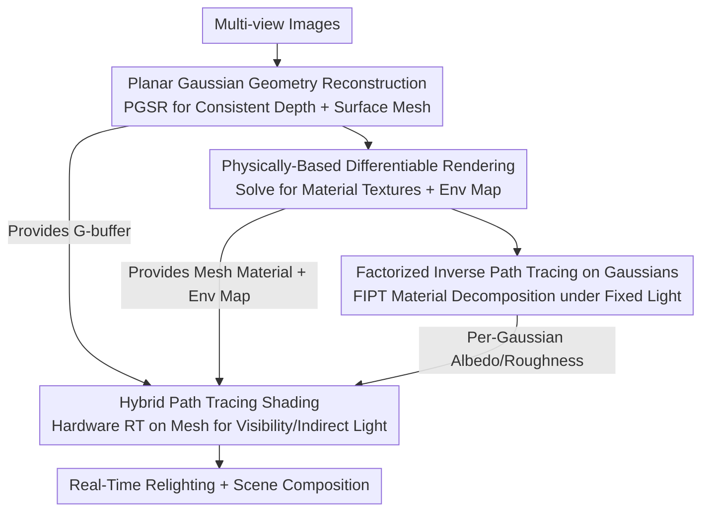

# GHPT: Real-Time Relightable Gaussian Splatting using Hybrid Path Tracing

**Conference**: CVPR 2026  
**Paper**: [CVF Open Access](https://openaccess.thecvf.com/content/CVPR2026/html/Bo_GHPT_Real-Time_Relightable_Gaussian_Splatting_using_Hybrid_Path_Tracing_CVPR_2026_paper.html)  
**Code**: None  
**Area**: 3D Vision  
**Keywords**: Relightable Gaussian Splatting, Hybrid Path Tracing, Inverse Rendering, G-buffer Deferred Shading, Real-Time Global Illumination  

## TL;DR
GHPT utilizes a "Gaussian-splatted G-buffer and hardware-accelerated ray tracing on an underlying mesh" hybrid path tracing paradigm, coupled with a three-stage inverse rendering pipeline (reconstructing geometry, decomposing materials and environment light, and finally performing factorized inverse path tracing on Gaussians). This approach marks the first time a 3DGS model has achieved high-quality relighting and real-time (113 fps) scene composition with soft shadows and indirect lighting on an RTX 4080 at 1920×1080 resolution.

## Background & Motivation
**Background**: 3D Gaussian Splatting (3DGS) represents scenes explicitly using a set of anisotropic Gaussian primitives, achieving high-fidelity and high-speed novel view synthesis through rasterization and alpha blending. It has become a mainstream scene representation following NeRF. However, to treat 3DGS as an "asset" for insertion into new scenes or for relighting under different environment maps, inverse rendering (recovering geometry/material/lighting) and physically-based rendering (re-shading) are required—both of which are natively unsupported by 3DGS.

**Limitations of Prior Work**: Monte Carlo physical rendering methods like path tracing cannot be directly applied to 3DGS because Gaussians are semi-transparent volumes without explicit surfaces for ray intersection. Existing relightable Gaussian methods are forced into two suboptimal paths: one uses **approximate rendering formulas** (split-sum approximation, screen-space ambient occlusion (AO), approximate indirect light), gaining speed at the cost of realism, where soft shadows and inter-reflections are blurred or absent; the other performs **direct ray tracing on Gaussians** (e.g., 3DGRT, which builds BVH for Gaussian intersection), which calculates global illumination accurately but suffers from a drastic drop in rendering speed, falling far short of real-time performance.

**Key Challenge**: In relighting 3DGS, "physically correct global illumination" and "real-time rendering efficiency" are treated as a binary choice. Semi-transparent Gaussians lack a clean surface for efficient ray intersection, forcing methods to either approximate (fast but unrealistic) or hard-trace Gaussians (realistic but extremely slow).

**Goal**: To obtain a Gaussian Splatting model capable of both **physically correct relighting and composition** (including visibility, soft shadows, indirect light, and color bleeding) and **real-time** rendering.

**Key Insight**: The authors borrow from mature **hybrid path tracing** in real-time renderers and game engines—instead of shooting rays per pixel from the camera, the system first rasterizes a G-buffer (screen-space geometry buffer: normals, depth, hit points) and then traces rays from the G-buffer to compute visibility and indirect light. The crucial observation is that while Gaussians themselves are difficult to intersect, PGSR (Planar Gaussian) can reconstruct an **explicit triangle mesh** from the same set of Gaussians. Thus, Gaussians handle G-buffer generation and shading, while the mesh handles efficient ray intersection, allowing each to perform its specialized role.

**Core Idea**: By stitching "Gaussian-splatted G-buffer" and "hardware-accelerated ray tracing on an underlying mesh" together for deferred shading, and using a three-stage inverse rendering process (Geometry → Material/Environment Light → Gaussian Material Decomposition), relightable Gaussians are obtained that maintain physical realism while running in real-time.

## Method

### Overall Architecture
GHPT is a **three-stage inverse rendering pipeline**. The input is a set of multi-view images, and the output is a relightable, compositable Gaussian Splatting model (each Gaussian with albedo/roughness) along with an environment map and a textured underlying mesh. The core responsibilities are split as follows: **Stage 1** uses PGSR (Planar Gaussian) to reconstruct multi-view consistent depth from images and extract a surface mesh; **Stage 2** performs physically-based differentiable rendering (PBDR) on this mesh to solve for material textures (albedo/roughness) and the environment map; **Stage 3** performs Factorized Inverse Path Tracing (FIPT) on the G-buffer rasterized by PGSR, using the "textured mesh + environment light" from Stage 2 as proxy geometry for visibility and indirect light estimation, finally decomposing material properties into each individual Gaussian.

The sequence "Geometry → Mesh Material/Environment Light → Gaussian Material" is chosen so that Stage 3 can utilize FIPT: FIPT requires **fixed environment lighting and a ready-made proxy geometry** to pre-bake the lighting, which Stage 2 provides. Stage 3 then only needs to decompose Gaussian materials under fixed lighting, making training both fast and stable.

### Key Designs

**1. Hybrid Path Tracing Rendering Model: Gaussians for G-buffer, Mesh for Ray Tracing**

This is the foundation of the work, addressing the fundamental pain point that "semi-transparent Gaussians cannot be efficiently ray-intersected." GHPT does not shoot rays directly at Gaussians; instead, it uses **deferred shading**: first, it uses PGSR to rasterize Gaussians into a G-buffer (normal and depth maps, yielding primary hit points for each pixel), and then traces rays from these hit points against the **explicit triangle mesh** produced in Stage 1/2 to evaluate visibility and indirect light. The "geometry for intersection" is a clean mesh (compatible with BVH and modern GPU hardware acceleration), while the "carrier for shading and detail" remains Gaussians, leveraging the strengths of both.

Rendering follows the rendering equation $L_o(x,\omega_o)=\int_{\Omega^+}L_i(x,\omega_i)f_r(x,\omega_i,\omega_o)(n\cdot\omega_i)\,d\omega_i$, where outgoing radiance is split into Monte Carlo estimates of direct and indirect light: Direct light $L_o^{direct}\approx\frac1N\sum_k \frac{L_i^{env}(\omega_k)f_r(x,\omega_k,\omega_o)(n\cdot\omega_k)}{p(\omega_k)}$ comes from the environment map, while indirect light $L_o^{ind}$ is obtained via recursive ray tracing on the mesh. This hybrid approach from the G-buffer enables true soft shadows and color bleeding compared to approximation formulas, while avoiding the cost of intersecting semi-transparent volumes.

**2. Normal Prior Guided Planar Gaussian Geometry Reconstruction: Obtaining a Reliable Proxy Mesh**

Hybrid path tracing requires an accurate mesh; otherwise, ray intersections on incorrect surfaces create artifacts. The authors use **PGSR** to squash 3D Gaussians into a 2D planar representation, rendering planar normal maps $n=\sum_i T_i\alpha_i R_c^\top n_i$ and distance maps $D=\sum_i T_i\alpha_i d_i$ via alpha blending, then converting them to depth maps via $D(p)=\frac{D}{n(p)K^{-1}\tilde p}$. Compared to direct alpha blending of Gaussian depth, this ensures depth falls on the planar surface of the Gaussian, ensuring multi-view consistent, unbiased depth.

To counter geometry reconstruction interference from specular reflections, the authors introduce a **monocular normal prior** from StableNormal for supervision, adding a normal consistency loss $L_{normal}=\sum(1-n_{render}\cdot n_{mono})$. A binary cross-entropy mask loss $L_{mask}=-M\log O-(1-M)\log(1-O)$ constrains the object silhouette ($O$ is accumulated opacity). The reconstructed mesh is simplified to 500,000 triangles with UV atlases generated in Blender for subsequent material optimization.

**3. Physically-Based Differentiable Rendering for Material and Light Decomposition: Preparing for FIPT**

This step tackles the ill-posed nature of inverse rendering where material and light are entangled. The goal is to stably solve for environment maps and material textures on the mesh first. The renderer performs **two passes** for each Monte Carlo sample: the first pass is non-differentiable and handles primary hits, visibility to environment light, and indirect radiance storage; the second pass calculates direct radiance using these values and target BRDFs, then adds the indirect radiance for pixel-wise L1 loss backpropagation to optimize BRDFs and environment light. **Next Event Estimation (NEE)** and **Multiple Importance Sampling (MIS)** with alias tables are used to reduce variance.

The environment light is contrast-enhanced by a power of $1.35$ during optimization to help decouple it from albedo, preventing lighting from being "baked" into the base color.

**4. Factorized Inverse Path Tracing (FIPT) on Gaussians: Efficiently Decomposing Materials to Each Gaussian**

In Stage 3, with fixed environment light and the textured mesh, materials are decomposed into individual Gaussians. Each Gaussian carries albedo $a$ and roughness $r$, where $A,R=\sum_i T_i\alpha_i\{a_i,r_i\}$. Using **FIPT**, the lighting integral is **factorized**: outgoing radiance is rewritten as $L_o=k_dL_d(x)+k_sL_s^0(x,\omega_o,r)+L_s^1(x,\omega_o,r)$. Shading terms for diffuse $L_d$ and specular $L_s^0, L_s^1$ (corresponding to Fresnel components) are **pre-baked**, cleanly separating $k_d=a$, $k_s=0.04$, and $r$ from the integral. Specular shading variation with roughness is approximated via linear interpolation of 6 pre-computed roughness levels.

This allows shading terms to be pre-baked once at high spp (256). Material decomposition is then fast and stable during training via look-up tables, while visibility and indirect light continue to rely on hardware RT on the mesh. An edge-aware smoothing regularization is applied to albedo and roughness to maintain spatial consistency.

### Loss & Training
- **Stage 1 (PGSR)**: Normal prior weight 0.15, mask BCE weight 0.05. Mesh simplified to 500k faces.
- **Stage 2 (PBDR)**: 256 spp (128 BRDF + 128 env), two-phase training (5000 + 1000 iterations). 
- **Stage 3 (FIPT)**: 256 spp pre-baking, material decomposition for 5000 iterations.
- **Real-Time Rendering**: Uses only 2 spp (1 BRDF + 1 env) with spatial filtering and temporal accumulation (history length 20) to suppress noise.

## Key Experimental Results

### Main Results
Evaluated on two synthetic datasets (SYNTHETIC4RELIGHT, TENSOIR SYNTHETIC) against NeRF/GS-based inverse rendering baselines, focusing on Relighting PSNR/SSIM/LPIPS.

| Dataset | Task | Metric | GHPT(Ours) | Strongest Baseline | Description |
|--------|------|------|-----------|----------|------|
| SYNTHETIC4RELIGHT | Relighting | PSNR↑ | **35.87** | IRGS 34.76 | Best Relighting PSNR |
| SYNTHETIC4RELIGHT | NVS | PSNR↑ | **37.11** | R3DG 36.06 | Best NVS PSNR |
| TENSOIR SYNTHETIC | Relighting | PSNR↑ | **32.46** | SVG-IR 31.10 | Best Relighting PSNR |
| TENSOIR SYNTHETIC | Albedo | PSNR↑ | **33.67** | IRGS 33.40 | Best Albedo PSNR |

Ours achieved first place in relighting PSNR across both datasets. It also performed strongly in NVS and albedo recovery, indicating that the geometry and material decomposition are robust.

### Real-Time Performance (RTX 4080, 1920×1080, 2 spp)
| Scene | G-buffer Rendering | Hybrid Path Tracing | Denoising | Total (ms) |
|------|--------------|-------------|------|----------|
| GARDEN | 3.51 | 2.70 | 1.74 | 7.95 |
| KITCHEN | 3.03 | 2.54 | 1.75 | 7.32 |
| ROOM | 3.35 | 4.65 | 1.75 | 9.75 |

Total latency across MIP-NeRF 360 scenes was 7.3~9.8 ms (~100-135 fps), demonstrating true real-time relighting and composition.

### Ablation Study
Relighting PSNR results:

| Configuration | S4R PSNR | TENSOIR PSNR | Description |
|------|----------|--------------|------|
| Full | **35.87** | **32.46** | Full model |
| Underlying mesh | 34.83 | 31.81 | Only Stage 2 mesh, no Gaussian decomposition |
| w/o denoising | 35.46 | 32.06 | No spatial denoising, noisier results |
| 16 spp (relight) | 34.87 | 31.69 | Sample count too low |
| w/o indirect | 34.68 | 32.28 | No indirect light during training |

### Key Findings
- **Decomposing materials to Gaussians (Full) is superior**: Ours outperforms the "underlying mesh" only approach by +1.04 / +0.65 PSNR, confirming Stage 3 decomposition is essential.
- **Indirect light is critical for accuracy**: Omitting indirect light during training causes albedo to be **overly bright** in recessed areas as the system tries to compensate for the missing energy; omitting it during rendering results in an **overly dark** image.
- **SPP and denoising determine noise levels**: High spp (256) is used for training, while real-time inference relies on 2 spp + temporal-spatial denoising to stay under 10 ms.

## Highlights & Insights
- **The "G-buffer for Gaussians, Mesh for RT" division is clever**: It bypasses the "semi-transparent collision" bottleneck by assigning tasks to the most suitable representations.
- **The 3-stage sequence is tailored for FIPT**: By preparing the env map and proxy mesh early, FIPT can pre-bake shading and provide stable material decomposition—a design-by-algorithm approach.
- **Transferable Trick**: The "high spp for training, low spp + spatiotemporal denoising for inference" strategy is a portable blueprint for other neural representations requiring real-time Monte Carlo rendering.

## Limitations & Future Work
- **Heavy reliance on mesh quality**: Errors in the proxy mesh directly affect ray tracing results (e.g., self-intersections), posing challenges for thin structures or extremely specular surfaces.
- **Quantitatively tested primarily on synthetic data**: Relighting/albedo quantitative comparisons are limited to synthetic sets; performance on real-world complex materials/lighting requires further investigation.
- **Empirical hyperparameters**: Many settings (voxel size, power of 1.35, intersection thresholds) are hand-tuned, and robustness across diverse scenarios remains to be fully explored.

## Related Work & Insights
- **vs. Approximation Methods (GS-IR / GI-GS)**: These trade physical realism for speed; Ours provides true path tracing and significantly leads in relighting PSNR.
- **vs. Gaussian Ray Tracers (R3DG / IRGS / 3DGRT)**: These trace Gaussians directly and are slow; Ours moves tracing to a proxy mesh, achieving real-time performance while surpassing IRGS in PSNR.
- **vs. Explicit Geometry Inverse Rendering**: GHPT essentially grafts the mature "mesh + PBDR + FIPT" pipeline onto the Gaussian representation, bridging the gap between Gaussian representations and traditional graphics shading pipes.

## Rating
- Novelty: ⭐⭐⭐⭐ Systematically migrates hybrid path tracing to Gaussian relighting, though components are existing building blocks.
- Experimental Thoroughness: ⭐⭐⭐⭐ Solid comparisons and real-time profiling, though lacking quantitative real-world relighting metrics.
- Writing Quality: ⭐⭐⭐⭐ Clear motivation and structure.
- Value: ⭐⭐⭐⭐ First schemed for real-time, physically correct Gaussian relighting with significant utility for AR/VR assets.

<!-- RELATED:START -->

## Related Papers

- [\[CVPR 2026\] Changes in Real Time: Online Scene Change Detection with Multi-View Fusion](changes_in_real_time_online_scene_change_detection_with_multi-view_fusion.md)
- [\[CVPR 2026\] CMHANet: A Cross-Modal Hybrid Attention Network for Point Cloud Registration](cmhanet_a_cross-modal_hybrid_attention_network_for_point_cloud_registration.md)
- [\[CVPR 2026\] 4C4D: 4 Camera 4D Gaussian Splatting](4c4d_4_camera_4d_gaussian_splatting.md)
- [\[CVPR 2026\] Eulerian Gaussian Splatting using Hashed Probability Pyramids](eulerian_gaussian_splatting_using_hashed_probability_pyramids.md)
- [\[CVPR 2026\] $L^{2}DGS$: Low-Light Dynamic Gaussian Splatting](l2dgs_low-light_dynamic_gaussian_splatting.md)

<!-- RELATED:END -->
