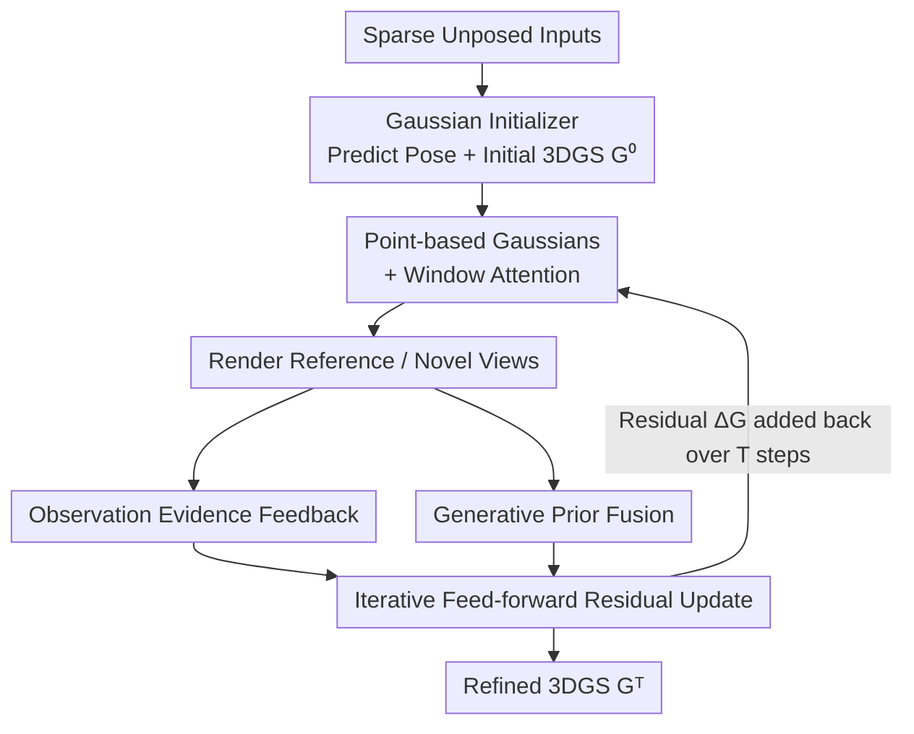

<!-- 由 tmp/gen_cvf_stubs.py 自动生成（CVF-only，无 arXiv） -->
# GIFSplat: Generative Prior-Guided Iterative Feed-Forward 3D Gaussian Splatting from Sparse Views

**Conference**: CVPR 2026  
**Paper**: [CVF Open Access](https://openaccess.thecvf.com/content/CVPR2026/html/Chen_GIFSplat_Generative_Prior-Guided_Iterative_Feed-Forward_3D_Gaussian_Splatting_from_Sparse_CVPR_2026_paper.html)  
**Code**: [Project Page](https://terencepp.github.io/gifsplat-project-page/)  
**Area**: 3D Vision  
**Keywords**: Feed-forward Gaussian Splatting, Sparse View Reconstruction, Iterative Residual Refinement, Generative Prior, Diffusion Enhancement

## TL;DR
GIFSplat shifts feed-forward 3D Gaussian Splatting from a "one-shot single prediction" paradigm into a "multi-step pure feed-forward residual refinement" process. Each step utilizes the feature differences of render-versus-observation and frozen diffusion model enhancements as Gaussian-level hints to predict residual updates. Without any test-time gradient optimization, without requiring camera poses, and while maintaining second-level inference times, it improves reconstruction quality for sparse-view and cross-domain scenes on DTU by over 2 dB.

## Background & Motivation

**Background**: There are two main paradigms for 3D scene reconstruction from multi-view images. One is scene-specific optimization (NeRF, 3DGS, and their variants), which minimizes photometric errors through thousands of test-time gradient descent steps, yielding high-quality results but suffering from slow inference and severe quality degradation under sparse views. The other is feed-forward methods (DUSt3R, VGGT, NoPoSplat, AnySplat, etc.), which estimate 3D properties from 2D images in a single ViT forward pass, taking only milliseconds to seconds for inference.

**Limitations of Prior Work**: The "one-shot prediction" paradigm of feed-forward methods introduces two key issues. First, quality is heavily constrained by model capacity, limiting fidelity in complex scenes. Second, they lack the ability to perform scene-specific refinement, leaving residual errors uncorrected, which even large models cannot remedy. To improve quality, incorporating generative priors is a natural choice; however, existing "diffusion-enhanced reconstruction" pipelines (e.g., Difix3D+) are optimization-based. They render temporary views, enhance them with diffusion models, and feed the enhanced views back into the training set for re-optimization, forming an iterative feedback loop.

**Key Challenge**: This feedback loop is fundamentally incompatible with feed-forward pipelines. The synthetic view set grows continuously, causing time and GPU memory complexity to explode. Compounded by the high computational cost of ViT self-attention, second-level inference cannot be preserved. More critically, feed-forward methods reconstruct 3D directly from images rather than updating an existing scene representation, meaning they lack any interface to "iteratively enhance on top of the current 3D state," let alone inject generative priors step-by-step.

**Goal**: To achieve three objectives that previously required trade-offs within a pure feed-forward framework: feed-forward efficiency, scene-adaptive refinement, and reliable injection of generative priors.

**Key Insight**: The authors draw inspiration from the success of "iterative residual refinement" in optical flow (RAFT) and visual SLAM (DROID-SLAM). Rather than predicting everything in one shot, it is better to maintain an updatable state and perform evidence-driven, multi-step small corrections. Applying this concept to 3DGS, the model repeatedly reads "the discrepancy between current renderings and real/enhanced images" to predict a residual and update the Gaussians in a feed-forward manner.

**Core Idea**: Replace "one-shot prediction" with "multi-step pure feed-forward residual updates on a fixed number of Gaussians," and distill frozen diffusion priors into lightweight, Gaussian-level discrepancy cues fed into the update loop. This harnesses generative priors without exploding the view set or introducing test-time backpropagation.

## Method

### Overall Architecture

Given a set of uncalibrated multi-view images $V=\{I_m\}_{m=1}^{M}$, the target is to recover a set of 3D Gaussians $G=\{g_i\}_{i=1}^{N}$ (where each Gaussian $g_i=(x_i,s_i,r_i,c_i,\alpha_i)$ contains position, scale, rotation, color, and opacity) that is photometrically consistent with the inputs, fast in inference, and robust across domains. The overall pipeline has two stages and three components. First stage: a quick one-shot feed-forward pass yields a reliable initialization $G^{(0)}$. Second stage: a **weight-sharing lightweight residual head** performs $T$ steps of pure feed-forward updates. Each step takes the feature discrepancies of "rendered vs. observed" and "rendered vs. diffusion-enhanced" as cues to predict the residual $\Delta G$ added back to the current Gaussians. The three components are: (1) **Gaussian Initializer** $F_\phi$ (modified from AnySplat by removing the voxelization module and performing partial fine-tuning) to predict camera poses and initial 3DGS; (2) **Iterative Residual Gaussian Head** $U_\theta$, sharing the same set of weights across all steps; (3) **Generative Prior Fusion Module**, which converts diffusion-enhanced renderings into Gaussian-level cues. The entire pipeline requires no camera poses, performs no test-time gradient optimization, and its memory and time scale roughly linearly with the number of steps $T$.

### Key Designs

**1. Iterative Feed-Forward Residual Update: Approximating "Gradient Refinement" via Multi-Step Feed-Forwarding without Backpropagation**

This constitutes the backbone of the work, directly addressing the pain point that feed-forward methods make "one-shot predictions" and cannot absorb new evidence. Optimization-based methods repeat Gaussian refinement through prolonged gradient descent, while feed-forward methods lack mechanisms to absorb new evidence; the authors seek "feed-forward efficiency + adaptive refinement". Specifically, under zero test-time gradients, the iterative head evolves the initial $G^{(0)}$ to $G^{(T)}$ via $T$ forward steps, predicting per-Gaussian residuals and updating at each step:

$$\Delta G^{(t)} \leftarrow U_\theta\big([\,G^{(t)} \,\|\, \{o_i\}^{(t)}\,]\big),\qquad G^{(t+1)} \leftarrow G^{(t)} + \Delta G^{(t)},\quad t=0,\dots,T-1.$$

In effect, this forwardly approximates minimizing the render-observation discrepancy in feature space $\|\psi(I_m)-\psi(R(G;\Pi_m))\|$ (where $\psi$ is a frozen feature extractor and $R$ is a differentiable rasterizer), but without any gradient backpropagation. The key ingenuity is that $U_\theta$ uses **shared weights**: unlike concurrent work iLRM, which unrolls each step into independent parameterized transformer layers (with parameters increasing linearly with depth and fixed inference steps), GIFSplat uses a single shared module to keep the parameter count constant, allowing the number of iteration steps to be configured flexibly during inference. This pure-observation variant is denoted as IFSplat.

**2. Observation Evidence Feedback: Softly Allocating Pixel-Level Rendering Errors Back to Key Gaussians**

The iterative head needs to know "where the current rendering is poor," but errors naturally exist on pixels, whereas the update targets are Gaussians. A bridge is needed to map pixel errors back to Gaussians. At step $t$, the rendering is first processed through $\psi(\cdot)$ to compute feature differences $O_m^{(t)}=\psi(I_m)-\psi(R_m^{(t)})$, and the pixel-level cues are pooled to Gaussians using rasterized soft assignment weights:

$$o_i^{(t)} \leftarrow \frac{\sum_{m\in S^{(t)}}\sum_u w_i(u)\,O_m^{(t)}(u)}{\sum_{m\in S^{(t)}}\sum_u w_i(u)+\varepsilon}.$$

Here, $w_i(u)=\alpha_i(u)\prod_{j=1}^{i-1}(1-\alpha_j(u))$ is precisely the standard front-to-back blending weight of the $i$-th Gaussian at pixel $u$ after depth sorting. That is, "the more a Gaussian contributes to this pixel, the more error cues it receives from that pixel." The resulting $o_i$ maps one-to-one with the Gaussians, allowing it to be concatenated directly with the Gaussian states and fed into $U_\theta$, ensuring residual updates target the Gaussians that actually need refinement.

**3. Generative Prior Fusion: Distilling Frozen Diffusion Enhancements into Gaussian-Level Cues without Exploding View Sets**

When observation cues are weak (e.g., in sparse views, domain shifts, or under-constrained regions), prior observation refinement fails to recover high-frequency details, necessitating generative priors. However, the authors deliberately avoid the optimization-based trajectory of "expanding the view set with enhanced views and re-optimizing," which leads to view explosion and expensive computation. Instead: for the current rendering $R_m^{(t)}$, a frozen one-step diffusion enhancer $E_\phi$ (based on DiFiX/Difix3D+) is applied to obtain the enhanced rendering $\tilde R_m^{(t)}=E_\phi(R_m^{(t)})$. The enhancement difference in feature space is computed as $P_m^{(t)}=\psi(\tilde R_m^{(t)})-\psi(R_m^{(t)})$, and then pooled into Gaussian-level prior cues $p_i^{(t)}$ using the same soft assignment as the observation cues. Finally, both observation and prior cues are concatenated at the Gaussian level and fed into the same update head:

$$\Delta G_i^{(t)} = U_\theta\big([\,g_i^{(t)} \,\|\, \{o_i\}^{(t)} \,\|\, \{p_i\}^{(t)}\,]\big).$$

Throughout this process, **no gradient backpropagation** is performed on the diffusion model; the prior is treated purely as a feed-forward cue. This is precisely why it preserves second-level feed-forward inference while incorporating generative knowledge. The complete model with prior fusion is called GIFSplat.

**4. Point-based Gaussians + Window Attention: Aligning Residual Refinement with the Physical 3D Neighborhood**

Prior feed-forward methods (pixelSplat, MVSplat, etc.) utilize pixel-aligned Gaussians, tying Gaussians to the image grid, which is computationally heavy, misaligned with the actual 3D neighborhood, and prone to over-density in smooth regions or under-representation in detailed/occluded areas. GIFSplat converts pixel-aligned Gaussians to **point-based Gaussians** with projected pre-trained features. Concurrently, the attention blocks in $U_\theta$ use **window attention** acting on local neighborhoods in 3DGS space rather than image tokens. This efficiently models local relationships between 3D Gaussians and ensures that each residual update occurs within geometric neighborhoods, which is a physical prerequisite for the steady convergence of iterative refinement. Removing window attention leads to a noticeable performance drop in ablation studies, verifying the importance of interacting within the 3D point space.

### Loss & Training

A two-stage training strategy is adopted. **Stage 1** trains only the initializer, using reconstruction loss + geometric distillation loss: $\mathcal{L}_{\text{stage1}}=\sum_{m}(\lambda_{\text{rec}}\mathcal{L}_{\text{rec}}+\mathcal{L}_{\text{dist}})$, where the former forces the renderings to match the input views and the latter transfers geometric cues from a pre-trained model to ensure plausible geometry under sparse views. **Stage 2** freezes the initializer and unrolls $T=3$ steps of feed-forward refinement under step-by-step supervision: $\mathcal{L}_{\text{stage2}}=\sum_{t=1}^{T}\omega_t\sum_m\|I_m-R_m^{(t)}\|^2$, with step weights $\omega_t=[0.4,0.3,0.3]$ biased toward earlier steps (where early steps resolve large residuals and later steps fine-tune details). Notably, observation cues $o_i^{(t)}$ and prior cues $p_i^{(t)}$ are computed online during training, avoiding the pre-construction of $\{o,p,G,\Delta G\}$ supervision tuples. Instead, $\Delta G^{(t)}$ is learned end-to-end through the unrolled multi-step reconstruction target.

## Key Experimental Results

The training sets are DL3DV and RealEstate10K (containing indoor/outdoor scenes), and DTU is used for cross-domain generalization testing. Metrics are PSNR / SSIM / LPIPS. Camera poses are not required, and no test-time gradient optimization is applied. Models are trained on 4×H200. IFSplat represents the observation-only variant, and GIFSplat represents the complete version with generative priors.

### Main Results

RealEstate10K 2-view evaluation (categorized into small/medium/large overlaps; the table shows the Average column):

| Method | Pose | PSNR↑ | SSIM↑ | LPIPS↓ |
|------|------|-------|-------|--------|
| MVSplat | Required | 23.977 | 0.811 | 0.176 |
| NoPoSplat | Pose-free | 25.033 | 0.838 | 0.160 |
| AnySplat | Pose-free | 25.176 | 0.839 | 0.161 |
| IFSplat (Ours) | Pose-free | 26.291 | 0.854 | 0.145 |
| **GIFSplat (Ours)** | Pose-free | **26.559** | **0.867** | **0.138** |

DL3DV 8-view evaluation and DTU cross-domain generalization (models trained solely on RealEstate10K):

| Method | DL3DV PSNR↑ | DL3DV LPIPS↓ | DTU PSNR↑ | DTU LPIPS↓ |
|------|-------------|--------------|-----------|------------|
| FLARE | 23.33 | 0.237 | 17.528 | 0.283 |
| AnySplat | 23.76 | 0.187 | 18.122 | 0.276 |
| IFSplat (Ours) | 24.69 | 0.171 | 19.921 | 0.274 |
| **GIFSplat (Ours)** | **24.91** | **0.164** | **20.214** | **0.251** |

GIFSplat consistently outperforms recent feed-forward baselines across three datasets. The "+2.1 dB improvement" mentioned in the abstract mainly comes from the DTU cross-domain scenarios (GIFSplat 20.214 vs AnySplat 18.122 $\approx$ +2.09 dB), indicating that iterative residuals + generative priors yield the most significant gains in out-of-domain and under-constrained scenarios.

### Ablation Study

Component-wise ablation on RealEstate10K (values correspond to the Average column of the main table):

| Configuration | PSNR↑ | SSIM↑ | LPIPS↓ | Description |
|------|-------|-------|--------|------|
| w/o Refinement (omit Stage 2 iteration) | 24.901 | 0.831 | 0.164 | Largest degradation, equivalent to initialization only |
| w/o window att. (omit window attention) | 25.327 | 0.837 | 0.152 | 3D point-space interaction is disrupted |
| w/o Gen. Prior (omit generative prior) | 26.291 | 0.854 | 0.145 | Primarily degrades LPIPS / perceptual quality |
| **Full (GIFSplat)** | **26.559** | **0.867** | **0.138** | All three complement each other |

Iteration steps analysis (PSNR): from initial 24.901 $\rightarrow$ 1 step 25.774 $\rightarrow$ 2 steps 26.107 $\rightarrow$ 3 steps 26.559 (GIFSplat), while 4 steps only yields 26.561. Performance increases monotonically but saturates noticeably after 3 steps; hence, $T=3$ is chosen for the main experiments as the optimal accuracy-latency trade-off.

### Key Findings
- **Omitting iterative refinement (Stage 2) triggers the most severe degradation**: PSNR drops from 26.559 to 24.901, proving that "multi-step residual updates" serve as the primary engine for quality improvements, while one-shot feed-forward initialization is far from sufficient.
- **Generative priors primarily boost perceptual quality**: Removing them reduces PSNR from 26.559 to 26.291 (approx. -0.27 dB), but triggers a more prominent degradation in LPIPS from 0.138 to 0.145, indicating that prior cues primarily suppress artifacts and fill in high-frequency textures rather than inflating pixel-level PSNR.
- **Gains saturate with step count**: 3 steps achieve the best cost-effectiveness, with virtually no improvement at 4 steps. This exemplifies the "diminishing marginal returns" of residual refinement, justifying the engineering choice to fix steps to a small number for second-level inference.
- **Cross-domain gains are the largest**: On DTU (with models trained only on RealEstate10K), the improvement over AnySplat is ~2 dB, which is much larger than the in-domain gain. This shows that dual cues ("observations + generative priors") are most effective under under-constrained setups and domain shifts.

## Highlights & Insights
- **Folding "optimization-style feedback loops" into "feed-forward residual heads"**: Traditional diffusion-enhanced reconstruction repeatedly expands the view set for re-optimization. GIFSplat instead takes only the feature differences between the enhanced renderings and raw renderings, pooling them into Gaussian-level cues for the next update step. This incorporates generative priors while completely avoiding view explosion and test-time backpropagation, which is key to preserving both efficiency and quality.
- **Dual utility of soft assignment weights**: The same set of rasterization blending weights $w_i(u)$ is used for pooling both occupancy error cues and generative prior cues. It translates "signals in the pixel world" cleanly into "the Gaussian world," which is engineeringly elegant and mathematically grounded.
- **Weight sharing enables step count as a runtime-adjustable knob**: Unlike concurrent approaches that unroll iterations into independent parameter layers, keeping parameters constant allows the step count to be adjusted flexibly at inference time, enabling deployment configurations based on latency budgets.
- **Transferable ideas**: The RAFT/DROID-SLAM paradigm of "maintaining updatable states + evidence-driven residuals" is successfully migrated to 3DGS. This paradigm of "multi-step feed-forward refinement replacing one-shot prediction" is equally applicable to other feed-forward geometric prediction tasks (e.g., depth, point maps, meshes).

## Limitations & Future Work
- The generative prior depends heavily on an off-the-shelf, frozen diffusion enhancer (DiFiX), bounding the quality ceiling and bias to it. If the enhancer introduces hallucinatory textures on certain domains, they might be falsely parsed as "high-frequency cues" that mislead updates (this failure mode is not studied in depth).
- Iterative gains mostly saturate after 3 steps, implying that the framework has limited capacity for extremely sparse views requiring massive geometric revamps—residual updates are inherently local and small, making them hard to recover from when initialization fails fundamentally.
- Each step requires rendering reference/novel views and running one pass of diffusion enhancement, causing time and GPU memory to scale linearly with the step count and per-step view budget. Although second-level inference is preserved, it still incurs several times the cost of pure, one-shot feed-forward networks.
- Experiments are mainly verified under 2-view and 8-view setups. The scalability of the model to larger view counts and more complex, large-scale outdoor scenes remains to be verified.

## Related Work & Insights
- **vs. Optimization-Based Diffusion-Enhanced Reconstruction (e.g., Difix3D+)**: They render $\rightarrow$ enhance $\rightarrow$ feed back to training set $\rightarrow$ re-optimize, relying on multi-step generation and prolonged scene-specific optimization. GIFSplat distills enhancement differences into Gaussian-level forward cues, without backpropagation or set expansion, preserving second-level inference. The difference lies in "absorbing priors via one-pass feed-forward" versus "iteratively blending via optimization."
- **vs. iLRM (concurrent work)**: iLRM unrolls iterations into multiple non-weight-shared transformer layers, which scales parameters linearly with depth and locks the inference steps. GIFSplat utilizes a single weight-shared head, keeping parameters constant and step count runtime-adjustable.
- **vs. ReSplat (concurrent work)**: ReSplat also performs observation-driven iterative feed-forward refinement but relies on known camera poses. GIFSplat is pose-free and uniquely adapts "generating and directly injecting instant diffusion priors into the update loop" to address under-constrained sparse views.
- **vs. AnySplat**: The initializer in this work is a fine-tuned version of AnySplat without voxelization. Thus, it can be viewed as "adding iterative residuals + generative priors on top of a strong one-shot feed-forward baseline." The consistent gains of IFSplat/GIFSplat over AnySplat directly quantify the value of this refinement layer.

## Rating
- Novelty: ⭐⭐⭐⭐ Seamlessly incorporating "iterative residual refinement" and "generative prior feed-forward distillation" into pure feed-forward 3DGS offers a clear concept and bridges the gap between feed-forward efficiency and prior injection.
- Experimental Thoroughness: ⭐⭐⭐⭐ It covers three datasets, multiple overlap/view setups, component-wise ablations, and step-count analyses. The cross-domain gains are highly convincing, although larger scenes and detailed failure analyses are slightly lacking.
- Writing Quality: ⭐⭐⭐⭐ Derivations of motivations and formula definitions are clear, and the overall framework is intuitive, though minor notation issues (like mixing N and T for step counts) exist.
- Value: ⭐⭐⭐⭐ Pose-free, second-level, and free of test-time gradient optimization, this sparse-view reconstruction approach is highly practical for AR/VR and robotics. The two variants (IFSplat/GIFSplat) are convenient to choose according to application needs.

<!-- RELATED:START -->

## Related Papers

- [\[CVPR 2026\] Z-Order Transformer for Feed-Forward Gaussian Splatting](z-order_transformer_for_feed-forward_gaussian_splatting.md)
- [\[CVPR 2026\] HeroGS: Hierarchical Guidance for Robust 3D Gaussian Splatting under Sparse Views](herogs_hierarchical_guidance_for_robust_3d_gaussian_splatting_under_sparse_views.md)
- [\[ICLR 2026\] G4Splat: Geometry-Guided Gaussian Splatting with Generative Prior](../../ICLR2026/3d_vision/g4splat_geometry-guided_gaussian_splatting_with_generative_prior.md)
- [\[CVPR 2026\] iSplat: Iterative Learning for Fine-Grained Gaussian Splatting](isplat_iterative_learning_for_fine-grained_gaussian_splatting.md)
- [\[CVPR 2026\] AnchorSplat: Feed-Forward 3D Gaussian Splatting with 3D Geometric Priors](anchorsplat_feed-forward_3d_gaussian_splatting_with_3d_geometric_priors.md)

<!-- RELATED:END -->
