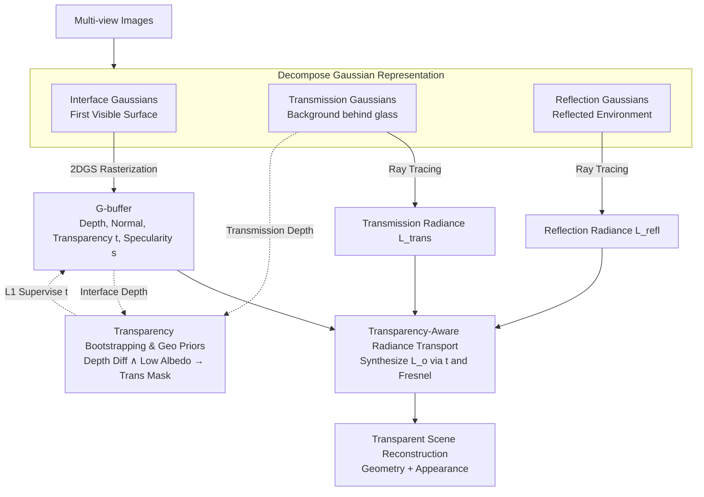

# GLINT: Modeling Scene-Scale Transparency via Gaussian Radiance Transport

**Conference**: CVPR 2026  
**arXiv**: [2603.26181](https://arxiv.org/abs/2603.26181)  
**Code**: [https://youngju-na.github.io/GLINT](https://youngju-na.github.io/GLINT)  
**Area**: 3D Vision  
**Keywords**: Gaussian Splatting, Transparent Surface Reconstruction, Radiance Transport Decomposition, Hybrid Rendering, Scene Reconstruction

## TL;DR
GLINT achieves SOTA geometric and appearance reconstruction of scene-scale transparent surfaces (e.g., glass walls, display cases) by decomposing Gaussian representations into interface, transmission, and reflection components integrated within a hybrid rasterization + ray tracing pipeline.

## Background & Motivation

**Background**: 3D Gaussian Splatting (3DGS) has become the mainstream paradigm for 3D reconstruction due to its real-time rendering and high visual fidelity. Numerous follow-up works have improved geometric accuracy (e.g., 2DGS, PGSR) and non-Lambertian modeling (e.g., GaussianShader, EnvGS).

**Limitations of Prior Work**: The core alpha-blending mechanism of 3DGS cannot handle transparent surfaces. In transparent scenes (e.g., architectural glass, display cabinets, windows), a single pixel receives superposed radiance from reflection and transmission components at different physical locations. To render realistic transmission, Gaussians at the glass position need extremely low opacity or are pruned, which leads to a loss of geometric information. Conversely, high opacity treats the glass as an opaque occluder, blocking the transmission background. This is the "transparency-depth dilemma."

**Key Challenge**: Alpha-blending couples geometry and appearance in a single composition stream—the same opacity parameter simultaneously controls geometric existence and radiance contribution. This is a fundamental conflict for transparent objects (physically present but radiometrically traversable).

**Goal**: (1) How to decouple the geometry and appearance of transparent surfaces under the Gaussian Splatting framework? (2) How to reconstruct both transmission and reflection radiance simultaneously without manual segmentation masks? (3) How to scale to complex scene-level transparent structures?

**Key Insight**: Existing methods are either object-centric requiring masks (TransparentGS, TSGS) or only handle reflection without transmission (EnvGS, DeferredGS). The authors propose explicitly decomposing the scene into three functional sets: the first visible interface, transmission geometry, and the reflection environment, each represented and optimized using independent Gaussian sets.

**Core Idea**: Decompose the Gaussian Splatting representation into interface/transmission/reflection components and implement physically consistent transparent radiance transport via a hybrid rasterization + ray tracing pipeline.

## Method

### Overall Architecture
GLINT takes multi-view images as input and outputs a complete 3D scene reconstruction (geometry + appearance) including transparent surfaces. Scene Gaussians are explicitly partitioned into three groups: interface Gaussians $\mathcal{G}_{\text{intr}}$ (capturing the first visible surface, including transparent and opaque boundaries), transmission Gaussians $\mathcal{G}_{\text{trans}}$ (modeling background geometry seen through transparent surfaces), and reflection Gaussians $\mathcal{G}_{\text{refl}}$ (encoding the environment radiance reflected from the interface). The interface component generates a G-buffer (depth, normal, transparency, specularity) via rasterization, which then queries the transmission and reflection components via ray tracing to synthesize the outgoing radiance weighted by transparency and Fresnel reflectance.

### Key Designs

**1. Decomposing Gaussian Representation: Splitting a single coupled opacity into three independent Gaussian sets**

The root of the transparency-depth dilemma is that standard 3DGS uses the same opacity to represent both "geometric existence" and "radiance contribution." This is an impasse for surfaces like glass that "exist geometrically but allow radiance to pass through." GLINT's solution is to split the scene into three non-interfering Gaussian sets, each assuming a specific optical role. Interface Gaussians $\mathcal{G}_{\text{intr}}$ handle the first visible surface (glass boundaries and opaque objects), transmission Gaussians $\mathcal{G}_{\text{trans}}$ handle the background seen through the glass, and reflection Gaussians $\mathcal{G}_{\text{refl}}$ handle the environment reflection. The interface component uses 2DGS to rasterize a G-buffer $\mathcal{B} = \{z, \mathbf{n}, t, s\}$, providing depth, normal, transparency $t \in [0,1]$, and specularity $s \in [0,1]$ for each pixel. Here, $t$ determines whether the path is opaque or transparent, and $s$ determines the mix of diffuse and specular components. By optimizing these components independently, geometry and appearance are decoupled.

**2. Transparency-Aware Radiance Transport: A BSDF-inspired hybrid formula for physically consistent synthesis**

After decomposition, the three sets must be synthesized back into a single image. GLINT uses transparency $t$ as a soft switch to write the outgoing radiance as a weighted sum of opaque and transparent branches:

$$L_o = (1-t)\, L_{\text{opaque}} + t\, L_{\text{transparent}}$$

Both branches share a symmetric structure, using the Schlick Fresnel approximation $F(\omega_o) = F_0 + (1-F_0)(1 - \max(0, \omega_o \cdot \mathbf{n}))^5$ to calculate the specular ratio $k_s = s + (1-s) F(\omega_o)$. This models a "diffuse-like" path and a reflection path. The opaque branch is $L_{\text{opaque}} = (1-k_s) L_{\text{intr}} + k_s L_{\text{refl}}$, while the transparent branch replaces the interface base color with transmission radiance: $L_{\text{transparent}} = (1-k_s) L_{\text{trans}} + k_s L_{\text{refl}}$. Reflection and transmission radiance are queried on-the-fly via ray tracing: $L_{\text{refl}} = \text{Trace}(\mathcal{G}_{\text{refl}}, \mathbf{x}, \omega_r)$ and $L_{\text{trans}} = \text{Trace}(\mathcal{G}_{\text{trans}}, \mathbf{x}, \omega_t)$. Under an optically thin assumption, the transmission direction is approximated as $\omega_t \approx \omega_o$.

**3. Transparency Bootstrapping and Geometric Priors: Detecting glass as an emergent property of the optimization**

The pipeline requires knowing which pixels are transparent—but scene-scale glass has blurred boundaries and overlapping radiance, making off-the-shelf segmentation fail. GLINT locates glass by observing two signals from the decomposed representation: (1) the depth difference $\Delta z = |z_{\text{intr}} - z_{\text{trans}}|$, where a large difference implies hidden depth layers (likely glass); and (2) a diffuse albedo map $\hat{a}$ from a pretrained video relighting model, where low albedo indicates specular/transmission dominance. The intersection creates a binary mask $M_{\text{trans}} = \mathbf{1}\big((\Delta z > \tau_d) \land (\hat{a} < \gamma_a)\big)$, which supervises the predicted transparency $t$ via L1 loss. This "bootstrapping" creates a positive feedback loop. Video-based priors for depth $\hat{z}$ and normals $\hat{\mathbf{n}}$ are also used to stabilize interface geometry.

### Loss & Training
Total loss: $\mathcal{L}_{\text{photo}} = \lambda_1 \mathcal{L}_1 + \lambda_{\text{ssim}} \mathcal{L}_{\text{SSIM}} + \lambda_{\text{lpips}} \mathcal{L}_{\text{LPIPS}}$ (Photometric) + $\mathcal{L}_{\text{geo}} = \lambda_d \mathcal{L}_{\text{depth}} + \lambda_n \mathcal{L}_{\text{normal}}$ (Geometric regularization) + $\mathcal{L}_{\text{trans}} = \lambda_t \|M_{\text{trans}} - t\|_1$ (Transparency supervision). Optimized using a 2DGS rasterizer + a modified OptiX ray tracer. Employs adaptive densification/pruning and edge-aware normal smoothing. Hyperparameters: $\tau_d = 0.01$, $\gamma_a = 0.05$. Trained on a single RTX 4090.

## Key Experimental Results

### Main Results — Synthetic Dataset 3D-FRONT-T (Geometric Evaluation)

| Method | Normal MAE↓ | 11.25°↑ | Depth AbsRel↓ | CD↓ | F1↑ |
|------|-------------|---------|---------------|-----|-----|
| 2DGS | 25.97 | 52.19 | 0.20 | 0.85 | 0.688 |
| EnvGS | 14.37 | 68.22 | 0.13 | 0.87 | 0.640 |
| TSGS | 9.89 | 86.29 | 0.08 | 0.52 | 0.798 |
| **Ours** | **7.96** | **86.37** | **0.04** | **0.34** | **0.836** |

### Main Results — Rendering Quality

| Method | DL3DV-10K PSNR↑ | DL3DV-10K SSIM↑ | 3D-FRONT-T PSNR↑ |
|------|-----------------|-----------------|-------------------|
| EnvGS | 29.65 | 0.91 | 33.71 |
| TSGS | 25.94 | 0.85 | 28.80 |
| **Ours** | **30.21** | **0.92** | **34.50** |

### Ablation Study

| Configuration | PSNR↑ | MAE↓ | AbsRel↓ |
|------|-------|------|---------|
| Full model | **34.50** | **7.96** | **0.035** |
| w/o $\mathcal{G}_{\text{trans}}$ | 32.26 | 8.11 | 0.038 |
| w/o $\mathcal{G}_{\text{refl}}$ | 32.70 | 8.78 | 0.038 |
| w/o $\mathcal{L}_{\text{trans}}$ | 33.57 | 8.07 | 0.037 |
| w/o $\mathcal{L}_{\text{geo}}$ | 33.62 | 24.69 | 0.126 |

### Key Findings
- Removing the transmission component $\mathcal{G}_{\text{trans}}$ causes the largest performance drop (PSNR -2.24) as background content is incorrectly blended into the interface Gaussians, creating geometric ambiguity.
- Removing geometric regularization $\mathcal{L}_{\text{geo}}$ causes Normal MAE to jump from 7.96 to 24.69, highlighting the necessity of priors for stabilizing geometry in transparent regions.
- While TSGS shows some geometric capability, its rendering quality is significantly lower than GLINT (5+ dB difference), as it fails to decompose and recover transmission radiance.
- Transparency bootstrapping effectively identifies glass regions across various scenes without manual annotation.

## Highlights & Insights
- The three-component decomposition elegantly resolves the "transparency-depth dilemma." By assigning explicit optical roles, opacity is no longer subject to contradictory constraints. This structured decomposition can potentially extend to other phenomena like translucency or subsurface scattering.
- The bootstrapping method is a clever use of the optimization's progress: it treats depth differences and albedo signals as indicators of transparency, avoiding the need for a separate segmentation model.
- The hybrid rendering pipeline (rasterization + ray tracing) balances efficiency with physical correctness, using efficient rasterization for the interface and ray tracing for secondary effects.

## Limitations & Future Work
- Assumes an optically thin model where refractive bending is negligible. This fails for thick glass or aquariums.
- Dependency on pretrained video relighting models for priors increases deployment complexity.
- Ray tracing overhead limits the possibility of high-frame-rate real-time applications (though feasible on high-end GPUs).
- Evaluation is limited to 13 scenes; broader scene diversity is needed.
- Thresholds for transparency masks ($\tau_d$, $\gamma_a$) are fixed and may not be optimal for all conditions.

## Related Work & Insights
- **vs 2DGS/PGSR**: These improve geometric precision but fail completely on transparent surfaces, resulting in missing or noisy normals in glass regions.
- **vs EnvGS**: Models reflection but ignores transmission radiance, leading to sub-optimal rendering and geometry in transparent scenes.
- **vs TSGS**: Specialized for transparent surfaces but lacks transmission decomposition, making objects behind glass appear blurred. GLINT addresses both geometry and appearance.
- **vs TransparentGS**: Handles refractive transparency via volumetric modeling but is object-centric and mask-dependent. GLINT is scene-scale and mask-free.

## Rating
- Novelty: ⭐⭐⭐⭐⭐ The three-component decomposition + hybrid pipeline is a substantial advancement for transparent reconstruction.
- Experimental Thoroughness: ⭐⭐⭐⭐ Strong synthetic and real-world evaluation, though the scale of scenes is relatively small.
- Writing Quality: ⭐⭐⭐⭐⭐ Rigorous physical modeling and intuitive visualizations.
- Value: ⭐⭐⭐⭐⭐ Addresses a fundamental 3DGS limitation; the 3D-FRONT-T benchmark is highly valuable for the community.

<!-- RELATED:START -->

## Related Papers

- [\[CVPR 2026\] AeroGS: Scale-Aware Gaussian Splatting for Pose-Free Dynamic UAV Scene Reconstruction](aerogs_scale-aware_gaussian_splatting_for_pose-free_dynamic_uav_scene_reconstruc.md)
- [\[CVPR 2026\] eRetinexGS: Retinex Modeling for Low-Light Scene Enhancement via Event Streams and 3D Gaussian Splatting](eretinexgs_retinex_modeling_for_low-light_scene_enhancement_via_event_streams_an.md)
- [\[CVPR 2026\] CoLoR: The Devil is in Scene Coordinate Regression for Large-Scale Visual Localization](color_the_devil_is_in_scene_coordinate_regression_for_large-scale_visual_localiz.md)
- [\[CVPR 2026\] DiffSoup: Direct Differentiable Rasterization of Triangle Soup for Extreme Radiance Field Simplification](diffsoup_direct_differentiable_rasterization_of_triangle_soup_for_extreme_radian.md)
- [\[CVPR 2026\] LumiMotion: Improving Gaussian Relighting with Scene Dynamics](lumimotion_gaussian_relighting_dynamics.md)

<!-- RELATED:END -->
