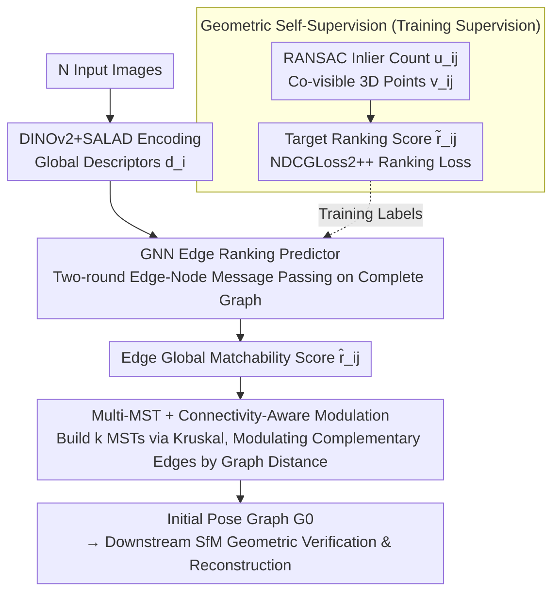

# Global-Aware Edge Prioritization for Pose Graph Initialization

**Conference**: CVPR 2026  
**arXiv**: [2602.21963](https://arxiv.org/abs/2602.21963)  
**Code**: [GitHub](https://github.com/weitong8591/global_edge_prior)  
**Area**: 3D Vision  
**Keywords**: Structure-from-Motion, Pose Graph Initialization, Graph Neural Networks, Minimum Spanning Tree, Edge Ranking

## TL;DR

A GNN-based global edge prioritization method is proposed, upgrading pose graph initialization from independent pairwise image retrieval to global structure-aware edge ranking and multi-MST construction, significantly improving SfM reconstruction accuracy in extremely sparse settings.

## Background & Motivation

**Background**: Structure-from-Motion (SfM) is a classic problem for reconstructing 3D structures and camera poses from image collections. Whether incremental (COLMAP) or global (GLOMAP), all SfM pipelines begin with the same step: constructing an initial pose graph by selecting a sparse subset of pairs for geometric verification from $\binom{N}{2}$ candidate image pairs.

**Limitations of Prior Work**:
   - Current methods rely almost entirely on **per-image retrieval** (e.g., NetVLAD, CosPlace, MegaLoc), independently connecting each image to its $k$ nearest neighbors.
   - This greedy strategy **ignores global structure**: it may produce elongated chains, weakly connected regions, or multiple loosely coupled sub-structures.
   - Once initial edges are selected, subsequent stages **only delete but never add**; missing critical global connections is irreversible.
   - Re-ranking methods (Patch-NetVLAD, VOP) still operate at the pairwise level and cannot perceive global topology.

**Key Challenge**: The pose graph is the structural skeleton of SfM, and its quality determines the success of the reconstruction. However, current initialization strategies only consider local visual similarity and lack global reasoning capabilities, making them particularly fragile in sparse or ambiguous scenes.

**Key Insight**: This work introduces the concept of "edge priority"—instead of evaluating image pairs independently, all candidate edges are ranked based on their **global utility for SfM**, and a compact, globally connected pose graph is constructed via multiple Minimum Spanning Trees (MSTs).

## Method

### Overall Architecture

Given $N$ images, the goal is to construct an initial pose graph $\mathcal{G}_0 = (\mathcal{V}, \mathcal{E}_0)$ upon which subsequent SfM performs geometric verification and reconstruction. Unlike traditional pipelines that collect edges by connecting each image to $k$ nearest neighbors via per-image retrieval, this work adopts a two-stage process: "global ranking followed by structure-aware selection." First, images are encoded into global descriptors $d_i$ using DINOv2+SALAD. Then, a GNN performs message propagation on the complete graph of all images to predict a global matchability score $\hat{r}_{ij}$ for each candidate edge. Finally, instead of using a greedy threshold, edges are selected sequentially via multiple MSTs, with scores dynamically modulated based on the current graph's connectivity to ensure the resulting graph is both compact and globally connected. This global edge ranking is trained using geometric self-supervision signals derived directly from SfM outputs, requiring no manual annotation.

### Key Designs

**1. GNN Edge Ranking Predictor: Enabling Global Context for Every Edge Score**

Pairwise cosine similarity fails because it evaluates image pairs in isolation, failing to distinguish edges that "look locally similar but are useless for global reconstruction." This method performs alternating edge-node message passing on the complete graph formed by image embeddings. Each directed edge is initialized as $e_{ij}^0 = \text{ReLU}(f_l[d_i, d_j, \langle d_i, d_j \rangle])$, concatenating endpoints' descriptors and their inner product. In subsequent propagation rounds, edge features are updated via $e_{ij}^t = f_{\text{edge}}([e_{ij}^{t-1}, d_i^t, d_j^t])$, and nodes refresh themselves by aggregating neighbor messages $m_i^t = \frac{1}{N}\sum_j m_{ji}^t$ using $d_i^{t+1} = f_{\text{update}}([d_i^t, m_i^t])$. A final MLP reads out the edge features into ranking scores $\hat{r}_{ij} = f_{\text{MLP}}(e_{ij}^2)$. Through this propagation, every edge score incorporates the context of the entire image set, allowing the model to suppress globally redundant or misleading edges.

**2. Geometric Self-Supervision: Using SfM Outputs as Ranking Labels**

The challenge is the lack of existing annotations for "global utility of edges." Instead of manual labeling, two complementary signals are extracted directly from the SfM pipeline: the RANSAC inlier count $u_{ij}$ reflects immediate geometric verifiability, while the number of co-visible 3D points $v_{ij}$ reflects the long-term contribution of the edge to the global reconstruction. These are combined into a target score $\tilde{r}_{ij} = \frac{1}{2}(\text{norm}(u_{ij}) + \text{norm}(v_{ij}))$. Training uses **NDCGLoss2++**, a differentiable ranking loss that optimizes the consistency between predicted and ground-truth rankings, focusing on relative importance rather than absolute value regression.

**3. Multi-MST + Connectivity-Aware Modulation: Selecting Globally Connected Compact Edges**

To avoid fragmented graphs resulting from simple thresholding or kNN, scores are converted to weights $w_{ij} = 1 - \hat{r}_{ij}$. Kruskal's algorithm is used to iteratively construct $k$ MSTs, with selected edges excluded from subsequent rounds to force the selection of complementary edges. Starting from the second MST, scores are modulated using the current graph distance:

$$s_{ij}^{(m)} = (1-\lambda)\hat{r}_{ij} + \lambda \bar{d}^{(m-1)}(i,j)$$

where $\bar{d}^{(m-1)}(i,j)$ is the normalized shortest path distance in the current graph. This raises the priority of strong edges whose endpoints are distant in the graph, effectively filling "cross-region shortcuts" to reduce graph diameter and reinforce weak connections. To avoid promoting noise, modulation only applies to the top-5 candidate edges per image and discards edges with scores below 0.9.

### Loss & Training

- **Loss**: NDCGLoss2++, a differentiable NDCG approximation based on LambdaRank.
- **Training Data**: 153 scenes from MegaDepth, taking 240 images per scene per batch, with up to 4 batches per scene.
- **Optimizer**: AdamW, learning rate $10^{-5}$, 50 epochs.
- **Large-scale Scaling**: For >500 images, METIS graph partitioning is used for sub-graph batch inference, with overlapping edge scores averaged.

## Key Experimental Results

### Main Results

| Dataset | Metric | Ours (k=2 MSTs) | MegaLoc | Gain |
|--------|------|------|----------|------|
| IMC23-PhotoTourism | AUC@5° | ~71.7 | ~65.3 | +6.4 |
| MegaDepth | AUC@5° | Outperforms all baselines | Second-best | Largest advantage at k=1-2 |
| VisymScenes | Correct Camera% (k=5) | >75% | <75% | Surpasses DoppelGanger++ |

### Ablation Study

| Configuration | AUC@5° (k=1/2/3/5) | Description |
|------|---------|------|
| Full Method | 64.2/71.7/72.6/73.5 | All components enabled |
| Without GNN | 55.4/70.4/72.3/72.3 | Large drop at k=1, proving global reasoning importance |
| SALAD Backbone | 61.2/71.0/72.4/73.4 | Slight drop but far exceeds original SALAD; proves backbone agnosticism |
| Oracle-RANSAC | 65.7/72.4/73.0/74.1 | Optimal for small k (immediate verifiability) |
| Oracle-3D Points | 65.4/72.1/73.5/74.3 | Optimal for large k (long-term utility) |
| kNN vs. MST | MST far superior to kNN | kNN easily fragments; MST ensures connectivity |

### Key Findings

- Global edge prioritization shows the greatest advantage in **extremely sparse settings** (k=1-2 MSTs); methods converge as k increases.
- **All baselines** perform better under the MST framework than their native kNN selection, suggesting MST is inherently a better structural prior.
- Connectivity modulation is crucial in ambiguous scenes (VisymScenes), increasing scores from 61.9 to 66.0 (at k=2).
- Ours outperforms the specialized Doppelganger++ filtering algorithm on VisymScenes **without retraining**, proving global reasoning naturally suppresses misleading edges.
- Inference overhead: GNN prediction is slower than pure retrieval but negligible compared to COLMAP processing time.

## Highlights & Insights

- **Precise Problem Definition**: Redefining pose graph initialization from a "retrieval" to a "ranking" problem addresses the most critical and irreversible bottleneck in the SfM pipeline.
- **Clever Self-Supervision**: Using SfM outputs (RANSAC inliers + 3D co-visibility) creates complementary, fully automated supervision signals.
- **Versatile MST Framework**: Not only does the proposed method benefit, but all baselines improve under the MST framework, indicating MST is a superior graph construction strategy compared to kNN.
- **Effective Connectivity Modulation**: Linearly modulating scores with shortest path distance significantly improves global topology with almost no additional overhead.

## Limitations & Future Work

- GNN inference requires message passing on a complete graph; sub-graph partitioning is needed for large scenes. More efficient sparse GNNs can be explored.
- Currently, only two rounds of message passing are used; deeper GNNs might capture richer global patterns.
- The modulation weight $\lambda$ is fixed; learnable adaptive weights could be explored.
- Integration with Global SfM (e.g., GLOMAP) has not yet been investigated.
- Success rate remains limited for low-resolution and small-scale landmarks in failure cases.

## Related Work & Insights

- **MegaLoc/SALAD**: Current strongest retrieval baselines, though still restricted to pairwise evaluation.
- **DoppelGanger++**: An edge filtering method for ambiguous scenes acting after geometric verification; the proposed method suppresses ambiguity before verification.
- **PoGO-Net, Damblon et al.**: Works using GNNs to optimize/filter existing pose graphs; this is the first to apply GNNs to the **initialization stage**.
- **Insight**: Global reasoning + structure-aware selection strategies can be extended to other graph construction problems (e.g., scene graph construction, point cloud registration graphs).

## Rating

- Novelty: ⭐⭐⭐⭐ Reframing pose graph initialization as a global ranking problem using GNN+Multi-MST+Connectivity Modulation is novel.
- Experimental Thoroughness: ⭐⭐⭐⭐ Comprehensive evaluation across three datasets, multiple baselines, detailed ablations, oracle comparisons, and timing analysis.
- Writing Quality: ⭐⭐⭐⭐ Clear problem statement, well-motivated method, and effective formulas/illustrations.
- Value: ⭐⭐⭐⭐ High practical value as it is directly pluggable into existing SfM pipelines, especially for sparse and ambiguous scenes.

## Related Papers

- [\[CVPR 2026\] E2EGS: Event-to-Edge Gaussian Splatting for Pose-Free 3D Reconstruction](e2egs_event-to-edge_gaussian_splatting_for_pose-free_3d_reconstruction.md)
- [\[CVPR 2026\] Learning Scene Coordinate Reconstruction from Unposed Images via Pose Graph Optimization](learning_scene_coordinate_reconstruction_from_unposed_images_via_pose_graph_opti.md)
- [\[CVPR 2026\] HumanBA: Human-Aware Bundle Adjustment via Global Human-Camera Decoupling](humanba_human-aware_bundle_adjustment_via_global_human-camera_decoupling.md)
- [\[CVPR 2026\] Foundry: Distilling 3D Foundation Models for the Edge](foundry_distilling_3d_foundation_models_for_the_edge.md)
- [\[CVPR 2026\] ESAM++: Efficient Online 3D Perception on the Edge](esam_efficient_online_3d_perception_on_the_edge.md)

<!-- RELATED:END -->

<!-- RELATED:START -->

## Related Papers

- [\[CVPR 2026\] Global Structure-from-Motion Meets Feedforward Reconstruction](global_structure-from-motion_meets_feedforward_reconstruction.md)
- [\[CVPR 2026\] E2EGS: Event-to-Edge Gaussian Splatting for Pose-Free 3D Reconstruction](e2egs_event-to-edge_gaussian_splatting_for_pose-free_3d_reconstruction.md)
- [\[CVPR 2026\] ESAM++: Efficient Online 3D Perception on the Edge](esam_efficient_online_3d_perception_on_the_edge.md)
- [\[CVPR 2026\] Geometry-Aware Cross-Modal Graph Alignment for Referring Segmentation in 3D Gaussian Splatting](geometry-aware_cross-modal_graph_alignment_for_referring_segmentation_in_3d_gaus.md)
- [\[CVPR 2026\] MOSAIC-GS: Monocular Scene Reconstruction via Advanced Initialization for Complex Dynamic Environments](mosaic-gs_monocular_scene_reconstruction_via_advanced_initialization_for_complex.md)

<!-- RELATED:END -->
