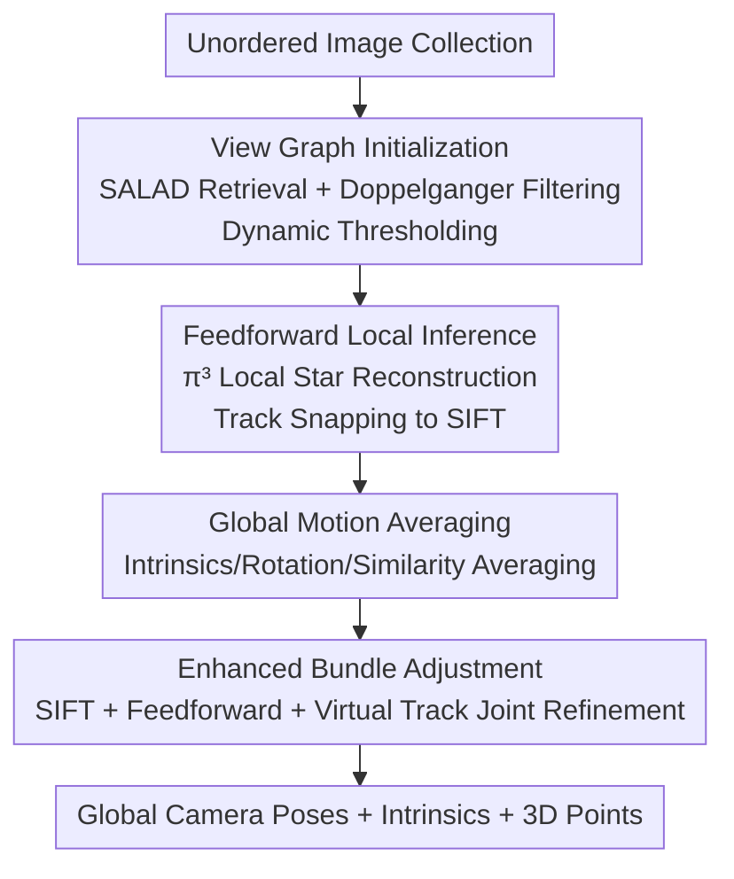

# Global Structure-from-Motion Meets Feedforward Reconstruction

**Conference**: CVPR2026  
**arXiv**: [2605.26103](https://arxiv.org/abs/2605.26103)  
**Code**: https://github.com/colmap/gluemap (Available)  
**Area**: 3D Vision  
**Keywords**: Structure-from-Motion, Feedforward Reconstruction, Global Motion Averaging, Bundle Adjustment, Camera Pose Estimation

## TL;DR
GLUEMAP combines the scalability and global consistency of classical global SfM with the local robustness of feedforward multi-view reconstruction networks (π³). It restricts the feedforward network to local inference using a sparse view graph, integrates tens of thousands of local reconstructions into a global solution via global motion averaging, and enhances bundle adjustment with "virtual tracks." It outperforms both pure classical and pure feedforward methods on five diverse datasets and scales to tens of thousands of images on a single RTX 4090.

## Background & Motivation

**Background**: Structure-from-Motion (SfM), which simultaneously estimates camera poses and 3D structures from image collections, follows two technical routes. **Classical methods** (COLMAP, GLOMAP) rely on SIFT feature matching and robust optimization (incremental or global), achieving peak accuracy and reliability in texture-rich, well-overlapped scenes. **Feedforward methods** (DUSt3R, VGGT, π³) use transformers for end-to-end multi-view 3D regression, leveraging learned scene priors to excel in extreme scenarios like low texture, low overlap, or low parallax where classical methods fail.

**Limitations of Prior Work**: Both routes have inherent flaws. Classical methods systematically fail in four scenarios: lack of texture (matching failure), insufficient overlap (scale unconstrained), low parallax (relative pose degeneracy), and symmetrical structures (Doppelganger ambiguity leading to reconstruction collapse). Feedforward methods are limited by three factors: ① **Poor scalability**—global attention in transformers is constrained by VRAM, limiting them to a few hundred low-resolution images before OOM; ② **Insufficient accuracy**—precision lags behind classical methods in conventional scenes; ③ **Poor robustness**—inability to reliably handle multi-connected components or symmetrical structures, sometimes exhibiting counter-intuitive behavior where more input images yield worse results.

**Key Challenge**: The "global attention" of feedforward networks becomes a burden in large scenes with large view-graph radii—quadratic connections make it difficult for the network to distinguish relevant from irrelevant information, particularly in symmetrical scenes. Conversely, while global optimization in classical methods excels at large-scale consistency, it lacks priors for extreme local scenarios. The strengths of both approaches are almost perfectly complementary.

**Goal**: Systematically analyze the "structural scene properties" (view-graph radius, density) under which classical and feedforward methods fail, and design a unified pipeline that merges their strengths.

**Core Idea**: **Demote the feedforward network to a "local expert" rather than a global reasoner.** Use classical image retrieval to construct a sparse view graph, perform small-scale reconstructions with the feedforward network only within local star-shaped neighborhoods (naturally avoiding OOM, enabling parallelism, and focusing attention for higher accuracy), and then pass these to classical global motion averaging and bundle adjustment for large-scale stitching and refinement.

## Method

### Overall Architecture
GLUEMAP takes an unordered image set as input and outputs camera poses, intrinsic parameters, and 3D scene points. The pipeline consists of four stages: **View Graph Initialization** (scalable retrieval + Doppelganger filtering to construct a sparse graph) → **Feedforward Local Inference** (decomposing the graph into local star graphs, performing parallel reconstruction with π³, and merging tracks via SIFT) → **Global Motion Averaging** (aligning $n$ local reconstructions into a global solution via rotation and similarity averaging) → **Enhanced Bundle Adjustment** (jointly refining poses and structures using a mixture of SIFT tracks, feedforward tracks, and "virtual tracks"). The mechanism leverages feedforward networks for robust local poses and depth, while using classical optimization for global consistency and high precision.

### Key Designs

**1. Sparse View Graph + Doppelganger Dynamic Thresholding: Replacing Global with Local Attention**

The primary issues of feedforward methods—VRAM explosion and symmetrical collapse—stem from global attention. GLUEMAP addresses this by using SALAD retrieval to recall a fixed number $c$ of candidate neighbors for each image $I_i$, reducing $O(n^2)$ global connections to an $O(c \cdot n)$ sparse view graph $G(\mathcal{I},\mathcal{E})$. Feedforward inference is restricted to this sparse graph, enabling parallel processing of small sub-problems, avoiding OOM, and scaling to arbitrary input sizes.

Symmetrical ambiguity is handled via Doppelganger++ filtering. For each candidate edge $(i,j)$, a score $\alpha_{ij}=\text{DG}(I_i,I_j)$ is computed. A **dynamic threshold** ensures connectivity: starting with $\delta_0=0.8$, edges satisfying $\alpha_{ij}>\delta_t$ are added between connected components. If components remain disconnected, $\delta_t$ is lowered by 0.1 until $\delta_t < 0.2$ or connectivity is achieved. This adaptively balances "filtering symmetrical errors" and "maintaining graph connectivity."

**2. Local Star-graph Inference + Track Snapping: Stitching Local Reconstructions into Global Tracks**

The view graph is decomposed into star graphs $S_l$ centered at image $l$ (center $l$ + neighbors $\mathcal{N}_l$). Independent batch reconstructions are performed using π³ to obtain local poses, depth maps, focal lengths, and tracks: $(\mathcal{P}_l, \mathcal{F}_l, \mathcal{D}_l, \mathcal{T}_l) = \text{FF}(I_{\mathcal{N}_l})$. To handle conflicting tracks for images appearing in multiple star graphs, feedforward track positions are "snapped" to SIFT keypoints within a radius $\beta=1\text{px}$. Tracks snapping to the same SIFT point are merged, unifying cross-star tracks and providing SIFT features for subsequent BA.

To verify visual overlap within a star, a forward-backward depth consistency check is used. Reprojection errors $\epsilon_{i \to j}$ are calculated by back-projecting pixels using depth. The overlap ratio $\tilde{o}_{ij}^l$ is the proportion of pixels satisfying $\epsilon_{i \to j} < \tau$. Transitive visibility is measured via $o_{ij}^l = \max_{\tilde{\mathcal{O}}} \prod \tilde{o}_{pq}^l$ along graph paths, and low-overlap edges are filtered.

**3. Global Motion Averaging: Scalable Alignment via Local Reconstructions**

This stage merges $n$ independent local reconstructions via intrinsics, rotation, and similarity transformation averaging. Intensics are derived using the median inferred focal length per physical camera. Global rotations are solved from relative rotations $R_{ij}^l$ using overlap-weighted Huber optimization: $\min_R \sum \rho(o_{ij}^l \cdot d(R_{ij}^l, R_j R_i^\top))$.

The key improvement is in similarity averaging (solving camera centers $c_i$). Traditional translation averaging is often ill-posed because relative translations only provide direction, not scale. GLUEMAP uses the fact that **relative translations within the same local star are inherently scale-consistent.** Thus, only one scale $s^l$ per star is needed. The optimization $\min_{c,s} \sum o_{ij} \cdot d(R_{ij}^\top t_{ij} - s_l(c_i - c_j))$ is initialized via a Maximum Spanning Tree. This "one star, one scale" approach is significantly more noise-resistant than estimating scales for every edge.

**4. Enhanced Bundle Adjustment: Injecting Feedforward Priors via "Virtual Tracks"**

Standard BA is well-posed only with sufficient multi-view tracks, which are absent in low-overlap/low-texture scenes. Feedforward networks provide accurate relative poses and consistent depths even with zero overlap. GLUEMAP encodes these priors as **virtual tracks** injected into BA. Pixels $(x,y)$ are sampled from the center image $l$ of each star and back-projected to neighboring images using local depth and poses (Equation 14) or global poses (Equation 15) to generate two types of virtual tracks $\mathcal{V}, \tilde{\mathcal{V}}$. Unlike standard tracks, these can project outside image boundaries or behind cameras.

Final BA uses three track types: feedforward tracks $\mathcal{T}$, virtual tracks $\mathcal{V}/\tilde{\mathcal{V}}$, and classical SIFT tracks, with Huber or Arctan robustification. Virtual 3D point positions are known by construction. This step ensures well-posed convergence in extreme scenarios and is the key to elevating accuracy to SOTA levels.

### Loss & Training
GLUEMAP does not train its own network. It is a system that embeds existing feedforward models (π³ for local inference, SALAD for retrieval, Doppelganger++ for filtering) as modules into a classical optimization pipeline. The optimization targets are rotation averaging, similarity averaging, and enhanced BA reprojection costs. Experiments were conducted on GH200 (96GB), but the system fits within a 24GB RTX 4090.

## Key Experimental Results

Evaluation uses AUC@X (Area Under the Curve of pose errors, where X is the angular threshold). Tight thresholds reflect accuracy, while loose ones reflect completeness.

### Main Results

On ETH3D (high precision focus), GLUEMAP achieves the highest accuracy in both calibrated and uncalibrated settings, significantly outperforming pure feedforward methods:

| Method | AUC@1 | AUC@3 | AUC@5 |
|------|-------|-------|-------|
| GLOMAP+SIFT (Classical) | 45.6 | 62.2 | 66.7 |
| GLOMAP+ALIKED+LightGlue | 42.9 | 62.1 | 67.4 |
| π³ (Feedforward SOTA) | 13.2 | 36.1 | 48.9 |
| π³ + BA | 30.6 | 55.1 | 65.1 |
| GLUEMAP† (Motion Avg only) | 20.3 | 49.0 | 61.9 |
| **GLUEMAP** | **53.0** | **76.9** | **83.6** |
| GLUEMAP* (GT Intrinsics) | 74.0 | 85.9 | 89.0 |

On LaMAR (thousands of images, large radii, symmetrical structures), **all pure feedforward methods OOM**. Classical methods largely fail in indoor scenes. GLUEMAP leads by a wide margin:

| Method | CAB(6587) AUC@3 | HGE(7553) AUC@3 | LIN(9319) AUC@3 | Avg AUC@10 |
|------|------|------|------|------|
| GLOMAP+SIFT | 0.6 | 2.6 | 4.6 | 12.4 |
| GLOMAP+AL+LG | 1.1 | 8.0 | 23.7 | 30.1 |
| π³ / MASt3R-SfM | OOM | OOM | OOM | OOM |
| GLUEMAP† | 2.6 | 22.1 | 30.2 | 53.7 |
| **GLUEMAP** | **4.5** | **37.3** | **37.3** | **59.1** |

### Ablation Study

| Configuration | Description | Typical Performance |
|------|------|---------|
| π³ (Pure FF) | Feedforward only | ETH3D AUC@1 is only 13.2; OOM in large scenes |
| π³ + BA | Feedforward + Standard BA | ETH3D AUC@1 rises to 30.6; limited scalability |
| GLUEMAP† | Full pipeline but stops at Motion Averaging | ETH3D AUC@1 20.3; works on LaMAR |
| **GLUEMAP (Full)** | + Enhanced BA | ETH3D AUC@1 53.0; comprehensive improvement |

### Key Findings
- **Enhanced BA is crucial for precision**: On ETH3D, AUC@1 more than doubles from GLUEMAP† (20.3) to GLUEMAP (53.0), proving virtual track injection is vital for tight thresholds.
- **Counter-intuitive "Add Images, Performance Drops" behavior in FF**: VGGT/MapAnything show higher accuracy with sparser inputs. GLUEMAP behaves like classical optimization—accuracy improves with denser inputs and redundant observations.
- **Scene structure dictates the winner**: Feedforward performance drops sharply as view-graph radius increases (failing after radius 49+). GLUEMAP remains stable. On IMC2021, feedforward wins with few images, while classical SIFT wins with many; GLUEMAP is competitive across all scales.
- **Handling Symmetrical SMERF scenes**: Classical methods fail, and π³ collapses multi-room structures due to high radius and symmetry. GLUEMAP successfully distinguishes rooms via Doppelganger++ filtering, outperforming MP-SFM in sparse track settings.

## Highlights & Insights
- **"Feedforward as Local Experts" is the core insight**: Instead of fighting feedforward scalability, GLUEMAP admits they are only good at local reasoning and returns global consistency to classical optimization. This approach of "using classical structure to constrain a learned module's scope" is transferable to other tasks.
- **Translating priors into BA language**: BA requires tracks and reprojection errors, while feedforward networks output poses and depth. Creating 3D virtual tracks from depth allows both paradigms to collaborate within a single optimization objective.
- **"One star, one scale" similarity averaging**: Utilizing the inherent scale consistency within local stars to reduce ill-posed per-edge scale estimation to a per-star scalar is a simple yet effective engineering insight.
- **Track snapping to SIFT**: Merging feedforward tracks by snapping them to SIFT keypoints provides unified tracks and "free" SIFT features for BA simultaneously.

## Limitations & Future Work
- **Strong dependency on local feedforward quality**: The pipeline's lower bound is set by models like π³. If the feedforward model has bias, it propagates. 
- **Camera model constraints**: Currently limited to pinhole models as most feedforward models are trained on them (though the classical stages could theoretically handle fisheye).
- **Pure rotation motion**: The current enhanced BA does not support pure rotation. Future work suggests introducing soft depth priors.
- **System complexity**: Requires assembling multiple models (retrieval, filtering, reconstruction); a single shared architecture would be more elegant.

## Related Work & Insights
- **vs. GLOMAP (Classical Global SfM)**: GLOMAP solves poses and points globally but can get stuck in local minima or fail with insufficient tracks. GLUEMAP uses feedforward networks for local reconstruction and virtual tracks to handle sparsity.
- **vs. π³ / VGGT (End-to-end Feedforward)**: These face VRAM limits, accuracy collapse in large-radius scenes, and symmetry issues. GLUEMAP restricts them to local stars to avoid these pitfalls.
- **vs. MASt3R-SfM / VGGT-SfM (Scalable Feedforward)**: These often use factor graph alignment or BA injection but struggle to exceed 1,000 images or match classical accuracy. GLUEMAP scales to tens of thousands of images.
- **vs. MP-SFM (Learned Priors + Incremental SfM)**: MP-SFM uses monocular priors in an incremental pipeline for low overlap but is hard to scale. GLUEMAP's global paradigm offers better scalability and higher accuracy on SMERF sparse tracks.

## Rating
- Novelty: ⭐⭐⭐⭐ System-level integration rather than a single breakthrough, but the combination of "FF as local experts" and "virtual tracks for BA" is deeply insightful.
- Experimental Thoroughness: ⭐⭐⭐⭐⭐ Analysis of 5 datasets and structural properties (radius/density) provides excellent clarity on failure boundaries.
- Writing Quality: ⭐⭐⭐⭐⭐ Clear motivation and a well-structured four-stage pipeline.
- Value: ⭐⭐⭐⭐⭐ Open-sourced, scalable to large scenes, and runnable on a 4090; high engineering value for reconstruction.

<!-- RELATED:START -->

## Related Papers

- [\[CVPR 2026\] Dark3R: Learning Structure from Motion in the Dark](dark3r_learning_structure_from_motion_in_the_dark.md)
- [\[CVPR 2026\] PromptStereo: Zero-Shot Stereo Matching via Structure and Motion Prompts](promptstereo_zero-shot_stereo_matching_via_structure_and_motion_prompts.md)
- [\[CVPR 2026\] Voxify3D: Pixel Art Meets Volumetric Rendering](voxify3d_pixel_art_meets_volumetric_rendering.md)
- [\[CVPR 2026\] MoRE: 3D Visual Geometry Reconstruction Meets Mixture-of-Experts](more_3d_visual_geometry_reconstruction_meets_mixture-of-experts.md)
- [\[CVPR 2026\] Gen3R: 3D Scene Generation Meets Feed-Forward Reconstruction](gen3r_3d_scene_generation_meets_feed-forward_reconstruction.md)

<!-- RELATED:END -->
