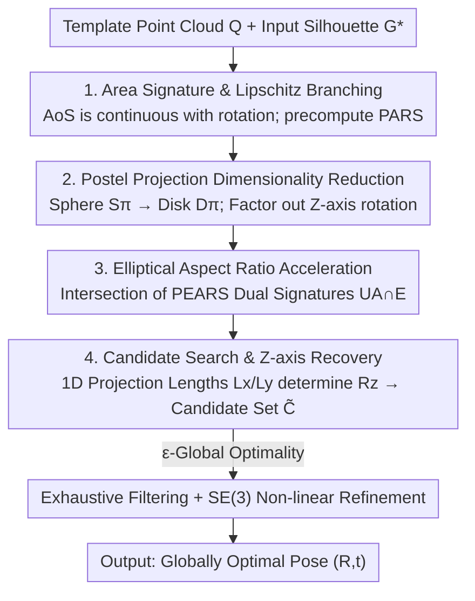

# Globally Optimal Pose from Orthographic Silhouettes

**Conference**: CVPR 2026  
**Paper**: [CVF Open Access](https://openaccess.thecvf.com/content/CVPR2026/html/Sengupta_Globally_Optimal_Pose_from_Orthographic_Silhouettes_CVPR_2026_paper.html)  
**Code**: https://agnivsen.github.io/pose-from-silhouette/  
**Area**: 3D Vision  
**Keywords**: Pose Estimation, Silhouette, Global Optimality, Orthographic Projection, Shape Signature  

## TL;DR
Given a known 3D template and its unoccluded silhouette in an image, this work models "Pose-from-Silhouette (PfS)" as minimizing the Hausdorff distance between two silhouettes on $\mathbb{SO}(3)$. By leveraging the overlooked property that "silhouette area changes continuously with rotation," the search space is heavily branched. This resulting method is the **first globally optimal PfS solver for arbitrary shapes (regardless of convexity or genus) without requiring point correspondences**, achieving an orientation error ~86%–90% lower than the closest baseline on synthetic and real data.

## Background & Motivation

**Background**: Estimating 3D object pose from a single image primarily relies on **point correspondences** (feature matching, PnP) between the object template and the image. When textures are scarce and only the object silhouette is available, correspondences cannot be established.

**Limitations of Prior Work**: Existing "silhouette-based" methods almost exclusively treat silhouettes as **auxiliary cues**, requiring feature correspondences, image intensities, or temporal priors. Pure "pose from silhouette only" lacks a **globally optimal solver** for general shapes: prior works are either restricted to specific shapes (ellipsoids, solids of revolution, cylinders), are local methods dependent on initial values (e.g., Deep Active Contours requiring initial pose and boundary color), or are stochastic Particle Swarm Optimization (PSO) methods (e.g., STI-Pose, which depends on approximate depth bounds and lacks optimality guarantees).

**Key Challenge**: PfS is inherently **ill-posed**—the search space is the non-convex $\mathbb{SO}(3)$ manifold, and the objective function (Hausdorff distance) is also non-convex. Furthermore, symmetric shapes lead to non-unique global solutions. Direct Branch-and-Bound (BnB) on $\mathbb{SO}(3)$ guarantees global optimality but is prohibitively expensive.

**Goal**: Estimate the pose with global optimality (up to discretization precision) using **only one unoccluded silhouette + template**, without assuming shape convexity, genus, or symmetry, and without requiring initialization.

**Key Insight**: The authors exploit a simple yet underutilized property—the **Area-of-Silhouettes (AoS) is Lipschitz continuous with respect to rotation**. Since it is continuous, the area of the input silhouette can cut an isoline on the "area response surface of all possible rotations." The global optimum must lie near this isoline, allowing the search space to be branched from the entire $\mathbb{SO}(3)$ into a low-dimensional subset.

**Core Idea**: Replace the "difficult-to-search rotation space" with an "easy-to-query precomputed shape signature response surface." Off-line, the template's area (PARS) and fitted elliptical aspect ratio (PEARS) at various orientations are stored as response surfaces. On-line, the area and aspect ratio of the input silhouette are used to query and branch the tables, obtaining a small set of candidate rotations followed by exhaustive filtering and manifold refinement.

## Method

### Overall Architecture

The problem is formulated as a constrained optimization: Let the template point cloud be $Q\in\mathbb{R}^{3\times M}$. The orthographic silhouette after rotation $R\in\mathbb{SO}(3)$ and translation $t\in\mathbb{R}^2$ is $\tilde{S}(Q,R,t)=S\!\big(\Pi_O(RQ+(t^\top,0)^\top)\big)$. The goal is to minimize its Hausdorff distance to the input silhouette $G^*$:

$$\min_{R\in\mathbb{SO}(3),\,t\in\mathbb{R}^2} H(\tilde{G},G^*),\quad \text{s.t. }\tilde{G}=\tilde{S}(Q,R,t).$$

The pipeline is divided into **offline** and **online** phases. Offline phase: Re-parameterize the rotation space onto a 2D disk, perform semi-dense sampling, and record the silhouette area and elliptical aspect ratio for each orientation to generate two response surfaces, PARS and PEARS. Online phase: Calculate the area and aspect ratio of the input silhouette, intersect them with PARS and PEARS respectively to obtain a candidate rotation set, restore the rotation around the Z-axis using 1D projection lengths to complete $\tilde{C}$, and finally perform exhaustive filtering and non-linear refinement on the $SE(3)$ manifold within this **significantly reduced** feasible set.

### Key Designs

**1. Area Signature and Lipschitz Branching: Branching SO(3) using the continuous area surface**

Direct BnB on non-convex $\mathbb{SO}(3)$ is too costly. Instead, the authors use a global geometric feature—the silhouette **area** $\mathcal{A}(\tilde{G})$—to partition the search space. The key property is **Theorem 1**: As long as the template can be represented by a finite number of triangles, $\mathcal{A}(\tilde{G})$ is Lipschitz continuous with respect to any Lipschitz continuous rotation sequence; thus, it is differentiable almost everywhere with bounded gradients. This implies a mapping $\vartheta:\mathbb{SO}(3)\mapsto\mathbb{R}$ that maps each orientation to its silhouette area, where all possible $\mathcal{A}(\tilde{G})$ form a **continuous surface**. Since $H(\tilde{G},G^*)\approx 0$ necessarily implies $|\mathcal{A}(G^*)-\mathcal{A}(\tilde{G})|\approx 0$, the isoline obtained by intersecting the input area $\mathcal{A}(G^*)$ with this surface **must contain the global optimum**. Treating this isoline as the candidate set transforms "brute-force search in $\mathbb{SO}(3)$" into "searching along a low-dimensional isoline," which is the foundation for a feasible globally optimal solution.

**2. Postel Projection Dimensionality Reduction: Compressing spherical redundancy into a 2D disk**

The area signature is invariant to translation $t$ and rotation $R_Z$ around the Z-axis (projection is on the XY plane). Thus, $t$ can be solved in closed form from the difference between the centroids: $t=\mathcal{C}(\tilde{S}(Q,I_3,0))-\mathcal{C}(G^*)$. The search only needs to focus on X and Y axis rotations $R_{XY}$ that cause smooth area changes. Euler angles are unsuitable because $R_{XY}$ and $R_Z$ do not commute. The authors use **Postel Projection** (Azimuthal Equidistant Projection), which maps a rotation of "angle $\alpha$ around unit vector $\hat v$" to a point $\alpha\hat v$ inside a "Postel Sphere" $S_\pi$ of radius $\pi$. By **Lemma 1**—if $\hat v$ has the same angle with the Z-axis, the area signature remains the same—the sphere is collapsed into the **Postel Disk** $D_\pi\subset\mathbb{R}^2$ intersecting the XZ plane. Offline sampling is only required on this 2D disk $D_\pi$ to record area values, resulting in the **PARS (Projected Area Response Surface)**, a non-injective mapping $\mathcal{A}:D_\pi\mapsto\mathbb{R}$. Compressing 3D rotation search into 2D lookup is the pivot for efficiency.

**3. Elliptical Aspect Ratio Acceleration: A second global signature for further branching**

The isoline $U_\mathcal{A}$ derived from area alone may still be large. The authors introduce a second global signature: algebraically fitting an ellipse $E$ to the projected silhouette and taking its **aspect ratio $AR_E$**. In most cases, $AR_E$ is heuristically Lipschitz continuous with respect to rotation (strict proof is unnecessary as it is only for acceleration and does not affect global optimality). Similarly, a response surface **PEARS (Projected Elliptical Aspect Response Surface)** $\mathcal{E}:D_\pi\mapsto\mathbb{R}$ is precomputed. Online, $U_\mathcal{A}$ is queried via area, $U_\mathcal{E}$ via aspect ratio, and their neighborhood intersection $U_{\mathcal{A}\cap\mathcal{E}}$ is taken (calculated within an infinitesimal circle $\epsilon_\cap$ around each point), further compressing the candidate region.

**4. Candidate Search, Z-axis Recovery, and ε-Global Optimality: Completing Z-axis degrees of freedom**

Since $D_\pi$ only covers $R_{XY}$ and is insensitive to $R_Z$, the rotation around the Z-axis is missing. The authors use **1D projection lengths** $L_x(\tilde{G})$ and $L_y(\tilde{G})$ as additional constraints: For each candidate $d_j$, Z-axis angles $\theta_{z,k}\in U(0,2\pi)$ are uniformly sampled. Let $R_c=R_z F(G(d_j))$. If $|L_x(\tilde{S}(Q,R_c,t))-L_x(G^*)|\le\epsilon_z$ and $|L_y(\cdot)-L_y(G^*)|\le\epsilon_z$, the rotation is added to the global candidate set $\tilde{C}=\bigcup_j C_j$. Exhaustive filtering is performed on this **highly reduced** feasible set. **Theorem 2 (ε-Global Optimality)** guarantees that a solution exists in $\tilde{C}$ within distance $\epsilon_o$ from the true global optimum in $\mathbb{SO}(3)$, where $\epsilon_o\to0$ as sampling thresholds $\epsilon_{xy},\epsilon_z\to0$. In practice, an upper bound $\lambda_c$ is set for $|\tilde{C}|$ to accelerate convergence. Finally, a **resolution pyramid** tightens $(\epsilon_{xy},\epsilon_z,\epsilon_e,\epsilon_\cap)$ until $H(\tilde{G},G^*)\le\epsilon_H$, followed by local non-linear refinement on the $SE(3)$ tangent plane. The version without refinement is **GlOptiPoS**, and with refinement is **GlOptiPoS+**.

### Loss & Training

This method contains no learnable parameters and no training. The optimization objective is the Hausdorff distance $H(\tilde{G},G^*)$ (Eq. 2). Refinement utilizes a standard $SE(3)$ manifold optimizer. For **perspective projection**, where signature and translation are coupled, global optimality does not directly hold. The authors adopt a "coarse depth prior" (from RGB-D or monocular estimation) to precompute perspective versions of PARS/PEARS at that depth, yielding **GlOptiPoSΠ / GlOptiPoSΠ+** with **near-optimal** accuracy.

## Key Experimental Results

Experiments used three 3D models: Stanford Bunny (SB), Phlegmatic Dragon (PD), and Pelvic Bone (PB) (~29k points) for orthographic synthesis experiments, and 20 objects from the BcOT dataset for perspective experiments. Metrics: Orientation Error (OE in degrees), Translation Error (TE), and overall RMSE. Baselines include non-linear refinement (NlR), project-and-refine (Nl-PaR), multi-start global optimization (Ms-GO), and the recent STI-Pose.

### Main Results (Orthographic silhouettes, mean, compared to second-best STI-PoseΠO)

| Model | Metrics | STI-PoseΠO | **GlOptiPoS+** | mean OE Improvement |
|------|------|-----------|----------------|--------------|
| SB | OE / RMSE / TE | 3.12 / 9.75 / 9.74 | **0.32 / 0.46 / 0.14** | 89.74% |
| PD | OE / RMSE / TE | 4.29 / 101.55 / 101.41 | **0.61 / 0.91 / 0.32** | 85.78% |
| PB | OE / RMSE / TE | 3.47 / 78.99 / 78.90 | **0.50 / 0.76 / 0.26** | 85.59% |

GlOptiPoS+ achieves a **mean OE ≪ 1°** across all shapes. While STI-PoseΠO is second, its maximum error is significantly higher (OE up to ~110° due to its stochastic nature). The worst-case OE for the proposed method is ~8.6° (PB, due to numerical artifacts). Notably, the unrefined GlOptiPoS is more accurate in TE due to the closed-form translation solution, while GlOptiPoS+ prioritizes reducing OE during $SE(3)$ optimization.

### Perspective Silhouettes (BcOT Real Data, RMSE/mm, Representative Asymmetric Objects)

| Object | STI-Pose-B | **GlOptiPoSΠ+** |
|------|-----------|-----------------|
| Cat | 19.29 | **0.72** |
| Stitch | 18.87 | **0.71** |
| Driller | 62.74 | **1.31** |
| Standtube | 29.05 | **1.08** |
| Wall Shelf | 37.30 | **0.76** |

GlOptiPoSΠ+ is overall optimal. For symmetric objects, accuracy drops due to inherent geometric ambiguity.

### Ablation Study

| Analysis Dimension | Phenomenon | Conclusion |
|----------|------|------|
| Noise Robustness | 100% success for the top candidate under low/medium noise; optimal candidate sinks to deeper levels under high noise. | Elegant degradation as long as candidate sampling is sufficient. |
| Threshold $\epsilon_\cap$ | RMSE follows a V-shape across $\epsilon_\cap\in[0,0.15]$, minimized at ~0.08. | Balancing candidate count and accuracy. |
| Symmetry ↔ Candidate Count | $|\tilde{C}|$ shows approximate logarithmic decay as symmetry decreases; exponentially explodes for perfect spheres. | Higher efficiency for real (weakly symmetric) objects. |
| Template Points $P$ | Accuracy increases with $P\in[100,29121]$, but runtime also increases. | Accuracy-speed trade-off. |

**Key Findings**: ① Candidate set size $|\tilde{C}|$ is a natural proxy for difficulty—stronger symmetry yields more candidates and potential ambiguity. ② Combining two global signatures (area + elliptical aspect ratio) is crucial for feasibility. ③ Accuracy under perspective is sensitive to depth priors, but remains usable with ±8cm perturbations.

## Highlights & Insights
- **From Hard Optimization to Easy Lookup**: The core insight is that AoS is Lipschitz continuous with respect to rotation. Replacing expensive $\mathbb{SO}(3)$ BnB with precomputed response surfaces and isoline intersection preserves optimality while being practical.
- **Postel Disk Dimensionality Reduction**: By leveraging AoS invariance to $t$ and $R_Z$ combined with azimuthal equivalence, the 3D rotation search is compressed into a 2D disk, minimizing offline pre-computation.
- **Dual Signature Branching**: Adding the elliptical aspect ratio as a second "branching tool" is a pragmatic engineering choice, even without a strict continuity proof.
- **Provable ε-Global Optimality**: Theorem 2 provides a controllable guarantee that sampling density correlates with global optimality, distinguishing it from stochastic methods like STI-Pose.

## Limitations & Future Work
- **Heavy Occlusion/Noise**: The method fails under heavy occlusion or noise, which are fundamentally ill-posed for silhouette-only methods.
- **Symmetric Object Ambiguity**: It identifies only one of many global solutions for symmetric shapes and suffers from candidate explosion for spheres.
- **Depth Prior for Perspective**: Global optimality does not strictly hold under perspective; the method relies on an external coarse depth.
- **Execution Time**: The MATLAB implementation runs on a 24-core i9 with runtimes typical of BnB methods. Parallelization is noted for future work.

## Related Work & Insights
- **vs STI-Pose (PSO-based)**: STI-Pose relies on approximate depth bounds and is stochastic; this work provides ε-global optimality with ~86%–90% better mean OE.
- **vs Deep Active Contours (DAC)**: DAC is local and requires initial pose and color; this work is global, initialization-free, and purely geometric.
- **vs Specialized Solvers**: Prior works targeting ellipsoids or cylinders are restricted; this method is universal for any convexity/genus.
- **vs Classical BnB**: This work introduces "orientation-continuous silhouette signatures" as a non-trivial branching factor within the BnB framework to avoid brute-force costs.

## Rating
- Novelty: ⭐⭐⭐⭐⭐ First globally optimal PfS for arbitrary shapes; novel AoS continuity + response surface branching.
- Experimental Thoroughness: ⭐⭐⭐⭐ Extensive synthetic and real data testing; however, absolute timing and parallelization could be more thoroughly quantified.
- Writing Quality: ⭐⭐⭐⭐ Clear modeling and theorem logic, though many derivations are in the supplements.
- Value: ⭐⭐⭐⭐ Practical for robotics, medical imaging, and AR where only silhouettes are available.

<!-- RELATED:START -->

## Related Papers

- [\[CVPR 2026\] Revisiting Optimal Coding for I-ToF under Practical Sensor Constraints](revisiting_optimal_coding_for_i-tof_under_practical_sensor_constraints.md)
- [\[ICML 2026\] Streaming Sliced Optimal Transport](../../ICML2026/3d_vision/streaming_sliced_optimal_transport.md)
- [\[ICML 2026\] AvAtar: Learning to Align via Active Optimal Transport](../../ICML2026/3d_vision/avatar_learning_to_align_via_active_optimal_transport.md)
- [\[CVPR 2026\] Energy-GS: Image Energy-guided Pose Alignment Gaussian Splatting with redesigned pose gradient flow](energy-gs_image_energy-guided_pose_alignment_gaussian_splatting_with_redesigned_.md)
- [\[CVPR 2026\] SceneMaker: Open-set 3D Scene Generation with Decoupled De-occlusion and Pose Estimation Model](scenemaker_open-set_3d_scene_generation_with_decoupled_de-occlusion_and_pose_est.md)

<!-- RELATED:END -->
