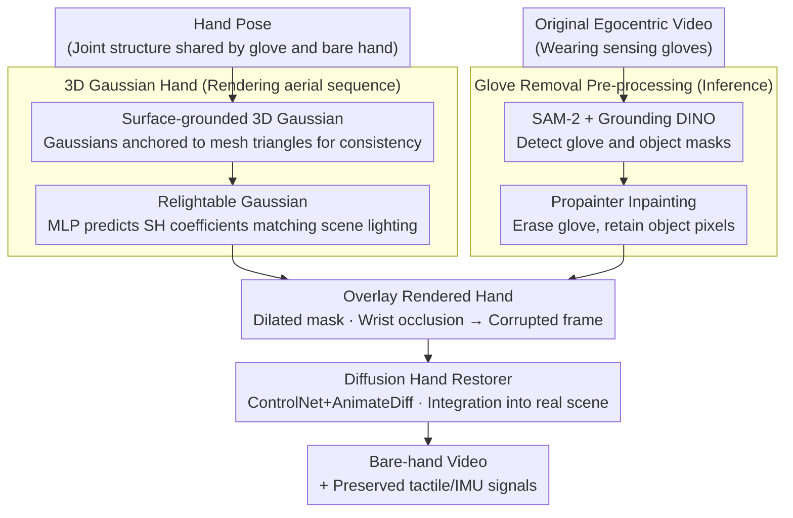

# Glove2Hand: Synthesizing Natural Hand-Object Interaction from Multi-Modal Sensing Gloves

**Conference**: CVPR 2026  
**arXiv**: [2603.20850](https://arxiv.org/abs/2603.20850)  
**Code**: [https://mlzxy.github.io/glove2hand](https://mlzxy.github.io/glove2hand)  
**Area**: 3D Vision  
**Keywords**: Hand-Object Interaction, Sensing Gloves, Video Translation, 3D Gaussian Hand Model, Diffusion Models

## TL;DR
The Glove2Hand framework translates egocentric videos of users wearing sensing gloves into realistic bare-hand videos while preserving tactile and IMU signals. By constructing HandSense, the first multi-modal hand-object interaction dataset, it significantly improves downstream performance for bare-hand contact estimation and occluded hand tracking.

## Background & Motivation

**Background**: Understanding Hand-Object Interaction (HOI) is a fundamental problem in computer vision, robotics, and AR/VR. Current mainstream methods collect egocentric videos to develop data-driven algorithms, but these systems rely almost exclusively on the visual modality.

**Limitations of Prior Work**: Purely visual HOI data has two fundamental flaws: (1) a lack of physical information such as force and contact (current methods like ContactPose only estimate binary fingertip contact for pre-scanned rigid bodies); (2) severe hand occlusion due to limited viewpoints, as multi-camera studio setups are infeasible in field settings. While sensing gloves provide IMU and tactile signals, the significant domain gap in appearance between gloves and bare hands prevents models trained on glove data from generalizing to bare-hand tasks.

**Key Challenge**: There is an irreconcilable conflict: sensing gloves provide rich physical signals but introduce a domain gap, while bare-hand videos provide realistic visuals but lack physical information.

**Goal**: How to translate sensing glove videos into realistic bare-hand videos while preserving tactile/IMU signals for bare-hand learning? Specific sub-problems include: (1) achieving spatio-temporal consistency across frames (rather than just processing static images); (2) handling complex interactions with unknown/non-rigid objects.

**Key Insight**: A crucial observation is that despite the drastic appearance difference, gloves and bare hands share the same joint structure (hand pose). Therefore, the problem can be decomposed into two steps: first, translating the glove video into a consistent "aerial" bare-hand sequence (using 3D reconstruction for consistency), and then embedding the bare hand into the scene while restoring interaction details (using a diffusion model for flexibility).

**Core Idea**: By combining the spatio-temporal consistency of a 3D Gaussian hand model with the generative flexibility of a diffusion hand restorer, the framework achieves sensing-glove-to-bare-hand video translation while preserving multi-modal signals.

## Method

### Overall Architecture
The framework translates egocentric video featuring sensing gloves into video that appears as bare hands, while keeping the tactile and IMU signals intact. This allows physical signals to be used for training bare-hand task models. The paper splits the translation into two stages. First, a 3D Gaussian hand model uses the hand pose to render a temporally stable "aerial bare hand" sequence that matches scene lighting. Second, a diffusion hand restorer "welds" this rendered hand into the real scene, refining contact boundaries with objects and wrist transitions. During inference, a pre-processing step erases the glove: a detector masks the glove region, which is then filled using optical flow to restore the background while keeping object pixels intact.

### Key Designs

**1. Surface-grounded 3D Gaussian Hand: Ensuring No-jitter Rendering**

Spatio-temporal consistency is the foundation of the pipeline. If the rendered hand jitters or flickers, the subsequent restoration cannot recover it. The authors anchor 3D Gaussians directly onto the triangular facets of a canonical hand mesh. Each Gaussian is parameterized by barycentric coordinates $\mathbf{w}$, 2D scale $\mathbf{s}$, and rotation $\phi$. When the hand moves, instead of per-Gaussian linear skinning, the Gaussians follow the mesh deformation via the 2D affine deformation gradient $\mathbf{A}=\mathbf{M}_{\text{deform}}\mathbf{M}_{\text{canon}}^{-1}$. Compared to 2DGS, which uses regularization to force Gaussians toward a surface, this method uses the mesh as a hard geometric prior, resulting in significantly more stable transformations and consistent surface normals.

**2. Relightable Gaussians: Matching Egocentric Lighting**

Egocentric lighting changes constantly as the user moves or shadows shift. Re-rendering the hand with fixed lighting looks artificial. The authors use a small MLP to predict spherical harmonic coefficients $\mathbf{l}$ based on hand pose $\mathbf{P}$. Color is decomposed into albedo and illumination $\mathbf{c}\odot\text{SH}(\mathbf{l},\mathbf{n})$. Independent environment maps are predicted for the palm and back of the hand. Since normals originate from the mesh geometry rather than the Gaussians themselves, the classical albedo-illumination ambiguity is suppressed.

**3. Diffusion Hand Restorer: Integrating the Hand into the Real Scene**

A clean "aerial bare hand" is insufficient; directly overlaying it leads to interpenetration with objects and unnatural wrist transitions. The authors train a restorer based on ControlNet + AnimateDiff by intentionally creating "corrupted" training inputs: overlaying the rendered hand onto bare-hand video frames with dilated masks and occluded wrists. At inference, the model applies this restoration ability to a frame where the glove has been erased (using SAM-2 + Grounding DINO and Propainter inpainting) and the rendered hand has been overlaid. Processing interactions in the pixel domain via diffusion is more flexible than explicit geometric modeling for unknown and non-rigid objects.

### Loss & Training
The 3D Gaussian hand model is trained via image reconstruction loss through differentiable rendering, with one model optimized per subject. After freezing the subject-specific Gaussian hand, a unified diffusion hand restorer is trained. Training data is sourced from HOT3D and HandSense.

## Key Experimental Results

### Main Results

| Method | FID ↓ | FVD ↓ | FVD-long ↓ |
|------|-------|-------|------------|
| HandRefiner | 35.5 | 24.2 | 29.7 |
| BrushNet | 37.9 | 34.5 | 40.4 |
| Pix2Pix | 38.6 | 24.7 | 31.4 |
| **Glove2Hand (Ours)** | **30.1** | **19.5** | **24.5** |

### Ablation Study

| Configuration | FID ↓ | FVD ↓ | FVD-long ↓ |
|------|-------|-------|------------|
| 2DGS | 91.1 | 50.0 | 62.9 |
| +Surface Grounding | 60.3 | 35.1 | 46.6 |
| +Relightable | 56.7 | 30.7 | 40.2 |
| +Diffusion | 32.3 | 19.8 | 22.7 |
| +Glove Removal | 31.2 | 20.9 | 25.0 |
| +Object Mask (Full) | 30.1 | 19.5 | 24.5 |

### Downstream Task: Contact Estimation

| Training Data | Contact IoU (%) | Precision (%) | Recall (%) |
|----------|----------------|---------------|------------|
| Glove only | 71.5 | 82.8 | 83.9 |
| G2H only | 75.6 | 90.6 | 82.0 |
| Hand only | 85.3 | 90.0 | 94.2 |
| **Hand + G2H** | **88.2** | **92.6** | **94.9** |

### Key Findings
- Surface Grounding and the Diffusion Restorer contribute most to performance, with FID dropping from 91.1 to 60.3 and 56.7 to 32.3, respectively.
- Directly training a hand tracker on glove data degrades performance (MKPE 19.5 to 26.5), confirming the severity of the domain gap.
- Combining synthetic bare-hand video with real bare-hand data yields the best contact estimator, validating the framework as a data engine.

## Highlights & Insights
- Aligning hardware sensors (tactile/IMU) with visual generation establishes a "sensors-as-GT" data generation paradigm, which is transferable to other domains requiring expensive annotations.
- The surface-grounded Gaussian design is elegant: a single geometric prior solves spatio-temporal consistency, relighting, and deformation with minimal implementation complexity.
- Learning the glove-to-hand mapping from unpaired data avoids the heavy cost of collecting synchronized multi-modal pairs.

## Limitations & Future Work
- The requirement for per-subject optimization of the 3D Gaussian model limits direct deployment to new users.
- Reliance on SAM-2 and Grounding DINO pipelines may lead to failure in extreme occlusion or complex backgrounds.
- The small dataset scale (5 subjects) requires further validation at a larger scale.
- Non-rigid object interaction handling lacks explicit physical consistency guarantees (e.g., force-pose consistency).

## Related Work & Insights
- **vs HandRefiner**: While HandRefiner focuses on single-frame hand repair, this work integrates 3D reconstruction for temporal consistency, achieving a 5.4 point lower FID.
- **vs Hand Avatar Methods**: Traditional avatars require dense multi-view setups; the surface-grounded design here adapts to sparse egocentric views and dynamic lighting.
- **vs MeDM**: General video translation fails to handle the massive embodiment difference between gloves and bare hands; this work decouples the problem using a shared joint structure.

## Rating
- Novelty: ⭐⭐⭐⭐
- Experimental Thoroughness: ⭐⭐⭐⭐⭐
- Writing Quality: ⭐⭐⭐⭐⭐
- Value: ⭐⭐⭐⭐

<!-- RELATED:START -->

## Related Papers

- [\[CVPR 2026\] ForeHOI: Feed-forward 3D Object Reconstruction from Daily Hand-Object Interaction Videos](forehoi_feed-forward_3d_object_reconstruction_from_daily_hand-object_interaction.md)
- [\[CVPR 2026\] CARI4D: Category Agnostic 4D Reconstruction of Human-Object Interaction](cari4d_category_agnostic_4d_reconstruction_of_human_object_interaction.md)
- [\[CVPR 2026\] Fast3Dcache: Training-free 3D Geometry Synthesis Acceleration](fast3dcache_training-free_3d_geometry_synthesis_acceleration.md)
- [\[CVPR 2026\] Iris: Integrating Language into Diffusion-based Monocular Depth Estimation](iris_integrating_language_into_diffusion-based_monocular_depth_estimation.md)
- [\[CVPR 2026\] DuoMo: Dual Motion Diffusion for World-Space Human Reconstruction](duomo_dual_motion_diffusion_for_world-space_human_reconstruction.md)

<!-- RELATED:END -->
