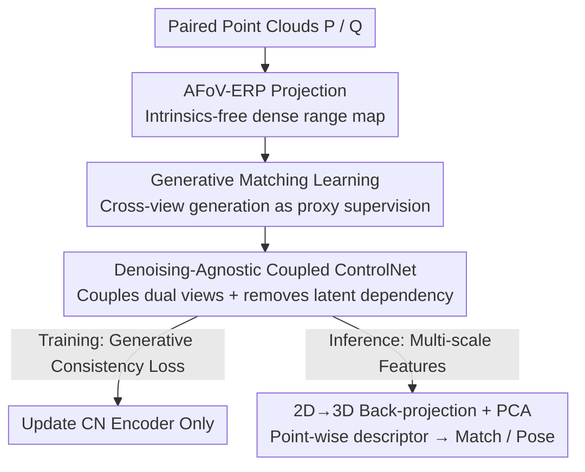

# GM-R²: Generative Matching Learning for Unsupervised Geometric Representation and Registration

**Conference**: CVPR 2026  
**Paper**: [CVF Open Access](https://openaccess.thecvf.com/content/CVPR2026/html/Jiang_GM-R2_Generative_Matching_Learning_for_Unsupervised_Geometric_Representation_and_Registration_CVPR_2026_paper.html)  
**Code**: None  
**Area**: 3D Vision / Self-supervised representation learning  
**Keywords**: Point cloud registration, Unsupervised geometric descriptor, Generative supervision, ControlNet, Cross-view generation  

## TL;DR
Ours reformulates "learning geometric descriptors" as a proxy task of "generating cross-view images conditioned on geometry"—only when the geometric features of two point clouds are consistent can the generator conditioned on them synthesize consistent cross-view images. GM-R² uses this generative consistency as implicit supervision to train a ControlNet encoder, achieving unsupervised registration SOTA on 3DMatch / ScanNet, even surpassing some fully supervised methods.

## Background & Motivation
**Background**: The core of point cloud registration is learning a set of highly discriminative point-wise geometric descriptors to find correspondences between two point clouds. Current mainstream methods are deep descriptors (FCGF, Predator, GeoTrans, PARE-Net, etc.), most of which rely on **ground truth (GT) rigid transformation labels** to construct reliable correspondences for training with contrastive loss.

**Limitations of Prior Work**: GT transformation labels are difficult and expensive to collect in large-scale scenes, significantly increasing training costs and limiting scaling up. Existing unsupervised approaches roughly fall into three categories—synthesizing pseudo-correspondences/pseudo-transformation labels, introducing alignment losses (e.g., Chamfer distance) as indirect supervision, or learning representations through point/feature-level reconstruction losses—but they often fail in **partially overlapping, repetitive structures, and complex real-world scenes**, frequently getting trapped in local optima.

**Key Challenge**: There is a choice between spending on precise supervision signals (fully supervised) or using weak/indirect signals that are not robust in difficult scenarios (existing unsupervised). The root problem is the lack of a **label-free yet sufficiently strong** supervision signal to constrain "cross-view feature consistency."

**Key Insight**: Drawing inspiration from the success of generative AI, the authors observe a fact—**only "consistent" geometric conditions can drive a generator to synthesize cross-view consistent images**. Consequently, the ability to "generate consistent images" can be used to infer whether "features are consistent," treating generative quality as a label-free proxy supervision.

**Core Idea**: Use **geometry-conditioned cross-view image generation** as a proxy task to replace GT pose labels, forcing the ControlNet encoder to learn consistent geometric features. After training, the encoder is used directly to extract point-wise descriptors for matching.

## Method

### Overall Architecture
GM-R² (Generative Matching Learning for Robust Registration) models unsupervised descriptor learning as a maximum likelihood problem: given paired point clouds $(P, Q)$ and their RGB images $(I_P, I_Q)$ from different perspectives of the same scene, optimize the point-wise geometric feature extractor $g_\theta$ such that the geometric conditional generator $p(\cdot)$ can recover consistent cross-view images from geometric features:

$$\max_\theta\ \mathbb{E}_{(I_P, I_Q, P, Q)\sim \mathcal{D}}\big[\log p\big(I_P, I_Q \mid g_\theta(P), g_\theta(Q)\big)\big]$$

The key insight is that a **range map-conditioned ControlNet naturally serves as this generator**—reusing the ControlNet encoder $\mathrm{CN}_{enc}$ as the geometric feature extractor $g_\theta$, and letting the frozen Stable Diffusion synthesize cross-view images under the geometric conditions provided. However, directly using ControlNet hits three practical engineering hurdles: (i) projecting point clouds to range maps requires precise camera intrinsics, which are often unavailable; (ii) original ControlNet is for single-view generation and does not support the cross-view paired synthesis required by GM-R²; (iii) the ControlNet encoder depends on the denoising process and requires noise latent inputs, while only geometry is available during inference. The three key designs below address these hurdles.

The entire pipeline consists of training and inference phases: During training, point clouds are projected into range maps via AFoV-ERP $\rightarrow$ fed into Denoising-Agnostic Coupled ControlNet to condition SD for cross-view generation $\rightarrow$ backpropagated using generative consistency loss, updating only the ControlNet encoder. During inference, the denoising branch is discarded, and the encoder extracts multi-scale features $\rightarrow$ back-projects to 3D $\rightarrow$ concatenates into descriptors for matching and pose estimation.

### Key Designs

**1. Generative Matching Learning: Inferring consistency from generative success**

This design directly addresses the "lack of strong supervision" in unsupervised learning. Traditional contrastive learning requires GT correspondences to indicate similarity; GM-R² treats cross-view image generation as a proxy task where **generative quality itself is the supervision**. Its validity relies on the fact that if the geometric features of two point clouds are not consistent, the generator receives "conflicting" conditions and fails to produce consistent cross-view images. To generate consistent images, $g_\theta$ is forced to extract consistent features. In implementation, the authors use the ControlNet encoder $\mathrm{CN}_{enc}$ as $g_\theta$, taking range maps as conditions to inject 3D structure into the frozen SD backbone (Formula: $y_t = \mathrm{SD}_{enc}(x_t) + Z(\mathrm{CN}_{enc}(x_t + Z(c)))$). Thus, supervision bypasses GT poses and relies entirely on the free constraint that "paired views of the same scene should generate consistently." Compared to GenerativePCR, which requires slow iterative denoising during inference, GM-R² inference only requires a single forward pass of the encoder.

**2. AFoV-ERP Projection: Intrinsics-free and maximizing resolution by "expanding" narrow FOV point clouds**

Addressing challenge (i)—range map projection dependency on intrinsics. Standard perspective projection requires camera intrinsics. The authors instead use Equirectangular Projection (ERP): for each point $p_i=(x_i,y_i,z_i)$, spherical coordinates $\theta_i=\mathrm{arctan2}(x_i,z_i)$ and $\phi_i=\arcsin(y_i/\|p_i\|_2)$ are calculated and mapped to an $H\times W$ grid, storing Euclidean distance $r_i=\|p_i\|_2$. This requires no intrinsics. However, standard ERP assumes a $360^\circ\times180^\circ$ full field of view, while real sensors cover only a small angular region, causing most of the range map to be empty. AFoV-ERP introduces **adaptive scaling**: it finds the angular boundaries $(\theta_{min},\theta_{max}),(\phi_{min},\phi_{max})$ and spans $\Delta\theta,\Delta\phi$ enclosing all active points, then re-normalizes coordinates within these boundaries:

$$\tilde u_i = \Big\lfloor \frac{\theta_i-\theta_{min}}{\Delta\theta}W \Big\rfloor,\quad \tilde v_i = \Big\lfloor \frac{\phi_i-\phi_{min}}{\Delta\phi}H \Big\rfloor$$

This effectively "stretches" the occupied FOV to fill the entire ERP resolution, maximizing pixel utilization and preserving geometric fidelity for dense high-resolution range maps. Ablations show it improves Chamfer@1 from 66.5 (ERP) to 86.2.

**3. Denoising-Agnostic Coupled ControlNet: Transforming single-view to cross-view and removing latent dependency for inference alignment**

This design addresses challenges (ii) and (iii). The **Coupled** part: To avoid altering the ControlNet architecture (which would destroy pre-trained priors), source and target range maps are concatenated vertically into a unified input $\tilde d_{PQ}=[\tilde D_P;\tilde D_Q]\in\mathbb{R}^{2H\times W}$, with corresponding latents coupled as $\tilde x_t^{PQ}=[\tilde x_t^P;\tilde x_t^Q]$. The single-image input is thus extended to cross-view, implicitly forcing "correspondence-aware" conditional features. The **Denoising-Agnostic** part addresses the training-inference gap: the original ControlNet encoder takes both noise latent $\tilde x_t^{PQ}$ and geometry $\tilde d_{PQ}$, but 3D matching inference has only range maps and no latents. The authors remove the latent input from the encoder, making generation conditioned solely on coupled geometry:

$$\tilde y_t^* = \mathrm{SD}_{enc}(\tilde x_t^{PQ}) + \mathrm{CN}^*(\tilde d_{PQ}) = \mathrm{SD}_{enc}(\tilde x_t^{PQ}) + Z\big(\mathrm{CN}_{enc}(Z(\tilde d_{PQ}))\big)$$

This offers two benefits: First, the supervision signal is anchored to 3D structural consistency, moving generation from a "pixel-level goal" to a "geometry-aware supervision mechanism." Second, the encoder follows **exactly the same path** during training and inference (viewing only geometry, not latents), eliminating training-inference inconsistency for pure geometric inference.

### Loss & Training
Training reformulates the maximum likelihood objective into a standard latent diffusion denoising loss, **optimizing only the ControlNet encoder $\theta$ while freezing the denoiser $\omega$**:

$$\mathcal{L}=\mathbb{E}\Big[\big\|\epsilon_\omega(\tilde x_t^{PQ}, t, \mathrm{CN}_{enc}(\tilde d_{PQ};\theta)) - \epsilon\big\|_2^2\Big]$$

where $\tilde x_t^{PQ}$ is the $t$-step noise latent of the coupled ground truth image $\tilde I_{PQ}=[\tilde I_P;\tilde I_Q]$, and $\epsilon\sim\mathcal{N}(0,I)$. Since generated images are in the spherical domain while dataset GT images are perspective, an **Image Spherical Mapping** is used to project perspective GT images to the sphere (calculating camera rays via $d(\theta,\phi)=[\sin\theta\cos\phi,\sin\phi,\cos\theta\cos\phi]$ and back-projecting to the perspective plane for bilinear inverse sampling). Training data consists of 48,000 point cloud + RGB pairs randomly sampled from ScanNet (without transformation labels). Range map resolution is $512\times1024$, using AdamW, learning rate $1\times10^{-5}$, for 15 epochs on a single L20. Inference uses $L=13$ layers of feature maps, selecting scales (2,5,8) to upsample to ERP resolution, back-projecting 2D pixel features to 3D points, concatenating with traditional FPFH descriptors, distilling via PCA, and finally using a robust pose estimator.

## Key Experimental Results

### Main Results
On two indoor RGB-D datasets, the sampling interval is intentionally increased to create difficult low-overlap scenarios (40-frame gap for 3DMatch, 50-frame for ScanNet). △ = Unsupervised, ♢ = Fully Supervised.

3DMatch Metrics (Selected, Acc↑ / Err↓):

| Method | Supervision | Rot Acc@5↑ | Rot Mean Err↓ | Trans Mean Err↓ | Chamfer Mean↓ |
|------|------|-----------|---------------|------------------|----------------|
| FPFH | Traditional | 69.1 | 15.0 | 37.4 | 57.6 |
| PPFFoldNet | Unsupervised | 40.3 | 49.5 | 129.9 | 96.0 |
| FCGF | Supervised | 90.4 | 9.4 | 19.2 | 40.3 |
| Generative-FCGF | Supervised | 94.3 | 4.5 | 12.5 | 37.7 |
| PARE-Net | Supervised | 93.0 | 6.6 | 15.8 | 12.8 |
| **GM-R² (Ours)** | **Unsupervised** | **96.2** | **2.0** | **6.4** | **4.2** |

Compared to the strongest baseline PARE-Net, mean rotation error drops by 2.5 and mean translation error by 8.6, achieving best results across nearly all metrics despite being unsupervised. On ScanNet, GM-R² also achieves precision comparable to or better than supervised SOTA (Rot Acc@45 95.8, Rot Mean Err 7.3).

### Ablation Study
Ablations on 3DMatch (Default configuration marked with *):

| Config | Rot Mean Err↓ | Trans Mean Err↓ | Chamfer@1↑ | Description |
|------|---------------|------------------|------------|------|
| ERP | 3.4 | 10.9 | 66.5 | Standard full-view ERP |
| **AFoV-ERP\*** | **2.0** | **6.4** | **86.2** | Adaptive scaled projection |
| Map Scale (256,512) | 2.0 | 6.5 | 84.0 | Low resolution |
| Map Scale (384,768) | 2.0 | 6.4 | 84.3 | Medium resolution |
| Map Scale (512,1024)\* | 2.0 | 6.4 | 86.2 | Default high resolution |

### Key Findings
- **AFoV-ERP is the main performance driver**: Reverting to standard ERP causes Chamfer@1 to drop from 86.2 to 66.5 and translation error to rise from 6.4 to 10.9, proving that "expanding the narrow FOV + intrinsics-free" is vital for geometric condition quality.
- **Low sensitivity to range map resolution**: Metrics fluctuate only slightly between (256,512) and (512,1024), with high resolution providing a ~2 point gain in Chamfer@1.
- **Unsupervised surpassing supervised**: GM-R² leads significantly in difficult scenarios with low overlap and high outlier ratios, suggesting that geometric priors in large generative foundation models (ControlNet/SD) plus generative consistency supervision are more robust than GT pose supervision.

## Highlights & Insights
- **"Generative quality as supervision" is a transferable paradigm**: Reformulating discriminative tasks as generative proxy tasks to remove expensive labels. This approach of using generative consistency as implicit supervision could transfer to other tasks requiring alignment where labels are scarce, such as cross-modal registration or self-supervised optical flow.
- **The Denoising-Agnostic design is elegant**: Identifying the "training has latents, inference doesn't" gap and removing latents from the encoder input ensures the encoder follows the same path in both phases, anchoring supervision to 3D structure rather than pixels.
- **Reusing foundation models instead of training from scratch**: Freezing the SD denoiser and only tuning the ControlNet encoder leverages the strong visual/geometric priors within SD, enabling unsupervised performance to outstrip supervised methods.

## Limitations & Future Work
- ⚠️ Training was conducted only on ScanNet, and evaluation is limited to **indoor RGB-D** datasets (3DMatch/ScanNet). Whether it holds for outdoor LiDAR or pure geometric scenes without RGB pairs is unverified—the method **strongly relies on paired RGB images** as generative targets.
- ⚠️ The Image Spherical Mapping step **still uses camera intrinsics** to project perspective GT images to the sphere, which creates some tension with the "intrinsics-free" claim (the intrinsics-free part only applies to the point cloud $\rightarrow$ range map projection).
- Inference involves running the SD/ControlNet encoder + multi-scale back-projection + PCA + FPFH; though faster than GenerativePCR's iterative denoising, the computational overhead relative to pure geometric descriptors (e.g., FCGF) warrants evaluation.

## Related Work & Insights
- **vs GenerativePCR (Generative-FCGF, etc.)**: Both use ControlNet for 3D→2D generation to enhance matching, but GenerativePCR is **fully supervised** and has slow inference due to iterative denoising; GM-R² is **unsupervised**, has faster single-pass inference, and uses a Denoising-Agnostic design.
- **vs Supervised Descriptors (FCGF / PARE-Net)**: These depend on GT transformations and contrastive loss, making them hard to scale; GM-R² uses generative consistency as label-free supervision and outperforms them in low-overlap scenarios.
- **vs Traditional Unsupervised Routes (Pseudo-labels / Chamfer loss / Reconstruction)**: These often trap in local optima for repetitive structures; GM-R² leverages the geometric priors of generative models to significantly improve robustness.

## Rating
- Novelty: ⭐⭐⭐⭐⭐ Reformulates descriptor learning as geometry-conditioned generation; a paradigm-level shift.
- Experimental Thoroughness: ⭐⭐⭐⭐ Two datasets + sufficient baselines + key ablations, but limited to indoor RGB-D without outdoor verification.
- Writing Quality: ⭐⭐⭐⭐⭐ Clear mapping between three challenges and three designs; motivations and formulas are well-explained.
- Value: ⭐⭐⭐⭐⭐ Unsupervised surpassing supervised; provides a compelling new route for label-free large-scale 3D matching.

<!-- RELATED:START -->

## Related Papers

- [\[ICLR 2026\] Unsupervised Representation Learning for 3D Mesh Parameterization with Semantic and Visibility Objectives](../../ICLR2026/3d_vision/unsupervised_representation_learning_for_3d_mesh_parameterization_with_semantic_.md)
- [\[ICLR 2026\] CLAP: Unsupervised 3D Representation Learning for Fusion 3D Perception via Curvature Sampling and Prototype Learning](../../ICLR2026/3d_vision/clap_unsupervised_3d_representation_learning_for_fusion_3d_perception_via_curvat.md)
- [\[CVPR 2026\] GaussianZoom: Progressive Zoom-in Generative 3D Gaussian Splatting with Geometric and Semantic Guidance](gaussianzoom_progressive_zoom-in_generative_3d_gaussian_splatting_with_geometric.md)
- [\[CVPR 2026\] RigMo: Unifying Rig and Motion Learning for Generative Animation](rigmo_unifying_rig_and_motion_learning_for_generative_animation.md)
- [\[CVPR 2026\] UniPixie: Unified and Probabilistic 3D Physics Learning via Flow Matching](unipixie_unified_and_probabilistic_3d_physics_learning_via_flow_matching.md)

<!-- RELATED:END -->
