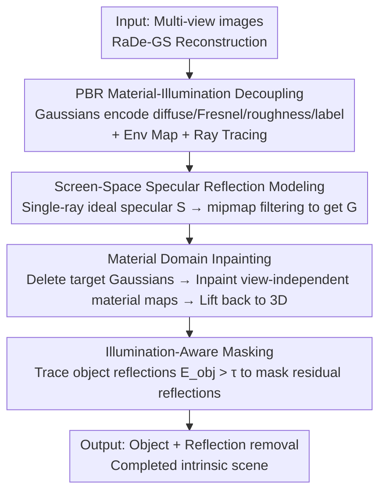

# GOR-IS: 3D Gaussian Object Removal In the Intrinsic Space

**Conference**: CVPR 2026  
**Paper**: [CVF Open Access](https://openaccess.thecvf.com/content/CVPR2026/html/Zhao_GOR-IS_3D_Gaussian_Object_Removal_In_the_Intrinsic_Space_CVPR_2026_paper.html)  
**Code**: https://applezyh.github.io/GOR-IS-project-page/  
**Area**: 3D Vision  
**Keywords**: 3D Gaussian Splatting, Object Removal, Intrinsic Decomposition, Global Illumination, Non-Lambertian Surfaces

## TL;DR
GOR-IS introduces 3D object removal by decomposing the scene from the RGB space into an intrinsic space of "material + illumination". By combining PBR-extended 3DGS with explicit light transport, it renders the reflections cast by objects on specular/metallic surfaces. It then performs completion in the view-independent material domain and employs an "illumination-aware mask" to suppress residual reflections. This successfully achieves the first correct removal of objects along with their reflections, outperforming existing methods by 13% in LPIPS and 2dB in PSNR.

## Background & Motivation

**Background**: Reconstructing 3D scenes from multi-view images using NeRF or 3DGS has become standard practice. Removing an object (object removal) from reconstructed scenes is a fundamental editing requirement in VR and embodied AI, demanding geometrically complete and visually seamless completion of previously occluded regions. Lacking native 3D inpainting models, current pipelines typically rely on "inpainting on 2D single views, then lifting back to 3D", where the key challenge has always been maintaining "cross-view geometric and appearance consistency."

**Limitations of Prior Work**: While existing methods (such as 3DGIC, AuraFusion360, GScream, GS Grouping, etc.) put significant effort into consistency, they consistently overlook two physical limitations. The first is the **global illumination effect**—specifically, the reflections cast by objects on glossy surfaces. When an object is removed, its reflection must also disappear; otherwise, a physical inconsistency occurs where the object is gone but its reflection remains. Second, these methods typically assume that **the color of the inpainted region is view-independent**. This assumption fails in non-Lambertian scenes where 3D points change radiance depending on the viewing angle, resulting in blurriness and ghosting.

**Key Challenge**: The fundamental issue is that these methods operate on the **RGB pixel space** for removal and inpainting, where material, illumination, and geometry are coupled. In this coupled space, it is impossible to isolate and remove object-specific reflections, nor is it possible to bypass the view-dependent nature of surface reflection colors.

**Goal**: Split object removal into two independent sub-problems: (1) maintaining global illumination consistency during object removal (removing reflections along with the target object); (2) performing view-consistent appearance inpainting on non-Lambertian surfaces.

**Key Insight**: The key insight is to **operate in the intrinsic space**. By decomposing the scene into intrinsic properties (such as albedo, roughness, Fresnel) and lighting, and explicitly modeling light transport. Because material properties are inherently view-independent, inpainting in the material domain bypasses the flawed "view-independent color" assumption. Furthermore, because light transport is explicitly modeled, reflections cast on mirror-like surfaces can be traced, identified, and deleted.

**Core Idea**: Replace direct "RGB space inpainting" with "intrinsic space decomposition + explicit light transport", making both global illumination consistency and non-Lambertian appearance consistency tractable.

## Method

### Overall Architecture
GOR-IS decomposes 3D object removal into a two-phase "decouple-then-inpaint" process. Its input is a set of pre-calibrated multi-view images, and its output is a reconstructed 3D scene after removing the target object (along with its reflections) and completing the occluded regions. The overall pipeline is anchored by two core modules: the **Material-Illumination Decoupling Module (Sec 3.2)**, which decomposes the scene into material and illumination domains while explicitly modeling light transport to ensure global illumination consistency; and the **Intrinsic Space Inpainting Module (Sec 3.3)**, which performs completion in the material domain and uses an illumination-aware mask to suppress reflection artifacts, ensuring appearance consistency. The underlying 3D representation leverages RaDe-GS (a 3DGS variant giving accurate depth and normals) and augments each Gaussian with PBR material attributes and an identity label of the target object.

The data flow progresses as follows: multi-view images $\rightarrow$ reconstruct Gaussians with material attributes + optimizable environment map $\rightarrow$ render diffuse and specular reflections per pixel via deferred shading to obtain the decomposed intrinsic scene $\rightarrow$ remove Gaussians with the target label to perform a coarse removal $\rightarrow$ render material maps to 2D, inpaint them, and lift them back to 3D $\rightarrow$ mask out regions affected by object reflections using the illumination-aware mask during supervision $\rightarrow$ obtain the clean, inpainted scene.

### Key Designs

**1. PBR Material-Illumination Decoupling and Explicit Light Transport: Casting "Reflections" as Computable, Removable Quantities**

To remove reflections along with the object, the reflections themselves must be explicitly calculated rather than baked into the RGB colors. Beyond the original Gaussian attributes in RaDe-GS (covariance $\Sigma$, position $\mu$, color $c$, opacity $o$), each Gaussian is extended with PBR materials: diffuse reflection $d\in\mathbb{R}^3$, Fresnel term $f_0\in\mathbb{R}^3$, roughness $r\in\mathbb{R}$, and a label $l\in\mathbb{R}$ to identify the target object. Since lighting is static in this task, the diffuse reflection is directly treated as an intrinsic material attribute to simplify optimization. Light transport is modeled explicitly using a "3DGS ray tracer for indirect radiance + optimizable environment map for direct radiance." Specifically, deferred shading is adopted: normals $n$, aggregated diffuse reflection $d_{agg}$, Fresnel $f_0^{agg}$, and roughness $r_{agg}$ are first rasterized to screen space, and then shaded pixel-by-pixel, splitting the outgoing color into a diffuse term $D$ and a specular term $G$:

$$C(\boldsymbol{x},\boldsymbol{\omega_o}) = D(\boldsymbol{x}) + G(\boldsymbol{x},\boldsymbol{\omega_o})$$

where $\boldsymbol{x}$ is the shading point corresponding to the pixel, and $\boldsymbol{\omega_o}$ is the viewing direction. Consequently, the reflection of the object on specular surfaces is no longer an inseparable cluster of pixels, but rather a computable quantity in the $G$ term that can be traced back to its source Gaussian. This provides the physical foundation for identifying and removing reflections, distinguishing this work from all predecessors operating solely in RGB space.

**2. Screen-Space Specular Reflection Modeling: Approximating Specular Reflections of General Glossy Surfaces with Single-Ray + Mipmap Filtering**

Accurately computing the specular term $G$ requires densely sampling incident radiance and solving the rendering equation, which is computationally prohibitive. Meanwhile, the common "ideal mirror" simplification can only handle perfect mirrors, failing on general rough-glossy surfaces. To address this, the authors introduce a **screen-space filter**. They first compute the ideal specular reflection $S$:

$$S(\boldsymbol{x},\boldsymbol{\omega_o}) = F(\boldsymbol{x},\boldsymbol{\omega_r})\,L_i(\boldsymbol{x},\boldsymbol{\omega_r})$$

The reflection direction is determined by the view direction and normal: $\boldsymbol{\omega_r}=\boldsymbol{\omega_o}-2(\boldsymbol{\omega_o}\cdot n)n$. The Fresnel term $F$ uses Schlick's approximation (relying on $F_0$, modeled by aggregated Fresnel $f_0^{agg}$). The incident radiance $L_i$ represents the environment map's direct radiance plus the indirect radiance from tracing Gaussians, weighted by visibility. A key observation is that **the specular reflection on a moderately rough surface can be approximated as a "blurred version" of the ideal specular reflection, where the blurriness level is determined by roughness**. Thus, a filtering operator $L[\cdot]$ is applied to $S$ to obtain the final specular term:

$$G = L[S,R] = L\big[F(\boldsymbol{x},\boldsymbol{\omega_r})L_i(\boldsymbol{x},\boldsymbol{\omega_r}),\,R\big]$$

In practice, $L[\cdot]$ is implemented using a screen-space mipmap pyramid, adaptively sampling the corresponding level based on surface roughness $R$ (modeled by $r_{agg}$). This approach traces only a single ray per pixel, avoiding multi-ray tracing to dramatically reduce cost while maintaining realistic glossy reflection effects—representing a highly practical trade-off between realism and efficiency.

**3. Material Domain Inpainting: Completing Non-Lambertian Surfaces via View-Independent Material Attributes**

The conventional 3D inpainting pipeline employs the label $l$ to identify and remove target Gaussians (coarse removal), exposing the occluded regions. It then renders 2D images $I_i$ and inpainting masks $P_i$ from multi-views, inpaints them using a 2D model (LaMa in this paper) to get $\hat I_i$, and lifts selected high-quality reference views back to 3D. However, this pipeline implicitly assumes view-independent color in the occluded regions, which fails on non-Lambertian surfaces. The authors circumvent this by **inpainting material maps rather than raw RGB colors**—specifically diffuse maps $D_i$, Fresnel maps $F_i$, roughness maps $R_i$, and normal maps $N_i$, guided by the same mask $P_i$. Because material attributes are naturally view-independent, inpainting in the material domain decouples the inpainting process from the view direction, facilitating view-consistent completion for non-Lambertian surfaces. This is a critical step in utilizing the intrinsic decomposition output for inpainting: decomposition not only aids reflection removal but also establishes a clean, view-independent workspace for reconstruction.

**4. Illumination-Aware Masking: Excluding Reflection-Polluted Supervision Regions to Prevent Residual Reflection Artifacts**

Even when the object's geometry is deleted, its reflections on specular surfaces may persist. Existing methods, which copy-paste GT outside predefined object masks for supervision, unintentionally force the model to learn these residual reflections as the "ground truth," leading to artifacts. The authors observe that **the influence of an object can extend beyond its occupied pixel regions due to reflections**. Thus, they feed the Gaussian label attribute into the light transport model, tracing target-sourced reflections along the reflection direction $\boldsymbol{\omega_r}$. This yields the incident label contribution $E_i(\boldsymbol{x},\boldsymbol{\omega_r})$ (computed similarly to incident radiance but substituting radiance with the label attribute). Specular transport then computes the object-related reflection:

$$E_{\text{obj}}(\boldsymbol{x},\boldsymbol{\omega_o}) = L\big[F(\boldsymbol{x},\boldsymbol{\omega_r})E_i(\boldsymbol{x},\boldsymbol{\omega_r}),\,R\big]$$

Pixels with reflection intensity higher than a threshold $\tau$ are classified as reflection-polluted regions, yielding a mask $M_r=[E_{\text{obj}}>\tau]$. During inpainting, $M_r$ is used to exclude these regions from GT supervision. This ensures that the object is removed without storing or learning its residual reflections, thereby preventing reflection-induced artifacts. This design elegantly reuses the light transport mechanism established in Designs 1 & 2, simply changing "radiance transport" to "label transport."

### Loss & Training
A two-stage training strategy is adopted. **The first stage** optimizes Gaussian primitives and the environment map using pre-calibrated multi-view images to complete scene decomposition and explicit light transport modeling, using the loss:

$$\mathcal{L} = \mathcal{L}_{c} + \lambda_{d}\mathcal{L}_{d} + \lambda_{dn}\mathcal{L}_{dn} + \lambda_{n}\mathcal{L}_{n} + \lambda_{s}\mathcal{L}_{s} + \lambda_{\Omega}\mathcal{L}_{\Omega}$$

where $\mathcal{L}_c$ is the color loss between the rendered image and GT, $\mathcal{L}_d$ is the depth distortion loss, $\mathcal{L}_{dn}$ is the depth-normal consistency loss between the rendered normal $N$ and the depth-derived normal $N_d$, $\mathcal{L}_n$ is the normal loss between the rendered normal and the reference normal $N_{gt}$ predicted by a normal estimator, $\mathcal{L}_s$ is the bilateral smoothness loss applied to material/normal maps, and $\mathcal{L}_{\Omega}$ is the binary cross-entropy loss for predicted labels and GT labels. **The second stage** freezes the environment map and optimizes the Gaussians under the guidance of 2D inpainting results to finish inpainting. The loss for the regions requiring inpainting is formulated as $\mathcal{L}_{\text{inpaint}} = \lambda_A\mathcal{L}_A + \lambda_M\mathcal{L}_M$—where $\mathcal{L}_A$ is the appearance loss between the rendered and inpainted images (applied to Lambertian surfaces only), and $\mathcal{L}_M$ is the material loss (applied to diffuse/Fresnel/roughness/normals on non-Lambertian surfaces). For static regions not requiring inpainting, the first-stage loss is retained (excluding $\mathcal{L}_s$ and $\mathcal{L}_{\Omega}$), with the illumination-aware mask $M_r$ excluding reflection-affected regions from loss computation.

## Key Experimental Results

### Main Results
The authors constructed two datasets with strong global illumination effects (each scene containing a prominent non-Lambertian surface): a synthetic set GOR-IS-Synthetic (8 scenes rendered using Blender Cycles, with 100 training views + 100 novel test views per scene) and a real-world set GOR-IS-Real (2 scenes captured with a digital camera yielding around 300 images, mask generated via SAM2). Generalization was also tested on SPIn-NeRF (10 scenes), which is primarily Lambertian with minimal global illumination effects. Metrics include PSNR / SSIM / LPIPS / FID, along with M-LPIPS / M-FID computed specifically over the object's occupied region.

| Dataset | Metric (PSNR↑ / LPIPS↓) | Ours | Second-Best Baseline | Gain |
|--------|----------------------|------|--------------|------|
| GOR-IS-Synthetic | PSNR | **31.91** | 29.92 (GScream) | +1.99 dB |
| GOR-IS-Synthetic | LPIPS | **0.039** | 0.045 (GScream) | ↓13% |
| GOR-IS-Synthetic | M-LPIPS | **0.060** | 0.093 (GS-Grouping) | ↓35% |
| GOR-IS-Real | PSNR | **24.52** | 22.42 (GScream) | +2.10 dB |
| GOR-IS-Real | LPIPS | **0.101** | 0.109 (GScream) | ↓7% |
| SPIn-NeRF (Lambertian) | PSNR | 20.15 | 20.55 (SPIn-NeRF) | Comparable to SOTA |
| SPIn-NeRF (Lambertian) | FID | **32.7** | 29.8 (GScream) | Near optimal |

On the two datasets with global illumination effects, GOR-IS significantly outperforms existing baselines across almost all metrics (Synthetic PSNR: 31.91 vs. 29.92; Real PSNR: 24.52 vs. 22.42). On Lambertian scenes in SPIn-NeRF that lack noticeable global illumination effects, GOR-IS remains on par with the SOTA, demonstrating that the inclusion of intrinsic modeling does not degrade generalization capabilities in simpler scenes.

### Ablation Study
The authors conducted two sets of incremental ablation studies on GOR-IS-Synthetic. The first set starts from the RaDe-GS baseline and incrementally adds explicit light transport (ELT) and screen-space filtering:

| Configuration | PSNR | LPIPS | M-LPIPS | FID | Description |
|------|------|-------|---------|-----|------|
| Baseline (RaDe-GS) | 28.60 | 0.050 | 0.099 | 34.0 | No light transport modeled |
| + ELT modeling | 31.44 | 0.043 | 0.064 | 25.7 | Add explicit light transport, PSNR +2.84 |
| + screen-space filtering | **31.91** | **0.039** | **0.060** | **23.4** | Add screen-space filtering |

The second set removes individual modules of the intrinsic inpainting pipeline from the full model:

| Configuration | PSNR | LPIPS | M-LPIPS | FID | M-FID | Description |
|------|------|-------|---------|-----|-------|------|
| w/o LA masking | 31.64 | 0.040 | 0.060 | 24.1 | 65.8 | Remove illumination-aware masking |
| w/o material inpainting | 31.31 | 0.041 | 0.075 | 24.0 | 71.4 | Remove material inpainting; M-LPIPS/M-FID degrade significantly |
| Full model | **31.91** | **0.039** | **0.060** | **23.4** | **65.0** | Full model |

### Key Findings
- **Explicit light transport is the primary contributor**: Integrating ELT on top of the baseline elevates PSNR from 28.60 to 31.44 (+2.84 dB) and reduces M-LPIPS from 0.099 to 0.064, proving that "explicitly rendering reflections" is fundamental to physical consistency. Screen-space filtering further refines specular details.
- **Material inpainting mainly benefits the object-occupied regions**: Removing material inpainting mostly impacts local region evaluation metrics like M-LPIPS (0.060 $\rightarrow$ 0.075) and M-FID (65.0 $\rightarrow$ 71.4), suggesting its explicit purpose is to resolve inpainting quality on non-Lambertian surfaces rather than boosting overall image quality.
- **Illumination-aware masking specifically targets residual reflections**: Omitting it leads to minor decreases in PSNR/FID (31.91 $\rightarrow$ 31.64, 23.4 $\rightarrow$ 24.1). Its primary benefit lies in suppressing reflection-induced blurriness and artifacts, eliminating visual inconsistencies.
- **Generalization yields no adverse side effects**: Performance remains on par with SOTA on the Lambertian-only SPIn-NeRF dataset, indicating that adopting intrinsic modeling does not compromise performance when such modeling is unnecessary.

## Highlights & Insights
- **A paradigm shift of "replacing spaces" instead of "replacing networks"**: Traditional works struggle with consistency within the RGB space. GOR-IS instead shifts the rendering space to an intrinsic space, naturally resolving both "reflection deletion" and "non-Lambertian inpainting" which are otherwise intractable in RGB space. This shift is a key "Aha!" moment—many challenges that seem to require stronger generative models are simply a consequence of operating in suboptimal representation spaces.
- **Label reuse in light transport to trace reflections**: Modeling "whether a point belongs to the target object" as a transmissible property and tracing it along the reflection direction $\boldsymbol{\omega_r}$ (with $E_{\text{obj}}$ sharing an identical formulation as specular term $G$) elegantly produces reflection-collision masks at negligible mechanism overhead.
- **Single-ray + mipmap approximating glossy reflections**: Estimating glossy reflections as "blurred ideal specular reflections where blurriness matches roughness" compresses expensive multi-ray tracing to a single-ray plus adaptive mipmap lookup per pixel, standing as a highly practical trick that is transferable to general real-time PBR workflows.
- **Transferability to relighting and scene editing**: The intrinsic decomposition and explicit light transport foundation are not restricted to removal, but natively support downstream editing tasks like relighting and material editing—this work simply demonstrates its utility in object removal.

## Limitations & Future Work
- **Lack of explicit modeling for diffuse-related global illumination**: The authors acknowledge that this might lead to subtle inconsistencies in some scenes. Future iterations will require advanced light transport modeling and more robust intrinsic decomposition.
- **Difficulty handling inter-reflections between multiple non-Lambertian surfaces**: To avoid expensive multi-bounce path tracing, the framework traces rays directly within the radiance field. Consequently, it cannot handle recursive reflections within multiple mirrors.
- **Dependency on accurate intrinsic decomposition and material estimation**: The entire workflow is sensitive to the accuracy of RaDe-GS's depth, normals, and PBR material estimation. Inaccurate material estimates directly propagate to failures in light transport and material inpainting. *(Note: This is an inferred risk, subject to the original text.)*
- **Limited dataset scale**: The self-constructed dataset contains only 8 synthetic scenes and 2 real-world scenes. The limited real-world scale warrants broader validation under diverse global illumination scenarios in more extensive datasets.

## Related Work & Insights
- **vs. GScream / 3DGIC (Reference view-based inpainting)**: These approaches utilize one or several reference views to inpaint RGB and depth synchronously to sustain cross-view consistency. However, they operate entirely in RGB space, neglecting global illumination and failing on mirror reflections. GOR-IS addresses this explicitly via intrinsic spaces, serving as the main baseline and displaying clear superiority.
- **vs. AuraFusion360 / InFusion / Diffusion prior models**: These techniques leverage generative models or diffusion prior models to boost appearance consistency but still presume view-independent colors, resulting in blurriness on non-Lambertian surfaces. GOR-IS avoids this flat assumption by introducing view-independent material domain inpainting.
- **vs. Intrinsic decomposition/relighting methods (NeRF/3DGS PBR-based)**: Previous intrinsic decomposition efforts primarily focused on producing relightable assets or enhancing 3D representations (e.g., in highly specular scenes). GOR-IS is the first to introduce intrinsic decomposition specifically to achieve physically and visually consistent object removal.
- **vs. SPIn-NeRF (NeRF baseline)**: This early NeRF-based removal method is substantially outperformed by GOR-IS on scenes containing global illumination, but remains comparable on simpler Lambertian scenes. This confirms that the gains of GOR-IS stem precisely from its explicit modeling of light transport.

## Rating
- Novelty: ⭐⭐⭐⭐⭐ (The first to incorporate global illumination consistency into 3D object removal and solve it holistically in the intrinsic space; paradigm-level innovation)
- Experimental Thoroughness: ⭐⭐⭐⭐ (Well-aligned across synthetic/real datasets + SPIn-NeRF generalization + two sets of incremental ablations; however, having only 2 real-world scenes is on the lower side)
- Writing Quality: ⭐⭐⭐⭐⭐ (The logic from motivation, insight, methodology to ablated outcomes forms an excellent, clear closed loop; Figures 3/4/5 present the pipeline intuitively)
- Value: ⭐⭐⭐⭐ (Solves a long-standing, overlooked practical pain point in object removal, possessing direct value for VR and embodied scene editing)

<!-- RELATED:START -->

## Related Papers

- [\[CVPR 2026\] Towards Intrinsic-Aware Monocular 3D Object Detection](towards_intrinsic-aware_monocular_3d_object_detection.md)
- [\[ECCV 2024\] Learning 3D Geometry and Feature Consistent Gaussian Splatting for Object Removal](../../ECCV2024/3d_vision/learning_3d_geometry_and_feature_consistent_gaussian_splatting_for_object_remova.md)
- [\[CVPR 2026\] Intrinsic Geometry-Appearance Consistency Optimization for Sparse-View Gaussian Splatting](intrinsic_geometry-appearance_consistency_optimization_for_sparse-view_gaussian_.md)
- [\[CVPR 2026\] 3D-LATTE: Latent Space 3D Editing from Textual Instructions](3d-latte_latent_space_3d_editing_from_textual_instructions.md)
- [\[CVPR 2026\] Intrinsic Image Fusion for Multi-View 3D Material Reconstruction](intrinsic_image_fusion_for_multi-view_3d_material_reconstruction.md)

<!-- RELATED:END -->
