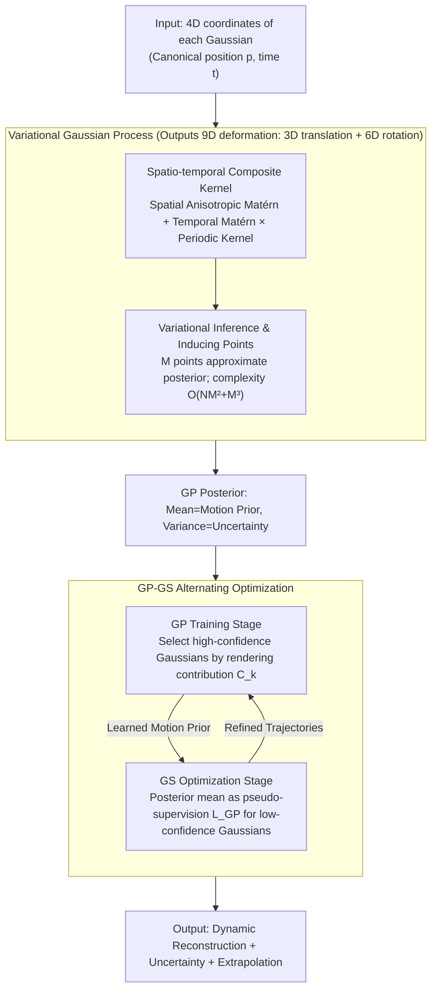

# GP-4DGS: Probabilistic 4D Gaussian Splatting from Monocular Video via Variational Gaussian Processes

**Conference**: CVPR 2026  
**arXiv**: [2604.02915](https://arxiv.org/abs/2604.02915)  
**Code**: None  
**Area**: 3D Vision  
**Keywords**: 4D Gaussian Splatting, Gaussian Processes, Uncertainty Quantification, Motion Extrapolation, Dynamic Scene Reconstruction

## TL;DR
The paper proposes GP-4DGS, which integrates Variational Gaussian Processes (GP) into 4D Gaussian Splatting (4DGS). By utilizing spatio-temporal composite kernels and variational inference, it achieves probabilistic motion modeling and equips 4DGS with three new capabilities: uncertainty quantification, motion extrapolation, and adaptive motion priors.

## Background & Motivation

**Background**: 4D Gaussian Splatting (4DGS) is a leading approach for dynamic novel view synthesis, modeling dynamic scenes by deforming 3D Gaussian primitives over time. Existing methods like D-3DGS (MLP deformation), 4DGS (HexPlane), and STG (polynomial deformation) have achieved impressive visual quality.

**Limitations of Prior Work**: (1) Existing methods treat motion as a deterministic optimization problem and impose hand-crafted motion priors (e.g., polynomial deformations, rigidity constraints). These fixed priors are applied uniformly across all primitives, which is unsuitable for regions with insufficient observations or occlusions. (2) There is a lack of uncertainty estimation mechanisms for motion prediction. (3) They cannot perform temporal extrapolation beyond the training frames.

**Key Challenge**: Fixed deterministic motion priors cannot distinguish between well-observed and sparsely-observed regions—over-constraining the former while under-constraining the latter. A mechanism is needed to automatically adjust regularization strength based on observational confidence.

**Goal**: (1) Provide principled uncertainty quantification for 4DGS motion prediction. (2) Learn motion priors from well-observed regions and propagate them to sparse or unobserved areas. (3) Enable temporal extrapolation beyond training frames.

**Key Insight**: Gaussian Processes are naturally distributions over a family of probabilistic functions, where kernels define the correlation structure of data. By using GPs to model deformation fields, adaptive priors, uncertainty quantification, and extrapolation can be achieved simultaneously—capabilities that emerge directly from the GP probabilistic formulation without additional modeling.

**Core Idea**: Replace deterministic deformation functions with Variational Gaussian Processes. Use spatio-temporal composite kernels to capture geometric and motion correlations. While the GP posterior mean guides the 4DGS optimization, uncertainty and extrapolation capabilities are naturally obtained.

## Method

### Overall Architecture
GP-4DGS addresses the issue in monocular videos where many Gaussian primitives have reliable observations for only a few frames. Previous methods relied on rigid manual priors that failed to constrain sparse regions while over-restricting dense ones. This approach replaces the deterministic deformation function for "how each Gaussian moves" with a **Variational Gaussian Process**. The 4D coordinates $\mathbf{x}=(\bm{p}, t)$ (canonical 3D position plus time) of each primitive are fed into the GP, which outputs a 9D deformation vector (3D translation plus 6D continuous rotation representation). The pipeline alternates between two stages: first, training the GP on Gaussians with reliable observations to learn the correlation structure of motion; second, in the 4DGS optimization stage, using the GP posterior mean as pseudo-supervision to constrain Gaussians that are poorly observed or prone to erratic movement. Since the GP is inherently a "probability distribution over functions," uncertainty, extrapolation, and adaptive priors are derived directly from its posterior.

### Key Designs

**1. Spatio-temporal Composite Kernel: Decoupling Geometric and Motion Correlations**

Standard GP kernels are isotropic by default, but in spatio-temporal data, "spatial proximity between two Gaussians" and "temporal correlation of the same Gaussian" represent different structures. GP-4DGS decomposes the kernel into spatial and temporal components: $k_i(\mathbf{x},\mathbf{x}') = k_i^{\text{spatial}}(\bm{p},\bm{p}') + k_i^{\text{temporal}}(\mathbf{x},\mathbf{x}')$. The spatial part uses an anisotropic Matérn kernel to allow for discontinuities, isolating spatially disconnected objects. The temporal part multiplies a per-axis Matérn kernel with a periodic kernel:

$$k^{\text{periodic}}(t,t') = \sigma^2 \exp\!\left(-\frac{2\sin^2(\pi|t-t'|/\tau)}{\ell^2}\right)$$

This allows correlations to fluctuate with the motion period $\tau$ while preserving spatial locality. This periodic kernel is critical for temporal extrapolation, injecting a strong inductive bias that motion is cyclical, preventing divergence when predicting beyond training frames.

**2. Variational Inference with Inducing Points: Improving Scalability**

Exact GP inference is $\mathcal{O}(N^3)$, which is infeasible for scenes with tens of thousands of Gaussians. $M$ inducing points $\mathbf{Z}=\{\mathbf{z}_m\}_{m=1}^M$ ($M \ll N$) are introduced to act as a representative support set for the GP. A variational posterior $q(\mathbf{u}_i)=\mathcal{N}(\mathbf{m}_i, \mathbf{S}_i)$ approximates the true posterior by maximizing the ELBO to learn kernel hyperparameters, inducing point positions, and variational parameters. Complexity is reduced to $\mathcal{O}(NM^2+M^3)$, with individual queries costing $\mathcal{O}(M)$. Inducing points are initialized by extracting features from each primitive's time series using Chronos, followed by k-means clustering. This feature-based initialization yields a higher ELBO (avg. 1.53 vs. 1.10 for random).

**3. GP-GS Alternating Optimization: Mutual Feedback**

GP and 4DGS complement each other through a two-stage alternating feedback loop. In the GP training stage, a confidence score is calculated for each primitive based on its cumulative rendering contribution across all images and rays: $C_k = \sum_{\mathbf{I}}\sum_{\mathbf{r}} \omega_{k,t}^{\pi}(\mathbf{r})$. Only the high-confidence subset where $C_k > \tau_C$ is used to train the GP. In the GS optimization stage, the GP posterior mean $\bar{\bm{\mu}}$ serves as pseudo-supervision, regularizing primitives that deviate from GP predictions:

$$\mathcal{L}_{\text{GP}} = \frac{1}{NT}\sum_{k,t} \delta_{(k,t)} \left\|\mathbf{y}_{(k,t)} - \bar{\bm{\mu}}_{(k,t)}\right\|^2$$

The gating threshold $\tau_\delta$ tightens during training. This self-reinforcing cycle allows well-observed regions to extract accurate motion priors, which in turn stabilize trajectories in poorly-observed regions, smoothing noise into physically plausible motion.

### Mechanism Example
Consider a background Gaussian periodically occluded by a foreground arm. If it is only clearly observed in 4 out of 15 frames, its contribution $C_k$ will be low in the other frames. During GP training, the model learns the motion correlation from those 4 reliable frames and, using the periodic kernel, infers that it should continue swinging with the same period during occlusion. In the GS optimization stage, the gate $\delta$ opens for this low-confidence Gaussian, and $\mathcal{L}_{\text{GP}}$ pulls it back to a reasonable trajectory based on the GP's predicted posterior mean. Simultaneously, the GP posterior variance will be high for the occluded frames, providing a direct measure of uncertainty.

### Loss & Training
The total loss is $\mathcal{L}_{\text{total}} = \mathcal{L}_{\text{recon}} + \lambda_{\text{GP}}\mathcal{L}_{\text{GP}}$, with $\lambda_{\text{GP}}=0.1$. Reconstruction follows SoM, including photometric loss, D-SSIM, flow loss, and smoothing loss. Uncertainty is obtained via Monte Carlo sampling from the GP posterior, as the non-linear transformation of rotations prevents direct variance propagation.

## Key Experimental Results

### Main Results (DyCheck)

| Method | mPSNR ↑ | mSSIM ↑ | mLPIPS ↓ |
|------|---------|---------|----------|
| D-3DGS | 11.92 | 0.49 | 0.66 |
| 4DGS | 13.42 | 0.49 | 0.56 |
| HyperNeRF | 15.99 | 0.59 | 0.51 |
| Gaussian Marbles | 15.84 | 0.54 | 0.57 |
| SoM | 17.09 | 0.65 | 0.39 |
| **Ours** | **17.38** | **0.65** | **0.37** |

### Motion Extrapolation (PSNR ↑)

| Method | Periodic (5f) | Periodic (15f) | Non-periodic (5f) | Non-periodic (15f) |
|------|-------------|-------------|--------------|--------------|
| Linear extrapolation | 11.55 | 8.11 | 15.02 | 11.92 |
| **Ours** | **17.62** | **16.65** | **15.27** | **13.22** |

### Uncertainty Quantification (AUSE-MSE ↓ ×10⁻²)

| Method | Top 20 Frames | Top 40 Frames | All Frames |
|------|----------|----------|-------|
| Random | 9.76 | 9.30 | 10.98 |
| UA-4DGS | 7.60 | 8.11 | 8.62 |
| **Ours** | **7.22** | **8.00** | **8.49** |

### Key Findings
- Performance gains are more significant on the DyCheck challenge subset (mPSNR 14.56 $\rightarrow$ 15.02), proving GP priors are most valuable in sparse observation areas.
- Periodic motion extrapolation shows a massive advantage (17.62 vs. 11.55) due to the periodic kernel capturing cyclic dynamics.
- GP guidance effectively regularizes motion trajectories, eliminating noise and jitter to produce physically plausible movement patterns.
- Inducing point initialization via time-series features consistently achieves higher ELBO compared to random or KNN-velocity initialization (1.53 vs. 1.10 vs 1.37).
- Maintains better geometric structural integrity under extreme viewpoint shifts in the DAVIS dataset.

## Highlights & Insights
- The approach of introducing probabilistic modeling into 4DGS is elegant: uncertainty quantification and motion extrapolation are natural outcomes of the GP formulation rather than added modules.
- The alternating GP-GS optimization is well-designed: confidence-weighted data selection ensures the GP learns from reliable data, which then guides unreliable regions in a "bootstrapping" fashion.
- The spatio-temporal composite kernel is physically intuitive: mapping spatial Matérn to object discontinuities and temporal periodic kernels to motion regularities combines their strengths orthogonally.

## Limitations & Future Work
- GP inference introduces additional computational overhead (updating GP cache every 2000 steps), which may be a bottleneck for real-time applications.
- The periodic kernel assumes cyclic motion; improvement for non-periodic complex motion extrapolation remains limited.
- Evaluation was conducted on a limited number of scenes (DyCheck and DAVIS).
- The approximation accuracy of Variational GP is restricted by the number of inducing points; high-resolution scenes may require more points.

## Related Work & Insights
- **vs. SoM (STG)**: SoM uses polynomial deformation as a fixed prior, whereas GP-4DGS learns data-adaptive priors, showing significant gains on challenge subsets.
- **vs. Stochastic GS**: While Stochastic GS models Gaussian attributes as random variables for static scenes, this work extends probabilistic modeling to 4D dynamic scenes.
- **vs. UA-4DGS**: UA-4DGS attempts uncertainty estimation, but GP-4DGS provides better calibration (lower AUSE) through kernel correlation structures.
- **vs. D-3DGS/4DGS**: These deterministic methods lack constraints in sparse observation regions, a gap effectively filled by the GP spatial correlation prior.

## Rating
- Novelty: ⭐⭐⭐⭐⭐ Combining GP with 4DGS is a fresh direction; spatio-temporal kernel design and alternating optimization are substantial.
- Experimental Thoroughness: ⭐⭐⭐⭐ Covers reconstruction, extrapolation, uncertainty, and ablation, though on a somewhat small number of scenes.
- Writing Quality: ⭐⭐⭐⭐⭐ Rigorous mathematical derivation, clear motivation, and excellent visualizations.
- Value: ⭐⭐⭐⭐ Opens a new direction for probabilistic modeling in 4DGS; uncertainty quantification is highly relevant for safety-critical applications like autonomous driving.

<!-- RELATED:START -->

## Related Papers

- [\[CVPR 2026\] 4C4D: 4 Camera 4D Gaussian Splatting](4c4d_4_camera_4d_gaussian_splatting.md)
- [\[CVPR 2026\] Mark4D: Temporally-Consistent Watermarking for 4D Gaussian Splatting](mark4d_temporally-consistent_watermarking_for_4d_gaussian_splatting.md)
- [\[CVPR 2026\] Flow4DGS-SLAM: Optical Flow-Guided 4D Gaussian Splatting SLAM](flow4dgs-slam_optical_flow-guided_4d_gaussian_splatting_slam.md)
- [\[CVPR 2026\] Learning Explicit Continuous Motion Representation for Dynamic Gaussian Splatting from Monocular Videos](learning_explicit_continuous_motion_representation_for_dynamic_gaussian_splattin.md)
- [\[CVPR 2026\] Illumination-Consistent Human-Scene Reconstruction from Monocular Video](illumination-consistent_human-scene_reconstruction_from_monocular_video.md)

<!-- RELATED:END -->
