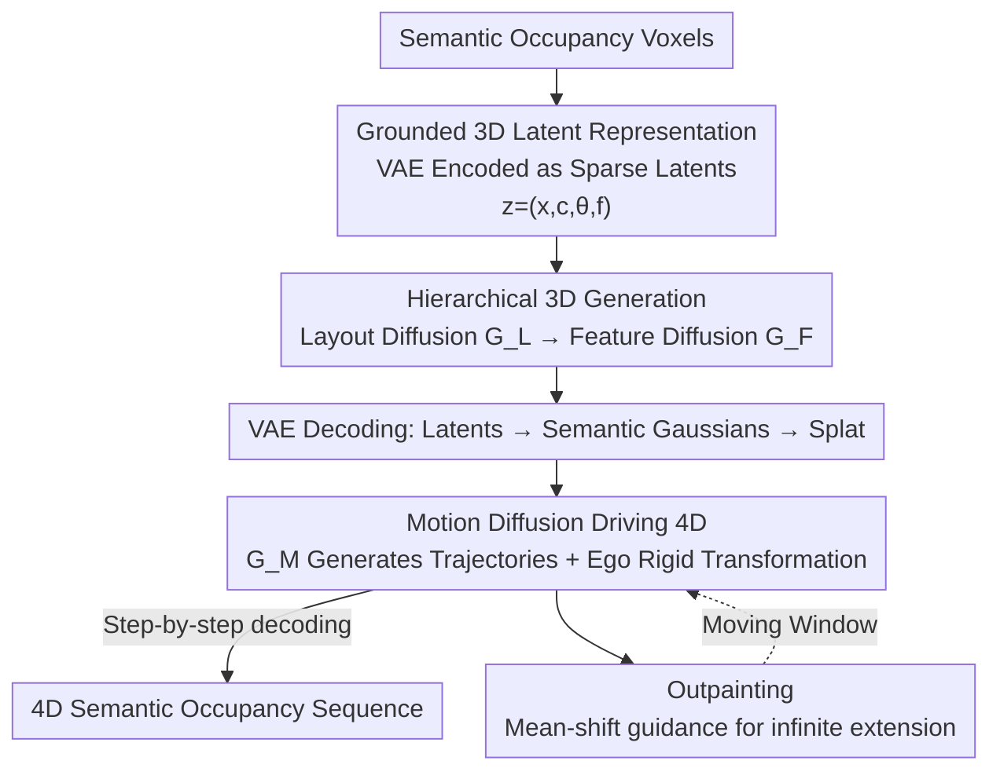

# Grounded Latents for Entity-Centric 4D Scene Generation

**Conference**: CVPR 2026  
**Paper**: [CVF Open Access](https://openaccess.thecvf.com/content/CVPR2026/html/Park_Grounded_Latents_for_Entity-Centric_4D_Scene_Generation_CVPR_2026_paper.html)  
**Code**: To be confirmed  
**Area**: 3D Vision / Scene Generation / Autonomous Driving  
**Keywords**: 4D Scene Generation, Grounded Latent Representation, Semantic Occupancy, Diffusion Models, Entity-Centric Modeling

## TL;DR
LatentWorld replaces driving scenes from "dense voxel volumes" to "sparse grounded 3D latent point sets with (X,Y,Z) coordinates and semantic categories." It uses layout diffusion + feature diffusion to generate editable 3D scenes, and then drives these persistent latent points across time using motion diffusion. This achieves SOTA 4D occupancy generation quality on CarlaSC and Waymo, significantly reducing merging, flickering, and splitting artifacts of foreground objects.

## Background & Motivation

**Background**: Recent 3D/4D driving scene generation is almost entirely performed as denoising diffusion on **dense voxels/grids** (OccSora, DynamicCity, SemCity, PDD, XCube, etc.), where the entire scene is jointly generated as a discretized volume, producing decent scene-level results.

**Limitations of Prior Work**: Dense voxel representations **lack an explicit concept of entities**—a car is merely a cluster of continuous voxels with no clear boundaries with neighbors. This introduces three specific problems: (1) Foreground objects (cars, pedestrians) are not parameterized independently; placing or moving a specific actor requires conditioning the entire generator with coarse-grained control signals, rendering reliable, individual-actor adjustments impossible. (2) When scaling to dynamic scenes, the lack of entity modeling manifests directly as target **merging, flickering, and splitting** in the sequences. (3) Computation is uniformly distributed across the entire grid (including vast empty free spaces), making high-resolution generation prohibitively expensive, wasting compute where there is no content.

**Key Challenge**: Dense grids **entangle** whole-scene geometry with the identity/motion of individual entities within a discretized volume. Achieving fine-grained controllability requires increasing the grid resolution (which explodes computational costs), yet higher resolution still fails to resolve the fundamental issue of unclear entity boundaries. Furthermore, ego-motion can only be expressed through implicit scene-wide updates, preventing a clean decoupling of actor motion and ego-motion.

**Goal**: Find a representation that: (a) allows each foreground actor to have an independent, directly editable identity; (b) enables both ego-motion and actor-motion to be applied explicitly and reliably; (c) naturally concentrates computation on occupied regions; (d) supports both 3D static generation and 4D temporal evolution.

**Key Insight**: The authors' key observation is that **scenes should be decomposed around "entities" rather than "grid cells."** If a scene is represented as a set of sparse latent points grounded at specific $(X,Y,Z)$ locations, with each foreground actor corresponding to exactly one latent point, "moving an actor" degenerates to the deterministic operation of "directly editing the coordinates and orientation of a latent point." Ego-motion then becomes a simple rigid-body transformation applied to the entire set of latent points.

**Core Idea**: Replace dense voxels with a set of **grounded 3D latents** $Z=\{(x_n, c_n, \theta_n, f_n)\}$, factorizing 4D generation into three stages: "Layout Diffusion (position + category + orientation) $\rightarrow$ Per-latent Geometric Feature Diffusion $\rightarrow$ Motion Diffusion on persistent latents." Each latent is then decoded into a small cluster of semantic Gaussians and splatted back into voxels for training/evaluation.

## Method

### Overall Architecture
LatentWorld takes semantic occupancy grids as input and outputs controllable, temporally coherent 3D/4D semantic occupancy sequences. The entire pipeline revolves around a **sparse grounded 3D latent set** $Z=\{z_n\}_{n=1}^{N}$, where $z_n=(x_n, c_n, \theta_n, f_n)$: $x_n\in\mathbb{R}^3$ represents the position, $c_n$ represents the semantic category, $\theta_n$ represents the BEV yaw angle (used for foreground actors), and $f_n\in\mathbb{R}^D$ encodes local geometry. Each foreground actor is allocated exactly one latent point (ensuring that identities are not split apart), while background areas are covered by a variable number of latent points to capture detail.

Overall, it is divided into four steps: (1) A VAE encoder $\mathcal{E}$ compresses semantic voxels into a latent point set, and a decoder $\mathcal{D}$ decodes the latents into semantic Gaussians before splatting them back into voxels. (2) A layout diffusion transformer $G_L$ generates the layout of the latents (position/class/orientation). (3) A feature diffusion transformer $G_F$ generates deep features $f$ per latent conditioned on the [layout], decoding the complete 3D scene. (4) A motion diffusion transformer $G_M$ generates future trajectories for the ego-vehicle and dynamic actors, propagating the same persistent latents across time steps and decoding them frame-by-frame to obtain the 4D occupancy sequence. Finally, an outpainting mechanism allows the scene to extend infinitely as the ego-vehicle drives forward.

### Key Designs

**1. Grounded 3D Latent Representation: Representing an Entity with a Single Latent, Turning "Entity Editing" into "Single Point Editing"**

This design directly targets the limitation that "dense voxels lack an entity concept." The authors use a VAE to encode a semantic occupancy grid $V\in\{0,\dots,C\}^{X\times Y\times Z}$ into a sparse latent point set. The encoder first computes voxel-wise features $F$ using a sparse voxel transformer with shifted 3D windows. Then, it **extracts the 3D center of each foreground instance** as the latent position, and **applies farthest point sampling (FPS) to background voxels** to obtain background latent points. Each sampled point indexes the corresponding voxel feature to get $f_n$, the category $c_n$ is obtained from the voxel, and the instance yaw $\theta_n$ is extracted for the foreground latent. During decoding, each latent predicts a small cluster of Gaussians $\{(\Delta m_{n,k}, r_{n,k}, s_{n,k}, a_{n,k})\}_{k=1}^{K_n}$ via a transformer (relative offset, orientation, scale, opacity). Background latents directly add the offset $m_{n,k}=x_n+\Delta m_{n,k}$, while **foreground latents apply the yaw $\theta_n$ to both the offset and orientation**: $m_{n,k}=x_n+R(\theta_n)\Delta m_{n,k}$, $r_{n,k}=R(\theta_n)\circ \tilde r_{n,k}$.

The constraint of "one actor, one latent" is key: the authors explicitly point out that using multiple latents for one target will cause temporal splitting, whereas one latent explaining multiple targets causes motion entanglement and subsequent merging. Hence, a single latent is strictly used to maintain identity. Its advantage lies in its inherent editability—translating a latent point translates its corresponding structure, and adjusting the yaw of a foreground latent rotates its geometry (Figure 3 displays reliable heading control by directly rotating the yaw of a vehicle latent). Background details are expressed through latent density rather than higher grid resolution. Occupancy modeling adopts Semantic Gaussians from GaussianFormer: the occupancy probability of voxel $x$ is computed as $\alpha(x)=1-\prod_{i}\big(1-\exp(-\tfrac12 (x-x_i)^\top \Sigma_i^{-1}(x-x_i))\big)$, and semantics are a mixture weighted by opacity/density of nearby Gaussians. The VAE is trained using cross-entropy + Lovász + $\beta$-weighted KL loss: $L(\hat V, V)=L_{CE}+L_{Lovasz}+\beta L_{KL}(f)$.

**2. Hierarchical 3D Generation: First Diffusing the Editable "Layout", Then Diffusing "Geometric Details"**

Addressing the need for both interpretability/controllability and high fidelity, the authors split the 3D generation into two diffusion stages instead of performing it in a single step. The first stage, layout diffusion $G_L$, only generates the coarse layout of latents—position, category, and orientation. Each latent is encoded as $\bar z_{n,0}=(X_n, Y_n, Z_n, \sin\theta_n, \cos\theta_n, \mathrm{bits}(c_n))$, where $(X,Y,Z)$ is normalized to $[-1,1]$, yaw is encoded as $(\sin\theta,\cos\theta)$, and category is converted into $\lceil\log_2 C\rceil$ bits following Bit Diffusion. This design is clever: because the layout contains **both continuous components (coordinates, trig-function yaws) and discrete components (categories)**, converting categories to bits allows a **single continuous diffusion schedule** to model both uniformly—avoiding discrete diffusion on fixed voxel grids like PDD, or continuous diffusion purely in latent feature space without explicit categories like DynamicCity. Training uses $\epsilon$-prediction: $L_{layout}=\mathbb{E}_{t,\epsilon}\|\epsilon - G_L(\bar z_{n,t}, t)\|_2^2$.

The second stage, feature diffusion $G_F$, denoises and generates deep features $f_n$ for each latent conditioned on the layout: at each timestep, it receives the current noisy feature $\bar f_{n,t}$ along with the embedding of that latent's position/orientation/category, denoising $f_n$ while **keeping the layout fixed**. There are three reasons for this two-stage process: generating structure before detail improves fidelity (prior findings); the layout can be inspected/moved/rotated by users before generating geometry that follows the edits (Figure 4 shows manually arranging complex traffic scenarios and then sampling two different sets of features to decode); and the same layout can be paired with multiple fine-grained generations, offering "coarse control + fine diversity."

**3. Motion Diffusion Driving 4D: Explicitly Applying Ego-Transformations and Actor Trajectories on Persistent Latents**

This design addresses the issue in dense methods where motion is baked into voxels and cannot be reliably controlled. Since driving scene dynamics mainly stem from ego-vehicle motion and dynamic actor motion, the authors use a motion diffusion transformer $G_M$ to jointly generate trajectories for both, treating the ego-vehicle as an agent. The model generates $T=20$ future steps at 10Hz, outputting future waypoints and headings $\{(p_{a,t}, \phi_{a,t})\}_{t=1}^{T}$ in the current ego-coordinate system for each agent $a$. The input feature for each agent-timestep token is the sum of three terms: the embedding of the $(p_{a,t},\phi_{a,t})$ to be denoised, a timestep embedding, and the agent identity from the latent $(x_a,\theta_a,c_a,f_a)$. The denoiser **cross-attends to all current-frame latent points** (foreground + background) to capture scene context; during autoregressive generation, each agent is conditioned on its past 10 steps via AdaLN, with a 10% dropout rate for classifier-free guidance (unconditional sampling).

To generate 4D sequences, updates follow the order of "update actors, then apply ego-transformation to advance the field": dynamic latents move to the predicted waypoint/heading, background latents remain stationary, and the ego rigid transformation is uniformly applied to all latents:

$$(x_n^{t}, \theta_n^{t}) = \begin{cases} \big(R^{(t)}_{ego} p_{n,t}+t^{(t)}_{ego},\; \phi_{n,t}+\Delta\theta^{(t)}_{ego}\big) & \text{if } n \text{ is dynamic} \\ \big(R^{(t)}_{ego} x_n^{t-1}+t^{(t)}_{ego},\; \theta_n^{t-1}+\Delta\theta^{(t)}_{ego}\big) & \text{otherwise} \end{cases}$$

At each time step, $\mathcal{D}$ decodes the updated latents into semantic Gaussians, which are splat into occupancy. Because actor motion is not baked into voxels, control becomes straightforward: placing a foreground latent at a target waypoint and heading precisely renders the actor there—a capability that dense voxel generators lack.

**4. Outpainting: Mean-Shift Guidance for Stable Growth of New Latents in the Forward Direction**

As the ego-vehicle drives forward, the scene must extend beyond the initially generated window. Grid-based methods can freeze the BEV crop and only denoise the unknown regions, but with point representations, "naively denoising new latents" causes them to appear in arbitrary locations, potentially disrupting already-generated contents and resulting in sparse new areas. The authors' approach is to **freeze existing latents and only denoise new latents** to fill the forward half of the BEV window, using the rear half as context. During denoising, they (i) clip new latents to the forward half, and (ii) apply a quadratic mean-shift guidance away from boundaries (inspired by guided diffusion): let $\tilde x$ be the x-coordinate of the new latents (ego-vehicle faces $+x$), the mean predicted by the denoiser is adjusted as $\mu'=\mu+\eta\lambda\big(1-\mathrm{clip}(\tilde x,0,1)^2\big)$, where $\eta$ follows the diffusion variance schedule and $\lambda$ is the push weight. This mean shift inside the denoising loop aggregates new latents in the forward half while leaving the context half unchanged, achieving automatic, stable outpainting as the ego-vehicle advances.

### Loss & Training
The VAE is trained on $L_{CE}+L_{Lovasz}+\beta L_{KL}(f)$ for 20 epochs. The three diffusion generators (layout $G_L$, feature $G_F$, and motion $G_M$) are trained using the same $\epsilon$-prediction objective and schedule, with DiT trained for 1200 epochs. The VAE hidden dimension is 384, with 6 blocks each for the encoder and decoder. The three generators have a hidden dimension of 384 with 12 DiT blocks each. CarlaSC uses 768 latents, and Occ3D-Waymo uses 1024.

## Key Experimental Results

Evaluation follows prior protocols: a pretrained 3D autoencoder is used to compare the representation distributions of generated scenes and real scenes, with two improvements: **evaluating per semantic category** (reducing background bias and preserving instance-level details), and using three encoders (geometry-only, semantics-only, and joint geometry-semantics) to measure shape fidelity, semantic plausibility, and overall quality, respectively. Distribution discrepancy is measured using **MMD (lower is better)** (prior work reports that FID is unreliable on non-Gaussian features). Since CarlaSC lacks instance trajectories, it only evaluates 3D static generation, while 4D is evaluated on Waymo.

### Main Results

CarlaSC 3D Scene Generation (MMD↓, Avg represents the average across categories, All represents the global average):

| Metric Type | Method | Avg↓ | All↓ |
|---------|------|------|------|
| Geometry | SemCity | 10.47 | 9.07 |
| Geometry | PDD | 12.36 | 8.83 |
| Geometry | DynamicCity | 20.45 | 19.66 |
| Geometry | **LatentWorld (Ours)** | **6.44** | **3.89** |
| Geo+Sem | SemCity | 10.04 | 3.90 |
| Geo+Sem | PDD | 13.27 | 5.89 |
| Geo+Sem | DynamicCity | 9.98 | 4.13 |
| Geo+Sem | **LatentWorld (Ours)** | **6.69** | **1.70** |

Geometry Avg decreased from SemCity's 10.47 to 6.44 (the second best), and the joint metric Avg decreased from DynamicCity's 9.98 to 6.69. Foreground categories (Pedestrian, Vehicle) show especially significant gains—for example, on the geometry metric for Vehicles, ours achieves 5.34 compared to DynamicCity's 25.09.

Waymo 4D Scene Generation (MMD↓, compared with DynamicCity):

| Metric Type | Method | Avg↓ | All↓ |
|---------|------|------|------|
| Geometry | DynamicCity | 3.93 | 1.20 |
| Geometry | **LatentWorld (Ours)** | **1.62** | **0.19** |
| Semantics | DynamicCity | 3.32 | 0.80 |
| Semantics | **LatentWorld (Ours)** | **1.50** | **0.29** |
| Geo+Sem | DynamicCity | 2.61 | 1.63 |
| Geo+Sem | **LatentWorld (Ours)** | **0.96** | **0.16** |

Across all three metrics, ours leads comprehensively, with the most notable improvements in foreground categories (small/fast objects such as Vehicle, Pedestrian, Motorcycle): geometry for Vehicle is 0.92 vs 4.77, and Pedestrian is 0.26 vs 2.54. The authors suggest that DynamicCity is decent on background categories like Building/Vegetation, but its lack of explicit actor factorization leads to spatial drift and foreground blurring over time.

### Ablation Study

Latent Point Count Ablation (CarlaSC, mIoU↑ for reconstruction, MMD↓ for generation):

| Latent Points | mIoU↑ | Geo↓ | Sem↓ | Geo+Sem↓ |
|-------|-------|------|------|----------|
| 256 | 85.45 | 13.32 | 10.95 | 7.33 |
| 512 | 92.90 | 9.90 | 11.11 | 6.97 |
| **768** | 93.63 | 6.44 | 11.30 | **6.69** |
| 1024 | 94.71 | 6.38 | 12.36 | 7.30 |

Outpainting Push Weight $\lambda$ Ablation (MMD↓):

| $\lambda$ | Geo↓ | Sem↓ | Geo+Sem↓ |
|-----------|------|------|----------|
| 0.0 | 3.98 | 3.56 | 2.31 |
| 0.5 | 1.81 | 1.81 | 1.07 |
| **1.0** | 1.57 | 1.86 | **1.04** |
| 1.5 | 1.63 | 1.85 | 1.09 |

### Key Findings
- **Trade-off between Geometry and Semantics in Latent Counts**: Reconstruction mIoU monotonically increases as latent count scales up (wider bottleneck), with geometric generation fidelity improving accordingly. However, semantics-only quality degrades when there are too many latents—dense background coverage crowds multiple latents into a small neighborhood, leading to mixed semantic supervision and unstable predictions. The authors selected 768 based on the joint metric.
- **Outpainting Guidance is Effective and Has an Optimal Value**: At $\lambda=0$ (no guidance), new latents drift back into already generated zones, leaving the front half underfilled (joint MMD 2.31). Performance peaks at $\lambda=1.0$ (joint MMD 1.04), providing sufficient attractive force without over-clustering. At $\lambda=1.5$, new latents are pushed too far, rendering boundaries sparse (joint MMD 1.09).
- **Foreground Gains are the Core Selling Point**: Qualitatively, DynamicCity suffers from vehicle flickering, splitting, and merging. Additionally, because ego-motion is only implicitly modeled, it cannot cleanly decouple actor motion and scene motion during turns. In contrast, our one-actor-one-latent approach + explicit rigid transformation preserves identity even in rapid sequences, generating accurate pedestrian trajectories even in crowded environments.

## Highlights & Insights
- **"Entity = An Editable Latent" is a truly transferable abstraction**: Transitioning from "conditioning the entire generator and hoping it complies" to "directly editing the coordinates and yaw of a single latent" represents a fundamental paradigm shift. This grounded representation framework can be extended to any structured scene requiring controllable generation (indoor environments, robotic occupancy mapping, etc.).
- **Bit Diffusion Unifies Continuous & Discrete**: Converting categories to bits and feeding them into the same continuous diffusion schedule cleanly solves the hybrid modeling of continuous coordinates/yaw and discrete categories in coordinates, avoiding double diffusion pipelines—a clever trick worth remembering.
- **Compute Scales with Latent Count, Not Grid Size**: Complexity concentrates within occupied areas rather than grid-based methods wasting computing resources on empty free space—offering a highly practical efficiency advantage for high-resolution, large-scale scenes.
- **Ego-Motion = A Single Rigid Transformation of the Latent Set**, simplifying global motion modeling into geometric operations, rather than indirectly expressing it through full-scene voxel changes. This is the root cause of the stability of foreground components.

## Limitations & Future Work
- **Dependency on Instance-Level Labels for Foreground Latent Allocation**: During encoding, foreground latents are taken from the "center of 3D instances", so CarlaSC (lacking instance trajectories) can only be evaluated on static 3D, and 4D evaluation is confined to Waymo—limiting the capability of foreground factorization on datasets lacking instance labels.
- **Semantic Instability Contextually Bounds the Latent Capacity**: Having too many latents mixes background semantic supervision, preventing concurrent peak improvements in geometry and semantics, thus capping the scalability of the representation.
- **Evaluation Relies on MMD on Pretrained Autoencoder Features** rather than direct perceptual metrics. Moreover, due to compute limits, Waymo is temporally downsampled to 2Hz during training. Absolute generation quality and real-time capability require further validation.
- The mean-shift outpainting guidance utilizes a manually designed quadratic push, requiring manual tuning of $\lambda$; more automatic/adaptive infinite extension strategies could be explored.

## Related Work & Insights
- **vs DynamicCity**: Both perform 4D occupancy generation. However, DynamicCity decomposes the scene into dense HexPlane features, with motion baked into voxels and ego-motion trained implicitly. The proposed method utilizes sparse grounded latents, one latent per actor, and explicit ego-rigid transformations, yielding comprehensively better foreground fidelity and temporal stability (Waymo joint MMD 0.96 vs 2.61).
- **vs OccSora / UniScene**: These compress scenes into dense grid-aligned latents for denoising. In contrast, the latents in this work are grounded at explicit, directly-editable $(X,Y,Z)$ coordinates and naturally couple with motion diffusion without relying on external heuristic controllers.
- **vs SemCity / PDD / XCube**: These are static 3D scene generators dependent on grid-aligned intermediate representations with no explicit entity factorization. This work designs grounded latents specifically for downstream 4D motion and leverages Bit Diffusion to unify continuous/discrete layouts.
- **vs DrivingSphere**: It first generates static scenes and then populates foreground dynamics using a traffic simulator. This work embeds foreground dynamics directly into motion diffusion, making it end-to-end learnable rather than relying on external simulators.

## Rating
- Novelty: ⭐⭐⭐⭐⭐ Switching 4D driving generation from "dense voxel" to "entity-centric grounded target latents" is a fundamental paradigm shift in representation.
- Experimental Thoroughness: ⭐⭐⭐⭐ Complete evaluations on two datasets (CarlaSC and Waymo), detailed category-wise MMD, and extensive ablation studies of latent counts and outpainting weights are provided. However, 4D is only evaluated on Waymo, and and more perceptual metrics are lacking.
- Writing Quality: ⭐⭐⭐⭐⭐ The logic from motivation to representation, three-stage diffusion, and outpainting is clear. Overview in Fig. 2 and qualitative results in Figs. 3-6 are well-presented.
- Value: ⭐⭐⭐⭐⭐ Editable, controllable, and compute-concentrated on occupied regions; has direct practical value for autonomous driving simulation and world models.

<!-- RELATED:START -->

## Related Papers

- [\[CVPR 2026\] PerpetualWonder: Long-horizon Action-conditioned 4D Scene Generation](perpetualwonder_long-horizon_action-conditioned_4d_scene_generation.md)
- [\[CVPR 2026\] Animator-Centric Skeleton Generation on Objects with Fine-Grained Details](animator-centric_skeleton_generation_on_objects_with_fine-grained_details.md)
- [\[CVPR 2026\] Native and Compact Structured Latents for 3D Generation](native_and_compact_structured_latents_for_3d_generation.md)
- [\[CVPR 2026\] UniPart: Part-Level 3D Generation with Unified 3D Geom-Seg Latents](unipart_part-level_3d_generation_with_unified_3d_geom-seg_latents.md)
- [\[CVPR 2026\] Lighting-grounded Video Generation with Renderer-based Agent Reasoning](lighting-grounded_video_generation_with_renderer-based_agent_reasoning.md)

<!-- RELATED:END -->
