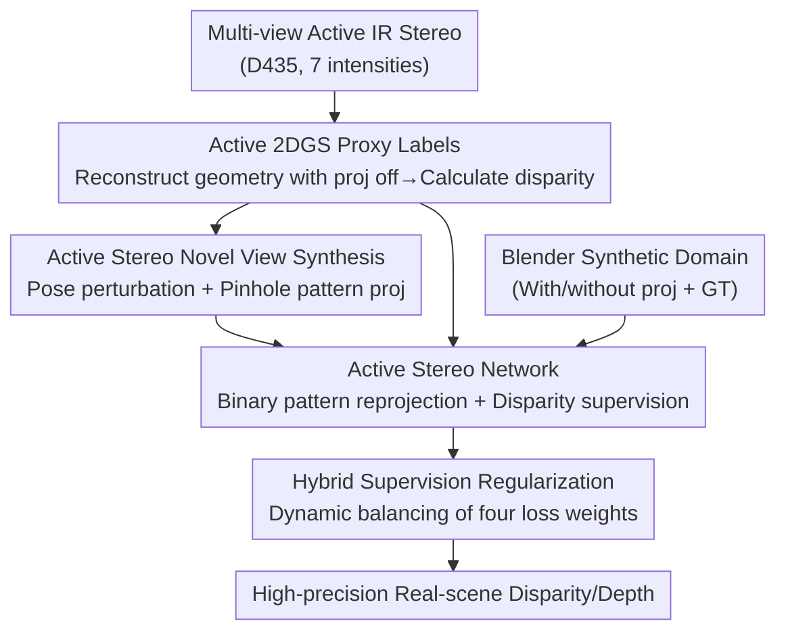

# GS-ASM: 2DGS-Supervised Active Stereo Matching

**Conference**: CVPR 2026  
**Paper**: [CVF Open Access](https://openaccess.thecvf.com/content/CVPR2026/html/Wu_GS-ASM_2DGS-Supervised_Active_Stereo_Matching_CVPR_2026_paper.html)  
**Code**: To be released (Code and dataset will be open-sourced)  
**Area**: 3D Vision  
**Keywords**: Active Stereo Matching, Depth Estimation, 2D Gaussian Splatting, Proxy Labels, Hybrid Supervision  

## TL;DR
Addressing the accuracy limitations in active stereo matching caused by the lack of ground truth (GT) and reliance on self-supervision, this paper utilizes 2D Gaussian Splatting (2DGS) to reconstruct geometry from real scenes and render high-quality disparity "proxy labels." This transforms unsupervised active stereo networks into "supervised" training, complemented by a hybrid supervision regularization strategy that dynamically balances proxy supervision and self-supervision. The method achieves SOTA performance across multiple backbones, surpassing commercial RealSense D435 depth cameras.

## Background & Motivation
**Background**: Active stereo cameras (e.g., Intel RealSense D435) use infrared (IR) emitters to project pseudo-random dot patterns onto a scene. Two IR cameras capture these patterns for stereo matching, enabling dense depth estimation in regions where classical matching fails, such as low-texture, repetitive-texture, or non-Lambertian surfaces. These systems combine the robustness of active sensing with the low cost and high resolution of cameras, making them widely used in industry and academia.

**Limitations of Prior Work**: Commercial cameras still rely on classical (hand-crafted) stereo matching algorithms, which often suffer from over-smoothing, loss of depth at object edges, and high measurement noise. Learning-based methods could be more accurate and complete, but deep stereo networks require massive ground-truth disparity for supervision. However, the field of active stereo matching **lacks large-scale real-world datasets with accurate depth labels**, as collecting dense, accurate depth in real scenes is extremely expensive and time-consuming.

**Key Challenge**: The lack of GT leads to two suboptimal alternatives. First is **pure self-supervision** (using left-right view reprojection error), where losses are unstable, and predictions are often blurry with poor detail and low precision. Second is **synthetic data supervision** (using Blender to create active IR scenes with GT), which provides clarity but suffers from a significant domain gap between synthetic and real data. ActiveZero attempted to mix both to bridge the gap, performing well on synthetic sets but **dropping significantly in performance on real-world scenes**, sometimes even falling behind the native D435 output.

**Goal**: To enable "supervised training" accuracy for active stereo networks **without requiring any ground-truth depth**, by generating reliable supervision signals directly from real scenes.

**Key Insight**: The authors observe that explicit surface reconstruction methods like 2DGS can reconstruct real-world geometry from multi-view images. Furthermore, active IR imaging can be decomposed into "ambient light + projected pattern." By reconstructing geometry in **"projection off" mode** and back-calculating disparity from the results, one can obtain "proxy depth labels" accurate to within 1 pixel of the D435's alignment.

**Core Idea**: Reconstruct real scenes using 2DGS $\rightarrow$ Render disparity **proxy labels** as pseudo-GT to upgrade active stereo matching from "self-supervised" to "proxy-supervised," and leverage 2DGS's novel view synthesis for data augmentation. A dynamic weight strategy is designed to mitigate training oscillations caused by noise in proxy labels.

## Method

### Overall Architecture
The input to GS-ASM consists of multi-view active IR stereo images collected with a handheld RealSense D435 in real indoor scenes (each view captured at 7 different IR emission intensities). The output is a trained active stereo network capable of high-precision disparity/depth estimation. The key to the pipeline lies not in the network itself (which follows existing backbones like PSMNet, RAFT, or StereoNet) but in **how to generate supervision signals from nothing**: first, an active 2DGS model is trained using "projection off" IR images to reconstruct geometry and render disparity proxy labels. Second, 2DGS's novel view synthesis is used with constrained pose perturbations and pinhole projection of patterns to synthesize augmented stereo pairs with proxy labels. Finally, the real domain (proxy + self-supervision) and the Blender synthetic domain (GT + self-supervision) are fed into the network, using an adaptive hybrid supervision regularization to dynamically adjust loss weights for stable optimization.

### Key Designs

**1. Active 2DGS Proxy Label Generation: Reconstructing geometry in "projection off" mode to calculate sub-pixel disparity pseudo-GT**

This is the foundation of the paper, addressing the lack of real-world GT. The challenge is that projection patterns on active IR images **violate volume rendering assumptions** (they are not inherent scene appearances). Training GS directly on patterned images would mistake patterns for geometry. The authors explicitly model IR imaging as the sum of ambient light, projected pattern, and noise: $x_l(u,v) = I_l(u,v) + \alpha\cdot e\cdot K_l(u,v) + \epsilon,\; e\ge 0$, where $I_l$ is ambient intensity, $K_l$ is the binary pattern, $\alpha$ is the reflection coefficient, $e$ is emission intensity, and $\epsilon$ is sensor noise. The key step is to use only IR images with **zero emission power ($e=0$)** to train 2DGS, ensuring the rendering captures pure geometry.

2DGS is chosen over 3DGS because 3DGS's volumetric representation lacks multi-view geometric consistency and surface quality. 2DGS flattens Gaussians into 2D disks and computes ray-disk intersections in local tangent space, avoiding splat degradation at grazing angles. After training, depth per pixel is the weighted sum using alpha-blending weights $\omega_i$, followed by TSDF fusion for mesh extraction, and finally converting depth to disparity:

$$z(x) = \frac{\sum_i \omega_i z_i}{\sum_i \omega_i}, \qquad d(x) = \frac{b\cdot f}{z(x)}$$

where focal length $f$ is estimated by COLMAP and $b$ is the baseline. The resulting disparity is aligned with the D435 and accurate within 1 pixel.

**2. Active Stereo Novel View Synthesis: Rendering novel views via 2DGS + pinhole dot projection for augmented samples**

Original view proxy labels are insufficient due to limited real-world captures. This step uses 2DGS's synthesis capabilities for data augmentation. To solve the loss of quality and absence of patterns in novel views, the authors use a two-layer approach: For geometry, they apply **constrained perturbations** to COLMAP-estimated poses, maintaining fidelity while increasing diversity. For patterns, they use a pinhole camera model to re-project the dot template onto the novel view. Pixels $x=(u,v)$ are back-projected to 3D: $P_{cam} = z(x)\cdot K^{-1}\cdot[u,v,1]^\top$, and the pattern template is scaled by $z(x)$ and blended, aligning active lighting with synthesized geometry.

**3. Binary Pattern-based Reprojection Self-Supervision: Extracting patterns for reprojection to eliminate texture and ambient light**

Since proxy labels contain noise, self-supervision is used as a complementary signal. To avoid contamination from object textures, patterns are extracted from a sequence of IR images $x^{(0)},\dots,x^{(n)}$. Difference maps are normalized and thresholded to extract pure binary patterns: $K(u,v)=1$ if $\|\hat{x}^{(n)}(u,v)-\hat{x}^{(0)}(u,v)\| > \delta(u,v)+c$, else 0, where $\delta(u,v)$ is a local window mean. The self-supervised loss $L_{self}$ is then computed on the binary patterns $K_l, K_r$, making it robust in low-texture areas. The proxy supervision uses smooth L1: $L_{disp}=L1_{smooth}(F(y_l,y_r), y_d)$.

**4. Hybrid Supervision Regularization: Adaptive weight adjustment based on convergence trends to suppress noise oscillations**

The noisy real-domain proxy labels can cause training instability. Instead of fixed weights, the authors allow the four loss weights (real/synthetic, proxy/self-supervised) to evolve dynamically:

$$L(x_l,x_r,y_d) = \mu(t)\cdot[L_{real\text{-}disp}+L_{sim\text{-}disp}] + \lambda(t)\cdot[L_{real\text{-}self}+L_{sim\text{-}self}]$$

Weights are adjusted based on the **inverse of loss trends**: if a loss category increases, its weight is increased; if it converges, its weight is decreased. The update rule is $\hat{\mu}(t+1)=\hat{\mu}(t)\cdot\big(1+\alpha\cdot(\frac{L_{disp\text{-}total}(t)}{L_{disp\text{-}total}(t-1)}-1)\big)$ with $\alpha=0.1$. This mechanism balances multi-source supervision for stable optimization.

## Key Experimental Results

### Main Results
Disparity estimation comparison on the synthetic test set (Blender) across three backbones (EPE lower is better, percentage higher is better):

| Backbone | Method | EPE(px)↓ | 1px↑ | 3px↑ | 5px↑ |
|----------|------|----------|------|------|------|
| PSMNet | D435 | 0.5488 | 0.9032 | 0.9811 | 0.9911 |
| PSMNet | Baseline(ActiveZero) | 0.4300 | 0.9446 | 0.9829 | 0.9910 |
| PSMNet | **Ours** | **0.2613** | **0.9597** | **0.9897** | **0.9955** |
| RAFT | D435 | 0.5428 | 0.9513 | 0.9820 | 0.9889 |
| RAFT | Baseline | 0.4715 | 0.9306 | 0.9719 | 0.9856 |
| RAFT | **Ours** | **0.1279** | **0.9744** | **0.9925** | **0.9955** |
| StereoNet | D435 | 0.7190 | 0.8340 | 0.9752 | 0.9890 |
| StereoNet | Baseline | 0.5551 | 0.9206 | 0.9691 | 0.9826 |
| StereoNet | **Ours** | **0.4124** | **0.9223** | **0.9839** | **0.9936** |

The method outperforms the baseline and D435 across all architectures. On RAFT, the EPE drops from 0.4715 to 0.1279 (approx. 73% reduction).

### Ablation Study
Ablation on RAFT backbone (Components: Proxy Labels / Novel View / Regularization):

| Config | Proxy Label | Novel View | Regularization | EPE(px)↓ | 1px↑ | 3px↑ | 5px↑ |
|------|:---:|:---:|:---:|----------|------|------|------|
| Baseline | – | – | – | 0.4715 | 0.9306 | 0.9719 | 0.9856 |
| +Proxy | ✓ | – | – | 0.3482 | 0.9526 | 0.9880 | 0.9942 |
| ++View | ✓ | ✓ | – | 0.2736 | 0.9647 | 0.9885 | 0.9945 |
| Full Model | ✓ | ✓ | ✓ | **0.1279** | **0.9744** | **0.9925** | **0.9955** |

Each component provides consistent gains. Proxy labels alone reduce EPE by ~26%. Regularization provides a massive final boost (from 0.2736 to 0.1279).

### Key Findings
- **Proxy labels are the foundation**: Adding proxy supervision produced the largest single-step improvement (EPE -0.123).
- **Regularization is vital for final precision**: Adaptive weights halved the error in the final stages by balancing multi-source signals.
- **Intensity 0 is the sweet spot**: Reconstruction must occur without patterns, while patterns must be extracted separately—this decoupling is essential.

## Highlights & Insights
- **Active imaging additivity is the breakthrough**: Decomposing IR into components and reconstructing geometry solely from the $e=0$ component bypasses the violation of volume rendering assumptions.
- **Generative reconstruction as a "GT Factory"**: Instead of using 2DGS for the rendering itself, the authors use its geometry to supervise a discriminative stereo network.
- **Dual use of 2DGS consistency**: It provides both the proxy labels and the geometric basis for novel view augmentation.
- **Trend-driven loss weighting**: The reverse adjustment based on loss ratios is a lightweight, generalizable trick for multi-task balancing.

## Limitations & Future Work
- **Reliance on active illumination**: Performance degrades under strong outdoor lighting where IR patterns are washed out.
- **Proxy label noise ceiling**: Accuracy is capped by 2DGS reconstruction quality. Systematic errors in proxy labels cannot be entirely eliminated by regularization.
- **Preprocessing cost**: Capturing 7 intensities and running COLMAP + 2DGS is computationally intensive and time-consuming.
- **Future work**: Suggests integrating LiDAR/ToF for multi-modal fusion to improve robustness in complex lighting.

## Related Work & Insights
- **vs ActiveZero**: ActiveZero relies on "real-world self-supervision + synthetic supervision." GS-ASM adds **real-world proxy supervision**, significantly improving real-scene generalization.
- **vs Pure Self-supervised Stereo**: Self-supervision is unstable in low-texture areas. GS-ASM uses binary IR patterns to isolate projected features and adds proxy labels for stability.
- **vs 3DGS**: 3DGS struggles with geometric consistency for surface extraction; 2DGS's disk-based representation is better suited for back-calculating reliable disparity.

## Rating
- Novelty: ⭐⭐⭐⭐⭐ 
- Experimental Thoroughness: ⭐⭐⭐⭐ 
- Writing Quality: ⭐⭐⭐⭐ 
- Value: ⭐⭐⭐⭐⭐ 

<!-- RELATED:START -->

## Related Papers

- [\[CVPR 2026\] EventHub: Data Factory for Generalizable Event-Based Stereo Networks without Active Sensors](eventhub_data_factory_for_generalizable_event-based_stereo_networks_without_acti.md)
- [\[CVPR 2026\] MAGICIAN: Efficient Long-Term Planning with Imagined Gaussians for Active Mapping](magician_efficient_long-term_planning_with_imagined_gaussians_for_active_mapping.md)
- [\[CVPR 2026\] Faster-GS: Analyzing and Improving Gaussian Splatting Optimization](faster-gs_analyzing_and_improving_gaussian_splatting_optimization.md)
- [\[CVPR 2026\] 240FPS Stereo Vision from Monocular Mixed Spikes](240fps_stereo_vision_from_monocular_mixed_spikes.md)
- [\[CVPR 2026\] Lite Any Stereo: Efficient Zero-Shot Stereo Matching](lite_any_stereo_efficient_zero-shot_stereo_matching.md)

<!-- RELATED:END -->
