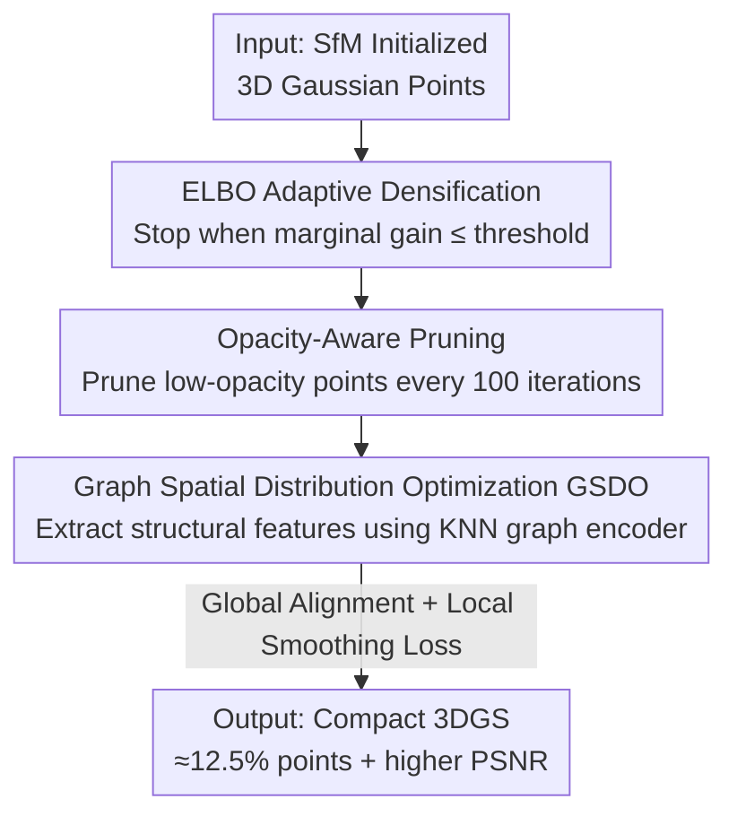

# GS²: Graph-based Spatial Distribution Optimization for Compact 3D Gaussian Splatting

**Conference**: CVPR 2026  
**Paper**: [CVF Open Access](https://openaccess.thecvf.com/content/CVPR2026/html/Yang_GS2_Graph-based_Spatial_Distribution_Optimization_for_Compact_3D_Gaussian_Splatting_CVPR_2026_paper.html)  
**Code**: https://github.com/BJTU-KD3D/GS-2  
**Area**: 3D Vision  
**Keywords**: 3D Gaussian Splatting, Model Compression, Point Cloud Pruning, Graph Neural Networks, Spatial Consistency  

## TL;DR
GS² addresses the problem of spatial distribution disruption and rendering artifacts caused by pruning in 3DGS. By employing a three-step pipeline consisting of ELBO adaptive densification termination, opacity-aware pruning, and graph-encoder-guided spatial redistribution, it reduces the number of Gaussian points to approximately 12.5% of the original 3DGS while achieving higher PSNR.

## Background & Motivation

**Background**: 3D Gaussian Splatting (3DGS) has become the mainstream solution for novel view synthesis due to its real-time rendering and high-definition quality. It expands sparse SfM point clouds into dense Gaussian point sets via densification (splitting/cloning) to represent fine details.

**Limitations of Prior Work**: The densification process is highly prone to over-parameterization. For instance, a 360° unbounded scene in Mip-NeRF 360 often requires over 3 million Gaussian points, resulting in huge GPU memory overhead and slower rendering. To compress the model, many works adopt pruning strategies (such as manual importance scoring or learnable masks) to drastically reduce the number of Gaussian points.

**Key Challenge**: Existing pruning methods only focus on "which points to prune" while ignoring the **spatial rearrangement of the remaining points after pruning**. After a large number of points are pruned, the remaining points spontaneously migrate to empty regions to compensate for the loss. However, this implicit rearrangement lacks global/local continuity constraints. The migration directions can be inaccurate, and points that should remain stationary may also drift arbitrarily. This disrupts spatial consistency and continuity, leading to significant blur and artifacts (e.g., LightGaussian). The authors observe that pure pruning drops PSNR by up to 0.94 on Mip-NeRF 360, and simply training for more iterations can hardly recover this loss.

**Goal**: To drastically compress the number of Gaussian points while explicitly recovering the disrupted spatial distribution after pruning, allowing the compact representation to maintain high rendering quality.

**Key Insight**: View the pruned Gaussian points as a graph (KNN graph), capture the spatial and feature relationships between points using the graph structure, and use these features to guide point displacements. This restores spatial continuity without modifying the original 3DGS pipeline (without introducing new representations like anchors).

**Core Idea**: First, perform adaptive densification control and opacity-aware pruning to obtain a compact point set. Then, leverage a graph encoder, global alignment loss, and local smoothing loss to guide the redistribution of the remaining points, ensuring that points with similar features are close to each other in Euclidean space.

## Method

### Overall Architecture
GS² is a three-stage sequential compaction framework that works entirely within the original 3DGS representation without altering it, focusing solely on "point count control" and "point position optimization." It consists of two main modules: **ADP (Adaptive Densification and Pruning)** for point reduction, and **GSDO (Graph-based Spatial Distribution Optimization)** for restoring the disrupted spatial distribution after pruning.

Specifically, Phase 1 adaptively decides when to stop densification using ELBO signals to prevent excessive point growth in simple scenes. Phase 2 dynamically prunes low-opacity points every 100 iterations according to an opacity threshold, accelerated by an opacity regularization loss. Phase 3 constructs a KNN graph for the remaining Gaussian points, extracts structural features using a lightweight graph encoder, and guides point redistribution using a global alignment loss $\mathcal{L}_{cet}$ and a local smoothing loss $\mathcal{L}_{smt}$, while jointly updating other attributes like color and scale.

### Key Designs

**1. ELBO Adaptive Densification: Using marginal benefit signals to decide when to stop densification**

The original densification in 3DGS relies on manually defined iteration thresholds (e.g., performing densification continuously up to 15,000 steps), which lacks adaptivity and generates redundant points in simple scenes like large, flat indoor walls. Inspired by Evidence Lower Bound (ELBO) in variational inference, GS² balances "rendering quality" and "model complexity" in a single objective: defining $\mathcal{L}^{(t)}_{E} = -\mathcal{L}^{(t)}_{r} - \mathcal{L}^{(t)}_{KL}$, where $\mathcal{L}^{(t)}_{r}$ is the 3DGS rendering loss (L1 + D-SSIM), and $\mathcal{L}^{(t)}_{KL} = \frac{1}{2}\left[\mathrm{tr}(\tilde{\Sigma}) - \log|\tilde{\Sigma}|\right] + \lambda_\xi \log(1+\xi)$ characterizes model complexity using normalized covariance $\tilde{\Sigma}$ and normalized point density $\xi$.

To suppress short-term fluctuations of ELBO, the authors smooth it using Exponential Moving Average (EMA): $\hat{\mathcal{L}}^{(t)}_{E} = \varepsilon\,\hat{\mathcal{L}}^{(t-1)}_{E} + (1-\varepsilon)\mathcal{L}^{(t)}_{E}$, and monitor the relative change within a window of $w$ steps: $\Delta_t = |(\hat{\mathcal{L}}^{(t)}_{E} - \hat{\mathcal{L}}^{(t-w)}_{E}) / \hat{\mathcal{L}}^{(t)}_{E}|$. When $\Delta_t$ converges to a threshold $\tau$, it indicates that the quality improvement brought by adding more points is far outweighed by the increase in complexity, thus automatically terminating densification. This step shuts the gate before the number of points explodes—individually, it reduces the point count of Mip-NeRF 360 from 3.12M to 2.82M with almost unchanged PSNR (27.71 to 27.73) in ablation studies.

**2. Opacity-Aware Progressive Pruning: Using linear and high-order regularization to simultaneously eliminate low-opacity points and suppress abnormally high-opacity points**

Even after stopping densification, many low-opacity points remain. They contribute minimally to rendering but consume substantial GPU memory (the authors observe that points with opacity $\le 0.1$ account for about 40% of the Lighthouse scene in Tanks & Temples). GS² introduces an opacity-aware regularization loss $\mathcal{L}_\alpha = \sum_{i=1}^{N}(\lambda_2 \rho_i^2 + \lambda_3 \rho_i)$, where $\rho_i$ represents the opacity of the $i$-th Gaussian point. The linear term $\lambda_3 \rho_i$ encourages low-opacity points to converge to zero faster, making them easier to prune.

Crucially, the authors discover that some blur artifacts are caused not by low-opacity points, but by **abnormally high-opacity points**, which cannot be mitigated by the linear term or by raising the pruning threshold alone. To address this, they introduce the quadratic term $\lambda_2 \rho_i^2$ to penalize such anomalies more heavily. Combined with dynamic pruning based on thresholds every 100 iterations, GS² removes more redundant points than LightGaussian while suppressing artifacts caused by high-opacity points.

**3. Graph Spatial Distribution Optimization (GSDO): Structuring pruned points as a graph, guiding redistribution via features, and applying global/local consistency constraints**

This is the core for restoring spatial consistency. After pruning, the points become sparsely and unevenly distributed, and the original 3DGS struggles with optimizing where the remaining points should migrate and which should stay. GS² borrows the graph concept from 4DGS but removes its temporal dependency to create a lightweight static version: it first maps each Gaussian center $x_i \in \mathbb{R}^3$ to an initial embedding $f_i = \sigma(W_1 x_i + b_1)$ using a single-layer perceptron. A KNN graph $\mathcal{N}_k(i)$ is constructed based on these embeddings to calculate neighborhood residuals $\Delta_{ij} = f_i - f_j$ and aggregate them as $r_i = \sum_{j \in \mathcal{N}_k(i)} \Delta_{ij}$. A second transformation produces residual-enhanced local features $h_i = \mathrm{ReLU}(W_2(f_i + r_i) + b_2)$. Meanwhile, max pooling is applied to the neighborhood to obtain $m_i = \max_{j \in \mathcal{N}_k(i)} f_j$, and the scene-level global feature is computed as $\bar{m} = \frac{1}{N_{GS}}\sum m_i$. Concatenating $h_i$ and $\bar{m}$ followed by two fully connected layers yields the latent feature $z_i$—allowing each point update to consider both local neighborhoods and global scene structures.

Based on this, two unsupervised losses are designed. The **global alignment loss** projects the features back to $\mathbb{R}^3$ via a lightweight projection $\hat{x}_i = g(z_i)$ and constrains $\mathcal{L}_{cet} = \frac{1}{N_{GS}}\sum_i \|x_i - \hat{x}_i\|_2^2$, aligning centroids in the feature space and the Euclidean space. The **local smoothing loss** $\mathcal{L}_{smt} = \frac{1}{M(K-1)}\sum_m \sum_i \|z^{(m)}_i - z^{(m)}_{i+1}\|_2 \cdot \|x^{(m)}_i - x^{(m)}_{i+1}\|_2$ penalizes inconsistencies between adjacent points in Euclidean and feature spaces, encouraging points with similar features to be close in space. The final loss $\mathcal{L}_{final} = \lambda_c \mathcal{L}_{cet} + \lambda_s \mathcal{L}_{smt} + \mathcal{L}_r$ jointly optimizes point positions along with attributes like color and scale. Unlike Gaussian Grouping, which only clusters in the feature space and ignores global Euclidean distribution, GSDO manages both global alignment and local smoothing, ensuring better overall spatial consistency.

### Loss & Training
- The rendering loss follows original 3DGS: $\mathcal{L}_r = (1-\lambda_1)\mathcal{L}_1 + \lambda_1 \mathcal{L}_{D\text{-}SSIM}$.
- The ADP stage additionally utilizes the opacity regularization loss $\mathcal{L}_\alpha$; the GSDO stage additionally utilizes $\mathcal{L}_{cet}$ and $\mathcal{L}_{smt}$.
- The pruning interval is fixed at every 100 iterations (experiments show robustness to intervals of 100/200/400, eliminating the need for scene-specific parameter tuning).

## Key Experimental Results

Datasets: Mip-NeRF 360 (9 scenes) + Tanks & Temples (21 scenes), totaling 30 real-world scenes (12 indoor, 18 outdoor). Metrics: PSNR↑, SSIM↑, LPIPS↓, and the number of Gaussian points NGS↓ (in millions). For a fair comparison, only point reduction is compared, excluding extra components like SfM initialization, attribute quantization, or spherical harmonics distillation.

### Main Results

| Dataset | Method | PSNR↑ | SSIM↑ | LPIPS↓ | NGS↓(M) |
|--------|------|-------|-------|--------|---------|
| Mip-NeRF360 | 3DGS | 27.71 | 0.83 | 0.20 | 3.12 |
| Mip-NeRF360 | LightGaussian | 27.35 | 0.82 | 0.23 | 1.07 |
| Mip-NeRF360 | MaskGaussian | 27.61 | 0.82 | 0.23 | 1.50 |
| Mip-NeRF360 | **GS²(Ours)** | **27.74** | 0.82 | 0.23 | **0.30** |
| T&T | 3DGS | 24.19 | 0.84 | 0.19 | 1.57 |
| T&T | LightGaussian | 23.16 | 0.82 | 0.25 | 0.53 |
| T&T | MaskGaussian | 24.16 | 0.84 | 0.20 | 0.74 |
| T&T | **GS²(Ours)** | **24.90** | **0.85** | 0.21 | **0.24** |

GS² exceeds the original 3DGS in PSNR on both datasets while using only 9.62% (Mip-NeRF360) and 15.29% (T&T) of the Gaussian points—averaging around 12.5%. The gain is particularly evident on T&T (24.19 to 24.90), which the authors attribute to its higher proportion of indoor scenes, where the geometric constraints of bounded environments benefit spatial distribution optimization.

### Ablation Study

| Configuration | PSNR↑ | LPIPS↓ | NGS↓(M) | Note |
|------|-------|--------|---------|------|
| 3DGS | 27.71 | 0.20 | 3.12 | Baseline |
| + ELBO Densification | 27.73 | 0.20 | 2.82 | Adaptively stops densification; point count drops with quality intact |
| + Opacity Pruning | 26.79 | 0.26 | 0.30 | Point count drops sharply to 0.30M, but PSNR falls to 26.79 |
| + Increased Iterations | 26.98 | 0.26 | 0.30 | Simply training longer only recovers 0.19, cannot rescue the performance |
| + $\mathcal{L}_{smt}$ | 27.53 | 0.25 | 0.30 | Local smoothing loss restores rendering quality |
| Full Model | **27.74** | 0.23 | 0.30 | Full loss, exceeding the original 3DGS |

### GSDO Plug-and-Play (Tab. 3)

| Dataset | Method | PSNR↑ | LPIPS↓ |
|--------|------|-------|--------|
| Mip-NeRF360 | LightGaussian | 27.35 | 0.23 |
| Mip-NeRF360 | LightGaussian + GSDO | **27.75** | 0.21 |
| T&T | LightGaussian | 23.16 | 0.25 |
| T&T | LightGaussian + GSDO | **23.97** | 0.22 |

As a post-processing plug-in applied to LightGaussian/MaskGaussian, GSDO consistently improves rendering quality with the same number of points, proving its general applicability.

### Key Findings
- **Pruning is a double-edged sword; redistribution is key to quality recovery**: In the ablation study, adding pruning dropped PSNR from 27.73 to 26.79. Simply increasing iterations only recovered it to 26.98, whereas incorporating spatial consistency loss restored it to 27.74. This indicates that point loss cannot be resolved merely by more training; spatial distribution must be explicitly optimized.
- **Both high and low opacities must be managed**: Blur artifacts originate from both low-opacity redundant points and abnormally high-opacity points; the quadratic regularization term serves as the remedy for the latter.
- **Efficiency is acceptable**: GSDO increases the training time from 10 minutes (ADP only) to 16 minutes, achieving a rendering speed of 513 fps—second only to Mini-Splatting (576 fps) and superior to other baselines.
- **Robustness to hyperparameters**: Pruning intervals of 100/200/400 yield PSNRs of only 27.74 to 27.60, requiring no scene-specific tuning and remaining fixed at 100.

## Highlights & Insights
- **Decoupling "point removal" and "position compensation"**: Previous pruning methods treated spatial rearrangement as an implicit byproduct of optimization. GS² is the first to explicitly point out that "implicit rearrangement after pruning is unreliable" and takes charge of it using graph structures + consistency losses. The formulation of this problem itself is highly valuable.
- **Clever use of ELBO as a "stopwatch" for densification**: By integrating rendering quality and model complexity into ELBO, the convergence of the marginal gain automatically terminates densification. This eliminates manual iteration thresholds, offering a transferable strategy to other representation learning tasks requiring adaptive parameter growth control.
- **GSDO as a plug-and-play post-processing tool**: It does not alter the original pipeline or introduce anchors, allowing it to be directly appended to existing pruning methods to boost performance, which is highly deployment-friendly.
- **Dual constraints of global alignment and local smoothing**: Unlike Gaussian Grouping which only clusters in feature space, GS² emphasizes global centroid alignment in Euclidean space, providing better guarantees for overall continuity.

## Limitations & Future Work
- The authors acknowledge that GSDO's spatial distribution optimization introduces extra training overhead (increasing from 10 to 16 minutes). Reducing this computational cost is left for future work.
- The method has only been validated on static scenes, and its applicability to dynamic/time-varying scenes (where 4DGS inherently excels) remains unknown. Additionally, details such as the definition of normalized covariance/point density in the complexity term of ELBO and the specific weight $\lambda_\xi$ of $\mathcal{L}_{KL}$ rely heavily on empirical configurations. ⚠️ Please refer to the original paper for the exact notation of some formulas (e.g., the exact formulation of $\mathcal{L}_{KL}$).
- *Directions for improvement*: One could explore sharing or caching GSDO's graph encoder to amortize redistribution costs, or jointly optimizing the ELBO termination criteria and pruning budget into a single differentiable objective.

## Related Work & Insights
- **vs LightGaussian / EAGLES (manual importance-based pruning)**: These methods prune points based on importance scores but ignore the rearrangement of remaining points, leading to spatial discontinuity and rendering artifacts. Under identical or even lower point budgets, GS² repairs the distribution using GSDO, yielding higher PSNR (27.35 to 27.74 on Mip-NeRF 360).
- **vs Mini-Splatting**: Mini-Splatting improves spatial distribution and compresses point counts via densification but lacks global/local continuity constraints, leading to limited spatial consistency. GS² addresses this shortcoming with its graph structure and dual consistency losses.
- **vs Compact3DGS / MaskGaussian (learnable mask-based pruning)**: While they lie on the pruning track, they also lack explicit spatial rearrangement. GSDO of GS² can be appended to them as a post-processing plug-in to consistently improve performance.
- **vs 4DGS / Gaussian Grouping**: GS² borrows the graph encoding concept from 4DGS (removing spatio-temporal dependencies for lightweight execution) and the spatial constraint concept from Gaussian Grouping (adding global Euclidean alignment), serving as an targeted integration of both under "static compression" scenarios.

## Rating
- Novelty: ⭐⭐⭐⭐ Target "spatial redistribution after pruning" as an explicit optimization goal for the first time; the combination of ELBO densification termination and graph-guided redistribution is novel.
- Experimental Thoroughness: ⭐⭐⭐⭐ Solid evaluation across 30 scenes on two major datasets, with comprehensive component-wise ablations, plug-and-play evaluations, and efficiency analyses, though dynamic scenes are omitted.
- Writing Quality: ⭐⭐⭐⭐ Clear pipeline and rich diagrams, although some ELBO notations are overly simplified.
- Value: ⭐⭐⭐⭐ Yielding superior performance to original 3DGS with only ~12.5% points; GSDO is plug-and-play, holding high academic and industrial value.

<!-- RELATED:START -->

## Related Papers

- [\[CVPR 2026\] Faster-GS: Analyzing and Improving Gaussian Splatting Optimization](faster-gs_analyzing_and_improving_gaussian_splatting_optimization.md)
- [\[CVPR 2026\] Urban-GS: A Unified 3D Gaussian Splatting Framework for Compact and High-Fidelity Aerial-to-Street Reconstruction](urban-gs_a_unified_3d_gaussian_splatting_framework_for_compact_and_high-fidelity.md)
- [\[CVPR 2026\] DirectFisheye-GS: Enabling Native Fisheye Input in Gaussian Splatting with Cross-View Joint Optimization](directfisheye-gs_enabling_native_fisheye_input_in_gaussian_splatting_with_cross-.md)
- [\[CVPR 2026\] 3D Gaussian Splatting at Arbitrary Resolutions with Compact Proxy Anchors](3d_gaussian_splatting_at_arbitrary_resolutions_with_compact_proxy_anchors.md)
- [\[CVPR 2026\] Prune Wisely, Reconstruct Sharply: Compact 3D Gaussian Splatting via Adaptive Pruning and Difference-of-Gaussian Primitives](prune_wisely_reconstruct_sharply_compact_3d_gaussian_splatting_via_adaptive_prun.md)

<!-- RELATED:END -->
