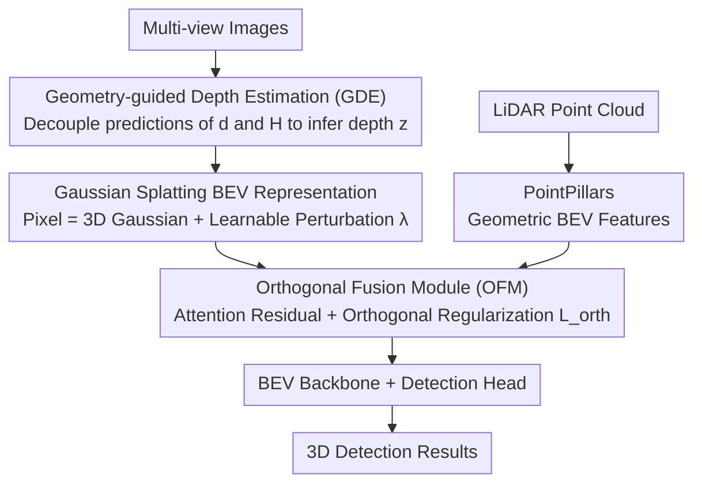

# GSV2X: Geometry-Aware Uncertainty Modeling and Orthogonal Fusion for Robust Roadside Perception

**Conference**: CVPR 2026  
**Paper**: [CVF Open Access](https://openaccess.thecvf.com/content/CVPR2026/html/Xu_GSV2X_Geometry-Aware_Uncertainty_Modeling_and_Orthogonal_Fusion_for_Robust_Roadside_CVPR_2026_paper.html)  
**Code**: Not disclosed  
**Area**: 3D Vision / Autonomous Driving / Multi-modal Fusion  
**Keywords**: Roadside Perception, Camera-LiDAR Fusion, 3D Gaussian, Uncertainty Modeling, Orthogonal Fusion  

## TL;DR
To address two persistent issues in roadside multi-view camera-LiDAR fusion—"feature misalignment caused by calibration errors" and "dominant camera features suppressing LiDAR"—GSV2X replaces deterministic projections with 3D Gaussian distributions to "softly" lift pixel features to BEV and employs orthogonal constraints to force the two modalities to learn complementary features. On RCooper, it improves AP@0.5 from 43.7% (BEVFusion) to 63.4% and shows almost no performance drop under calibration perturbation.

## Background & Motivation
**Background**: Roadside Perception Systems (RPS) are deployed at fixed locations like intersections and ramps. They provide a global field of view and mitigate occlusion blind spots for vehicle-side sensors, becoming a vital part of intelligent transportation infrastructure. The mainstream paradigm is multi-view multi-modal fusion—aligning rich camera semantics and precise LiDAR geometry into a unified Bird's-Eye-View (BEV) space. A representative approach is the LSS (Lift-Splat-Shoot) family, which lifts 2D features to 3D based on predicted pixel-wise depth distributions before splatting them onto the BEV plane.

**Limitations of Prior Work**: The authors point out two intertwined vulnerabilities. First is the **extreme sensitivity to spatial uncertainty**: Methods like LSS rely on a deterministic "point-to-point" projection that maps each pixel to a fixed point in 3D, thus depending heavily on perfect calibration. In reality, calibration errors are almost inevitable; even minor extrinsic errors cause BEV feature misalignment, leading to ghost objects, trajectory jitter, and missed detections, which directly threaten driving safety. Second is **modal imbalance**: Naively concatenating or adding camera and LiDAR features allows dense camera features to "overpower" sparse but geometrically accurate LiDAR features. This causes the network to overfit to a single modality, leading to generalization failure under changing weather or lighting conditions.

**Key Challenge**: The root of these problems lies in the "deterministic" assumption—assuming the projection geometry is certain (ignoring depth ambiguity and calibration noise) and allowing fusion to be unconstrained, letting the dominant modality take over. The comparison in Figure 1 of the paper is illustrative: when switching from a corridor scenario to an intersection scenario, BEVFusion's AP@0.3 drops by 14.5%, while GSV2X only drops by 2.9%. In the intersection scenario with calibration perturbation, BEVFusion drops by 9.5%, whereas GSV2X only drops by 0.6%.

**Core Idea**: Replace "determinism" with "probabilistic" modeling—representing each pixel feature as a **3D Gaussian distribution** (instead of a single point) to absorb depth and calibration uncertainties; then use **orthogonal constraints** to push camera and LiDAR features toward uncorrelated directions in the feature space, forcing both to contribute complementary rather than redundant information.

## Method

### Overall Architecture
GSV2X is a dual-stream (camera stream + LiDAR stream) late fusion framework. **Camera Stream**: Multi-view images pass through ResNet-50 + FPN for feature extraction. Geometry-guided Depth Estimation (GDE) first estimates reliable pixel-wise depth, followed by a view transformer based on 3D Gaussian Splatting to "softly" lift 2D features into probabilistic BEV features $F^{BEV}_{img}$. **LiDAR Stream**: Point clouds are encoded into geometrically robust BEV features $F^{BEV}_{LiDAR}$ via PointPillars. The two paths meet in the **Orthogonal Fusion Module (OFM)**, where LiDAR serves as the geometric backbone and the camera as a residual enhancement branch, with orthogonal regularization loss applied to force complementarity. The fused BEV features enter a BEV backbone and detection head to output 3D boxes. During training, all views are jointly optimized; during inference, views are processed independently before final post-processing fusion.

### Key Designs

**1. Gaussian Splatting BEV Representation: Replacing "Hard Projection" with "Soft Lifting" to Absorb Spatial Uncertainty**

The critical weakness of LSS is the deterministic pixel-wise projection—once depth or calibration is incorrect, features misalign on the BEV map. Inspired by GaussianLSS, GSV2X represents the feature $f_m$ of each pixel $m$ as a Gaussian distribution $G(\mathbf{x}) \sim \mathcal{N}(\mu, \Sigma)$ in 3D rather than a fixed point, naturally accommodating small geometric offsets. The key lies in **decoupling uncertainty into two sources**: The first is the ambiguity of depth prediction. From the predicted depth distribution $p(d_i|m)$ ($D$ depth bins), the initial mean and depth-induced covariance are calculated:

$$\mu_{m,3D} = \sum_{i=1}^{D} p(d_i|m)\cdot x_i, \quad \Sigma_{m,depth} = \sum_{i=1}^{D} p(d_i|m)\cdot (x_i - \mu_{m,3D})(x_i - \mu_{m,3D})^\top$$

where $x_i$ are the 3D coordinates corresponding to the $i$-th depth bin. Since $\Sigma_{m,depth}$ only characterizes uncertainty along the camera ray and cannot account for calibration errors, the second source uses a **learnable, view-dependent perturbation scalar $\lambda \ge 0$** predicted by a lightweight MLP from camera extrinsics to adaptively scale the covariance: $\Sigma_{m,3D} = \lambda \cdot \Sigma_{m,depth}$. Final BEV features are obtained by accumulating all pixel contributions via differentiable Gaussian splatting:

$$F^{BEV}_{img}(p) = \sum_{m=1}^{N} f_m \cdot \alpha_m \cdot \exp\!\Big(-\tfrac{1}{2}(p-\mu_{m,BEV})^\top \Sigma_{m,BEV}^{-1}(p-\mu_{m,BEV})\Big)$$

where $\alpha_m$ is the predicted opacity, and $\mu_{m,BEV}/\Sigma_{m,BEV}$ are the mean and covariance of the 3D Gaussian projected onto the BEV plane. The authors use alpha-blending rendering instead of BEV-pooling to improve inference efficiency and deployability. Ablations (Table 6) show that the learned $\lambda$ is strongly correlated with actual calibration errors of each view—cameras requiring larger extrinsic corrections (Cam #0, #3) learn larger $\lambda$, indicating the model learns "uncertainty" as a physically interpretable quantity.

**2. Geometry-guided Depth Estimation (GDE): Inferring Depth from More Stable Observables**

The quality of Gaussian representation depends on depth accuracy. In roadside scenarios, camera height and pitch angles vary significantly, making direct regression of scene depth $z$ difficult and poorly generalized. GDE's insight is to **decouple depth estimation into a more constrained and stable learning problem**: instead of predicting $z$ directly, the network predicts two physically robust intermediates—horizontal distance $d$ on the ground plane and object height $H$ relative to the ground. These are then used with known camera parameters (pitch $\theta$, focal length $f$, etc.) to **deterministically** recover the true depth:

$$z = d\cdot(\tan(\theta+\sigma)\cdot\sin\theta + \cos\theta) - H\cdot\sin\theta$$

where $\sigma = \arctan((v_p - c_y)/f)$ is the vertical angular offset derived from the pixel's $y$-coordinate. Supervision for $d$ and $H$ is provided by LiDAR projection ground truth. Since $d$ and $H$ are far more robust to camera pose changes than $z$, GDE generalizes better across different camera mounting positions.

**3. Orthogonal Fusion Module (OFM): Forcing Complementarity via Orthogonal Regularization**

Naive concatenation/addition (like BEVFusion) allows dense camera features to generate stronger gradients and suppress sparse LiDAR features—the network reduces training loss by heavily relying on the camera, thus wasting LiDAR cues. OFM avoids alignment-based fusion (which maximizes cross-modal similarity and exacerbates modal dominance) and treats $F^{BEV}_{LiDAR}$ as the geometric backbone with $F^{BEV}_{img}$ as an enhancement residual branch. It uses attention to generate a spatial weight map $A$ to adaptively modulate image features:

$$F^{BEV}_{fused} = F^{BEV}_{LiDAR} + A \odot F^{BEV}_{img}$$

where $\odot$ denotes the Hadamard product. The LiDAR path always provides a complete BEV representation, while the image branch contributes a residual term controlled by $A$. The core of promoting complementarity is the **orthogonal regularization loss** $\mathcal{L}_{orth}$, which penalizes the correlation (squared dot product) between features of the two modalities at each BEV location:

$$\mathcal{L}_{orth} = \mathbb{E}_{p\in BEV}\Big[\big(F^{BEV}_{LiDAR}(p)^\top F^{BEV}_{img}(p)\big)^2\Big]$$

This acts as a gentle auxiliary loss. Since the fusion output is anchored by LiDAR, the network can decrease $A$ to revert to LiDAR dominance when camera signals are unreliable, or increase it in LiDAR-sparse regions. Figure 5 validates that OFM primarily reduces excessively high cosine similarity in LiDAR-dense areas (pushing away redundancy) while leaving the distribution nearly unchanged in LiDAR-sparse areas.

### Loss & Training
The primary loss is detection loss (on $F^{BEV}_{fused}$) plus a small weighted orthogonal regularization $\mathcal{L}_{orth}$. An additional lightweight L2 regularization (weight decay $1\times10^{-4}$) is applied to the learnable perturbation $\lambda$. AdamW optimizer with cosine annealing is used. RCooper: 50 epochs, batch size 4, initial learning rate $2\times10^{-3}$. DAIR-V2X-I: 100 epochs, initial learning rate $2\times10^{-4}$. BEV grid is $200\times200$ (100m×100m) for RCooper and $128\times128$ for DAIR-V2X-I. Trained on a single RTX 3090.

## Key Experimental Results

### Main Results
On the RCooper validation set, GSV2X leads significantly in both Intersection and Corridor scenarios. The variant GSV2XGS (using only Gaussian splatting) already outperforms existing methods, while the full model with GDE and OFM achieves SOTA.

| Dataset / Scenario | Metric | BEVFusion | GSV2XGS | GSV2X(Full) |
|--------|------|------|----------|------|
| RCooper Intersection | AP@0.3 | 58.6 | 70.5 | **74.7** |
| RCooper Intersection | AP@0.5 | 43.7 | 58.6 | **63.4** |
| RCooper Intersection | AP@0.7 | 24.1 | 39.5 | **40.3** |
| RCooper Corridor | AP@0.3 | 73.1 | 74.7 | **77.6** |
| RCooper Corridor | AP@0.5 | 60.8 | 62.9 | **65.3** |

Compared to the official benchmark, AP@0.3/0.5/0.7 increased by 9.6%/15.8%/15.9%. On DAIR-V2X-I (where calibration is high-quality, isolating the gains of the fusion strategy), GSV2X also leads:

| Dataset | Category(Difficulty) | BEVFusion | GSV2X | Gain |
|--------|------|------|----------|------|
| DAIR-V2X-I | Vehicle(Easy) | 82.1 | 83.8 | +1.7 |
| DAIR-V2X-I | Pedestrian(Middle) | 49.1 | 56.2 | +7.1 |
| DAIR-V2X-I | Cyclist(Easy) | 61.2 | 65.5 | +4.3 |

The clear advantage even on "clean" datasets suggests that geometry-aware lifting + complementarity-driven fusion provides universal benefits.

### Ablation Study
Component-level ablation (Table 3, RCooper Intersection) shows the largest single gain comes from the Gaussian representation, followed by OFM:

| Config | AP@0.3 | AP@0.5 | AP@0.7 | Note |
|------|---------|---------|---------|------|
| GSV2XBase | 58.4 | 43.6 | 24.1 | ≈ Standard BEVFusion |
| GSV2XGS | 70.5 | 58.6 | 39.5 | +Gaussian, AP@0.5 +15.0 |
| +GDE(only) | 71.4 | 59.9 | 39.5 | GDE added on GS |
| +OFM(only) | 73.2 | 62.7 | 42.4 | OFM added on GS, AP@0.5 +4.1 |
| GSV2X(Full) | 74.7 | 63.4 | 40.3 | Full synergistic components |

The calibration robustness experiment (Table 4, Intersection scenario, AC=Accurate Calibration / PC=Perturbed Calibration) is most revealing: deterministic BEVFusion's AP@0.5 plunged by 16.4 under perturbation, while GSV2XGS dropped only 3.2.

| Method | Calibration | AP@0.3 | AP@0.5 | AP@0.7 |
|------|------|---------|---------|---------|
| BEVFusion | AC→PC | 69.4→59.9 | 59.6→43.2 | 41.4→25.2 |
| BEVFusion | Drop Δ | -9.5 | **-16.4** | -16.2 |
| GSV2XGS | AC→PC | 71.2→70.6 | 61.8→58.6 | 40.9→39.4 |
| GSV2XGS | Drop Δ | **-0.6** | **-3.2** | **-1.5** |

### Key Findings
- **Gaussian representation is the primary contributor**: Replacing deterministic projection with probabilistic Gaussians alone brings +15.0 AP@0.5 in intersections and suppresses the drop under calibration perturbation from 16.4 to 3.2, proving that modeling uncertainty is key for roadside robustness.
- **Learnable $\lambda$ outperforms fixed values and is physically interpretable**: The learned version (63.4 AP@0.5) is superior to fixed values; furthermore, the learned $\lambda$ correlates with actual extrinsic errors (Error-heavy Cam #3 has λ=1.10, well-calibrated Cam #2 has λ=0.45).
- **OFM is a "LiDAR-preserving" gentle regularization**: Figure 5 shows it only reduces high correlation with cameras in LiDAR-dense areas; it doesn't suppress the camera everywhere but ensures it doesn't "steal the show" where LiDAR is already sufficient.
- **Graceful degradation**: In the Intersection scenario, randomly dropping cameras during inference (from 4 views to 2) still maintains 70.2/58.6 AP@0.3/0.5, showing resilience even when half the cameras fail.

## Highlights & Insights
- **Modeling calibration error as learnable covariance scaling**: Using a scalar $\lambda$ predicted from extrinsics to scale depth covariance allows the network to "acknowledge" which camera is less trustworthy and diffuse its features—a more elegant approach than hard extrinsic correction.
- **Using orthogonality instead of alignment for fusion**: While most methods maximize cross-modal similarity (alignment), this paper does the opposite using $\mathcal{L}_{orth}$ to push modal directions apart, treating the root cause of "modal dominance."
- **GDE decouples difficult depth regression into observable $d$ and $H$**: In roadside settings with variable camera poses, regressing stable intermediates and then using geometric formulas is a reusable trick for reducing learning difficulty and improving cross-installation generalization.

## Limitations & Future Work
- **Code is not public**, and some geometric details of GDE are in the supplementary material, making reproduction challenging.
- **Late fusion (independent processing of views)** might lose early cross-view interaction information; the authors did not deeply discuss its impact on multi-view overlap consistency.
- Sensitivity to hyperparameters like $\mathcal{L}_{orth}$ weight and L2 strength for $\lambda$ was only partially analyzed.
- Evaluation only covered two roadside datasets (RCooper, DAIR-V2X-I) and treated all categories as a single class (RCooper); robustness for small objects or multi-category fine-grained detection needs further validation.

## Related Work & Insights
- **vs BEVFusion**: BEVFusion uses deterministic projection + simple concat/add, dropping 16.4 AP@0.5 under perturbation; GSV2X uses probabilistic Gaussian lifting + orthogonal fusion, dropping only 3.2 under the same conditions.
- **vs BEVHeight / BEVHeight++**: These regress height instead of depth to reduce pitch sensitivity but remain deterministic; GSV2X relaxes the deterministic assumption itself (features are Gaussians, not points).
- **vs GaussianLSS**: GSV2X extends the Gaussian lifting idea by explicitly modeling calibration noise via $\lambda$ and adding orthogonal fusion to solve multi-modal imbalance.

## Rating
- Novelty: ⭐⭐⭐⭐ Learnable λ for calibration uncertainty and orthogonal regularization for modal imbalance are well-targeted at roadside pain points.
- Experimental Thoroughness: ⭐⭐⭐⭐ Multiple datasets + perturbation experiments + graceful degradation + physical interpretability of λ; however, lacks code and systematic hyperparameter sweeps.
- Writing Quality: ⭐⭐⭐⭐ Clear motivation-method-experiment logic; Figure 1 and Figure 5 are very convincing.
- Value: ⭐⭐⭐⭐ High robustness requirement for roadside perception; the "soft projection + complementary fusion" approach is practical and transferable.

<!-- RELATED:START -->

## Related Papers

- [\[CVPR 2026\] U4D: Uncertainty-Aware 4D World Modeling from LiDAR Sequences](u4d_uncertainty-aware_4d_world_modeling_from_lidar_sequences.md)
- [\[CVPR 2026\] Hybrid Robust Collaborative Perception with LiDAR-4D Radar Fusion under Adverse Weather Conditions](hybrid_robust_collaborative_perception_with_lidar-4d_radar_fusion_under_adverse_.md)
- [\[CVPR 2026\] Query2Uncertainty: Robust Uncertainty Quantification and Calibration for 3D Object Detection under Distribution Shift](query2uncertainty_robust_uncertainty_quantification_and_calibration_for_3d_objec.md)
- [\[CVPR 2026\] FoSS: Modeling Long-Range Dependencies and Multimodal Uncertainty in Trajectory Prediction via Fourier–State Space Integration](foss_modeling_long_range_dependencies_and_multimodal_uncertainty_in_trajectory_p.md)
- [\[CVPR 2026\] DVGT: Driving Visual Geometry Transformer](dvgt_driving_visual_geometry_transformer.md)

<!-- RELATED:END -->
