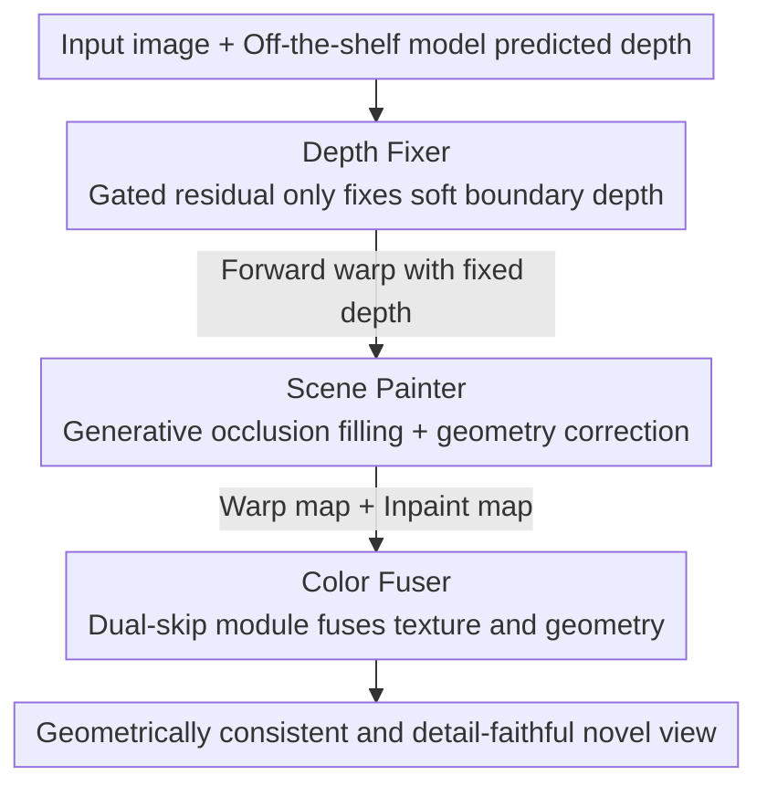

# Guardians of the Hair: Rescuing Soft Boundaries in Depth, Stereo, and Novel Views

**Conference**: CVPR 2026  
**Paper**: [CVF Open Access](https://openaccess.thecvf.com/content/CVPR2026/html/Zhang_Guardians_of_the_Hair_Rescuing_Soft_Boundaries_in_Depth_Stereo_CVPR_2026_paper.html)  
**Code**: Not released  
**Area**: 3D Vision  
**Keywords**: Soft boundaries, Monocular depth estimation, Stereo conversion, Novel view synthesis, Image matting  

## TL;DR
HairGuard leverages image matting datasets to construct fine-grained depth supervision for soft boundaries (e.g., hair). It employs a "depth fixer + scene painter + color fuser" trio as a plug-and-play solution to correct depth, repair occlusions, and fuse textures, achieving SOTA performance on soft boundary details in monocular depth, stereo conversion, and novel view synthesis.

## Background & Motivation
**Background**: Driven by foundation models and large-scale datasets, monocular depth estimation, stereo conversion, and novel view synthesis (NVS) have advanced rapidly, finding wide applications in film production, AR/VR, and robotics.

**Limitations of Prior Work**: Mainstream methods consistently fail in "soft boundary" regions—areas such as hair filaments and semi-transparent structures where foreground and background colors blend. Depth Anything V2 produces broken or missing depth for hair; Depth Pro offers better detail, but soft boundary depth often falls behind the actual surface, causing hair to "float" during point cloud rendering. Implicit generative NVS (e.g., ReCamMaster) creates inconsistent textures due to the hallucinatory nature of diffusion models, while latent-space methods like StereoCrafter suffer from texture degradation due to pixel-to-latent compression.

**Key Challenge**: Soft boundaries are inherently an alpha-blending problem—pixels receive contributions from both foreground and background ($\alpha \in (0, 1)$), making the correspondence between depth and color naturally ambiguous and ill-posed. Existing depth datasets primarily label hard boundaries and lack fine-grained depth ground truth for soft boundaries. Locating soft boundaries typically relies on manual cues like trimaps, which are difficult to generalize.

**Key Insight**: Image matting in 2D vision has long modeled soft boundaries by using alpha mattes to characterize foreground-background blending. The authors observe that matting datasets contain numerous targets with alpha channels, which can be "borrowed" as a source of supervision for soft boundary depth.

**Core Idea**: Matting datasets are used to synthesize training pairs with "fine-grained soft boundary depth ground truth." A repair network is trained to automatically locate and refine soft boundary depth. Combined with a specialized painter and fuser, the depth refinement benefits are propagated to stereo conversion and novel view synthesis.

## Method
### Overall Architecture
HairGuard treats the image matting composition formula $I = \alpha \cdot I_{FG} + (1-\alpha) \cdot I_{BG}$ as a unified definition for soft boundaries: regions where $\alpha \in (0, 1)$. The system is a serial pipeline where "depth is fixed first, then views are synthesized," involving three collaborative components:

- **Depth fixer**: Takes an image and depth from an existing model (e.g., DAv2) as input, automatically identifies soft boundary regions, and refines depth only in those areas while keeping the global depth unchanged—allowing it to be a plug-and-play attachment to any zero-shot depth model.
- **Scene painter**: Performs forward warping using the refined depth to obtain an initial novel view, then uses a generative model to fill occlusion holes and correct geometric errors introduced by warping.
- **Color fuser**: Adaptively merges the "warp result" (true details but redundant background color) and the "inpaint result" (complete but with texture hallucinations) to produce a final view with geometric consistency and high fidelity.

This trio is supported by a data synthesis strategy: due to the lack of existing soft boundary depth/multi-view ground truth, the authors use matting datasets to "create" training data throughout the process.

### Key Designs

**1. Soft boundary supervision from matting data synthesis: Creating fine-grained labels missing in depth datasets**

Soft boundary depth ground truth is nearly impossible to capture manually. Instead, the authors synthesize it from matting datasets. The matting data serves as the foreground set $I_{FG} = \{(\alpha, I_{FG})_i\}$, and ordinary images serve as the background set $I_{BG}$. Since alpha mattes transition smoothly—unlike the step-function nature of depth—they are first binarized into a mask $M_\alpha = \{p \mid \alpha_{th} < \alpha(p)\}$ using a threshold $\alpha_{th}$. Foreground depth is estimated as $d_{FG} = M_\alpha \odot \mathrm{Depth}(I_{FG})$ after green-screen augmentation, and background depth is $d_{BG} = \mathrm{Depth}(I_{BG})$. $d_{FG}$ is rescaled by sampling from $[d_{min}, d_{max}]$ (with $d_{min} = \max_{p \in M_\alpha} d_{BG}(p)$ to ensure correct occlusion order). Finally, the composition is:

$$d = d_{FG} \odot M_\alpha + d_{BG} \odot (1 - M_\alpha)$$

The ingenuity lies in "adjusting thresholds to create both input and ground truth": a low $\alpha_{th}$ generates GT $d_{GT}$ rich in soft boundary details, while a high $\alpha_{th}$ simulates the "broken/missing" input $d_{in}$. Random Gaussian blur is applied to $M_\alpha$ when generating $d_{in}$, whereas a sharp mask is used for $d_{GT}$. This automatically generates "bad depth to good depth" training pairs without manual trimaps.

**2. Gated residual in depth fixer: Modifying only soft boundaries, leaving global depth intact**

Directly predicting refined depth or using standard residuals often destroys global depth or blurs details. The fixer uses two branches: DINOv2+DPT for semantics and a U-Net for local structure. To automatically locate soft boundaries, Sobel filtering is applied to the input depth to get edge guidance $e = \mathrm{Sobel}(d_{in})$, which is concatenated with image $I_{in}$ and depth $d_{in}$ for the pixel branch. The core is predicting a gate map $G \in [0, 1]$ (where $G < 1$ marks soft boundaries). The refined depth is:

$$\hat{d} = d_{in} \cdot G + d_{res} \cdot (1 - G)$$

Where $d_{res}$ is the estimated depth residual. The gate decouples "depth estimation" from "soft boundary repair"—at hard boundaries, $G \to 1$ passes the original depth, while at soft boundaries, the residual takes over. This preserves the foundation model's zero-shot capability while being plug-and-play. A two-stage "local then global" strategy is used: first, a soft boundary mask $M_{soft} = \{p \mid \alpha_{min} < \alpha(p) < \alpha_{max}\}$ penalizes soft boundary errors:

$$\mathcal{L}^{stage1}_{depth} = \mathcal{L}_1(\hat{d}, d_{GT}) + \mathcal{L}_\alpha(\hat{d} \odot M_{soft}, d_{GT} \odot M_{soft})$$

($\mathcal{L}_\alpha$ is a matting loss borrowed from ViTMatte to capture details). This prevents the gate from collapsing to the trivial solution $G = 1$. The second stage applies constraints globally $\mathcal{L}^{stage2}_{depth} = \mathcal{L}_\alpha(\hat{d}, d_{GT})$ to refine overall quality and remove halos.

**3. Scene painter: Detail preservation via forward warp + Matting-based occlusion synthesis**

View synthesis starts with forward warping using refined depth to preserve soft boundary details. However, blending at soft boundaries causes the warped result to carry redundant background colors. Since existing multi-view datasets mostly feature hard boundaries, the authors synthesize soft boundary warp training data: given a background multi-view sequence, background flow $f_{BG}$ is calculated. A foreground image is sampled and given a random translation $(u, v)$ to generate foreground flow $f_{FG}$. Composition is:

$$f = f_{FG} \odot M_\alpha + f_{BG} \odot (1 - M_\alpha)$$

Since the foreground only translates, GT views are easily synthesized. While foreground motion is simple, the background retains real perspective changes and complex camera motion, sufficient for training robust occlusion repair. The painter is fine-tuned from the Wan2.1-1.3B VACE model, using SplatDiff’s alignment strategy for precise view control.

**4. Color fuser dual-skip module: Adaptively balancing "real details" and "completion"**

The painter removes redundant backgrounds but may hallucinate inconsistent textures (warp maps have real details but redundant colors; inpaint maps are complete but have hallucinations). Built on a pre-trained VAE to leverage reconstruction priors, the fuser addresses VAE detail loss via a dual-skip module. Multi-scale features are extracted from inpaint and warp maps using a frozen VAE encoder, which are then fed into the VAE decoder alongside the warp mask. During training, the painter generates "fake inpaint inputs" with hallucinated textures from $I_{GT}$ to fine-tune the VAE decoder:

$$\mathcal{L}_{color} = \mathcal{L}_1(\hat{I}, I_{GT}) + \lambda \cdot \mathcal{L}_{lpips}(\hat{I}, I_{GT})$$

where $\lambda = 0.1$. The final fuser removes both redundant background colors and hallucinated textures.

### Loss & Training
The depth fixer uses a two-stage process with AdamW, $448 \times 448$ patches, batch size 32, learning rate $1 \times 10^{-5}$, and 35K iterations per stage. The scene painter fine-tunes VACE at $480 \times 832$, batch size 4, 10K iterations. The color fuser fuses dual-skip features in the VAE decoder at $448 \times 448$, batch size 16, 35K iterations. Training took ~4 days on 4 RTX A6000 GPUs.

## Key Experimental Results

### Main Results
Stereo image/video conversion was compared on the self-constructed Marvel-10K (501 Marvel movie stereo clips, 12,525 frames with complex hair):

| Task | Metric | Ours | SplatDiff (Prev. SOTA) | Gain |
|------|------|-----------|-------------------|------|
| Stereo Image Conv. | PSNR ↑ | 36.59 | 36.23 | +0.36 |
| Stereo Image Conv. | SSIM ↑ | 0.8953 | 0.8857 | +0.0096 |
| Stereo Image Conv. | LPIPS ↓ | 0.0909 | 0.1116 | Better |
| Stereo Image Conv. | DISTS ↓ | 0.0331 | 0.0435 | Better |
| Stereo Video Conv. | PSNR ↑ | 36.58 | 36.24 | +0.34 |

Soft boundary depth accuracy (zero-shot, natural image matting datasets), with the depth fixer plugged into different models:

| Baseline Model (AIM-500) | DBE acc ↓ | EP(%) ↑ | ER(%) ↑ |
|------|------|------|------|
| Depth Anything V2 | 3.29 | 19.90 | 6.50 |
| + Depth Fixer | **2.10** | **34.56** | **13.08** |
| Depth Pro | 3.80 | 15.92 | 6.12 |
| + Depth Fixer | **2.30** | **35.01** | **17.33** |
| UniDepthV2 | 3.87 | 19.52 | 5.14 |
| + Depth Fixer | **2.71** | **33.06** | **10.98** |

Ours also achieved the lowest FID for NVS (AIM-500: 18.82 vs SplatDiff 19.26). A user study with 27 participants and 1332 votes showed an overwhelming preference for HairGuard. On zero-shot benchmarks (NYUv2/KITTI), global depth remained virtually unchanged, confirming that the fixer does not harm global metrics.

### Ablation Study
Stepwise addition of components on Marvel-10K stereo conversion:

| Configuration | PSNR ↑ | LPIPS ↓ | SIoU ↑ | Description |
|------|--------|---------|--------|------|
| #1 DAv2 warp only | 36.26 | 0.1490 | 0.3097 | Baseline |
| #2 + Depth Fixer | 36.28 | 0.1458 | 0.3118 | Improves soft boundary depth / SIoU |
| #3 + Scene Painter | 35.82 | 0.1246 | 0.3015 | Fills occlusions; LPIPS drops, PSNR drops (hallucinations) |
| #4 + Color Fuser (Full) | **36.59** | **0.0909** | **0.3337** | Best overall performance |

### Key Findings
- **Color Fuser is the "lifesaver"**: Adding the scene painter (#3) initially dropped PSNR from 36.28 to 35.82 due to hallucinations and compression. The fuser (#4) restored it to 36.59 and drastically reduced LPIPS, showing that "real warped details" must be recovered.
- **Depth Fixer contributes to geometry**: #2 shows improvements primarily in SIoU (stereo consistency), which is critical for visual comfort despite minimal PSNR change.
- **Gated residual preserves zero-shot**: Performance on five unseen depth benchmarks remained stable, validating its plug-and-play nature.

## Highlights & Insights
- **Cross-domain data borrowing**: Using 2D matting alpha mattes to supervise 3D soft boundaries bypasses the impossibility of capturing soft boundary depth GT. This logic can be extended to other fine-grained geometric tasks lacking ground truth.
- **Gated residual decoupling**: $\hat d = d_{in}G + d_{res}(1-G)$ separates "whether to modify" from "how to modify." This is a clean implementation of plug-and-play enhancement that respects the foundation model.
- **Two-stage training**: Preventing the gate from collapsing through local-then-global penalization is a practical training trick for gated architectures.
- **Targeted components**: Warping preserves details, the painter fills gaps, and the fuser removes hallucinations. Each component addresses a specific failure mode of soft boundary synthesis.

## Limitations & Future Work
- Since soft boundaries occupy small image areas, improvements in global pixel metrics (PSNR/SSIM) appear modest (+0.3~0.4 dB). The real value lies in boundary-specific metrics (DBE/EP/ER) and subjective quality.
- ⚠️ The data synthesis assumes simple foreground translation. Real-world hair possesses complex non-rigid motion and self-occlusion, which might limit generalization in extreme dynamic scenes.
- The pipeline is heavy: three serial networks, significant inference overhead, and reliance on external multi-stage models (Depth, Flow, VACE, SplatDiff).
- Code and Marvel-10K data availability is uncertain due to copyright, potentially hindering reproducibility.

## Related Work & Insights
- **vs Depth Pro / DAv2 / UniDepthV2**: These are end-to-end models that often fail at soft boundaries. Ours acts as a plug-and-play "fixer" that refines these areas while doubling boundary accuracy without retraining the base model.
- **vs SplatDiff**: Both are depth-guided diffusion methods, but SplatDiff's performance is tied to depth quality. By fixing soft boundary depth at the source and using a color fuser, Ours stops error propagation.
- **vs ReCamMaster / StereoCrafter (Implicit)**: Implicit methods have hallucinations and texture loss. Ours uses an "explicit warp + generative fill + fusion" hybrid route, resulting in better consistency and fidelity for soft boundaries.

## Rating
- Novelty: ⭐⭐⭐⭐⭐ "Borrowing matting alpha for 3D supervision + gated plug-and-play repair" is highly inspiring.
- Experimental Thoroughness: ⭐⭐⭐⭐⭐ Covers three tasks across multiple baselines, benchmarks, and user studies.
- Writing Quality: ⭐⭐⭐⭐ Clear division of labor, though global vs. local metric discrepancies require careful reading.
- Value: ⭐⭐⭐⭐ Directly addresses the long-standing pain point of hair details in film and VR.

<!-- RELATED:START -->

## Related Papers

- [\[CVPR 2026\] PRIMU: Uncertainty Estimation for Novel Views in Gaussian Splatting from Primitive-Based Representations of Error and Coverage](primu_uncertainty_estimation_for_novel_views_in_gaussian_splatting_from_primitiv.md)
- [\[ECCV 2024\] Flying with Photons: Rendering Novel Views of Propagating Light](../../ECCV2024/3d_vision/flying_with_photons_rendering_novel_views_of_propagating_light.md)
- [\[CVPR 2026\] CGHair: Compact Gaussian Hair Reconstruction with Card Clustering](cghair_compact_gaussian_hair_reconstruction_with_card_clustering.md)
- [\[CVPR 2026\] Depth Hypothesis Guided Iterative Refinement for Event-Image Monocular Depth Estimation](depth_hypothesis_guided_iterative_refinement_for_event-image_monocular_depth_est.md)
- [\[CVPR 2026\] SPE-MVS: Spatial Position Encoding Enhanced Multi-View Stereo with Monocular Depth Priors](spe-mvs_spatial_position_encoding_enhanced_multi-view_stereo_with_monocular_dept.md)

<!-- RELATED:END -->
