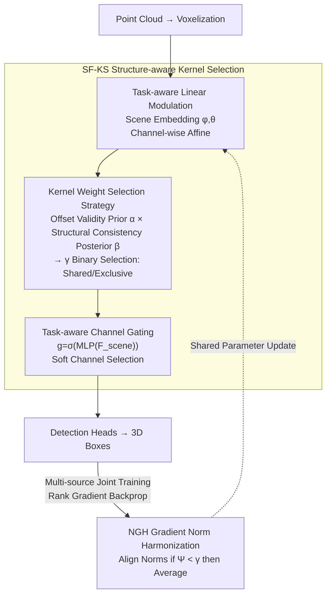

# H²A²: Homogeneity-Aware and Heterogeneity-Aware Feature Perception for Unified Indoor 3D Object Detection

**Conference**: CVPR 2026  
**Paper**: [CVF Open Access](https://openaccess.thecvf.com/content/CVPR2026/html/Xie_H2A2_Homogeneity-Aware_and_Heterogeneity-Aware_Feature_Perception_for_Unified_Indoor_3D_CVPR_2026_paper.html)  
**Code**: None  
**Area**: 3D Vision  
**Keywords**: Indoor 3D Detection, Cross-Scene Joint Training, Homogeneous/Heterogeneous Features, Sparse Kernel Selection, Gradient Balancing  

## TL;DR
The authors discover that basic geometric structures such as lines, planes, and corners in indoor 3D detection induce **highly consistent offset responses in sparse convolution kernels** (homogeneous features) across different scenes, while scene-specific structures produce heterogeneous responses. H²A² utilizes a structure-aware kernel selection mechanism (SF-KS) to dynamically decide whether to use a "cross-scene shared kernel" or a "scene-exclusive kernel" at each offset position. Combined with a Norm Gradient Harmonization (NGH) algorithm to stabilize multi-source joint training, it achieves universal gains of 1~7.6 mAP over the strong baseline TR3D on ScanNet/SUN RGB-D/S3DIS.

## Background & Motivation

**Background**: The mainstream of indoor 3D detection consists of voxel-based methods using sparse convolution. Representative works include FCAF3D, the first fully convolutional, anchor-free sparse voxel detector, and TR3D, which applies pruning to achieve a $2\times$ inference speedup. The training paradigm for these methods is **independent single-scene training**—training separate models for ScanNet, SUN RGB-D, and S3DIS.

**Limitations of Prior Work**: Single-scene training overlooks a crucial fact: different indoor scenes **share a large number of basic geometric structures**. As shown in Fig. 1 of the paper, local structures like planes, boundaries, and lines exhibit highly similar effective offset patterns learned by sparse convolution kernels, even across different scenes and objects. Single-scene training essentially forces each dataset to learn these universal structures from scratch, failing to exploit this cross-scene homogeneity.

**Key Challenge**: A straightforward remedy is "shared backbone + dataset-specific detection heads." However, such naive sharing during joint optimization **mixes irrelevant heterogeneous signals** from different scenes: differences in acquisition equipment, scene scales, and spatial layouts push shared parameters toward conflicting optimization directions, which degrades results. In other words—homogeneous features should be shared, while heterogeneous features must be isolated, but existing methods lack a mechanism to **handle both separately within the same set of convolution kernels**.

**Goal**: To accurately model "which homogeneous structures should be shared" while specifically characterizing the "scene-exclusive heterogeneous attributes" under a cross-scene joint training framework.

**Key Insight**: The authors' key observation lies at the **offset level of sparse convolution kernels**—homogeneous structures induce aligned, offset-indexed activation patterns across scenes, leading to consistent kernel representations. Conversely, certain offsets near object boundaries may fall into invalid support regions (sparse or occluded point cloud zones), producing characteristic discontinuities. Since the distinction between homogeneity and heterogeneity is discernible at the offset granularity, **kernel selection should be performed at the offset granularity**.

**Core Idea**: Assign a discriminative score $\gamma_j$ to each convolution kernel offset. Use a fusion of "long-term statistical prior $\times$ current scene structural posterior" to decide whether an offset should use a shared kernel or an exclusive kernel. This allows optimizing homogeneous features and specializing heterogeneous features within a single hybrid kernel. Furthermore, use gradient norm harmonization to prevent any single scene from dominating the gradients during joint training.

## Method

### Overall Architecture

H²A² follows the overall configuration of TR3D: Point cloud input $\rightarrow$ Voxelization $\rightarrow$ MinkResNet (sparse convolution backbone) $\rightarrow$ Multi-layer detection heads for 3D box regression. The core modification is replacing standard sparse convolutions in the backbone with **Structure-aware Kernel Selection (SF-KS)** modules and applying **NGH** gradient balancing during multi-source joint training.

Inside SF-KS is a three-stage pipeline: first, **Task-aware Linear Modulation (TLM)** performs scene-adaptive channel-wise affine transformations on input features to amplify scene-related structures and suppress noise. Next, a **Kernel Weight Selection Strategy** calculates a discriminative score $\gamma_j$ at each offset position, interpolating between the shared kernel $W^{sh}$ and the exclusive kernel $W^{ex}$ based on $\gamma_j$ to form the final hybrid kernel for convolution. Finally, **Task-aware Channel Gating** performs soft selection on output channels to suppress scene-irrelevant responses. On the training side, since each data-parallel rank is tied to a specific data source, the imbalance in gradient norms across ranks reflects the "dominance imbalance" between datasets. NGH aligns the gradient norms across ranks on shared parameters before averaging.

### Key Designs

**1. Task-aware Linear Modulation (TLM): Isolating "Scene-related Channels" Before Convolution**

The first issue with a naively shared backbone is that homogeneous structural signals and scene noise are mixed in the input features, making them hard to distinguish for the kernel. TLM adds a **scene-driven channel-wise affine layer** at the convolution input. Given input features $F_{in}\in\mathbb{R}^{N\times C_{in}}$ ($N$ active sites), the method introduces a set of learnable scene embeddings $F_{scene}$ to encode scene-level structural features. A lightweight MLP modulation function $\mathcal{F}$ maps this to channel-wise affine parameters:

$$(\varphi, \theta) = \mathcal{F}(F_{scene}), \qquad \widehat{F}_{in} = F_{in} \odot \varphi + \theta$$

where $\odot$ denotes channel-wise multiplication broadcasted across the spatial dimension $N$. By amplifying discriminative channels and suppressed weakly related responses, TLM feeds the subsequent kernel selection with features where scene structures are already "highlighted." Note that the scene embedding is independently learnable and not derived from the current features, a design choice intended to **avoid self-referential modulation**.

**2. Kernel Weight Selection Strategy: Offset-level Decisions via "Prior $\times$ Posterior"**

This is the core of the paper. Sparse convolution kernels aggregate neighborhoods based on a set of predefined offsets around an active site. The authors decide at **each offset $j$** whether the corresponding weight should be shared across scenes (encoding homogeneous structures) or be scene-exclusive (encoding heterogeneous structures). The decision is fused from two parts:

- **Offset Validity Prior $\alpha$ (Data-independent, global statistics)**: Due to point cloud sparsity, occlusion, and boundaries, sparse convolutions often find "missing valid neighborhoods." Each offset is assigned a learnable parameter $O\in\mathbb{R}^V$ ($V$ is kernel volume), which passes through a sigmoid to yield a reliability score $\alpha = \sigma(O) \in (0, 1)^V$. Training naturally reduces the weights of offsets that "persistently lack support and contribute little." This term characterizes the global availability of an offset throughout training without relying on manual heuristics.
- **Structural Consistency Posterior $\beta$ (Data-dependent, current scene)**: Each offset is assigned a structural prototype vector $p_j \in \mathbb{R}^{V \times d}$, which participates in gated selection and backpropagation via its cosine similarity with the current scene's structural features. Frequently occurring structures provide consistent, cumulative gradient directions, pushing $p_j$ toward convergence, while sporadic/noisy patterns cancel out. Both features and prototypes are $\ell_2$-normalized (focusing on shape rather than magnitude). Similarity queries are performed across all active sites in the current scene and mean-pooled to obtain $\beta_j \in [0, 1]$, representing the prototype's consistency in the current scene.

These are merged into a discriminative score and binarized:

$$\gamma_j = \mathrm{Binarization}(\alpha_j \beta_j; \tau)$$

If $\alpha_j \beta_j \ge \tau$, then $\gamma_j = 1$, and the offset uses the **shared kernel** (stable representation of homogeneous features); otherwise, $\gamma_j = 0$, and it uses the **exclusive kernel** to handle scene-specific structures. The final kernel is interpolated per offset:

$$W_j = \gamma_j W_j^{sh} + (1 - \gamma_j) W_j^{ex}, \quad j = 1, \dots, V$$

where $W \in \mathbb{R}^{V \times C_{in} \times C_{out}}$ serves as the hybrid sparse convolution kernel.

**3. Task-aware Channel Gating: Post-conv Filtering of Scene-irrelevant Responses**

After convolution with the hybrid kernel, output features may still contain residual statistical conflicts and distribution shifts. The authors apply a **soft channel-wise selection** at the output. Given output $F_{out} \in \mathbb{R}^{N \times C}$ and scene vector $F_{scene} \in \mathbb{R}^d$, gating factors are calculated and used for recalibration:

$$\mathbf{g} = \sigma(MLP(F_{scene})) \in (0, 1)^C, \qquad F = F_{out} \odot (1 + \mathbf{g})$$

Using $1 + \mathbf{g}$ instead of just $\mathbf{g}$ performs "enhancement-centric" soft recalibration, suppressing scene-irrelevant channels and enhancing relevant ones.

**4. Norm-based Gradient Harmonization (NGH): Preventing Gradient Dominance**

In multi-source joint optimization, shared parameters face two types of gradient conflicts: direction inconsistency (slowing convergence) and norm variance (causing optimization dominance). The authors argue that direction issues mainly delay convergence, while norm differences "crush" small-norm objectives. In their iterative training, **norm variance is the primary bottleneck**—large-norm scenes dominate updates and drown out other tasks.

For $K$ ranks (each rank tied to one data source), let the local gradient for shared parameter $p$ at rank $k$ be $g_k^p = \nabla_p L_k$, with norm $n_k = \|g_k^p\|_2$. A symmetric similarity metric measures norm balance across ranks:

$$\Psi = \frac{1}{K(K-1)} \sum_{i \neq j} \frac{2 n_i n_j}{n_i^2 + n_j^2 + \varepsilon}$$

$\Psi \in (0, 1]$ targets imbalance. Harmonization triggers only if $\Psi < \gamma$: targeted norm $M_t = \frac{1}{K} \sum_k n_k$ is calculated, and each rank's gradient is scaled by $s_k = M_t / (n_k + \varepsilon)$ such that $\tilde g_k^p = s_k g_k^p$, then averaged across ranks $\bar g^p = \frac{1}{K} \sum_k \tilde g_k^p$. Since $s_k > 0$, the **direction remains strictly unchanged**, only the norms are aligned.

## Key Experimental Results

Three indoor benchmarks: ScanNet v2 (18 classes), SUN RGB-D (10 classes), S3DIS (Area 5, 5 classes). Based on MMDetection3D, 3×RTX 4090 training, using TR3D hyper-parameters.

### Main Results (Geometry Only, comparison with SOTA)

| Dataset | Metric | H²A² (Ours) | TR3D (Baseline) | Gain |
|---------|--------|------------|-----------------|------|
| ScanNet v2 | mAP@0.25 | **77.5** | 72.9 | +4.6 |
| ScanNet v2 | mAP@0.5 | **63.8** | 59.3 | +4.5 |
| SUN RGB-D | mAP@0.25 | **68.0** | 67.1 | +0.9 |
| SUN RGB-D | mAP@0.5 | **51.4** | 50.4 | +1.0 |
| S3DIS | mAP@0.25 | **78.7** | 74.5 | +4.2 |
| S3DIS | mAP@0.5 | **59.3** | 51.7 | +7.6 |

H²A² outperforms TR3D and recent SOTAs (Point-GCC, SPGroup3D, DLLA, etc.). The cost is slower inference: FPS on ScanNet drops from 23.7 to 18.2.

### Ablation Study (Stepwise SF-KS and NGH, mAP@0.25 / mAP@0.5)

| SF-KS | NGH | ScanNet | SUN RGB-D | S3DIS |
|-------|-----|---------|-----------|-------|
| ✗ | ✗ | 70.8 / 54.6 | 64.4 / 43.6 | 76.4 / 56.8 |
| ✓ | ✗ | 76.7 / 61.3 | 67.3 / 48.1 | 77.8 / 56.0 |
| ✗ | ✓ | 72.9 / 56.1 | 65.5 / 48.4 | 76.7 / 58.2 |
| ✓ | ✓ | **77.5 / 63.8** | **68.0 / 51.4** | **78.7 / 59.3** |

SF-KS is the primary performance contributor (e.g., +5.9 mAP@0.25 on ScanNet). NGH contributes independently and further boosts performance when combined with SF-KS.

### Key Findings
- The main performance driver is SF-KS (kernel selection); NGH acts as a stabilizing "auxiliary" for multi-source training—NGH alone provides limited gains, but it is essential for reaching optimality alongside SF-KS.
- S3DIS shows the largest mAP@0.5 gain (+7.6), suggesting that cross-scene homogeneous feature sharing is particularly beneficial for smaller, more regular datasets.

## Highlights & Insights
- **Fine-grained decision granularity**: The "shared vs. exclusive" decision is made at the convolution kernel offset level, which is much finer than whole-backbone or whole-kernel sharing.
- **Prior $\times$ Posterior fusion**: Combining $\alpha$ (global statistical availability) with $\beta$ (current scene consistency) avoids decisions based on single observations and decouples long-term utility from immediate scene fit.
- **Direction-preserving NGH**: Unlike algorithms like PCGrad that alter descent directions, NGH posits that norm imbalance, not direction conflict, is the bottleneck in this specific task and aligns norms with minimal communication overhead.

## Limitations & Future Work
- **Inference Speed**: Kernel mixing and the dual-path kernel (shared + exclusive) introduce overhead, reducing ScanNet FPS from 23.7 to 18.2.
- **Coarse Scene Embeddings**: Scene embeddings are currently at the dataset/task level; whether this is fine enough for strong intra-dataset heterogeneity remains to be explored.
- **NGH Rank Dependency**: NGH assumes a mapping where one rank equals one data source; if data parallel partitioning is different, the effectiveness of rank-based norm balancing needs further validation.
- **Sensitivity to Threshold $\tau$**: The selection $\gamma_j$ relies on hard binarization, but sensitivity analysis of $\tau$ is not extensively reported in the main text.

## Related Work & Insights
- **vs TR3D / FCAF3D**: These are single-scene sparse voxel detectors. H²A² builds on TR3D by introducing cross-scene joint training and replacing kernel mechanisms to convert independent learning into "homogeneous sharing and heterogeneous isolation."
- **vs UniDet3D**: While UniDet3D focuses on unifying label spaces across datasets, H²A² **explicitly models geometric homogeneity/heterogeneity** at the offset level, resulting in more robust joint optimization.
- **vs Multi-dataset Learning (Omnivore / M3ViT)**: These works typically control sharing at the architecture level (shared backbones); H²A² pushes the sharing decision down to the sparse convolution offset level and specifically addresses gradient norm conflicts.

## Rating
- Novelty: ⭐⭐⭐⭐ Moving homogeneity/heterogeneity distinction down to the kernel offset level with prior-posterior fusion is a highly distinctive design.
- Experimental Thoroughness: ⭐⭐⭐⭐ Comprehensive results across three benchmarks with transfer and zero-shot analysis, though hyper-parameter sensitivity analysis for $\tau$ is lacking.
- Writing Quality: ⭐⭐⭐ Clear motivation, though the reuse of the symbol $\gamma$ and some formula layouts could be improved for readability.
- Value: ⭐⭐⭐⭐ Provides a modular, transferable kernel selection paradigm for multi-source joint training in indoor 3D detection.

## Related Papers

- [\[CVPR 2026\] Towards Intrinsic-Aware Monocular 3D Object Detection](towards_intrinsic-aware_monocular_3d_object_detection.md)
- [\[CVPR 2026\] Few-Shot Incremental 3D Object Detection in Dynamic Indoor Environments](few-shot_incremental_3d_object_detection_in_dynamic_indoor_environments.md)
- [\[CVPR 2026\] Generalizable Structure-Aware Keypoint Correspondence for Category-Unified 3D Single Object Tracking](generalizable_structure-aware_keypoint_correspondence_for_category-unified_3d_si.md)
- [\[CVPR 2026\] UniPR: Unified Object-level Real-to-Sim Perception and Reconstruction from a Single Stereo Pair](unipr_unified_object-level_real-to-sim_perception_and_reconstruction_from_a_sing.md)
- [\[CVPR 2026\] From Pairs to Sequences: Track-Aware Policy Gradients for Keypoint Detection](from_pairs_to_sequences_track-aware_policy_gradients_for_keypoint_detection.md)

<!-- RELATED:END -->

<!-- RELATED:START -->

## Related Papers

- [\[CVPR 2026\] Generalizable Structure-Aware Keypoint Correspondence for Category-Unified 3D Single Object Tracking](generalizable_structure-aware_keypoint_correspondence_for_category-unified_3d_si.md)
- [\[CVPR 2026\] MonoSAOD: Monocular 3D Object Detection with Sparsely Annotated Label](monosaod_monocular_3d_object_detection_with_sparsely_annotated_label.md)
- [\[CVPR 2026\] Cov2Pose: Leveraging Spatial Covariance for Direct Manifold-aware 6-DoF Object Pose Estimation](cov2pose_leveraging_spatial_covariance_for_direct_manifold-aware_6-dof_object_po.md)
- [\[CVPR 2026\] HAD: Hallucination-Aware Diffusion Priors for 3D Reconstruction](had_hallucination-aware_diffusion_priors_for_3d_reconstruction.md)
- [\[CVPR 2026\] ESAM++: Efficient Online 3D Perception on the Edge](esam_efficient_online_3d_perception_on_the_edge.md)

<!-- RELATED:END -->
