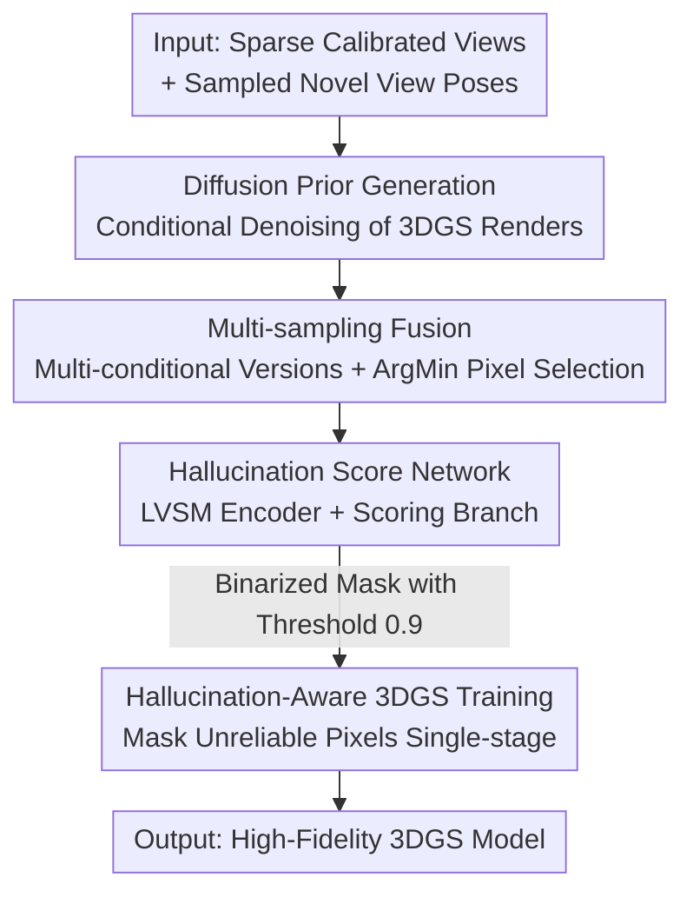

# HAD: Hallucination-Aware Diffusion Priors for 3D Reconstruction

**Conference**: CVPR2026  
**arXiv**: [2605.16873](https://arxiv.org/abs/2605.16873)  
**Code**: Project Page (The paper claims it is public, but no specific repository link is provided)  
**Area**: 3D Vision / Novel View Synthesis / Diffusion Priors  
**Keywords**: Sparse-view Reconstruction, 3D Gaussian Splatting, Diffusion Priors, Hallucination Suppression, Novel View Synthesis

## TL;DR
Addressing the issue where diffusion priors improve image quality but generate non-existent content (hallucination) in sparse-view 3D reconstruction, HAD utilizes a pre-trained feed-forward NVS network (LVSM) as a multi-view encoder paired with a lightweight branch to predict pixel-wise "hallucination score maps." During 3DGS training, high-score (unreliable) pixels are masked, and multi-sampling fusion is employed to further decrease the hallucination ratio. Ultimately, the method achieves SOTA performance with a PSNR improvement of 0.78dB on DL3DV and 0.69dB on MipNeRF360.

## Background & Motivation
**Background**: NeRF and 3DGS are the two dominant paradigms for Novel View Synthesis (NVS), but both depend on dense camera coverage and high-quality input images. In "data-scarce" scenarios such as sparse views or extreme extrapolation, rendering quality degrades sharply. A mainstream remedy involves using generative diffusion priors (e.g., Difix3D) to "refine" novel views—treating flawed 3DGS renders as "noisy samples" and denoising them conditioned on original input views to generate realistic augmented views for expanding training data.

**Limitations of Prior Work**: Although diffusion denoising makes augmented views photorealistic, it is **not faithful**—it is not designed to strictly preserve the content of the conditional input views. Consequently, "hallucinated aliens" (artifacts non-existent in the input) appear in the generated images. Once this hallucinated content is fed into the 3DGS model, it leads to the "hallucination problem" in 3D reconstruction: renders look sharp and beautiful but possess low fidelity to the input views.

**Key Challenge**: A fundamental tension exists between the diffusion prior's "strong high-frequency details but poor fidelity" and the goal of using it for data augmentation without polluting the 3D model. Recent works have attempted to mitigate hallucinations by **forcing the diffusion to respect input views** through video diffusion or multi-view diffusion, but as long as the generative nature of diffusion remains, multi-view inconsistency cannot be entirely eliminated.

**Goal**: Rather than futilely attempting to "prevent hallucinations entirely," this paper shifts the approach: **acknowledge that hallucinations occur but possess the capability to filter them out when feeding augmented images into the 3D model**. The problem is decomposed into: (1) how to quantify "whether this area is a hallucination" pixel-wise; (2) how to utilize this quantification in 3DGS optimization; (3) how to further reduce the hallucination ratio in generated images.

**Key Insight**: The authors observe that feed-forward NVS networks (e.g., LVSM) are inherently trained for "high-fidelity restoration of input views," meaning their feature backbones contain powerful **multi-view reasoning capabilities**. This can be leveraged to judge "which pixels in diffusion-augmented images are inconsistent with the input views." By borrowing this pre-trained knowledge, a hallucination scorer can be trained on a very small curated dataset, bypassing the massive data preparation hurdle of running full 3D reconstruction, rendering, and diffusion denoising for every sample.

**Core Idea**: Use a pre-trained NVS backbone as a multi-view encoder to predict pixel-wise hallucination score maps, mask unreliable pixels from 3DGS supervision, and reduce hallucinations via multi-sampling ArgMin fusion—achieving "hallucination-aware" rather than "hallucination-proof" reconstruction.

## Method

### Overall Architecture
The input consists of a set of sparse calibrated images (e.g., 9 views) with poses. The goal is to train a 3DGS model capable of high-quality rendering at both training and under-constrained novel views. The key shift in HAD is: within the alternating "view augmentation + training" loop, every time a diffusion-augmented novel view is generated, a pixel-wise hallucination score map is predicted simultaneously to mask unreliable pixels from the novel-view supervision loss. The pipeline consists of three components: a diffusion prior (following Difix3D) to generate augmented views; a hallucination scoring network (frozen LVSM encoder + lightweight scoring branch) to output reliability masks; and a multi-sampling strategy to fuse multiple versions of the same novel view into a cleaner image. Finally, these "masked augmented views" supervise 3DGS optimization in a single stage alongside original input views.

### Key Designs

**1. Hallucination Score Network: Leveraging NVS Backbones for Pixel-wise Hallucination Detection**

The pain point is that it is difficult to determine "which pixels are fabricated" in diffusion-augmented images. Learning a discriminator directly would require vast amounts of paired "multi-view input + augmented novel view" samples, each requiring full reconstruction, rendering, and denoising. The authors split the discriminator into two parts: a multi-view feature encoder $\mathcal{V}$ and a scoring branch $\mathcal{S}$. Crucially, $\mathcal{V}$ uses a pre-trained LVSM feature backbone and is **frozen**. As a SOTA feed-forward NVS network, LVSM has learned to "understand multi-view context and restore novel views with high fidelity" on large-scale 3D data. This reasoning capability is perfect for identifying inconsistencies between augmented views and input views. The scoring branch $\mathcal{S}$ is a simple three-layer UNet that takes concatenated multi-view features $\mathbf{F}_{\tilde{\mathbf{c}}}=\mathcal{V}(\mathbf{P}\mid\tilde{\mathbf{c}})$, the diffusion-augmented image $\tilde{\mathbf{i}}_{\mathcal{G}}$, and an optional 3DGS rendered image, outputting a pixel-wise hallucination score map $\mathbf{s}=\mathcal{S}_\theta(\tilde{\mathbf{i}}_{\mathcal{G}}\mid\mathcal{R}_{\Phi}(\tilde{\mathbf{c}}),\mathbf{F}_{\tilde{\mathbf{c}}})$. During training, the ground-truth hallucination score is defined as the pixel-wise MAE between the diffusion-generated image and the ground truth, supervised by an L2 loss. Since $\mathcal{V}$ is frozen and only a small UNet is trained, the network can be fine-tuned in just 10k iterations on a curated dataset of only 116 scenes. Ablation (Tab. 6) shows that removing the pre-trained encoder degrades the score MAE from 0.043 to 0.054, while a retrained Difix3D (lacking multi-view reasoning) is even worse at 0.058—proving that "borrowing the NVS backbone" is the foundation of this scoring approach.

**2. Hallucination-Aware 3DGS Training: Masking Unreliable Pixels and Single-Stage Simplification**

With the score map, the diffusion-augmented novel view loss $\mathcal{L}_{\text{novel}}$ is rewritten into a "masked" form: the score map is binarized into a mask $\mathbf{m}$ using a threshold of 0.9. High-score (hallucinated) pixels are inverted and masked, calculating $\mathcal{L}_1$ and $\mathcal{L}_{\text{D-SSIM}}$ only on reliable regions:

$$\mathcal{L}_{\text{novel}}=\mathcal{L}_1(\lnot\mathbf{m}\odot\mathcal{R}_{\Phi}(\tilde{\mathbf{c}}),\,\lnot\mathbf{m}\odot\tilde{\mathbf{i}})+\mathcal{L}_{\text{D-SSIM}}(\lnot\mathbf{m}\odot\mathcal{R}_{\Phi}(\tilde{\mathbf{c}}),\,\lnot\mathbf{m}\odot\tilde{\mathbf{i}})$$

The total objective is $\lambda_{\text{input}}\mathcal{L}_{\text{input}}+\lambda_{\text{novel}}\mathcal{L}_{\text{novel}}$ (both coefficients set to 1). This prevents hallucinated content from backpropagating into Gaussian parameters, avoiding 3D model pollution. More importantly, this enables a simplification: whereas Difix3D must first fully train 3DGS and then slowly inject diffusion priors in a second stage (for fear of dirty data), HAD can use both input and augmented views from the first step due to mask protection, completing training in a **single stage** without needing a pre-trained 3DGS initialization.

**3. Multi-sampling Strategy: Generating Multi-version Novel Views and ArgMin Selection**

Difix3D conditions denoising only on the single nearest reference image $\mathbf{i}_{\text{ref}}$, failing to utilize complementary cues from other views. For a single novel view pose, HAD generates $K$ versions $\{(\tilde{\mathbf{i}}_{\mathcal{G}}^k,\mathbf{s}^k)\}$ conditioned on $K$ different sampled input views along with their score maps. It then picks the version with the "lowest hallucination score" for each pixel: $\tilde{\mathbf{i}}[i]=\tilde{\mathbf{i}}_{\mathcal{G}}^{k^\ast}[i],\ k^\ast=\arg\min_k \mathbf{s}^k[i]$. This effectively expands single-reference to multi-reference without retraining the diffusion model, allowing the prior to see wider multi-view context and structurally reducing the hallucination ratio. Ablations (Tab. 5) show ArgMin selection outperforms weighted averaging (PSNR 22.134 vs 21.856), as averaging blurs content and loses sharpness. Performance improves monotonically from 1 to 3 versions (Tab. 4); the authors chose $K=3$ to balance marginal gains and compute overhead.

### Loss & Training
- **3DGS Training**: Total loss $\lambda_{\text{input}}\mathcal{L}_{\text{input}}+\lambda_{\text{novel}}\mathcal{L}_{\text{novel}}$, both coefficients are 1. The input view loss follows 3DGS's $0.8\mathcal{L}_1+0.2\mathcal{L}_{\text{D-SSIM}}$. The novel view loss is masked. The mask threshold is empirically set to 0.9. Learning rates: Gaussian means $8e^{-5}$, opacity $5e^{-2}$, rotation $1e^{-3}$, 0-th order SH $5e^{-4}$, high-order SH $2.5e^{-5}$, trained for 30k iterations.
- **Hallucination Score Network Training**: $\mathcal{V}$ (LVSM backbone) is frozen, only the three-layer UNet branch $\mathcal{S}$ is trained. GT scores are pixel-wise MAE between diffusion and GT images, supervised by L2 loss. Data is prepared via the Difix3D pipeline: for each scene, train 3DGS with 9 inputs, then generate 100 960x540 diffusion-augmented novel views. Fine-tuned for 10k iterations with batch size 2/GPU, taking ~28 hours on 8xV100 32GB.

## Key Experimental Results

### Main Results
Evaluation on DL3DV (in-domain, score network trained here) and MipNeRF360 (cross-domain), using 9 sparse view inputs. Metrics: PSNR↑/SSIM↑/LPIPS↓.

| Dataset | Method | PSNR↑ | SSIM↑ | LPIPS↓ |
|---------|--------|-------|-------|--------|
| DL3DV | LVSM (Feed-forward) | 19.855 | 0.636 | 0.252 |
| DL3DV | Gsplat-mcmc | 20.532 | 0.721 | 0.225 |
| DL3DV | Difix3D (Prev. SOTA) | 21.355 | 0.734 | 0.199 |
| DL3DV | **Ours** | **22.134** | **0.757** | **0.190** |
| MipNeRF360 | GenFusion (Video Diff.) | 18.360 | 0.496 | 0.465 |
| MipNeRF360 | Difix3D | 18.001 | 0.475 | 0.350 |
| MipNeRF360 | **Ours** | **18.689** | **0.5094** | **0.334** |

Compared to Difix3D, DL3DV PSNR +0.779dB (21.355→22.134) and MipNeRF360 +0.688dB (18.001→18.689), leading across all metrics. Notably, on MipNeRF360, HAD outperforms GenFusion despite the latter using video diffusion for better consistency. In the post-rendering setting (Ours+ vs Difix3D+), LPIPS is lower (0.177 vs 0.181) but fidelity metrics (PSNR/SSIM) decrease—the authors note that post-rendering enhances photorealism at the cost of fidelity.

### Ablation Study

| Config | PSNR↑ | SSIM↑ | LPIPS↓ | Note |
|--------|-------|-------|--------|------|
| Difix3D | 21.355 | 0.734 | 0.199 | Baseline |
| Difix3D + HAD | 21.779 | 0.749 | 0.195 | Added Hallucination Mask |
| Difix3D + HAD + M.S. | 21.983 | 0.755 | 0.195 | Added Multi-sampling |
| Ours (full, single-stage) | 22.134 | 0.757 | 0.190 | Full Model |

Multi-sampling versions and fusion strategy:

| Ablation | Config | PSNR↑ | SSIM↑ | LPIPS↓ |
|----------|--------|-------|-------|--------|
| Versions | 1 (No M.S.) | 21.779 | 0.749 | 0.195 |
| Versions | 2 | 21.938 | 0.754 | 0.195 |
| Versions | 3 (Chosen) | 21.983 | 0.755 | 0.195 |
| Fusion | Weighted Average | 21.856 | 0.747 | 0.190 |
| Fusion | ArgMin (Chosen) | 22.134 | 0.757 | 0.190 |

Hallucination Scorer comparison (MAE↓): retrained Difix3D 0.058 / Ours w/o pre-trained encoder 0.054 / **Ours full 0.043**.

### Key Findings
- **Multi-view Reasoning Backbone is the Core**: Removing the pre-trained LVSM encoder degraded hallucination MAE from 0.043 to 0.054; pure retrained Difix3D was worse (0.058). This proves that borrowing the NVS backbone's multi-view reasoning is the foundation of the scoring accuracy, not an optional engineering choice.
- **Hallucination-Awareness Provides the Largest Gain**: Adding the mask to Difix3D raised PSNR from 21.355 to 21.779 (+0.42), multi-sampling added +0.20, and single-stage training added +0.15. The masking step is most significant.
- **ArgMin Outperforms Weighted Average**: Picking the cleanest version pixel-wise (22.134) is 0.28 PSNR higher than weighted fusion (21.856)—selection preserves sharpness better than averaging, which blurs different versions together.
- **Leading Against Video Diffusion Adversaries in Cross-Domain**: On cross-domain MipNeRF360, HAD outperforms GenFusion (which uses more consistent video diffusion), showing that the hallucination-aware strategy's gain is decoupled from the specific type of diffusion model.

## Highlights & Insights
- **The Shift from "Preventing" to "Filtering" is a Paradigm Change**: Instead of fighting the generative nature of diffusion to "eliminate hallucinations," HAD acknowledges they will happen and precisely masks them during supervision. This transforms a seemingly unsolvable "fidelity vs generation" conflict into a learnable "pixel-wise reliability prediction" problem.
- **Leveraging Frozen NVS Backbones as "Hallucination Detectors" is Clever**: Feed-forward NVS networks are trained for high-fidelity restoration, meaning their features inherently encode "what content is consistent with inputs." Reusing this as a discriminator saves on massive paired data preparation and grounds the abstract concept of "multi-view consistency" into concrete features. This "Task A model as Task B discriminator" approach is highly transferable.
- **Masking Enables Simplified Training**: With the reliability mask as a safeguard, 3DGS no longer needs the complex "train-then-inject" two-stage pipeline used by Difix3D. Direct single-stage training with both input and augmented views is more elegant.
- **Insight on ArgMin Fusion**: The observation that pixel-wise "selection" preserves sharpness better than "averaging" during multi-version fusion is valuable for any task involving multiple hypotheses or sampling.

## Limitations & Future Work
- **Dependency on Curated Small Datasets + Difix3D Pipeline**: The score network still requires paired data generated via a Difix3D-like pipeline for ~116 training scenes. While cheaper than large-scale preparation, it is not zero-cost, and scorer quality is influenced by this curation.
- **Coupling with Specific Priors and Backbones**: The method uses Difix3D (one-step diffusion) and LVSM as bases. While it likely generalizes to video/multi-view diffusion, whether the scorer needs retraining or if the 0.9 threshold remains optimal for other backbones is not fully explored.
- **Empirical Thresholds and Coefficients**: The mask threshold of 0.9 and loss coefficients of 1 are empirical. Systemic sensitivity analysis across different scenes or sparsities is lacking.
- **Unresolved Fidelity-Realism Trade-off in Post-Rendering**: Ours+ shows better LPIPS but worse PSNR/SSIM in post-rendering, indicating that the tension between "looking real" and "faithfulness" persists. Hallucination-awareness mitigates but does not eliminate this.
- **Future Directions**: Upgrading hallucination scores from binary masks to soft-weighting (continuous/differentiable) may be smoother than hard thresholds. Jointly fine-tuning the scorer with the diffusion prior or introducing geometric/depth consistency as additional supervision could further suppress hallucinations.

## Related Work & Insights
- **vs Difix3D**: The most direct comparison. Both use diffusion to augment 3DGS, but Difix3D can only "try" to respect inputs and cannot identify/remove hallucinations once they occur, often requiring two-stage training. HAD adds scoring + masking + multi-sampling on top of the diffusion prior, enabling single-stage training and a +0.78dB PSNR gain on DL3DV, though with extra overhead for the scorer and multi-sample inference.
- **vs GenFusion (Video Diffusion Priors)**: GenFusion attempts to "reduce hallucinations at the source" using video diffusion with stronger consistency. HAD "acknowledges and filters" hallucinations. HAD leads in cross-domain tests and is decoupled from the diffusion type—these two routes are complementary.
- **vs 3D Uncertainty Estimation**: Traditional methods quantify uncertainty in the final 3D representation. HAD suppresses hallucinations at the augmented novel-view level, preventing uncertainty from propagating to the 3D model in the first place.
- **vs Geometric Constraint Priors (Depth/Semantic Consistency)**: Geometric methods stabilize training through additional constraints but are limited by the accuracy of those estimates. HAD relies on a data-driven scorer to implicitly learn "consistency," making it more robust to estimation errors.

## Rating
- Novelty: ⭐⭐⭐⭐⭐ First framework to introduce "hallucination score modeling" into diffusion-assisted 3D reconstruction; the "masking" paradigm shift is significant.
- Experimental Thoroughness: ⭐⭐⭐⭐ Strong dual-benchmark results (in/cross-domain) + extensive ablations on components/versions/fusion/encoders, though systematic testing across more diffusion backbones is missing.
- Writing Quality: ⭐⭐⭐⭐ Clear motivation, complete formulas, and honest discussion of the fidelity-realism trade-off.
- Value: ⭐⭐⭐⭐ Provides a plug-and-play hallucination suppression strategy for sparse-view reconstruction transferable to various diffusion prior scenarios.

<!-- RELATED:START -->

## Related Papers

- [\[CVPR 2026\] Generative Diffusion Priors for 3D Mapping of the Dark Universe](generative_diffusion_priors_for_3d_mapping_of_the_dark_universe.md)
- [\[CVPR 2026\] GeoDiff4D: Geometry-Aware Diffusion for 4D Head Avatar Reconstruction](geodiff4d_geometry-aware_diffusion_for_4d_head_avatar_reconstruction.md)
- [\[CVPR 2026\] VDFE: Difference-Aware 3D Scene Editing with Non-Intrusive Video Diffusion Priors for Multi-View Consistency and Efficiency](vdfe_difference-aware_3d_scene_editing_with_non-intrusive_video_diffusion_priors.md)
- [\[AAAI 2026\] Debiasing Diffusion Priors via 3D Attention for Consistent Gaussian Splatting](../../AAAI2026/3d_vision/debiasing_diffusion_priors_via_3d_attention_for_consistent_gaussian_splatting.md)
- [\[CVPR 2026\] Scene Reconstruction as Mapping Priors for 3D Detection](scene_reconstruction_as_mapping_priors_for_3d_detection.md)

<!-- RELATED:END -->
