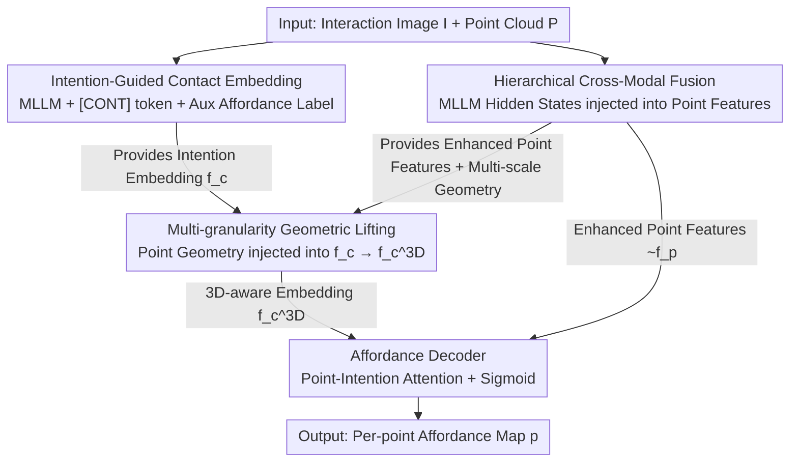

# HAMMER: Harnessing MLLMs via Cross-Modal Integration for Intention-Driven 3D Affordance Grounding

**Conference**: CVPR 2026  
**Paper**: [CVF Open Access](https://openaccess.thecvf.com/content/CVPR2026/html/Yao_HAMMER_Harnessing_MLLMs_via_Cross-Modal_Integration_for_Intention_Driven_3D_Affordance_CVPR_2026_paper.html)  
**Code**: https://rayyoh.github.io/Hammer/ (Project page, code and weights open-sourced)  
**Area**: 3D Vision  
**Keywords**: 3D affordance grounding, intention-driven, Multimodal Large Language Models (MLLM), cross-modal fusion, point cloud

## TL;DR
HAMMER utilizes Multimodal Large Language Models (MLLMs) to compress "intentions" from interaction images into a contact-aware embedding. It then injects MLLM hidden states into point cloud features through hierarchical cross-modal fusion and supplements this embedding with 3D spatial information using multi-granularity geometric lifting. This enables accurate and robust localization of interactive regions on point clouds without relying on intermediate text descriptions or 2D masks.

## Background & Motivation
**Background**: The task of intention-driven 3D affordance grounding involves predicting "which regions can be interacted with in this way" (e.g., grasp, sit, press) given a human-object interaction image and its corresponding object point cloud. This requires the model to possess both visual understanding (semantic and intentional interpretation) and spatial cognition (3D geometric structure understanding).

**Limitations of Prior Work**: Current mainstream approaches fail to fully exploit MLLMs. ① Generative methods (e.g., GREAT) use MLLMs to generate text descriptions of object attributes/interactions, which are then fed into a separate image branch for fusion. This requires manual templates, two-stage training, and treats the MLLM merely as a "text generator," ignoring its inherent 2D reasoning capabilities. ② Rendering methods (e.g., InteractVLM) render point clouds into multi-view 2D images and use off-the-shelf segmenters to predict 2D contact maps for back-projection to 3D. This leads to geometric inconsistency, loss of detail, and error accumulation due to incomplete view coverage.

**Key Challenge**: Interaction images contain critical human intention clues, but target 3D objects vary significantly in shape and scale. The primary difficulty lies in effectively mapping "2D interaction clues from images" onto "3D point cloud representations" without losing geometric information. Intermediate products (text or 2D masks) often serve as sources of error.

**Goal**: To directly (a) extract a clean intention representation from MLLMs, (b) infuse point features with MLLM multimodal knowledge, and (c) provide 2D-derived intention representations with 3D geometric awareness—all without intermediate text or 2D masks.

**Key Insight**: The authors observe that the hidden states of MLLMs inherently "understand" task-relevant content. Rather than outputting explicit text, it is more efficient to use these hidden states as a bridge, bypassing the information loss inherent in generation-reintegration cycles.

**Core Idea**: Aggregate interaction intentions into a contact-aware embedding using a special `[CONT]` token, and use "hierarchical cross-modal fusion + multi-granularity geometric lifting" to align MLLM knowledge and point cloud geometry in 3D space.

## Method

### Overall Architecture
HAMMER takes a point cloud $P \in \mathbb{R}^{N\times 3}$ and a paired interaction image $I$ as input, and outputs a per-point affordance probability map $p=\{p_i\}$ where $p_i\in[0,1]$. The pipeline consists of four feed-forward stages: First, an MLLM encodes the image into a contact-aware intention embedding $f_c$, while simultaneously predicting textual affordance labels as auxiliary supervision. Next, MLLM hidden states are used in two steps to enhance point cloud features. Then, multi-scale point cloud geometry is progressively injected into $f_c$ to obtain a 3D-aware embedding $f_c^{3D}$. Finally, a decoder jointly processes the enhanced point features $\tilde f_p$ and $f_c^{3D}$ to output the affordance map.

### Key Designs

**1. Intention-Guided Contact Embedding: Extracting Intentions via a Single Token**

To address the issue of MLLMs being downgraded to simple text generators, HAMMER directly utilizes MLLM hidden states as intention representations. A special token `[CONT]` is added to the vocabulary to aggregate interaction information. Furthermore, object-centric prompting is designed to include object category priors in the prompt, guiding the model to focus on relevant object semantics and ignore background clutter. After feeding the image-text pair $(I,T)$ into the MLLM $F_\theta$, the hidden state $h_{[CONT]}$ from the last layer is passed through an MLP head $\psi_c$ to obtain the intention embedding $f_c=\psi_c(h_{[CONT]})$. To ensure this embedding captures interaction semantics, the MLLM also performs an auxiliary task of generating textual affordance labels, supervised by a language modeling loss $L_{txt}$.

**2. Hierarchical Cross-Modal Fusion: Two-Step Injection of MLLM Knowledge**

To mitigate the lack of semantic information in raw 3D backbone features, HAMMER projects MLLM hidden states $h$ into $f_h$ and injects them into the point cloud encoder-decoder process in two stages. First (Bottleneck Level): The point cloud encoder produces bottleneck features $f_p^{enc}$, which act as the query for cross-attention with $f_h$ as key/value: $\tilde f_p^{enc}=\text{CrossAttn}(f_p^{enc}, f_h, f_h)$. This allows points to selectively absorb interaction cues. Second (Feature Level): Since the object occupies only a portion of the image, a gating mechanism adaptively weights tokens in $f_h$ to obtain a global descriptor $f_h^g=\sum_m s_m f_{h,m}$. This is concatenated with full-resolution point features to refine semantic understanding.

**3. Multi-granularity Geometric Lifting: Enhancing 2D Intentions with 3D Spatial Awareness**

Since $f_c$ originates from 2D data and lacks the geometric detail for precise 3D localization, the authors lift the embedding itself rather than 2D masks. Multi-scale point features $\{f_p^{(i)}\}$ from the decoder are injected into the embedding tier-by-tier. At each scale $i$, the previous embedding $f_c^{(i-1)}$ acts as a query to attend to point features $f_p^{(i)}$, followed by a residual update: $f_c'^{(i)}=f_c^{(i-1)}+\text{Softmax}\!\big(\tfrac{q^{(i)}(k^{(i)})^\top}{\sqrt d}\big)v^{(i)}$. The final embedding $f_c^{3D}=f_c^{(R)}$ incorporates both global shape and local surface details, becoming "3D-aware."

### Loss & Training
The total loss is a weighted sum of the language modeling loss and affordance loss: $L=\lambda_{txt}L_{txt}+\lambda_{aff}L_{aff}$. The affordance loss follows prior work using focal loss and dice loss: $L_{aff}=L_{focal}+L_{dice}$. Implementation utilizes Qwen2.5-VL as the MLLM and PointNet++ as the 3D backbone. MLLM weights are fine-tuned using LoRA (rank=16). Training is conducted end-to-end with BF16 precision (point backbone uses full precision) on 4x H20 GPUs, with a batch size of 64 and AdamW optimizer.

## Key Experimental Results

### Main Results
Evaluated on PIAD and PIADv2 datasets. Metrics include **aIOU** (average Interaction Over Union), **AUC**, **SIM**, and **MAE**.

Comparison on PIAD (aIOU / AUC, %):

| Method | Seen aIOU↑ | Seen AUC↑ | Unseen aIOU↑ | Unseen AUC↑ |
|------|-----------|-----------|--------------|-------------|
| IAGNet (ICCV 23) | 20.51 | 84.85 | 7.95 | 71.84 |
| GREAT (CVPR 25) | 19.61 | 85.22 | 8.32 | 67.46 |
| GEAL (CVPR 25) | 22.50 | 85.00 | 8.70 | 72.50 |
| **HAMMER (Ours)** | **22.20** | **88.43** | **13.71** | **80.92** |

HAMMER significantly outperforms GREAT in the Unseen partition by 5.39% aIOU and 9.06% AUC, demonstrating superior generalization. In robustness tests against point cloud noise (jitter, dropout, additions), HAMMER consistently outperforms GREAT by large margins (up to 9.31% aIOU).

### Ablation Study
Core Component Ablation (PIAD, aIOU):

| Configuration | Seen aIOU↑ | Unseen aIOU↑ | Description |
|------|-----------|--------------|------|
| HAMMER (Full) | 22.20 | 13.71 | Full model |
| w/o Hierarchical Fusion | 21.15 | 10.50 | -3.21 on Unseen |
| w/o Geometric Lifting | 20.46 | 10.20 | -3.51 on Unseen |
| w/o Both | 19.55 | 7.86 | Baseline backbone |
| w/o $L_{txt}$ | 20.69 | 9.78 | -3.93 on Unseen |

### Key Findings
- Cross-modal and geometric modules are significantly more impactful in **unseen** scenarios, where MLLM semantic priors and recovered 3D geometry are crucial.
- Auxiliary text supervision $L_{txt}$ is vital; removing it drops unseen aIOU by nearly 4 points, confirming its role in grounding interaction info into the embedding.
- Lifting embeddings rather than 2D masks avoids back-projection errors and sensitivity to camera parameters, enhancing robustness against noise.

## Highlights & Insights
- **Hidden State as a Bridge**: Upgrading the MLLM from a text generator to a differentiable multimodal feature source avoids the overhead of manual templates and multi-stage training.
- **`[CONT]` Token + Object-Centric Prompting**: This "bottleneck token + denoising prompt" strategy is effectively transferable to other grounding tasks requiring compact representations from MLLMs.
- **Lifting Embeddings over Masks**: Transforming 3D geometric awareness into a sequential attention update of a vector is more versatile and robust than pixel-level back-projection.

## Limitations & Future Work
- The reliance on a large MLLM (Qwen2.5-VL) with LoRA results in high inference and training costs, potentially limiting real-time robotics applications.
- Gains on the "Unseen Affordance" split are modest (+0.5% aIOU), suggesting difficulty in zero-shot reasoning for entirely novel interaction types.
- Evaluation is limited to single-object point clouds. Performance in complex, multi-object scenarios with heavy occlusion remains a future research direction.

## Related Work & Insights
- **vs GREAT (CVPR 25)**: GREAT relies on text generation and independent image encoders. HAMMER uses internal MLLM hidden states for hierarchical fusion, achieving better generalization and robustness.
- **vs InteractVLM**: InteractVLM is hindered by 2D-to-3D projection errors. HAMMER's geometric lifting of embeddings provides a more consistent internal representation.
- **vs IAGNet**: HAMMER introduces massive world knowledge via MLLM priors, leading to a substantial lead in unseen categories (13.71 vs 7.95 aIOU).

## Rating
- Novelty: ⭐⭐⭐⭐ 
- Experimental Thoroughness: ⭐⭐⭐⭐ 
- Writing Quality: ⭐⭐⭐⭐ 
- Value: ⭐⭐⭐⭐ 

<!-- RELATED:START -->

## Related Papers

- [\[CVPR 2026\] AffordGrasp: Cross-Modal Diffusion for Affordance-Aware Grasp Synthesis](affordgrasp_cross-modal_diffusion_for_affordance-aware_grasp_synthesis.md)
- [\[CVPR 2026\] Affostruction: 3D Affordance Grounding with Generative Reconstruction](affostruction_3d_affordance_grounding_with_generative_reconstruction.md)
- [\[CVPR 2026\] Bidirectional Cross-Modal Prompting for Event-Frame Asymmetric Stereo](bidirectional_cross-modal_prompting_for_event-frame_asymmetric_stereo.md)
- [\[CVPR 2026\] Geometry-Aware Cross-Modal Graph Alignment for Referring Segmentation in 3D Gaussian Splatting](geometry-aware_cross-modal_graph_alignment_for_referring_segmentation_in_3d_gaus.md)
- [\[CVPR 2026\] CMHANet: A Cross-Modal Hybrid Attention Network for Point Cloud Registration](cmhanet_a_cross-modal_hybrid_attention_network_for_point_cloud_registration.md)

<!-- RELATED:END -->
## Related Papers

- [\[CVPR 2026\] AffordGrasp: Cross-Modal Diffusion for Affordance-Aware Grasp Synthesis](affordgrasp_cross-modal_diffusion_for_affordance-aware_grasp_synthesis.md)
- [\[CVPR 2026\] Affostruction: 3D Affordance Grounding with Generative Reconstruction](affostruction_3d_affordance_grounding_with_generative_reconstruction.md)
- [\[CVPR 2026\] S$^2$-MLLM: Boosting Spatial Reasoning Capability of MLLMs for 3D Visual Grounding with Structural Guidance](s2-mllm_boosting_spatial_reasoning_capability_of_mllms_for_3d_visual_grounding_w.md)
- [\[CVPR 2025\] GREAT: Geometry-Intention Collaborative Inference for Open-Vocabulary 3D Object Affordance Grounding](../../CVPR2025/3d_vision/great_geometry-intention_collaborative_inference_for_open-vocabulary_3d_object_a.md)
- [\[CVPR 2025\] Grounding 3D Object Affordance with Language Instructions, Visual Observations and Interactions](../../CVPR2025/3d_vision/grounding_3d_object_affordance_with_language_instructions_visual_observations_an.md)

<!-- RELATED:END -->
