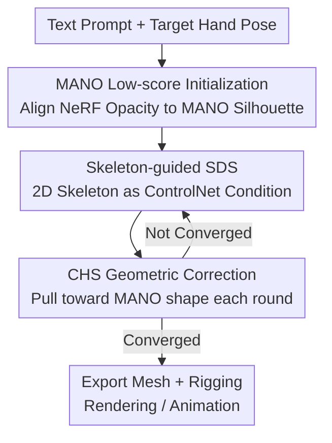

# HandDreamer: Zero-Shot Text to 3D Hand Model Generation using Corrective Hand Shape Guidance

**Conference**: CVPR 2026  
**Paper**: [CVF Open Access](https://openaccess.thecvf.com/content/CVPR2026/html/Rosh_HandDreamer_Zero-Shot_Text_to_3D_Hand_Model_Generation_using_Corrective_CVPR_2026_paper.html)  
**Code**: None (Not provided in the paper)  
**Area**: 3D Vision / Diffusion Models  
**Keywords**: Text-to-3D Hand Generation, Score Distillation Sampling, MANO Prior, ControlNet Skeleton Guidance, View Consistency

## TL;DR
HandDreamer is the first zero-shot "Text-to-3D Hand Model" method. It utilizes MANO hand models for low-score initialization, employs 2D hand skeletons as ControlNet conditions to compress the number of modes in the probability distribution, and introduces a corrective hand shape (CHS) loss to rectify geometry throughout the SDS process. This enables the generation of view-consistent, highly detailed, and animatable 3D hands without introducing Janus multi-face artifacts.

## Background & Motivation
**Background**: Virtual reality and gaming require customizable 3D hand assets, but traditional methods relying on multi-view capture with hundreds of cameras and artist modeling are expensive and slow. In text-to-3D research, Score Distillation Sampling (SDS) proposed by DreamFusion uses pretrained 2D diffusion models to distill a 3D representation (NeRF / Gaussian Splatting), making "generating a 3D object from a single prompt" possible.

**Limitations of Prior Work**: General SDS methods fail significantly when applied to hands. Text-to-3D methods (ProlificDreamer, ESD, CFD) exhibit "Janus artifacts"—fingers growing in incorrect positions or incorrect finger counts. Text-to-human methods (DreamWaltz, HumanNorm, DreamAvatar) incorporate human priors but provide minimal detail in the hand regions. Single-image-based methods (OHTA) fail to generalize to fictional hands and often produce "painted-on" textures.

**Key Challenge**: The authors identify the root cause as view-inconsistency. Previous work (ESD) attributed Janus artifacts to "mode collapse"—where all views collapse into the same mode of $p_\phi(z_0|y')$ (where $y'=y+y_v$ and $y_v\in\{$front, back, side…$\}$ are view-dependent prompts). However, this paper argues that **avoiding mode collapse does not solve the problem**. The real issue is that the probability distribution $p_\phi(z_t|y')$ itself contains **a large number of possible modes** due to variations in camera poses and hand joint placements. SDS optimization does not guarantee that every view converges to the "correct" mode. At low-noise timesteps $t_{low}$, initial latents are out-of-distribution, making scores unreliable, necessitating gradient estimation at high-noise $t_{high}$. However, because noise addition is stochastic, adjacent views are pushed toward different modes, leading to view inconsistency. The high degrees of freedom in hand joints cause an explosion in the number of modes, making this problem particularly severe; side views also suffer from heavy finger self-occlusion, further introducing geometric degradation.

**Core Idea**: Rather than forcing mode correction during optimization, the objective is to **reduce the difficulty by refining initialization and conditioning**: (1) Use the MANO hand model for "low-score initialization" so the initial 3D model is semantically and geometrically close to the correct view-consistent mode; (2) Provide the diffusion model with a 2D hand skeleton condition that encodes both view and hand pose to compress the number of possible modes; (3) Apply a CHS loss throughout the SDS process to continuously pull the geometry toward a reasonable hand shape, specifically addressing side-view distortions.

## Method

### Overall Architecture
HandDreamer adopts NeRF as the 3D representation, with a pipeline consisting of two sequential stages. **Stage 1 (Hand Shape Initialization)**: Uses the MANO mesh at the target hand pose as a geometric prior, minimizing the error between rendered NeRF opacity maps and MANO silhouette masks to give the NeRF volume density a starting point that "already resembles a hand"—this step is prompt-independent and can be reused. **Stage 2 (CHS-Guided Model Generation)**: Performs skeleton-guided SDS on the initialized NeRF. In each iteration, an image is rendered and noise is added according to an annealing schedule to obtain $I_t$. Simultaneously, a 2D hand skeleton $S$ is extracted from the MANO mesh for the current view. $(I_t, y, S)$ are fed into a frozen ControlNet to estimate noise, passing SDS gradients back to update the NeRF. Concurrently, the CHS loss "corrects" the NeRF opacity toward the MANO silhouette in every round to prevent geometric drift. The final result is a mesh with approximately 300,000 vertices that can be rigged for animation.

This is a multi-stage pipeline of "initialization followed by conditional guided generation + geometric correction." The following diagram illustrates the three key designs:

### Key Designs

**1. MANO Low-score Initialization: Placing the starting point near the "correct mode"**

To address the root cause where random/high-score initialization causes adjacent views to converge to different modes, the authors provide a theoretical characterization. Let $x^v_{latent}$ and $x^v_{init}$ be the rendered images of the ideal 3D model and the initial 3D model at view $v$, respectively. The expected absolute score of the initial model relative to the ideal model is

$$|S_\phi| = \mathbb{E}_v\left[-\frac{\sqrt{\bar\alpha_t}}{1-\bar\alpha_t}\big(E(x^v_{init})-E(x^v_{latent})\big) + \frac{\sqrt{1-\bar\alpha_t}}{\sqrt{\bar\alpha_t}}\,\epsilon\right]$$

where $E(\cdot)$ is the Stable Diffusion encoder and $\bar\alpha_t$ is the forward noise parameter ($\bar\alpha_t\to0$ as $t$ increases). Since $\epsilon\sim\mathcal N(0,I)$, the second term approaches zero with enough samples. Achieving "low-score initialization" requires either increasing $t$ or making $|z^v_{init}-z^v_{latent}|$ very small across all views. However, increasing $t$ also makes the score small for **other incorrect modes** ($|S_\phi|$ becomes independent of the ideal mode as $\bar\alpha_t\to0$), which invites view inconsistency. The correct solution is the latter: **making the initial model semantically/geometrically close to the view-consistent ground truth**. The authors initialize the NeRF volume density using the MANO mesh, which is much closer to the correct mode than standard spherical initialization, ensuring gradients for the same view remain consistent at both low and high noise timesteps (Fig.2 c/d in the paper).

**2. Skeleton-guided ControlNet SDS: Compressing the mode space of the probability distribution**

Even with correct initialization, the distribution $p_\phi(z_t|y')$ described by the prompt still contains too many modes due to joint variations. This method adds a condition that **simultaneously encodes view and hand pose**: by projecting the 3D hand skeleton to view $v$ to obtain a 2D skeleton map $S$, the authors demonstrate that this single image can encapsulate both view and pose information, effectively compressing the modes of $p_\phi(z|y')$. This is implemented using a ControlNet trained with hand skeletons as control signals, combined with square-root timestep annealing to gradually reduce sampling noise during optimization. The SDS gradient thus becomes skeleton-conditioned:

$$\nabla_\theta \mathcal L_{SDS} = \mathbb{E}_{t,\epsilon}\left[w(t)\big(\epsilon_\phi(I_t; y, t, S) - \epsilon\big)\frac{\partial I}{\partial\theta}\right]$$

Compared to original SDS (which lacks $S$), this term fixes the direction of convergence toward a specific hand shape and view, preventing adjacent views from being pushed toward different modes by random noise.

**3. Corrective Hand Shape (CHS) loss: Continuous geometric correction during SDS to fix side-view distortions**

While the first two steps restore view consistency, the authors observed geometric distortions in late-stage optimization—especially in side views where heavy finger self-occlusion leads to inconsistent thickness or disconnected segments. The CHS loss addresses this by **performing shape correction in every SDS iteration rather than just at initialization**: it minimizes the L2 distance between NeRF opacity $O_v$ and the MANO silhouette mask $M_v$, ensuring no view deviates too far from a reasonable hand shape:

$$\mathcal L_{chs}(t) = \frac{\lambda^{chs}_t}{|V|}\sum_{v\in V}\lVert O_v - M_v\rVert^2$$

A key refinement is annealing the weight $\lambda^{chs}_t$ based on the timestep—since SDS tends to update geometry at high noise $t$ and texture at low noise $t$, the CHS weight is increased at higher noise levels:

$$\lambda_t = \lambda^{chs}_{max}\frac{t-t_{min}}{t_{max}-t_{min}} + \lambda^{chs}_{min}\frac{t_{max}-t}{t_{max}-t_{min}}$$

The paper uses $\lambda_{max}=15000, \lambda_{min}=1000, t_{max}=600, t_{min}=300$. NeRF opacity is calculated via volume rendering accumulation $O_{v,p}=\sum_{i=1}^{T}\big(\prod_{j=1}^{i-1}e^{-\sigma_j\delta_j}\big)(1-e^{-\sigma_i\delta_i})$, then min-max normalized to 0/1. The final total loss is $L = \lambda_{sds}L_{sds} + \lambda^{chs}_t L_{chs}(t) + \lambda_{img}L_{img} + \lambda_{zvar}L_{zvar}$, where $L_{img}$ and $L_{zvar}$ follow existing work to stabilize training and sharpen surfaces, with $\lambda_{sds},\lambda_{img},\lambda_{zvar}=1,0.01,100$.

### Loss & Training
The two stages converge independently: Hand shape initialization takes approximately 2000 iterations (~15 minutes, one-time use); CHS-guided SDS takes approximately 8000 iterations (~45 minutes), consuming about 30GB of VRAM. NeRF is used for 3D representation, with Stable Diffusion 1.5 + ControlNet 1.1 as the 2D generator, based on the Threestudio framework. Experiments were conducted on a single NVIDIA RTX A6000 (48GB).

## Key Experimental Results

### Main Results
The test set consists of 45 3D models with 5400 images rendered from equidistant views. Metrics include CLIP-L14 (text-image similarity), FID (realism), and HPSv2 (human preference).

| Method | CLIP-L14 ↑ | FID ↓ | HPSv2 ↑ |
|------|-----------|-------|---------|
| DreamFusion'22 | 25.12 | 344.19 | 0.187 |
| LatentNerf'23 | 24.34 | 316.42 | 0.189 |
| DreamWaltz'23 | 23.96 | 265.11 | 0.222 |
| HumanNorm'24 | 23.01 | 327.42 | 0.177 |
| OHTA'24 | 22.59 | 467.51 | 0.181 |
| CFD'25 | 26.62 | 262.83 | 0.223 |
| **Ours** | **28.63** | **254.62** | **0.241** |

Ours leads across all metrics: compared to the previous best (CFD'25), CLIP improves by +2.01, FID decreases by -8.21, and HPSv2 increases by +0.018. A blind study with 50 volunteers (ages 21–35) ranking 8 methods across 30 prompts (geometry/texture/consistency, 1–8 scale) showed HandDreamer achieved the highest average scores in all categories.

### Ablation Study
Gradual inclusion of the three components (Skeleton-CN = Hand Skeleton ControlNet, MANO Init = MANO Initialization, CHS = Corrective Loss), CLIP-L14:

| Skeleton-CN | MANO Init | CHS | CLIP-L14 ↑ | Description |
|:---:|:---:|:---:|:---:|------|
| ✗ | ✗ | ✗ | 26.40 | Baseline: Severe Janus + geometric distortion; often fails to generate a hand |
| ✓ | ✗ | ✗ | 26.67 | Skeleton only: Has hand shape but incorrect finger counts/geometry |
| ✓ | ✓ | ✗ | 28.48 | With MANO Init: Fidelity rises, but side views suffer from disconnected segments |
| ✗ | ✓ | ✓ | 27.07 | Lacks skeleton conditioning |
| ✓ | ✗ | ✓ | 28.02 | Lacks MANO initialization |
| ✓ | ✓ | ✓ | **28.63** | Full model performs best |

### Key Findings
- **The three components are indispensable and complementary**: The skeleton ControlNet is responsible for "growing the hand shape," MANO initialization ensures "fidelity and convergence to the correct mode," and CHS "recursively salvages geometric distortions caused by side-view occlusion." Based on the ablation, MANO initialization provides the largest marginal gain to CLIP (26.67→28.48, +1.81).
- **The value of CHS is qualitatively critical despite smaller quantitative gains (28.48 → 28.63)**: It specifically resolves disconnected joints and thickness inconsistencies in side views. These geometric issues are not always fully reflected in global CLIP scores; visual inspection (Fig. 9) is necessary. ⚠️ Note: Small numerical gains may understate the visual impact of CHS.
- **Geometric priors are vital for overall output quality**: Removing either the skeleton condition (27.07) or MANO initialization (28.02) yields results significantly inferior to the full model (28.63), proving both priors are irreplaceable.

## Highlights & Insights
- **Repositioned the root cause of Janus artifacts**: The problem is reframed from "mode collapse" to "excessive distribution modes + high-score initialization causing divergence in adjacent views." Theoretical characterization of expected scores explains why "low-score initialization" works—an analysis more robust than simple heuristic tricks.
- **Single 2D hand skeleton for dual encoding**: Using a ControlNet condition to fix both view and pose simultaneously is a lightweight and effective design. This could be transferrable to other high-articulation objects (feet, full bodies, animal limbs).
- **Timestep-annealed CHS weights**: Integrating the heuristic that "high noise modifies geometry, low noise modifies texture" into the loss weights ensures geometric correction is active only when needed, preventing high MANO constraints from flattening texture details.
- **Reusable Initialization**: Hand shape initialization is decoupled from the prompt and only needs to be run once. This reduces costs when generating many different appearances for the same hand pose.

## Limitations & Future Work
- The authors acknowledge that as an SDS-based method, it inherits biases from the pretrained diffusion model. Furthermore, current animation requires exporting a mesh and rigging rather than being end-to-end; future work aims for automated articulation.
- Reliance on MANO parameterization means hand poses must be specified beforehand. Methods might be limited for hand structures outside the MANO space (e.g., fictional hands with extra fingers or extreme deformations). ⚠️ Failure rates for non-realistic hand structures were not reported.
- The SDS optimization (45 mins, 30GB VRAM per prompt) remains heavy, far from real-time or interactive generation. The evaluation set of 45 models is relatively small.

## Related Work & Insights
- **vs. ESD / General Text-to-3D SDS (ProlificDreamer, CFD)**: These rely on joint-view or multi-view constraints to suppress inconsistency, but this paper notes these are insufficient for high-articulation objects, resulting in finger intersections or incorrect counts (CFD generates wrong numbers of fingers). HandDreamer succeeds by reducing mode counts through initialization and skeleton conditioning.
- **vs. Text-to-Human (DreamWaltz, HumanNorm, DreamAvatar)**: These use SMPL/SMPL-X priors but lack hand detail. HandDreamer specializes in hands using MANO priors to achieve high detail and view consistency.
- **vs. Single-image Hand Generation (OHTA)**: OHTA retrieves textures from a learned database, failing to generalize to fictional hands, often resulting in "flat" appearances. Ours is zero-shot and purely text-driven, offering better texture diversity and geometric richness (FID 254.62 vs. OHTA 467.51).

## Rating
- Novelty: ⭐⭐⭐⭐⭐ First zero-shot text-to-3D hand generation; provides a new theoretical analysis of Janus artifacts.
- Experimental Thoroughness: ⭐⭐⭐⭐ Comparison across three metrics + user study + complete ablation; however, the test set is small and lacks failure case statistics.
- Writing Quality: ⭐⭐⭐⭐⭐ Clear logic from root cause analysis to design; effective use of formulas and diagrams.
- Value: ⭐⭐⭐⭐ Practical for VR/game hand asset generation with reusable initialization, though optimization costs are high and it is dependent on MANO.

<!-- RELATED:START -->

## Related Papers

- [\[CVPR 2026\] GaussianGrow: Geometry-aware Gaussian Growing from 3D Point Clouds with Text Guidance](gaussiangrow_geometry-aware_gaussian_growing_from_3d_point_clouds_with_text_guid.md)
- [\[CVPR 2026\] Clay-to-Stone: Phase-wise 3D Gaussian Splatting for Monocular Articulated Hand-Object Manipulation Modeling](clay-to-stone_phase-wise_3d_gaussian_splatting_for_monocular_articulated_hand-ob.md)
- [\[CVPR 2026\] LaS-Comp: Zero-shot 3D Completion with Latent-Spatial Consistency](las-comp_zero-shot_3d_completion_with_latent-spatial_consistency.md)
- [\[CVPR 2026\] Learning Hierarchical Hyperbolic Mixture Model for Part-aware 3D Generation](learning_hierarchical_hyperbolic_mixture_model_for_part-aware_3d_generation.md)
- [\[CVPR 2026\] ForeHOI: Feed-forward 3D Object Reconstruction from Daily Hand-Object Interaction Videos](forehoi_feed-forward_3d_object_reconstruction_from_daily_hand-object_interaction.md)

<!-- RELATED:END -->
