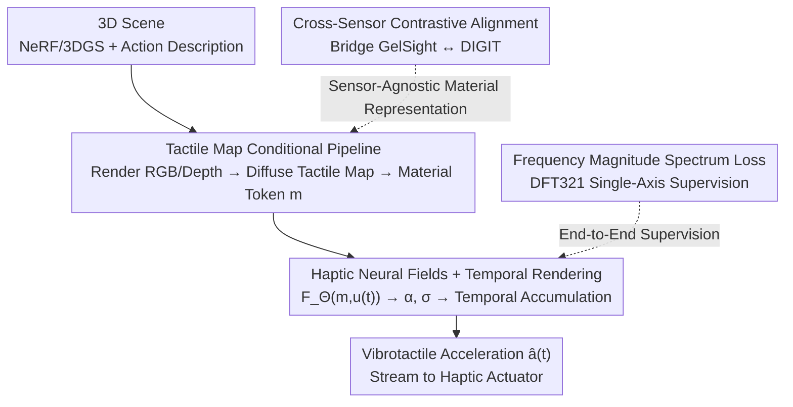

# Haptic Neural Fields: Bringing Tactile Interactions to 3D Rendered Scenes

**Conference**: CVPR 2026  
**Paper**: [CVF Open Access](https://openaccess.thecvf.com/content/CVPR2026/html/Stefani_Haptic_Neural_Fields_Bringing_Tactile_Interactions_to_3D_Rendered_Scenes_CVPR_2026_paper.html)  
**Code**: Project page (mentioned in paper, no explicit GitHub link provided, ⚠️ subject to the original text)  
**Area**: 3D Vision  
**Keywords**: Haptic Neural Fields, Vibrotactile Synthesis, Temporal Volume Rendering, Cross-sensor Contrastive Learning, NeRF/3DGS Interaction

## TL;DR
This paper proposes Haptic Neural Fields (HNF), upgrading NeRF/3DGS-reconstructed 3D scenes from "visual-only" to "tactilely interactive". Given a contact trajectory and normal force, the model borrows from NeRF volume rendering but shifts the accumulation from the spatial to the temporal domain, synthesizing the vibrotactile acceleration signals that a fingertip accelerometer would realistically measure. Additionally, a cross-sensor contrastive space is leveraged to bridge two distinct types of tactile sensors, GelSight and DIGIT.

## Background & Motivation

**Background**: Neural field methods such as NeRF and 3DGS have enabled photo-realistic 3D reconstruction of real-world scenes. Prior works have also incorporated action-conditioned visual dynamics (e.g., opening a microwave, using scissors), allowing pixels and geometry to change with interaction. However, these advancements are almost exclusively restricted to the **visual modality**; while the scenes look realistic, they lack any information regarding "how they feel to the touch."

**Limitations of Prior Work**: Early attempts to make scenes touchable either register sparse tactile measurements into radiance fields to query tactile sensations at specific locations (e.g., Touch-GS, tactile NeRF), or use haptic maps to encode spatial material properties (e.g., roughness, stiffness). However, these are **static descriptors**: they state "what material is here" but fail to provide the **time-varying vibration signals** (vibrotactile signals) elicited by a specific contact trajectory and applied force. Yet, realistic touch sensations are dominated by such time-varying transients; the stick-slip phenomena and micro-collisions felt by the fingertip during rubbing, sliding, or pressing are the actual sources of feedback.

**Key Challenge**: Tactile response is inherently **action-conditioned**. Rubbing the same material along different directions, at different speeds, or with different normal forces produces entirely distinct vibration spectra (anisotropy). Treating "tactile feeling" as an intrinsic static label of a material is fundamentally a modeling error; instead, it must be designed as a function of the action $u(t)$ and the local context.

**Goal**: To endow 3D scene reconstructions with tactile perception capabilities: given a user-specified contact trajectory $p(t)$ and normal force $F_z(t)$, predict the tactile acceleration signal $a(t)$ experienced by a human finger (or tool) at runtime.

**Key Insight**: The authors observe that NeRF's volume rendering is fundamentally "transmittance-weighted accumulation of emitted values along a ray." Since tactile signals are similarly based on "the current sensation depending on the accumulation of past states," this accumulation rule can be shifted from the **spatial dimension to the temporal dimension**. This serves as a key observation for transferring mature neural field mechanisms to tactile synthesis.

**Core Idea**: To use a conditional haptic neural field $F_\Theta(m, u(t))$, conditioned on scene-derived material tokens $m$ and instantaneous actions $u(t)$, to output local emitted acceleration and tactile density. Then, "temporal transmittance accumulation" is applied to synthesize vibrotactile signals. Concurrently, cross-sensor contrastive learning is employed to align different tactile sensor formats, enabling the method to transfer across scenes and sensors.

## Method

### Overall Architecture

HNF addresses an end-to-end "see $\to$ act $\to$ feel" pipeline: the input is a reconstructed 3D scene (NeRF/3DGS) along with a user-specified contact action, and the output is the vibrotactile acceleration signal $\hat{a}(t)$ that a fingertip accelerometer would measure during this contact.

The entire pipeline is divided into three stages. **Stage 1** renders the RGB view $x$ and depth map $x_d$ from the scene given camera poses $(R,T)$, then translates them into a co-registered tactile map $I = D_\phi(x, x_d)$ using a conditional diffusion model $D_\phi$. The tactile map encodes local material texture and 3D geometry into a 2D representation. **Stage 2** encodes the tactile map into a material token $m = E(I)$, while encoding the user's semantic action (e.g., "scraping from left to right") into action vectors. The instantaneous action is summarized as $u(t) = [d(t), v(t), F_z(t)]$ (direction, velocity, normal force). In **Stage 3**, the core predictor, HNF, synthesizes the acceleration trajectory $a(t)$ conditioned on $(m, u(t))$, which can be directly streamed to a haptic actuator for rendering to the user.

Supporting this pipeline are two training-side mechanisms: **cross-sensor contrastive alignment**—since GelSight and DIGIT haptic sensors have different formats, a sensor-agnostic shared space is first learned to bridge the HaTT and TaRF datasets; and **frequency loss on the magnitude spectrum**—supervising the HNF outputs by focusing only on the magnitude spectrum actually perceivable by humans.

### Key Designs

**1. Tactile Map Conditioning Pipeline: Translating "Seeing" into Local Touchable Material Representations**

To make any NeRF/3DGS scene touchable, the first step is to answer: "What is the material of this contact point, and what is its geometry?" The authors reuse a conditional diffusion model $D_\phi$ to predict a co-registered tactile map $I = D_\phi(x, x_d)$ from the rendered RGB view $x$ and depth map $x_d$. This is then compressed into a material token $m = E(I)$ using an encoder $E(\cdot)$ (pre-trained AlexNet). This token carries both material texture and local 3D geometry, acting as the "material condition" for downstream haptic synthesis. On the action side, the user's semantic instructions ("scrape", "rub") and geometric parameters are encoded into an instantaneous action vector $u(t) = [d(t), v(t), F_z(t)]$, where $d(t) = \dot{p}(t)/\|\dot{p}(t)\|$ is the in-plane unit direction, $v(t) = \|\dot{p}(t)\|$ is the velocity, and $F_z(t)$ is the normal force magnitude. The authors assume that, at the contact scale, the texture $I$ is approximately spatially uniform along the path segment (and can be updated along $p(t)$ if necessary). Thus, the time-varying nature of the signal on the same material originates solely from the action $u(t)$—which is the prerequisite for shifting the accumulation to the temporal dimension.

**2. Haptic Neural Field + Temporal Rendering: Shifting NeRF's Volume Rendering from Space to Time**

This is the core innovation of the paper. HNF defines a neural field $F_\Theta(m, u(t)) \mapsto (\alpha(t), \sigma(t))$, implemented using an $L$-layer MLP with hidden dimension $H$ and ReLU activations. Intuitively, $\alpha(t)$ represents the **short-term emitted contribution** of the current interaction state to the perceived acceleration, while $\sigma(t) \in \mathbb{R}_{\geq 0}$ is the **tactile density**, controlling how much of this contribution is "let through" when synthesized with neighboring states.

The key lies in the accumulation method: while NeRF integrates emitted radiance over **space** along a camera ray, HNF accumulates over **time**. The motivation is that the currently felt acceleration depends not only on the current action state but also on several past states. For each output sample $i$ (at time $t_i$), a causal temporal neighborhood with step size $\Delta t$ and length $N$ is taken (implemented by adding an independent linear head to the MLP to project an $N$-dimensional vector, with a SoftPlus activation on the density head to ensure non-negativity). After evaluating $\{\alpha_{i,n}, \sigma_{i,n}\}$, temporal rendering is performed:

$$T_{i,n} = \exp\!\Big(-\sum_{j<n}\sigma_{i,j}\,\Delta t\Big), \qquad w_{i,n} = T_{i,n}\big(1 - \exp(-\sigma_{i,n}\,\Delta t)\big)$$

The predicted acceleration is a discrete weighted sum $\hat{a}(t_i) = \sum_{n=1}^{N} w_{i,n}\,\alpha_{i,n}$. This is completely isomorphic to NeRF's volume rendering synthesis—merely substituting "distance" with "time", yielding a continuous, differentiable renderer with built-in short-term memory dynamics. Because the condition includes the complete action $u(t)$, HNF learns an **anisotropic** mapping: rubbing the same material in different directions yields different spectra (see Fig. 5 in the paper), whereas prior methods are direction-insensitive.

**3. Frequency Magnitude Spectrum Loss + DFT321: Supervising Only What Humans Actually Perceive**

Humans are largely insensitive to the **phase** of high-frequency texture vibrations; instead, the **magnitude spectrum** dominates perception. Based on this perceptual evidence, the authors avoid point-to-point regression in the time domain. Instead, they slice the contact trajectory into $C$ short segments $\{S_c\}$ and compute the $K$ positive-frequency magnitudes under a Hann window for each segment, supervising the difference between the predicted and ground-truth spectra:

$$\mathcal{L}_{\text{mag}} = \frac{1}{C\,K}\sum_{c=1}^{C}\sum_{k=1}^{K}\Big(\big|\mathrm{DFT}_K(\hat{a}_c)\big|_k - \big|\mathrm{DFT}_K(a_c)\big|_k\Big)^2$$

Another detail is that tactile stimuli are not solely determined by $z$-axis acceleration but by the combined contribution of all three axes ($x, y, z$): the $z$-component mainly encodes surface roughness, while the $x, y$-components convey friction-related information (from the $xy$-plane contact trajectory $p(t)$ and the $z$-plane normal force $F_z$). Following a common practice in the haptic domain, the authors use **DFT321** to fuse the spectra of the three-axis signals into a single representative signal, carrying the full tactile stimulus before applying supervision. This fits human perception while avoiding spurious penalties caused by phase shifts.

**4. Cross-Sensor Contrastive Alignment: Bridging GelSight and DIGIT via a Contrastive Space**

The practical dilemma is that no single dataset simultaneously provides RGB/depth, multi-sensor tactile maps, temporal acceleration, force/torque, and dense action trajectories. The authors must "stitch" multiple datasets together. However, the tactile map formats of GelSight (material-centric, usually isolated from global geometry) and DIGIT (scene-centric, sparse but co-registered with reconstructed surfaces) differ drastically in elastomer/lighting, color coding, resolution, and field of view. Directly blending them is hindered by this format gap.

The solution is to learn a **sensor-agnostic shared latent space**. Given visual and tactile samples, matching and non-matching pairs are constructed. Two ResNet-50 encoders are used to map them to $\ell_2$-normalized embeddings (where the dot product is the cosine similarity) and trained with a symmetric contrastive objective (CMC). The InfoNCE loss for the vision $\to$ haptic direction is:

$$\mathcal{L}^{\mathrm{contrast}}_{X_I \to X_T} = -\log\frac{\exp\!\big(z_I^i \cdot z_T^i/\tau\big)}{\sum_{j=1}^{K}\exp\!\big(z_I^i \cdot z_T^j/\tau\big)}$$

where the temperature is $\tau = 0.07$. The reverse loss $\mathcal{L}^{\mathrm{contrast}}_{X_T \to X_I}$ is symmetrically defined, and the total loss is the sum of both. The authors extend this pairing strategy from single-sensor to **cross-sensor tuples**—GelSight-RGB (from HaTT) and DIGIT-RGB (from TaRF). This objective simultaneously encourages: (i) vision-tactile alignment within each sensor, and (ii) sensor-agnostic material clustering between GelSight and DIGIT. For downstream material classification, the encoders are frozen, and only a linear probe is trained. This aligned space successfully serves as a bridge to expand GelSight tuples from HaTT into RGB+GelSight+DIGIT triplets (associating DIGIT patches via nearest neighbors in the shared feature space), enabling HNF to synthesize tactile signals cross-sensors in 3D scenes.

### Loss & Training

HNF is trained end-to-end using the frequency magnitude spectrum loss $\mathcal{L}_{\text{mag}}$ (Eq. 4), trained per-material (analogous to per-scene NeRF) and evaluated on average across all materials. Contrastive alignment uses symmetric InfoNCE (Eq. 5, 6). Implementation details: a pre-trained AlexNet is used as the encoder, temporal neighborhood $N=5$, segment count $C=200$ (window length of 1000 samples), 1 kHz low-pass filter; DFT produces $K=500$ frequency bins, keeping the first $K=100$ positive frequencies; MLP has $L=4$ layers and $H=1024$ hidden units. Training is conducted on a single RTX 4090 for 100 epochs using Adam, with a learning rate of $1\text{e}{-}2$ and cosine annealing. Data is partitioned into train/val/test splits of 8/1/1 based on every 10 consecutive windows.

## Key Experimental Results

Evaluation is conducted on three complementary datasets: **HaTT** (with GelSight extension, 100 materials, haptic pen recording 6DoF force/torque + acceleration + pose, 10 kHz), **TaRF** (13 everyday 3D scenes, DIGIT sensor, 19.3k RGB-tactile co-registered pairs), and **Touch-and-Go (TnG)** (approx. 13.9k GelSight-RGB video tuples, approx. 4000 wild materials). Two tasks are evaluated: (I) cross-domain material classification, and (II) action-conditioned vibrotactile signal generation. Signal generation metrics consist of ST-SIM ($\uparrow$, perceptual quality 0–1), LSD ($\downarrow$, log-spectral distance), and MSE ($\downarrow$, point-wise deviation of positive frequency magnitude spectrum).

### Main Results: Material Classification (Frozen Encoders + Linear Probe)

| Modality Head | Method | Training Set | TnG Acc↑ | HaTT Acc↑ |
|---|---|---|---|---|
| – | Chance | – | 18.60 | 11.08 |
| Vision | TaRF | TnG | 54.70 | – |
| Vision | TaRF | TnG+TaRF | 57.60 | – |
| Vision | Ours | TnG+TaRF+HaTT | **76.16** | 68.75 |
| Vision | Ours | TnG(Balanced)+TaRF+HaTT | 75.47 | **97.19** |
| Haptic | GACM | HaTT(GelSight) | – | 77.29 |
| Haptic | Ours | TnG+TaRF+HaTT | 55.40 | 92.13 |
| Haptic | Ours | TnG(Balanced)+TaRF+HaTT | 67.73 | 96.44 |

Mixed-domain contrastive training improves the haptic head performance on HaTT(GelSight) from GACM's 77.29% to 92.13%, and the vision head evaluation on TnG/TaRF from 57.60% to 76.16%. Crucially, the **gain holds across sensors** (obtained by training on GelSight+DIGIT combined and testing on either sensor), indicating that the learned space is indeed sensor-agnostic and serves as an effective bridge for haptic synthesis.

### Main Results: Action-Conditioned Signal Generation (Cross-Sensor)

| Method | GelSight ST-SIM↑ | GelSight LSD↓ | GelSight MSE↓ | DIGIT ST-SIM↑ | DIGIT LSD↓ | DIGIT MSE↓ |
|------|------|------|------|------|------|------|
| GACM | 0.85 | **0.80** | 6557.32 | – | – | – |
| HNF | 0.85 | 0.88 | **3443.15** | 0.86 | 0.89 | 4166.64 |
| HNF+ | – | – | – | **0.88** | 0.89 | **3764.00** |

For GelSight, HNF matches GACM in perceptual similarity (ST-SIM 0.85 vs 0.85), is slightly worse in spectral distortion (LSD 0.88 vs 0.80), but decreases MSE from 6557.32 to 3443.15 (an ~47% reduction). This indicates a tighter fit to the ground-truth magnitude spectrum with less oversmoothing. On DIGIT, where GACM is not directly comparable, HNF achieves an ST-SIM of 0.86 and LSD of 0.89. The MSE is solid despite the higher variability of DIGIT training images rendered from 3D scenes, suggesting the model successfully captures structural haptic information.

### Ablation Study: Action Augmentation (HNF → HNF+)

| Configuration | DIGIT ST-SIM↑ | DIGIT MSE↓ | Description |
|------|------|------|------|
| HNF | 0.86 | 4166.64 | Original HaTT circular strokes only |
| HNF+ | 0.88 | 3764.00 | Training with 8 additional classes of synthetic action samples |

HaTT primarily consists of unconstrained circular strokes, leading to insufficient coverage of direction/force-velocity effects. The authors augment the action set with 8 human-interpretable action primitives: left $\to$ right scrape (soft/hard), top $\to$ bottom scrape (soft/hard), diagonal scrape (soft/hard), and random rub (slow/fast), each defined by a 2D tangent plane path and normal force profile executed on the surface tangent frame. HNF+ increases the DIGIT ST-SIM from 0.86 to 0.88 and decreases MSE from 4166.64 to 3764.00, demonstrating that the synthetic samples are plausible and benefit generalization to unseen trajectories.

### Key Findings
- **Cross-sensor co-training is the primary source of classification improvement**: Comparing GACM's 77.29% to Ours' 92.13%, the performance gain mainly stems from pulling GelSight and DIGIT into the same contrastive space, rather than using a larger model.
- **The true advantage of HNF lies in anisotropy**: Figure 5 in the paper shows that for the same material, two strokes in different directions produce direction-specific spectra with HNF (redistributed energy, revealing anisotropy), whereas GACM yields nearly identical low-pass spectra for both directions—highlighting the fundamental difference of action-conditioned modeling over static descriptors.
- **LSD on GelSight being slightly worse than GACM is a distortion-perception trade-off**: While HNF excels in MSE and perceptual structure, it suffers slightly in log-spectral distance (LSD). Thus, performance should be evaluated across multiple metrics rather than focusing on a single one.

## Highlights & Insights
- **Shifting volume rendering from space to time** is the most elegant design choice. NeRF's transmittance accumulation was originally designed for "geometric occlusion along a ray". The authors found that "temporal haptic memory accumulation" is mathematically isomorphic, enabling them to reuse a differentiable, continuous renderer with short-term memory almost for free. This paradigm of "reusing mature mechanisms by changing coordinate axes" can be widely applied to any sequence synthesis task where current perception depends on historical states.
- **Supervising only the magnitude spectrum** respects human perceptual priors. Instead of forcefully fitting phase in the time-domain (which humans cannot perceive), the authors combine DFT321 to fuse three axes and supervise via the frequency magnitude loss, focusing model capacity where it highly affects tactile feel.
- **The cross-sensor contrastive space** converts a practical engineering bottleneck (lack of a unified dataset) into a representation learning problem. Standardizing GelSight and DIGIT using contrastive alignment is a bridging mechanism that serves as a highly valuable reference for handling multi-sensor, multi-format embodied perception data.

## Limitations & Future Work
- The authors acknowledge that progress is **constrained by data limitations**: no single dataset simultaneously provides RGB/depth, multi-sensor tactile maps, temporal acceleration, force/torque, and dense action trajectories. Relying on contrastive matching to stitch datasets restricts action diversity and coverage.
- **Evaluation is limited**: Conducting large-scale user studies in VR headsets is difficult (due to co-localization, latency, and actuator hardware limits). Thus, they rely on objective signal metrics and classification proxies instead of direct human perceptual verification.
- **Self-identified limitations**: HNF trains per-material (similar to per-scene NeRF), which creates training and storage bottlenecks when scaling up to massive scenes and raises generalization concerns. The assumption that texture is "spatially uniform at contact scales" might fail on highly non-uniform surfaces.
- **Future directions**: Expanding the action vocabulary and multi-axis sensing; conducting controlled VR user studies to quantify perceptual realism and task utility.

## Related Work & Insights
- **vs GACM (Action-conditioned tactile synthesis baseline)**: GACM uses AlexNet+linear layers for material classification and an MLP for acceleration synthesis, but its direction sensitivity remains weak (producing similar signals for different exploration pathways on the same material). HNF explicitly conditions on direction, speed, and force using a temporal neural field, yielding direction-specific anisotropic spectra and reducing MSE by ~47% on GelSight.
- **vs Haptic Radiance Fields (Touch-GS / tactile NeRF [3,30])**: These methods register sparse tactile measurements to radiance fields to query static touch feeling or tactile maps at specific locations. HNF directly synthesizes time-varying vibration acceleration and explicitly conditions on contact trajectories and normal forces, moving from "static descriptors" to "action-conditioned temporal signals."
- **vs Scene2Hap and other LLM-based haptic systems**: The latter synthesize plausible vibration patterns from object semantics and scene contexts but lack explicit action/force conditioning, making it difficult to reproduce real transients. HNF directly aligns with ground-truth spectra using frequency-domain supervision and action conditioning.

## Rating
- Novelty: ⭐⭐⭐⭐⭐ First to bring action-conditioned tactile synthesis into reconstructed 3D scenes, creatively transferring NeRF's volume rendering to the temporal domain.
- Experimental Thoroughness: ⭐⭐⭐⭐ Solid validation across three datasets, two tasks, and cross-sensor settings, though it lacks user studies based on human perception, and some metrics exhibit trade-offs.
- Writing Quality: ⭐⭐⭐⭐ Clear motivation, thoroughly explained mechanisms, and well-structured formulas/figures; some minor engineering details (project page/code links) remain slightly vague.
- Value: ⭐⭐⭐⭐⭐ Opens up an end-to-end touchable scene pipeline of "see → act → feel" for XR, robotics, and haptic simulation, showing highly pioneering value.

<!-- RELATED:START -->

## Related Papers

- [\[CVPR 2026\] RF4D: Neural Radar Fields for Novel View Synthesis in Outdoor Dynamic Scenes](rf4dneural_radar_fields_for_novel_view_synthesis_in_outdoor_dynamic_scenes.md)
- [\[CVPR 2026\] Evidential Neural Radiance Fields](evidential_neural_radiance_fields.md)
- [\[CVPR 2026\] Bringing Your Portrait to 3D Presence](bringing_your_portrait_to_3d_presence.md)
- [\[CVPR 2026\] InfiniDepth: Arbitrary-Resolution and Fine-Grained Depth Estimation with Neural Implicit Fields](infinidepth_arbitrary-resolution_and_fine-grained_depth_estimation_with_neural_i.md)
- [\[CVPR 2026\] LangField4D: Learning Identity-Adaptive and Spatio-Temporal Continuous 4D Language Fields for Dynamic Scenes](langfield4d_learning_identity-adaptive_and_spatio-temporal_continuous_4d_languag.md)

<!-- RELATED:END -->
