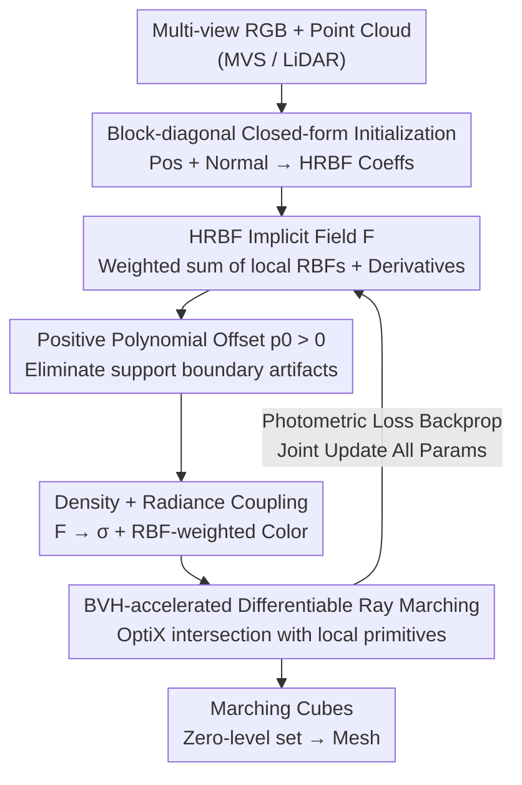

# Hermite Radial Basis Function for Surface Reconstruction via Differentiable Rendering

**Conference**: CVPR 2026  
**Paper**: [CVF Open Access](https://openaccess.thecvf.com/content/CVPR2026/html/Blanc_Hermite_Radial_Basis_Function_for_Surface_Reconstruction_via_Differentiable_Rendering_CVPR_2026_paper.html)  
**Code**: None  
**Area**: 3D Vision  
**Keywords**: Surface Reconstruction, HRBF Implicit Field, Differentiable Rendering, Radial Basis Function, BVH Acceleration  

## TL;DR
Classical Hermite Radial Basis Functions (HRBF) are integrated into a differentiable rendering framework. A global implicit field $F$ is constructed using a set of local RBF basis functions with derivatives. Weights, positions, and scales are optimized end-to-end via multi-view RGB volume rendering. Leveraging BVH-accelerated ray intersection, the method achieves superior Chamfer distances compared to PGSR and Fast Dipole Sums on DTU and BlendedMVS datasets.

## Background & Motivation

**Background**: Reconstructing surfaces from multi-view images has shifted towards the "differentiable rendering + radiance field" paradigm. NeRF learns density/radiance via MLP, but geometry is only latent. NeuS/VolSDF/Neuralangelo define the zero-level set of an implicit function $F$ (SDF-like) as the surface and supervise it via volume rendering. 3D Gaussian Splatting (3DGS) variants (2DGS, Gaussian Surfels, PGSR) use many local Gaussian primitives for fast rasterization and extract surfaces post-hoc.

**Limitations of Prior Work**: Rasterization is fast but suffers from structural drawbacks. First, rasterization introduces rendering artifacts like flickering and struggles with complex camera models or secondary rays. Second, for surface reconstruction, rasterization cannot directly exploit the **continuous surface definition** provided by implicit functions; geometry must be approximated from discrete Gaussians. Another branch, RayGauss, converts local Gaussians to volume rendering (ray marching), solving artifact issues, but lacks an **explicit surface representation**.

**Key Challenge**: The "high efficiency and expressiveness of local basis functions" and the "continuous, analytically differentiable surface geometry" are currently mutually exclusive. 3DGS methods have local primitives but no continuous surface, while NeuS methods have continuous surfaces but are constrained by resolution or network capacity (MLP/Hash Grid).

**Key Insight**: Classical literature in surface reconstruction used RBFs to fit implicit fields of point clouds. **HRBF Implicits** specifically handle Hermite data (point positions + normals) by writing the implicit function as a weighted sum of RBFs **and their derivatives**. This reconstructs detailed, consistent surfaces from sparse, irregular point samples. Local basis functions are naturally scalable with low computational complexity.

**Core Idea**: Use an HRBF implicit field constructed from "local RBFs + their derivatives" as the implicit function $F$ in differentiable rendering. Instead of extracting surfaces post-hoc from discrete Gaussians or locking the implicit field to fixed Gaussians, a global HRBF field is learned directly. It is analytically differentiable, evaluated using only local basis functions, and retains rendering efficiency through BVH-accelerated kernels (RayGaussX).

## Method

### Overall Architecture

The input consists of multi-view RGB images with poses and a scene point cloud (from MVS or LiDAR, potentially sparse/noisy). The output is an analytically differentiable implicit field $F$, whose zero-level set is extracted as a triangle mesh via Marching Cubes. The pipeline: Initialize the implicit field via a **block-diagonal closed-form HRBF solver** using point positions and normals. Field $F$ is mapped to volume density $\sigma$ via the "reciprocal density" formula from Objects-as-Volumes, coupled with an RBF-weighted local radiance field for color. BVH-accelerated differentiable volume rendering integrates rays into pixel colors. All parameters (centers $\mu_j$, scales $R_j$, coefficients $\alpha_j, \beta_j$, radiance parameters, global sharpness $s$) are optimized end-to-end.

The pipeline is a serial flow: "Point Cloud Initialization → Implicit Field → Density/Radiance Coupling → BVH Differentiable Rendering → Joint Optimization → Surface Extraction":

### Key Designs

**1. HRBF Implicit Field: Representing Surfaces as Differentiable Global Implicit Functions**

This is the core representation. The implicit function is modeled as a weighted sum of local RBFs and their spatial gradients:

$$F(x) = \sum_{j=1}^{N}\big(\alpha_j\,\phi_j(x) - \beta_j^\top \nabla\phi_j(x)\big) + p(x),\quad \phi_j(x)=\phi(\lVert x-\mu_j\rVert/R_j)$$

Where $\phi_j$ is a radial basis function centered at $\mu_j$ with scale $R_j$ (using Wendland $C^2$ kernel $\phi_W(r)=(1-r)_+^4(4r+1)$ or Gaussian kernel $\phi_G(r)=\exp(-\tfrac12 r^2)$). $\alpha_j\in\mathbb{R}$ and $\beta_j\in\mathbb{R}^3$ are scalar/vector coefficients. $p(x)$ is a low-order polynomial. Like classic HRBF, it satisfies Hermite constraints $F(\mu_j)=0$ and $\nabla F(\mu_j)=n_j$. The derivative terms $\nabla\phi_j$ enable more accurate and coherent geometry than standard RBFs. Unlike 3DGS, $F$ is a **continuous, analytically differentiable** scalar field where $F(x)=0$ defines the surface.

**2. Positive Polynomial Offset $p_0 > 0$: Preventing Support Boundary Artifacts**

Local basis functions have a risk: outside the union of all supports, $\phi_j=0$, so $F$ is determined entirely by $p(x)$. The authors simplify $p(x)$ to a constant $p_0$. While classic HRBF for open surfaces uses $p_0=0$, this makes $F=0$ occur trivially outside supports. In the volume rendering density formula by Miller et al., as global sharpness $s$ increases, transition zones sharpen. Theorem 1 analyzes density behavior on a ray $r(t)=o+t\omega$: as $s\to\infty$, color contribution is preserved only where $F \le 0$. If $p_0 \le 0$, then $F \le 0$ holds near the **support boundaries**, causing artificial "light-up" artifacts. Taking $p_0 > 0$ ensures $F > 0$ outside supports, suppressing these artifacts. $p_0=0.5$ is used in experiments.

**3. Block-Diagonal Closed-Form Initialization: Efficient Linear System Approximation**

Determining coefficients in Eq. (8) involves solving a regularized linear system $(A+\eta I)\lambda=b$ where $\lambda=[\alpha_1, \beta_1^\top, \dots, \alpha_N, \beta_N^\top]^\top$. For large $N$, this is ill-conditioned and expensive. Since this is only for **initialization**, the authors approximate $A$ as block-diagonal $D=\mathrm{diag}(D_1, \dots, D_N)$, where each $4\times 4$ block is:

$$D_i=\begin{bmatrix}\phi_i(\mu_i) & -\nabla\phi_i(\mu_i)^\top\\ \nabla\phi_i(\mu_i) & -H\phi_i(\mu_i)\end{bmatrix}$$

This $O(N)$ decoupled system $\tilde\lambda=(D+\eta I)^{-1}b$ has simple closed-form inverses for Wendland/Gaussian kernels, providing a stable starting point that approximates the target surface. All parameters are later refined through differentiable rendering to correct initialization errors.

**4. Density-Radiance Coupling + BVH-Accelerated Ray Marching**

The implicit field is converted to density using the reciprocal density formula $\sigma(x,\omega)=\omega\cdot\nabla\log v(x)$ with $v(x)=\Psi(sF(x))$, where $\Psi$ is a sigmoid. Weights $w(t)=T(t)\sigma(t)$ concentrate near $F(x)=0$. The radiance field is an RBF-weighted mixture $c(\omega,x)=\sum_m w_m(x)\,c_m(\omega)$, using Spherical Harmonics (SH) and Spherical Gaussians (SG) for view-dependence. Rendering utilizes NVIDIA OptiX BVH to intersect only relevant local basis functions, avoiding $O(N)$ traversal.

### Loss & Training
The objective is $\mathcal{L}=\mathcal{L}_{\text{render}}+\mathcal{L}_{\text{reg}}$. Photometric loss $\mathcal{L}_{\text{render}}=(1-\lambda_r)\mathcal{L}_{\text{SSIM}}+\lambda_r\mathcal{L}_{L1}$. Regularization $\mathcal{L}_{\text{reg}}=\lambda_\alpha\sum_j\alpha_j^2+\lambda_\beta\sum_j\lVert\beta_j\rVert_2^2$ stabilizes optimization by penalizing large HRBF coefficients. All parameters are updated jointly over 15,000 iterations using a single RTX 4090.

## Key Experimental Results

### Main Results

DTU (15 scenes, Chamfer distance ↓, Mean):

| Method | Mean Chamfer ↓ | Training Time (min) | Type |
|------|------|------|------|
| NeuS | 0.84 | 480 | Neural SDF |
| Neuralangelo | 0.61 | 1080 | Hash-grid SDF |
| 2DGS | 0.80 | 27 | Gaussian Rasterization |
| RaDe-GS | 0.69 | 20 | Gaussian + Depth |
| Fast Dipole Sums* | 0.58 | 42 | Dipole Implicit |
| PGSR* | 0.58 | 26 | Gaussian Rasterization |
| **Ours** | **0.54** | 39 | HRBF Implicit Field |

\* Recalculated by authors. Ours achieves the lowest mean Chamfer of 0.54.

BlendedMVS (18 scenes, Chamfer ↓, Mean):

| Method | Mean Chamfer ↓ | Training Time (min) |
|------|------|------|
| Gaussian Surfels | 1.28 | 3 |
| NeuS2 | 0.81 | 5 |
| Fast Dipole Sums* | 0.65 | 45 |
| **Ours** | **0.52** | 15 |

### Ablation Study

| Configuration | Mean Chamfer ↓ | Description |
|------|------|------|
| Density Formula: NeuS | 0.55 | Replacing density formula |
| Density Formula: Objects-as-Volumes | **0.52** | Ours, more accurate |
| RBF: Wendland $C^2$ | 0.58 | Compact support kernel |
| RBF: Gaussian | **0.52** | Ours, superior even with truncation |
| Offset $p_0=0$ | Degradation | Visible boundary artifacts |
| $p_0=0.5$ | **0.52** | Stable and artifact-free |

### Key Findings
- **$p_0$ is a "Life-or-Death" Switch**: $p_0=0$ leads to catastrophic boundary artifacts. Any positive $p_0$ significantly improves stability, aligning with Theorem 1.
- **Incremental Gains**: Both the volume density formula (0.52 vs 0.55) and the Gaussian kernel (0.52 vs 0.58) provide consistent Chamfer improvements.
- **Efficiency without Sacrificing Accuracy**: On BlendedMVS, Ours is SOTA in accuracy while being among the fastest SDF/dipole-class methods (15 min).

## Highlights & Insights
- **Paradigm Shift**: HRBF Implicits are integrated end-to-end. Instead of post-processing point clouds, the field parameters are optimized via image gradients, allowing the model to correct imperfect initializations.
- **Theoretic Grounding of $p_0$**: Theorem 1 explains a perceived "trick" as a mathematical necessity to avoid artifacts at support boundaries under the volume rendering limit.
- **Analytic Benefits**: Unlike 3DGS, the field $F$ is analytically differentiable, providing direct access to normals and curvature, which is beneficial for downstream tasks like relighting.

## Limitations & Future Work
- **Dependency on Initialization**: The method requires an external point cloud. Performance "from-scratch" (without point clouds) is not explored.
- **Evaluation Scale**: Tested primarily on object-level scenes; large-scale outdoor performance is shown only qualitatively.
- **Hyperparameter Sensitivity**: Parameters like $K$, $\tau$, and $p_0$ involve manual tuning, although $p_0$ is stable within a range.

## Related Work & Insights
- **vs NeuS / Neuralangelo**: Ours uses sparse local RBFs instead of MLPs, avoiding resolution constraints and training over 10x faster while exceeding accuracy.
- **vs PGSR / 2DGS**: Ours replaces rasterization and post-hoc extraction with a continuous implicit field and volume rendering, yielding sharper details and lower Chamfer.
- **vs Fast Dipole Sums**: Ours allows learned point positions and local BVH evaluation, making it both more accurate and faster.
- **vs RayGauss**: Ours utilizes the same BVH differentiable ray marching but replaces the radiance-only representation with a geometric HRBF implicit field.

## Rating
- Novelty: ⭐⭐⭐⭐ 
- Experimental Thoroughness: ⭐⭐⭐⭐ 
- Writing Quality: ⭐⭐⭐⭐ 
- Value: ⭐⭐⭐⭐ 

<!-- RELATED:START -->

## Related Papers

- [\[CVPR 2026\] Distilling Unsigned Distance Function for Surface Reconstruction from 3D Gaussian Splatting](distilling_unsigned_distance_function_for_surface_reconstruction_from_3d_gaussia.md)
- [\[CVPR 2026\] DiffSoup: Direct Differentiable Rasterization of Triangle Soup for Extreme Radiance Field Simplification](diffsoup_direct_differentiable_rasterization_of_triangle_soup_for_extreme_radian.md)
- [\[CVPR 2026\] CaT-GS: Efficient 3DGS Rendering for Large-Scale Scenes with Inter-frame Caching and Tile Scheduling](cat-gs_efficient_3dgs_rendering_for_large-scale_scenes_with_inter-frame_caching_.md)
- [\[CVPR 2026\] ART: Articulated Reconstruction Transformer](art_articulated_reconstruction_transformer.md)
- [\[CVPR 2026\] ExMesh: EXplicit Mesh Reconstruction with Topology Adaptation](exmesh_explicit_mesh_reconstruction_with_topology_adaptation.md)

<!-- RELATED:END -->
